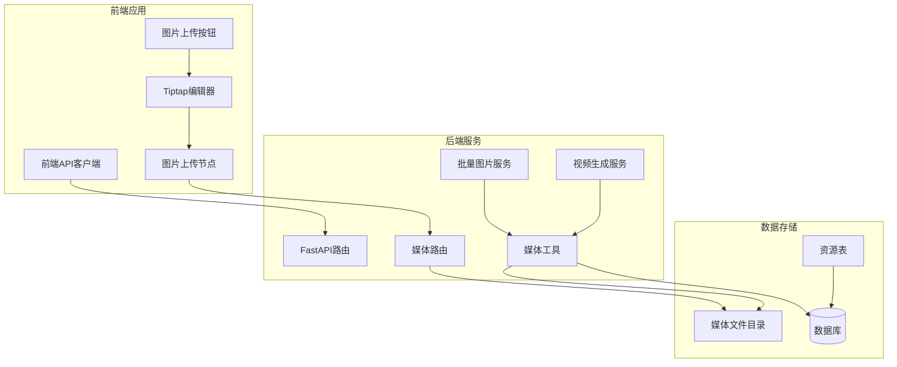
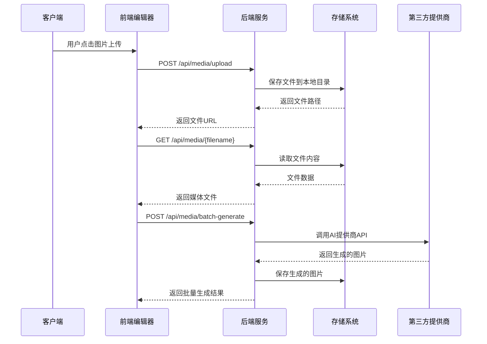
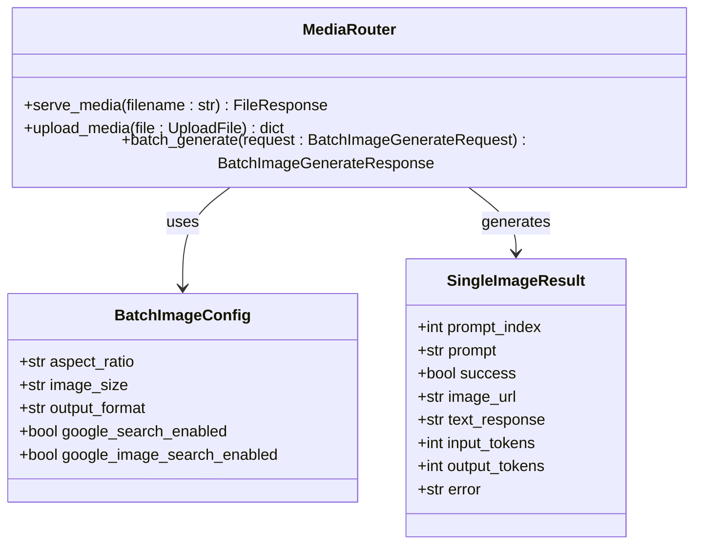
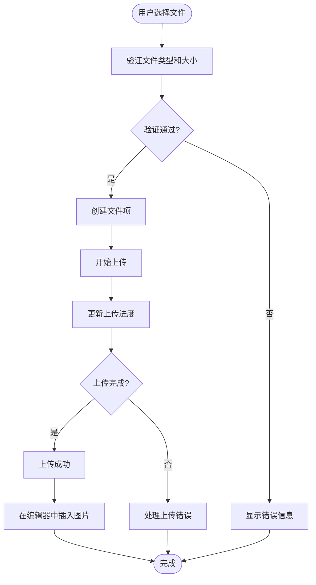
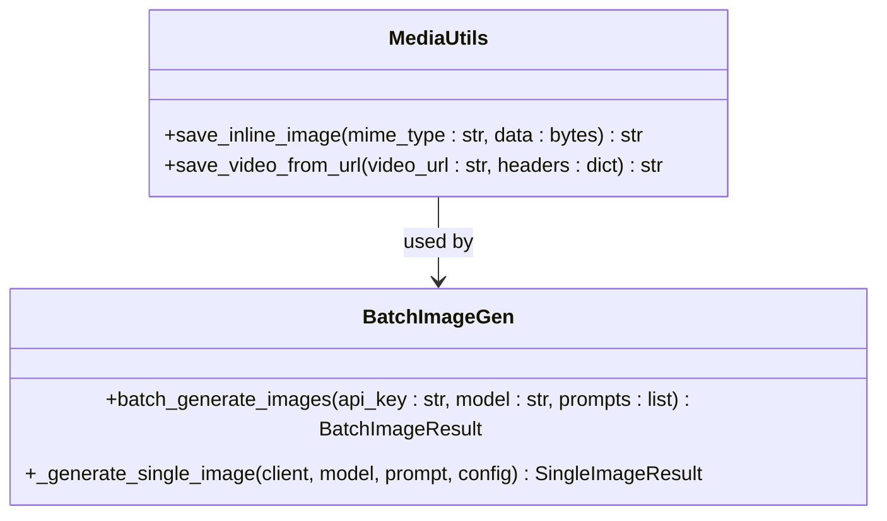
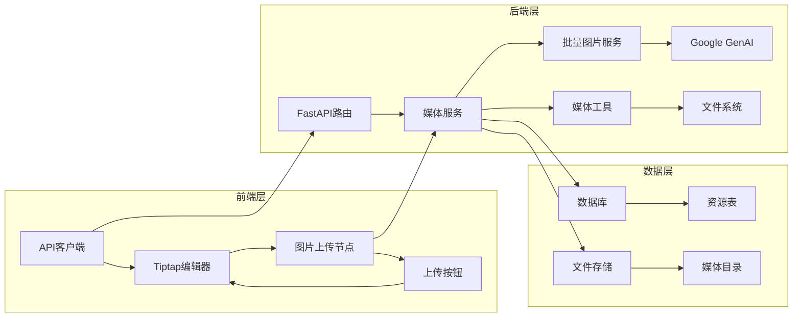

# 媒体上传系统

<cite>
**本文档引用的文件**
- [backend/routers/media.py](file://backend/routers/media.py)
- [backend/services/media_utils.py](file://backend/services/media_utils.py)
- [backend/services/batch_image_gen.py](file://backend/services/batch_image_gen.py)
- [backend/services/video_generation.py](file://backend/services/video_generation.py)
- [backend/models.py](file://backend/models.py)
- [backend/schemas.py](file://backend/schemas.py)
- [frontend/src/components/tiptap-node/image-upload-node/image-upload-node.tsx](file://frontend/src/components/tiptap-node/image-upload-node/image-upload-node.tsx)
- [frontend/src/components/tiptap-node/image-upload-node/image-upload-node-extension.ts](file://frontend/src/components/tiptap-node/image-upload-node/image-upload-node-extension.ts)
- [frontend/src/components/tiptap-ui/image-upload-button/use-image-upload.ts](file://frontend/src/components/tiptap-ui/image-upload-button/use-image-upload.ts)
- [frontend/src/lib/api.ts](file://frontend/src/lib/api.ts)
</cite>

## 目录
1. [简介](#简介)
2. [项目结构](#项目结构)
3. [核心组件](#核心组件)
4. [架构概览](#架构概览)
5. [详细组件分析](#详细组件分析)
6. [依赖关系分析](#依赖关系分析)
7. [性能考虑](#性能考虑)
8. [故障排除指南](#故障排除指南)
9. [结论](#结论)

## 简介

媒体上传系统是一个完整的多媒体内容管理解决方案，集成了后端FastAPI服务和前端Tiptap编辑器。该系统支持多种媒体格式的上传、存储、管理和批量处理功能，包括图片、视频和音频文件。

系统主要特点：
- 安全的媒体文件上传和存储机制
- 支持批量图片生成和处理
- 多供应商视频生成服务集成
- 前后端一体化的媒体编辑体验
- 完整的错误处理和日志记录

## 项目结构

媒体上传系统采用前后端分离的架构设计，主要分为以下几个核心模块：

**图表来源**
- [backend/routers/media.py:23-28](file://backend/routers/media.py#L23-L28)
- [backend/services/media_utils.py:8-28](file://backend/services/media_utils.py#L8-L28)
- [frontend/src/components/tiptap-node/image-upload-node/image-upload-node.tsx:436-555](file://frontend/src/components/tiptap-node/image-upload-node/image-upload-node.tsx#L436-L555)

**章节来源**
- [backend/routers/media.py:1-163](file://backend/routers/media.py#L1-L163)
- [backend/services/media_utils.py:1-51](file://backend/services/media_utils.py#L1-L51)
- [frontend/src/components/tiptap-node/image-upload-node/image-upload-node.tsx:1-555](file://frontend/src/components/tiptap-node/image-upload-node/image-upload-node.tsx#L1-L555)

## 核心组件

### 后端核心组件

#### 媒体路由服务
媒体路由服务提供了完整的媒体文件管理功能，包括文件上传、下载和批量处理。

#### 批量图片生成服务
专门处理多张图片的并行生成，支持配置化参数和并发控制。

#### 媒体工具库
提供通用的媒体文件操作功能，包括内联图片保存和远程视频下载。

### 前端核心组件

#### Tiptap图片上传节点
实现了富文本编辑器中的图片上传功能，支持拖拽、进度显示和错误处理。

#### 图片上传按钮
为编辑器提供快捷的图片插入功能，支持热键操作。

**章节来源**
- [backend/routers/media.py:47-88](file://backend/routers/media.py#L47-L88)
- [backend/services/batch_image_gen.py:113-187](file://backend/services/batch_image_gen.py#L113-L187)
- [backend/services/media_utils.py:20-51](file://backend/services/media_utils.py#L20-L51)
- [frontend/src/components/tiptap-node/image-upload-node/image-upload-node.tsx:436-555](file://frontend/src/components/tiptap-node/image-upload-node/image-upload-node.tsx#L436-L555)

## 架构概览

媒体上传系统采用分层架构设计，确保了良好的可维护性和扩展性：

**图表来源**
- [backend/routers/media.py:66-88](file://backend/routers/media.py#L66-L88)
- [backend/routers/media.py:91-163](file://backend/routers/media.py#L91-L163)
- [backend/services/media_utils.py:31-51](file://backend/services/media_utils.py#L31-L51)

**章节来源**
- [backend/routers/media.py:1-163](file://backend/routers/media.py#L1-L163)
- [backend/services/batch_image_gen.py:1-187](file://backend/services/batch_image_gen.py#L1-L187)
- [backend/services/media_utils.py:1-51](file://backend/services/media_utils.py#L1-L51)

## 详细组件分析

### 媒体路由系统

媒体路由系统提供了三个核心API端点：

#### 文件上传端点
支持多种媒体格式的安全上传，包括图片、视频和音频文件。

#### 文件下载端点  
提供安全的文件访问机制，包含文件名验证和缓存控制。

#### 批量图片生成端点
基于指定智能体配置并行生成多张图片，支持自定义参数和并发控制。

**图表来源**
- [backend/routers/media.py:23-28](file://backend/routers/media.py#L23-L28)
- [backend/schemas.py:438-474](file://backend/schemas.py#L438-L474)

**章节来源**
- [backend/routers/media.py:47-163](file://backend/routers/media.py#L47-L163)
- [backend/schemas.py:438-474](file://backend/schemas.py#L438-L474)

### 前端图片上传组件

前端图片上传组件提供了完整的富文本编辑器集成：

#### 文件上传管理
实现了多文件并发上传、进度跟踪和错误处理机制。

#### 拖拽区域交互
提供了直观的拖拽上传界面，支持文件预览和删除操作。

#### 编辑器集成
与Tiptap编辑器无缝集成，支持键盘快捷键和自动焦点管理。

**图表来源**
- [frontend/src/components/tiptap-node/image-upload-node/image-upload-node.tsx:85-213](file://frontend/src/components/tiptap-node/image-upload-node/image-upload-node.tsx#L85-L213)

**章节来源**
- [frontend/src/components/tiptap-node/image-upload-node/image-upload-node.tsx:1-555](file://frontend/src/components/tiptap-node/image-upload-node/image-upload-node.tsx#L1-L555)
- [frontend/src/components/tiptap-node/image-upload-node/image-upload-node-extension.ts:1-163](file://frontend/src/components/tiptap-node/image-upload-node/image-upload-node-extension.ts#L1-L163)

### 媒体工具库

媒体工具库提供了底层的媒体文件操作功能：

#### 内联图片保存
支持从base64数据保存图片到本地存储。

#### 远程视频下载
支持从URL下载视频文件并保存到本地存储。

**图表来源**
- [backend/services/media_utils.py:20-51](file://backend/services/media_utils.py#L20-L51)
- [backend/services/batch_image_gen.py:113-187](file://backend/services/batch_image_gen.py#L113-L187)

**章节来源**
- [backend/services/media_utils.py:1-51](file://backend/services/media_utils.py#L1-L51)
- [backend/services/batch_image_gen.py:1-187](file://backend/services/batch_image_gen.py#L1-L187)

## 依赖关系分析

媒体上传系统的依赖关系体现了清晰的分层架构：

**图表来源**
- [frontend/src/lib/api.ts:1-79](file://frontend/src/lib/api.ts#L1-L79)
- [backend/routers/media.py:1-163](file://backend/routers/media.py#L1-L163)
- [backend/services/batch_image_gen.py:1-187](file://backend/services/batch_image_gen.py#L1-L187)

**章节来源**
- [frontend/src/lib/api.ts:1-79](file://frontend/src/lib/api.ts#L1-L79)
- [backend/models.py:128-141](file://backend/models.py#L128-L141)

## 性能考虑

媒体上传系统在设计时充分考虑了性能优化：

### 并发控制
- 批量图片生成支持1-8的并发数配置
- 使用信号量限制同时进行的API调用
- 异步处理确保不阻塞主线程

### 缓存策略
- 文件下载包含长期缓存控制头
- 数据库查询使用适当的索引优化
- 媒体文件路径缓存减少重复计算

### 错误处理
- 完善的异常捕获和错误恢复机制
- 上传中断后的资源清理
- 超时控制和重试策略

## 故障排除指南

### 常见问题及解决方案

#### 文件上传失败
- 检查文件类型是否在支持列表中
- 验证文件大小是否超过限制
- 确认服务器磁盘空间充足

#### 图片生成错误
- 验证API密钥的有效性
- 检查模型名称的正确性
- 确认网络连接正常

#### 前端上传无响应
- 检查浏览器控制台错误信息
- 验证编辑器扩展是否正确加载
- 确认权限设置允许文件访问

**章节来源**
- [backend/routers/media.py:69-86](file://backend/routers/media.py#L69-L86)
- [backend/services/batch_image_gen.py:106-110](file://backend/services/batch_image_gen.py#L106-L110)

## 结论

媒体上传系统是一个功能完整、架构清晰的多媒体内容管理解决方案。系统通过前后端的紧密协作，为用户提供了流畅的媒体上传和编辑体验。其设计特点包括：

- **安全性**：严格的文件名验证和访问控制
- **可扩展性**：模块化的服务架构支持功能扩展
- **可靠性**：完善的错误处理和监控机制
- **用户体验**：直观的界面和流畅的操作流程

该系统为后续的功能扩展奠定了良好的基础，可以轻松集成更多媒体处理能力和第三方服务。