# 包依赖关系

<cite>
**本文档中引用的文件**
- [frontend/package.json](file://frontend/package.json)
- [backend/requirements.txt](file://backend/requirements.txt)
- [backend/main.py](file://backend/main.py)
- [backend/config.py](file://backend/config.py)
- [backend/database.py](file://backend/database.py)
- [backend/models.py](file://backend/models.py)
- [backend/schemas.py](file://backend/schemas.py)
- [backend/auth.py](file://backend/auth.py)
- [backend/routers/admin.py](file://backend/routers/admin.py)
- [backend/routers/agents.py](file://backend/routers/agents.py)
- [backend/services/__init__.py](file://backend/services/__init__.py)
- [frontend/src/lib/api.ts](file://frontend/src/lib/api.ts)
</cite>

## 目录
1. [简介](#简介)
2. [项目结构概览](#项目结构概览)
3. [核心组件依赖分析](#核心组件依赖分析)
4. [前后端依赖关系](#前后端依赖关系)
5. [数据库依赖关系](#数据库依赖关系)
6. [AI服务依赖关系](#ai服务依赖关系)
7. [认证授权依赖关系](#认证授权依赖关系)
8. [工具和服务依赖关系](#工具和服务依赖关系)
9. [性能考虑](#性能考虑)
10. [故障排除指南](#故障排除指南)
11. [结论](#结论)

## 简介

本文件详细分析了Infinite Game项目的包依赖关系，包括前后端技术栈、数据库设计、AI服务集成、认证授权机制以及整体架构依赖。该项目采用FastAPI作为后端框架，Next.js作为前端框架，结合多种AI服务提供商，构建了一个功能完整的创意内容生成平台。

## 项目结构概览

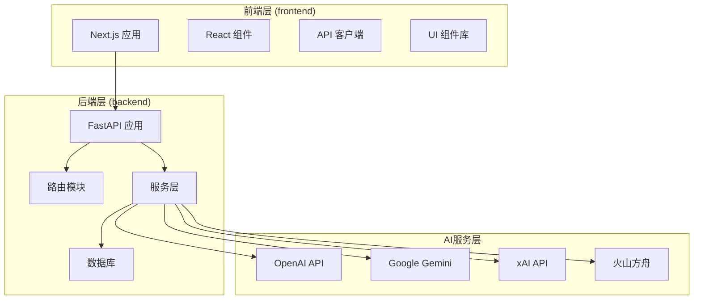

**图表来源**
- [backend/main.py:110-158](file://backend/main.py#L110-L158)
- [frontend/package.json:13-71](file://frontend/package.json#L13-L71)

## 核心组件依赖分析

### 后端核心依赖

后端主要依赖包括：

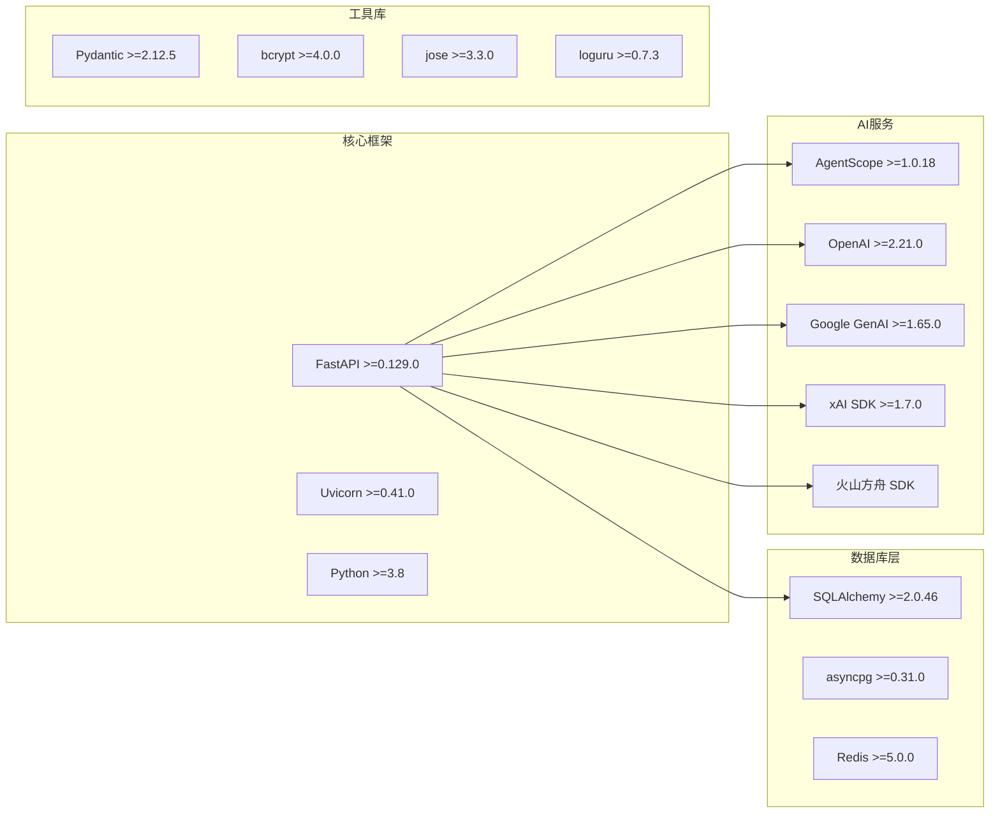

**图表来源**
- [backend/requirements.txt:1-29](file://backend/requirements.txt#L1-L29)

### 前端核心依赖

前端主要依赖包括：

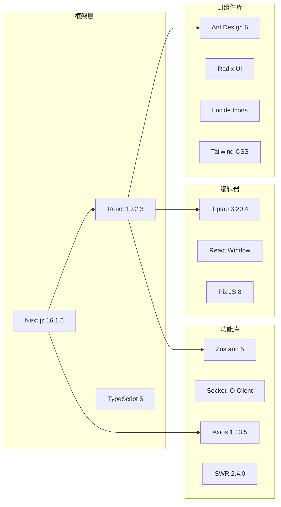

**图表来源**
- [frontend/package.json:13-71](file://frontend/package.json#L13-L71)

**章节来源**
- [backend/requirements.txt:1-29](file://backend/requirements.txt#L1-L29)
- [frontend/package.json:13-71](file://frontend/package.json#L13-L71)

## 前后端依赖关系

### API通信依赖

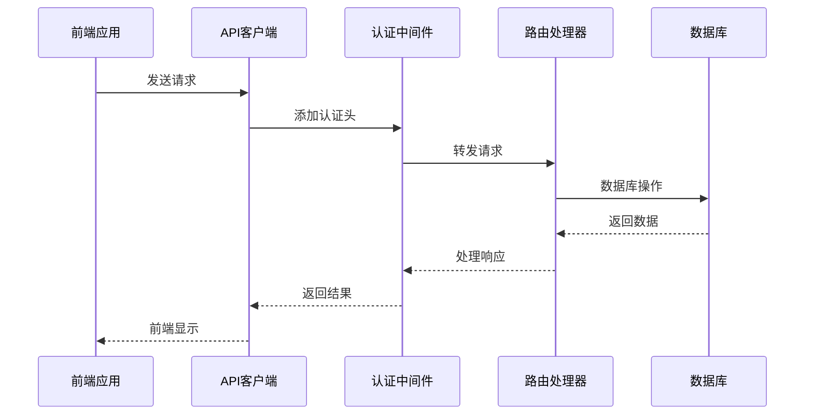

**图表来源**
- [frontend/src/lib/api.ts:8-17](file://frontend/src/lib/api.ts#L8-L17)
- [backend/main.py:130-141](file://backend/main.py#L130-L141)

### 路由依赖关系

后端采用模块化路由设计，各路由模块相互独立但共享基础依赖：

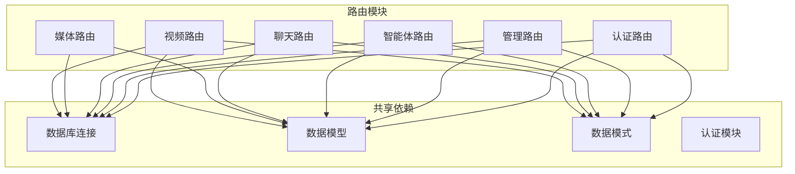

**图表来源**
- [backend/main.py:41-158](file://backend/main.py#L41-L158)
- [backend/routers/admin.py:1-23](file://backend/routers/admin.py#L1-L23)
- [backend/routers/agents.py:1-14](file://backend/routers/agents.py#L1-L14)

**章节来源**
- [backend/main.py:41-158](file://backend/main.py#L41-L158)
- [frontend/src/lib/api.ts:1-84](file://frontend/src/lib/api.ts#L1-L84)

## 数据库依赖关系

### 数据模型依赖图

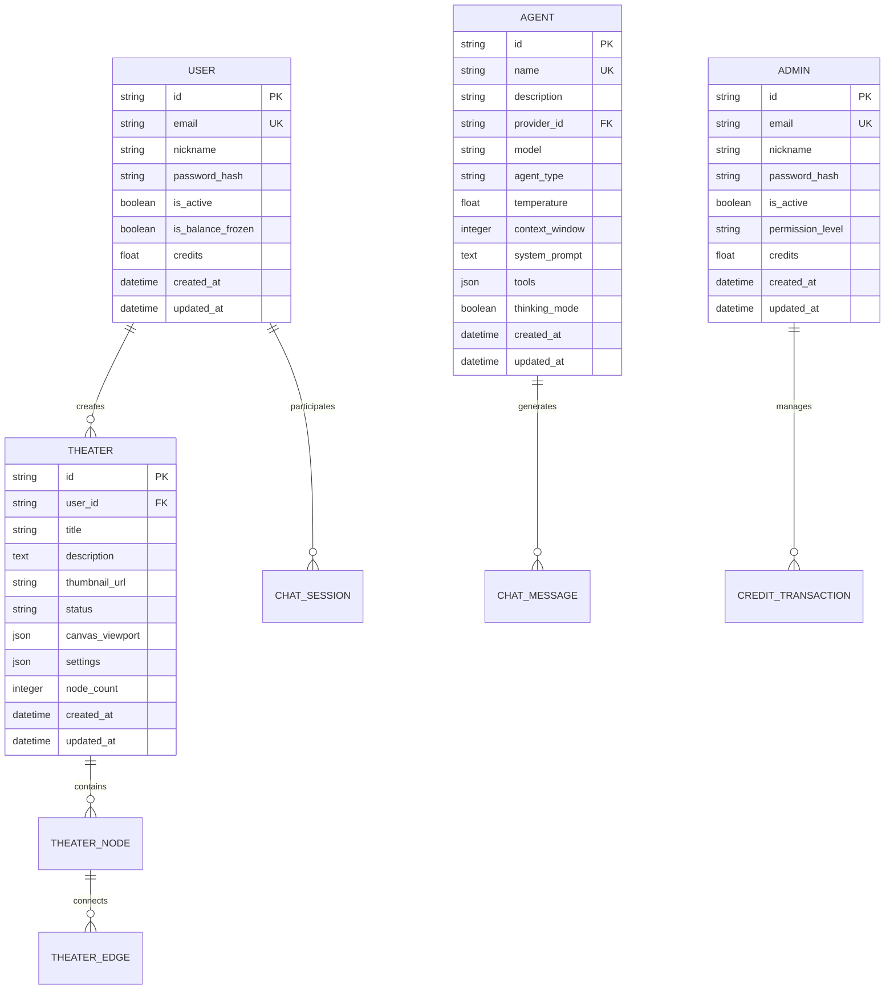

**图表来源**
- [backend/models.py:35-150](file://backend/models.py#L35-L150)
- [backend/models.py:210-273](file://backend/models.py#L210-L273)
- [backend/models.py:75-130](file://backend/models.py#L75-L130)

### 数据库连接配置

后端使用异步数据库连接，支持SQLite和PostgreSQL：

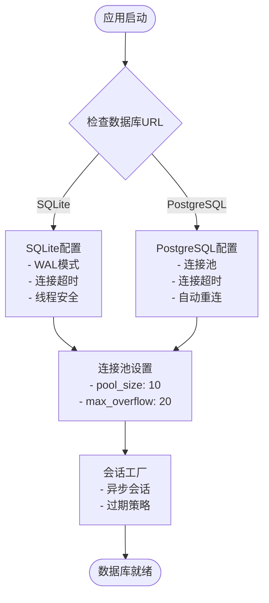

**图表来源**
- [backend/database.py:9-37](file://backend/database.py#L9-L37)
- [backend/config.py:14-16](file://backend/config.py#L14-L16)

**章节来源**
- [backend/models.py:1-503](file://backend/models.py#L1-L503)
- [backend/database.py:1-45](file://backend/database.py#L1-L45)
- [backend/config.py:1-43](file://backend/config.py#L1-L43)

## AI服务依赖关系

### AI服务提供商集成

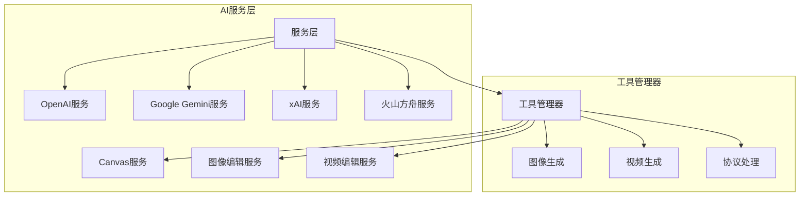

**图表来源**
- [backend/services/__init__.py:1-16](file://backend/services/__init__.py#L1-L16)

### 服务初始化流程

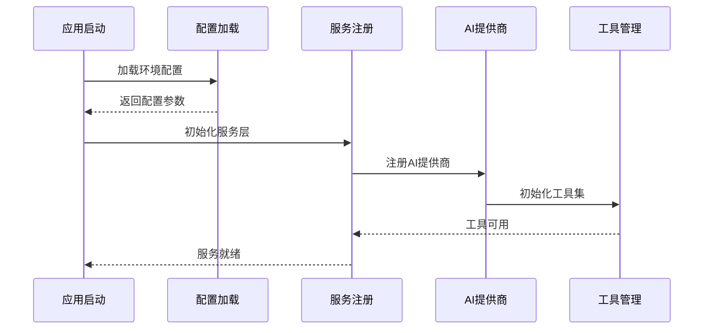

**图表来源**
- [backend/main.py:49-108](file://backend/main.py#L49-L108)

**章节来源**
- [backend/services/__init__.py:1-16](file://backend/services/__init__.py#L1-L16)
- [backend/main.py:49-108](file://backend/main.py#L49-L108)

## 认证授权依赖关系

### 认证流程依赖

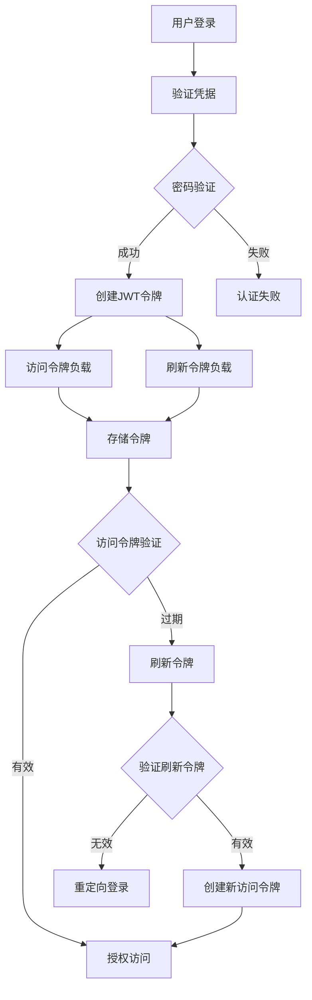

**图表来源**
- [backend/auth.py:30-62](file://backend/auth.py#L30-L62)
- [backend/auth.py:83-113](file://backend/auth.py#L83-L113)

### 权限管理依赖

后端实现多层次权限控制：

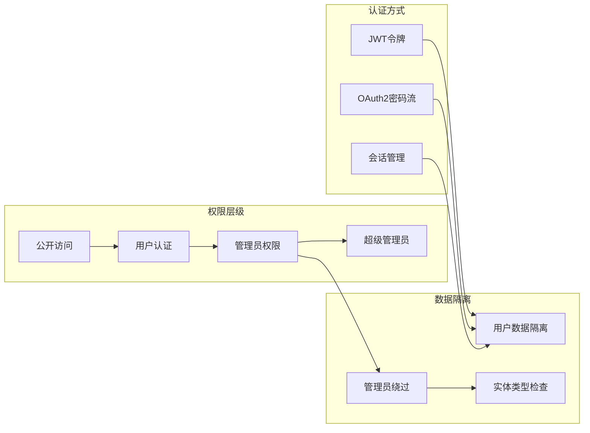

**图表来源**
- [backend/auth.py:154-156](file://backend/auth.py#L154-L156)
- [backend/auth.py:221-229](file://backend/auth.py#L221-L229)

**章节来源**
- [backend/auth.py:1-229](file://backend/auth.py#L1-L229)

## 工具和服务依赖关系

### 服务模块依赖

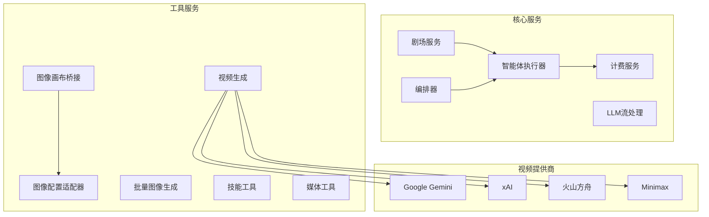

**图表来源**
- [backend/services/__init__.py:1-16](file://backend/services/__init__.py#L1-L16)

### 工具管理器架构

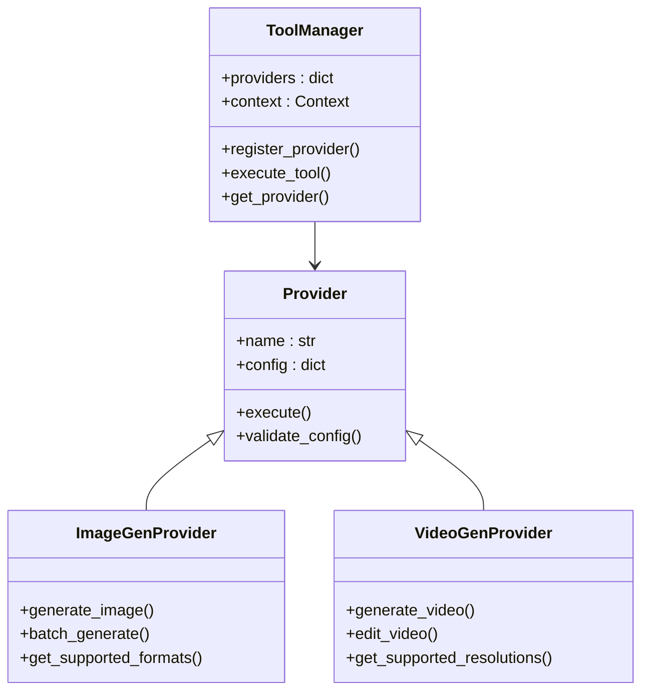

**图表来源**
- [backend/services/__init__.py:1-16](file://backend/services/__init__.py#L1-L16)

**章节来源**
- [backend/services/__init__.py:1-16](file://backend/services/__init__.py#L1-L16)

## 性能考虑

### 数据库性能优化

后端采用多项性能优化策略：

1. **连接池配置**：SQLite使用WAL模式，PostgreSQL配置连接池参数
2. **异步操作**：所有数据库操作使用异步模式
3. **连接超时**：合理设置连接超时时间
4. **自动重连**：启用连接池预检测

### 缓存策略

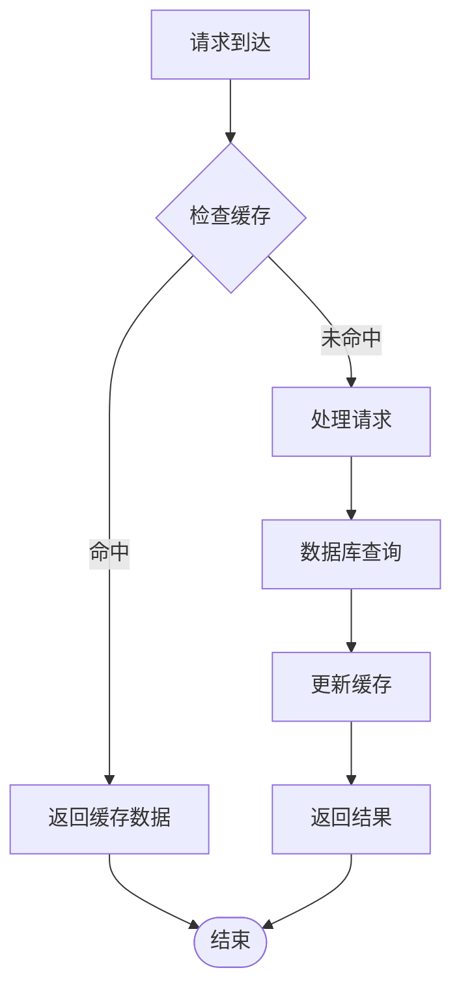

### 并发处理

前端使用以下并发处理机制：
- **SWR缓存**：智能缓存和重新验证
- **Zustand状态管理**：高性能状态管理
- **React Suspense**：异步数据加载

## 故障排除指南

### 常见依赖问题

1. **数据库连接失败**
   - 检查DATABASE_URL配置
   - 验证SQLite文件权限
   - 确认PostgreSQL服务状态

2. **AI服务调用失败**
   - 验证API密钥配置
   - 检查网络连接
   - 确认服务可用性

3. **认证问题**
   - 检查JWT密钥配置
   - 验证令牌过期时间
   - 确认用户状态

### 调试工具

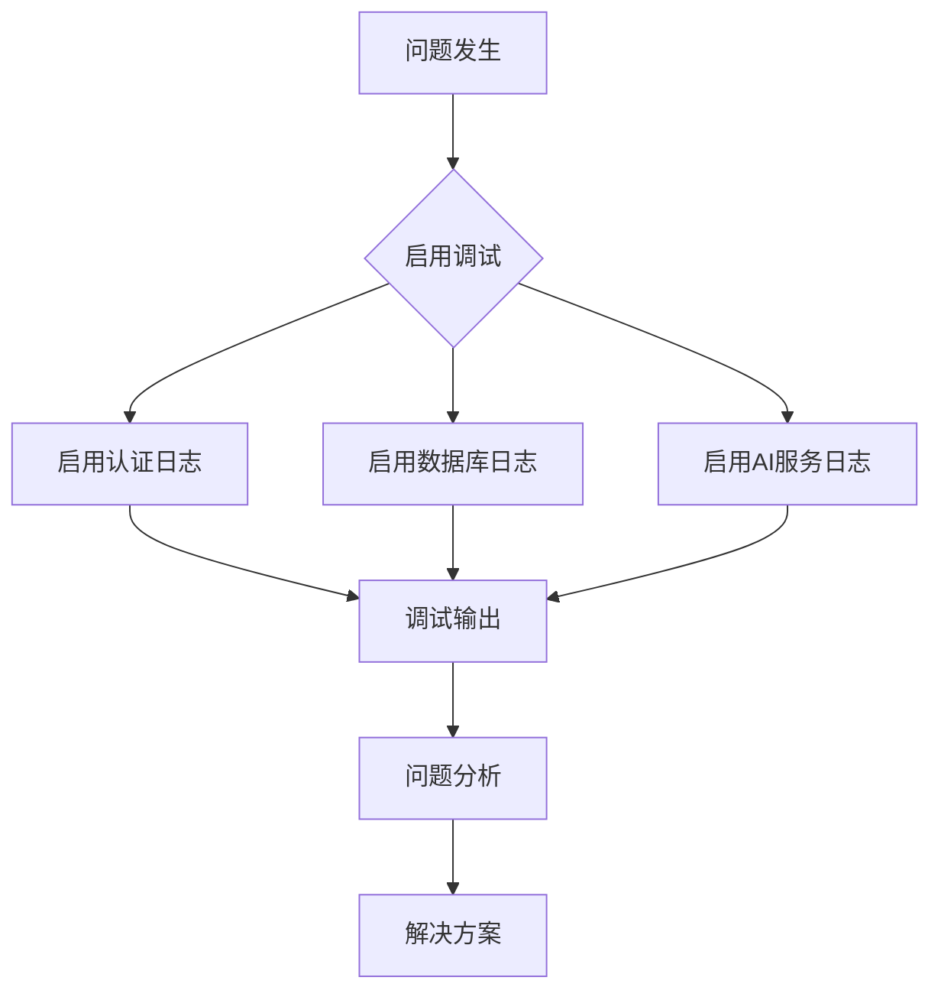

**章节来源**
- [backend/main.py:115-128](file://backend/main.py#L115-L128)
- [backend/database.py:24-31](file://backend/database.py#L24-L31)

## 结论

Infinite Game项目的包依赖关系展现了现代全栈应用的最佳实践：

1. **清晰的分层架构**：前后端分离，模块化设计
2. **强大的AI集成**：支持多家AI服务提供商
3. **完善的认证体系**：多层次权限控制
4. **高性能设计**：异步处理，连接池优化
5. **可扩展性**：模块化服务架构

通过合理的依赖管理和架构设计，该项目为创意内容生成提供了稳定可靠的技术基础。