# 规划面板设计指南

<cite>
**本文档引用的文件**
- [AIAssistantPanel.tsx](file://frontend/src/components/canvas/AIAssistantPanel.tsx)
- [Sidebar.tsx](file://frontend/src/components/canvas/Sidebar.tsx)
- [useAIAssistantStore.ts](file://frontend/src/store/useAIAssistantStore.ts)
- [PanelHeader.tsx](file://frontend/src/components/ai-assistant/PanelHeader.tsx)
- [MessageInput.tsx](file://frontend/src/components/ai-assistant/MessageInput.tsx)
- [ZoomControls.tsx](file://frontend/src/components/canvas/ZoomControls.tsx)
- [page.tsx](file://frontend/src/app/theater/[id]/page.tsx)
- [PivotEditor.tsx](file://frontend/src/components/canvas/pivot/PivotEditor.tsx)
- [CanvasHelp.tsx](file://frontend/src/components/canvas/CanvasHelp.tsx)
- [WelcomeMessage.tsx](file://frontend/src/components/ai-assistant/WelcomeMessage.tsx)
- [index.ts](file://frontend/src/components/ai-assistant/index.ts)
</cite>

## 目录
1. [简介](#简介)
2. [项目结构概览](#项目结构概览)
3. [核心组件分析](#核心组件分析)
4. [架构设计](#架构设计)
5. [详细组件设计](#详细组件设计)
6. [交互流程分析](#交互流程分析)
7. [性能优化策略](#性能优化策略)
8. [故障排除指南](#故障排除指南)
9. [总结](#总结)

## 简介

规划面板是无限游戏项目中的核心创作工具，它提供了一个集成了AI助手、节点库、资源管理和可视化编辑功能的综合平台。该系统采用现代化的React技术栈，结合Zustand状态管理、Framer Motion动画库和React Flow图形框架，为用户提供流畅的创作体验。

系统的主要目标是：
- 提供直观的节点拖拽和连接功能
- 集成AI智能助手进行内容创作和编辑
- 支持多种媒体类型的资源管理
- 实现高效的可视化数据透视分析
- 提供完整的创作工作流程支持

## 项目结构概览

前端项目采用模块化的组织结构，主要分为以下几个核心部分：

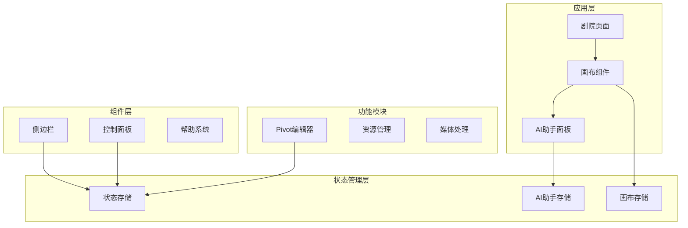

**图表来源**
- [page.tsx:1-200](file://frontend/src/app/theater/[id]/page.tsx#L1-L200)
- [AIAssistantPanel.tsx:1-633](file://frontend/src/components/canvas/AIAssistantPanel.tsx#L1-L633)

**章节来源**
- [page.tsx:1-200](file://frontend/src/app/theater/[id]/page.tsx#L1-L200)
- [Sidebar.tsx:1-340](file://frontend/src/components/canvas/Sidebar.tsx#L1-L340)

## 核心组件分析

### AI助手面板组件

AI助手面板是整个规划系统的核心组件，提供了完整的对话式AI交互功能：

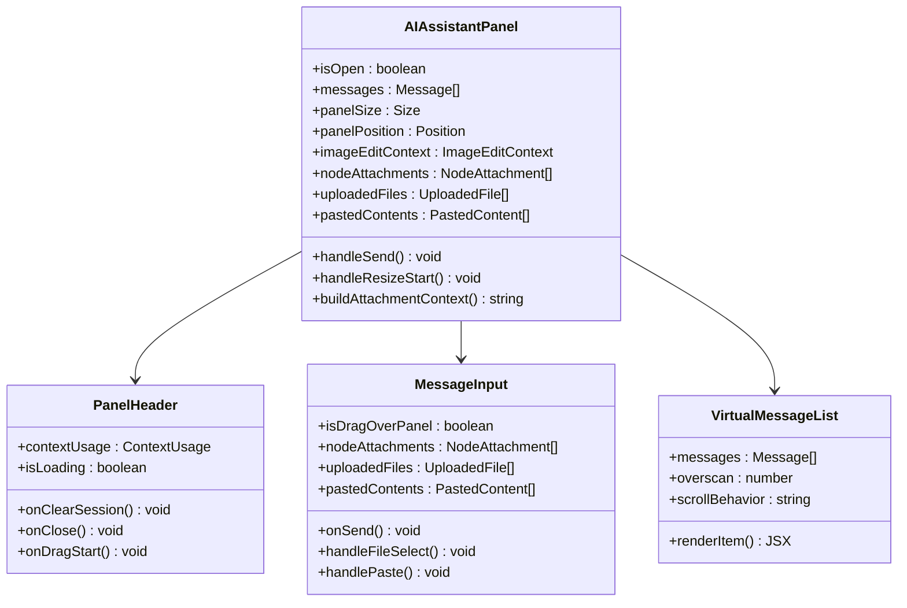

**图表来源**
- [AIAssistantPanel.tsx:51-633](file://frontend/src/components/canvas/AIAssistantPanel.tsx#L51-L633)
- [PanelHeader.tsx:20-74](file://frontend/src/components/ai-assistant/PanelHeader.tsx#L20-L74)
- [MessageInput.tsx:295-721](file://frontend/src/components/ai-assistant/MessageInput.tsx#L295-L721)

### 状态管理系统

系统采用Zustand实现高效的状态管理：

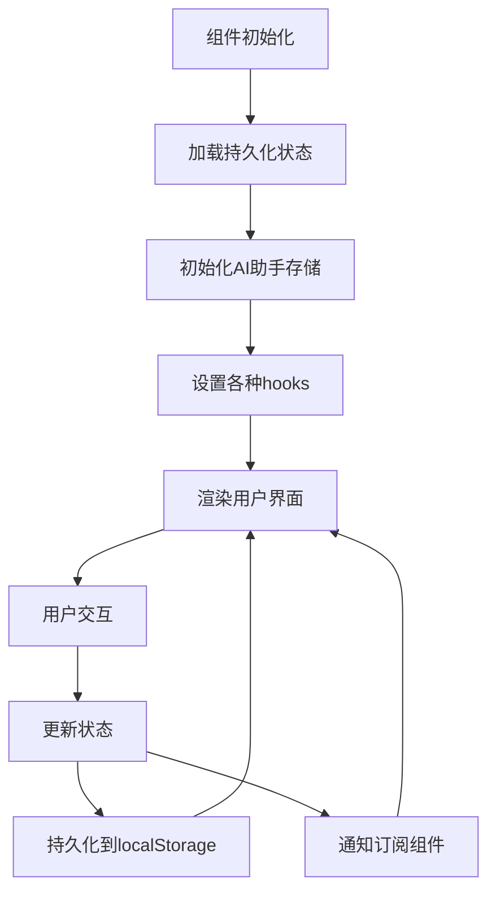

**图表来源**
- [useAIAssistantStore.ts:247-449](file://frontend/src/store/useAIAssistantStore.ts#L247-L449)

**章节来源**
- [AIAssistantPanel.tsx:51-633](file://frontend/src/components/canvas/AIAssistantPanel.tsx#L51-L633)
- [useAIAssistantStore.ts:1-449](file://frontend/src/store/useAIAssistantStore.ts#L1-L449)

## 架构设计

### 整体架构模式

系统采用组件化架构，结合观察者模式和状态管理模式：

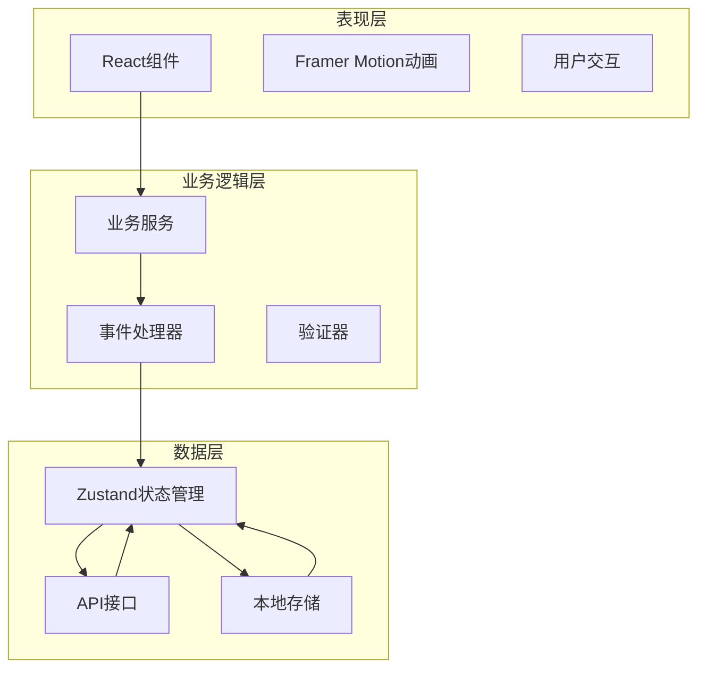

### 数据流设计

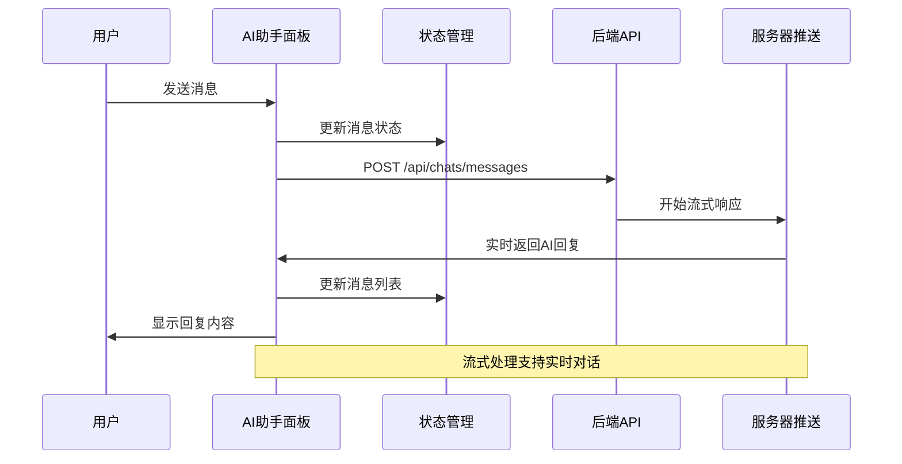

**图表来源**
- [AIAssistantPanel.tsx:209-317](file://frontend/src/components/canvas/AIAssistantPanel.tsx#L209-L317)

**章节来源**
- [AIAssistantPanel.tsx:209-317](file://frontend/src/components/canvas/AIAssistantPanel.tsx#L209-L317)
- [page.tsx:811-844](file://frontend/src/app/theater/[id]/page.tsx#L811-L844)

## 详细组件设计

### 侧边栏组件设计

侧边栏提供了节点库和资源库的统一访问入口：

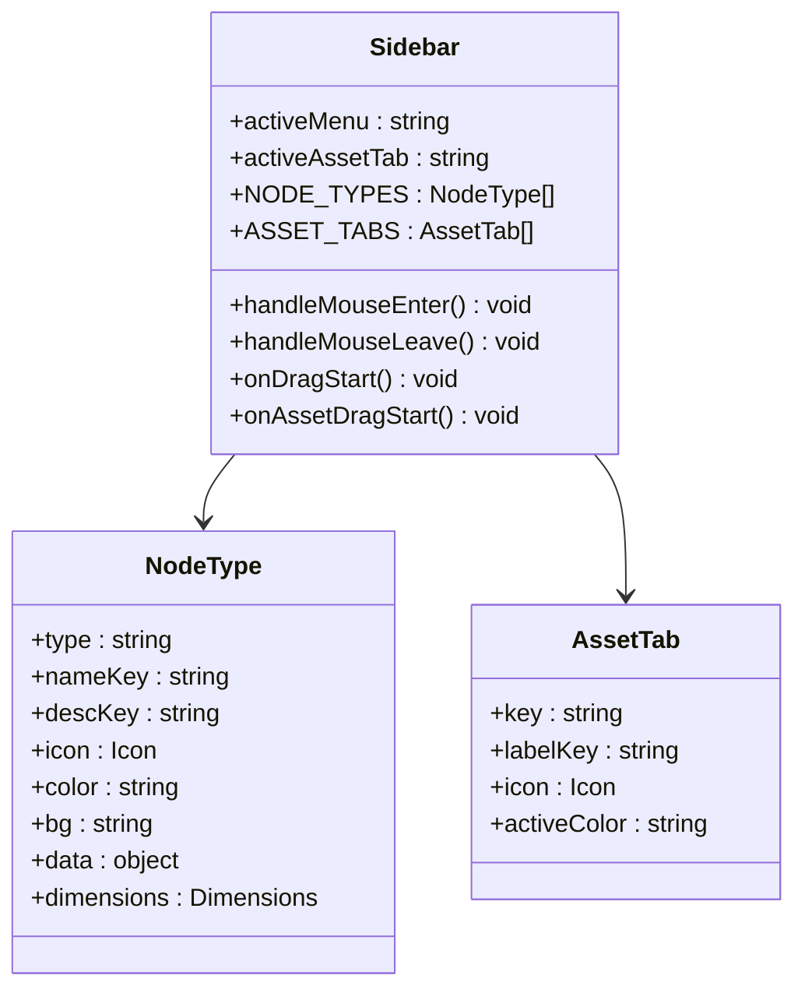

**图表来源**
- [Sidebar.tsx:74-340](file://frontend/src/components/canvas/Sidebar.tsx#L74-L340)

### Pivot编辑器设计

Pivot编辑器提供了强大的数据透视分析功能：

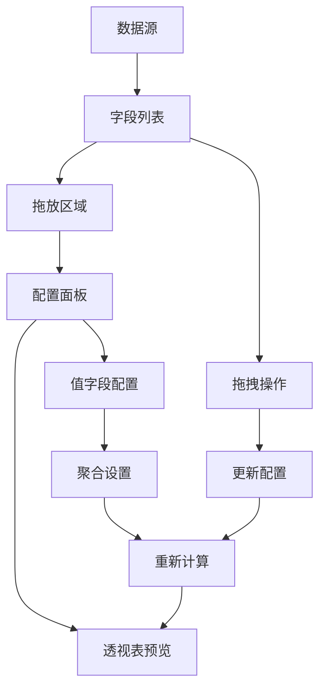

**图表来源**
- [PivotEditor.tsx:22-229](file://frontend/src/components/canvas/pivot/PivotEditor.tsx#L22-L229)

**章节来源**
- [Sidebar.tsx:10-51](file://frontend/src/components/canvas/Sidebar.tsx#L10-L51)
- [PivotEditor.tsx:1-229](file://frontend/src/components/canvas/pivot/PivotEditor.tsx#L1-L229)

### 控制面板设计

控制面板集成了画布导航和辅助功能：

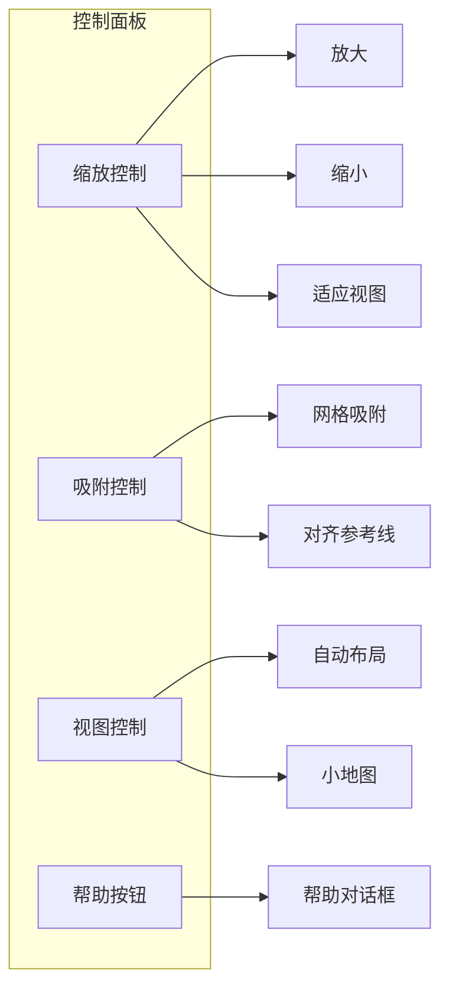

**图表来源**
- [ZoomControls.tsx:7-130](file://frontend/src/components/canvas/ZoomControls.tsx#L7-L130)

**章节来源**
- [ZoomControls.tsx:1-130](file://frontend/src/components/canvas/ZoomControls.tsx#L1-L130)
- [CanvasHelp.tsx:63-200](file://frontend/src/components/canvas/CanvasHelp.tsx#L63-L200)

## 交互流程分析

### 节点拖拽交互流程

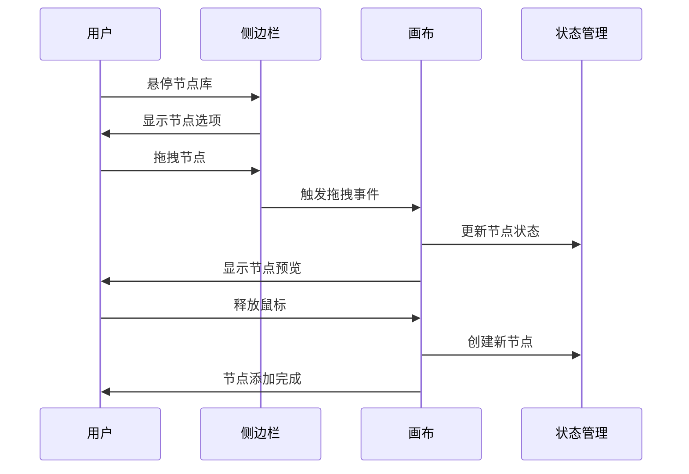

### AI对话交互流程

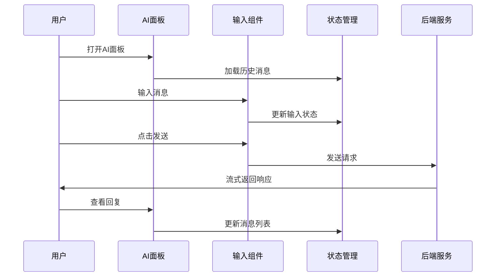

**图表来源**
- [AIAssistantPanel.tsx:209-317](file://frontend/src/components/canvas/AIAssistantPanel.tsx#L209-L317)

**章节来源**
- [AIAssistantPanel.tsx:209-317](file://frontend/src/components/canvas/AIAssistantPanel.tsx#L209-L317)
- [MessageInput.tsx:444-464](file://frontend/src/components/ai-assistant/MessageInput.tsx#L444-L464)

## 性能优化策略

### 虚拟滚动优化

系统实现了高效的虚拟滚动机制来处理大量消息：

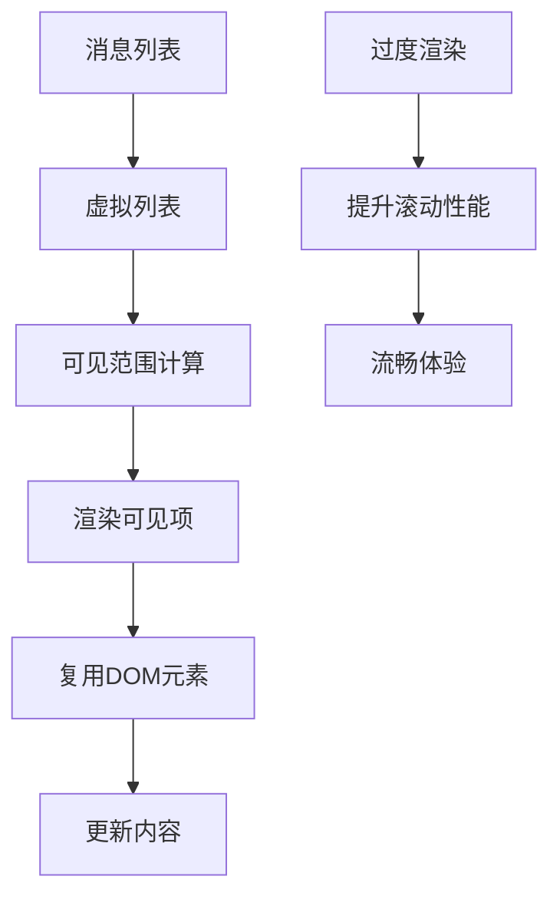

### 状态管理优化

采用分层状态管理策略：

1. **局部状态**：组件内部的临时状态
2. **全局状态**：跨组件共享的状态
3. **持久化状态**：需要保存到本地存储的状态

### 动画性能优化

使用Framer Motion实现高性能动画：

- 使用transform属性而非改变布局属性
- 合理使用will-change属性
- 避免在动画过程中触发重排

## 故障排除指南

### 常见问题及解决方案

#### AI助手无法连接

**症状**：AI助手面板无法接收回复或显示错误

**可能原因**：
1. 网络连接问题
2. Token过期
3. 会话状态异常

**解决步骤**：
1. 检查网络连接状态
2. 刷新页面重新登录
3. 清除浏览器缓存
4. 检查API服务状态

#### 节点拖拽失效

**症状**：无法从侧边栏拖拽节点到画布

**可能原因**：
1. 拖拽事件未正确绑定
2. 画布区域未正确响应
3. 权限问题

**解决步骤**：
1. 检查浏览器控制台错误
2. 确认React Flow版本兼容性
3. 验证拖拽事件监听器
4. 检查CSS样式冲突

#### Pivot编辑器无响应

**症状**：Pivot编辑器无法更新或显示错误

**可能原因**：
1. 数据源格式不正确
2. 配置参数错误
3. 内存泄漏

**解决步骤**：
1. 验证数据源结构
2. 检查配置参数有效性
3. 清理内存缓存
4. 重启编辑器

**章节来源**
- [AIAssistantPanel.tsx:202-207](file://frontend/src/components/canvas/AIAssistantPanel.tsx#L202-L207)
- [Sidebar.tsx:104-127](file://frontend/src/components/canvas/Sidebar.tsx#L104-L127)

## 总结

规划面板设计指南涵盖了无限游戏项目中AI驱动的创作工具系统的完整设计思路和技术实现。系统通过模块化的设计、高效的状态管理和丰富的交互功能，为用户提供了直观而强大的创作体验。

关键设计特点包括：

1. **组件化架构**：清晰的组件层次结构，便于维护和扩展
2. **状态管理**：基于Zustand的轻量级状态管理方案
3. **性能优化**：虚拟滚动、动画优化等多重性能策略
4. **用户体验**：流畅的交互流程和直观的操作界面
5. **可扩展性**：模块化的组件设计支持功能扩展

该设计为后续的功能扩展和性能优化奠定了坚实的基础，能够满足复杂创作场景的需求。