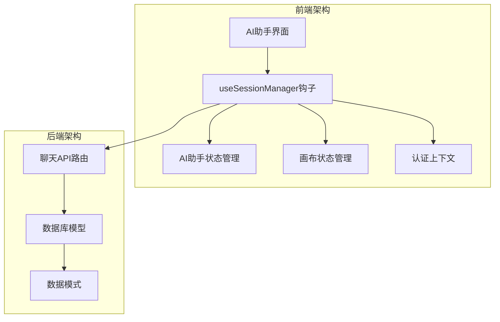
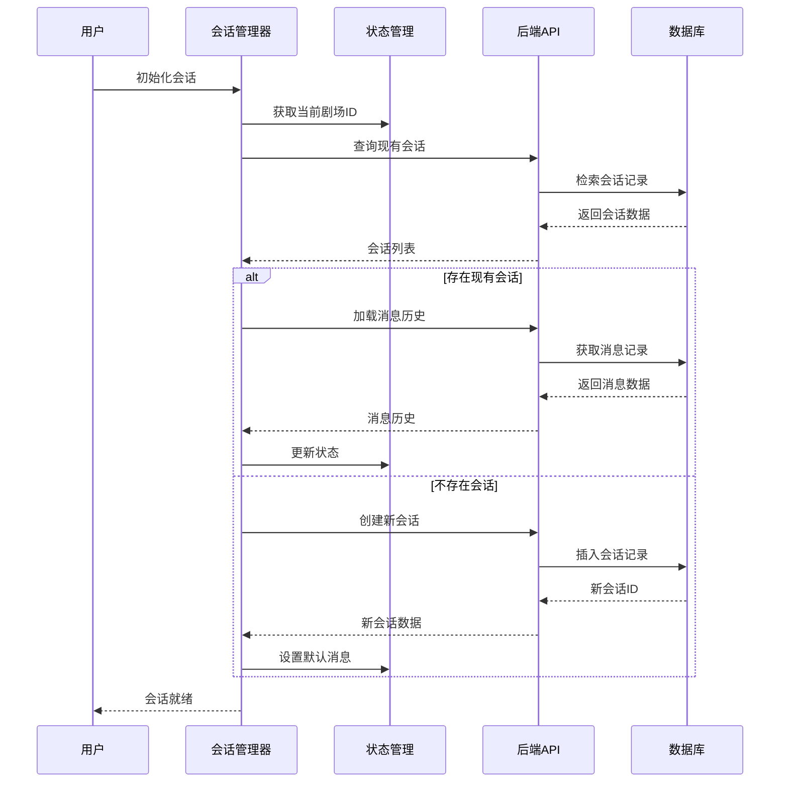
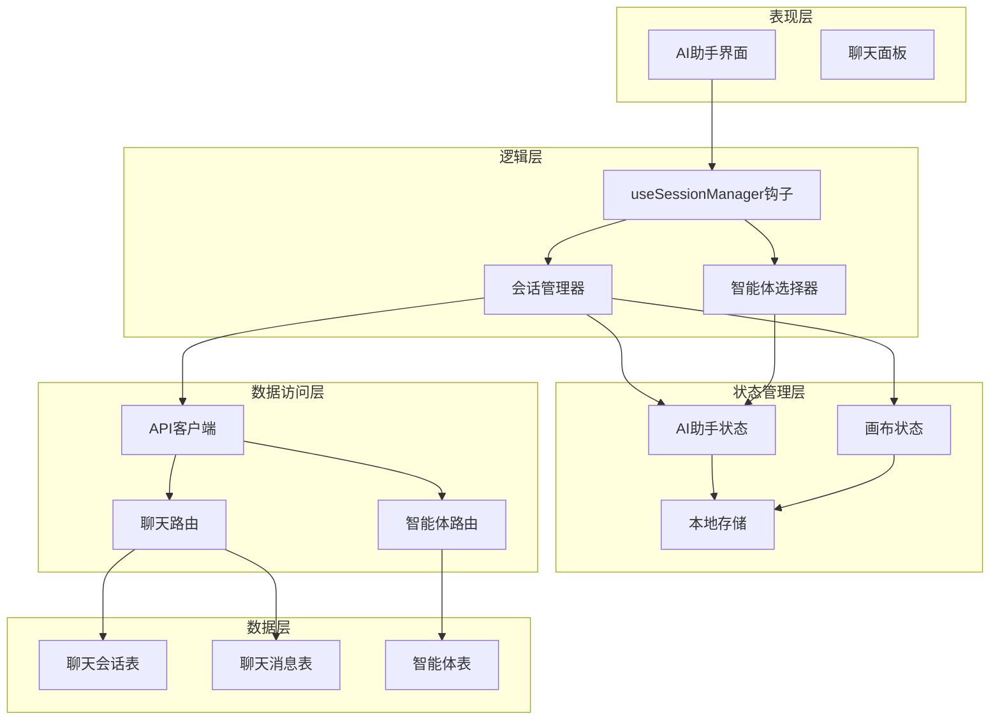
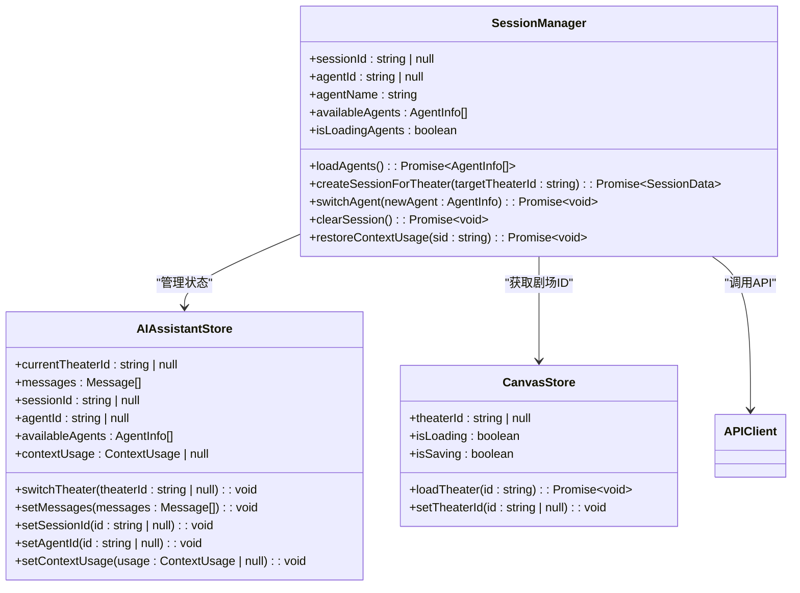
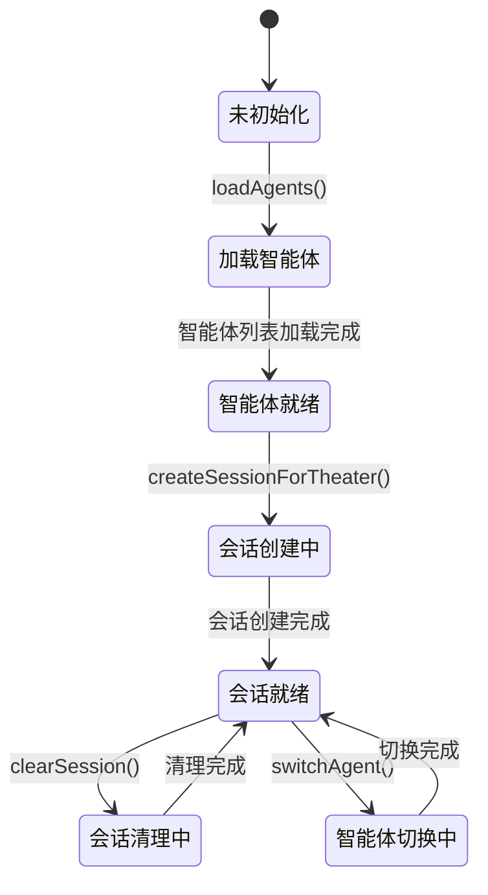
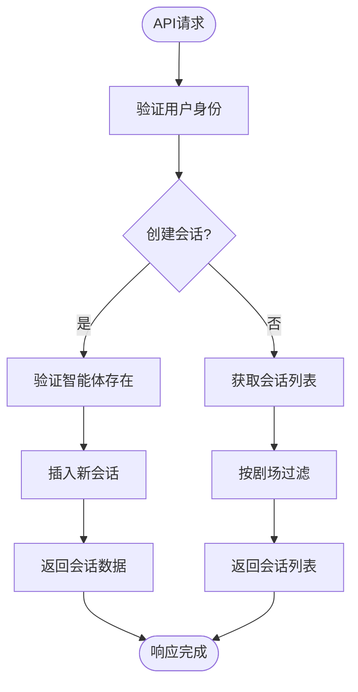
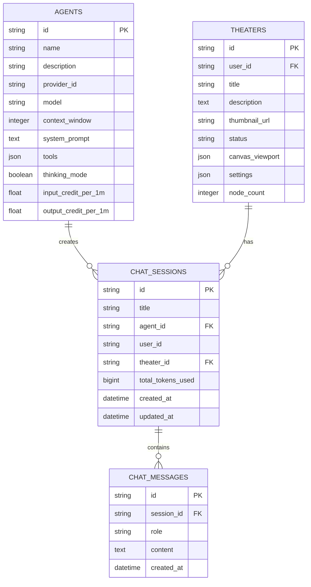
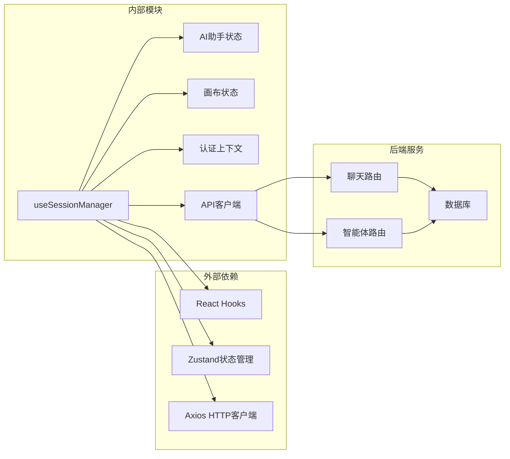
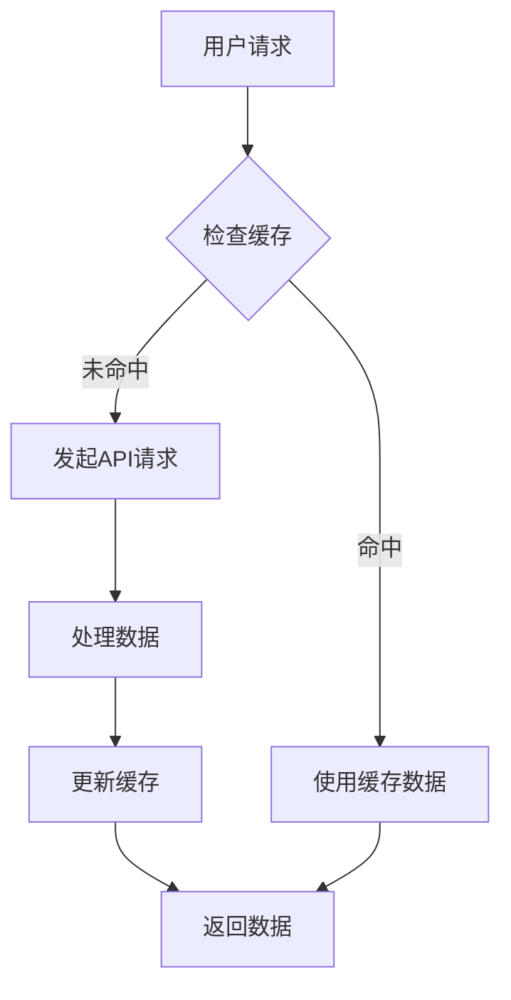

# 会话管理器钩子

<cite>
**本文档引用的文件**
- [useSessionManager.ts](file://frontend/src/components/ai-assistant/hooks/useSessionManager.ts)
- [useAIAssistantStore.ts](file://frontend/src/store/useAIAssistantStore.ts)
- [useCanvasStore.ts](file://frontend/src/store/useCanvasStore.ts)
- [AuthContext.tsx](file://frontend/src/context/AuthContext.tsx)
- [chats.py](file://backend/routers/chats.py)
- [models.py](file://backend/models.py)
- [schemas.py](file://backend/schemas.py)
- [useTheaterLoading.ts](file://frontend/src/app/theater/[id]/hooks/useTheaterLoading.ts)
</cite>

## 目录
1. [简介](#简介)
2. [项目结构](#项目结构)
3. [核心组件](#核心组件)
4. [架构概览](#架构概览)
5. [详细组件分析](#详细组件分析)
6. [依赖关系分析](#依赖关系分析)
7. [性能考虑](#性能考虑)
8. [故障排除指南](#故障排除指南)
9. [结论](#结论)

## 简介

会话管理器钩子（Session Manager Hook）是 Infinite Game 项目中的关键组件，负责管理 AI 助手面板与后端聊天会话的完整生命周期。该钩子实现了智能体选择、会话创建、消息历史恢复、上下文使用统计等功能，确保用户在不同剧场（Theater）之间切换时能够无缝继续对话。

该系统采用 React Hooks 和 Zustand 状态管理，结合 FastAPI 后端服务，提供了一个完整的会话管理解决方案。通过这个钩子，用户可以在画布环境中与 AI 进行交互，同时保持会话状态的一致性和持久性。

## 项目结构

会话管理器钩子位于前端项目的组件层中，与状态管理和后端 API 紧密集成：

**图表来源**
- [useSessionManager.ts:1-226](file://frontend/src/components/ai-assistant/hooks/useSessionManager.ts#L1-L226)
- [useAIAssistantStore.ts:1-379](file://frontend/src/store/useAIAssistantStore.ts#L1-L379)
- [useCanvasStore.ts:1-540](file://frontend/src/store/useCanvasStore.ts#L1-L540)

**章节来源**
- [useSessionManager.ts:1-226](file://frontend/src/components/ai-assistant/hooks/useSessionManager.ts#L1-L226)
- [useAIAssistantStore.ts:1-379](file://frontend/src/store/useAIAssistantStore.ts#L1-L379)
- [useCanvasStore.ts:1-540](file://frontend/src/store/useCanvasStore.ts#L1-L540)

## 核心组件

### 主要功能模块

会话管理器钩子提供了以下核心功能：

1. **智能体管理** - 加载可用智能体列表，支持智能体切换
2. **会话生命周期** - 创建、恢复、清理聊天会话
3. **消息历史** - 恢复对话历史，支持欢迎消息
4. **上下文使用统计** - 跟踪 token 使用量和上下文窗口
5. **剧场集成** - 与画布剧场系统无缝集成

### 数据流架构

**图表来源**
- [useSessionManager.ts:53-123](file://frontend/src/components/ai-assistant/hooks/useSessionManager.ts#L53-L123)
- [chats.py:25-45](file://backend/routers/chats.py#L25-L45)

**章节来源**
- [useSessionManager.ts:12-225](file://frontend/src/components/ai-assistant/hooks/useSessionManager.ts#L12-L225)

## 架构概览

会话管理器钩子采用分层架构设计，确保关注点分离和代码可维护性：

**图表来源**
- [useSessionManager.ts:1-226](file://frontend/src/components/ai-assistant/hooks/useSessionManager.ts#L1-L226)
- [useAIAssistantStore.ts:102-198](file://frontend/src/store/useAIAssistantStore.ts#L102-L198)
- [useCanvasStore.ts:67-114](file://frontend/src/store/useCanvasStore.ts#L67-L114)

## 详细组件分析

### 会话管理器钩子实现

会话管理器钩子是整个系统的核心，负责协调各个组件之间的交互：

#### 主要接口定义

**图表来源**
- [useSessionManager.ts:12-225](file://frontend/src/components/ai-assistant/hooks/useSessionManager.ts#L12-L225)
- [useAIAssistantStore.ts:102-198](file://frontend/src/store/useAIAssistantStore.ts#L102-L198)
- [useCanvasStore.ts:67-114](file://frontend/src/store/useCanvasStore.ts#L67-L114)

#### 会话创建流程

会话创建过程遵循以下步骤：

1. **检查现有会话** - 查询指定剧场的现有会话
2. **恢复会话状态** - 如果存在，恢复智能体信息和上下文使用统计
3. **加载消息历史** - 获取并解析消息历史记录
4. **创建新会话** - 如果不存在，创建新的聊天会话
5. **设置默认状态** - 初始化欢迎消息和智能体信息

**章节来源**
- [useSessionManager.ts:53-123](file://frontend/src/components/ai-assistant/hooks/useSessionManager.ts#L53-L123)

### 状态管理系统

会话管理器与两个主要的状态管理器集成：

#### AI助手状态管理

AI助手状态管理器负责维护聊天界面的所有状态：

**图表来源**
- [useAIAssistantStore.ts:233-275](file://frontend/src/store/useAIAssistantStore.ts#L233-L275)

#### 画布状态管理

画布状态管理器提供剧场级别的状态同步：

**章节来源**
- [useAIAssistantStore.ts:207-379](file://frontend/src/store/useAIAssistantStore.ts#L207-L379)
- [useCanvasStore.ts:185-540](file://frontend/src/store/useCanvasStore.ts#L185-L540)

### 后端集成

会话管理器通过 API 路由与后端服务集成：

#### 聊天会话管理

后端提供了完整的聊天会话管理功能：

**图表来源**
- [chats.py:25-68](file://backend/routers/chats.py#L25-L68)

**章节来源**
- [chats.py:1-231](file://backend/routers/chats.py#L1-L231)

### 数据模型设计

后端使用 SQLAlchemy 定义了完整的数据模型：

#### 会话和消息模型

**图表来源**
- [models.py:178-203](file://backend/models.py#L178-L203)
- [models.py:205-264](file://backend/models.py#L205-L264)

**章节来源**
- [models.py:178-264](file://backend/models.py#L178-L264)

## 依赖关系分析

会话管理器钩子的依赖关系体现了清晰的关注点分离：

**图表来源**
- [useSessionManager.ts:3-6](file://frontend/src/components/ai-assistant/hooks/useSessionManager.ts#L3-L6)
- [useAIAssistantStore.ts:1-2](file://frontend/src/store/useAIAssistantStore.ts#L1-L2)
- [useCanvasStore.ts:2-3](file://frontend/src/store/useCanvasStore.ts#L2-L3)

### 循环依赖检测

系统设计避免了循环依赖：

- **前端**：钩子 → 状态管理器 → API 客户端 → 后端路由
- **后端**：路由 → 模型 → 数据库
- **状态管理**：独立于业务逻辑

**章节来源**
- [useSessionManager.ts:1-226](file://frontend/src/components/ai-assistant/hooks/useSessionManager.ts#L1-L226)
- [useAIAssistantStore.ts:1-379](file://frontend/src/store/useAIAssistantStore.ts#L1-L379)

## 性能考虑

会话管理器在设计时考虑了多个性能方面：

### 内存优化策略

1. **状态持久化** - 使用 localStorage 持久化重要状态
2. **条件加载** - 仅在需要时加载智能体和会话数据
3. **缓存机制** - 避免重复的 API 调用

### 异步处理

### 错误处理和重试

系统实现了健壮的错误处理机制：

- **网络错误** - 自动重试和降级策略
- **认证失败** - 自动刷新令牌和重新登录
- **数据不一致** - 状态同步和恢复机制

## 故障排除指南

### 常见问题和解决方案

#### 会话恢复失败

**症状**：用户切换剧场后无法恢复之前的对话

**可能原因**：
1. 会话数据损坏或丢失
2. 用户权限不足
3. 网络连接问题

**解决步骤**：
1. 检查后端数据库连接
2. 验证用户认证状态
3. 确认会话 ID 有效性
4. 查看浏览器控制台错误信息

#### 智能体加载超时

**症状**：智能体列表长时间加载

**解决方法**：
1. 检查 API 服务器状态
2. 验证网络连接
3. 清除浏览器缓存
4. 检查智能体配置

#### 上下文使用统计异常

**症状**：token 使用量显示不正确

**排查步骤**：
1. 检查会话表中的 `total_tokens_used` 字段
2. 验证智能体的 `context_window` 配置
3. 确认消息长度计算逻辑
4. 查看后端日志中的计费记录

**章节来源**
- [useSessionManager.ts:166-189](file://frontend/src/components/ai-assistant/hooks/useSessionManager.ts#L166-L189)
- [AuthContext.tsx:172-199](file://frontend/src/context/AuthContext.tsx#L172-L199)

## 结论

会话管理器钩子是 Infinite Game 项目中设计精良的关键组件，它成功地解决了复杂状态管理、前后端集成和用户体验优化等多个挑战。通过采用现代前端架构模式和最佳实践，该系统提供了：

1. **模块化设计** - 清晰的关注点分离和职责划分
2. **可扩展性** - 易于添加新功能和集成新服务
3. **可靠性** - 健壮的错误处理和状态恢复机制
4. **性能优化** - 智能缓存和异步处理策略

该实现为类似项目提供了优秀的参考范例，展示了如何在复杂的前端应用中实现高效的会话管理功能。通过持续的优化和维护，这个系统将继续为用户提供流畅和可靠的 AI 助手体验。