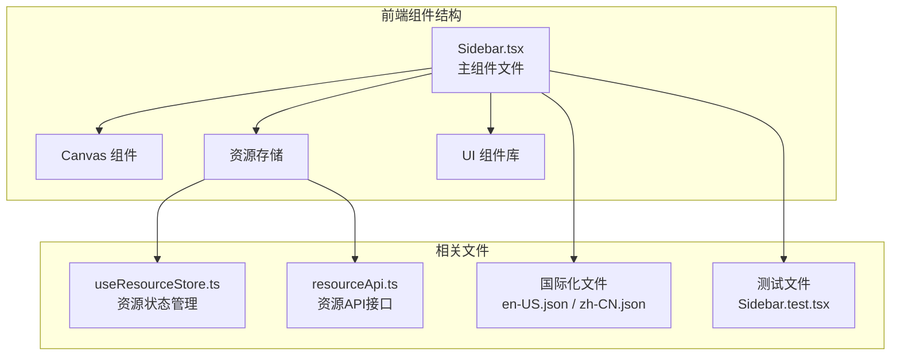
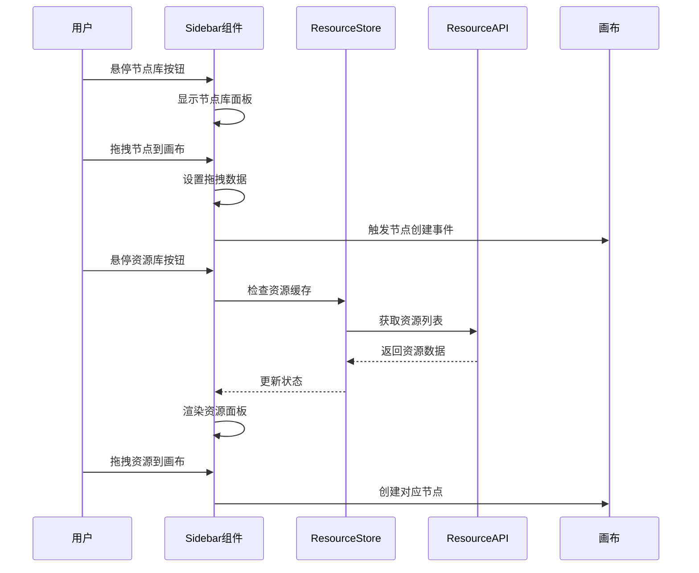
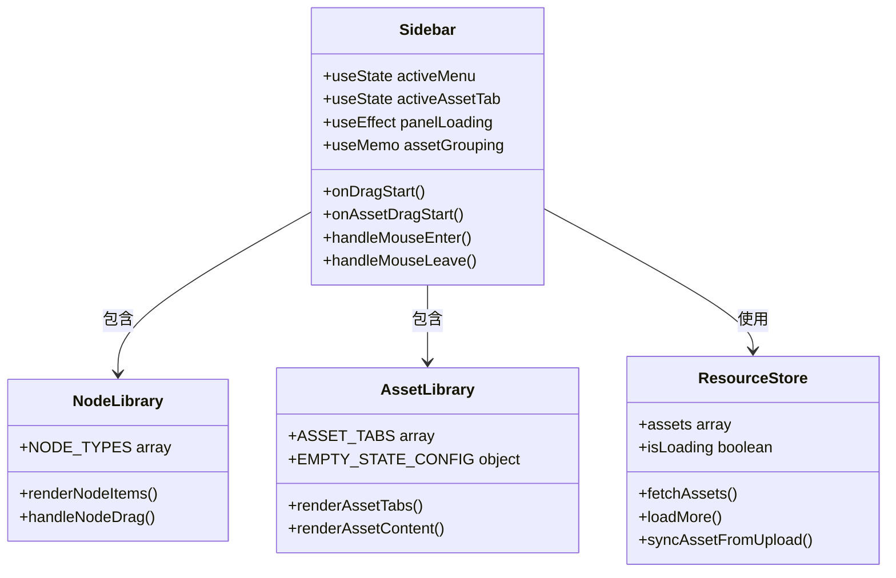
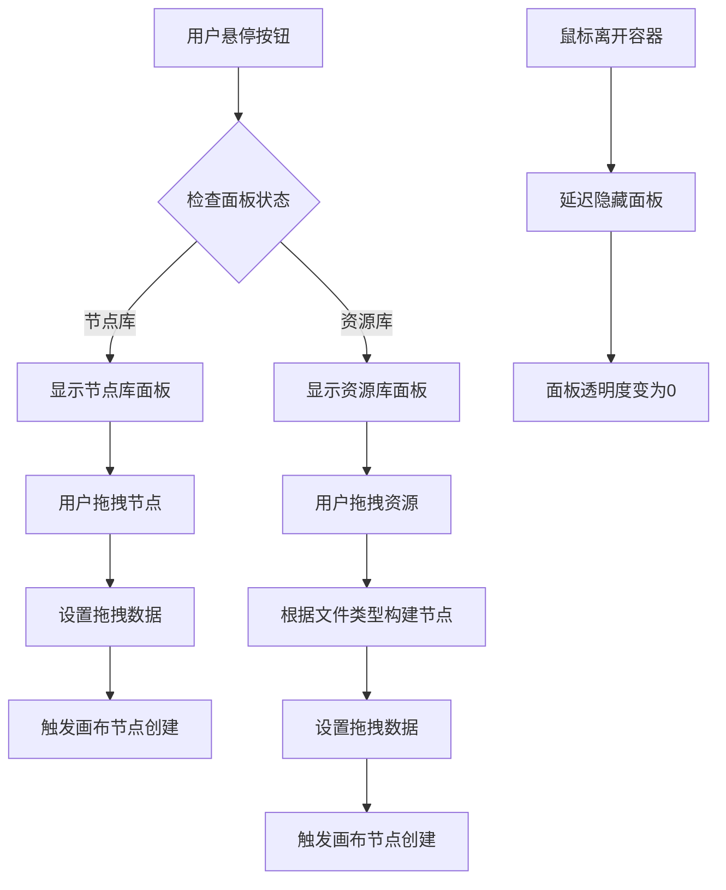
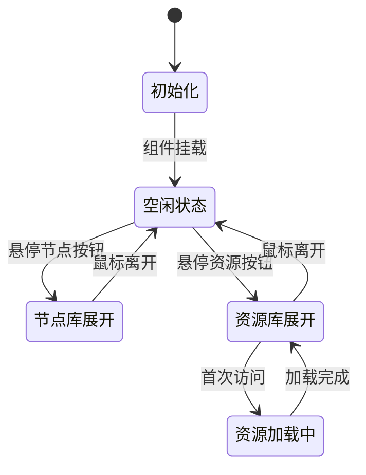
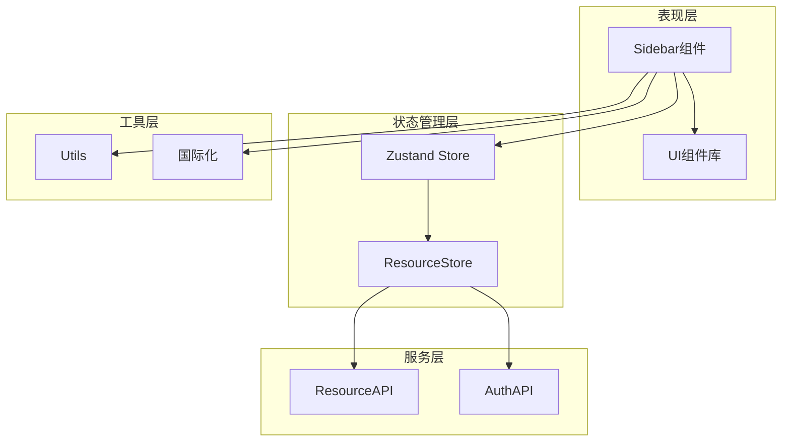

# 侧边栏组件

<cite>
**本文档引用的文件**
- [Sidebar.tsx](file://frontend/src/components/canvas/Sidebar.tsx)
- [Sidebar.test.tsx](file://frontend/src/components/canvas/__tests__/Sidebar.test.tsx)
- [useResourceStore.ts](file://frontend/src/store/useResourceStore.ts)
- [resourceApi.ts](file://frontend/src/lib/resourceApi.ts)
- [TheaterCanvas.tsx](file://frontend/src/components/TheaterCanvas.tsx)
- [en-US.json](file://frontend/src/i18n/locales/en-US.json)
- [zh-CN.json](file://frontend/src/i18n/locales/zh-CN.json)
- [utils.ts](file://frontend/src/lib/utils.ts)
- [button.tsx](file://frontend/src/components/ui/button.tsx)
- [dropdown-menu.tsx](file://frontend/src/components/ui/dropdown-menu.tsx)
</cite>

## 目录
1. [简介](#简介)
2. [项目结构](#项目结构)
3. [核心组件](#核心组件)
4. [架构概览](#架构概览)
5. [详细组件分析](#详细组件分析)
6. [依赖关系分析](#依赖关系分析)
7. [性能考虑](#性能考虑)
8. [故障排除指南](#故障排除指南)
9. [结论](#结论)

## 简介

侧边栏组件是无限游戏前端应用中的核心交互组件，为用户提供节点库和资源库的统一访问入口。该组件采用浮动式设计，位于画布左侧中央位置，提供两种主要功能：节点创建和资源管理。

组件实现了现代化的设计理念，采用毛玻璃效果、圆角设计和流畅的动画过渡，为用户提供了直观且美观的拖拽体验。通过国际化的支持，组件能够适应不同语言环境下的用户需求。

## 项目结构

侧边栏组件位于前端项目的组件层次结构中，与画布系统紧密集成：

**图表来源**
- [Sidebar.tsx:1-350](file://frontend/src/components/canvas/Sidebar.tsx#L1-L350)
- [useResourceStore.ts:1-182](file://frontend/src/store/useResourceStore.ts#L1-L182)
- [resourceApi.ts:1-109](file://frontend/src/lib/resourceApi.ts#L1-L109)

**章节来源**
- [Sidebar.tsx:1-350](file://frontend/src/components/canvas/Sidebar.tsx#L1-L350)
- [TheaterCanvas.tsx:1-50](file://frontend/src/components/TheaterCanvas.tsx#L1-L50)

## 核心组件

侧边栏组件包含两个主要的功能面板：节点库面板和资源库面板。

### 节点库功能

节点库面板提供多种类型的画布节点供用户创建：

| 节点类型 | 图标 | 描述 | 默认尺寸 |
|---------|------|------|----------|
| 文本卡 | 📝 | 剧本、广告、文案 | 420×320 |
| 图片卡 | 🖼️ | 角色、场景、海报 | 512×384 |
| 视频卡 | 🎥 | 动画、短片、媒体 | 512×384 |
| 音频卡 | 🎵 | 音乐、音效、语音 | 360×200 |
| 多维表格卡 | 📊 | 分镜、脚本、数据管理 | 768×512 |

### 资源库功能

资源库面板允许用户管理个人媒体资源，支持三种文件类型：

- **图片资源**：网格显示，支持悬停预览
- **视频资源**：缩略图显示，内置播放控件
- **音频资源**：列表显示，内嵌音频播放器

**章节来源**
- [Sidebar.tsx:10-61](file://frontend/src/components/canvas/Sidebar.tsx#L10-L61)
- [Sidebar.tsx:71-75](file://frontend/src/components/canvas/Sidebar.tsx#L71-L75)

## 架构概览

侧边栏组件采用模块化架构设计，通过状态管理和API接口实现松耦合的组件结构：

**图表来源**
- [Sidebar.tsx:84-350](file://frontend/src/components/canvas/Sidebar.tsx#L84-L350)
- [useResourceStore.ts:51-75](file://frontend/src/store/useResourceStore.ts#L51-L75)
- [resourceApi.ts:40-51](file://frontend/src/lib/resourceApi.ts#L40-L51)

## 详细组件分析

### 组件结构设计

侧边栏组件采用双面板设计，每个面板都有独立的状态管理和交互逻辑：

**图表来源**
- [Sidebar.tsx:84-350](file://frontend/src/components/canvas/Sidebar.tsx#L84-L350)
- [useResourceStore.ts:51-182](file://frontend/src/store/useResourceStore.ts#L51-L182)

### 拖拽系统实现

组件实现了完整的拖拽系统，支持节点创建和资源导入：

**图表来源**
- [Sidebar.tsx:103-144](file://frontend/src/components/canvas/Sidebar.tsx#L103-L144)

### 状态管理机制

组件使用React Hooks和Zustand状态管理库实现高效的状态控制：

**图表来源**
- [Sidebar.tsx:86-112](file://frontend/src/components/canvas/Sidebar.tsx#L86-L112)
- [useResourceStore.ts:61-75](file://frontend/src/store/useResourceStore.ts#L61-L75)

**章节来源**
- [Sidebar.tsx:84-350](file://frontend/src/components/canvas/Sidebar.tsx#L84-L350)
- [useResourceStore.ts:18-43](file://frontend/src/store/useResourceStore.ts#L18-L43)

## 依赖关系分析

侧边栏组件与多个系统模块存在依赖关系，形成了清晰的分层架构：

**图表来源**
- [Sidebar.tsx:1-8](file://frontend/src/components/canvas/Sidebar.tsx#L1-L8)
- [useResourceStore.ts:1-3](file://frontend/src/store/useResourceStore.ts#L1-L3)
- [resourceApi.ts:1-2](file://frontend/src/lib/resourceApi.ts#L1-L2)

### 外部依赖

组件依赖以下关键外部库：

- **Lucide React**: 图标库，提供统一的视觉元素
- **Tailwind CSS**: 样式框架，实现现代化的UI设计
- **Zustand**: 状态管理库，提供轻量级的状态解决方案
- **React I18n**: 国际化支持，多语言文本渲染

**章节来源**
- [Sidebar.tsx:2-7](file://frontend/src/components/canvas/Sidebar.tsx#L2-L7)
- [utils.ts:1-7](file://frontend/src/lib/utils.ts#L1-L7)

## 性能考虑

侧边栏组件在设计时充分考虑了性能优化：

### 渲染优化
- 使用`useMemo`缓存资源分组结果，避免不必要的重新计算
- 实现防抖机制，延迟面板关闭操作
- 条件渲染各功能面板，减少DOM节点数量

### 内存管理
- 拖拽预览元素在使用后及时清理
- 组件卸载时清理定时器和事件监听器
- 懒加载资源数据，首次访问时才发起API请求

### 网络优化
- 资源列表分页加载，支持无限滚动
- 上传进度实时反馈，提升用户体验
- 错误处理机制，确保应用稳定性

## 故障排除指南

### 常见问题及解决方案

**问题1：面板无法正常显示**
- 检查CSS类名是否正确应用
- 验证z-index层级设置
- 确认定位属性配置

**问题2：拖拽功能失效**
- 检查dataTransfer数据设置
- 验证拖拽事件处理器绑定
- 确认画布接收拖拽事件

**问题3：资源加载异常**
- 检查API响应格式
- 验证认证令牌有效性
- 确认网络连接状态

**章节来源**
- [Sidebar.test.tsx:18-140](file://frontend/src/components/canvas/__tests__/Sidebar.test.tsx#L18-L140)

### 调试建议

1. **开发工具检查**
   - 使用浏览器开发者工具监控事件绑定
   - 检查控制台错误信息
   - 验证网络请求状态

2. **单元测试验证**
   - 运行现有的测试用例
   - 添加边界情况测试
   - 验证异步操作处理

## 结论

侧边栏组件作为无限游戏前端应用的核心交互组件，展现了现代Web应用的设计理念和技术实践。组件通过精心的架构设计和实现细节，为用户提供了流畅、直观的创作体验。

组件的主要优势包括：
- **模块化设计**：清晰的功能分离和状态管理
- **性能优化**：合理的渲染策略和内存管理
- **用户体验**：现代化的界面设计和交互反馈
- **可扩展性**：灵活的架构支持未来功能扩展

通过持续的优化和维护，侧边栏组件将继续为用户提供优质的创作工具，推动无限游戏平台的发展。