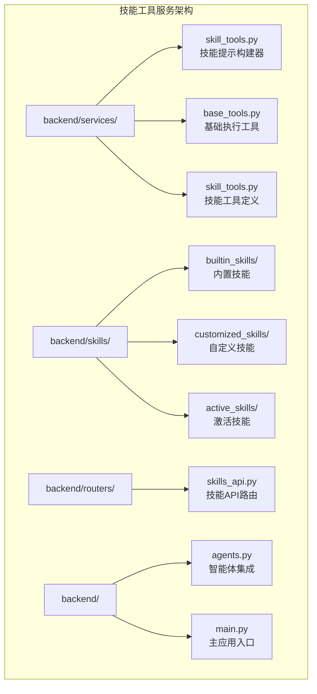
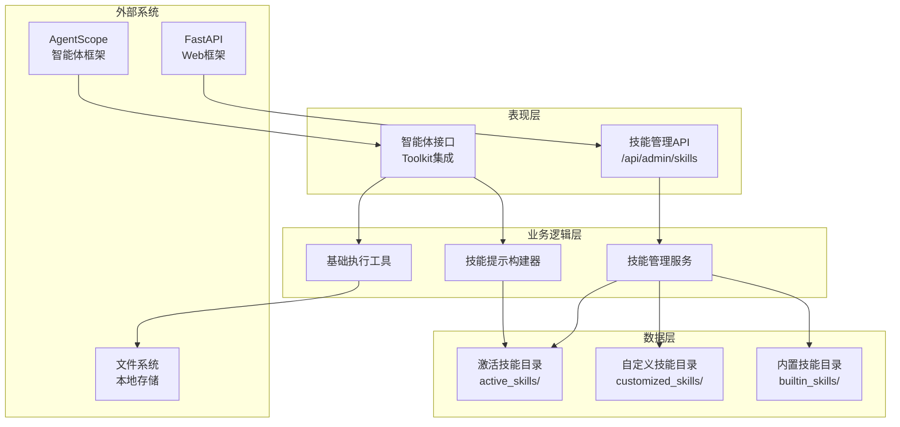
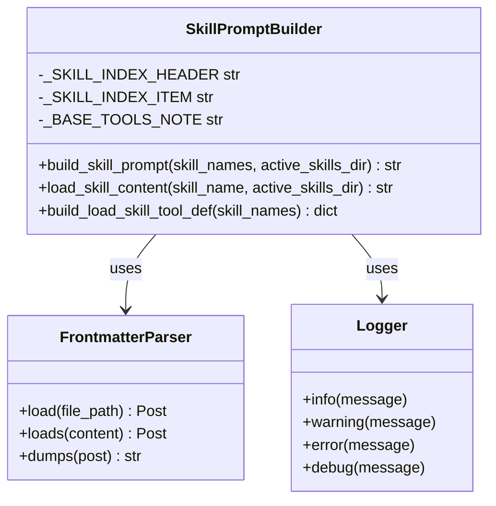
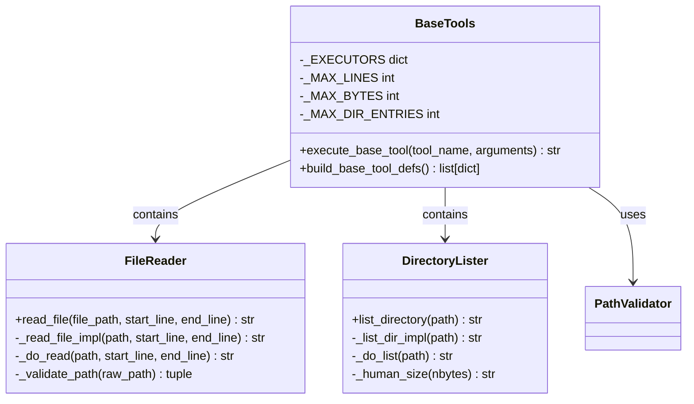
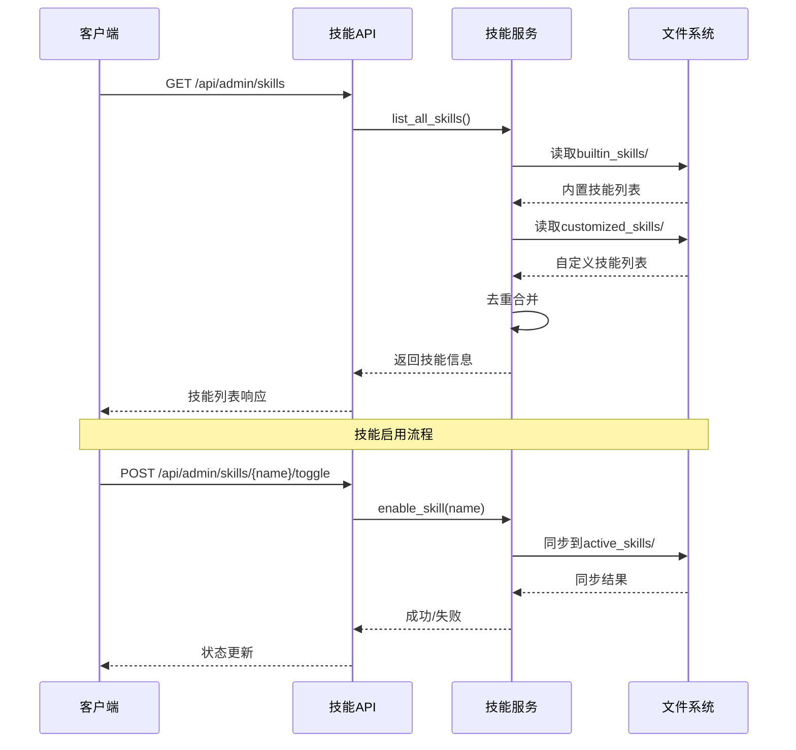
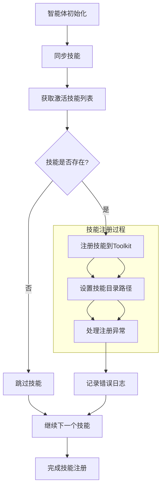
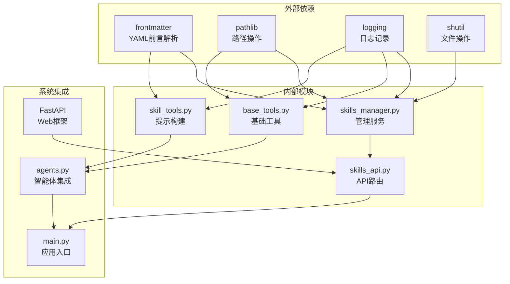

# 技能工具服务

<cite>
**本文档引用的文件**
- [backend/services/skill_tools.py](file://backend/services/skill_tools.py)
- [backend/routers/skills_api.py](file://backend/routers/skills_api.py)
- [backend/skills_manager.py](file://backend/skills_manager.py)
- [backend/services/base_tools.py](file://backend/services/base_tools.py)
- [backend/skills/builtin_skills/file_reader/scripts/read.py](file://backend/skills/builtin_skills/file_reader/scripts/read.py)
- [backend/skills/builtin_skills/file_reader/SKILL.md](file://backend/skills/builtin_skills/file_reader/SKILL.md)
- [backend/skills/active_skills/file_reader/SKILL.md](file://backend/skills/active_skills/file_reader/SKILL.md)
- [backend/main.py](file://backend/main.py)
- [backend/agents.py](file://backend/agents.py)
</cite>

## 目录
1. [简介](#简介)
2. [项目结构](#项目结构)
3. [核心组件](#核心组件)
4. [架构概览](#架构概览)
5. [详细组件分析](#详细组件分析)
6. [依赖关系分析](#依赖关系分析)
7. [性能考虑](#性能考虑)
8. [故障排除指南](#故障排除指南)
9. [结论](#结论)

## 简介

技能工具服务是无限剧情剧场系统中的核心组件，负责管理AI代理的技能系统。该系统采用"教程式技能"（Tutorial Skills）模式，通过轻量级技能索引和按需加载机制，实现了高效的技能管理和服务。

系统的核心创新在于将技能分为两个层次：
- **轻量级技能索引**：仅包含技能名称和简要描述，用于系统提示词
- **完整技能内容**：通过`load_skill`元工具按需加载，包含详细的操作指南、示例和参考资料

这种设计确保了正常对话的低开销成本，同时保持了技能功能的完整性。

## 项目结构

技能工具服务主要分布在以下目录中：

**图表来源**
- [backend/services/skill_tools.py:1-142](file://backend/services/skill_tools.py#L1-L142)
- [backend/skills_manager.py:1-408](file://backend/skills_manager.py#L1-L408)
- [backend/routers/skills_api.py:1-207](file://backend/routers/skills_api.py#L1-L207)

**章节来源**
- [backend/services/skill_tools.py:1-142](file://backend/services/skill_tools.py#L1-L142)
- [backend/skills_manager.py:1-408](file://backend/skills_manager.py#L1-L408)
- [backend/routers/skills_api.py:1-207](file://backend/routers/skills_api.py#L1-L207)

## 核心组件

### 技能提示构建器（Skill Prompt Builder）

技能提示构建器负责构建轻量级技能索引，这是系统的核心组件之一。它实现了以下功能：

- **技能索引生成**：从SKILL.md文件中提取技能名称和描述
- **系统提示词构建**：生成包含技能列表和基础工具说明的提示词
- **元工具注册**：注册`load_skill`元工具，允许按需加载完整技能内容

### 基础执行工具

基础执行工具提供了文件读取和目录列表的核心功能：

- **路径安全验证**：防止路径遍历攻击
- **文件读取功能**：支持行范围读取和大文件处理
- **目录浏览功能**：限制显示条目数量，提高性能
- **错误处理机制**：提供详细的错误信息

### 技能管理服务

技能管理服务负责技能的全生命周期管理：

- **技能同步**：从内置和自定义技能源同步到激活目录
- **技能启用/禁用**：动态控制技能的可用性
- **技能创建/删除**：支持自定义技能的增删改查
- **文件加载**：安全地加载技能相关的参考文件和脚本

**章节来源**
- [backend/services/skill_tools.py:36-142](file://backend/services/skill_tools.py#L36-L142)
- [backend/services/base_tools.py:1-217](file://backend/services/base_tools.py#L1-L217)
- [backend/skills_manager.py:263-408](file://backend/skills_manager.py#L263-L408)

## 架构概览

技能工具服务采用分层架构设计，实现了清晰的关注点分离：

**图表来源**
- [backend/routers/skills_api.py:13-17](file://backend/routers/skills_api.py#L13-L17)
- [backend/skills_manager.py:263-287](file://backend/skills_manager.py#L263-L287)
- [backend/services/skill_tools.py:36-70](file://backend/services/skill_tools.py#L36-L70)

系统的核心优势在于其模块化设计，每个组件都有明确的职责边界：

1. **解耦性**：各组件之间通过明确定义的接口交互
2. **可扩展性**：新的技能类型可以轻松添加
3. **安全性**：所有文件操作都经过严格的安全检查
4. **性能优化**：按需加载机制避免不必要的资源消耗

## 详细组件分析

### 技能提示构建器组件

技能提示构建器实现了"教程式技能"的核心机制：

**图表来源**
- [backend/services/skill_tools.py:36-142](file://backend/services/skill_tools.py#L36-L142)

#### 核心功能实现

1. **轻量级技能索引构建**：
   - 仅读取SKILL.md的前言部分（name和description）
   - 生成简洁的技能列表，避免token浪费
   - 包含基础工具说明，确保LLM了解可用能力

2. **完整技能内容加载**：
   - 支持完整的技能文档加载
   - 自动检测并列出参考资料
   - 提供详细的错误处理和日志记录

3. **元工具定义生成**：
   - 生成符合OpenAI格式的工具定义
   - 动态枚举技能名称，确保类型安全
   - 提供详细的参数说明和约束

**章节来源**
- [backend/services/skill_tools.py:36-142](file://backend/services/skill_tools.py#L36-L142)

### 基础执行工具组件

基础执行工具提供了文件系统操作的核心能力：

**图表来源**
- [backend/services/base_tools.py:40-217](file://backend/services/base_tools.py#L40-L217)

#### 安全性和性能特性

1. **路径安全验证**：
   - 防止路径遍历攻击（..段检查）
   - 绝对路径解析和规范化
   - 用户家目录支持

2. **大文件处理优化**：
   - 行数限制（默认1000行）
   - 字节大小限制（默认30KB）
   - 分段读取和续提示功能

3. **目录浏览优化**：
   - 条目数量限制（默认200个）
   - 类型排序和大小显示
   - 性能友好的迭代器使用

**章节来源**
- [backend/services/base_tools.py:25-139](file://backend/services/base_tools.py#L25-L139)
- [backend/services/base_tools.py:145-217](file://backend/services/base_tools.py#L145-L217)

### 技能管理服务组件

技能管理服务提供了完整的技能生命周期管理：

**图表来源**
- [backend/routers/skills_api.py:123-207](file://backend/routers/skills_api.py#L123-L207)
- [backend/skills_manager.py:263-301](file://backend/skills_manager.py#L263-L301)

#### 技能同步机制

1. **优先级策略**：
   - 自定义技能优先于内置技能
   - 冲突时自定义技能覆盖内置技能
   - 版本差异检测和更新

2. **增量同步**：
   - 仅同步发生变化的技能
   - 支持强制重新同步
   - 跳过未变化的技能以提高性能

3. **状态管理**：
   - 激活技能的动态启用/禁用
   - 状态持久化和恢复
   - 初始化检查和日志记录

**章节来源**
- [backend/skills_manager.py:180-226](file://backend/skills_manager.py#L180-L226)
- [backend/skills_manager.py:284-301](file://backend/skills_manager.py#L284-L301)

### 智能体集成组件

智能体集成功现了技能系统与AgentScope框架的无缝对接：

**图表来源**
- [backend/agents.py:85-113](file://backend/agents.py#L85-L113)

#### 集成特性

1. **动态技能加载**：
   - 启动时自动同步技能
   - 支持按需选择特定技能
   - 热重载支持（MCP客户端）

2. **错误处理机制**：
   - 单个技能失败不影响整体加载
   - 详细的错误日志记录
   - 平滑的降级处理

3. **内存管理**：
   - 记忆压缩钩子集成
   - Token使用统计
   - 输入输出字符数跟踪

**章节来源**
- [backend/agents.py:85-113](file://backend/agents.py#L85-L113)
- [backend/agents.py:49-69](file://backend/agents.py#L49-L69)

## 依赖关系分析

技能工具服务的依赖关系体现了清晰的分层架构：

**图表来源**
- [backend/services/skill_tools.py:14](file://backend/services/skill_tools.py#L14)
- [backend/services/base_tools.py:10](file://backend/services/base_tools.py#L10)
- [backend/skills_manager.py:8](file://backend/skills_manager.py#L8)

### 关键依赖特性

1. **最小依赖原则**：
   - 仅使用必要的第三方库
   - 内置Python标准库满足大部分需求
   - 避免循环依赖

2. **接口稳定性**：
   - 明确的函数签名和返回值
   - 一致的数据结构设计
   - 清晰的错误处理约定

3. **可测试性**：
   - 纯函数设计便于单元测试
   - 可注入的依赖关系
   - 完善的日志记录支持

**章节来源**
- [backend/services/skill_tools.py:11-16](file://backend/services/skill_tools.py#L11-L16)
- [backend/services/base_tools.py:9-12](file://backend/services/base_tools.py#L9-L12)
- [backend/skills_manager.py:3-12](file://backend/skills_manager.py#L3-L12)

## 性能考虑

技能工具服务在设计时充分考虑了性能优化：

### 内存使用优化

1. **按需加载机制**：
   - 技能索引仅包含必要信息
   - 完整技能内容按需加载
   - 避免不必要的内存占用

2. **文件操作优化**：
   - 大文件分段读取
   - 字节大小限制防止内存溢出
   - 目录条目数量限制

### 网络和I/O优化

1. **文件系统访问优化**：
   - 批量操作减少系统调用
   - 缓存机制避免重复读取
   - 异步操作支持高并发

2. **API响应优化**：
   - 精简的响应数据结构
   - 错误信息的及时返回
   - 连接池管理

### 可扩展性设计

1. **模块化架构**：
   - 独立的功能模块
   - 明确的接口契约
   - 易于替换和扩展

2. **配置驱动**：
   - 运行时参数调整
   - 环境变量支持
   - 动态配置更新

## 故障排除指南

### 常见问题诊断

1. **技能无法加载**：
   - 检查SKILL.md文件格式是否正确
   - 验证文件权限和路径有效性
   - 查看日志中的具体错误信息

2. **文件操作失败**：
   - 确认路径不包含非法字符
   - 检查文件是否存在且可读
   - 验证磁盘空间和权限

3. **API调用错误**：
   - 验证请求参数格式
   - 检查认证和授权状态
   - 查看响应状态码和错误消息

### 调试技巧

1. **日志分析**：
   - 启用详细日志级别
   - 关注关键操作的执行时间
   - 监控错误发生的频率和模式

2. **性能监控**：
   - 监控内存使用情况
   - 跟踪文件I/O操作
   - 分析API响应时间

3. **环境检查**：
   - 验证Python版本兼容性
   - 检查依赖库版本
   - 确认系统资源充足

**章节来源**
- [backend/services/skill_tools.py:66-68](file://backend/services/skill_tools.py#L66-L68)
- [backend/services/base_tools.py:58-59](file://backend/services/base_tools.py#L58-L59)
- [backend/skills_manager.py:139-141](file://backend/skills_manager.py#L139-L141)

## 结论

技能工具服务展现了现代AI应用中技能管理的最佳实践。通过采用教程式技能设计、按需加载机制和严格的安全部署，系统实现了高效、安全和可扩展的技能管理解决方案。

### 主要成就

1. **技术创新**：实现了轻量级技能索引和完整技能内容分离的设计理念
2. **性能优化**：通过按需加载和多种限制机制确保系统性能
3. **安全性保障**：全面的路径验证和文件操作安全检查
4. **可维护性**：清晰的模块化设计和完善的错误处理机制

### 未来发展方向

1. **智能化管理**：引入机器学习算法优化技能推荐和选择
2. **分布式部署**：支持多节点部署和技能共享
3. **实时更新**：实现技能的热更新和版本管理
4. **生态扩展**：支持第三方技能提供商和社区贡献

该系统为无限剧情剧场平台提供了坚实的技术基础，通过持续的优化和扩展，将继续为用户提供高质量的AI技能服务体验。