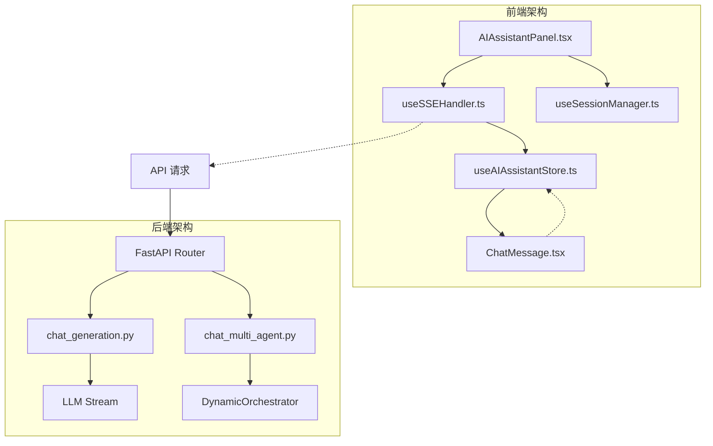
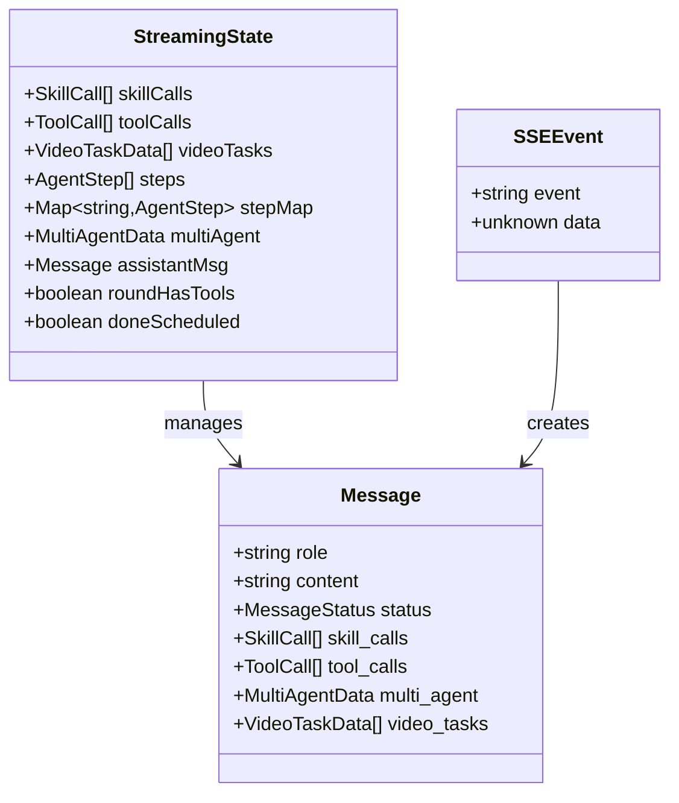
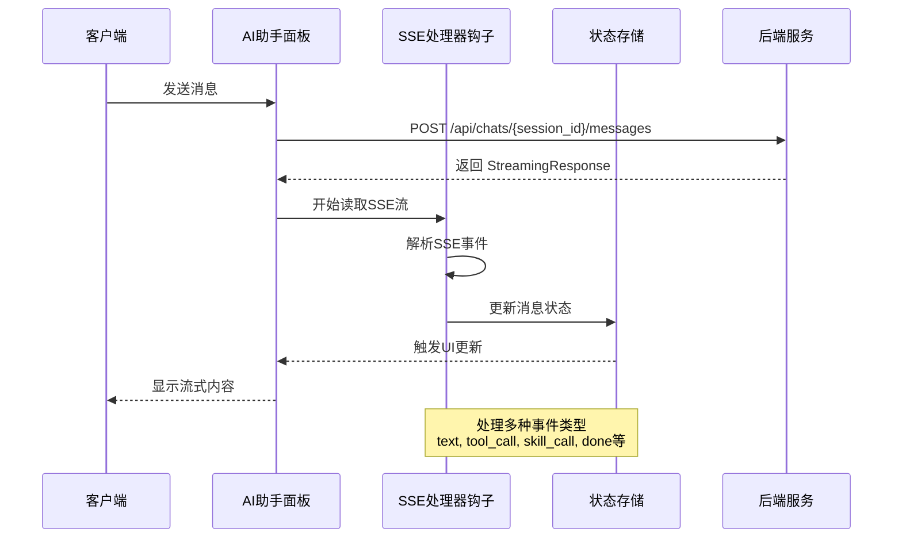
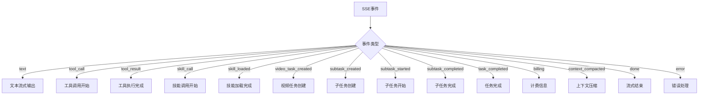
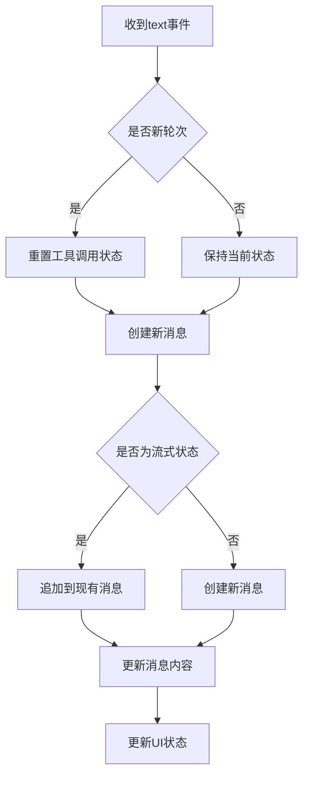
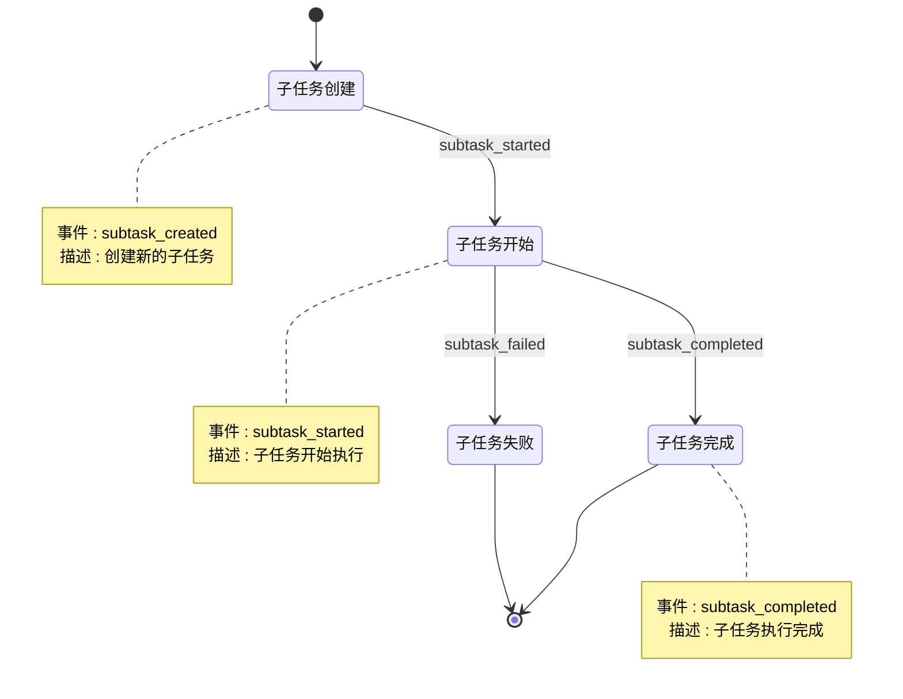
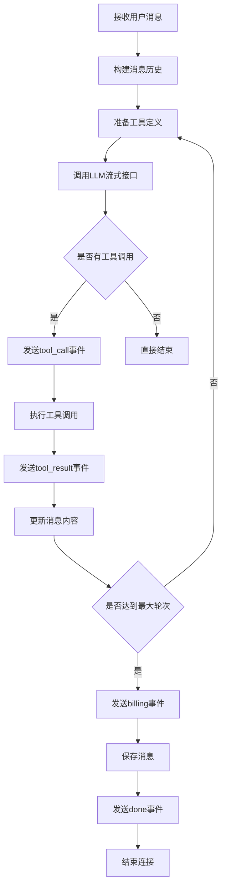
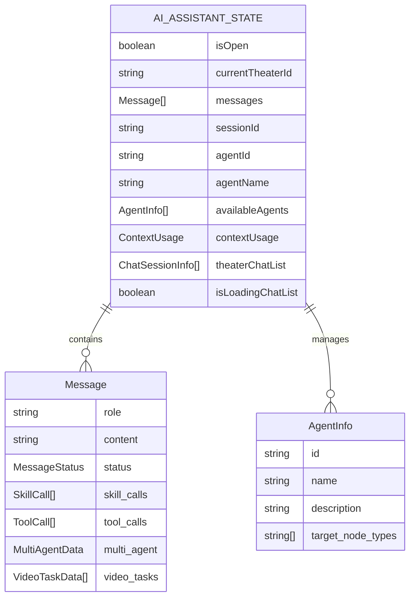
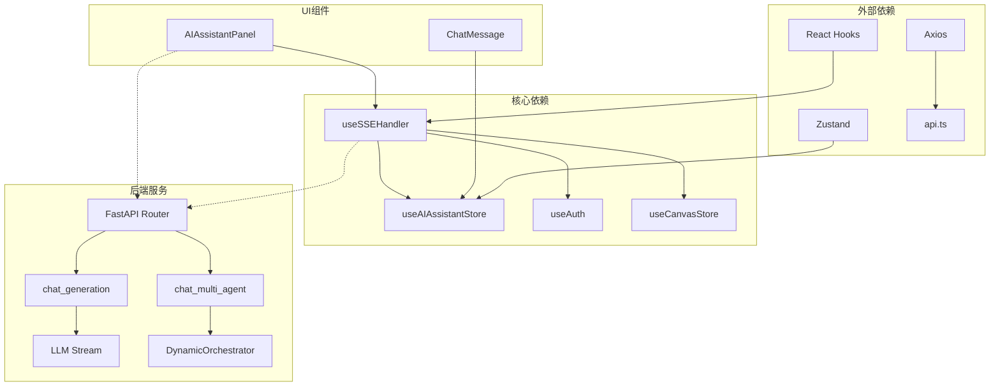

# SSE 处理器钩子

<cite>
**本文档引用的文件**
- [useSSEHandler.ts](file://frontend/src/components/ai-assistant/hooks/useSSEHandler.ts)
- [AIAssistantPanel.tsx](file://frontend/src/components/canvas/AIAssistantPanel.tsx)
- [useSessionManager.ts](file://frontend/src/components/ai-assistant/hooks/useSessionManager.ts)
- [useAIAssistantStore.ts](file://frontend/src/store/useAIAssistantStore.ts)
- [api.ts](file://frontend/src/lib/api.ts)
- [ChatMessage.tsx](file://frontend/src/components/ai-assistant/ChatMessage.tsx)
- [chats.py](file://backend/routers/chats.py)
- [chat_generation.py](file://backend/services/chat_generation.py)
- [chat_multi_agent.py](file://backend/services/chat_multi_agent.py)
</cite>

## 目录
1. [简介](#简介)
2. [项目结构](#项目结构)
3. [核心组件](#核心组件)
4. [架构概览](#架构概览)
5. [详细组件分析](#详细组件分析)
6. [依赖关系分析](#依赖关系分析)
7. [性能考虑](#性能考虑)
8. [故障排除指南](#故障排除指南)
9. [结论](#结论)

## 简介

SSE 处理器钩子是 Infinite Game 项目中实现服务器推送事件（Server-Sent Events, SSE）流式通信的核心组件。该系统允许前端实时接收来自后端的增量数据流，支持多种事件类型，包括文本流式输出、工具调用、技能加载、多智能体协作等。

该钩子实现了完整的 SSE 事件解析、状态管理和错误处理机制，为 AI 助手面板提供了流畅的用户体验。系统支持单智能体和多智能体两种模式，能够处理复杂的协作任务和工具调用流程。

## 项目结构

项目采用前后端分离架构，SSE 处理器钩子位于前端 React 应用中，负责处理来自后端的实时数据流。

**图表来源**
- [AIAssistantPanel.tsx:250-350](file://frontend/src/components/canvas/AIAssistantPanel.tsx#L250-L350)
- [useSSEHandler.ts:1-50](file://frontend/src/components/ai-assistant/hooks/useSSEHandler.ts#L1-L50)
- [chats.py:155-212](file://backend/routers/chats.py#L155-L212)

**章节来源**
- [AIAssistantPanel.tsx:250-350](file://frontend/src/components/canvas/AIAssistantPanel.tsx#L250-L350)
- [useSSEHandler.ts:1-50](file://frontend/src/components/ai-assistant/hooks/useSSEHandler.ts#L1-L50)
- [chats.py:155-212](file://backend/routers/chats.py#L155-L212)

## 核心组件

### SSE 处理器钩子 (useSSEHandler)

SSE 处理器钩子是整个流式通信系统的核心，负责解析和处理来自后端的 SSE 事件。

#### 主要功能特性

1. **事件解析**: 解析 SSE 格式的事件行，提取事件类型和数据
2. **状态管理**: 维护流式处理状态，包括技能调用、工具调用、视频任务等
3. **消息更新**: 实时更新聊天消息状态和 UI 组件
4. **错误处理**: 统一处理各种异常情况和错误事件
5. **生命周期管理**: 管理流式连接的建立和清理

#### 关键数据结构

**图表来源**
- [useSSEHandler.ts:9-25](file://frontend/src/components/ai-assistant/hooks/useSSEHandler.ts#L9-L25)
- [useAIAssistantStore.ts:50-63](file://frontend/src/store/useAIAssistantStore.ts#L50-L63)

**章节来源**
- [useSSEHandler.ts:26-403](file://frontend/src/components/ai-assistant/hooks/useSSEHandler.ts#L26-L403)

### AI 助手面板 (AIAssistantPanel)

AI 助手面板是用户交互的主要界面，负责发起 SSE 连接和处理用户输入。

#### 核心功能

1. **SSE 连接管理**: 建立和维护与后端的 SSE 连接
2. **消息发送**: 处理用户消息发送和附件上传
3. **流式渲染**: 实时渲染后端返回的流式数据
4. **错误处理**: 处理网络错误和认证过期等情况

**章节来源**
- [AIAssistantPanel.tsx:250-350](file://frontend/src/components/canvas/AIAssistantPanel.tsx#L250-L350)

### 会话管理器 (useSessionManager)

会话管理器负责管理用户的对话会话状态和相关操作。

#### 主要职责

1. **会话创建**: 创建新的对话会话
2. **历史加载**: 加载和管理对话历史
3. **代理切换**: 支持在不同 AI 代理之间切换
4. **状态同步**: 维护会话状态的一致性

**章节来源**
- [useSessionManager.ts:12-358](file://frontend/src/components/ai-assistant/hooks/useSessionManager.ts#L12-L358)

## 架构概览

SSE 处理器钩子在整个系统中扮演着关键的桥梁角色，连接前端 UI 和后端服务。

**图表来源**
- [AIAssistantPanel.tsx:262-322](file://frontend/src/components/canvas/AIAssistantPanel.tsx#L262-L322)
- [useSSEHandler.ts:70-396](file://frontend/src/components/ai-assistant/hooks/useSSEHandler.ts#L70-L396)

## 详细组件分析

### SSE 事件处理机制

#### 事件类型分类

系统支持多种 SSE 事件类型，每种事件都有特定的处理逻辑：

**图表来源**
- [useSSEHandler.ts:73-393](file://frontend/src/components/ai-assistant/hooks/useSSEHandler.ts#L73-L393)

#### 文本流式处理流程

文本事件是最常见的 SSE 事件，负责实时传输 AI 的回复内容。

**图表来源**
- [useSSEHandler.ts:80-111](file://frontend/src/components/ai-assistant/hooks/useSSEHandler.ts#L80-L111)

**章节来源**
- [useSSEHandler.ts:70-111](file://frontend/src/components/ai-assistant/hooks/useSSEHandler.ts#L70-L111)

### 多智能体协作支持

系统支持复杂的多智能体协作模式，能够处理子任务的创建、执行和监控。

#### 子任务生命周期

**图表来源**
- [useSSEHandler.ts:187-270](file://frontend/src/components/ai-assistant/hooks/useSSEHandler.ts#L187-L270)

**章节来源**
- [useSSEHandler.ts:187-270](file://frontend/src/components/ai-assistant/hooks/useSSEHandler.ts#L187-L270)

### 后端流式生成器

后端使用 Python 异步生成器实现流式响应，支持多种事件类型的实时推送。

#### 单智能体流式生成

**图表来源**
- [chat_generation.py:197-340](file://backend/services/chat_generation.py#L197-L340)

**章节来源**
- [chat_generation.py:30-487](file://backend/services/chat_generation.py#L30-L487)

### 前端状态管理

前端使用 Zustand 状态管理库维护复杂的 UI 状态，包括消息历史、会话信息和流式处理状态。

#### 状态存储结构

**图表来源**
- [useAIAssistantStore.ts:132-257](file://frontend/src/store/useAIAssistantStore.ts#L132-L257)

**章节来源**
- [useAIAssistantStore.ts:1-480](file://frontend/src/store/useAIAssistantStore.ts#L1-L480)

## 依赖关系分析

SSE 处理器钩子与其他组件之间的依赖关系如下：

**图表来源**
- [useSSEHandler.ts:3-7](file://frontend/src/components/ai-assistant/hooks/useSSEHandler.ts#L3-L7)
- [AIAssistantPanel.tsx:121-122](file://frontend/src/components/canvas/AIAssistantPanel.tsx#L121-L122)
- [api.ts:1-84](file://frontend/src/lib/api.ts#L1-L84)

**章节来源**
- [useSSEHandler.ts:1-403](file://frontend/src/components/ai-assistant/hooks/useSSEHandler.ts#L1-L403)
- [AIAssistantPanel.tsx:1-449](file://frontend/src/components/canvas/AIAssistantPanel.tsx#L1-L449)

## 性能考虑

### 流式渲染优化

1. **React 18 自动批处理**: 通过 `setTimeout(0)` 破坏自动批处理，确保流式渲染的正确性
2. **虚拟滚动**: 使用虚拟列表组件优化大量消息的渲染性能
3. **懒加载**: 对代码块和图片等资源进行懒加载处理

### 内存管理

1. **流式状态重置**: 在流式结束后及时重置状态，避免内存泄漏
2. **消息历史限制**: 通过上下文压缩减少历史消息占用的空间
3. **附件清理**: 自动清理上传的文件和附件

### 网络优化

1. **连接池管理**: 合理管理 SSE 连接，避免过多并发连接
2. **错误重试**: 实现智能的错误重试机制
3. **超时控制**: 设置合理的超时时间，避免长时间等待

## 故障排除指南

### 常见问题及解决方案

#### SSE 连接中断

**症状**: 流式输出突然停止，消息显示为完成状态

**可能原因**:
1. 网络连接不稳定
2. 后端服务异常
3. 浏览器限制或插件干扰

**解决方法**:
1. 检查网络连接状态
2. 查看浏览器控制台错误信息
3. 尝试刷新页面重新建立连接

#### 事件解析错误

**症状**: 某些 SSE 事件无法正确解析，导致 UI 显示异常

**可能原因**:
1. 事件格式不符合标准
2. 数据序列化问题
3. 缓冲区处理错误

**解决方法**:
1. 检查后端事件生成逻辑
2. 验证数据格式和编码
3. 调试缓冲区处理流程

#### 状态同步问题

**症状**: UI 状态与实际数据不一致

**可能原因**:
1. 状态更新时机不当
2. 并发状态更新冲突
3. 异步操作顺序错误

**解决方法**:
1. 检查状态更新的时机和顺序
2. 使用正确的状态更新模式
3. 添加必要的状态同步机制

**章节来源**
- [useSSEHandler.ts:368-392](file://frontend/src/components/ai-assistant/hooks/useSSEHandler.ts#L368-L392)
- [AIAssistantPanel.tsx:323-335](file://frontend/src/components/canvas/AIAssistantPanel.tsx#L323-L335)

## 结论

SSE 处理器钩子是 Infinite Game 项目中实现流式通信的关键组件，它成功地解决了实时数据传输、状态管理和错误处理等核心问题。通过精心设计的事件处理机制和状态管理策略，该系统为用户提供了流畅的 AI 助手体验。

系统的架构设计充分考虑了可扩展性和维护性，支持单智能体和多智能体两种模式，能够适应不同的应用场景需求。同时，完善的错误处理和性能优化措施确保了系统的稳定性和可靠性。

未来可以考虑进一步优化的方向包括：增强事件处理的容错能力、改进状态管理的性能、增加更多的调试和监控功能等。