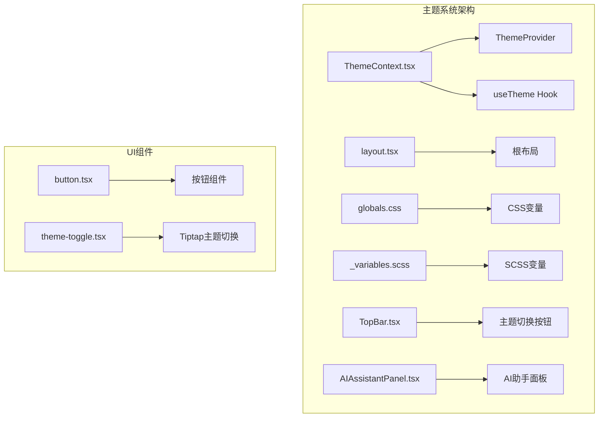
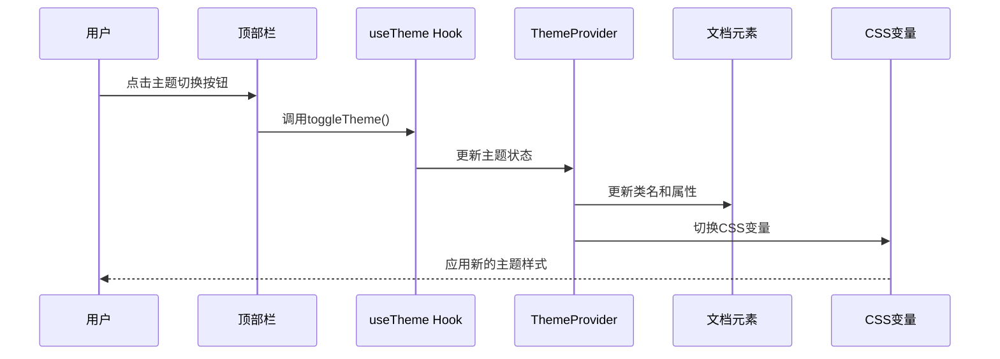
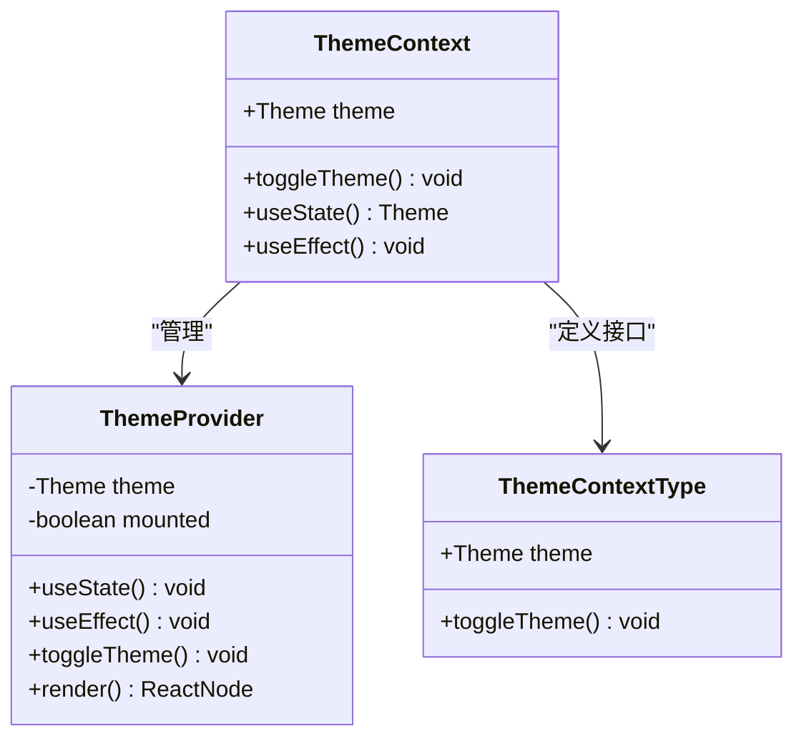
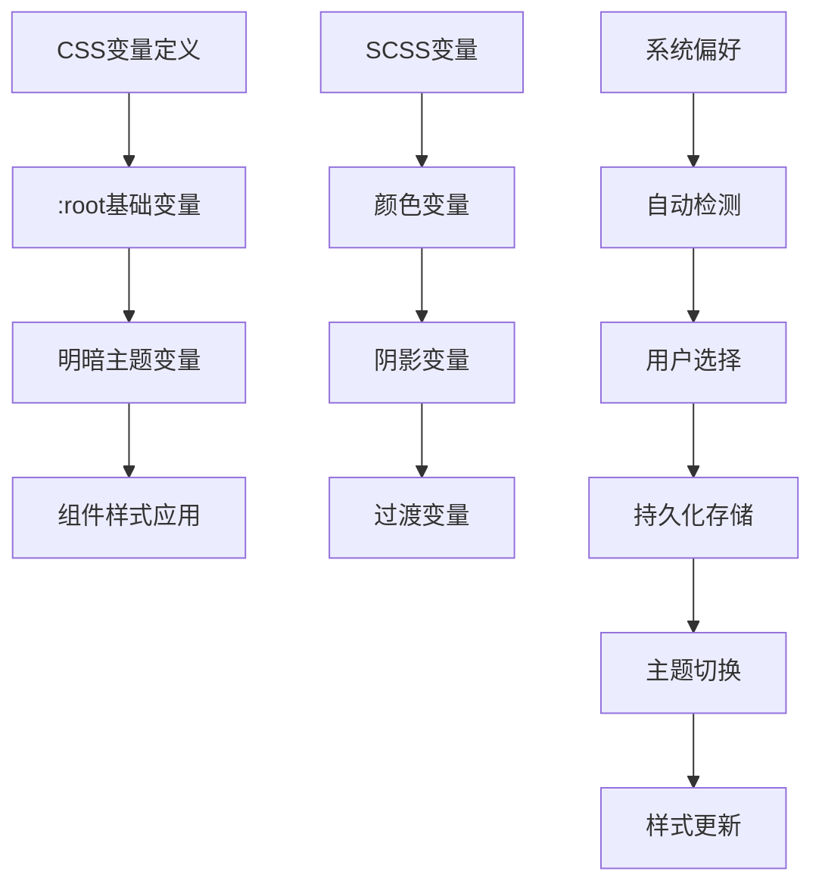
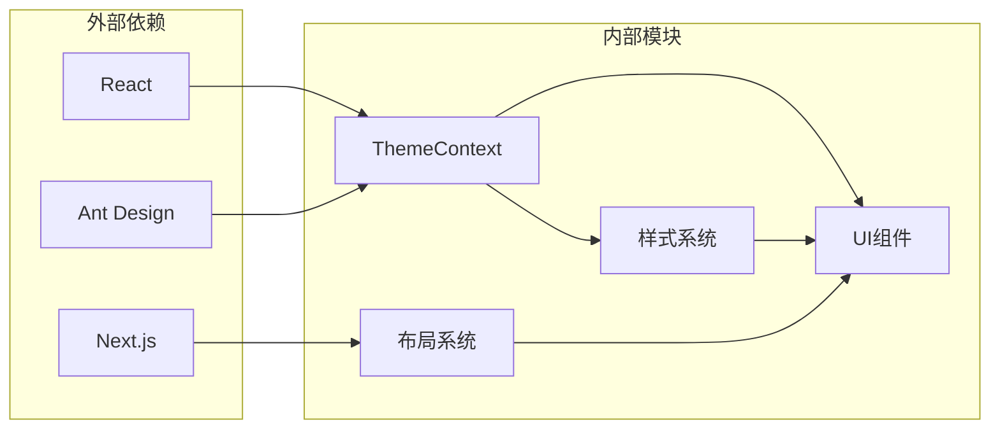

# 主题切换优化

<cite>
**本文档引用的文件**
- [ThemeContext.tsx](file://frontend/src/context/ThemeContext.tsx)
- [layout.tsx](file://frontend/src/app/layout.tsx)
- [globals.css](file://frontend/src/app/globals.css)
- [_variables.scss](file://frontend/src/styles/_variables.scss)
- [button.tsx](file://frontend/src/components/tiptap-ui-primitive/button/button.tsx)
- [theme-toggle.tsx](file://frontend/src/components/tiptap-templates/simple/theme-toggle.tsx)
- [TopBar.tsx](file://frontend/src/components/home/TopBar.tsx)
- [AIAssistantPanel.tsx](file://frontend/src/components/canvas/AIAssistantPanel.tsx)
</cite>

## 目录
1. [简介](#简介)
2. [项目结构](#项目结构)
3. [核心组件](#核心组件)
4. [架构概览](#架构概览)
5. [详细组件分析](#详细组件分析)
6. [依赖关系分析](#依赖关系分析)
7. [性能考虑](#性能考虑)
8. [故障排除指南](#故障排除指南)
9. [结论](#结论)

## 简介

本项目实现了完整的主题切换系统，支持明暗主题模式的无缝切换。通过React Context提供全局状态管理，结合CSS变量实现动态主题切换，为用户提供一致的视觉体验。

## 项目结构

主题切换系统主要分布在以下关键文件中：

**图表来源**
- [ThemeContext.tsx:1-75](file://frontend/src/context/ThemeContext.tsx#L1-L75)
- [layout.tsx:1-42](file://frontend/src/app/layout.tsx#L1-L42)

**章节来源**
- [ThemeContext.tsx:1-75](file://frontend/src/context/ThemeContext.tsx#L1-L75)
- [layout.tsx:1-42](file://frontend/src/app/layout.tsx#L1-L42)

## 核心组件

### 主题提供者 (ThemeProvider)

ThemeContext.tsx实现了核心的主题管理逻辑：

- **状态管理**: 使用useState管理当前主题状态
- **持久化存储**: 通过localStorage保存用户偏好
- **系统检测**: 自动检测系统深色模式偏好
- **DOM操作**: 动态更新HTML元素类名和属性

### 主题Hook (useTheme)

提供简化的主题状态访问接口：
- 返回当前主题状态
- 提供主题切换函数
- 确保在Provider环境中使用

**章节来源**
- [ThemeContext.tsx:16-74](file://frontend/src/context/ThemeContext.tsx#L16-L74)

## 架构概览

主题切换系统的整体架构如下：

**图表来源**
- [TopBar.tsx:70-82](file://frontend/src/components/home/TopBar.tsx#L70-L82)
- [ThemeContext.tsx:39-41](file://frontend/src/context/ThemeContext.tsx#L39-L41)

## 详细组件分析

### 主题上下文组件

**图表来源**
- [ThemeContext.tsx:9-14](file://frontend/src/context/ThemeContext.tsx#L9-L14)
- [ThemeContext.tsx:16-65](file://frontend/src/context/ThemeContext.tsx#L16-L65)

### 样式系统架构

主题切换依赖于多层次的样式系统：

**图表来源**
- [globals.css:5-247](file://frontend/src/app/globals.css#L5-L247)
- [_variables.scss:1-297](file://frontend/src/styles/_variables.scss#L1-L297)

### 顶部栏主题切换组件

TopBar.tsx中的主题切换按钮实现了直观的用户交互：

- **图标切换**: 根据当前主题显示不同的图标
- **状态同步**: 实时反映主题变化
- **无障碍支持**: 提供适当的aria标签

**章节来源**
- [TopBar.tsx:70-82](file://frontend/src/components/home/TopBar.tsx#L70-L82)

### Tiptap主题切换组件

独立的theme-toggle.tsx提供了编辑器环境下的主题切换：

- **媒体查询监听**: 自动响应系统主题变化
- **元标签检测**: 支持通过meta标签指定初始主题
- **即时切换**: 无需页面刷新即可应用新主题

**章节来源**
- [theme-toggle.tsx:11-49](file://frontend/src/components/tiptap-templates/simple/theme-toggle.tsx#L11-L49)

## 依赖关系分析

主题切换系统的依赖关系如下：

**图表来源**
- [ThemeContext.tsx:3-5](file://frontend/src/context/ThemeContext.tsx#L3-L5)
- [layout.tsx:3-5](file://frontend/src/app/layout.tsx#L3-L5)

**章节来源**
- [ThemeContext.tsx:1-75](file://frontend/src/context/ThemeContext.tsx#L1-L75)
- [layout.tsx:1-42](file://frontend/src/app/layout.tsx#L1-L42)

## 性能考虑

### 优化策略

1. **懒加载机制**: ThemeProvider使用mounted状态避免不必要的DOM操作
2. **状态最小化**: 仅在主题变化时更新相关DOM元素
3. **CSS变量缓存**: 通过CSS变量减少重绘开销
4. **事件监听优化**: 正确清理媒体查询监听器

### 内存管理

- 主题切换组件正确清理事件监听器
- 避免内存泄漏的副作用
- 优化重渲染频率

## 故障排除指南

### 常见问题及解决方案

**问题1: 主题切换不生效**
- 检查localStorage权限
- 验证CSS变量定义完整性
- 确认DOM元素类名更新

**问题2: 系统主题检测异常**
- 检查浏览器媒体查询支持
- 验证prefers-color-scheme媒体查询
- 确认系统设置正确

**问题3: 样式闪烁问题**
- 检查SSR期间的主题处理
- 验证hydrate过程中的状态同步
- 确认客户端渲染时机

**章节来源**
- [ThemeContext.tsx:20-37](file://frontend/src/context/ThemeContext.tsx#L20-L37)
- [theme-toggle.tsx:14-26](file://frontend/src/components/tiptap-templates/simple/theme-toggle.tsx#L14-L26)

## 结论

本主题切换系统通过精心设计的架构实现了流畅、可靠的用户体验。核心优势包括：

1. **完整的生态系统**: 从全局状态管理到局部组件使用的完整链路
2. **性能优化**: 通过CSS变量和最小化DOM操作实现高效切换
3. **用户体验**: 支持系统偏好检测和持久化存储
4. **可扩展性**: 模块化设计便于功能扩展和维护

该系统为后续的功能扩展奠定了坚实的基础，包括主题自定义、动画效果增强等特性都可以在此架构上轻松实现。