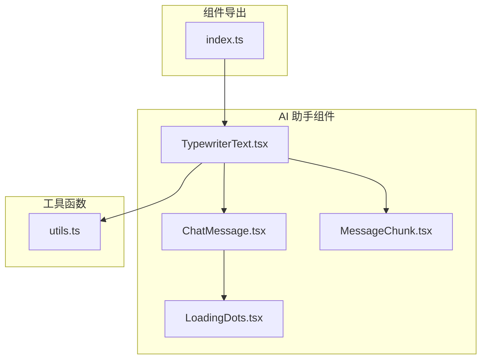
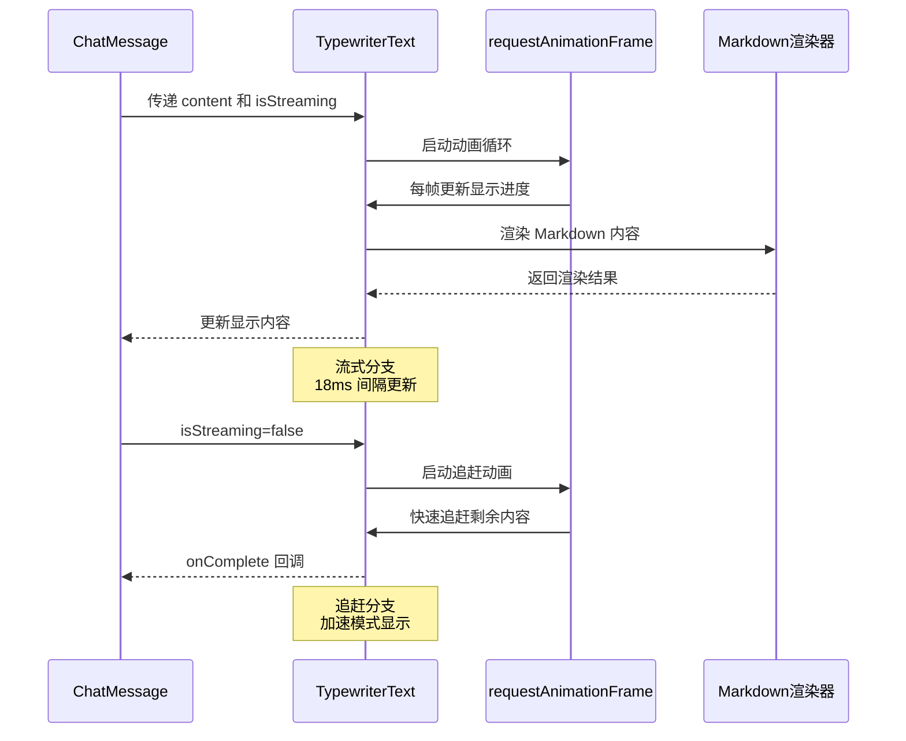
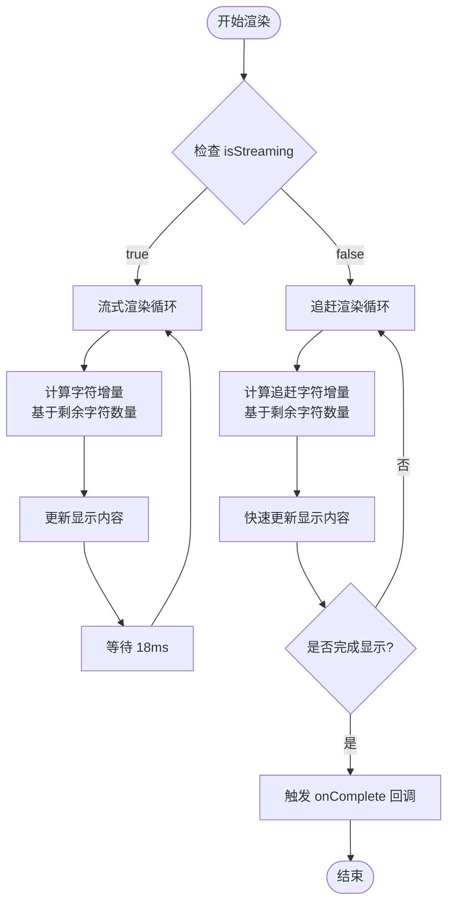
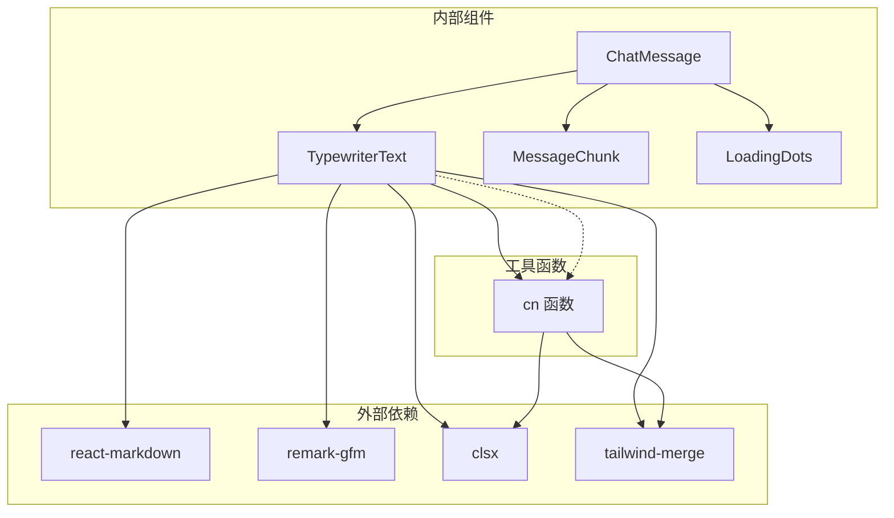
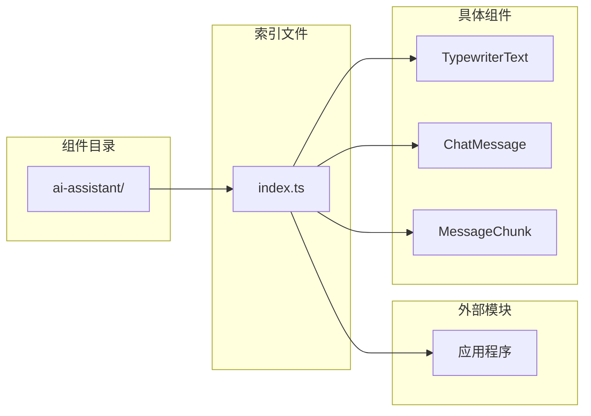

# Typewriter Text 组件文档

<cite>
**本文档中引用的文件**
- [TypewriterText.tsx](file://frontend/src/components/ai-assistant/TypewriterText.tsx)
- [ChatMessage.tsx](file://frontend/src/components/ai-assistant/ChatMessage.tsx)
- [MessageChunk.tsx](file://frontend/src/components/ai-assistant/MessageChunk.tsx)
- [LoadingDots.tsx](file://frontend/src/components/ai-assistant/LoadingDots.tsx)
- [index.ts](file://frontend/src/components/ai-assistant/index.ts)
- [utils.ts](file://frontend/src/lib/utils.ts)
</cite>

## 目录
1. [简介](#简介)
2. [项目结构](#项目结构)
3. [核心组件](#核心组件)
4. [架构概览](#架构概览)
5. [详细组件分析](#详细组件分析)
6. [依赖关系分析](#依赖关系分析)
7. [性能考虑](#性能考虑)
8. [故障排除指南](#故障排除指南)
9. [结论](#结论)

## 简介

Typewriter Text（打字机文本）组件是 Infinite Game 前端应用中的一个关键 UI 组件，专门用于实现流式文本渲染效果。该组件模拟真实的打字机效果，将长文本内容逐字或逐字符地显示出来，为用户提供流畅的阅读体验。

该组件主要应用于 AI 助手的消息显示场景，支持流式输出、文本追赶动画、Markdown 渲染等功能。通过精心设计的动画算法和性能优化策略，确保在各种内容长度和网络条件下都能提供优秀的用户体验。

## 项目结构

Typewriter Text 组件位于前端项目的 AI 助手组件集合中，与相关的消息处理和渲染组件协同工作：

**图表来源**
- [TypewriterText.tsx:1-162](file://frontend/src/components/ai-assistant/TypewriterText.tsx#L1-L162)
- [ChatMessage.tsx:279-484](file://frontend/src/components/ai-assistant/ChatMessage.tsx#L279-L484)
- [MessageChunk.tsx:1-172](file://frontend/src/components/ai-assistant/MessageChunk.tsx#L1-L172)

**章节来源**
- [TypewriterText.tsx:1-162](file://frontend/src/components/ai-assistant/TypewriterText.tsx#L1-L162)
- [ChatMessage.tsx:279-484](file://frontend/src/components/ai-assistant/ChatMessage.tsx#L279-L484)
- [index.ts:1-38](file://frontend/src/components/ai-assistant/index.ts#L1-L38)

## 核心组件

### TypewriterText 组件

TypewriterText 是一个高性能的流式文本渲染组件，具有以下核心特性：

#### 主要功能
- **流式文本渲染**：模拟打字机效果，逐字显示文本内容
- **智能追赶机制**：当文本更新时，自动追赶显示进度
- **Markdown 支持**：内置 Markdown 渲染能力，支持代码块、表格等格式
- **响应式设计**：适配不同屏幕尺寸和设备类型
- **性能优化**：使用 requestAnimationFrame 和 useRef 优化渲染性能

#### 核心属性
- `content`: 要显示的文本内容
- `isStreaming`: 是否处于流式状态
- `className`: 自定义样式类名
- `onComplete`: 动画完成回调函数

#### 关键实现技术
- 使用 `useRef` 存储可变状态，避免不必要的重渲染
- 通过 `requestAnimationFrame` 实现流畅的动画效果
- 智能的字符增量算法，根据剩余字符数量调整显示速度
- 完整的 Markdown 组件映射表，支持多种格式

**章节来源**
- [TypewriterText.tsx:8-14](file://frontend/src/components/ai-assistant/TypewriterText.tsx#L8-L14)
- [TypewriterText.tsx:47-162](file://frontend/src/components/ai-assistant/TypewriterText.tsx#L47-L162)

## 架构概览

Typewriter Text 组件在整个消息系统中的位置和交互关系如下：

**图表来源**
- [ChatMessage.tsx:399-405](file://frontend/src/components/ai-assistant/ChatMessage.tsx#L399-L405)
- [TypewriterText.tsx:68-135](file://frontend/src/components/ai-assistant/TypewriterText.tsx#L68-L135)

## 详细组件分析

### 流式渲染算法

TypewriterText 组件实现了两种不同的渲染模式：

#### 流式渲染模式
当 `isStreaming` 为 true 时，组件使用 18ms 的固定间隔来显示文本：
- 剩余字符 > 200：每次显示 5 个字符
- 剩余字符 > 100：每次显示 3 个字符  
- 剩余字符 > 30：每次显示 2 个字符
- 其他情况：每次显示 1 个字符

#### 追赶渲染模式
当 `isStreaming` 从 true 变为 false 时，组件启动追赶动画：
- 剩余字符 > 500：每次显示 12 个字符
- 剩余字符 > 200：每次显示 8 个字符
- 剩余字符 > 50：每次显示 4 个字符
- 其他情况：每次显示 2 个字符

**图表来源**
- [TypewriterText.tsx:107-127](file://frontend/src/components/ai-assistant/TypewriterText.tsx#L107-L127)
- [TypewriterText.tsx:83-104](file://frontend/src/components/ai-assistant/TypewriterText.tsx#L83-L104)

### Markdown 渲染支持

组件内置了完整的 Markdown 渲染支持，包括：

#### 代码块渲染
- 支持内联代码和代码块
- 自动识别编程语言
- 显示行号和复制功能
- 语法高亮支持

#### 图片渲染
- 验证图片 URL 的有效性
- 自适应图片尺寸
- 错误处理和占位符

#### 表格渲染
- 支持复杂表格结构
- 响应式表格布局
- 滚动支持

**章节来源**
- [TypewriterText.tsx:17-45](file://frontend/src/components/ai-assistant/TypewriterText.tsx#L17-L45)

### 性能优化策略

#### 状态管理优化
- 使用 `useRef` 存储动画状态，避免重渲染
- 通过 `useMemo` 缓存计算结果
- 使用 `useCallback` 优化回调函数

#### 动画性能优化
- 使用 `requestAnimationFrame` 替代 `setTimeout`
- 智能的时间戳管理
- 条件化的动画启动和停止

#### 内存管理
- 及时清理动画帧请求
- 合理的组件卸载处理
- 避免内存泄漏

**章节来源**
- [TypewriterText.tsx:50-66](file://frontend/src/components/ai-assistant/TypewriterText.tsx#L50-L66)
- [TypewriterText.tsx:131-135](file://frontend/src/components/ai-assistant/TypewriterText.tsx#L131-L135)

## 依赖关系分析

### 组件间依赖关系

**图表来源**
- [TypewriterText.tsx:3-6](file://frontend/src/components/ai-assistant/TypewriterText.tsx#L3-L6)
- [ChatMessage.tsx:7](file://frontend/src/components/ai-assistant/ChatMessage.tsx#L7)
- [utils.ts:1-7](file://frontend/src/lib/utils.ts#L1-L7)

### 导出和导入关系

TypewriterText 组件通过统一的索引文件进行导出，便于其他模块使用：

**图表来源**
- [index.ts:3](file://frontend/src/components/ai-assistant/index.ts#L3)
- [TypewriterText.tsx:47](file://frontend/src/components/ai-assistant/TypewriterText.tsx#L47)

**章节来源**
- [index.ts:1-38](file://frontend/src/components/ai-assistant/index.ts#L1-L38)
- [TypewriterText.tsx:1-7](file://frontend/src/components/ai-assistant/TypewriterText.tsx#L1-L7)

## 性能考虑

### 渲染性能优化

#### 动画帧优化
- 使用 `requestAnimationFrame` 确保 60fps 的流畅动画
- 智能的时间间隔计算，避免过度渲染
- 条件化的动画执行，减少不必要的计算

#### 内存使用优化
- 使用 `useRef` 存储动画状态，避免组件重新渲染
- 合理的清理机制，防止内存泄漏
- 按需渲染策略，减少 DOM 节点数量

#### 计算复杂度
- 字符显示算法时间复杂度：O(n)，其中 n 为总字符数
- 状态更新空间复杂度：O(1)，使用固定大小的状态对象
- Markdown 渲染性能：依赖 react-markdown 库的优化

### 用户体验优化

#### 响应式设计
- 支持不同屏幕尺寸的自适应布局
- 移动端友好的触摸交互
- 无障碍访问支持

#### 错误处理
- 完善的输入验证和错误处理
- 网络异常的优雅降级
- 加载状态的视觉反馈

## 故障排除指南

### 常见问题和解决方案

#### 文本显示异常
**问题描述**：文本无法正确显示或显示不完整
**可能原因**：
- `content` 属性为空或未更新
- `isStreaming` 状态切换异常
- 组件被意外卸载

**解决方案**：
- 确保传入有效的 `content` 字符串
- 检查 `isStreaming` 状态的正确切换
- 验证组件的生命周期管理

#### 动画卡顿问题
**问题描述**：文本动画出现卡顿或不流畅
**可能原因**：
- 页面失去焦点导致动画暂停
- 浏览器性能不足
- 大量同时渲染的组件

**解决方案**：
- 检查浏览器标签页的可见性状态
- 优化页面性能，减少重绘重排
- 合理控制同时渲染的组件数量

#### Markdown 渲染问题
**问题描述**：Markdown 格式无法正确渲染
**可能原因**：
- Markdown 语法错误
- 自定义组件配置问题
- 插件加载失败

**解决方案**：
- 验证 Markdown 语法的正确性
- 检查自定义组件的配置
- 确认插件的正确加载

**章节来源**
- [TypewriterText.tsx:68-135](file://frontend/src/components/ai-assistant/TypewriterText.tsx#L68-L135)
- [ChatMessage.tsx:283-293](file://frontend/src/components/ai-assistant/ChatMessage.tsx#L283-L293)

## 结论

Typewriter Text 组件是一个设计精良、性能优化的流式文本渲染组件。它通过巧妙的算法设计和全面的功能实现，为用户提供了优秀的文本显示体验。

### 主要优势
- **高性能**：使用现代 React 最佳实践，确保流畅的动画效果
- **功能完整**：支持流式渲染、文本追赶、Markdown 渲染等多种功能
- **易于使用**：简洁的 API 设计，便于集成到现有项目中
- **可扩展性**：良好的架构设计，支持功能扩展和定制

### 技术亮点
- 智能的字符增量算法，提供自然的打字机效果
- 完整的 Markdown 支持，满足多样化的文本格式需求
- 精心的性能优化，确保在各种条件下都能稳定运行
- 严格的错误处理，提供可靠的用户体验

该组件为 Infinite Game 项目的消息系统提供了坚实的基础，是构建现代化聊天界面的重要组成部分。其设计理念和实现方式可以作为类似组件开发的参考模板。