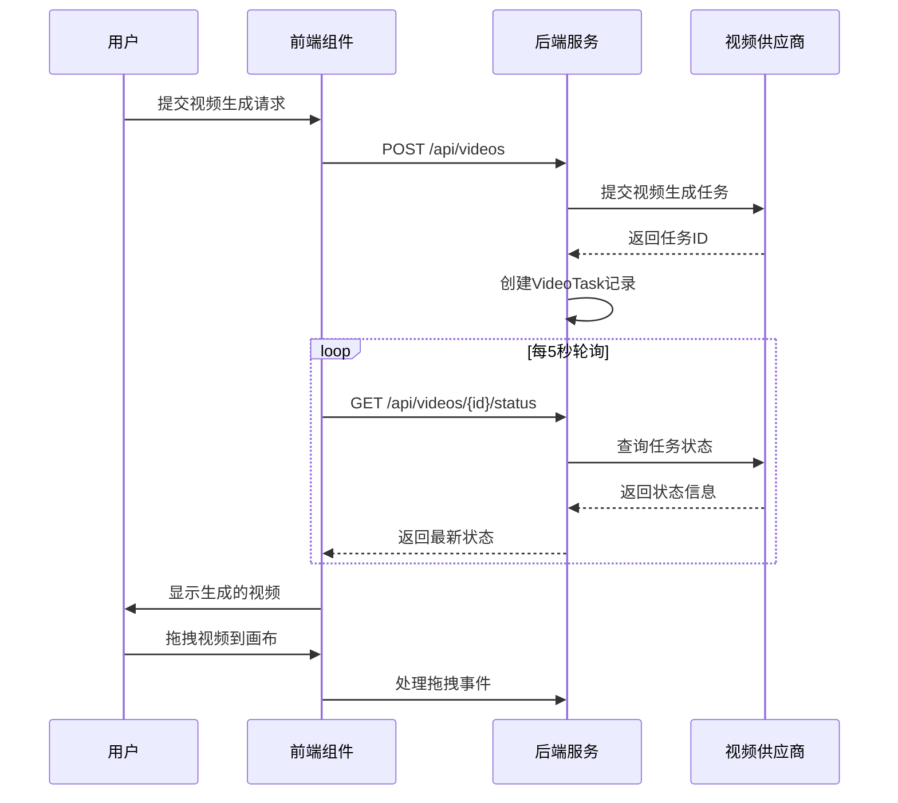
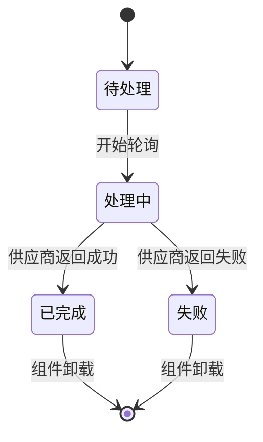
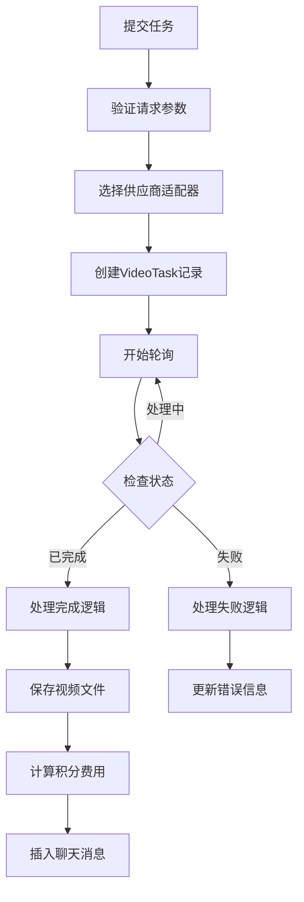
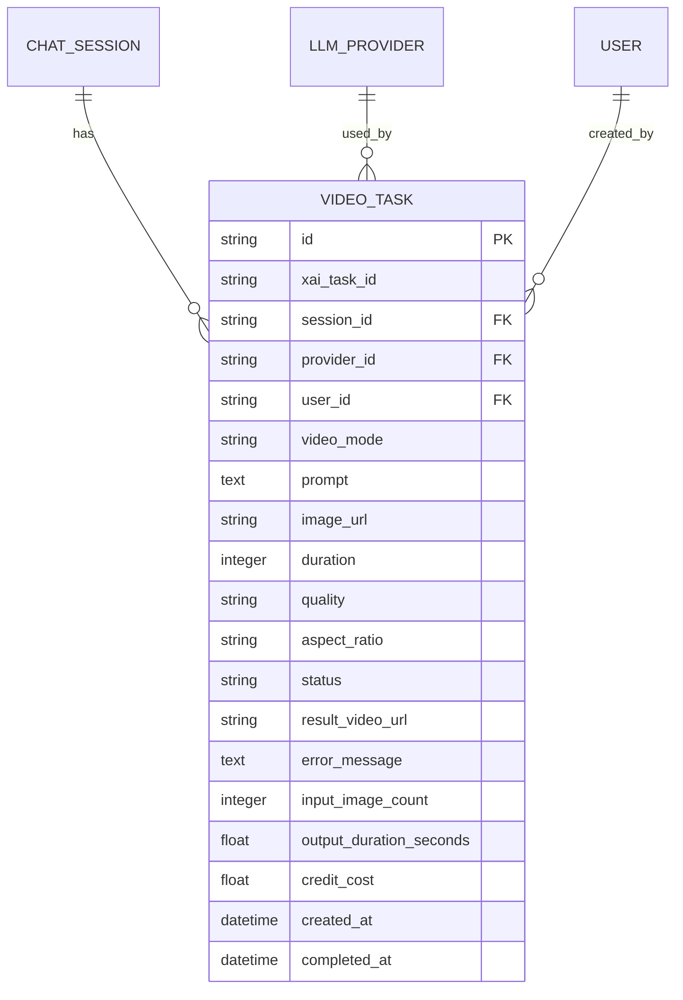
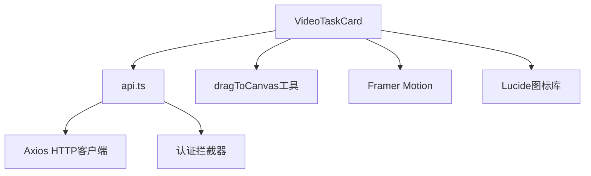
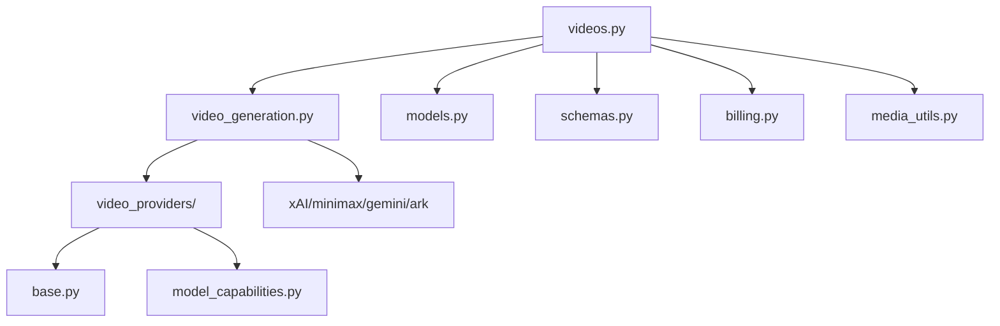

# 视频任务卡片增强

<cite>
**本文档引用的文件**
- [VideoTaskCard.tsx](file://frontend/src/components/ai-assistant/VideoTaskCard.tsx)
- [video_generation.py](file://backend/services/video_generation.py)
- [videos.py](file://backend/routers/videos.py)
- [base.py](file://backend/services/video_providers/base.py)
- [model_capabilities.py](file://backend/services/video_providers/model_capabilities.py)
- [models.py](file://backend/models.py)
- [schemas.py](file://backend/schemas.py)
- [api.ts](file://frontend/src/lib/api.ts)
- [video.ts](file://backend/admin/src/types/video.ts)
</cite>

## 目录
1. [简介](#简介)
2. [项目结构](#项目结构)
3. [核心组件](#核心组件)
4. [架构概览](#架构概览)
5. [详细组件分析](#详细组件分析)
6. [依赖关系分析](#依赖关系分析)
7. [性能考虑](#性能考虑)
8. [故障排除指南](#故障排除指南)
9. [结论](#结论)

## 简介

视频任务卡片增强是AI创想工坊平台中的一个关键功能模块，它为用户提供了一个直观、交互式的视频生成任务管理界面。该功能实现了从任务提交到结果展示的完整生命周期管理，包括实时状态跟踪、拖拽预览、错误处理和计费信息显示等功能。

该系统支持多种视频生成供应商（xAI、MiniMax、Gemini、Ark），提供了统一的API接口和用户体验，使用户能够轻松创建、监控和管理视频生成任务。

## 项目结构

视频任务卡片功能涉及前后端的完整架构设计：

```mermaid
graph TB
subgraph "前端层"
VTC[VideoTaskCard.tsx<br/>视频任务卡片组件]
API[api.ts<br/>API客户端]
UI[UI组件库<br/>按钮、对话框等]
end
subgraph "后端层"
VR[videos.py<br/>视频API路由]
VG[video_generation.py<br/>视频生成服务]
VP[video_providers/<br/>供应商适配器]
DB[(数据库)<br/>VideoTask模型]
end
subgraph "数据层"
SC[Schemas<br/>数据模型]
MC[Model Capabilities<br/>能力配置]
end
VTC --> API
API --> VR
VR --> VG
VG --> VP
VR --> DB
VG --> DB
DB --> SC
VP --> MC
```

**图表来源**
- [VideoTaskCard.tsx:1-291](file://frontend/src/components/ai-assistant/VideoTaskCard.tsx#L1-L291)
- [videos.py:1-344](file://backend/routers/videos.py#L1-L344)
- [video_generation.py:1-180](file://backend/services/video_generation.py#L1-L180)

**章节来源**
- [VideoTaskCard.tsx:1-291](file://frontend/src/components/ai-assistant/VideoTaskCard.tsx#L1-L291)
- [videos.py:1-344](file://backend/routers/videos.py#L1-L344)
- [video_generation.py:1-180](file://backend/services/video_generation.py#L1-L180)

## 核心组件

### 前端组件架构

视频任务卡片组件采用React Hooks和Framer Motion实现，具有以下核心特性：

- **状态管理**：使用useState和useEffect管理任务状态和生命周期
- **轮询机制**：每5秒轮询一次任务状态，直到达到终止状态
- **拖拽支持**：集成画布拖拽功能，支持将生成的视频直接拖放到画布
- **响应式设计**：支持深色/浅色主题，提供丰富的视觉反馈

### 后端服务架构

后端采用FastAPI框架，实现了统一的视频生成服务接口：

- **适配器模式**：支持多种视频生成供应商的统一接口
- **状态管理**：完整的任务生命周期状态跟踪
- **计费系统**：基于模型能力和使用时长的精确计费
- **错误处理**：完善的异常处理和状态恢复机制

**章节来源**
- [VideoTaskCard.tsx:130-291](file://frontend/src/components/ai-assistant/VideoTaskCard.tsx#L130-L291)
- [video_generation.py:90-180](file://backend/services/video_generation.py#L90-L180)

## 架构概览

视频任务卡片系统的整体架构采用分层设计，确保了良好的可维护性和扩展性：



**图表来源**
- [videos.py:150-234](file://backend/routers/videos.py#L150-L234)
- [VideoTaskCard.tsx:151-196](file://frontend/src/components/ai-assistant/VideoTaskCard.tsx#L151-L196)

## 详细组件分析

### 视频任务卡片组件

VideoTaskCard组件是整个功能的核心，实现了完整的任务管理体验：

#### 组件状态管理



**图表来源**
- [VideoTaskCard.tsx:25-38](file://frontend/src/components/ai-assistant/VideoTaskCard.tsx#L25-L38)

#### 拖拽预览功能

组件集成了专门的拖拽预览子组件，提供了直观的视频预览和操作功能：

- **拖拽指示器**：显示拖拽手柄和提示信息
- **视频播放器**：内嵌HTML5视频播放器
- **元数据显示**：显示画质、时长、积分消耗等信息
- **下载功能**：支持直接下载生成的视频文件

**章节来源**
- [VideoTaskCard.tsx:68-124](file://frontend/src/components/ai-assistant/VideoTaskCard.tsx#L68-L124)

### 后端API服务

#### 视频生成API路由

后端提供了完整的视频生成API服务，包括任务创建、状态查询和能力配置：



**图表来源**
- [videos.py:75-148](file://backend/routers/videos.py#L75-L148)

#### 供应商适配器架构

系统支持四种主要的视频生成供应商，每种都有专门的适配器：

| 供应商 | 模型支持 | 特殊功能 | 时长限制 |
|--------|----------|----------|----------|
| xAI (Grok) | grok-imagine-video | 参考图片、视频编辑、扩展 | 1-15秒 |
| MiniMax | Hailuo系列 | 首尾帧、主题参考 | 6秒、10秒 |
| Gemini | Veo 2.0/3.0/3.1 | 首尾帧、音频、扩展 | 4-15秒 |
| Ark | Seedance 1.0/2.0 | 多模态参考、音频 | 2-15秒 |

**章节来源**
- [video_generation.py:52-57](file://backend/services/video_generation.py#L52-L57)
- [model_capabilities.py:28-477](file://backend/services/video_providers/model_capabilities.py#L28-L477)

### 数据模型设计

#### VideoTask模型

数据库模型设计支持完整的任务生命周期管理：



**图表来源**
- [models.py:403-434](file://backend/models.py#L403-L434)

**章节来源**
- [models.py:403-434](file://backend/models.py#L403-L434)
- [schemas.py:660-699](file://backend/schemas.py#L660-L699)

## 依赖关系分析

### 前端依赖关系

前端组件之间的依赖关系相对简单，主要围绕状态管理和API通信：



**图表来源**
- [VideoTaskCard.tsx:1-10](file://frontend/src/components/ai-assistant/VideoTaskCard.tsx#L1-L10)

### 后端依赖关系

后端服务的依赖关系更加复杂，涉及多个模块和外部服务：



**图表来源**
- [videos.py:14-21](file://backend/routers/videos.py#L14-L21)
- [video_generation.py:29-38](file://backend/services/video_generation.py#L29-L38)

**章节来源**
- [VideoTaskCard.tsx:1-10](file://frontend/src/components/ai-assistant/VideoTaskCard.tsx#L1-L10)
- [videos.py:14-21](file://backend/routers/videos.py#L14-L21)

## 性能考虑

### 前端性能优化

1. **组件卸载清理**：确保轮询定时器在组件卸载时正确清理
2. **状态更新优化**：使用useCallback避免不必要的重新渲染
3. **资源管理**：及时清理拖拽预览的DOM元素

### 后端性能优化

1. **数据库索引**：为常用查询字段建立适当索引
2. **异步处理**：使用异步数据库操作避免阻塞
3. **缓存策略**：对频繁访问的模型能力配置进行缓存

## 故障排除指南

### 常见问题及解决方案

#### 任务状态轮询问题

**症状**：任务状态长时间保持pending
**可能原因**：
- 供应商API调用失败
- 网络连接问题
- 认证信息错误

**解决步骤**：
1. 检查供应商API密钥配置
2. 验证网络连接状态
3. 查看后端日志获取详细错误信息

#### 视频下载失败

**症状**：任务显示已完成但无法下载视频
**可能原因**：
- 供应商返回的URL不可访问
- 文件存储权限问题
- 网络防火墙阻止

**解决步骤**：
1. 验证供应商返回的视频URL
2. 检查服务器存储权限
3. 测试直接访问视频URL

#### 计费错误

**症状**：积分扣除异常
**可能原因**：
- 模型费率配置错误
- 计算精度问题
- 数据库事务冲突

**解决步骤**：
1. 验证模型费率配置
2. 检查计费计算逻辑
3. 确认数据库事务完整性

**章节来源**
- [videos.py:180-233](file://backend/routers/videos.py#L180-L233)
- [video_generation.py:103-125](file://backend/services/video_generation.py#L103-L125)

## 结论

视频任务卡片增强功能成功地将复杂的视频生成任务管理简化为直观易用的用户界面。通过前后端的紧密协作，用户可以实时跟踪任务状态、预览生成结果，并将视频无缝集成到创作流程中。

该系统的主要优势包括：

1. **统一接口**：支持多种视频生成供应商，提供一致的用户体验
2. **实时反馈**：通过轮询机制提供准确的任务状态更新
3. **直观操作**：拖拽预览功能简化了视频素材的使用
4. **完整计费**：精确的积分计算和透明的费用显示
5. **错误处理**：完善的异常处理和用户友好的错误提示

未来可以考虑的改进方向：
- 增加WebSocket实时推送支持
- 优化移动端用户体验
- 扩展更多视频生成供应商
- 增强视频编辑功能集成