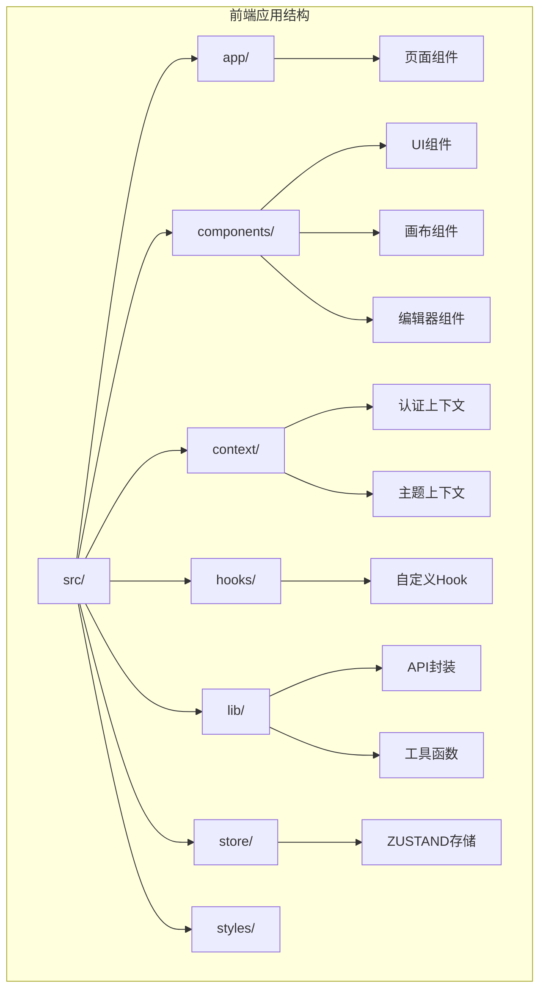
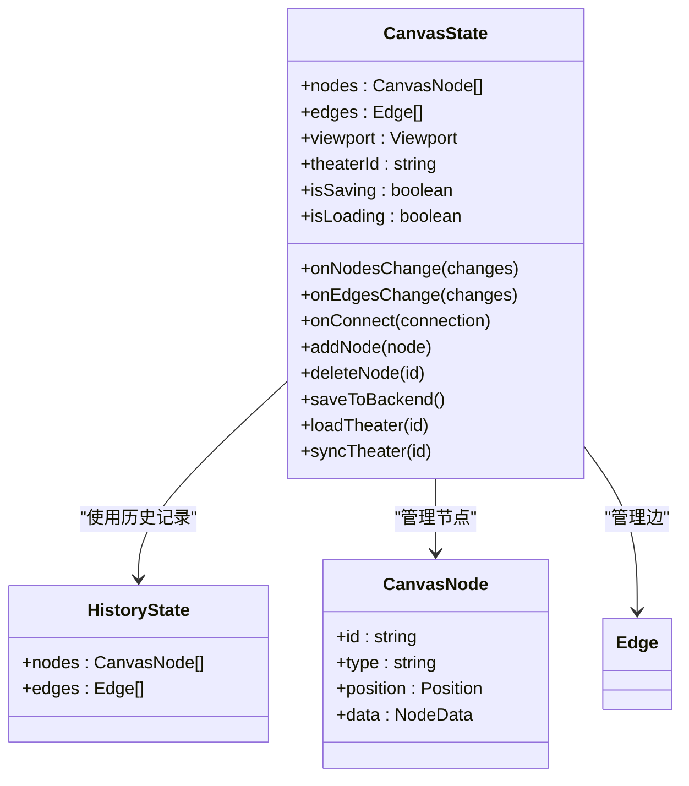
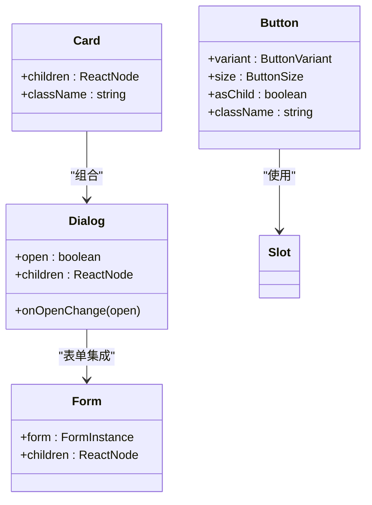
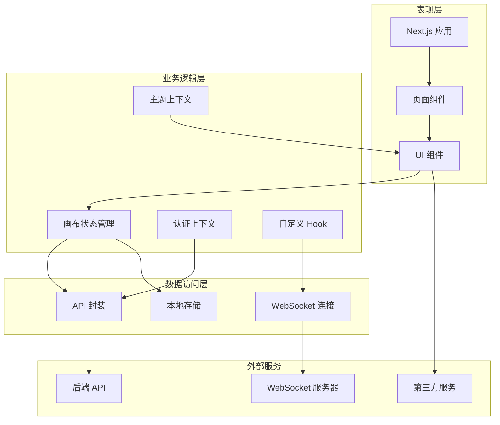
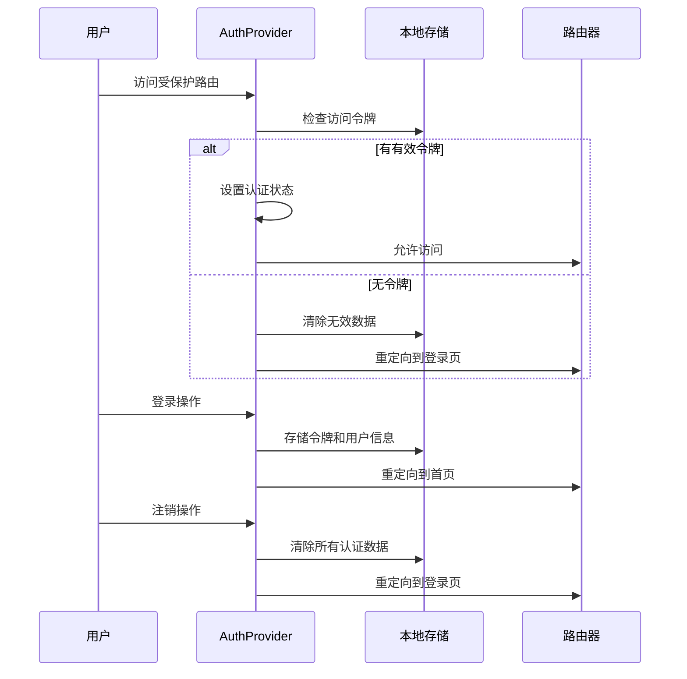
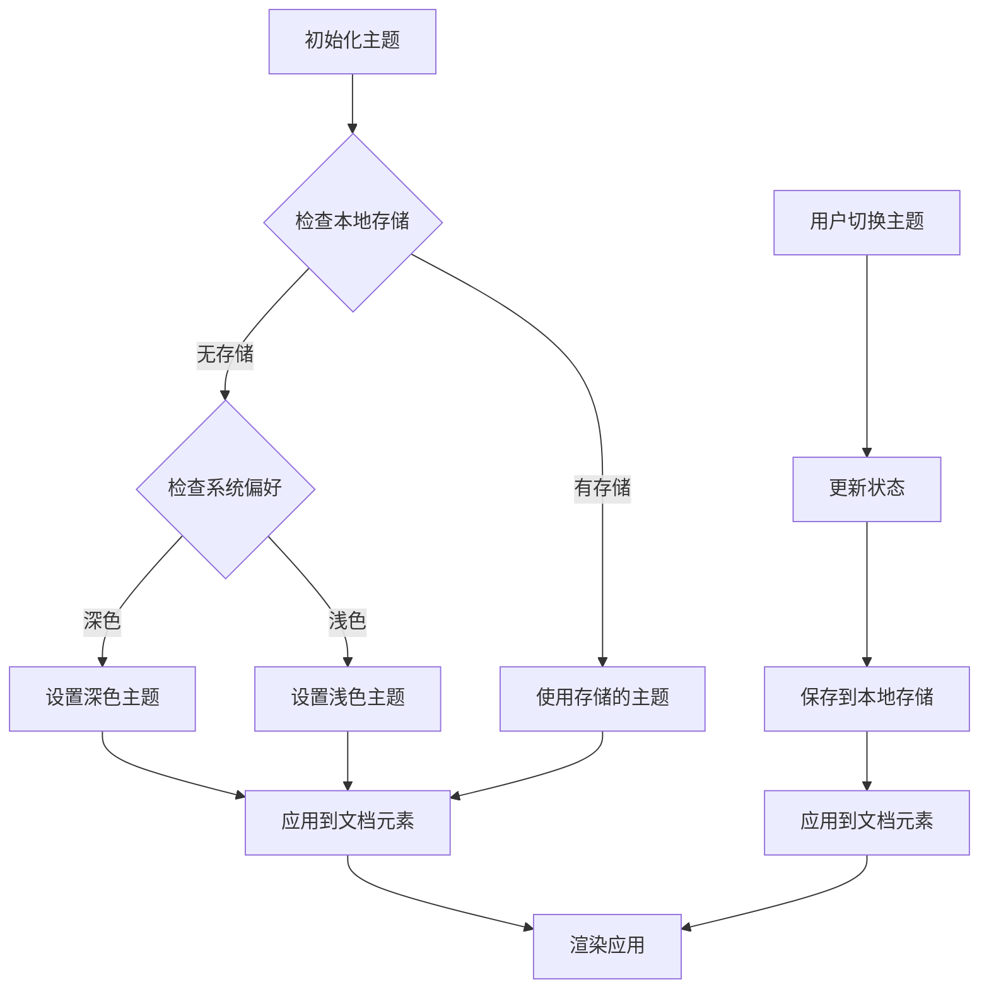
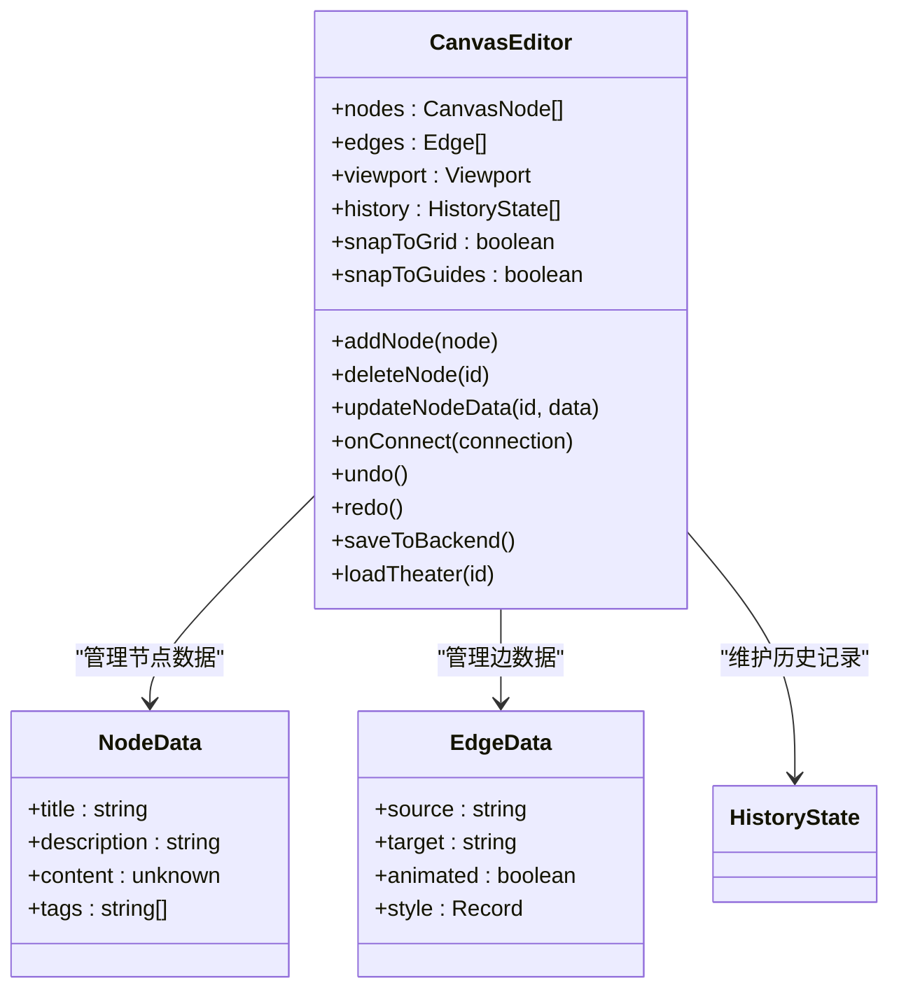
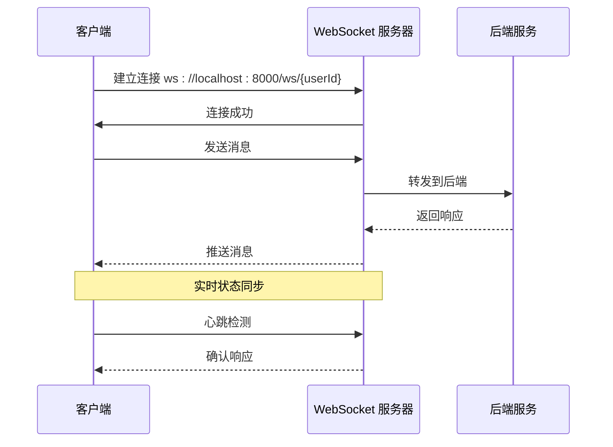
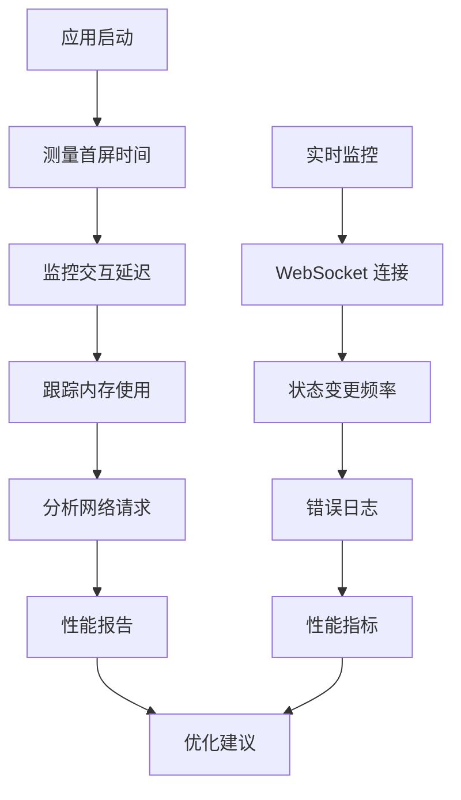

# 前端依赖更新

<cite>
**本文档中引用的文件**
- [package.json](file://frontend/package.json)
- [next.config.ts](file://frontend/next.config.ts)
- [tsconfig.json](file://frontend/tsconfig.json)
- [tailwind.config.ts](file://frontend/tailwind.config.ts)
- [components.json](file://frontend/components.json)
- [layout.tsx](file://frontend/src/app/layout.tsx)
- [button.tsx](file://frontend/src/components/ui/button.tsx)
- [utils.ts](file://frontend/src/lib/utils.ts)
- [AuthContext.tsx](file://frontend/src/context/AuthContext.tsx)
- [ThemeContext.tsx](file://frontend/src/context/ThemeContext.tsx)
- [useSocket.ts](file://frontend/src/hooks/useSocket.ts)
- [theaterApi.ts](file://frontend/src/lib/theaterApi.ts)
- [useCanvasStore.ts](file://frontend/src/store/useCanvasStore.ts)
</cite>

## 目录
1. [简介](#简介)
2. [项目结构](#项目结构)
3. [核心组件](#核心组件)
4. [架构概览](#架构概览)
5. [详细组件分析](#详细组件分析)
6. [依赖分析](#依赖分析)
7. [性能考虑](#性能考虑)
8. [故障排除指南](#故障排除指南)
9. [结论](#结论)

## 简介

本项目是一个基于 Next.js 16.1.6 构建的前端应用，采用现代化的前端技术栈，包括 React 19.2.3、TypeScript 5、TailwindCSS 4 和 Ant Design 组件库。项目实现了一个 AI 驱动的无限叙事剧院平台，支持可视化脚本编辑、角色管理、故事板创作和视频生成等功能。

该前端应用通过 ZUSTAND 状态管理、XYFLOW 图形编辑器、TIPTAP 富文本编辑器等核心技术，为用户提供了一个功能丰富的创作工具集。系统采用微服务架构，与后端 API 进行实时通信，并支持 WebSocket 连接用于实时数据同步。

## 项目结构

前端项目采用模块化组织方式，主要分为以下几个核心目录：



**图表来源**
- [layout.tsx:1-42](file://frontend/src/app/layout.tsx#L1-L42)
- [AuthContext.tsx:1-100](file://frontend/src/context/AuthContext.tsx#L1-L100)
- [ThemeContext.tsx:1-74](file://frontend/src/context/ThemeContext.tsx#L1-L74)

**章节来源**
- [package.json:1-92](file://frontend/package.json#L1-L92)
- [tsconfig.json:1-35](file://frontend/tsconfig.json#L1-L35)

## 核心组件

### 状态管理系统

项目使用 ZUSTAND 作为状态管理解决方案，实现了复杂的画布状态管理：



**图表来源**
- [useCanvasStore.ts:68-115](file://frontend/src/store/useCanvasStore.ts#L68-L115)
- [useCanvasStore.ts:121-169](file://frontend/src/store/useCanvasStore.ts#L121-L169)

### UI 组件体系

项目采用 shadcn/ui 设计系统，结合 Radix UI 和 Ant Design 组件：



**图表来源**
- [button.tsx:36-57](file://frontend/src/components/ui/button.tsx#L36-L57)
- [components.json:1-21](file://frontend/components.json#L1-L21)

**章节来源**
- [useCanvasStore.ts:1-541](file://frontend/src/store/useCanvasStore.ts#L1-L541)
- [button.tsx:1-57](file://frontend/src/components/ui/button.tsx#L1-L57)

## 架构概览

前端应用采用分层架构设计，各层职责明确：



**图表来源**
- [layout.tsx:23-41](file://frontend/src/app/layout.tsx#L23-L41)
- [AuthContext.tsx:50-99](file://frontend/src/context/AuthContext.tsx#L50-L99)
- [ThemeContext.tsx:16-64](file://frontend/src/context/ThemeContext.tsx#L16-L64)

## 详细组件分析

### 认证系统

认证系统实现了完整的用户身份验证流程：



**图表来源**
- [AuthContext.tsx:58-92](file://frontend/src/context/AuthContext.tsx#L58-L92)

### 主题管理系统

主题系统支持明暗模式切换和动态主题配置：



**图表来源**
- [ThemeContext.tsx:16-40](file://frontend/src/context/ThemeContext.tsx#L16-L40)

### 画布编辑器

画布编辑器是应用的核心功能模块：



**图表来源**
- [useCanvasStore.ts:68-115](file://frontend/src/store/useCanvasStore.ts#L68-L115)
- [useCanvasStore.ts:27-61](file://frontend/src/store/useCanvasStore.ts#L27-L61)

**章节来源**
- [AuthContext.tsx:1-100](file://frontend/src/context/AuthContext.tsx#L1-L100)
- [ThemeContext.tsx:1-74](file://frontend/src/context/ThemeContext.tsx#L1-L74)
- [useCanvasStore.ts:1-541](file://frontend/src/store/useCanvasStore.ts#L1-L541)

### 实时通信系统

WebSocket 实现了与后端的实时数据同步：



**图表来源**
- [useSocket.ts:8-33](file://frontend/src/hooks/useSocket.ts#L8-L33)

**章节来源**
- [useSocket.ts:1-43](file://frontend/src/hooks/useSocket.ts#L1-L43)

## 依赖分析

### 核心依赖关系

前端项目的主要依赖关系如下：

```mermaid
graph TB
subgraph "运行时依赖"
A[react@19.2.3]
B[react-dom@19.2.3]
C[next@16.1.6]
D[zustand@5.0.12]
E[@xyflow/react@12.10.1]
F[@tiptap/react@3.20.4]
G[antd@6.3.0]
H[framer-motion@12.34.3]
end
subgraph "开发依赖"
I[typescript@5]
J[@types/react@19]
K[tailwindcss@4]
L[jest@30.2.0]
M[eslint@9]
end
subgraph "UI 组件库"
N[shadcn/ui]
O[Radix UI]
P[Lucide React]
end
A --> E
A --> F
A --> D
C --> A
G --> A
E --> A
F --> A
D --> A
N --> O
N --> P
K --> N
```

**图表来源**
- [package.json:13-68](file://frontend/package.json#L13-L68)

### 版本兼容性

项目依赖的版本兼容性分析：

| 依赖包 | 当前版本 | 最新版本 | 兼容性 | 备注 |
|--------|----------|----------|--------|------|
| react | 19.2.3 | 19.x | ✅ 完全兼容 | 使用最新稳定版 |
| next | 16.1.6 | 16.x | ✅ 完全兼容 | 与 React 19 兼容 |
| zustand | 5.0.12 | 5.x | ✅ 兼容 | 新版本 API |
| @xyflow/react | 12.10.1 | 12.x | ✅ 兼容 | 支持最新特性 |
| @tiptap/react | 3.20.4 | 3.x | ✅ 兼容 | 最新稳定版 |
| antd | 6.3.0 | 6.x | ✅ 兼容 | 最新版本 |

**章节来源**
- [package.json:1-92](file://frontend/package.json#L1-L92)

## 性能考虑

### 优化策略

1. **代码分割**: Next.js 自动进行代码分割，按需加载页面组件
2. **懒加载**: 图表和编辑器组件采用懒加载策略
3. **状态优化**: ZUSTAND 提供高效的局部状态更新
4. **内存管理**: 画布状态使用持久化存储，避免重复计算
5. **渲染优化**: React 19 的并发特性提升渲染性能

### 性能监控



## 故障排除指南

### 常见问题及解决方案

#### 认证相关问题
- **问题**: 登录后无法访问受保护页面
- **原因**: 本地存储中的令牌过期或损坏
- **解决**: 清除浏览器缓存和本地存储，重新登录

#### WebSocket 连接问题
- **问题**: 实时功能不可用
- **原因**: 后端服务未启动或网络连接异常
- **解决**: 检查后端服务状态，确认端口 8000 可访问

#### 性能问题
- **问题**: 页面加载缓慢
- **原因**: 画布节点过多或图片资源过大
- **解决**: 优化节点数量，压缩图片资源

**章节来源**
- [AuthContext.tsx:58-92](file://frontend/src/context/AuthContext.tsx#L58-L92)
- [useSocket.ts:8-33](file://frontend/src/hooks/useSocket.ts#L8-L33)

## 结论

本前端项目展现了现代 React 应用的最佳实践，采用了最新的技术栈和架构模式。项目具有以下特点：

1. **技术先进性**: 使用 React 19、Next.js 16、TypeScript 5 等最新技术
2. **架构清晰**: 分层架构设计，职责分离明确
3. **用户体验**: 提供流畅的交互体验和实时协作功能
4. **可扩展性**: 模块化设计便于功能扩展和维护

通过合理的依赖管理和性能优化，项目能够提供稳定可靠的服务。建议持续关注新技术发展，适时更新依赖版本以获得更好的性能和安全性。