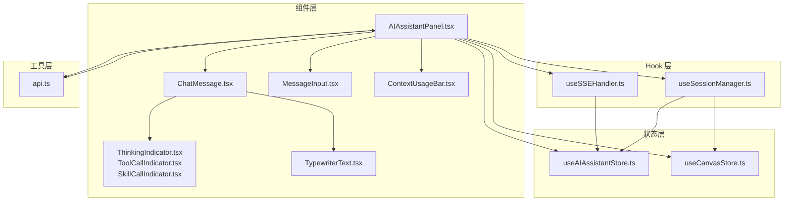
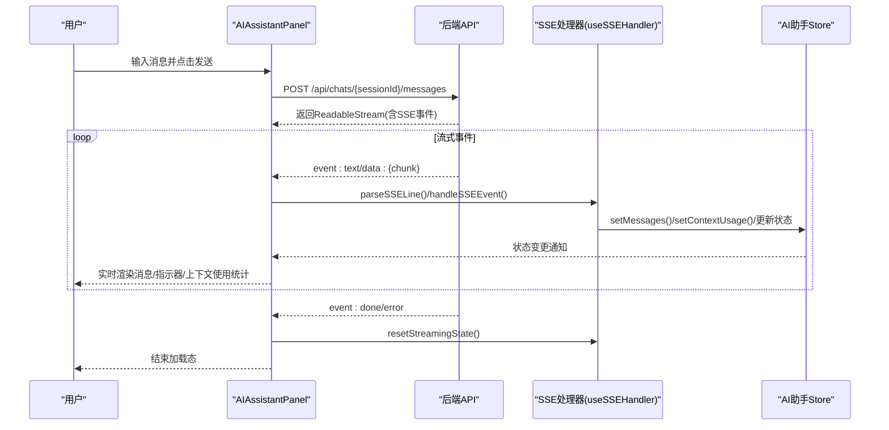
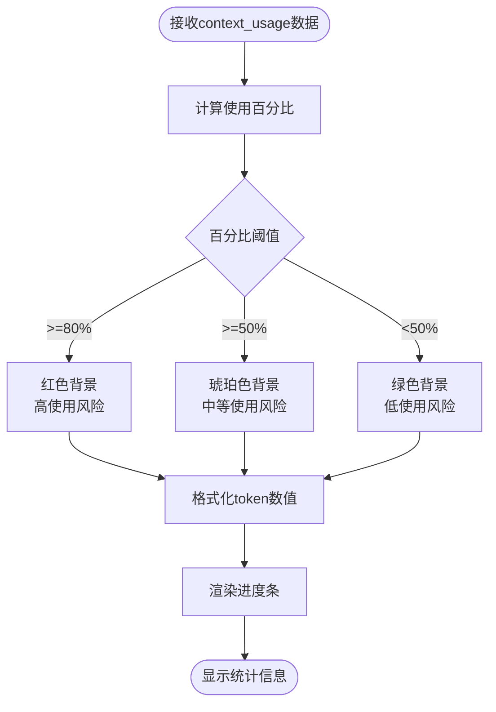
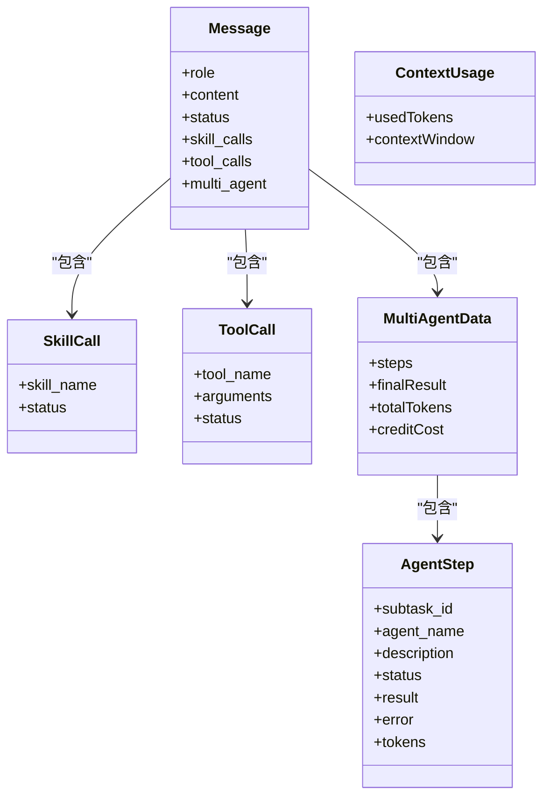
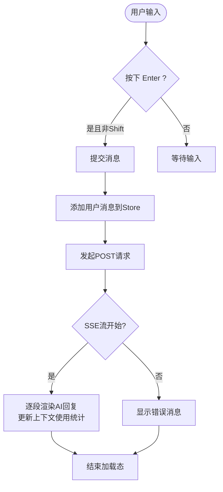
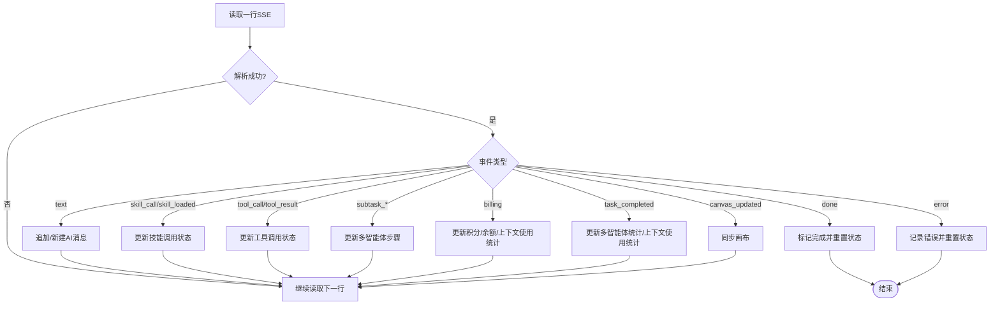
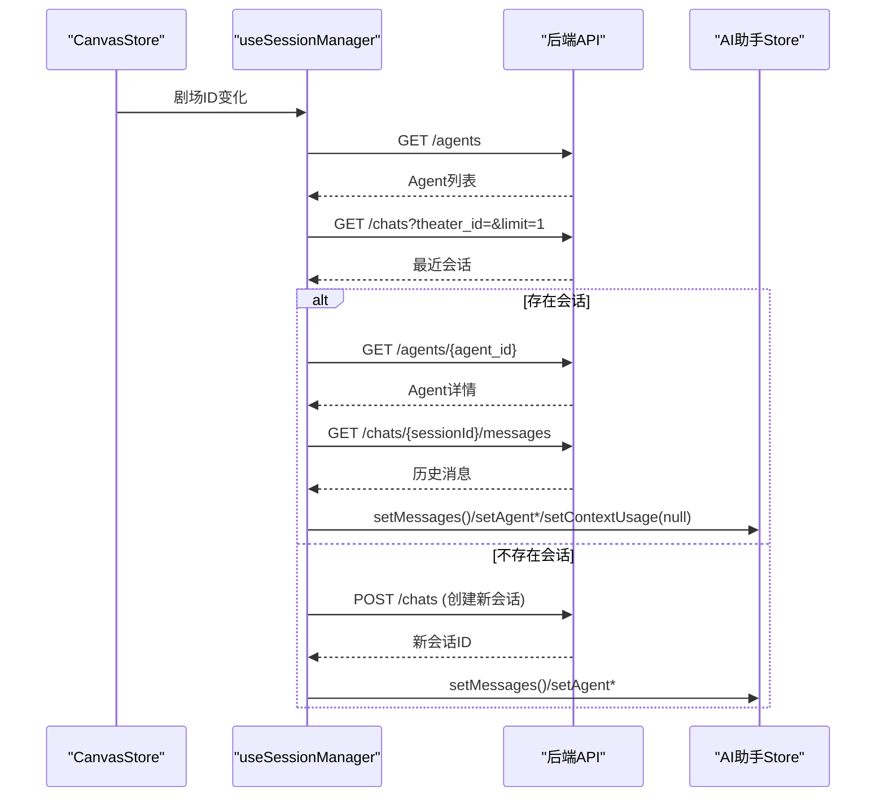
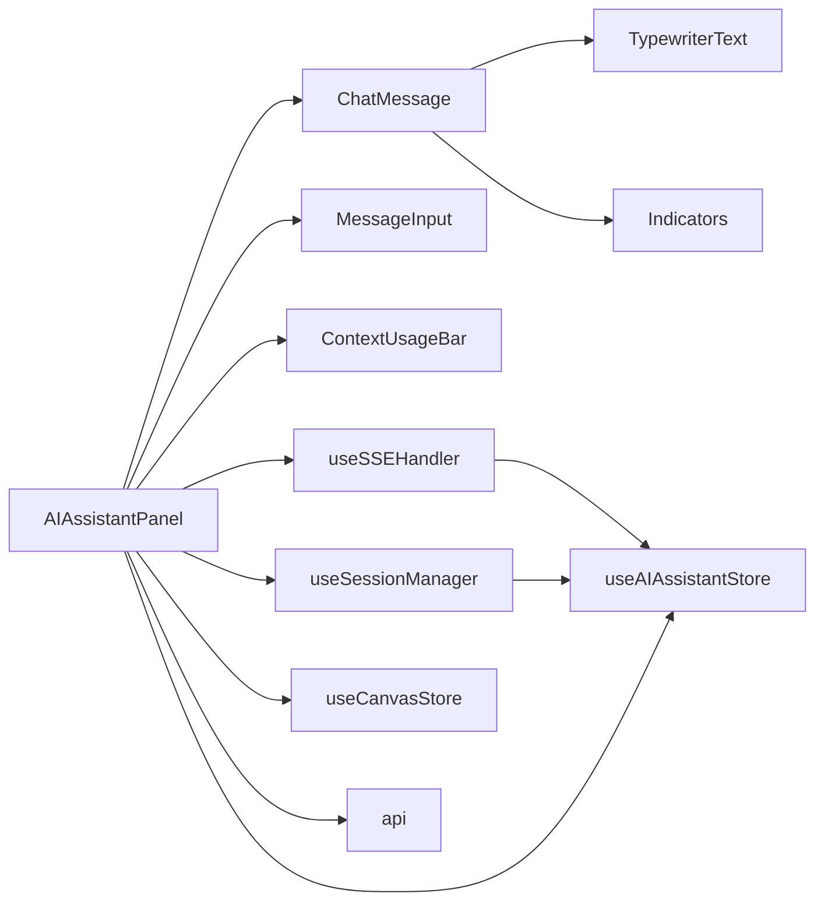

# AI助手组件

<cite>
**本文档引用的文件**
- [AIAssistantPanel.tsx](file://frontend/src/components/canvas/AIAssistantPanel.tsx)
- [index.ts](file://frontend/src/components/ai-assistant/index.ts)
- [ChatMessage.tsx](file://frontend/src/components/ai-assistant/ChatMessage.tsx)
- [MessageInput.tsx](file://frontend/src/components/ai-assistant/MessageInput.tsx)
- [ThinkingIndicator.tsx](file://frontend/src/components/ai-assistant/ThinkingIndicator.tsx)
- [ToolCallIndicator.tsx](file://frontend/src/components/ai-assistant/ToolCallIndicator.tsx)
- [SkillCallIndicator.tsx](file://frontend/src/components/ai-assistant/SkillCallIndicator.tsx)
- [TypewriterText.tsx](file://frontend/src/components/ai-assistant/TypewriterText.tsx)
- [ContextUsageBar.tsx](file://frontend/src/components/ai-assistant/ContextUsageBar.tsx)
- [useSSEHandler.ts](file://frontend/src/components/ai-assistant/hooks/useSSEHandler.ts)
- [useSessionManager.ts](file://frontend/src/components/ai-assistant/hooks/useSessionManager.ts)
- [useAIAssistantStore.ts](file://frontend/src/store/useAIAssistantStore.ts)
- [useCanvasStore.ts](file://frontend/src/store/useCanvasStore.ts)
- [api.ts](file://frontend/src/lib/api.ts)
</cite>

## 目录
1. [简介](#简介)
2. [项目结构](#项目结构)
3. [核心组件](#核心组件)
4. [架构总览](#架构总览)
5. [详细组件分析](#详细组件分析)
6. [依赖关系分析](#依赖关系分析)
7. [性能考量](#性能考量)
8. [故障排查指南](#故障排查指南)
9. [结论](#结论)
10. [附录](#附录)

## 简介
本文件系统性地解析 Infinite Game 中的 AI 助手组件，涵盖：
- AI 聊天界面的实现：消息显示、输入处理与实时响应的交互逻辑
- 消息组件设计：文本消息、工具调用指示器、思考过程显示
- SSE（Server-Sent Events）处理器：流式响应处理、错误处理与连接管理
- 会话管理器：对话历史维护、状态保存与并发控制
- 实时通信机制：WebSocket 连接、消息队列与状态同步
- 使用示例与扩展开发指南：自定义消息类型与交互行为

## 项目结构
AI 助手位于前端工程的组件目录中，采用"按功能域组织"的方式：
- 组件层：AI 助手面板、消息渲染、输入控件、状态指示器、上下文使用统计栏
- Hook 层：SSE 处理、会话管理
- 状态层：AI 助手 Store、画布 Store
- 工具层：API 封装（Axios + Token 刷新）

**图表来源**
- [AIAssistantPanel.tsx:1-329](file://frontend/src/components/canvas/AIAssistantPanel.tsx#L1-L329)
- [ChatMessage.tsx:1-126](file://frontend/src/components/ai-assistant/ChatMessage.tsx#L1-L126)
- [MessageInput.tsx:1-110](file://frontend/src/components/ai-assistant/MessageInput.tsx#L1-L110)
- [ThinkingIndicator.tsx:1-56](file://frontend/src/components/ai-assistant/ThinkingIndicator.tsx#L1-L56)
- [ToolCallIndicator.tsx:1-109](file://frontend/src/components/ai-assistant/ToolCallIndicator.tsx#L1-L109)
- [SkillCallIndicator.tsx:1-55](file://frontend/src/components/ai-assistant/SkillCallIndicator.tsx#L1-L55)
- [TypewriterText.tsx:1-81](file://frontend/src/components/ai-assistant/TypewriterText.tsx#L1-L81)
- [ContextUsageBar.tsx:1-42](file://frontend/src/components/ai-assistant/ContextUsageBar.tsx#L1-L42)
- [useSSEHandler.ts:1-357](file://frontend/src/components/ai-assistant/hooks/useSSEHandler.ts#L1-L357)
- [useSessionManager.ts:1-179](file://frontend/src/components/ai-assistant/hooks/useSessionManager.ts#L1-L179)
- [useAIAssistantStore.ts:1-294](file://frontend/src/store/useAIAssistantStore.ts#L1-L294)
- [useCanvasStore.ts:1-540](file://frontend/src/store/useCanvasStore.ts#L1-L540)
- [api.ts:1-84](file://frontend/src/lib/api.ts#L1-L84)

**章节来源**
- [AIAssistantPanel.tsx:1-329](file://frontend/src/components/canvas/AIAssistantPanel.tsx#L1-L329)
- [index.ts:1-23](file://frontend/src/components/ai-assistant/index.ts#L1-L23)

## 核心组件
- AI 助手面板：负责面板生命周期、消息渲染、输入处理、SSE 流式接收与状态同步
- 消息组件：根据角色与状态渲染用户消息、AI 文本、思考指示器、工具/技能调用指示器、多智能体协作步骤
- 输入组件：支持回车发送、Shift+Enter 换行、禁用态与加载态反馈
- 上下文使用统计栏：实时显示token使用百分比和具体数值，提供视觉化的使用状态反馈
- SSE 处理 Hook：解析 SSE 事件、维护流式状态、更新 Store、处理多智能体与计费信息
- 会话管理 Hook：加载 Agent 列表、创建/切换会话、加载历史、清空会话、跨剧场切换
- Store：集中管理消息、会话、Agent、面板尺寸位置、画布关联、上下文使用统计等状态，并持久化
- API 工具：统一请求头注入、401 自动刷新、请求队列与重试

**章节来源**
- [AIAssistantPanel.tsx:14-329](file://frontend/src/components/canvas/AIAssistantPanel.tsx#L14-L329)
- [ChatMessage.tsx:52-126](file://frontend/src/components/ai-assistant/ChatMessage.tsx#L52-L126)
- [MessageInput.tsx:17-110](file://frontend/src/components/ai-assistant/MessageInput.tsx#L17-L110)
- [ContextUsageBar.tsx:16-42](file://frontend/src/components/ai-assistant/ContextUsageBar.tsx#L16-L42)
- [useSSEHandler.ts:24-357](file://frontend/src/components/ai-assistant/hooks/useSSEHandler.ts#L24-L357)
- [useSessionManager.ts:12-179](file://frontend/src/components/ai-assistant/hooks/useSessionManager.ts#L12-L179)
- [useAIAssistantStore.ts:74-294](file://frontend/src/store/useAIAssistantStore.ts#L74-L294)
- [api.ts:1-84](file://frontend/src/lib/api.ts#L1-L84)

## 架构总览
AI 助手通过"面板 + 组件 + Hook + Store + API"的分层架构实现端到端的实时对话体验。关键流程：
- 用户在面板输入消息，面板发起 POST 请求至后端会话消息接口
- 后端以 SSE 流返回事件：文本增量、工具/技能调用、多智能体步骤、计费信息、完成与错误
- SSE 处理 Hook 解析事件并更新 Store，面板监听 Store 变化进行渲染
- 会话管理 Hook 负责会话生命周期与剧场切换，确保跨剧场状态隔离与恢复
- 上下文使用统计栏实时显示token使用情况，提供用户友好的资源使用可视化

**图表来源**
- [AIAssistantPanel.tsx:87-179](file://frontend/src/components/canvas/AIAssistantPanel.tsx#L87-L179)
- [useSSEHandler.ts:63-357](file://frontend/src/components/ai-assistant/hooks/useSSEHandler.ts#L63-L357)
- [useAIAssistantStore.ts:206-221](file://frontend/src/store/useAIAssistantStore.ts#L206-L221)

## 详细组件分析

### 上下文使用统计栏
- 实时token使用监控：显示当前使用的token数量与上下文窗口限制的比例
- 可视化进度条：根据使用百分比动态改变颜色（绿色<50%，琥珀色<80%，红色≥80%）
- 数值格式化：超过1000的token数以K为单位显示，提升可读性
- 状态反馈：提供用户友好的资源使用状态提示，帮助用户了解模型上下文限制

**图表来源**
- [ContextUsageBar.tsx:6-42](file://frontend/src/components/ai-assistant/ContextUsageBar.tsx#L6-L42)
- [useSSEHandler.ts:260-264](file://frontend/src/components/ai-assistant/hooks/useSSEHandler.ts#L260-L264)

**章节来源**
- [ContextUsageBar.tsx:16-42](file://frontend/src/components/ai-assistant/ContextUsageBar.tsx#L16-L42)

### 消息组件设计
- 文本消息渲染：支持 Markdown 渲染与代码块高亮；流式渲染使用打字机效果光标
- 思考过程显示：当消息处于流式且无内容/工具/技能调用时，显示"AI 正在思考"指示器
- 工具调用指示器：可展开查看参数与结果，区分执行中/已完成状态
- 技能调用指示器：显示技能加载进度
- 多智能体协作：展示子任务创建、运行、完成/失败、最终结果与计费统计

**图表来源**
- [useAIAssistantStore.ts:42-50](file://frontend/src/store/useAIAssistantStore.ts#L42-L50)
- [useAIAssistantStore.ts:7-18](file://frontend/src/store/useAIAssistantStore.ts#L7-L18)
- [useAIAssistantStore.ts:20-37](file://frontend/src/store/useAIAssistantStore.ts#L20-L37)
- [useAIAssistantStore.ts:74-78](file://frontend/src/store/useAIAssistantStore.ts#L74-L78)

**章节来源**
- [ChatMessage.tsx:52-126](file://frontend/src/components/ai-assistant/ChatMessage.tsx#L52-L126)
- [TypewriterText.tsx:50-81](file://frontend/src/components/ai-assistant/TypewriterText.tsx#L50-L81)
- [ThinkingIndicator.tsx:13-56](file://frontend/src/components/ai-assistant/ThinkingIndicator.tsx#L13-L56)
- [ToolCallIndicator.tsx:20-109](file://frontend/src/components/ai-assistant/ToolCallIndicator.tsx#L20-L109)
- [SkillCallIndicator.tsx:18-55](file://frontend/src/components/ai-assistant/SkillCallIndicator.tsx#L18-L55)

### 输入处理与交互逻辑
- 支持 Enter 发送、Shift+Enter 换行
- 发送后自动聚焦输入框，加载态禁用发送按钮
- 面板打开时自动滚动到底部，保持最佳阅读体验
- ESC 关闭面板，拖拽调整面板位置

**图表来源**
- [MessageInput.tsx:32-50](file://frontend/src/components/ai-assistant/MessageInput.tsx#L32-L50)
- [AIAssistantPanel.tsx:87-179](file://frontend/src/components/canvas/AIAssistantPanel.tsx#L87-L179)

**章节来源**
- [MessageInput.tsx:17-110](file://frontend/src/components/ai-assistant/MessageInput.tsx#L17-L110)
- [AIAssistantPanel.tsx:62-65](file://frontend/src/components/canvas/AIAssistantPanel.tsx#L62-L65)
- [AIAssistantPanel.tsx:53-60](file://frontend/src/components/canvas/AIAssistantPanel.tsx#L53-L60)

### SSE（Server-Sent Events）处理器
- 事件解析：按行解析 event 与 data，维护流式状态
- 流式文本：同轮次追加，新轮次创建新消息气泡
- 工具/技能调用：记录执行状态，支持参数与结果展开查看
- 多智能体：子任务创建/开始/完成/失败，聚合最终结果与计费
- 计费与画布同步：实时更新用户积分余额，必要时同步画布
- 上下文使用统计：实时更新token使用情况，提供可视化反馈
- 完成与错误：统一收尾与错误提示

**图表来源**
- [useSSEHandler.ts:52-61](file://frontend/src/components/ai-assistant/hooks/useSSEHandler.ts#L52-L61)
- [useSSEHandler.ts:66-357](file://frontend/src/components/ai-assistant/hooks/useSSEHandler.ts#L66-L357)

**章节来源**
- [useSSEHandler.ts:24-357](file://frontend/src/components/ai-assistant/hooks/useSSEHandler.ts#L24-L357)

### 会话管理器
- Agent 列表加载：首次打开或切换剧场时拉取可用 Agent
- 会话创建/复用：按剧场查找最近会话，不存在则创建
- 历史加载：拉取消息历史并映射为内部消息格式
- Agent 切换：创建新会话并保留剧场上下文
- 清空会话：删除消息并保留会话信息
- 剧场切换：保存当前剧场会话，加载目标剧场会话或初始化默认消息

**图表来源**
- [useSessionManager.ts:32-108](file://frontend/src/components/ai-assistant/hooks/useSessionManager.ts#L32-L108)
- [useSessionManager.ts:150-165](file://frontend/src/components/ai-assistant/hooks/useSessionManager.ts#L150-L165)
- [useAIAssistantStore.ts:165-204](file://frontend/src/store/useAIAssistantStore.ts#L165-L204)

**章节来源**
- [useSessionManager.ts:12-179](file://frontend/src/components/ai-assistant/hooks/useSessionManager.ts#L12-L179)
- [useAIAssistantStore.ts:74-294](file://frontend/src/store/useAIAssistantStore.ts#L74-L294)

### 实时通信机制
- WebSocket：当前实现基于浏览器 Fetch + ReadableStream + SSE，未直接使用 WebSocket
- 消息队列：Store 内部以数组维护消息队列，支持函数式更新
- 状态同步：Store 与画布 Store 分离，通过剧场 ID 关联不同会话缓存
- 并发控制：AbortController 在每次发送前取消上一次请求，避免竞态
- 上下文使用统计：通过SSE事件实时更新，提供即时的资源使用反馈

**章节来源**
- [AIAssistantPanel.tsx:107-179](file://frontend/src/components/canvas/AIAssistantPanel.tsx#L107-L179)
- [useAIAssistantStore.ts:206-221](file://frontend/src/store/useAIAssistantStore.ts#L206-L221)
- [useCanvasStore.ts:185-540](file://frontend/src/store/useCanvasStore.ts#L185-L540)

## 依赖关系分析
- 组件依赖：面板依赖消息、输入、上下文使用统计栏、Hook 与 Store；消息组件依赖指示器与打字机文本
- Hook 依赖：SSE 处理依赖 Store 与画布 Store；会话管理依赖 API 与画布 Store
- 状态依赖：AI 助手 Store 依赖持久化中间件；画布 Store 管理剧场同步
- 外部依赖：Axios、Framer Motion、React Markdown、Zustand、Lucide Icons

**图表来源**
- [AIAssistantPanel.tsx:10-12](file://frontend/src/components/canvas/AIAssistantPanel.tsx#L10-L12)
- [useSSEHandler.ts:4-7](file://frontend/src/components/ai-assistant/hooks/useSSEHandler.ts#L4-L7)
- [useSessionManager.ts:4-6](file://frontend/src/components/ai-assistant/hooks/useSessionManager.ts#L4-L6)
- [useAIAssistantStore.ts:1-3](file://frontend/src/store/useAIAssistantStore.ts#L1-L3)
- [useCanvasStore.ts:2-3](file://frontend/src/store/useCanvasStore.ts#L2-L3)
- [api.ts:1-2](file://frontend/src/lib/api.ts#L1-L2)

**章节来源**
- [index.ts:1-23](file://frontend/src/components/ai-assistant/index.ts#L1-L23)

## 性能考量
- 渲染优化：仅对最新消息进行打字机渲染；Markdown 渲染按需进行
- 状态更新：使用函数式 setMessages，减少不必要的重渲染
- 流式处理：按行解析 SSE，避免一次性拼接大字符串
- 并发控制：AbortController 取消上一次请求，防止消息错乱
- 存储策略：Store 使用持久化中间件，避免页面刷新丢失状态
- 上下文使用统计：轻量级的UI组件，仅在有数据时渲染，不影响性能

## 故障排查指南
- 401 未授权：API 拦截器会尝试刷新令牌，若失败则跳转登录页
- 402 积分不足：SSE 处理器与面板均会提示并记录友好消息
- 请求被中断：面板捕获 AbortError，不显示错误消息
- SSE 解析异常：parseSSELine 对无效行忽略，保证健壮性
- 画布同步：仅当剧场 ID 匹配时才同步，避免跨剧场干扰
- 上下文使用统计：当context_usage数据缺失时，组件会优雅降级为隐藏状态

**章节来源**
- [api.ts:31-81](file://frontend/src/lib/api.ts#L31-L81)
- [AIAssistantPanel.tsx:133-179](file://frontend/src/components/canvas/AIAssistantPanel.tsx#L133-L179)
- [useSSEHandler.ts:318-327](file://frontend/src/components/ai-assistant/hooks/useSSEHandler.ts#L318-L327)

## 结论
AI 助手组件通过清晰的分层与职责划分，实现了流畅的实时对话体验。其优势在于：
- 组件解耦、易于扩展
- SSE 流式处理与 Store 集中式状态管理
- 会话与剧场的强关联与持久化
- 友好的错误处理与用户提示
- 实时的上下文使用统计反馈，提升用户体验

## 附录

### 使用示例
- 基础集成：在画布页面引入 AI 助手面板组件，即可获得完整的聊天能力
- 自定义消息类型：在 Store 的 Message 类型中扩展字段，配合 ChatMessage 渲染
- 自定义交互行为：通过 PanelHeader 的 Agent 切换回调与 clearSession 回调扩展业务逻辑
- 上下文使用统计：通过contextUsageBar组件获取实时token使用情况

**章节来源**
- [AIAssistantPanel.tsx:268-305](file://frontend/src/components/canvas/AIAssistantPanel.tsx#L268-L305)
- [useAIAssistantStore.ts:42-50](file://frontend/src/store/useAIAssistantStore.ts#L42-L50)

### 扩展开发指南
- 新增事件类型：在 SSE 处理器中新增事件分支，更新 Store 状态
- 新增指示器：参考 ToolCallIndicator/SkillCallIndicator 设计，提供可展开详情
- 多智能体扩展：在 MultiAgentData 中增加更多统计维度，如耗时、成功率
- 画布联动：利用 canvas_updated 事件同步画布节点状态
- 上下文使用统计扩展：可在SSE处理器中添加更多context_usage相关的事件处理

**章节来源**
- [useSSEHandler.ts:66-357](file://frontend/src/components/ai-assistant/hooks/useSSEHandler.ts#L66-L357)
- [SkillCallIndicator.tsx:18-55](file://frontend/src/components/ai-assistant/SkillCallIndicator.tsx#L18-L55)
- [ToolCallIndicator.tsx:20-109](file://frontend/src/components/ai-assistant/ToolCallIndicator.tsx#L20-L109)