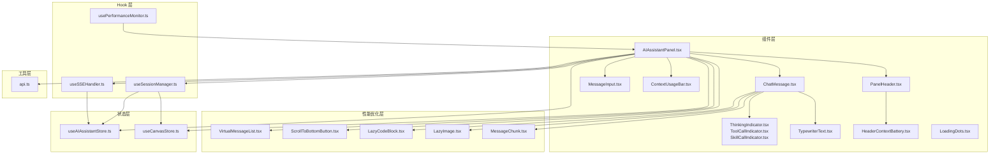
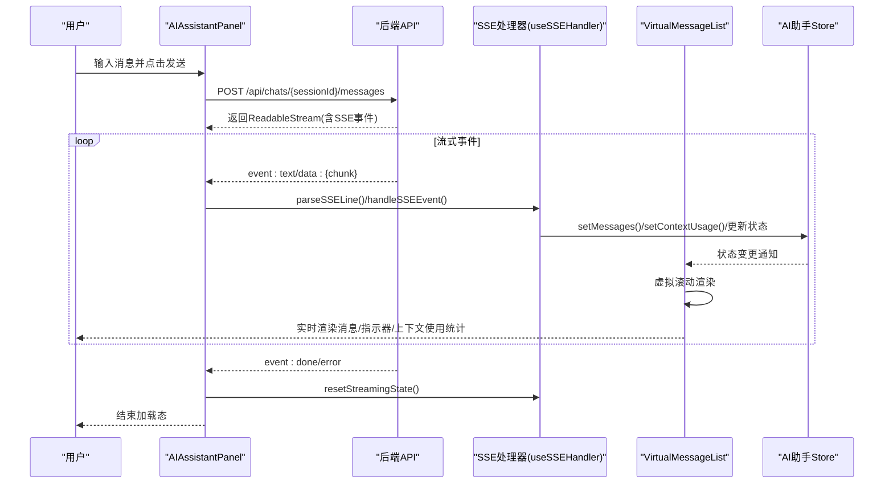
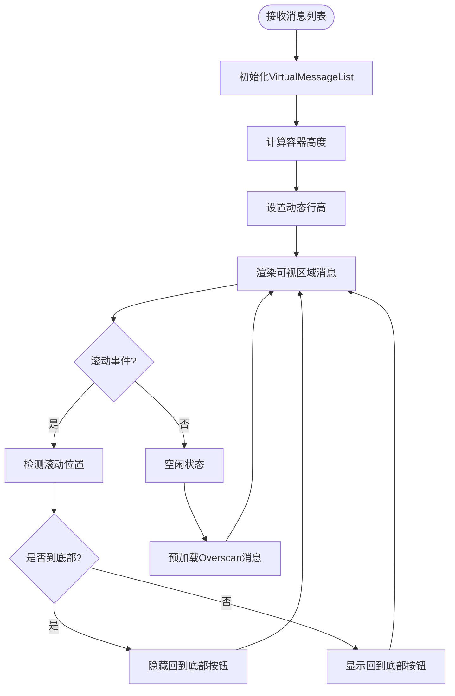
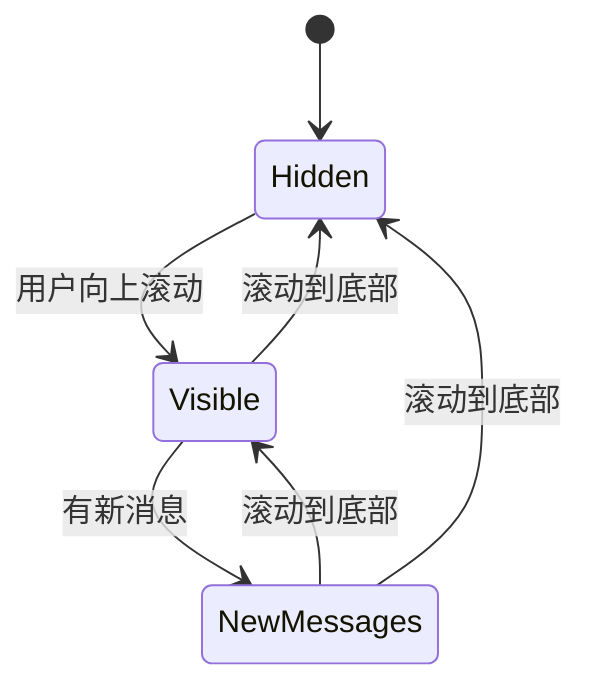
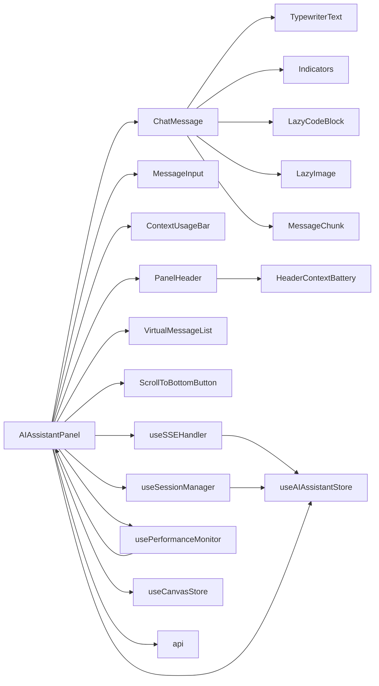

# AI助手组件

<cite>
**本文档引用的文件**
- [AIAssistantPanel.tsx](file://frontend/src/components/canvas/AIAssistantPanel.tsx)
- [index.ts](file://frontend/src/components/ai-assistant/index.ts)
- [ChatMessage.tsx](file://frontend/src/components/ai-assistant/ChatMessage.tsx)
- [MessageInput.tsx](file://frontend/src/components/ai-assistant/MessageInput.tsx)
- [ThinkingIndicator.tsx](file://frontend/src/components/ai-assistant/ThinkingIndicator.tsx)
- [ToolCallIndicator.tsx](file://frontend/src/components/ai-assistant/ToolCallIndicator.tsx)
- [SkillCallIndicator.tsx](file://frontend/src/components/ai-assistant/SkillCallIndicator.tsx)
- [TypewriterText.tsx](file://frontend/src/components/ai-assistant/TypewriterText.tsx)
- [ContextUsageBar.tsx](file://frontend/src/components/ai-assistant/ContextUsageBar.tsx)
- [PanelHeader.tsx](file://frontend/src/components/ai-assistant/PanelHeader.tsx)
- [HeaderContextBattery.tsx](file://frontend/src/components/ai-assistant/HeaderContextBattery.tsx)
- [VirtualMessageList.tsx](file://frontend/src/components/ai-assistant/VirtualMessageList.tsx)
- [ScrollToBottomButton.tsx](file://frontend/src/components/ai-assistant/ScrollToBottomButton.tsx)
- [LazyCodeBlock.tsx](file://frontend/src/components/ai-assistant/LazyCodeBlock.tsx)
- [LazyImage.tsx](file://frontend/src/components/ai-assistant/LazyImage.tsx)
- [MessageChunk.tsx](file://frontend/src/components/ai-assistant/MessageChunk.tsx)
- [useSSEHandler.ts](file://frontend/src/components/ai-assistant/hooks/useSSEHandler.ts)
- [useSessionManager.ts](file://frontend/src/components/ai-assistant/hooks/useSessionManager.ts)
- [usePerformanceMonitor.ts](file://frontend/src/components/ai-assistant/hooks/usePerformanceMonitor.ts)
- [useAIAssistantStore.ts](file://frontend/src/store/useAIAssistantStore.ts)
- [useCanvasStore.ts](file://frontend/src/store/useCanvasStore.ts)
- [api.ts](file://frontend/src/lib/api.ts)
- [LoadingDots.tsx](file://frontend/src/components/ai-assistant/LoadingDots.tsx)
</cite>

## 更新摘要
**变更内容**
- 新增性能优化组件：LazyCodeBlock、LazyImage、MessageChunk、VirtualMessageList、ScrollToBottomButton
- ChatMessage组件性能优化：移除浮动跳跃的三点加载动画，集成懒加载组件
- VirtualMessageList虚拟滚动实现：大幅提升长消息列表渲染性能
- 性能监控增强：新增usePerformanceMonitor Hook，提供全面的性能指标监控
- 滚动控制优化：新增回到底部按钮，改善用户体验

## 目录
1. [简介](#简介)
2. [项目结构](#项目结构)
3. [核心组件](#核心组件)
4. [架构总览](#架构总览)
5. [详细组件分析](#详细组件分析)
6. [性能优化组件](#性能优化组件)
7. [依赖关系分析](#依赖关系分析)
8. [性能考量](#性能考量)
9. [故障排查指南](#故障排查指南)
10. [结论](#结论)
11. [附录](#附录)

## 简介
本文件系统性地解析 Infinite Game 中的 AI 助手组件，涵盖：
- AI 聊天界面的实现：消息显示、输入处理与实时响应的交互逻辑
- 消息组件设计：文本消息、工具调用指示器、思考过程显示
- SSE（Server-Sent Events）处理器：流式响应处理、错误处理与连接管理
- 会话管理器：对话历史维护、状态保存与并发控制
- 实时通信机制：WebSocket 连接、消息队列与状态同步
- **新增性能优化组件**：虚拟滚动、懒加载、消息分块等优化方案
- **性能监控系统**：全面的性能指标收集与分析
- 使用示例与扩展开发指南：自定义消息类型与交互行为

## 项目结构
AI 助手位于前端工程的组件目录中，采用"按功能域组织"的方式：
- 组件层：AI 助手面板、消息渲染、输入控件、状态指示器、上下文使用统计栏
- **新增性能层**：虚拟滚动、懒加载、消息分块等性能优化组件
- Hook 层：SSE 处理、会话管理、性能监控
- 状态层：AI 助手 Store、画布 Store
- 工具层：API 封装（Axios + Token 刷新）

**图表来源**
- [AIAssistantPanel.tsx:330-361](file://frontend/src/components/canvas/AIAssistantPanel.tsx#L330-L361)
- [VirtualMessageList.tsx:1-292](file://frontend/src/components/ai-assistant/VirtualMessageList.tsx#L1-L292)
- [ScrollToBottomButton.tsx:1-62](file://frontend/src/components/ai-assistant/ScrollToBottomButton.tsx#L1-L62)
- [LazyCodeBlock.tsx:1-166](file://frontend/src/components/ai-assistant/LazyCodeBlock.tsx#L1-L166)
- [LazyImage.tsx:1-111](file://frontend/src/components/ai-assistant/LazyImage.tsx#L1-L111)
- [MessageChunk.tsx:1-172](file://frontend/src/components/ai-assistant/MessageChunk.tsx#L1-L172)

**章节来源**
- [AIAssistantPanel.tsx:1-466](file://frontend/src/components/canvas/AIAssistantPanel.tsx#L1-L466)
- [index.ts:1-37](file://frontend/src/components/ai-assistant/index.ts#L1-L37)

## 核心组件
- AI 助手面板：负责面板生命周期、消息渲染、输入处理、SSE 流式接收与状态同步
- 消息组件：根据角色与状态渲染用户消息、AI 文本、思考指示器、工具/技能调用指示器、多智能体协作步骤
- **新增虚拟消息列表**：使用 react-window 实现高性能虚拟滚动，支持动态行高和预加载
- **新增回到底部按钮**：智能显示/隐藏，支持平滑滚动到最新消息
- **新增懒加载组件**：LazyCodeBlock 和 LazyImage 提供按需加载，减少初始包体积
- **新增消息分块组件**：MessageChunk 支持超长消息的分块渲染和进度显示
- 输入组件：支持回车发送、Shift+Enter 换行、禁用态与加载态反馈
- 上下文使用统计栏：实时显示token使用百分比和具体数值，提供视觉化的使用状态反馈
- **新增面板头部组件**：包含HeaderContextBattery组件，提供更丰富的上下文使用统计功能
- SSE 处理 Hook：解析 SSE 事件、维护流式状态、更新 Store、处理多智能体与计费信息
- 会话管理 Hook：加载 Agent 列表、创建/切换会话、加载历史、清空会话、跨剧场切换
- **新增性能监控 Hook**：usePerformanceMonitor 提供全面的性能指标监控
- Store：集中管理消息、会话、Agent、面板尺寸位置、画布关联、上下文使用统计等状态，并持久化
- API 工具：统一请求头注入、401 自动刷新、请求队列与重试

**章节来源**
- [AIAssistantPanel.tsx:330-361](file://frontend/src/components/canvas/AIAssistantPanel.tsx#L330-L361)
- [VirtualMessageList.tsx:43-271](file://frontend/src/components/ai-assistant/VirtualMessageList.tsx#L43-L271)
- [ScrollToBottomButton.tsx:16-59](file://frontend/src/components/ai-assistant/ScrollToBottomButton.tsx#L16-L59)
- [LazyCodeBlock.tsx:50-163](file://frontend/src/components/ai-assistant/LazyCodeBlock.tsx#L50-L163)
- [LazyImage.tsx:15-108](file://frontend/src/components/ai-assistant/LazyImage.tsx#L15-L108)
- [MessageChunk.tsx:18-157](file://frontend/src/components/ai-assistant/MessageChunk.tsx#L18-L157)
- [usePerformanceMonitor.ts:31-206](file://frontend/src/components/ai-assistant/hooks/usePerformanceMonitor.ts#L31-L206)

## 架构总览
AI 助手通过"面板 + 组件 + Hook + Store + API"的分层架构实现端到端的实时对话体验。关键流程：
- 用户在面板输入消息，面板发起 POST 请求至后端会话消息接口
- 后端以 SSE 流返回事件：文本增量、工具/技能调用、多智能体步骤、计费信息、完成与错误
- SSE 处理 Hook 解析事件并更新 Store，面板监听 Store 变化进行渲染
- **新增虚拟滚动**：VirtualMessageList 使用 react-window 实现高性能渲染
- **新增懒加载**：LazyCodeBlock 和 LazyImage 在视口进入时才加载
- **新增消息分块**：MessageChunk 支持超长消息的分块渲染
- 会话管理 Hook 负责会话生命周期与剧场切换，确保跨剧场状态隔离与恢复
- 上下文使用统计栏实时显示token使用情况，提供用户友好的资源使用可视化

**图表来源**
- [AIAssistantPanel.tsx:87-179](file://frontend/src/components/canvas/AIAssistantPanel.tsx#L87-L179)
- [VirtualMessageList.tsx:255-268](file://frontend/src/components/ai-assistant/VirtualMessageList.tsx#L255-L268)
- [useSSEHandler.ts:63-357](file://frontend/src/components/ai-assistant/hooks/useSSEHandler.ts#L63-L357)

## 详细组件分析

### 虚拟消息列表
- **高性能虚拟滚动**：使用 react-window 实现，只渲染可视区域内的消息项
- **动态行高支持**：useDynamicRowHeight 自适应消息高度，支持代码块、图片等复杂内容
- **智能预加载**：overscan 参数控制预渲染的消息数量，提升滚动流畅度
- **滚动行为控制**：支持 instant 和 smooth 两种滚动模式
- **底部检测**：自动检测是否滚动到底部，控制回到底部按钮的显示
- **性能优化**：使用 will-change 和 transform3d 提升渲染性能

**图表来源**
- [VirtualMessageList.tsx:63-84](file://frontend/src/components/ai-assistant/VirtualMessageList.tsx#L63-L84)
- [VirtualMessageList.tsx:255-268](file://frontend/src/components/ai-assistant/VirtualMessageList.tsx#L255-L268)

**章节来源**
- [VirtualMessageList.tsx:43-271](file://frontend/src/components/ai-assistant/VirtualMessageList.tsx#L43-L271)

### 回到底部按钮
- **智能显示逻辑**：只有当用户向上滚动时才显示按钮
- **新消息指示**：当有新消息且未在底部时，按钮变为红色并显示脉冲动画
- **平滑滚动**：点击按钮时平滑滚动到最新消息
- **动画效果**：使用 Framer Motion 实现淡入淡出动画
- **响应式设计**：居中定位，适配不同屏幕尺寸

**图表来源**
- [ScrollToBottomButton.tsx:23-57](file://frontend/src/components/ai-assistant/ScrollToBottomButton.tsx#L23-L57)

**章节来源**
- [ScrollToBottomButton.tsx:16-59](file://frontend/src/components/ai-assistant/ScrollToBottomButton.tsx#L16-L59)

### 懒加载组件

#### LazyCodeBlock
- **按需加载语法高亮器**：使用 React.lazy 动态导入 react-syntax-highlighter
- **语言支持延迟加载**：仅在需要时加载对应语言模块
- **视口检测**：IntersectionObserver 在代码块进入视口时才加载
- **分块展开**：支持大代码块的分块显示和展开功能
- **占位符渲染**：加载前显示简化的占位符，提升用户体验

#### LazyImage
- **视口预加载**：提前50px开始加载图片，提升感知性能
- **错误处理**：网络错误时显示友好的错误提示
- **空src过滤**：自动过滤无效的图片链接
- **渐进显示**：加载完成后淡入显示，避免闪烁
- **占位符动画**：使用 animate-pulse 提供加载指示

**章节来源**
- [LazyCodeBlock.tsx:50-163](file://frontend/src/components/ai-assistant/LazyCodeBlock.tsx#L50-L163)
- [LazyImage.tsx:15-108](file://frontend/src/components/ai-assistant/LazyImage.tsx#L15-L108)

### 消息分块组件
- **智能分块策略**：按段落边界、换行符、句号等自然边界分割
- **分块进度显示**：显示已加载分块数量和总分块数
- **展开控制**：支持展开更多、展开全部、收起三种操作
- **性能优化**：默认每块2000字符，避免一次性渲染大量内容
- **阈值配置**：默认10000字符触发分块，可根据需要调整

**章节来源**
- [MessageChunk.tsx:18-157](file://frontend/src/components/ai-assistant/MessageChunk.tsx#L18-L157)

### 性能监控系统
- **Long Task 监控**：检测超过阈值的长任务，提供性能告警
- **LCP 指标**：记录最大内容绘制时间
- **FID 指标**：测量首次输入延迟
- **CLS 指标**：追踪累积布局偏移
- **FPS 监控**：实时计算帧率，支持历史数据存储
- **自定义阈值**：可配置 Long Task 阈值和监控选项

**章节来源**
- [usePerformanceMonitor.ts:31-206](file://frontend/src/components/ai-assistant/hooks/usePerformanceMonitor.ts#L31-L206)

## 性能优化组件

### 虚拟滚动实现
- **react-window 集成**：使用 List 组件实现高性能虚拟滚动
- **动态行高**：useDynamicRowHeight 自适应消息高度变化
- **预渲染优化**：overscan 参数控制预渲染数量，默认5个
- **滚动行为**：支持 instant 和 smooth 两种滚动模式
- **内存管理**：只渲染可视区域内的消息项，大幅减少DOM节点

### 懒加载策略
- **代码块懒加载**：仅在视口进入时加载语法高亮器和语言模块
- **图片懒加载**：IntersectionObserver 提前检测图片可见性
- **按需导入**：使用 React.lazy 实现模块的动态导入
- **占位符优化**：加载前显示简化的占位符，提升用户体验

### 消息分块渲染
- **超长消息处理**：默认10000字符触发分块渲染
- **智能边界分割**：优先在段落边界分割，避免破坏语义
- **进度反馈**：显示分块加载进度，让用户了解渲染状态
- **交互控制**：支持展开更多、展开全部、收起操作

**章节来源**
- [VirtualMessageList.tsx:23-26](file://frontend/src/components/ai-assistant/VirtualMessageList.tsx#L23-L26)
- [LazyCodeBlock.tsx:67-92](file://frontend/src/components/ai-assistant/LazyCodeBlock.tsx#L67-L92)
- [LazyImage.tsx:29-54](file://frontend/src/components/ai-assistant/LazyImage.tsx#L29-L54)
- [MessageChunk.tsx:27-60](file://frontend/src/components/ai-assistant/MessageChunk.tsx#L27-L60)

## 依赖关系分析
- 组件依赖：面板依赖消息、输入、上下文使用统计栏、Hook 与 Store；消息组件依赖指示器与打字机文本
- **新增性能依赖**：ChatMessage 依赖 LazyCodeBlock、LazyImage、MessageChunk；AIAssistantPanel 依赖 VirtualMessageList、ScrollToBottomButton
- **新增监控依赖**：usePerformanceMonitor 依赖浏览器性能 API
- Hook 依赖：SSE 处理依赖 Store 与画布 Store；会话管理依赖 API 与画布 Store
- 状态依赖：AI 助手 Store 依赖持久化中间件；画布 Store 管理剧场同步
- 外部依赖：Axios、Framer Motion、React Markdown、Zustand、Lucide Icons、react-window

**图表来源**
- [AIAssistantPanel.tsx:330-361](file://frontend/src/components/canvas/AIAssistantPanel.tsx#L330-L361)
- [ChatMessage.tsx:10-16](file://frontend/src/components/ai-assistant/ChatMessage.tsx#L10-L16)
- [usePerformanceMonitor.ts:31-206](file://frontend/src/components/ai-assistant/hooks/usePerformanceMonitor.ts#L31-L206)

**章节来源**
- [index.ts:1-37](file://frontend/src/components/ai-assistant/index.ts#L1-L37)

## 性能考量
- **虚拟滚动优化**：VirtualMessageList 仅渲染可视区域消息，支持动态行高
- **懒加载策略**：LazyCodeBlock 和 LazyImage 仅在视口进入时加载，减少初始包体积
- **消息分块渲染**：MessageChunk 支持超长消息的分块渲染，避免一次性渲染大量内容
- **性能监控**：usePerformanceMonitor 提供全面的性能指标监控，包括 FPS、Long Task、LCP 等
- **渲染优化**：ChatMessage 移除了浮动跳跃的三点加载动画，简化了加载状态显示逻辑
- **内存管理**：react-window 自动管理 DOM 节点的创建和销毁，避免内存泄漏
- **网络优化**：IntersectionObserver 提前检测元素可见性，提升感知性能
- **动画优化**：使用 will-change 和 transform3d 提升渲染性能

**章节来源**
- [VirtualMessageList.tsx:260-267](file://frontend/src/components/ai-assistant/VirtualMessageList.tsx#L260-L267)
- [LazyCodeBlock.tsx:67-92](file://frontend/src/components/ai-assistant/LazyCodeBlock.tsx#L67-L92)
- [LazyImage.tsx:29-54](file://frontend/src/components/ai-assistant/LazyImage.tsx#L29-L54)
- [MessageChunk.tsx:27-60](file://frontend/src/components/ai-assistant/MessageChunk.tsx#L27-L60)
- [usePerformanceMonitor.ts:166-190](file://frontend/src/components/ai-assistant/hooks/usePerformanceMonitor.ts#L166-L190)

## 故障排查指南
- 401 未授权：API 拦截器会尝试刷新令牌，若失败则跳转登录页
- 402 积分不足：SSE 处理器与面板均会提示并记录友好消息
- 请求被中断：面板捕获 AbortError，不显示错误消息
- SSE 解析异常：parseSSELine 对无效行忽略，保证健壮性
- 画布同步：仅当剧场 ID 匹配时才同步，避免跨剧场干扰
- 上下文使用统计：当context_usage数据缺失时，组件会优雅降级为隐藏状态
- **图片显示问题**：新增的图片过滤机制会自动过滤空src的无效图片
- **虚拟滚动问题**：检查容器高度计算和 ResizeObserver 配置
- **懒加载失效**：确认 IntersectionObserver 支持和视口检测配置
- **性能监控异常**：检查浏览器性能 API 支持和权限设置

**章节来源**
- [api.ts:31-81](file://frontend/src/lib/api.ts#L31-L81)
- [AIAssistantPanel.tsx:133-179](file://frontend/src/components/canvas/AIAssistantPanel.tsx#L133-L179)
- [useSSEHandler.ts:318-327](file://frontend/src/components/ai-assistant/hooks/useSSEHandler.ts#L318-L327)
- [VirtualMessageList.tsx:68-84](file://frontend/src/components/ai-assistant/VirtualMessageList.tsx#L68-L84)
- [LazyImage.tsx:66-71](file://frontend/src/components/ai-assistant/LazyImage.tsx#L66-L71)

## 结论
AI 助手组件通过清晰的分层与职责划分，实现了流畅的实时对话体验。其优势在于：
- 组件解耦、易于扩展
- SSE 流式处理与 Store 集中式状态管理
- 会话与剧场的强关联与持久化
- 友好的错误处理与用户提示
- 实时的上下文使用统计反馈，提升用户体验
- **性能优化**：虚拟滚动、懒加载、消息分块等多重优化策略
- **全面监控**：usePerformanceMonitor 提供完整的性能指标监控
- **用户体验**：回到底部按钮、智能显示逻辑等细节优化
- **组件简化**：移除了不必要的动画效果和键盘快捷键指示器，提升了组件响应速度

## 附录

### 使用示例
- 基础集成：在画布页面引入 AI 助手面板组件，即可获得完整的聊天能力
- **虚拟滚动集成**：在需要高性能渲染的场景使用 VirtualMessageList 替代普通列表
- **懒加载组件**：在渲染代码块和图片时使用 LazyCodeBlock 和 LazyImage
- **消息分块**：对于超长消息使用 MessageChunk 进行分块渲染
- **性能监控**：使用 usePerformanceMonitor 监控应用性能指标
- 自定义消息类型：在 Store 的 Message 类型中扩展字段，配合 ChatMessage 渲染
- 自定义交互行为：通过 PanelHeader 的 Agent 切换回调与 clearSession 回调扩展业务逻辑
- 上下文使用统计：通过contextUsageBar组件获取实时token使用情况

**章节来源**
- [AIAssistantPanel.tsx:268-305](file://frontend/src/components/canvas/AIAssistantPanel.tsx#L268-L305)
- [VirtualMessageList.tsx:43-271](file://frontend/src/components/ai-assistant/VirtualMessageList.tsx#L43-L271)
- [LazyCodeBlock.tsx:50-163](file://frontend/src/components/ai-assistant/LazyCodeBlock.tsx#L50-L163)
- [LazyImage.tsx:15-108](file://frontend/src/components/ai-assistant/LazyImage.tsx#L15-L108)
- [MessageChunk.tsx:18-157](file://frontend/src/components/ai-assistant/MessageChunk.tsx#L18-L157)
- [usePerformanceMonitor.ts:31-206](file://frontend/src/components/ai-assistant/hooks/usePerformanceMonitor.ts#L31-L206)

### 扩展开发指南
- **新增性能组件**：参考 VirtualMessageList 的实现，为其他组件添加虚拟滚动支持
- **懒加载扩展**：参考 LazyCodeBlock 和 LazyImage 的实现，为其他媒体类型添加懒加载
- **消息分块优化**：根据实际需求调整 MessageChunk 的分块策略和阈值配置
- **性能监控集成**：在关键组件中集成 usePerformanceMonitor 进行性能监控
- 新增事件类型：在 SSE 处理器中新增事件分支，更新 Store 状态
- 新增指示器：参考 ToolCallIndicator/SkillCallIndicator 设计，提供可展开详情
- 多智能体扩展：在 MultiAgentData 中增加更多统计维度，如耗时、成功率
- 画布联动：利用 canvas_updated 事件同步画布节点状态
- 上下文使用统计扩展：可在SSE处理器中添加更多context_usage相关的事件处理

**章节来源**
- [VirtualMessageList.tsx:43-271](file://frontend/src/components/ai-assistant/VirtualMessageList.tsx#L43-L271)
- [LazyCodeBlock.tsx:50-163](file://frontend/src/components/ai-assistant/LazyCodeBlock.tsx#L50-L163)
- [LazyImage.tsx:15-108](file://frontend/src/components/ai-assistant/LazyImage.tsx#L15-L108)
- [MessageChunk.tsx:18-157](file://frontend/src/components/ai-assistant/MessageChunk.tsx#L18-L157)
- [usePerformanceMonitor.ts:31-206](file://frontend/src/components/ai-assistant/hooks/usePerformanceMonitor.ts#L31-L206)
- [SkillCallIndicator.tsx:18-55](file://frontend/src/components/ai-assistant/SkillCallIndicator.tsx#L18-L55)
- [ToolCallIndicator.tsx:20-109](file://frontend/src/components/ai-assistant/ToolCallIndicator.tsx#L20-L109)
- [PanelHeader.tsx:74-246](file://frontend/src/components/ai-assistant/PanelHeader.tsx#L74-L246)
- [ChatMessage.tsx:45-52](file://frontend/src/components/ai-assistant/ChatMessage.tsx#L45-L52)
- [HeaderContextBattery.tsx:74-246](file://frontend/src/components/ai-assistant/HeaderContextBattery.tsx#L74-L246)