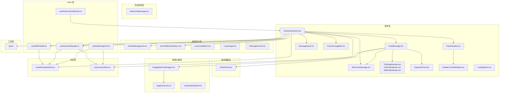
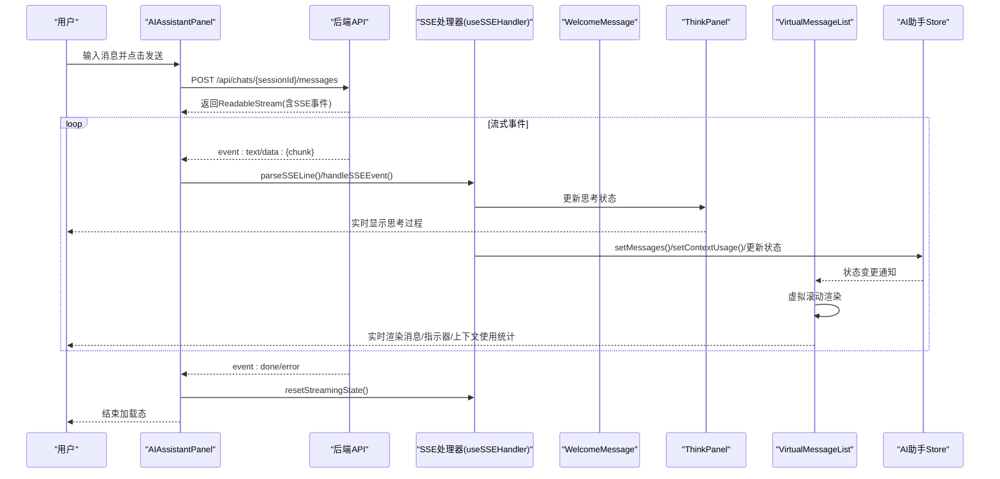
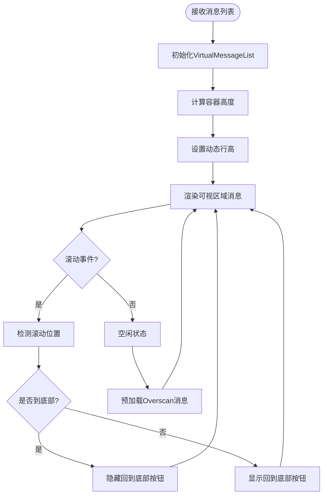
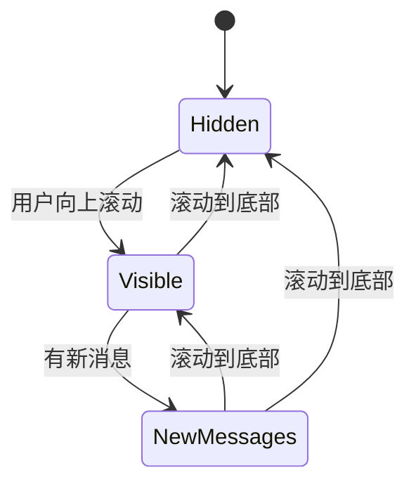
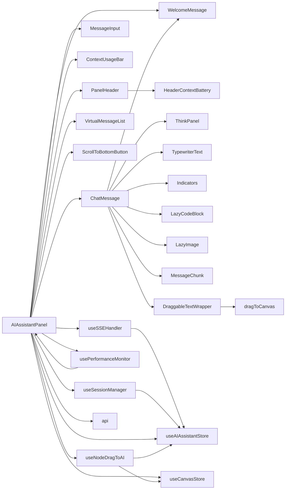

# AI助手组件

<cite>
**本文档引用的文件**
- [AIAssistantPanel.tsx](file://frontend/src/components/canvas/AIAssistantPanel.tsx)
- [ThinkPanel.tsx](file://frontend/src/components/ai-assistant/ThinkPanel.tsx)
- [DraggableTextWrapper.tsx](file://frontend/src/components/ai-assistant/DraggableTextWrapper.tsx)
- [dragToCanvas.ts](file://frontend/src/lib/dragToCanvas.ts)
- [useNodeDragToAI.ts](file://frontend/src/app/theater/[id]/hooks/useNodeDragToAI.ts)
- [ChatMessage.tsx](file://frontend/src/components/ai-assistant/ChatMessage.tsx)
- [WelcomeMessage.tsx](file://frontend/src/components/ai-assistant/WelcomeMessage.tsx)
- [index.ts](file://frontend/src/components/ai-assistant/index.ts)
- [MessageInput.tsx](file://frontend/src/components/ai-assistant/MessageInput.tsx)
- [ThinkingIndicator.tsx](file://frontend/src/components/ai-assistant/ThinkingIndicator.tsx)
- [ToolCallIndicator.tsx](file://frontend/src/components/ai-assistant/ToolCallIndicator.tsx)
- [SkillCallIndicator.tsx](file://frontend/src/components/ai-assistant/SkillCallIndicator.tsx)
- [TypewriterText.tsx](file://frontend/src/components/ai-assistant/TypewriterText.tsx)
- [ContextUsageBar.tsx](file://frontend/src/components/ai-assistant/ContextUsageBar.tsx)
- [PanelHeader.tsx](file://frontend/src/components/ai-assistant/PanelHeader.tsx)
- [HeaderContextBattery.tsx](file://frontend/src/components/ai-assistant/HeaderContextBattery.tsx)
- [VirtualMessageList.tsx](file://frontend/src/components/ai-assistant/VirtualMessageList.tsx)
- [ScrollToBottomButton.tsx](file://frontend/src/components/ai-assistant/ScrollToBottomButton.tsx)
- [LazyCodeBlock.tsx](file://frontend/src/components/ai-assistant/LazyCodeBlock.tsx)
- [LazyImage.tsx](file://frontend/src/components/ai-assistant/LazyImage.tsx)
- [MessageChunk.tsx](file://frontend/src/components/ai-assistant/MessageChunk.tsx)
- [useSSEHandler.ts](file://frontend/src/components/ai-assistant/hooks/useSSEHandler.ts)
- [useSessionManager.ts](file://frontend/src/components/ai-assistant/hooks/useSessionManager.ts)
- [usePerformanceMonitor.ts](file://frontend/src/components/ai-assistant/hooks/usePerformanceMonitor.ts)
- [useAIAssistantStore.ts](file://frontend/src/store/useAIAssistantStore.ts)
- [useCanvasStore.ts](file://frontend/src/store/useCanvasStore.ts)
- [api.ts](file://frontend/src/lib/api.ts)
- [LoadingDots.tsx](file://frontend/src/components/ai-assistant/LoadingDots.tsx)
</cite>

## 更新摘要
**变更内容**
- 新增WelcomeMessage组件：专门用于显示欢迎消息和预设对话快捷入口
- 增强ChatMessage组件：新增对isWelcome状态的处理，支持欢迎消息的特殊渲染逻辑
- 优化消息渲染逻辑：当只有欢迎消息时，欢迎消息会布局在面板底部，提供更丰富的欢迎体验
- 新增预设对话功能：包含4个常用场景的快捷对话按钮
- 增强用户个性化体验：根据用户名显示个性化的欢迎问候
- 新增动画效果：欢迎消息包含摇手emoji的旋转动画

## 目录
1. [简介](#简介)
2. [项目结构](#项目结构)
3. [核心组件](#核心组件)
4. [架构总览](#架构总览)
5. [详细组件分析](#详细组件分析)
6. [性能优化组件](#性能优化组件)
7. [拖拽功能增强](#拖拽功能增强)
8. [依赖关系分析](#依赖关系分析)
9. [性能考量](#性能考量)
10. [故障排查指南](#故障排查指南)
11. [结论](#结论)
12. [附录](#附录)

## 简介
本文件系统性地解析 Infinite Game 中的 AI 助手组件，涵盖：
- AI 聊天界面的实现：消息显示、输入处理与实时响应的交互逻辑
- 消息组件设计：文本消息、工具调用指示器、思考过程显示
- **新增欢迎消息组件**：WelcomeMessage提供个性化的欢迎体验和预设对话快捷入口
- SSE（Server-Sent Events）处理器：流式响应处理、错误处理与连接管理
- 会话管理器：对话历史维护、状态保存与并发控制
- 实时通信机制：WebSocket 连接、消息队列与状态同步
- **增强拖拽功能**：支持从画布节点拖拽到AI面板，以及从AI面板内容拖拽到画布
- **组件重构优化**：ChatMessage组件集成WelcomeMessage，提供更好的欢迎状态处理
- 性能优化组件：虚拟滚动、懒加载、消息分块等优化方案
- **性能监控系统**：全面的性能指标收集与分析
- 使用示例与扩展开发指南：自定义消息类型与交互行为

## 项目结构
AI 助手位于前端工程的组件目录中，采用"按功能域组织"的方式：
- 组件层：AI 助手面板、消息渲染、输入控件、状态指示器、上下文使用统计栏
- **新增欢迎消息层**：WelcomeMessage组件，专门用于显示欢迎消息和预设对话
- **新增思考面板层**：ThinkPanel组件，专门用于显示AI思考过程
- **新增拖拽功能层**：DraggableTextWrapper、dragToCanvas工具函数
- **新增性能层**：虚拟滚动、懒加载、消息分块等性能优化组件
- Hook 层：SSE 处理、会话管理、性能监控、节点拖拽到AI面板
- 状态层：AI 助手 Store、画布 Store
- 工具层：API 封装（Axios + Token 刷新）



**图表来源**
- [AIAssistantPanel.tsx:330-361](file://frontend/src/components/canvas/AIAssistantPanel.tsx#L330-L361)
- [ChatMessage.tsx:17](file://frontend/src/components/ai-assistant/ChatMessage.tsx#L17)
- [WelcomeMessage.tsx:1-79](file://frontend/src/components/ai-assistant/WelcomeMessage.tsx#L1-L79)
- [ThinkPanel.tsx:1-290](file://frontend/src/components/ai-assistant/ThinkPanel.tsx#L1-L290)
- [DraggableTextWrapper.tsx:1-45](file://frontend/src/components/ai-assistant/DraggableTextWrapper.tsx#L1-L45)
- [dragToCanvas.ts:1-126](file://frontend/src/lib/dragToCanvas.ts#L1-L126)
- [useNodeDragToAI.ts:1-123](file://frontend/src/app/theater/[id]/hooks/useNodeDragToAI.ts#L1-L123)

**章节来源**
- [AIAssistantPanel.tsx:1-591](file://frontend/src/components/canvas/AIAssistantPanel.tsx#L1-L591)
- [index.ts:1-37](file://frontend/src/components/ai-assistant/index.ts#L1-L37)

## 核心组件
- AI 助手面板：负责面板生命周期、消息渲染、输入处理、SSE 流式接收与状态同步
- **新增欢迎消息组件**：WelcomeMessage组件，提供个性化的欢迎体验和4个预设对话快捷入口
- **新增思考面板**：ThinkPanel组件，支持单智能体和多智能体思考过程的可视化显示
- 消息组件：根据角色与状态渲染用户消息、AI 文本、思考指示器、工具/技能调用指示器、多智能体协作步骤
- **新增可拖拽文本包装器**：DraggableTextWrapper支持选中文本拖拽到画布创建节点
- **新增拖拽工具函数**：dragToCanvas提供标准化的节点拖拽数据格式
- **新增节点拖拽到AI面板**：useNodeDragToAI支持从画布拖拽节点到AI面板作为附件
- **新增虚拟消息列表**：使用 react-window 实现高性能虚拟滚动，支持动态行高和预加载
- **新增回到底部按钮**：智能显示/隐藏，支持平滑滚动到最新消息
- **新增懒加载组件**：LazyCodeBlock 和 LazyImage 提供按需加载，减少初始包体积
- **新增消息分块组件**：MessageChunk 支持超长消息的分块渲染和进度显示
- 输入组件：支持回车发送、Shift+Enter 换行、禁用态与加载态反馈
- 上下文使用统计栏：实时显示token使用百分比和具体数值，提供视觉化的使用状态反馈
- **新增面板头部组件**：包含HeaderContextBattery组件，提供更丰富的上下文使用统计功能
- SSE 处理 Hook：解析 SSE 事件、维护流式状态、更新 Store、处理多智能体与计费信息
- 会话管理 Hook：加载 Agent 列表、创建/切换会话、加载历史、清空会话、跨剧场切换
- **新增性能监控 Hook**：usePerformanceMonitor 提供全面的性能指标监控
- Store：集中管理消息、会话、Agent、面板尺寸位置、画布关联、上下文使用统计等状态，并持久化
- API 工具：统一请求头注入、401 自动刷新、请求队列与重试

**章节来源**
- [AIAssistantPanel.tsx:330-361](file://frontend/src/components/canvas/AIAssistantPanel.tsx#L330-L361)
- [WelcomeMessage.tsx:20-27](file://frontend/src/components/ai-assistant/WelcomeMessage.tsx#L20-L27)
- [ThinkPanel.tsx:27-38](file://frontend/src/components/ai-assistant/ThinkPanel.tsx#L27-L38)
- [DraggableTextWrapper.tsx:12-16](file://frontend/src/components/ai-assistant/DraggableTextWrapper.tsx#L12-L16)
- [dragToCanvas.ts:37-53](file://frontend/src/lib/dragToCanvas.ts#L37-L53)
- [useNodeDragToAI.ts:17-21](file://frontend/src/app/theater/[id]/hooks/useNodeDragToAI.ts#L17-L21)
- [VirtualMessageList.tsx:43-271](file://frontend/src/components/ai-assistant/VirtualMessageList.tsx#L43-L271)
- [ScrollToBottomButton.tsx:16-59](file://frontend/src/components/ai-assistant/ScrollToBottomButton.tsx#L16-L59)
- [LazyCodeBlock.tsx:50-163](file://frontend/src/components/ai-assistant/LazyCodeBlock.tsx#L50-L163)
- [LazyImage.tsx:15-108](file://frontend/src/components/ai-assistant/LazyImage.tsx#L15-L108)
- [MessageChunk.tsx:18-157](file://frontend/src/components/ai-assistant/MessageChunk.tsx#L18-L157)
- [usePerformanceMonitor.ts:31-206](file://frontend/src/components/ai-assistant/hooks/usePerformanceMonitor.ts#L31-L206)

## 架构总览
AI 助手通过"面板 + 组件 + Hook + Store + API"的分层架构实现端到端的实时对话体验。关键流程：
- 用户在面板输入消息，面板发起 POST 请求至后端会话消息接口
- 后端以 SSE 流返回事件：文本增量、工具/技能调用、多智能体步骤、计费信息、完成与错误
- SSE 处理 Hook 解析事件并更新 Store，面板监听 Store 变化进行渲染
- **新增欢迎消息组件**：WelcomeMessage组件在面板初始化时显示，提供个性化的欢迎体验
- **新增思考面板**：ThinkPanel组件根据思考状态自动展开/折叠，显示思考过程
- **新增虚拟滚动**：VirtualMessageList 使用 react-window 实现高性能渲染
- **新增懒加载**：LazyCodeBlock 和 LazyImage 在视口进入时才加载
- **新增消息分块**：MessageChunk 支持超长消息的分块渲染
- 会话管理 Hook 负责会话生命周期与剧场切换，确保跨剧场状态隔离与恢复
- 上下文使用统计栏实时显示token使用情况，提供用户友好的资源使用可视化
- **新增拖拽功能**：支持从画布节点拖拽到AI面板，以及从AI面板内容拖拽到画布



**图表来源**
- [AIAssistantPanel.tsx:87-179](file://frontend/src/components/canvas/AIAssistantPanel.tsx#L87-L179)
- [WelcomeMessage.tsx:28-79](file://frontend/src/components/ai-assistant/WelcomeMessage.tsx#L28-L79)
- [ThinkPanel.tsx:73-86](file://frontend/src/components/ai-assistant/ThinkPanel.tsx#L73-L86)
- [VirtualMessageList.tsx:255-268](file://frontend/src/components/ai-assistant/VirtualMessageList.tsx#L255-L268)
- [useSSEHandler.ts:63-357](file://frontend/src/components/ai-assistant/hooks/useSSEHandler.ts#L63-L357)

## 详细组件分析

### WelcomeMessage组件

**新增** WelcomeMessage是一个专门用于显示欢迎消息和预设对话快捷入口的组件，提供个性化的欢迎体验。

#### 核心功能特性

- **个性化问候**：根据用户昵称显示个性化的欢迎问候，如果用户不存在则显示"创作者"
- **动画效果**：包含摇手emoji的旋转动画，持续2.5秒，无限循环，提供生动的欢迎体验
- **预设对话快捷入口**：提供4个常用场景的快捷对话按钮，支持一键发送
- **响应式布局**：使用网格布局，支持2列显示，适配不同屏幕尺寸
- **交互反馈**：按钮具有悬停和点击的动画反馈，提升用户体验

#### 预设对话功能

```typescript
// 预设对话列表：icon + label + 发送内容
const PRESET_PROMPTS = [
  { icon: Sparkles, label: '创建科幻爱情剧本', message: '开始创建一个剧本，科幻爱情题材。' },
  { icon: UserRound, label: '设计一个角色人物', message: '开始设计一个角色人物。' },
  { icon: Film, label: '生成一段分镜脚本', message: '帮我生成一段分镜脚本。' },
  { icon: MessageSquareText, label: '润色一段故事文案', message: '帮我润色一段故事文案。' },
];
```

#### 动画实现

```typescript
<motion.span
  className="inline-block origin-[70%_70%]"
  animate={{ rotate: [0, 14, -8, 14, -4, 10, 0] }}
  transition={{
    duration: 2.5,
    ease: 'easeInOut',
    repeat: Infinity,
    repeatDelay: 1,
  }}
>
  👋
</motion.span>
```

#### 快捷按钮交互

```typescript
<motion.button
  key={preset.label}
  whileHover={{ scale: 1.02 }}
  whileTap={{ scale: 0.97 }}
  onClick={() => onSend?.(preset.message)}
  className="flex items-center gap-2 px-3 py-2.5 rounded-xl text-xs text-left
    bg-[var(--color-bg-panel)] hover:bg-[var(--color-bg-elevated)]
    border border-[var(--color-border-light)] hover:border-[var(--color-border)]
    text-[var(--color-text-secondary)] hover:text-[var(--color-text-primary)]
    transition-colors cursor-pointer"
>
  <preset.icon className="h-3.5 w-3.5 shrink-0 opacity-60" />
  <span className="leading-tight">{preset.label}</span>
</motion.button>
```

**章节来源**
- [WelcomeMessage.tsx:8-14](file://frontend/src/components/ai-assistant/WelcomeMessage.tsx#L8-L14)
- [WelcomeMessage.tsx:28-79](file://frontend/src/components/ai-assistant/WelcomeMessage.tsx#L28-L79)
- [WelcomeMessage.tsx:37-45](file://frontend/src/components/ai-assistant/WelcomeMessage.tsx#L37-L45)
- [WelcomeMessage.tsx:59-74](file://frontend/src/components/ai-assistant/WelcomeMessage.tsx#L59-L74)

### ChatMessage组件增强

**更新** ChatMessage组件已进行重大功能增强，新增了对isWelcome状态的处理，支持欢迎消息的特殊渲染逻辑。

#### 核心功能增强

- **欢迎状态检测**：新增对message.isWelcome属性的检测，支持欢迎消息的特殊渲染
- **条件渲染逻辑**：当message.isWelcome为true时，渲染WelcomeMessage组件而非标准AI消息
- **布局优化**：当只有欢迎消息时，欢迎消息会布局在面板底部，提供更好的视觉体验
- **消息过滤**：在非欢迎状态下，ChatMessage会过滤掉isWelcome消息进行正常渲染
- **状态管理**：与Store中的DEFAULT_MESSAGES保持一致，确保欢迎消息的正确初始化

#### 欢迎状态渲染逻辑

```typescript
// 欢迎消息：显示特殊的欢迎组件
{message.isWelcome && <WelcomeMessage />}
```

#### 消息过滤机制

```typescript
// 在面板中过滤欢迎消息进行正常渲染
<VirtualMessageList
  ref={virtualListRef}
  messages={messages.filter(m => !m.isWelcome)}
  // ...
/>
```

#### 默认消息配置

```typescript
// Store中的默认消息配置，包含isWelcome标记
const DEFAULT_MESSAGES: Message[] = [
  { role: 'ai', content: '', status: 'complete', isWelcome: true }
];
```

**章节来源**
- [ChatMessage.tsx:332-334](file://frontend/src/components/ai-assistant/ChatMessage.tsx#L332-L334)
- [AIAssistantPanel.tsx:457-461](file://frontend/src/components/canvas/AIAssistantPanel.tsx#L457-L461)
- [AIAssistantPanel.tsx:464-466](file://frontend/src/components/canvas/AIAssistantPanel.tsx#L464-L466)
- [useAIAssistantStore.ts:200-202](file://frontend/src/store/useAIAssistantStore.ts#L200-L202)

### ThinkPanel组件

**新增** ThinkPanel是一个专门用于显示AI思考过程的可视化面板，支持单智能体和多智能体两种模式。

#### 核心功能特性

- **双模式支持**：单智能体模式显示思考状态和计时器，多智能体模式显示步骤列表和进度
- **自动展开/折叠**：检测到思考状态时自动展开，思考结束后延迟折叠
- **实时进度显示**：显示当前执行步骤和整体完成进度
- **状态可视化**：使用不同图标和颜色表示pending、running、completed、failed状态
- **详细步骤查看**：支持展开查看每个步骤的详细结果或错误信息
- **计时功能**：显示思考过程的持续时间
- **智能状态跟踪**：区分用户手动展开和自动展开状态

#### 思考过程状态管理

```typescript
// 状态图标映射
const STATUS_ICON_MAP: Record<string, { Icon: typeof Circle; className: string }> = {
  pending: { Icon: Circle, className: 'text-muted-foreground' },
  running: { Icon: Loader2, className: 'text-blue-500 animate-spin' },
  completed: { Icon: CheckCircle2, className: 'text-green-500' },
  failed: { Icon: XCircle, className: 'text-red-500' },
};
```

#### 自动展开/折叠逻辑

```typescript
// 自动展开条件：开始思考时且未展开
isThinking && !isExpanded && (setIsExpanded(true), setUserExpandedManually(false));

// 自动折叠条件：思考结束且用户未手动展开
const shouldAutoCollapse = !isThinking && isExpanded && !userExpandedManually && (isMultiAgent ? progress.isAllDone : true);

// 延迟折叠：1.5秒后自动折叠
const timer = shouldAutoCollapse
  ? setTimeout(() => setIsExpanded(false), 1500)
  : null;
```

#### 多智能体进度计算

```typescript
const progress = useMemo(() => {
  const completedCount = steps.filter(s => s.status === 'completed').length;
  const failedCount = steps.filter(s => s.status === 'failed').length;
  const runningCount = steps.filter(s => s.status === 'running').length;
  const total = steps.length;
  
  return {
    completed: completedCount,
    failed: failedCount,
    running: runningCount,
    total,
    percentage: total > 0 ? Math.round((completedCount / total) * 100) : 0,
    isAllDone: completedCount + failedCount === total && total > 0,
  };
}, [steps]);
```

**章节来源**
- [ThinkPanel.tsx:19-25](file://frontend/src/components/ai-assistant/ThinkPanel.tsx#L19-L25)
- [ThinkPanel.tsx:40-86](file://frontend/src/components/ai-assistant/ThinkPanel.tsx#L40-L86)
- [ThinkPanel.tsx:50-65](file://frontend/src/components/ai-assistant/ThinkPanel.tsx#L50-L65)
- [ThinkPanel.tsx:106-112](file://frontend/src/components/ai-assistant/ThinkPanel.tsx#L106-L112)

### 可拖拽文本包装器

**新增** DraggableTextWrapper组件支持用户选中文本后直接拖拽到画布创建节点。

#### 核心功能

- **选中文本检测**：拦截拖拽开始事件，检测是否有选中文本
- **自定义拖拽数据**：使用dragToCanvas工具函数设置拖拽数据
- **拖拽预览**：创建自定义的拖拽预览元素
- **拖拽清理**：拖拽结束后清理预览元素和选中状态

#### 拖拽数据格式

```typescript
// 文本拖拽开始处理器
export function handleTextDragStart(
  event: React.DragEvent,
  text: string,
  title?: string
): HTMLElement | null {
  // 截取文本作为标题（最多 50 字符）
  const displayTitle = title || (text.length > 50 ? text.slice(0, 50) + '...' : text);
  
  setDragData(event, 'text', {
    title: displayTitle,
    content: {
      type: 'doc',
      content: [{ type: 'paragraph', content: [{ type: 'text', text }] }],
    },
  });

  const preview = createDragPreview(displayTitle, '📝');
  event.dataTransfer.setDragImage(preview, 0, 0);

  return preview;
}
```

#### 拖拽预览创建

```typescript
export function createDragPreview(label: string, icon?: string): HTMLElement {
  const preview = document.createElement('div');
  preview.className = 'px-4 py-2 bg-background/90 backdrop-blur border border-primary/50 text-foreground rounded-md shadow-lg flex items-center gap-2';
  preview.style.position = 'absolute';
  preview.style.top = '-1000px';
  preview.style.opacity = '0.85';
  preview.style.pointerEvents = 'none';
  preview.innerHTML = `
    <div class="w-4 h-4 rounded-sm bg-primary/20 flex items-center justify-center text-primary">
      ${icon || '📄'}
    </div>
    <span class="text-sm font-medium max-w-[200px] truncate">${label}</span>
  `;
  document.body.appendChild(preview);
  return preview;
}
```

**章节来源**
- [DraggableTextWrapper.tsx:12-16](file://frontend/src/components/ai-assistant/DraggableTextWrapper.tsx#L12-L16)
- [DraggableTextWrapper.tsx:19-33](file://frontend/src/components/ai-assistant/DraggableTextWrapper.tsx#L19-L33)
- [dragToCanvas.ts:55-80](file://frontend/src/lib/dragToCanvas.ts#L55-L80)
- [dragToCanvas.ts:103-125](file://frontend/src/lib/dragToCanvas.ts#L103-L125)

### 节点拖拽到AI面板

**新增** useNodeDragToAI Hook支持从画布节点拖拽到AI面板作为附件。

#### 核心功能

- **多选支持**：支持按住Ctrl或Shift多选节点拖拽
- **拖拽检测**：检测鼠标拖拽是否在AI面板区域内
- **附件提取**：从拖拽的节点提取附件数据（最多5个图像节点）
- **面板状态管理**：自动打开AI面板并更新附件状态
- **位置恢复**：拖拽结束后恢复节点的原始位置

#### 拖拽检测算法

```typescript
// 检测坐标是否在指定 rect 内
function isPointInRect(x: number, y: number, rect: DOMRect): boolean {
  return x >= rect.left && x <= rect.right && y >= rect.top && y <= rect.bottom;
}

// 拖拽悬停检测
const onNodeDrag = useCallback((event: React.MouseEvent, _node: Node) => {
  const rect = panelRectRef.current;
  // 面板不存在（未打开）时，尝试检测关闭态按钮区域
  const panelEl = document.querySelector(AI_PANEL_SELECTOR);
  const currentRect = panelEl?.getBoundingClientRect() ?? rect;
  currentRect && (panelRectRef.current = currentRect);

  const isOver = !!currentRect && isPointInRect(event.clientX, event.clientY, currentRect);
  
  // 状态变化时才更新 store，减少渲染
  const prev = isOverPanelRef.current;
  isOverPanelRef.current = isOver;
  (isOver !== prev) && useAIAssistantStore.getState().setIsDragOverPanel(isOver);
}, []);
```

#### 附件提取逻辑

```typescript
// 提取所有拖拽节点的附件数据（只取图像节点，最多5个）
const imageNodes = draggedNodes
  .filter(n => n.type === 'image')
  .slice(0, MAX_ATTACHMENTS);

// 如果没有图像节点但有其他节点，取第一个
const nodesToAttach = imageNodes.length > 0 
  ? imageNodes 
  : draggedNodes.slice(0, 1);

// 提取附件并添加到 store
nodesToAttach.forEach((n, index) => {
  const attachment = extractNodeAttachment(n as CanvasNode);
  index === 0 && store.nodeAttachments.length === 0
    ? store.setNodeAttachments([attachment])
    : store.addNodeAttachment(attachment);
});
```

**章节来源**
- [useNodeDragToAI.ts:10-15](file://frontend/src/app/theater/[id]/hooks/useNodeDragToAI.ts#L10-L15)
- [useNodeDragToAI.ts:54-67](file://frontend/src/app/theater/[id]/hooks/useNodeDragToAI.ts#L54-L67)
- [useNodeDragToAI.ts:89-113](file://frontend/src/app/theater/[id]/hooks/useNodeDragToAI.ts#L89-L113)

### 工具调用指示器（ToolCallIndicator）增强功能

**更新** ToolCallIndicator组件已进行重大功能增强，新增了错误检测、状态指示器、结果展示和持续时间显示等功能。

#### 核心功能特性

- **错误检测机制**：支持JSON格式错误（{"error": "..."}）和纯文本错误前缀（"Error: ..."）的双重检测
- **状态指示器**：执行中（蓝色）、成功（绿色）、失败（红色）三种状态的可视化指示
- **结果展示**：支持展开查看详细的工具执行结果，包括错误详情和成功结果
- **参数展示**：可展开查看工具调用时传入的参数详情
- **持续时间显示**：显示每个工具的执行耗时（毫秒）
- **统计汇总**：显示当前轮次中执行中、成功、失败的工具数量统计

#### 错误检测算法

```typescript
function parseToolError(result: string | undefined): string | null {
  const trimmed = (result || '').trim();
  // 检测 JSON 格式错误
  try {
    const parsed = JSON.parse(trimmed);
    return typeof parsed?.error === 'string' ? parsed.error : null;
  } catch {
    // 检测纯文本错误前缀
    return trimmed.startsWith('Error:') ? trimmed.slice(6).trim() : null;
  }
}
```

#### 状态样式配置

- **执行中状态**：蓝色背景（bg-blue-50/dark:bg-blue-950/30），蓝色图标和文字
- **成功状态**：绿色背景（bg-green-50/dark:bg-green-950/30），绿色图标和文字
- **失败状态**：红色背景（bg-red-50/dark:bg-red-950/30），红色图标和文字

#### 交互功能

- **展开/折叠**：点击工具条目可展开/折叠详细信息
- **参数查看**：展开后可查看工具调用时的参数详情
- **结果查看**：展开后可查看详细的执行结果或错误信息
- **统计显示**：多个工具时显示整体执行统计

**章节来源**
- [ToolCallIndicator.tsx:1-164](file://frontend/src/components/ai-assistant/ToolCallIndicator.tsx#L1-L164)
- [ChatMessage.tsx:251-254](file://frontend/src/components/ai-assistant/ChatMessage.tsx#L251-L254)

### 虚拟消息列表
- **高性能虚拟滚动**：使用 react-window 实现，只渲染可视区域内的消息项
- **动态行高支持**：useDynamicRowHeight 自适应消息高度，支持代码块、图片等复杂内容
- **智能预加载**：overscan 参数控制预渲染的消息数量，提升滚动流畅度
- **滚动行为控制**：支持 instant 和 smooth 两种滚动模式
- **底部检测**：自动检测是否滚动到底部，控制回到底部按钮的显示
- **性能优化**：使用 will-change 和 transform3d 提升渲染性能



**图表来源**
- [VirtualMessageList.tsx:63-84](file://frontend/src/components/ai-assistant/VirtualMessageList.tsx#L63-L84)
- [VirtualMessageList.tsx:255-268](file://frontend/src/components/ai-assistant/VirtualMessageList.tsx#L255-L268)

**章节来源**
- [VirtualMessageList.tsx:43-271](file://frontend/src/components/ai-assistant/VirtualMessageList.tsx#L43-L271)

### 回到底部按钮
- **智能显示逻辑**：只有当用户向上滚动时才显示按钮
- **新消息指示**：当有新消息且未在底部时，按钮变为红色并显示脉冲动画
- **平滑滚动**：点击按钮时平滑滚动到最新消息
- **动画效果**：使用 Framer Motion 实现淡入淡出动画
- **响应式设计**：居中定位，适配不同屏幕尺寸



**图表来源**
- [ScrollToBottomButton.tsx:23-57](file://frontend/src/components/ai-assistant/ScrollToBottomButton.tsx#L23-L57)

**章节来源**
- [ScrollToBottomButton.tsx:16-59](file://frontend/src/components/ai-assistant/ScrollToBottomButton.tsx#L16-L59)

### 懒加载组件

#### LazyCodeBlock
- **按需加载语法高亮器**：使用 React.lazy 动态导入 react-syntax-highlighter
- **语言支持延迟加载**：仅在需要时加载对应语言模块
- **视口检测**：IntersectionObserver 在代码块进入视口时才加载
- **分块展开**：支持大代码块的分块显示和展开功能
- **占位符渲染**：加载前显示简化的占位符，提升用户体验

#### LazyImage
- **视口预加载**：提前50px开始加载图片，提升感知性能
- **错误处理**：网络错误时显示友好的错误提示
- **空src过滤**：自动过滤无效的图片链接
- **渐进显示**：加载完成后淡入显示，避免闪烁
- **占位符动画**：使用 animate-pulse 提供加载指示

**章节来源**
- [LazyCodeBlock.tsx:50-163](file://frontend/src/components/ai-assistant/LazyCodeBlock.tsx#L50-L163)
- [LazyImage.tsx:15-108](file://frontend/src/components/ai-assistant/LazyImage.tsx#L15-L108)

### 消息分块组件
- **智能分块策略**：按段落边界、换行符、句号等自然边界分割
- **分块进度显示**：显示已加载分块数量和总分块数
- **展开控制**：支持展开更多、展开全部、收起三种操作
- **性能优化**：默认每块2000字符，避免一次性渲染大量内容
- **阈值配置**：默认10000字符触发分块，可根据需要调整

**章节来源**
- [MessageChunk.tsx:18-157](file://frontend/src/components/ai-assistant/MessageChunk.tsx#L18-L157)

### 性能监控系统
- **Long Task 监控**：检测超过阈值的长任务，提供性能告警
- **LCP 指标**：记录最大内容绘制时间
- **FID 指标**：测量首次输入延迟
- **CLS 指标**：追踪累积布局偏移
- **FPS 监控**：实时计算帧率，支持历史数据存储
- **自定义阈值**：可配置 Long Task 阈值和监控选项

**章节来源**
- [usePerformanceMonitor.ts:31-206](file://frontend/src/components/ai-assistant/hooks/usePerformanceMonitor.ts#L31-L206)

## 性能优化组件

### 虚拟滚动实现
- **react-window 集成**：使用 List 组件实现高性能虚拟滚动
- **动态行高**：useDynamicRowHeight 自适应消息高度变化
- **预渲染优化**：overscan 参数控制预渲染数量，默认5个
- **滚动行为**：支持 instant 和 smooth 两种滚动模式
- **内存管理**：只渲染可视区域内的消息项，大幅减少DOM节点

### 懒加载策略
- **代码块懒加载**：仅在视口进入时加载语法高亮器和语言模块
- **图片懒加载**：IntersectionObserver 提前检测图片可见性
- **按需导入**：使用 React.lazy 实现模块的动态导入
- **占位符优化**：加载前显示简化的占位符，提升用户体验

### 消息分块渲染
- **超长消息处理**：默认10000字符触发分块渲染
- **智能边界分割**：优先在段落边界分割，避免破坏语义
- **进度反馈**：显示分块加载进度，让用户了解渲染状态
- **交互控制**：支持展开更多、展开全部、收起操作

**章节来源**
- [VirtualMessageList.tsx:23-26](file://frontend/src/components/ai-assistant/VirtualMessageList.tsx#L23-L26)
- [LazyCodeBlock.tsx:67-92](file://frontend/src/components/ai-assistant/LazyCodeBlock.tsx#L67-L92)
- [LazyImage.tsx:29-54](file://frontend/src/components/ai-assistant/LazyImage.tsx#L29-L54)
- [MessageChunk.tsx:27-60](file://frontend/src/components/ai-assistant/MessageChunk.tsx#L27-L60)

## 拖拽功能增强

### 节点拖拽到AI面板

**新增** 完整的节点拖拽到AI面板功能，支持多选节点拖拽。

#### 核心功能

- **多选支持**：支持按住Ctrl或Shift多选节点拖拽
- **拖拽检测**：实时检测鼠标拖拽是否在AI面板区域内
- **附件提取**：从拖拽的节点提取附件数据（最多5个图像节点）
- **面板状态管理**：自动打开AI面板并更新附件状态
- **位置恢复**：拖拽结束后恢复节点的原始位置

#### 拖拽状态管理

```typescript
// 拖拽开始时保存节点原始位置
const onNodeDragStart = useCallback((event: React.MouseEvent, node: Node, nodes: Node[]) => {
  // 判断是否多选：按住Ctrl或节点已被选中且选中有多个节点
  const isMultiSelect = event.ctrlKey || event.metaKey || 
    (node.selected && nodes.filter(n => n.selected).length > 1);
  
  // 获取所有正在拖拽的节点
  const draggedNodes = isMultiSelect 
    ? nodes.filter(n => n.selected)
    : [node];
  
  // 保存所有拖拽节点的原始位置
  originalPositionsRef.current = new Map(
    draggedNodes.map(n => [n.id, { x: n.position.x, y: n.position.y }])
  );
  draggedNodeIdsRef.current = draggedNodes.map(n => n.id);
  
  // 缓存面板 rect
  const panelEl = document.querySelector(AI_PANEL_SELECTOR);
  panelRectRef.current = panelEl?.getBoundingClientRect() ?? null;
  isOverPanelRef.current = false;
}, []);
```

### AI面板内容拖拽到画布

**新增** 支持从AI面板内容拖拽到画布创建节点。

#### 核心功能

- **选中文本拖拽**：用户选中文本后拖拽到画布创建文本节点
- **标准化数据格式**：使用dragToCanvas工具函数设置拖拽数据
- **拖拽预览**：创建自定义的拖拽预览元素
- **节点类型支持**：支持text、image、video等多种节点类型

#### 拖拽数据标准化

```typescript
// 节点类型配置：定义默认数据和尺寸
const NODE_CONFIGS: Record<string, { 
  dimensions: { width: number; height: number };
  buildData: (params: Record<string, unknown>) => Record<string, unknown>;
}> = {
  video: {
    dimensions: { width: 512, height: 384 },
    buildData: ({ name, videoUrl, description }: Record<string, unknown>) => ({
      name: name || '新视频卡',
      description: description || '',
      videoUrl: videoUrl || '',
    }),
  },
  text: {
    dimensions: { width: 420, height: 320 },
    buildData: ({ title, content }: Record<string, unknown>) => ({
      title: title || '新文本卡',
      content: content || { type: 'doc', content: [{ type: 'paragraph', content: [{ type: 'text', text: String(title || '') }] }] },
      tags: [],
    }),
  },
  image: {
    dimensions: { width: 512, height: 384 },
    buildData: ({ name, imageUrl, description }: Record<string, unknown>) => ({
      name: name || '新图片卡',
      description: description || '',
      imageUrl: imageUrl || '',
    }),
  },
};
```

**章节来源**
- [useNodeDragToAI.ts:32-52](file://frontend/src/app/theater/[id]/hooks/useNodeDragToAI.ts#L32-L52)
- [useNodeDragToAI.ts:54-67](file://frontend/src/app/theater/[id]/hooks/useNodeDragToAI.ts#L54-L67)
- [useNodeDragToAI.ts:69-119](file://frontend/src/app/theater/[id]/hooks/useNodeDragToAI.ts#L69-L119)
- [DraggableTextWrapper.tsx:19-33](file://frontend/src/components/ai-assistant/DraggableTextWrapper.tsx#L19-L33)
- [dragToCanvas.ts:6-35](file://frontend/src/lib/dragToCanvas.ts#L6-L35)

## 依赖关系分析
- 组件依赖：面板依赖消息、输入、上下文使用统计栏、Hook 与 Store；消息组件依赖指示器与打字机文本
- **新增欢迎消息依赖**：ChatMessage 依赖 WelcomeMessage；WelcomeMessage 依赖 AuthContext 和 Lucide Icons
- **新增思考面板依赖**：ChatMessage 依赖 ThinkPanel；ThinkPanel 依赖 LoadingDots
- **新增拖拽功能依赖**：DraggableTextWrapper 依赖 dragToCanvas；AIAssistantPanel 依赖 useNodeDragToAI
- **新增性能依赖**：ChatMessage 依赖 LazyCodeBlock、LazyImage、MessageChunk；AIAssistantPanel 依赖 VirtualMessageList、ScrollToBottomButton
- **新增监控依赖**：usePerformanceMonitor 依赖浏览器性能 API
- Hook 依赖：SSE 处理依赖 Store 与画布 Store；会话管理依赖 API 与画布 Store
- 状态依赖：AI 助手 Store 依赖持久化中间件；画布 Store 管理剧场同步
- 外部依赖：Axios、Framer Motion、React Markdown、Zustand、Lucide Icons、react-window



**图表来源**
- [AIAssistantPanel.tsx:330-361](file://frontend/src/components/canvas/AIAssistantPanel.tsx#L330-L361)
- [ChatMessage.tsx:10-16](file://frontend/src/components/ai-assistant/ChatMessage.tsx#L10-L16)
- [WelcomeMessage.tsx:1-6](file://frontend/src/components/ai-assistant/WelcomeMessage.tsx#L1-L6)
- [ThinkPanel.tsx:1-8](file://frontend/src/components/ai-assistant/ThinkPanel.tsx#L1-L8)
- [DraggableTextWrapper.tsx:5](file://frontend/src/components/ai-assistant/DraggableTextWrapper.tsx#L5)
- [dragToCanvas.ts:1-4](file://frontend/src/lib/dragToCanvas.ts#L1-L4)
- [usePerformanceMonitor.ts:31-206](file://frontend/src/components/ai-assistant/hooks/usePerformanceMonitor.ts#L31-L206)

**章节来源**
- [index.ts:1-37](file://frontend/src/components/ai-assistant/index.ts#L1-L37)

## 性能考量
- **虚拟滚动优化**：VirtualMessageList 仅渲染可视区域消息，支持动态行高
- **懒加载策略**：LazyCodeBlock 和 LazyImage 仅在视口进入时加载，减少初始包体积
- **消息分块渲染**：MessageChunk 支持超长消息的分块渲染，避免一次性渲染大量内容
- **性能监控**：usePerformanceMonitor 提供全面的性能指标监控，包括 FPS、Long Task、LCP 等
- **渲染优化**：ChatMessage 移除了浮动跳跃的三点加载动画，简化了加载状态显示逻辑
- **内存管理**：react-window 自动管理 DOM 节点的创建和销毁，避免内存泄漏
- **网络优化**：IntersectionObserver 提前检测元素可见性，提升感知性能
- **动画优化**：使用 will-change 和 transform3d 提升渲染性能
- **拖拽性能优化**：useNodeDragToAI 使用缓存和防抖技术，减少不必要的状态更新
- **思考面板优化**：ThinkPanel 使用useMemo和useCallback优化状态计算和渲染
- **欢迎消息优化**：WelcomeMessage 使用动画组件，提供流畅的欢迎体验
- **消息过滤优化**：ChatMessage 对isWelcome消息进行高效过滤，提升渲染性能

**章节来源**
- [VirtualMessageList.tsx:260-267](file://frontend/src/components/ai-assistant/VirtualMessageList.tsx#L260-L267)
- [LazyCodeBlock.tsx:67-92](file://frontend/src/components/ai-assistant/LazyCodeBlock.tsx#L67-L92)
- [LazyImage.tsx:29-54](file://frontend/src/components/ai-assistant/LazyImage.tsx#L29-L54)
- [MessageChunk.tsx:27-60](file://frontend/src/components/ai-assistant/MessageChunk.tsx#L27-L60)
- [usePerformanceMonitor.ts:166-190](file://frontend/src/components/ai-assistant/hooks/usePerformanceMonitor.ts#L166-L190)
- [useNodeDragToAI.ts:54-67](file://frontend/src/app/theater/[id]/hooks/useNodeDragToAI.ts#L54-L67)
- [ThinkPanel.tsx:50-65](file://frontend/src/components/ai-assistant/ThinkPanel.tsx#L50-L65)
- [WelcomeMessage.tsx:37-45](file://frontend/src/components/ai-assistant/WelcomeMessage.tsx#L37-L45)

## 故障排查指南
- 401 未授权：API 拦截器会尝试刷新令牌，若失败则跳转登录页
- 402 积分不足：SSE 处理器与面板均会提示并记录友好消息
- 请求被中断：面板捕获 AbortError，不显示错误消息
- SSE 解析异常：parseSSELine 对无效行忽略，保证健壮性
- 画布同步：仅当剧场 ID 匹配时才同步，避免跨剧场干扰
- 上下文使用统计：当context_usage数据缺失时，组件会优雅降级为隐藏状态
- **图片显示问题**：新增的图片过滤机制会自动过滤空src的无效图片
- **虚拟滚动问题**：检查容器高度计算和 ResizeObserver 配置
- **懒加载失效**：确认 IntersectionObserver 支持和视口检测配置
- **性能监控异常**：检查浏览器性能 API 支持和权限设置
- **工具调用错误**：ToolCallIndicator 的错误检测机制会自动识别JSON和文本格式的错误
- **拖拽功能异常**：检查dataTransfer格式和拖拽事件处理
- **思考面板显示问题**：确认思考内容解析和状态传递逻辑
- **节点附件丢失**：检查useNodeDragToAI的状态管理和附件提取逻辑
- **欢迎消息显示问题**：确认Store中的DEFAULT_MESSAGES配置和isWelcome标记
- **预设对话功能异常**：检查onSend回调函数和预设对话数据格式

**章节来源**
- [api.ts:31-81](file://frontend/src/lib/api.ts#L31-L81)
- [AIAssistantPanel.tsx:133-179](file://frontend/src/components/canvas/AIAssistantPanel.tsx#L133-L179)
- [useSSEHandler.ts:318-327](file://frontend/src/components/ai-assistant/hooks/useSSEHandler.ts#L318-L327)
- [VirtualMessageList.tsx:68-84](file://frontend/src/components/ai-assistant/VirtualMessageList.tsx#L68-L84)
- [LazyImage.tsx:66-71](file://frontend/src/components/ai-assistant/LazyImage.tsx#L66-L71)
- [ToolCallIndicator.tsx:24-34](file://frontend/src/components/ai-assistant/ToolCallIndicator.tsx#L24-L34)
- [useNodeDragToAI.ts:69-119](file://frontend/src/app/theater/[id]/hooks/useNodeDragToAI.ts#L69-L119)
- [ThinkPanel.tsx:115](file://frontend/src/components/ai-assistant/ThinkPanel.tsx#L115)
- [WelcomeMessage.tsx:28-79](file://frontend/src/components/ai-assistant/WelcomeMessage.tsx#L28-L79)
- [useAIAssistantStore.ts:200-202](file://frontend/src/store/useAIAssistantStore.ts#L200-L202)

## 结论
AI 助手组件通过清晰的分层与职责划分，实现了流畅的实时对话体验。其优势在于：
- 组件解耦、易于扩展
- SSE 流式处理与 Store 集中式状态管理
- 会话与剧场的强关联与持久化
- 友好的错误处理与用户提示
- 实时的上下文使用统计反馈，提升用户体验
- **新增欢迎消息组件**：WelcomeMessage提供个性化的欢迎体验和预设对话快捷入口
- **新增思考面板**：ThinkPanel提供完整的AI思考过程可视化
- **增强拖拽功能**：支持双向拖拽，提升用户体验
- **性能优化**：虚拟滚动、懒加载、消息分块等多重优化策略
- **全面监控**：usePerformanceMonitor 提供完整的性能指标监控
- **用户体验**：回到底部按钮、智能显示逻辑等细节优化
- **组件简化**：移除了不必要的动画效果和键盘快捷键指示器，提升了组件响应速度
- **工具调用增强**：ToolCallIndicator 提供了完整的工具执行状态跟踪和错误诊断能力
- **状态管理优化**：useNodeDragToAI提供高效的拖拽状态管理
- **消息渲染优化**：ChatMessage对isWelcome状态的处理提升了消息渲染效率

## 附录

### 使用示例
- 基础集成：在画布页面引入 AI 助手面板组件，即可获得完整的聊天能力
- **欢迎消息集成**：在Store中初始化时自动包含WelcomeMessage，提供个性化的欢迎体验
- **思考面板集成**：在ChatMessage中自动集成ThinkPanel，显示AI思考过程
- **拖拽功能集成**：支持从画布节点拖拽到AI面板，以及从AI面板内容拖拽到画布
- **虚拟滚动集成**：在需要高性能渲染的场景使用 VirtualMessageList 替代普通列表
- **懒加载组件**：在渲染代码块和图片时使用 LazyCodeBlock 和 LazyImage
- **消息分块**：对于超长消息使用 MessageChunk 进行分块渲染
- **性能监控**：使用 usePerformanceMonitor 监控应用性能指标
- 自定义消息类型：在 Store 的 Message 类型中扩展字段，配合 ChatMessage 渲染
- 自定义交互行为：通过 PanelHeader 的 Agent 切换回调与 clearSession 回调扩展业务逻辑
- 上下文使用统计：通过contextUsageBar组件获取实时token使用情况
- **工具调用跟踪**：ToolCallIndicator 可以显示工具执行的详细状态和结果
- **节点附件管理**：使用useNodeDragToAI管理从画布拖拽到AI面板的节点附件
- **预设对话功能**：通过WelcomeMessage的预设对话按钮快速启动常用场景

**章节来源**
- [AIAssistantPanel.tsx:268-305](file://frontend/src/components/canvas/AIAssistantPanel.tsx#L268-L305)
- [WelcomeMessage.tsx:20-27](file://frontend/src/components/ai-assistant/WelcomeMessage.tsx#L20-L27)
- [WelcomeMessage.tsx:28-79](file://frontend/src/components/ai-assistant/WelcomeMessage.tsx#L28-L79)
- [ThinkPanel.tsx:39](file://frontend/src/components/ai-assistant/ThinkPanel.tsx#L39)
- [DraggableTextWrapper.tsx:19](file://frontend/src/components/ai-assistant/DraggableTextWrapper.tsx#L19)
- [useNodeDragToAI.ts:89-113](file://frontend/src/app/theater/[id]/hooks/useNodeDragToAI.ts#L89-L113)
- [VirtualMessageList.tsx:43-271](file://frontend/src/components/ai-assistant/VirtualMessageList.tsx#L43-L271)
- [LazyCodeBlock.tsx:50-163](file://frontend/src/components/ai-assistant/LazyCodeBlock.tsx#L50-L163)
- [LazyImage.tsx:15-108](file://frontend/src/components/ai-assistant/LazyImage.tsx#L15-L108)
- [MessageChunk.tsx:18-157](file://frontend/src/components/ai-assistant/MessageChunk.tsx#L18-L157)
- [usePerformanceMonitor.ts:31-206](file://frontend/src/components/ai-assistant/hooks/usePerformanceMonitor.ts#L31-L206)
- [ToolCallIndicator.tsx:36-164](file://frontend/src/components/ai-assistant/ToolCallIndicator.tsx#L36-L164)

### 扩展开发指南
- **新增欢迎消息功能**：参考WelcomeMessage的实现，为其他组件添加个性化的欢迎体验
- **欢迎消息定制**：扩展PRESET_PROMPTS数组以添加新的预设对话场景
- **拖拽功能扩展**：参考dragToCanvas的实现，为其他媒体类型添加拖拽支持
- **节点拖拽优化**：参考useNodeDragToAI的实现，优化拖拽状态管理和性能
- **消息分块优化**：根据实际需求调整 MessageChunk 的分块策略和阈值配置
- **性能监控集成**：在关键组件中集成 usePerformanceMonitor 进行性能监控
- 新增事件类型：在 SSE 处理器中新增事件分支，更新 Store 状态
- 新增指示器：参考 ToolCallIndicator/SkillCallIndicator 设计，提供可展开详情
- 多智能体扩展：在 MultiAgentData 中增加更多统计维度，如耗时、成功率
- 画布联动：利用 canvas_updated 事件同步画布节点状态
- 上下文使用统计扩展：可在SSE处理器中添加更多context_usage相关的事件处理
- **工具调用增强**：扩展 ToolCallData 接口以支持更多工具执行元数据，如重试次数、超时时间等
- **拖拽预览定制**：根据节点类型定制拖拽预览样式和图标
- **思考过程解析**：扩展ChatMessage的思考内容解析逻辑，支持更多格式
- **欢迎消息动画**：扩展WelcomeMessage的动画效果，提供更丰富的视觉体验
- **状态管理扩展**：在Store中添加新的消息类型和状态管理逻辑

**章节来源**
- [WelcomeMessage.tsx:8-14](file://frontend/src/components/ai-assistant/WelcomeMessage.tsx#L8-L14)
- [WelcomeMessage.tsx:20-27](file://frontend/src/components/ai-assistant/WelcomeMessage.tsx#L20-L27)
- [dragToCanvas.ts:37-53](file://frontend/src/lib/dragToCanvas.ts#L37-L53)
- [useNodeDragToAI.ts:17-21](file://frontend/src/app/theater/[id]/hooks/useNodeDragToAI.ts#L17-L21)
- [VirtualMessageList.tsx:43-271](file://frontend/src/components/ai-assistant/VirtualMessageList.tsx#L43-L271)
- [LazyCodeBlock.tsx:50-163](file://frontend/src/components/ai-assistant/LazyCodeBlock.tsx#L50-L163)
- [LazyImage.tsx:15-108](file://frontend/src/components/ai-assistant/LazyImage.tsx#L15-L108)
- [MessageChunk.tsx:18-157](file://frontend/src/components/ai-assistant/MessageChunk.tsx#L18-L157)
- [usePerformanceMonitor.ts:31-206](file://frontend/src/components/ai-assistant/hooks/usePerformanceMonitor.ts#L31-L206)
- [SkillCallIndicator.tsx:18-55](file://frontend/src/components/ai-assistant/SkillCallIndicator.tsx#L18-L55)
- [ToolCallIndicator.tsx:7-13](file://frontend/src/components/ai-assistant/ToolCallIndicator.tsx#L7-L13)
- [PanelHeader.tsx:74-246](file://frontend/src/components/ai-assistant/PanelHeader.tsx#L74-L246)
- [ChatMessage.tsx:45-52](file://frontend/src/components/ai-assistant/ChatMessage.tsx#L45-L52)
- [HeaderContextBattery.tsx:74-246](file://frontend/src/components/ai-assistant/HeaderContextBattery.tsx#L74-L246)
- [DraggableTextWrapper.tsx:19-33](file://frontend/src/components/ai-assistant/DraggableTextWrapper.tsx#L19-L33)
- [useNodeDragToAI.ts:69-119](file://frontend/src/app/theater/[id]/hooks/useNodeDragToAI.ts#L69-L119)
- [useAIAssistantStore.ts:200-202](file://frontend/src/store/useAIAssistantStore.ts#L200-L202)