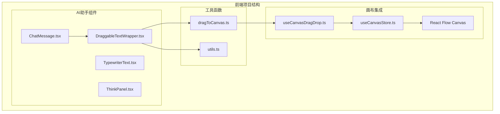
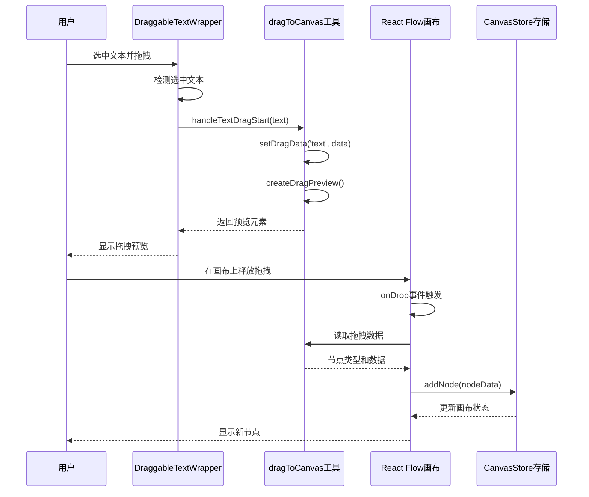
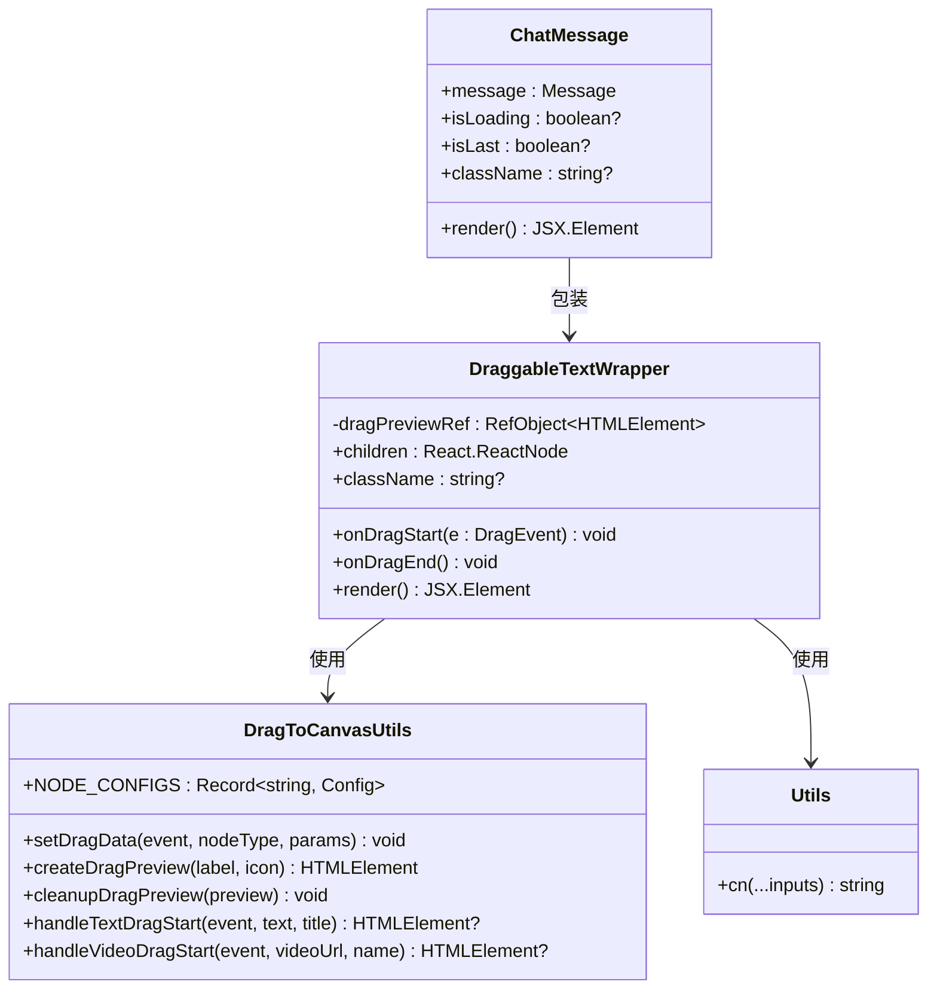
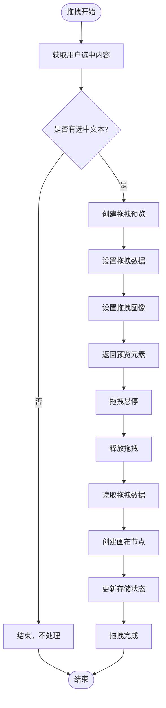
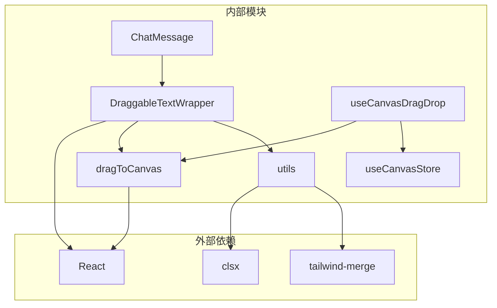

# DraggableTextWrapper 文本拖拽包装器

<cite>
**本文档引用的文件**
- [DraggableTextWrapper.tsx](file://frontend/src/components/ai-assistant/DraggableTextWrapper.tsx)
- [dragToCanvas.ts](file://frontend/src/lib/dragToCanvas.ts)
- [ChatMessage.tsx](file://frontend/src/components/ai-assistant/ChatMessage.tsx)
- [utils.ts](file://frontend/src/lib/utils.ts)
- [useCanvasDragDrop.ts](file://frontend/src/app/theater/[id]/hooks/useCanvasDragDrop.ts)
- [useCanvasStore.ts](file://frontend/src/store/useCanvasStore.ts)
</cite>

## 目录
1. [简介](#简介)
2. [项目结构](#项目结构)
3. [核心组件](#核心组件)
4. [架构概览](#架构概览)
5. [详细组件分析](#详细组件分析)
6. [依赖关系分析](#依赖关系分析)
7. [性能考虑](#性能考虑)
8. [故障排除指南](#故障排除指南)
9. [结论](#结论)

## 简介

DraggableTextWrapper 是一个专门设计用于 AI 助手面板的文本拖拽包装器组件。该组件允许用户在 AI 助手的消息内容中选中文本后，直接将选中的文本拖拽到画布上创建新的文本节点。这个功能为用户提供了直观的拖拽体验，简化了从对话内容到画布节点的创建流程。

该组件是整个拖拽系统的重要组成部分，与底层的拖拽工具函数、画布存储管理以及 React Flow 集成紧密协作，形成了完整的拖拽交互解决方案。

## 项目结构

DraggableTextWrapper 组件位于前端项目的组件层次结构中，具体位置如下：



**图表来源**
- [DraggableTextWrapper.tsx:1-45](file://frontend/src/components/ai-assistant/DraggableTextWrapper.tsx#L1-L45)
- [dragToCanvas.ts:1-126](file://frontend/src/lib/dragToCanvas.ts#L1-L126)
- [ChatMessage.tsx:1-334](file://frontend/src/components/ai-assistant/ChatMessage.tsx#L1-L334)

**章节来源**
- [DraggableTextWrapper.tsx:1-45](file://frontend/src/components/ai-assistant/DraggableTextWrapper.tsx#L1-L45)
- [ChatMessage.tsx:258-328](file://frontend/src/components/ai-assistant/ChatMessage.tsx#L258-L328)

## 核心组件

### DraggableTextWrapper 组件

DraggableTextWrapper 是一个轻量级的 React 组件，主要负责拦截用户的拖拽事件并处理文本拖拽逻辑。

**主要特性：**
- 自动检测用户选中的文本
- 将选中文本转换为可拖拽的数据
- 创建视觉化的拖拽预览效果
- 清理拖拽过程中的临时资源

**接口定义：**
```typescript
interface DraggableTextWrapperProps {
  children: React.ReactNode;
  className?: string;
}
```

**核心实现要点：**
- 使用 `window.getSelection()` 获取用户选中的文本
- 通过 `handleTextDragStart` 函数处理拖拽数据设置
- 实现 `cleanupDragPreview` 进行资源清理
- 支持自定义样式类名

**章节来源**
- [DraggableTextWrapper.tsx:7-44](file://frontend/src/components/ai-assistant/DraggableTextWrapper.tsx#L7-L44)

## 架构概览

整个拖拽系统采用分层架构设计，从底层的拖拽工具函数到顶层的用户界面组件，形成了清晰的职责分离：



**图表来源**
- [DraggableTextWrapper.tsx:20-33](file://frontend/src/components/ai-assistant/DraggableTextWrapper.tsx#L20-L33)
- [dragToCanvas.ts:105-125](file://frontend/src/lib/dragToCanvas.ts#L105-L125)
- [useCanvasDragDrop.ts:15-34](file://frontend/src/app/theater/[id]/hooks/useCanvasDragDrop.ts#L15-L34)

## 详细组件分析

### 组件类图



**图表来源**
- [DraggableTextWrapper.tsx:16-44](file://frontend/src/components/ai-assistant/DraggableTextWrapper.tsx#L16-L44)
- [dragToCanvas.ts:7-125](file://frontend/src/lib/dragToCanvas.ts#L7-L125)
- [ChatMessage.tsx:190-333](file://frontend/src/components/ai-assistant/ChatMessage.tsx#L190-L333)

### 拖拽流程分析



**图表来源**
- [DraggableTextWrapper.tsx:20-33](file://frontend/src/components/ai-assistant/DraggableTextWrapper.tsx#L20-L33)
- [dragToCanvas.ts:105-125](file://frontend/src/lib/dragToCanvas.ts#L105-L125)

### 数据结构分析

拖拽系统的核心数据结构包括：

**节点配置结构：**
```typescript
const NODE_CONFIGS: Record<string, {
  dimensions: { width: number; height: number };
  buildData: (params: Record<string, unknown>) => Record<string, unknown>;
}>
```

**文本节点数据格式：**
```typescript
{
  title: string;
  content: {
    type: 'doc';
    content: [{
      type: 'paragraph';
      content: [{
        type: 'text';
        text: string;
      }];
    }];
  };
  tags: string[];
}
```

**章节来源**
- [dragToCanvas.ts:6-35](file://frontend/src/lib/dragToCanvas.ts#L6-L35)
- [dragToCanvas.ts:19-26](file://frontend/src/lib/dragToCanvas.ts#L19-L26)

## 依赖关系分析

### 组件依赖图



**图表来源**
- [DraggableTextWrapper.tsx:3-5](file://frontend/src/components/ai-assistant/DraggableTextWrapper.tsx#L3-L5)
- [utils.ts:1-6](file://frontend/src/lib/utils.ts#L1-L6)

### 关键依赖关系

1. **React 生态系统依赖**：使用 React Hooks 和事件处理机制
2. **样式系统集成**：通过 `clsx` 和 `tailwind-merge` 实现条件样式组合
3. **拖拽工具链**：完整的拖拽数据处理和预览管理
4. **画布集成层**：与 React Flow 和画布存储的无缝对接

**章节来源**
- [DraggableTextWrapper.tsx:1-10](file://frontend/src/components/ai-assistant/DraggableTextWrapper.tsx#L1-L10)
- [utils.ts:1-6](file://frontend/src/lib/utils.ts#L1-L6)

## 性能考虑

### 性能优化策略

1. **事件处理优化**：
   - 使用 `useCallback` 缓存事件处理器，避免不必要的重新渲染
   - 只在必要时创建和销毁拖拽预览元素

2. **内存管理**：
   - 及时清理拖拽预览 DOM 元素
   - 避免在拖拽过程中创建大量临时对象

3. **渲染优化**：
   - 组件本身无状态，减少不必要的状态更新
   - 利用 React 的事件委托机制

### 最佳实践建议

- 在高频率拖拽场景下，考虑添加防抖机制
- 对于长文本拖拽，可以考虑延迟处理以提升响应性
- 合理设置拖拽预览的尺寸和样式，避免影响页面布局

## 故障排除指南

### 常见问题及解决方案

**问题1：拖拽预览不显示**
- 检查 `handleTextDragStart` 函数是否正确执行
- 验证 `createDragPreview` 是否成功创建 DOM 元素
- 确认 `event.dataTransfer.setDragImage` 调用是否成功

**问题2：无法在画布上放置节点**
- 检查 `useCanvasDragDrop` 的 `onDrop` 事件处理
- 验证 `dataTransfer` 中的数据格式是否正确
- 确认 `useCanvasStore` 的 `addNode` 方法是否被调用

**问题3：选中文本后无反应**
- 确认 `window.getSelection()` 是否能正确获取选中内容
- 检查 `selectedText` 是否为空字符串
- 验证组件的 `onDragStart` 事件绑定是否正常

**章节来源**
- [DraggableTextWrapper.tsx:20-33](file://frontend/src/components/ai-assistant/DraggableTextWrapper.tsx#L20-L33)
- [dragToCanvas.ts:78-80](file://frontend/src/lib/dragToCanvas.ts#L78-L80)

## 结论

DraggableTextWrapper 是一个设计精良的 React 组件，它通过简洁的 API 和完善的拖拽处理机制，为用户提供了流畅的文本拖拽体验。该组件的成功之处在于：

1. **职责单一明确**：专注于文本拖拽功能，不承担其他复杂逻辑
2. **与整体架构良好集成**：与拖拽工具函数、画布存储等模块无缝协作
3. **用户体验优秀**：提供即时的视觉反馈和直观的操作流程
4. **代码质量高**：遵循 React 最佳实践，具有良好的可维护性

该组件为整个 AI 助手面板的拖拽功能奠定了坚实基础，是现代 Web 应用中拖拽交互设计的优秀范例。