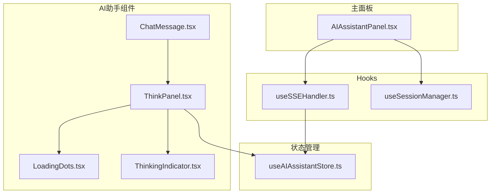
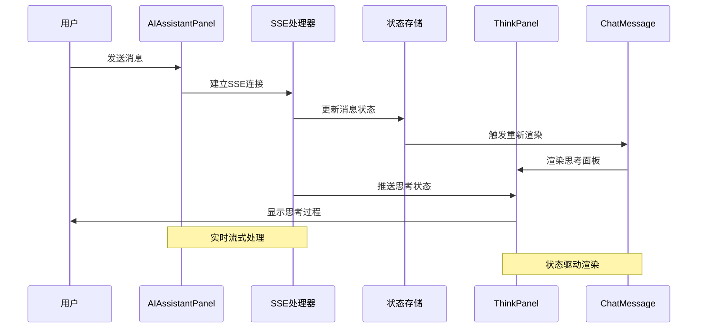
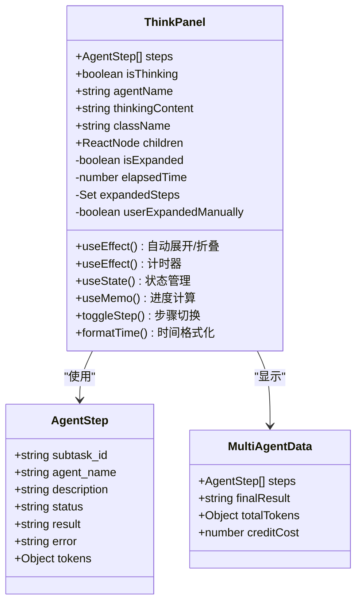
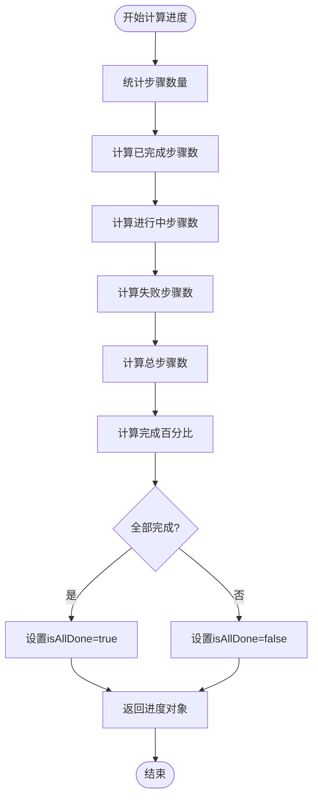
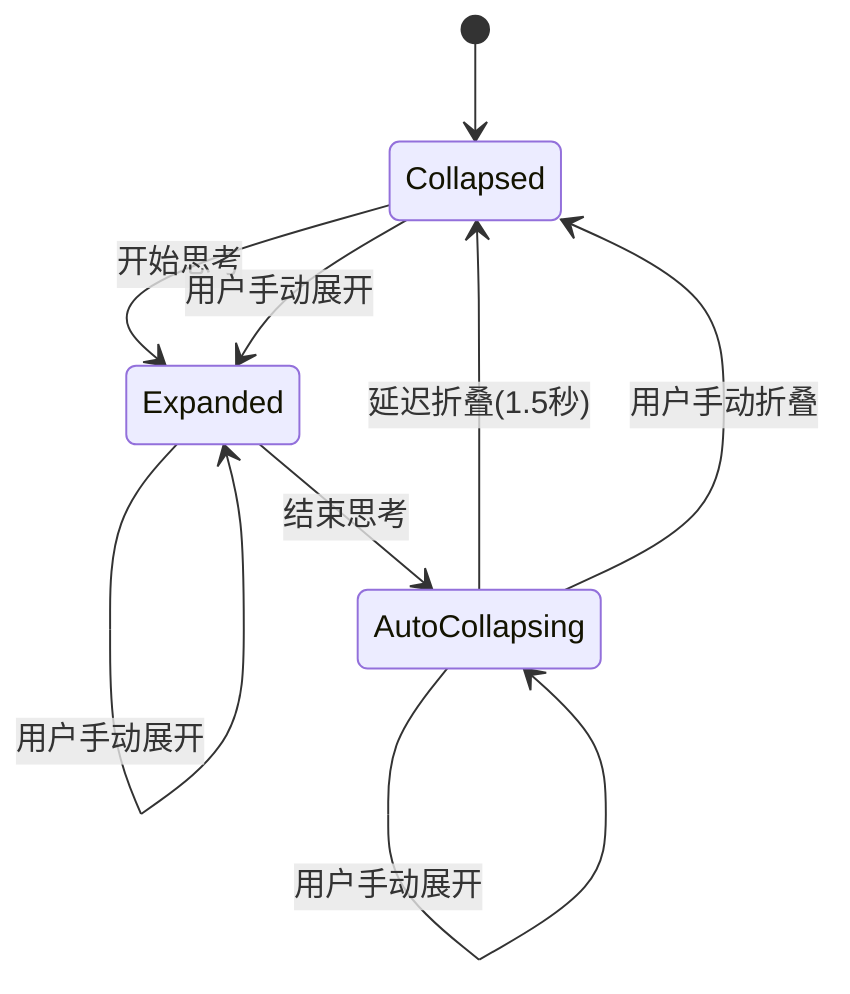
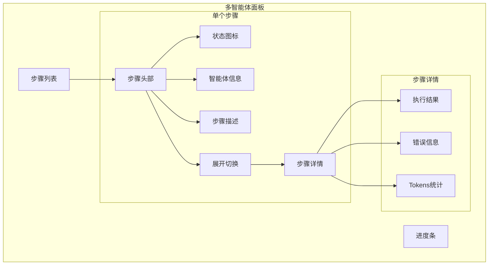
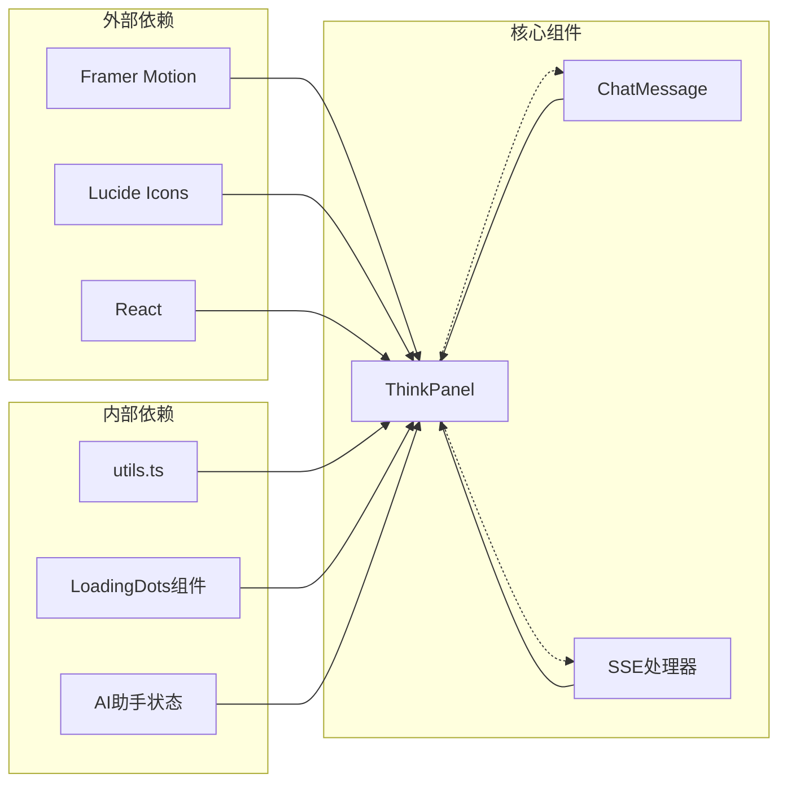

# ThinkPanel 思考过程可视化组件

<cite>
**本文档引用的文件**
- [ThinkPanel.tsx](file://frontend/src/components/ai-assistant/ThinkPanel.tsx)
- [ChatMessage.tsx](file://frontend/src/components/ai-assistant/ChatMessage.tsx)
- [useSSEHandler.ts](file://frontend/src/components/ai-assistant/hooks/useSSEHandler.ts)
- [useSessionManager.ts](file://frontend/src/components/ai-assistant/hooks/useSessionManager.ts)
- [useAIAssistantStore.ts](file://frontend/src/store/useAIAssistantStore.ts)
- [LoadingDots.tsx](file://frontend/src/components/ai-assistant/LoadingDots.tsx)
- [ThinkingIndicator.tsx](file://frontend/src/components/ai-assistant/ThinkingIndicator.tsx)
- [AIAssistantPanel.tsx](file://frontend/src/components/canvas/AIAssistantPanel.tsx)
</cite>

## 目录
1. [简介](#简介)
2. [项目结构](#项目结构)
3. [核心组件](#核心组件)
4. [架构概览](#架构概览)
5. [详细组件分析](#详细组件分析)
6. [依赖关系分析](#依赖关系分析)
7. [性能考虑](#性能考虑)
8. [故障排除指南](#故障排除指南)
9. [结论](#结论)

## 简介

ThinkPanel 是一个专门设计用于可视化 AI 智能体思考过程的 React 组件。它能够实时显示 AI 的推理过程、多智能体协作状态以及思考进度，为用户提供透明的 AI 决策过程可视化体验。

该组件支持两种主要模式：
- **单智能体模式**：显示思考状态和计时器
- **多智能体模式**：显示步骤列表和协作进度

ThinkPanel 通过流畅的动画效果和直观的状态指示器，让用户能够清楚地了解 AI 的工作流程和当前状态。

## 项目结构

ThinkPanel 组件位于前端项目的 AI 助手组件集合中，与相关的状态管理和事件处理机制紧密集成：

**图表来源**
- [ThinkPanel.tsx:1-290](file://frontend/src/components/ai-assistant/ThinkPanel.tsx#L1-L290)
- [ChatMessage.tsx:1-334](file://frontend/src/components/ai-assistant/ChatMessage.tsx#L1-L334)
- [useSSEHandler.ts:1-377](file://frontend/src/components/ai-assistant/hooks/useSSEHandler.ts#L1-L377)

**章节来源**
- [ThinkPanel.tsx:1-290](file://frontend/src/components/ai-assistant/ThinkPanel.tsx#L1-L290)
- [ChatMessage.tsx:1-334](file://frontend/src/components/ai-assistant/ChatMessage.tsx#L1-L334)

## 核心组件

ThinkPanel 组件的核心功能包括：

### 主要特性
- **自动展开/折叠**：检测到思考状态时自动展开，结束后延迟折叠
- **实时进度显示**：显示当前执行步骤和整体进度百分比
- **状态可视化**：使用不同图标和颜色表示不同的执行状态
- **多智能体协作**：支持复杂的多智能体任务协调
- **流式内容支持**：实时显示流式输出的思考过程

### 状态管理
组件内部维护以下关键状态：
- `isExpanded`：面板展开状态
- `elapsedTime`：思考计时器
- `expandedSteps`：展开的步骤集合
- `userExpandedManually`：用户手动展开标记

**章节来源**
- [ThinkPanel.tsx:39-86](file://frontend/src/components/ai-assistant/ThinkPanel.tsx#L39-L86)

## 架构概览

ThinkPanel 在整个 AI 助手系统中扮演着关键的角色，连接了多个核心模块：

**图表来源**
- [AIAssistantPanel.tsx:172-200](file://frontend/src/components/canvas/AIAssistantPanel.tsx#L172-L200)
- [useSSEHandler.ts:25-377](file://frontend/src/components/ai-assistant/hooks/useSSEHandler.ts#L25-L377)
- [ChatMessage.tsx:250-334](file://frontend/src/components/ai-assistant/ChatMessage.tsx#L250-L334)

## 详细组件分析

### ThinkPanel 组件架构

**图表来源**
- [ThinkPanel.tsx:10-38](file://frontend/src/components/ai-assistant/ThinkPanel.tsx#L10-L38)
- [useAIAssistantStore.ts:21-38](file://frontend/src/store/useAIAssistantStore.ts#L21-L38)

### 状态图标映射系统

组件使用状态图标映射表来统一管理不同状态的视觉表现：

| 状态 | 图标 | 颜色类名 | 用途 |
|------|------|----------|------|
| pending | Circle | text-muted-foreground | 待执行状态 |
| running | Loader2 | text-blue-500 animate-spin | 执行中状态 |
| completed | CheckCircle2 | text-green-500 | 完成状态 |
| failed | XCircle | text-red-500 | 失败状态 |

### 进度计算算法

**图表来源**
- [ThinkPanel.tsx:50-65](file://frontend/src/components/ai-assistant/ThinkPanel.tsx#L50-L65)

**章节来源**
- [ThinkPanel.tsx:19-65](file://frontend/src/components/ai-assistant/ThinkPanel.tsx#L19-L65)

### 自动展开/折叠机制

ThinkPanel 实现了智能的自动展开和折叠逻辑：

**图表来源**
- [ThinkPanel.tsx:73-86](file://frontend/src/components/ai-assistant/ThinkPanel.tsx#L73-L86)

### 多智能体协作界面

当存在多个智能体协作时，ThinkPanel 显示详细的步骤列表：

**图表来源**
- [ThinkPanel.tsx:209-282](file://frontend/src/components/ai-assistant/ThinkPanel.tsx#L209-L282)

**章节来源**
- [ThinkPanel.tsx:209-282](file://frontend/src/components/ai-assistant/ThinkPanel.tsx#L209-L282)

## 依赖关系分析

ThinkPanel 组件与多个系统模块存在紧密的依赖关系：

**图表来源**
- [ThinkPanel.tsx:1-8](file://frontend/src/components/ai-assistant/ThinkPanel.tsx#L1-L8)
- [ChatMessage.tsx:1-17](file://frontend/src/components/ai-assistant/ChatMessage.tsx#L1-L17)

### 状态存储集成

ThinkPanel 与全局状态管理系统深度集成：

| 状态属性 | 类型 | 来源 | 用途 |
|----------|------|------|------|
| messages | Message[] | useAIAssistantStore | 存储聊天消息 |
| sessionId | string | useAIAssistantStore | 会话标识符 |
| agentId | string | useAIAssistantStore | 智能体标识符 |
| contextUsage | ContextUsage | useAIAssistantStore | 上下文使用统计 |
| multi_agent | MultiAgentData | Message | 多智能体协作数据 |

**章节来源**
- [useAIAssistantStore.ts:100-196](file://frontend/src/store/useAIAssistantStore.ts#L100-L196)

## 性能考虑

ThinkPanel 在设计时充分考虑了性能优化：

### 渲染优化
- **条件渲染**：只有在需要时才渲染面板
- **记忆化计算**：使用 useMemo 优化进度计算
- **按需展开**：步骤详情仅在需要时渲染

### 动画性能
- **硬件加速**：使用 Framer Motion 的 GPU 加速
- **最小重绘**：精确控制动画触发时机
- **资源管理**：及时清理定时器和观察者

### 内存管理
- **状态清理**：组件卸载时清理所有定时器
- **引用优化**：使用 useRef 避免不必要的重渲染
- **事件处理**：使用 useCallback 优化函数引用

## 故障排除指南

### 常见问题及解决方案

| 问题 | 症状 | 解决方案 |
|------|------|----------|
| 面板不显示 | 思考状态无法触发 | 检查 isThinking 参数和 SSE 连接 |
| 进度不更新 | 百分比固定不变 | 验证 steps 数组和状态变更 |
| 动画异常 | 展开/折叠动画卡顿 | 检查 Framer Motion 配置和浏览器性能 |
| 内存泄漏 | 组件卸载后仍有定时器 | 确认 useEffect 清理函数正确执行 |

### 调试技巧

1. **状态检查**：使用浏览器开发者工具检查组件状态
2. **日志输出**：在关键生命周期钩子添加调试日志
3. **性能分析**：使用 React DevTools 分析渲染性能
4. **网络监控**：检查 SSE 连接状态和事件处理

**章节来源**
- [useSSEHandler.ts:368-377](file://frontend/src/components/ai-assistant/hooks/useSSEHandler.ts#L368-L377)

## 结论

ThinkPanel 组件成功实现了 AI 思考过程的可视化展示，通过精心设计的交互模式和状态管理，为用户提供了清晰、直观的 AI 工作流程体验。其模块化的架构设计使得组件既独立又与整个系统无缝集成。

该组件的主要优势包括：
- **用户体验优秀**：直观的状态指示和流畅的动画效果
- **技术实现先进**：充分利用现代 React 和 Framer Motion 的特性
- **扩展性强**：支持单智能体和多智能体两种模式
- **性能优化到位**：通过多种技术手段确保良好的运行性能

未来可以考虑的功能增强包括：
- 更丰富的状态可视化选项
- 自定义主题支持
- 更详细的性能监控指标
- 无障碍访问功能增强