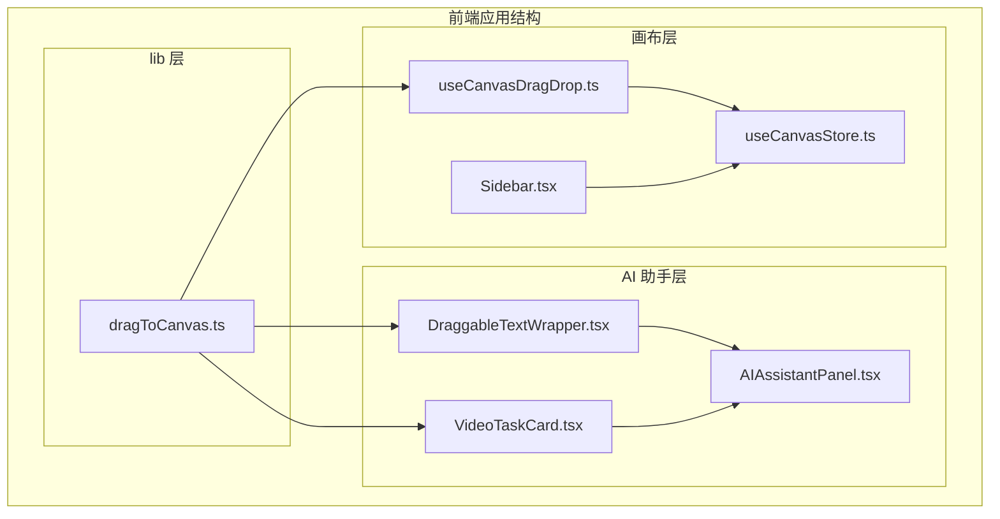
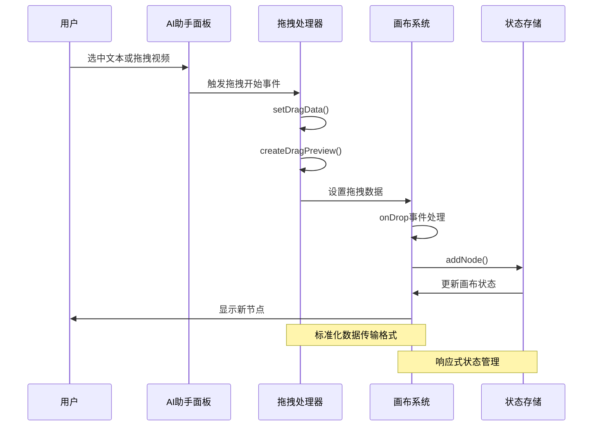
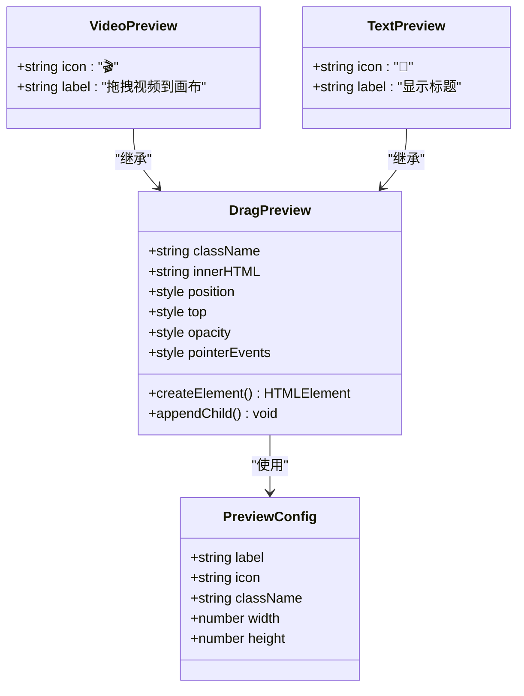
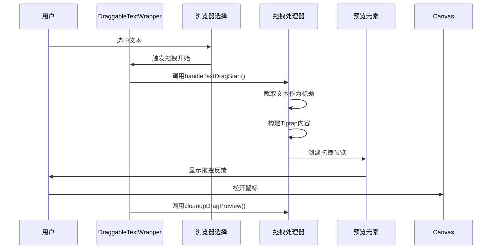
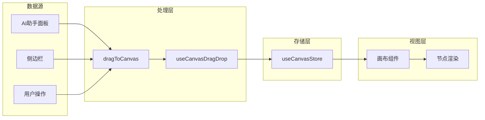

# dragToCanvas 拖拽到画布工具函数

<cite>
**本文档引用的文件**
- [dragToCanvas.ts](file://frontend/src/lib/dragToCanvas.ts)
- [useCanvasDragDrop.ts](file://frontend/src/app/theater/[id]/hooks/useCanvasDragDrop.ts)
- [useCanvasStore.ts](file://frontend/src/store/useCanvasStore.ts)
- [Sidebar.tsx](file://frontend/src/components/Canvas/Sidebar.tsx)
- [DraggableTextWrapper.tsx](file://frontend/src/components/ai-assistant/DraggableTextWrapper.tsx)
- [VideoTaskCard.tsx](file://frontend/src/components/ai-assistant/VideoTaskCard.tsx)
- [AIAssistantPanel.tsx](file://frontend/src/components/canvas/AIAssistantPanel.tsx)
</cite>

## 目录
1. [简介](#简介)
2. [项目结构](#项目结构)
3. [核心组件](#核心组件)
4. [架构概览](#架构概览)
5. [详细组件分析](#详细组件分析)
6. [依赖关系分析](#依赖关系分析)
7. [性能考虑](#性能考虑)
8. [故障排除指南](#故障排除指南)
9. [结论](#结论)

## 简介

dragToCanvas 是一个专门设计用于将内容从 AI 助手面板拖拽到画布的工具函数库。该系统实现了完整的拖拽生态系统，支持多种节点类型的拖拽操作，包括文本、视频和图片节点。通过标准化的数据传输格式和统一的拖拽处理机制，确保了不同来源内容的一致性体验。

该工具函数库的核心价值在于：
- 提供标准化的拖拽数据格式
- 支持多种节点类型的智能配置
- 实现拖拽预览和视觉反馈
- 与现有画布系统的无缝集成

## 项目结构

前端项目采用模块化的组织方式，dragToCanvas 工具函数位于 `frontend/src/lib/` 目录下，与画布相关的组件分布在 `frontend/src/components/canvas/` 和 `frontend/src/components/ai-assistant/` 目录中。



**图表来源**
- [dragToCanvas.ts:1-126](file://frontend/src/lib/dragToCanvas.ts#L1-L126)
- [useCanvasDragDrop.ts:1-74](file://frontend/src/app/theater/[id]/hooks/useCanvasDragDrop.ts#L1-L74)
- [useCanvasStore.ts:1-540](file://frontend/src/store/useCanvasStore.ts#L1-L540)

## 核心组件

### 主要工具函数

dragToCanvas 工具库提供了三个核心函数：

1. **setDragData**: 设置标准化的拖拽数据
2. **createDragPreview**: 创建拖拽预览元素
3. **cleanupDragPreview**: 清理拖拽预览元素

### 节点类型配置

系统支持三种主要节点类型，每种类型都有特定的默认数据结构和尺寸配置：

| 节点类型 | 默认宽度 | 默认高度 | 关键字段 |
|---------|---------|---------|---------|
| video | 512px | 384px | name, videoUrl, description |
| text | 420px | 320px | title, content, tags |
| image | 512px | 384px | name, imageUrl, description |

**章节来源**
- [dragToCanvas.ts:7-35](file://frontend/src/lib/dragToCanvas.ts#L7-L35)

## 架构概览

dragToCanvas 系统采用分层架构设计，确保了良好的模块化和可维护性。



**图表来源**
- [dragToCanvas.ts:40-125](file://frontend/src/lib/dragToCanvas.ts#L40-L125)
- [useCanvasDragDrop.ts:15-70](file://frontend/src/app/theater/[id]/hooks/useCanvasDragDrop.ts#L15-L70)
- [useCanvasStore.ts:256-264](file://frontend/src/store/useCanvasStore.ts#L256-L264)

## 详细组件分析

### setDragData 函数

setDragData 是整个拖拽系统的核心函数，负责将不同类型的内容转换为标准化的画布节点数据。

```mermaid
flowchart TD
Start([函数调用]) --> ValidateParams["验证参数有效性"]
ValidateParams --> CheckNodeType{"检查节点类型"}
CheckNodeType --> |存在配置| GetConfig["获取节点配置"]
CheckNodeType --> |无配置| UseParams["使用原始参数"]
GetConfig --> BuildData["构建节点数据"]
UseParams --> SetDimensions["设置默认尺寸"]
BuildData --> SetDimensions
SetDimensions --> SetTransfer["设置dataTransfer数据"]
SetTransfer --> SetEffect["设置拖拽效果"]
SetEffect --> End([返回])
SetTransfer --> DataFormat{
"application/reactflow": "节点类型<br/>application/reactflow-data": "节点数据(JSON)<br/>application/reactflow-dimensions": "节点尺寸(JSON)"
}
```

**图表来源**
- [dragToCanvas.ts:40-53](file://frontend/src/lib/dragToCanvas.ts#L40-L53)

**章节来源**
- [dragToCanvas.ts:40-53](file://frontend/src/lib/dragToCanvas.ts#L40-L53)

### createDragPreview 函数

拖拽预览功能提供了实时的视觉反馈，帮助用户了解即将创建的节点类型和内容。



**图表来源**
- [dragToCanvas.ts:58-73](file://frontend/src/lib/dragToCanvas.ts#L58-L73)

**章节来源**
- [dragToCanvas.ts:58-73](file://frontend/src/lib/dragToCanvas.ts#L58-L73)

### 节点类型处理器

系统为不同的节点类型提供了专门的处理器函数，确保每种类型都能正确处理其特有的数据结构。

#### 视频节点处理器

handleVideoDragStart 专门处理视频内容的拖拽操作，支持视频URL和自定义名称。

#### 文本节点处理器

handleTextDragStart 处理文本内容的拖拽，自动截取文本作为标题，并将其转换为 Tiptap JSON 格式。

**章节来源**
- [dragToCanvas.ts:85-125](file://frontend/src/lib/dragToCanvas.ts#L85-L125)

### 集成组件分析

#### DraggableTextWrapper 组件

该组件实现了选中文本后直接拖拽到画布的功能，提供了无缝的用户体验。



**图表来源**
- [DraggableTextWrapper.tsx:20-33](file://frontend/src/components/ai-assistant/DraggableTextWrapper.tsx#L20-L33)

**章节来源**
- [DraggableTextWrapper.tsx:16-44](file://frontend/src/components/ai-assistant/DraggableTextWrapper.tsx#L16-L44)

#### VideoTaskCard 组件

该组件展示了视频任务的完整生命周期，从生成到可拖拽的最终状态。

**章节来源**
- [VideoTaskCard.tsx:68-124](file://frontend/src/components/ai-assistant/VideoTaskCard.tsx#L68-L124)

## 依赖关系分析

dragToCanvas 系统与其他组件之间的依赖关系体现了清晰的分层架构。

```mermaid
graph TB
subgraph "外部依赖"
RF[@xyflow/react]
ZS[zustand]
UUID[uuid]
end
subgraph "核心依赖链"
DTC[dragToCanvas.ts] --> RF
DTC --> UUID
DTW[DraggableTextWrapper.tsx] --> DTC
VTC[VideoTaskCard.tsx] --> DTC
UCD[useCanvasDragDrop.ts] --> RF
UCD --> UCS[useCanvasStore.ts]
UCS --> ZS
SB[Sidebar.tsx] --> RF
end
subgraph "内部依赖"
DTW --> AIP[AIAssistantPanel.tsx]
VTC --> AIP
UCD --> SB
end
```

**图表来源**
- [useCanvasDragDrop.ts:1-74](file://frontend/src/app/theater/[id]/hooks/useCanvasDragDrop.ts#L1-L74)
- [useCanvasStore.ts:1-540](file://frontend/src/store/useCanvasStore.ts#L1-L540)

### 数据流分析

系统中的数据流遵循单向数据流原则，确保了状态的一致性和可预测性。



**图表来源**
- [useCanvasDragDrop.ts:15-70](file://frontend/src/app/theater/[id]/hooks/useCanvasDragDrop.ts#L15-L70)
- [useCanvasStore.ts:256-264](file://frontend/src/store/useCanvasStore.ts#L256-L264)

**章节来源**
- [useCanvasDragDrop.ts:15-70](file://frontend/src/app/theater/[id]/hooks/useCanvasDragDrop.ts#L15-L70)
- [useCanvasStore.ts:256-264](file://frontend/src/store/useCanvasStore.ts#L256-L264)

## 性能考虑

### 拖拽预览优化

系统采用了轻量级的拖拽预览实现，通过动态创建和销毁DOM元素来最小化内存占用。

### 数据序列化效率

使用JSON序列化来传输节点数据，虽然简单可靠，但在大量数据传输时可能成为性能瓶颈。

### 状态管理优化

通过Zustand实现高效的状态管理，避免了不必要的组件重渲染。

## 故障排除指南

### 常见问题及解决方案

1. **拖拽数据丢失**
   - 检查 dataTransfer 格式是否正确
   - 确认节点类型配置是否存在

2. **拖拽预览不显示**
   - 验证 DOM 元素创建和插入逻辑
   - 检查 CSS 样式是否被覆盖

3. **节点尺寸异常**
   - 确认默认尺寸配置正确
   - 检查画布坐标转换逻辑

**章节来源**
- [dragToCanvas.ts:78-80](file://frontend/src/lib/dragToCanvas.ts#L78-L80)
- [useCanvasDragDrop.ts:36-56](file://frontend/src/app/theater/[id]/hooks/useCanvasDragDrop.ts#L36-L56)

## 结论

dragToCanvas 工具函数库成功实现了跨组件的拖拽功能标准化，通过以下关键特性确保了系统的稳定性和可扩展性：

- **标准化接口**: 统一的 dataTransfer 格式确保了不同来源内容的一致性
- **灵活配置**: 支持多种节点类型的智能配置和数据构建
- **用户体验**: 完善的拖拽预览和视觉反馈机制
- **系统集成**: 与现有画布系统的无缝集成和状态管理

该工具函数库为后续的功能扩展奠定了坚实的基础，可以轻松支持更多节点类型和交互模式的添加。