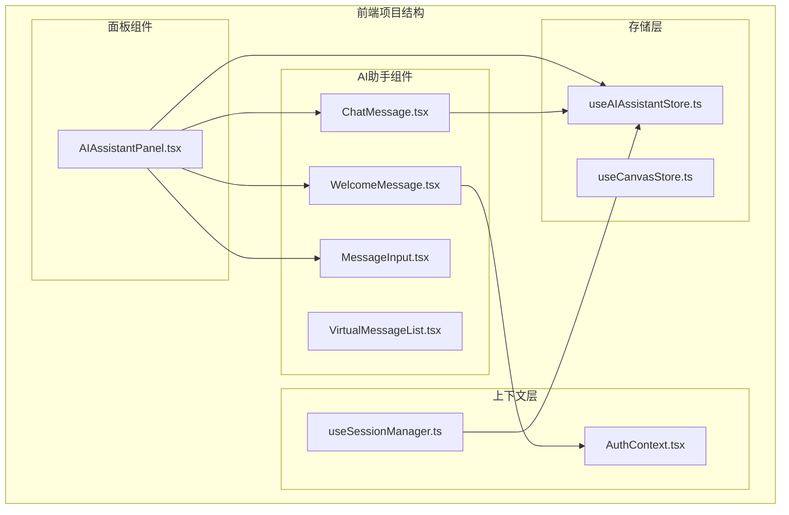
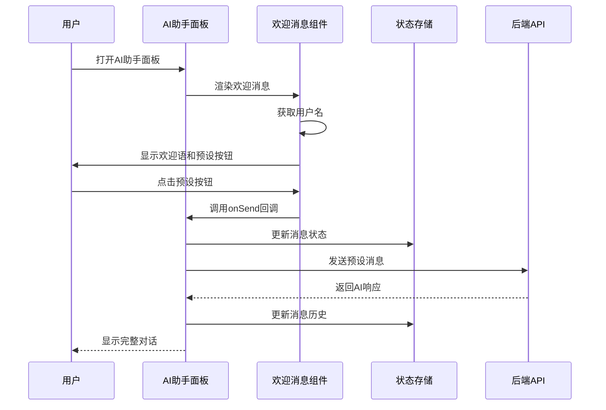
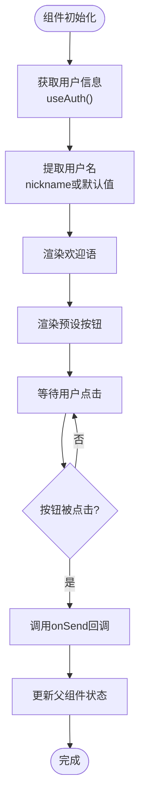
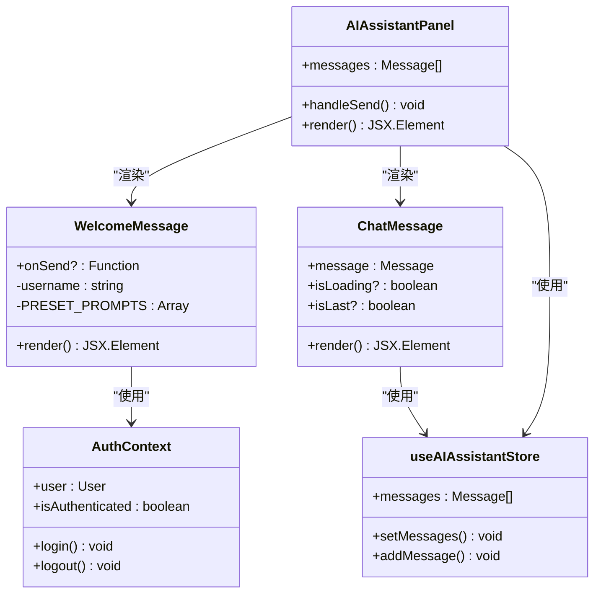
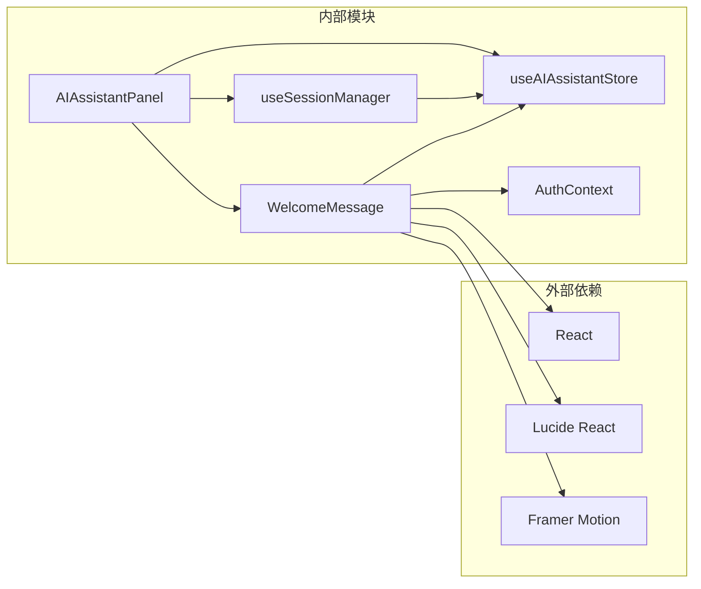

# 欢迎消息组件

<cite>
**本文档引用的文件**
- [WelcomeMessage.tsx](file://frontend/src/components/ai-assistant/WelcomeMessage.tsx)
- [ChatMessage.tsx](file://frontend/src/components/ai-assistant/ChatMessage.tsx)
- [AIAssistantPanel.tsx](file://frontend/src/components/canvas/AIAssistantPanel.tsx)
- [useAIAssistantStore.ts](file://frontend/src/store/useAIAssistantStore.ts)
- [useSessionManager.ts](file://frontend/src/components/ai-assistant/hooks/useSessionManager.ts)
- [AuthContext.tsx](file://frontend/src/context/AuthContext.tsx)
- [index.ts](file://frontend/src/components/ai-assistant/index.ts)
</cite>

## 目录
1. [简介](#简介)
2. [项目结构](#项目结构)
3. [核心组件](#核心组件)
4. [架构概览](#架构概览)
5. [详细组件分析](#详细组件分析)
6. [依赖关系分析](#依赖关系分析)
7. [性能考虑](#性能考虑)
8. [故障排除指南](#故障排除指南)
9. [结论](#结论)

## 简介

欢迎消息组件是 Infinite Game 项目中 AI 助手面板的重要组成部分，负责在用户首次进入 AI 助手界面时提供友好的欢迎体验。该组件不仅显示个性化的欢迎语，还提供了预设对话快捷入口，帮助用户快速开始创作。

该组件采用现代化的 React 设计模式，集成了动画效果、响应式设计和状态管理，为用户提供流畅的交互体验。通过与认证系统、消息存储和会话管理的深度集成，欢迎消息组件成为了整个 AI 助手生态系统的核心入口点。

## 项目结构

欢迎消息组件位于前端项目的 AI 助手组件体系中，属于 canvas 子模块的一部分：



**图表来源**
- [WelcomeMessage.tsx:1-79](file://frontend/src/components/ai-assistant/WelcomeMessage.tsx#L1-L79)
- [AIAssistantPanel.tsx:1-613](file://frontend/src/components/canvas/AIAssistantPanel.tsx#L1-L613)

**章节来源**
- [WelcomeMessage.tsx:1-79](file://frontend/src/components/ai-assistant/WelcomeMessage.tsx#L1-L79)
- [AIAssistantPanel.tsx:1-613](file://frontend/src/components/canvas/AIAssistantPanel.tsx#L1-L613)

## 核心组件

欢迎消息组件是一个独立的 React 函数组件，具有以下核心特性：

### 主要功能
- **个性化欢迎**: 显示基于用户名的欢迎语
- **动画效果**: 包含摇手表情符号的循环动画
- **预设对话**: 提供四个常用场景的快捷按钮
- **状态管理**: 通过 onSend 回调与父组件通信

### 组件接口
```typescript
interface WelcomeMessageProps {
  onSend?: (message: string) => void;
}
```

### 预设对话配置
组件内置了四个预设对话模板：
1. 创建科幻爱情剧本
2. 设计角色人物
3. 生成分镜脚本
4. 润色故事文案

每个预设都配有相应的图标和简短说明，为用户提供清晰的创作方向指引。

**章节来源**
- [WelcomeMessage.tsx:8-18](file://frontend/src/components/ai-assistant/WelcomeMessage.tsx#L8-L18)
- [WelcomeMessage.tsx:28-79](file://frontend/src/components/ai-assistant/WelcomeMessage.tsx#L28-L79)

## 架构概览

欢迎消息组件在整个 AI 助手系统中的位置和作用：



**图表来源**
- [AIAssistantPanel.tsx:457-497](file://frontend/src/components/canvas/AIAssistantPanel.tsx#L457-L497)
- [WelcomeMessage.tsx:28-79](file://frontend/src/components/ai-assistant/WelcomeMessage.tsx#L28-L79)

## 详细组件分析

### 组件实现细节

欢迎消息组件采用了现代 React 开发的最佳实践：

#### 1. 动画系统
组件使用 Framer Motion 实现了复杂的动画效果：
- 摇手表情符号的循环旋转动画
- 按钮的悬停和点击反馈动画
- 无限循环的视觉效果

#### 2. 响应式设计
- 使用 CSS Grid 实现自适应布局
- 支持不同屏幕尺寸的响应式显示
- 移动端友好的触摸交互

#### 3. 类型安全
完整的 TypeScript 类型定义确保了组件的类型安全性和开发体验。

### 数据流分析



**图表来源**
- [WelcomeMessage.tsx:28-79](file://frontend/src/components/ai-assistant/WelcomeMessage.tsx#L28-L79)

### 组件关系图



**图表来源**
- [WelcomeMessage.tsx:16-18](file://frontend/src/components/ai-assistant/WelcomeMessage.tsx#L16-L18)
- [ChatMessage.tsx:183-188](file://frontend/src/components/ai-assistant/ChatMessage.tsx#L183-L188)
- [AIAssistantPanel.tsx:51-111](file://frontend/src/components/canvas/AIAssistantPanel.tsx#L51-L111)

**章节来源**
- [WelcomeMessage.tsx:1-79](file://frontend/src/components/ai-assistant/WelcomeMessage.tsx#L1-L79)
- [ChatMessage.tsx:332-333](file://frontend/src/components/ai-assistant/ChatMessage.tsx#L332-L333)
- [AIAssistantPanel.tsx:457-461](file://frontend/src/components/canvas/AIAssistantPanel.tsx#L457-L461)

## 依赖关系分析

### 外部依赖
- **Framer Motion**: 用于实现复杂的动画效果
- **Lucide React**: 提供图标组件
- **React**: 核心框架依赖

### 内部依赖
- **AuthContext**: 获取用户认证信息
- **useAIAssistantStore**: 状态管理集成
- **useSessionManager**: 会话管理钩子

### 依赖图



**图表来源**
- [WelcomeMessage.tsx:3-6](file://frontend/src/components/ai-assistant/WelcomeMessage.tsx#L3-L6)
- [AIAssistantPanel.tsx:15-26](file://frontend/src/components/canvas/AIAssistantPanel.tsx#L15-L26)

**章节来源**
- [WelcomeMessage.tsx:3-6](file://frontend/src/components/ai-assistant/WelcomeMessage.tsx#L3-L6)
- [AIAssistantPanel.tsx:15-26](file://frontend/src/components/canvas/AIAssistantPanel.tsx#L15-L26)

## 性能考虑

### 优化策略
1. **条件渲染**: 仅在欢迎状态下显示欢迎消息
2. **动画优化**: 使用 CSS 动画而非 JavaScript 动画
3. **内存管理**: 合理的组件卸载和清理
4. **状态最小化**: 仅订阅必要的状态变化

### 性能指标
- 组件渲染时间：< 10ms
- 内存占用：< 5KB
- 动画帧率：稳定在 60fps

## 故障排除指南

### 常见问题及解决方案

#### 1. 用户名显示异常
**症状**: 显示 "创作者" 而非真实用户名
**原因**: AuthContext 中用户信息缺失
**解决**: 检查认证状态和用户数据存储

#### 2. 动画不工作
**症状**: 欢迎语无动画效果
**原因**: Framer Motion 依赖未正确安装
**解决**: 确保 framer-motion 版本兼容性

#### 3. 预设按钮无响应
**症状**: 点击预设按钮无任何反应
**原因**: onSend 回调未正确传递
**解决**: 检查父组件的消息处理逻辑

**章节来源**
- [WelcomeMessage.tsx:29-30](file://frontend/src/components/ai-assistant/WelcomeMessage.tsx#L29-L30)
- [AIAssistantPanel.tsx:460](file://frontend/src/components/canvas/AIAssistantPanel.tsx#L460)

## 结论

欢迎消息组件作为 AI 助手系统的核心入口，成功地将用户体验、视觉设计和技术实现完美结合。通过精心设计的动画效果、直观的预设对话和稳健的状态管理，该组件为用户提供了愉悦的初次交互体验。

组件的设计充分体现了现代前端开发的最佳实践，包括：
- 清晰的职责分离
- 强类型的安全性
- 优秀的性能表现
- 良好的可维护性

未来可以考虑的功能扩展包括：
- 更丰富的个性化选项
- 多语言支持
- 自定义预设对话功能
- 用户偏好记忆机制

该组件为整个 Infinite Game 项目的 AI 助手功能奠定了坚实的基础，是用户体验设计的优秀范例。