# 节点预览组件系统

<cite>
**本文档引用的文件**
- [CharacterNode.tsx](file://frontend/src/components/canvas/CharacterNode.tsx)
- [ScriptNode.tsx](file://frontend/src/components/canvas/ScriptNode.tsx)
- [StoryboardNode.tsx](file://frontend/src/components/canvas/StoryboardNode.tsx)
- [VideoNode.tsx](file://frontend/src/components/canvas/VideoNode.tsx)
- [CustomEdge.tsx](file://frontend/src/components/canvas/CustomEdge.tsx)
- [useCanvasStore.ts](file://frontend/src/store/useCanvasStore.ts)
- [PivotEditor.tsx](file://frontend/src/components/canvas/pivot/PivotEditor.tsx)
- [ScriptEditor.tsx](file://frontend/src/components/canvas/ScriptEditor.tsx)
- [NodePreviewCard.tsx](file://frontend/src/components/ai-assistant/NodePreviewCard.tsx)
- [AIAssistantPanel.tsx](file://frontend/src/components/canvas/AIAssistantPanel.tsx)
- [useAIAssistantStore.ts](file://frontend/src/store/useAIAssistantStore.ts)
- [nodeAttachmentUtils.ts](file://frontend/src/lib/nodeAttachmentUtils.ts)
- [CharacterNode.test.tsx](file://frontend/src/components/canvas/__tests__/CharacterNode.test.tsx)
- [ScriptNode.test.tsx](file://frontend/src/components/canvas/__tests__/ScriptNode.test.tsx)
</cite>

## 更新摘要
**变更内容**
- 新增 NodePreviewList 组件，支持多图横向排列和文本节点纵向排列
- 增强 AI 助手面板的节点附件预览功能
- 新增 ImageThumbnailCard 和 TextPreviewCard 子组件
- 完善节点附件数据结构和处理逻辑

## 目录
1. [简介](#简介)
2. [项目结构](#项目结构)
3. [核心组件](#核心组件)
4. [架构概览](#架构概览)
5. [详细组件分析](#详细组件分析)
6. [新增的节点预览系统](#新增的节点预览系统)
7. [依赖关系分析](#依赖关系分析)
8. [性能考虑](#性能考虑)
9. [故障排除指南](#故障排除指南)
10. [结论](#结论)

## 简介

节点预览组件系统是 Infinite Game 项目中用于可视化编辑和管理各种媒体内容的核心组件集合。该系统基于 React 和 @xyflow/react 构建，提供了丰富的节点类型和交互功能，包括图片节点、文本节点、故事板节点和视频节点等。

**更新** 新增了 NodePreviewList 组件，专门用于在 AI 助手面板中展示从画布拖拽过来的节点附件，支持多图横向排列和文本节点纵向排列的混合布局。

系统的主要特点包括：
- 支持多种媒体类型的节点预览和编辑
- 实时上传和下载功能
- 智能的节点尺寸调整和自适应布局
- 完整的撤销/重做机制
- 响应式设计和无障碍访问支持
- **新增** AI 助手面板的节点附件预览系统

## 项目结构

节点预览组件系统主要位于前端项目的 canvas 目录下，采用模块化设计：

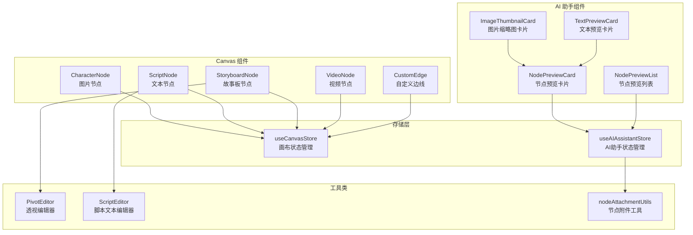

**图表来源**
- [CharacterNode.tsx:1-602](file://frontend/src/components/canvas/CharacterNode.tsx#L1-L602)
- [ScriptNode.tsx:1-261](file://frontend/src/components/canvas/ScriptNode.tsx#L1-L261)
- [useCanvasStore.ts:1-540](file://frontend/src/store/useCanvasStore.ts#L1-L540)
- [NodePreviewCard.tsx:1-213](file://frontend/src/components/ai-assistant/NodePreviewCard.tsx#L1-L213)
- [AIAssistantPanel.tsx:492-499](file://frontend/src/components/canvas/AIAssistantPanel.tsx#L492-L499)

**章节来源**
- [CharacterNode.tsx:1-602](file://frontend/src/components/canvas/CharacterNode.tsx#L1-L602)
- [ScriptNode.tsx:1-261](file://frontend/src/components/canvas/ScriptNode.tsx#L1-L261)
- [useCanvasStore.ts:1-540](file://frontend/src/store/useCanvasStore.ts#L1-L540)
- [NodePreviewCard.tsx:1-213](file://frontend/src/components/ai-assistant/NodePreviewCard.tsx#L1-L213)

## 核心组件

### 节点类型定义

系统支持四种主要的节点类型，每种都有其特定的数据结构和功能：

| 节点类型 | 数据结构 | 主要功能 |
|---------|----------|----------|
| CharacterNode | CharacterNodeData | 图片上传、预览、编辑 |
| ScriptNode | ScriptNodeData | 文本编辑、格式化、字数统计 |
| StoryboardNode | StoryboardNodeData | 数据透视、多维表格编辑 |
| VideoNode | VideoNodeData | 视频上传、播放控制 |

### 状态管理架构

使用 Zustand 进行状态管理，提供以下核心功能：
- 节点和边的增删改查操作
- 撤销/重做历史记录
- 与后端的实时同步
- 本地存储持久化
- **新增** AI 助手面板的节点附件管理

**章节来源**
- [useCanvasStore.ts:26-60](file://frontend/src/store/useCanvasStore.ts#L26-L60)
- [useCanvasStore.ts:67-114](file://frontend/src/store/useCanvasStore.ts#L67-L114)
- [useAIAssistantStore.ts:77-84](file://frontend/src/store/useAIAssistantStore.ts#L77-L84)

## 架构概览

系统采用分层架构设计，确保各组件间的松耦合和高内聚：

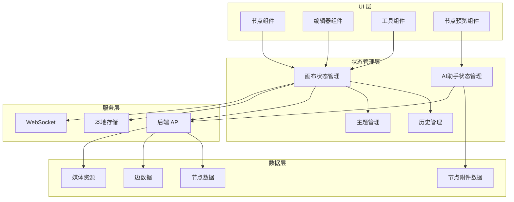

**图表来源**
- [useCanvasStore.ts:185-540](file://frontend/src/store/useCanvasStore.ts#L185-L540)
- [useAIAssistantStore.ts:197-369](file://frontend/src/store/useAIAssistantStore.ts#L197-L369)
- [CharacterNode.tsx:13-601](file://frontend/src/components/canvas/CharacterNode.tsx#L13-L601)

## 详细组件分析

### 图片节点 (CharacterNode)

图片节点是最复杂的节点类型，提供了完整的图片管理和预览功能：

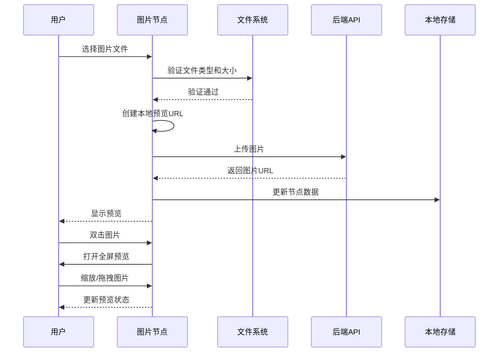

**图表来源**
- [CharacterNode.tsx:127-210](file://frontend/src/components/canvas/CharacterNode.tsx#L127-L210)
- [CharacterNode.tsx:419-424](file://frontend/src/components/canvas/CharacterNode.tsx#L419-L424)

#### 核心功能特性

1. **智能上传处理**：支持 JPEG、PNG、WEBP 格式，限制 5MB 大小
2. **实时预览**：上传过程中显示进度条
3. **全屏预览**：支持缩放、拖拽、键盘快捷键
4. **自动尺寸调整**：根据图片比例自动计算最佳尺寸

**章节来源**
- [CharacterNode.tsx:127-210](file://frontend/src/components/canvas/CharacterNode.tsx#L127-L210)
- [CharacterNode.tsx:248-315](file://frontend/src/components/canvas/CharacterNode.tsx#L248-L315)

### 文本节点 (ScriptNode)

文本节点基于 Tiptap 富文本编辑器构建，提供专业的文本编辑体验：

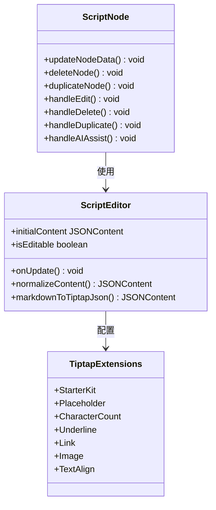

**图表来源**
- [ScriptNode.tsx:11-261](file://frontend/src/components/canvas/ScriptNode.tsx#L11-L261)
- [ScriptEditor.tsx:117-280](file://frontend/src/components/canvas/ScriptEditor.tsx#L117-L280)

#### 编辑器功能

1. **富文本格式化**：支持标题、列表、强调、链接等
2. **实时字数统计**：显示字符数量和字数统计
3. **内容同步**：与外部内容源保持同步
4. **无障碍访问**：支持键盘导航和屏幕阅读器

**章节来源**
- [ScriptEditor.tsx:130-174](file://frontend/src/components/canvas/ScriptEditor.tsx#L130-L174)
- [ScriptNode.tsx:179-188](file://frontend/src/components/canvas/ScriptNode.tsx#L179-L188)

### 故事板节点 (StoryboardNode)

故事板节点提供数据透视和多维表格编辑功能：

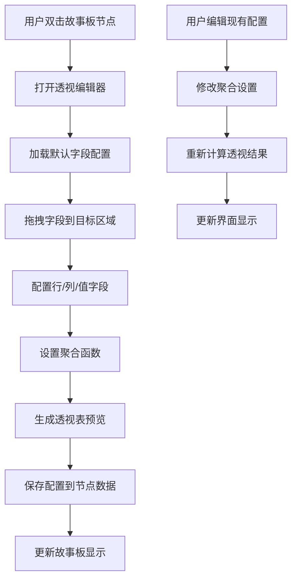

**图表来源**
- [StoryboardNode.tsx:19-50](file://frontend/src/components/canvas/StoryboardNode.tsx#L19-L50)
- [PivotEditor.tsx:33-56](file://frontend/src/components/canvas/pivot/PivotEditor.tsx#L33-L56)

#### 数据透视功能

1. **字段拖拽配置**：支持行、列、值区域的灵活配置
2. **聚合函数设置**：支持求和、计数、平均值等多种聚合
3. **实时预览**：配置变化时即时更新透视表
4. **全局排序**：支持按行或值字段进行排序

**章节来源**
- [PivotEditor.tsx:58-88](file://frontend/src/components/canvas/pivot/PivotEditor.tsx#L58-L88)
- [StoryboardNode.tsx:96-127](file://frontend/src/components/canvas/StoryboardNode.tsx#L96-L127)

### 视频节点 (VideoNode)

视频节点提供完整的视频管理和播放控制功能：

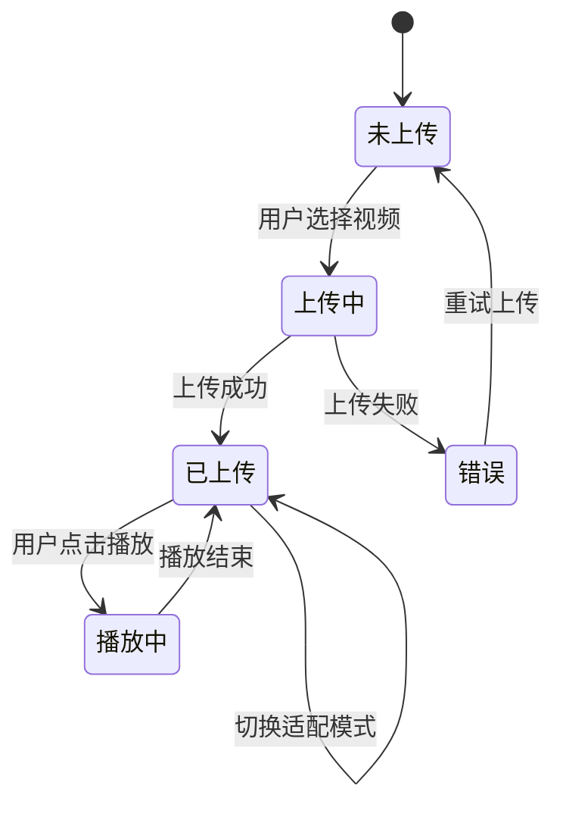

**图表来源**
- [VideoNode.tsx:107-185](file://frontend/src/components/canvas/VideoNode.tsx#L107-L185)
- [VideoNode.tsx:189-221](file://frontend/src/components/canvas/VideoNode.tsx#L189-L221)

#### 视频处理特性

1. **格式支持**：MP4、WebM、Ogg 格式，最大 500MB
2. **自动尺寸调整**：根据视频分辨率自动计算最佳尺寸
3. **播放控制**：完整的 HTML5 视频控件
4. **适配模式**：支持填充和适应两种显示模式

**章节来源**
- [VideoNode.tsx:107-185](file://frontend/src/components/canvas/VideoNode.tsx#L107-L185)
- [VideoNode.tsx:318-334](file://frontend/src/components/canvas/VideoNode.tsx#L318-L334)

### 自定义边线 (CustomEdge)

自定义边线组件提供了美观且功能丰富的连接线：

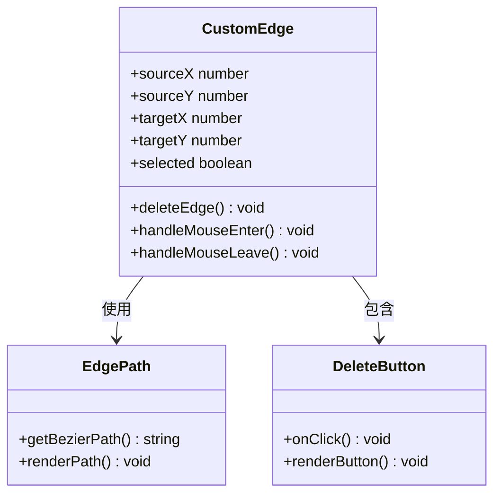

**图表来源**
- [CustomEdge.tsx:5-100](file://frontend/src/components/canvas/CustomEdge.tsx#L5-L100)

#### 边线交互功能

1. **贝塞尔曲线路径**：生成流畅的连接线路径
2. **悬停删除**：鼠标悬停时显示删除按钮
3. **宽度感应区域**：增加鼠标感应面积便于点击
4. **动态样式**：根据选中状态改变颜色和粗细

**章节来源**
- [CustomEdge.tsx:17-24](file://frontend/src/components/canvas/CustomEdge.tsx#L17-L24)
- [CustomEdge.tsx:29-40](file://frontend/src/components/canvas/CustomEdge.tsx#L29-L40)

## 新增的节点预览系统

### NodePreviewList 组件

NodePreviewList 是新增的核心组件，专门用于在 AI 助手面板中展示从画布拖拽过来的节点附件。该组件实现了智能的混合布局：媒体文件横向排列，文本节点纵向排列。

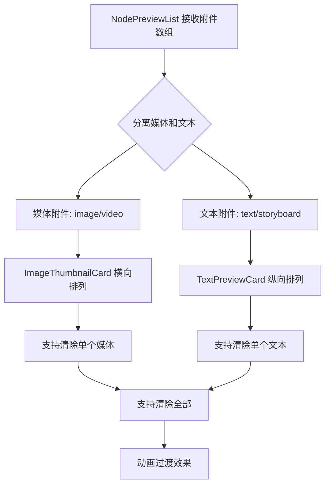

**图表来源**
- [NodePreviewCard.tsx:151-201](file://frontend/src/components/ai-assistant/NodePreviewCard.tsx#L151-L201)
- [AIAssistantPanel.tsx:492-499](file://frontend/src/components/canvas/AIAssistantPanel.tsx#L492-L499)

#### 核心功能特性

1. **智能分类布局**：自动区分媒体文件和文本节点，分别采用横向和纵向排列
2. **响应式设计**：媒体文件使用紧凑的横向排列，文本节点使用舒适的纵向布局
3. **交互式移除**：每个附件都支持单独移除和一键清空功能
4. **动画过渡**：使用 Framer Motion 提供流畅的进入和退出动画
5. **上传状态指示**：实时显示上传进度和状态

**章节来源**
- [NodePreviewCard.tsx:151-201](file://frontend/src/components/ai-assistant/NodePreviewCard.tsx#L151-L201)
- [NodePreviewCard.tsx:165-197](file://frontend/src/components/ai-assistant/NodePreviewCard.tsx#L165-L197)

### ImageThumbnailCard 组件

ImageThumbnailCard 是媒体附件的专用预览组件，专为横向排列优化：

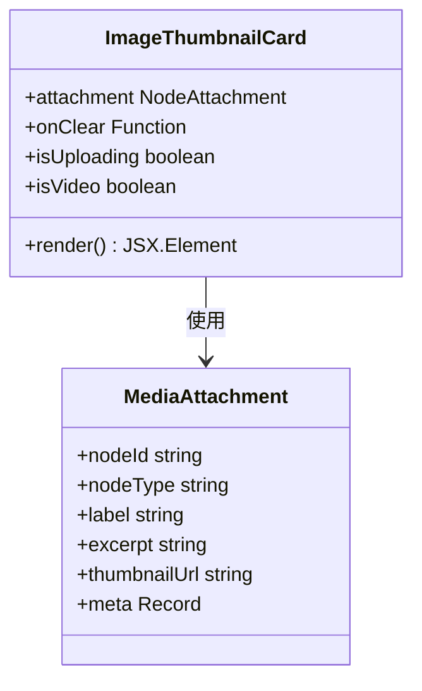

**图表来源**
- [NodePreviewCard.tsx:34-87](file://frontend/src/components/ai-assistant/NodePreviewCard.tsx#L34-L87)

#### 设计特点

1. **紧凑尺寸**：16x16 的小尺寸卡片适合横向密集排列
2. **悬停交互**：鼠标悬停时显示半透明背景和关闭按钮
3. **上传状态**：显示旋转的加载指示器
4. **视频特殊处理**：视频缩略图显示播放按钮覆盖层
5. **动画效果**：缩放和透明度的平滑过渡

**章节来源**
- [NodePreviewCard.tsx:34-87](file://frontend/src/components/ai-assistant/NodePreviewCard.tsx#L34-L87)

### TextPreviewCard 组件

TextPreviewCard 是文本节点的专用预览组件，专为纵向排列优化：

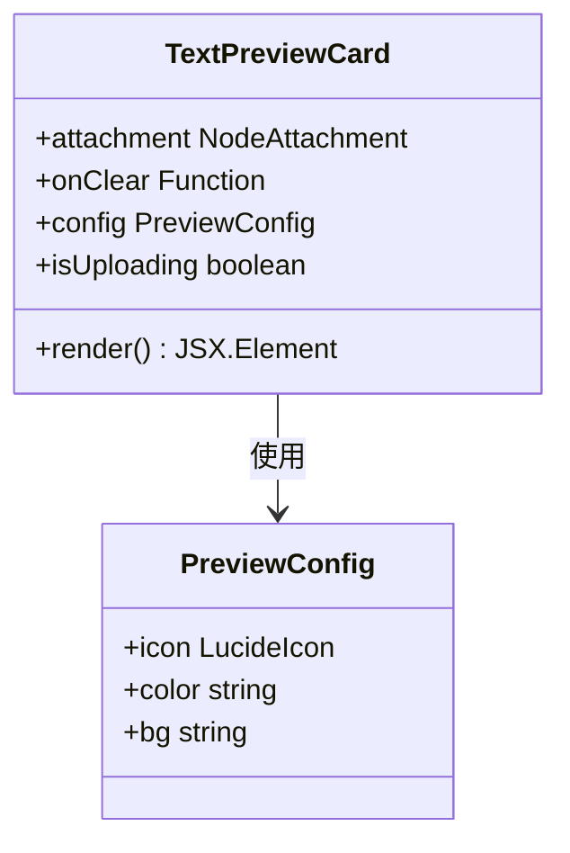

**图表来源**
- [NodePreviewCard.tsx:92-140](file://frontend/src/components/ai-assistant/NodePreviewCard.tsx#L92-L140)

#### 设计特点

1. **信息密度**：纵向布局提供更好的文本可读性
2. **颜色编码**：不同节点类型使用不同的颜色主题
3. **图标标识**：左侧显示对应类型的图标
4. **摘要显示**：显示内容摘要和上传状态
5. **独立交互**：每个文本节点都有独立的移除按钮

**章节来源**
- [NodePreviewCard.tsx:92-140](file://frontend/src/components/ai-assistant/NodePreviewCard.tsx#L92-L140)

### 节点附件数据结构

节点附件系统使用统一的数据结构来表示不同类型的节点：

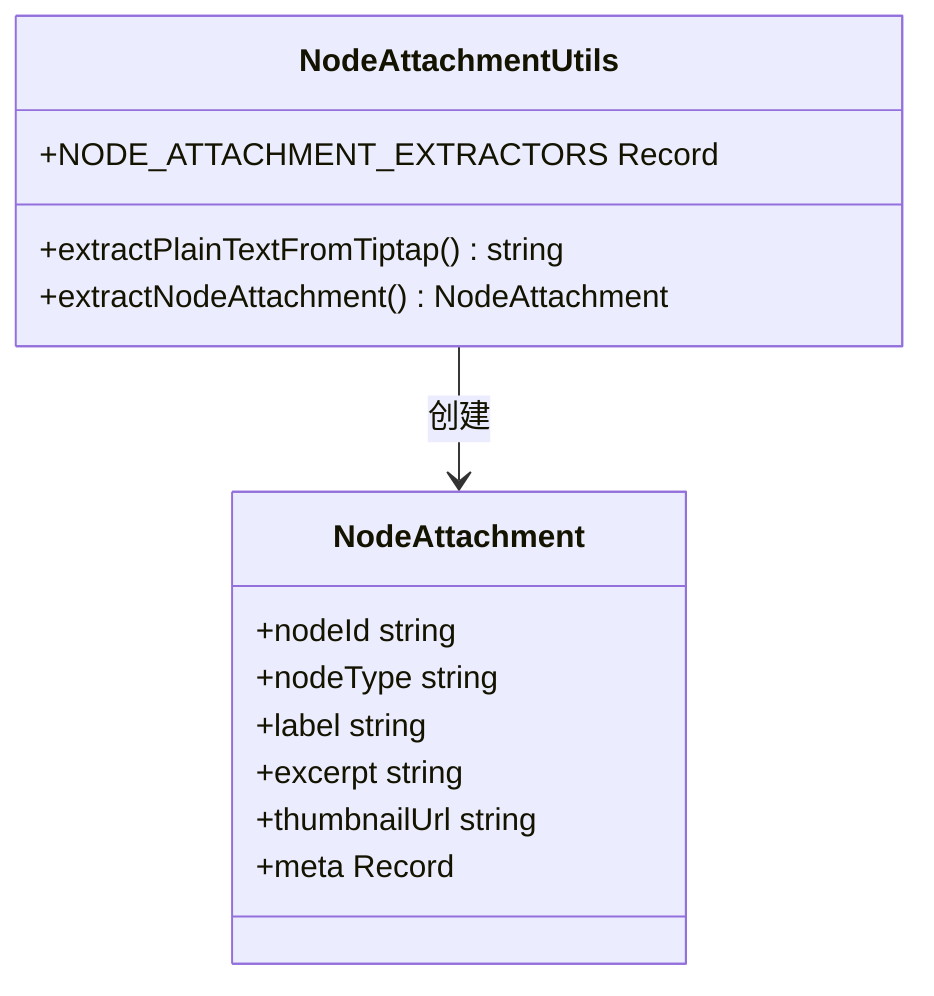

**图表来源**
- [useAIAssistantStore.ts:77-84](file://frontend/src/store/useAIAssistantStore.ts#L77-L84)
- [nodeAttachmentUtils.ts:86-96](file://frontend/src/lib/nodeAttachmentUtils.ts#L86-L96)

#### 数据提取功能

1. **文本节点**：从 Tiptap JSON 中提取纯文本摘要
2. **图片节点**：处理图片 URL，支持相对路径转换
3. **视频节点**：处理视频 URL，支持相对路径转换
4. **故事板节点**：提取分镜编号和时长信息

**章节来源**
- [nodeAttachmentUtils.ts:24-81](file://frontend/src/lib/nodeAttachmentUtils.ts#L24-L81)
- [nodeAttachmentUtils.ts:86-96](file://frontend/src/lib/nodeAttachmentUtils.ts#L86-L96)

## 依赖关系分析

系统采用模块化设计，各组件间依赖关系清晰：

```mermaid
graph LR
subgraph "核心依赖"
XY[@xyflow/react]
ZU[zustand]
TI[@tiptap/react]
FM[framer-motion]
LC[lucide-react]
end
subgraph "UI 组件"
CN[CharacterNode]
SN[ScriptNode]
SB[StoryboardNode]
VN[VideoNode]
CE[CustomEdge]
NPC[NodePreviewCard]
NPL[NodePreviewList]
ITC[ImageThumbnailCard]
TPC[TextPreviewCard]
end
subgraph "存储层"
CS[useCanvasStore]
AS[useAIAssistantStore]
end
subgraph "工具类"
PE[PivotEditor]
SE[ScriptEditor]
NAU[nodeAttachmentUtils]
GU[graphUtils]
end
XY --> CN
XY --> SN
XY --> SB
XY --> VN
XY --> CE
ZU --> CS
ZU --> AS
TI --> SE
FM --> NPC
LC --> NPC
CN --> CS
SN --> CS
SB --> CS
VN --> CS
CE --> CS
NPC --> AS
NPL --> AS
ITC --> NPC
TPC --> NPC
AS --> NAU
SB --> PE
SN --> SE
CS --> GU
```

**图表来源**
- [useCanvasStore.ts:18-24](file://frontend/src/store/useCanvasStore.ts#L18-L24)
- [useAIAssistantStore.ts:197-200](file://frontend/src/store/useAIAssistantStore.ts#L197-L200)
- [CharacterNode.tsx:3-8](file://frontend/src/components/canvas/CharacterNode.tsx#L3-L8)
- [NodePreviewCard.tsx:4-9](file://frontend/src/components/ai-assistant/NodePreviewCard.tsx#L4-L9)

### 关键依赖说明

1. **@xyflow/react**：提供画布渲染和节点拖拽功能
2. **zustand**：轻量级状态管理库
3. **@tiptap/react**：富文本编辑器框架
4. **framer-motion**：动画和过渡效果库
5. **lucide-react**：图标库
6. **uuid**：生成唯一标识符

**章节来源**
- [useCanvasStore.ts:2-3](file://frontend/src/store/useCanvasStore.ts#L2-L3)
- [useAIAssistantStore.ts:1-2](file://frontend/src/store/useAIAssistantStore.ts#L1-L2)
- [CharacterNode.tsx:2-11](file://frontend/src/components/canvas/CharacterNode.tsx#L2-L11)

## 性能考虑

### 内存管理

系统实现了多项内存优化措施：

1. **对象 URL 管理**：及时清理上传的临时文件 URL
2. **事件监听器清理**：组件卸载时自动清理事件监听
3. **状态持久化优化**：只存储必要的画布状态信息
4. **节点附件缓存**：避免重复计算节点摘要

### 渲染优化

1. **React.memo 包装**：避免不必要的组件重渲染
2. **虚拟滚动**：大数据集时使用虚拟化技术
3. **懒加载**：编辑器和复杂组件按需加载
4. **动画优化**：使用 transform 替代昂贵的布局属性

### 网络优化

1. **进度监控**：上传过程中的实时进度反馈
2. **错误重试**：网络异常时的自动重试机制
3. **缓存策略**：合理利用浏览器缓存
4. **批量处理**：支持多个节点附件的同时处理

## 故障排除指南

### 常见问题及解决方案

#### 上传失败问题

**症状**：图片或视频上传后显示错误信息

**可能原因**：
1. 文件格式不支持
2. 文件大小超出限制
3. 网络连接异常
4. 服务器配置问题

**解决步骤**：
1. 检查文件格式是否在支持列表中
2. 确认文件大小未超过限制
3. 验证网络连接稳定性
4. 查看浏览器开发者工具中的错误信息

#### 预览显示异常

**症状**：图片或视频无法正确显示

**可能原因**：
1. CORS 配置问题
2. 文件路径错误
3. 权限不足

**解决步骤**：
1. 检查后端 CORS 配置
2. 验证文件 URL 格式
3. 确认用户权限设置

#### 性能问题

**症状**：页面响应缓慢或卡顿

**可能原因**：
1. 节点数量过多
2. 大文件资源
3. 内存泄漏
4. 动画过度使用

**优化建议**：
1. 合理控制节点数量
2. 使用适当的文件压缩
3. 定期检查内存使用情况
4. 适当减少动画效果

#### 节点预览显示问题

**症状**：AI 助手面板中的节点预览不显示或显示异常

**可能原因**：
1. 节点附件数据结构错误
2. 节点类型识别失败
3. 缩略图 URL 处理错误
4. 状态管理同步问题

**解决步骤**：
1. 检查 NodeAttachment 数据结构
2. 验证节点类型映射
3. 确认缩略图 URL 转换逻辑
4. 查看状态管理日志

**章节来源**
- [CharacterNode.tsx:200-209](file://frontend/src/components/canvas/CharacterNode.tsx#L200-L209)
- [VideoNode.tsx:175-184](file://frontend/src/components/canvas/VideoNode.tsx#L175-L184)
- [nodeAttachmentUtils.ts:36-69](file://frontend/src/lib/nodeAttachmentUtils.ts#L36-L69)

## 结论

节点预览组件系统是一个功能完整、架构清晰的可视化编辑平台。系统通过模块化设计实现了高度的可维护性和扩展性，同时提供了优秀的用户体验。

**更新** 新增的 NodePreviewList 组件显著增强了 AI 助手面板的功能，提供了更直观的节点附件管理体验。该组件通过智能的混合布局设计，既满足了媒体文件的紧凑展示需求，又保证了文本节点的良好可读性。

### 主要优势

1. **功能丰富**：支持多种媒体类型的节点和编辑功能
2. **用户体验优秀**：直观的界面设计和流畅的交互体验
3. **技术架构先进**：采用现代 React 技术栈和最佳实践
4. **可扩展性强**：清晰的架构为未来功能扩展奠定基础
5. ****新增** 智能预览系统**：专门优化的节点附件展示和管理功能

### 发展方向

1. **性能优化**：进一步提升大数据集下的渲染性能
2. **协作功能**：增强多人协作编辑能力
3. **移动端适配**：优化移动端的使用体验
4. **插件系统**：支持第三方扩展和自定义节点类型
5. ****新增** 更多预览模式**：支持网格、瀑布流等多种布局模式

该系统为 Infinite Game 项目提供了强大的内容创作和编辑能力，是整个平台的核心基础设施之一。新增的节点预览系统进一步提升了用户的工作效率和创作体验。