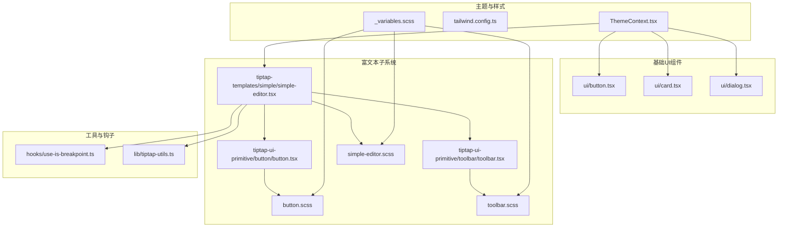
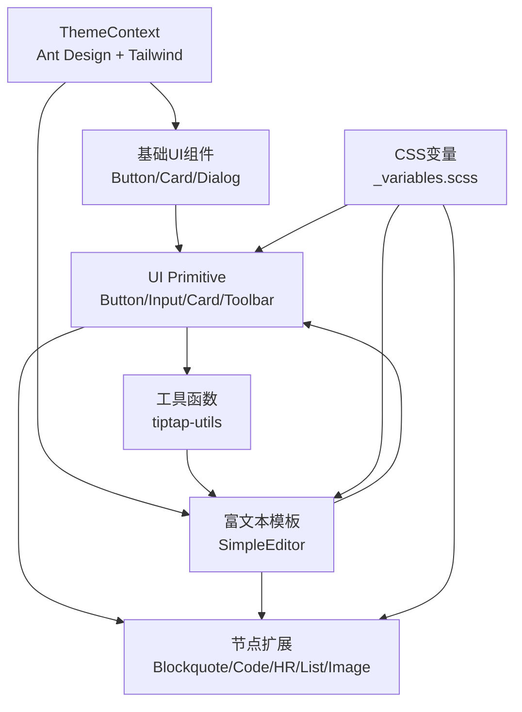
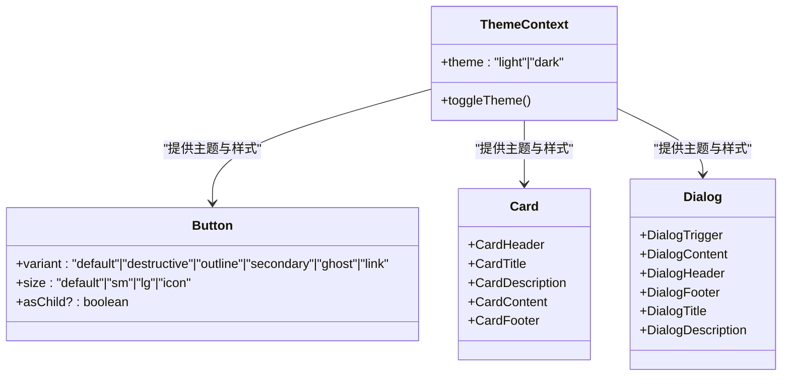
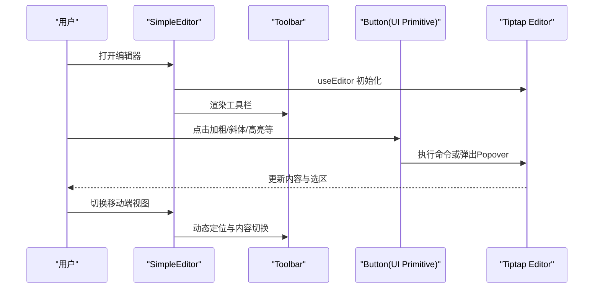
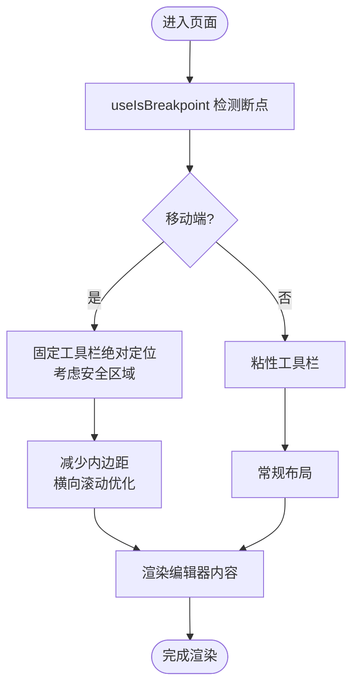
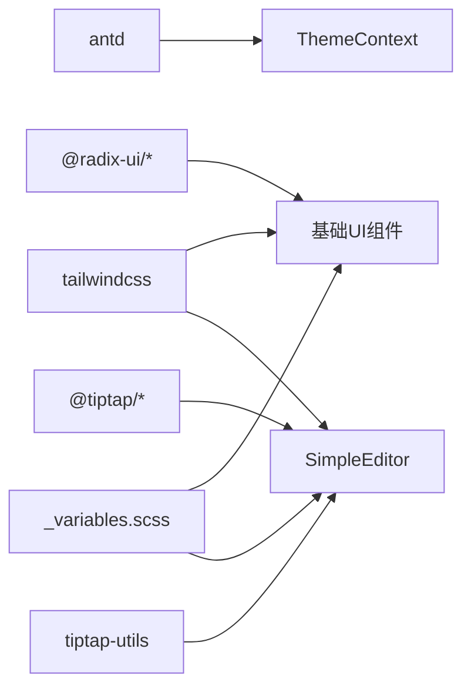

# UI组件库

<cite>
**本文档引用的文件**
- [frontend/package.json](file://frontend/package.json)
- [frontend/tailwind.config.ts](file://frontend/tailwind.config.ts)
- [frontend/src/context/ThemeContext.tsx](file://frontend/src/context/ThemeContext.tsx)
- [frontend/src/styles/_variables.scss](file://frontend/src/styles/_variables.scss)
- [frontend/src/components/ui/button.tsx](file://frontend/src/components/ui/button.tsx)
- [frontend/src/components/ui/card.tsx](file://frontend/src/components/ui/card.tsx)
- [frontend/src/components/ui/dialog.tsx](file://frontend/src/components/ui/dialog.tsx)
- [frontend/src/components/tiptap-templates/simple/simple-editor.tsx](file://frontend/src/components/tiptap-templates/simple/simple-editor.tsx)
- [frontend/src/components/tiptap-ui-primitive/button/button.tsx](file://frontend/src/components/tiptap-ui-primitive/button/button.tsx)
- [frontend/src/components/tiptap-ui-primitive/toolbar/toolbar.tsx](file://frontend/src/components/tiptap-ui-primitive/toolbar/toolbar.tsx)
- [frontend/src/components/tiptap-ui-primitive/button/button.scss](file://frontend/src/components/tiptap-ui-primitive/button/button.scss)
- [frontend/src/components/tiptap-ui-primitive/toolbar/toolbar.scss](file://frontend/src/components/tiptap-ui-primitive/toolbar/toolbar.scss)
- [frontend/src/components/tiptap-templates/simple/simple-editor.scss](file://frontend/src/components/tiptap-templates/simple/simple-editor.scss)
- [frontend/src/hooks/use-is-breakpoint.ts](file://frontend/src/hooks/use-is-breakpoint.ts)
- [frontend/src/lib/tiptap-utils.ts](file://frontend/src/lib/tiptap-utils.ts)
- [backend/admin/src/components/ui/button.tsx](file://backend/admin/src/components/ui/button.tsx)
</cite>

## 目录
1. [简介](#简介)
2. [项目结构](#项目结构)
3. [核心组件](#核心组件)
4. [架构总览](#架构总览)
5. [详细组件分析](#详细组件分析)
6. [依赖关系分析](#依赖关系分析)
7. [性能考量](#性能考量)
8. [故障排查指南](#故障排查指南)
9. [结论](#结论)
10. [附录](#附录)

## 简介
本文件为 Infinite Game UI 组件库的综合技术文档，聚焦以下目标：
- 深入解析 Ant Design 在 Next.js 中的集成与主题定制（含 ConfigProvider、算法切换、Token 覆盖）。
- 系统化说明基于 Radix UI 的通用基础组件封装（按钮、卡片、对话框），以及样式覆盖与可访问性设计。
- 全面阐述富文本编辑器组件的实现，包括 Tiptap 集成、扩展开发、插件系统与工具栏交互。
- 解释响应式设计策略（断点、布局适配、移动端优化）与无障碍访问支持、浏览器兼容性处理。

## 项目结构
前端采用模块化组织：基础 UI 组件位于 src/components/ui；富文本子系统位于 src/components/tiptap-*；主题与变量位于 src/styles；上下文与工具函数位于 src/context 与 src/lib；Tailwind 与 Ant Design 主题在 src/context/ThemeContext.tsx 中统一注入。

**图表来源**
- [frontend/src/context/ThemeContext.tsx:16-64](file://frontend/src/context/ThemeContext.tsx#L16-L64)
- [frontend/src/components/ui/button.tsx:1-57](file://frontend/src/components/ui/button.tsx#L1-L57)
- [frontend/src/components/ui/card.tsx:1-80](file://frontend/src/components/ui/card.tsx#L1-L80)
- [frontend/src/components/ui/dialog.tsx:1-121](file://frontend/src/components/ui/dialog.tsx#L1-L121)
- [frontend/src/components/tiptap-templates/simple/simple-editor.tsx:1-294](file://frontend/src/components/tiptap-templates/simple/simple-editor.tsx#L1-L294)
- [frontend/src/components/tiptap-ui-primitive/button/button.tsx:1-104](file://frontend/src/components/tiptap-ui-primitive/button/button.tsx#L1-L104)
- [frontend/src/components/tiptap-ui-primitive/toolbar/toolbar.tsx:1-124](file://frontend/src/components/tiptap-ui-primitive/toolbar/toolbar.tsx#L1-L124)
- [frontend/src/components/tiptap-ui-primitive/button/button.scss:1-315](file://frontend/src/components/tiptap-ui-primitive/button/button.scss#L1-L315)
- [frontend/src/components/tiptap-ui-primitive/toolbar/toolbar.scss:1-99](file://frontend/src/components/tiptap-ui-primitive/toolbar/toolbar.scss#L1-L99)
- [frontend/src/components/tiptap-templates/simple/simple-editor.scss:1-83](file://frontend/src/components/tiptap-templates/simple/simple-editor.scss#L1-L83)
- [frontend/src/hooks/use-is-breakpoint.ts:1-38](file://frontend/src/hooks/use-is-breakpoint.ts#L1-L38)
- [frontend/src/lib/tiptap-utils.ts:1-641](file://frontend/src/lib/tiptap-utils.ts#L1-L641)

**章节来源**
- [frontend/package.json:13-67](file://frontend/package.json#L13-L67)
- [frontend/tailwind.config.ts:1-64](file://frontend/tailwind.config.ts#L1-L64)

## 核心组件
本节概述三大类核心组件及其职责与设计要点：

- Ant Design 主题与基础组件
  - 使用 Ant Design 的 ConfigProvider 注入主题算法与 Token，支持暗/亮模式切换，并通过 App 包裹确保全局样式生效。
  - 基础组件如 Button、Card、Dialog 基于 Radix UI 与 Tailwind CSS 实现，具备变体与尺寸控制、无障碍属性与可组合性。

- 富文本编辑器
  - 基于 Tiptap React 与 Starter Kit，集成常用扩展（标题、列表、任务清单、对齐、高亮、上标/下标、链接、图片上传等）。
  - 自研 UI Primitive（按钮、输入、卡片、工具栏）与节点扩展（块引用、代码块、水平分割线、列表、段落、图片上传），形成可复用的编辑器 UI。

- 响应式与可访问性
  - 通过断点检测钩子与媒体查询实现移动端适配；工具栏支持键盘导航与焦点可见状态；编辑器内容区域具备语义化角色与无障碍标签。

**章节来源**
- [frontend/src/context/ThemeContext.tsx:16-64](file://frontend/src/context/ThemeContext.tsx#L16-L64)
- [frontend/src/components/ui/button.tsx:1-57](file://frontend/src/components/ui/button.tsx#L1-L57)
- [frontend/src/components/ui/card.tsx:1-80](file://frontend/src/components/ui/card.tsx#L1-L80)
- [frontend/src/components/ui/dialog.tsx:1-121](file://frontend/src/components/ui/dialog.tsx#L1-L121)
- [frontend/src/components/tiptap-templates/simple/simple-editor.tsx:189-294](file://frontend/src/components/tiptap-templates/simple/simple-editor.tsx#L189-L294)

## 架构总览
下图展示 UI 组件库的整体架构：主题上下文负责注入 Ant Design 与 Tailwind 变量；基础 UI 组件与富文本子系统共享样式变量与工具函数；富文本模板通过 UI Primitive 与节点扩展构建编辑体验。

**图表来源**
- [frontend/src/context/ThemeContext.tsx:16-64](file://frontend/src/context/ThemeContext.tsx#L16-L64)
- [frontend/src/styles/_variables.scss:1-297](file://frontend/src/styles/_variables.scss#L1-L297)
- [frontend/src/components/tiptap-templates/simple/simple-editor.tsx:1-294](file://frontend/src/components/tiptap-templates/simple/simple-editor.tsx#L1-L294)
- [frontend/src/components/tiptap-ui-primitive/button/button.tsx:1-104](file://frontend/src/components/tiptap-ui-primitive/button/button.tsx#L1-L104)
- [frontend/src/components/tiptap-ui-primitive/toolbar/toolbar.tsx:1-124](file://frontend/src/components/tiptap-ui-primitive/toolbar/toolbar.tsx#L1-L124)
- [frontend/src/lib/tiptap-utils.ts:1-641](file://frontend/src/lib/tiptap-utils.ts#L1-L641)

## 详细组件分析

### Ant Design 主题与基础组件封装
- 主题注入与切换
  - 通过 ThemeContext 提供 Provider，内部使用 ConfigProvider 注入算法与 Token，并持久化到本地存储。
  - 支持暗/亮模式切换，自动同步到 documentElement 类名，便于 CSS 变量与第三方组件样式联动。
- 基础组件设计
  - Button：基于 class-variance-authority 定义变体与尺寸，支持 asChild 透传与 SVG 内嵌图标。
  - Card：分块组件（Header/Title/Description/Content/Footer）组合，遵循语义化与可访问性。
  - Dialog：基于 Radix UI，内置动画、Portal 渲染与无障碍关闭按钮。

**图表来源**
- [frontend/src/context/ThemeContext.tsx:16-64](file://frontend/src/context/ThemeContext.tsx#L16-L64)
- [frontend/src/components/ui/button.tsx:7-34](file://frontend/src/components/ui/button.tsx#L7-L34)
- [frontend/src/components/ui/card.tsx:5-77](file://frontend/src/components/ui/card.tsx#L5-L77)
- [frontend/src/components/ui/dialog.tsx:7-107](file://frontend/src/components/ui/dialog.tsx#L7-L107)

**章节来源**
- [frontend/src/context/ThemeContext.tsx:16-64](file://frontend/src/context/ThemeContext.tsx#L16-L64)
- [frontend/src/components/ui/button.tsx:1-57](file://frontend/src/components/ui/button.tsx#L1-L57)
- [frontend/src/components/ui/card.tsx:1-80](file://frontend/src/components/ui/card.tsx#L1-L80)
- [frontend/src/components/ui/dialog.tsx:1-121](file://frontend/src/components/ui/dialog.tsx#L1-L121)

### 富文本编辑器实现（Tiptap 集成）
- 编辑器初始化与扩展
  - 使用 useEditor 初始化，立即渲染关闭，配置编辑器属性（自动纠错、无障碍标签、自定义类名）。
  - 扩展集合包含 StarterKit（可配置标题层级、禁用代码块与水平分割线）、Underline、Typography、TextAlign、TaskList/TaskItem、Highlight、Subscript、Superscript、TextStyle、Color、HorizontalRule、ImageUploadNode 等。
- UI Primitive 与工具栏
  - 工具栏组件 Toolbar/ToolbarGroup/ToolbarSeparator，支持键盘导航与焦点管理。
  - 按钮组件 Button 支持快捷键提示、Tooltip 展示与样式变体。
- 移动端适配
  - 使用断点钩子判断移动端，主工具栏与移动面板切换；根据光标位置动态调整工具栏底部定位。
- 图片上传与安全
  - 上传前校验大小，演示场景中模拟进度；URL 规范化与协议白名单校验保障安全性。

**图表来源**
- [frontend/src/components/tiptap-templates/simple/simple-editor.tsx:189-294](file://frontend/src/components/tiptap-templates/simple/simple-editor.tsx#L189-L294)
- [frontend/src/components/tiptap-ui-primitive/toolbar/toolbar.tsx:82-101](file://frontend/src/components/tiptap-ui-primitive/toolbar/toolbar.tsx#L82-L101)
- [frontend/src/components/tiptap-ui-primitive/button/button.tsx:46-99](file://frontend/src/components/tiptap-ui-primitive/button/button.tsx#L46-L99)
- [frontend/src/hooks/use-is-breakpoint.ts:13-37](file://frontend/src/hooks/use-is-breakpoint.ts#L13-L37)
- [frontend/src/lib/tiptap-utils.ts:361-388](file://frontend/src/lib/tiptap-utils.ts#L361-L388)

**章节来源**
- [frontend/src/components/tiptap-templates/simple/simple-editor.tsx:1-294](file://frontend/src/components/tiptap-templates/simple/simple-editor.tsx#L1-L294)
- [frontend/src/components/tiptap-ui-primitive/toolbar/toolbar.tsx:1-124](file://frontend/src/components/tiptap-ui-primitive/toolbar/toolbar.tsx#L1-L124)
- [frontend/src/components/tiptap-ui-primitive/button/button.tsx:1-104](file://frontend/src/components/tiptap-ui-primitive/button/button.tsx#L1-L104)
- [frontend/src/hooks/use-is-breakpoint.ts:1-38](file://frontend/src/hooks/use-is-breakpoint.ts#L1-L38)
- [frontend/src/lib/tiptap-utils.ts:1-641](file://frontend/src/lib/tiptap-utils.ts#L1-L641)

### 响应式设计与移动端优化
- 断点策略
  - 使用 useIsBreakpoint 钩子监听媒体查询，返回布尔值表示是否匹配规则（最小/最大宽度）。
  - 工具栏在移动端采用绝对定位与安全区域适配，避免滚动穿透与遮挡。
- 布局适配
  - 编辑器内容区域在移动端减少内边距，保证输入体验；工具栏组在窄屏下不换行，保持横向滚动。
- 可访问性
  - 编辑器内容区域设置 aria-label；工具栏具备 role 与 aria-label；按钮支持 Tooltip 与快捷键提示。

**图表来源**
- [frontend/src/hooks/use-is-breakpoint.ts:13-37](file://frontend/src/hooks/use-is-breakpoint.ts#L13-L37)
- [frontend/src/components/tiptap-templates/simple/simple-editor.tsx:189-294](file://frontend/src/components/tiptap-templates/simple/simple-editor.tsx#L189-L294)
- [frontend/src/components/tiptap-ui-primitive/toolbar/toolbar.scss:52-66](file://frontend/src/components/tiptap-ui-primitive/toolbar/toolbar.scss#L52-L66)

**章节来源**
- [frontend/src/hooks/use-is-breakpoint.ts:1-38](file://frontend/src/hooks/use-is-breakpoint.ts#L1-L38)
- [frontend/src/components/tiptap-templates/simple/simple-editor.scss:78-82](file://frontend/src/components/tiptap-templates/simple/simple-editor.scss#L78-L82)
- [frontend/src/components/tiptap-ui-primitive/toolbar/toolbar.scss:1-99](file://frontend/src/components/tiptap-ui-primitive/toolbar/toolbar.scss#L1-L99)

### 样式覆盖与主题变量
- CSS 变量体系
  - 通过 _variables.scss 定义品牌色、灰阶、阴影、圆角、过渡等变量，并在暗/亮模式下切换。
  - Tailwind 配置映射变量至颜色与圆角，确保原生组件与自定义组件一致。
- SCSS 覆盖策略
  - UI Primitive 与节点扩展均引入对应 SCSS 文件，使用 CSS 变量驱动主题，避免硬编码颜色。
  - 富文本模板样式集中管理，统一字体、滚动条与内容区排版。

**章节来源**
- [frontend/src/styles/_variables.scss:1-297](file://frontend/src/styles/_variables.scss#L1-L297)
- [frontend/tailwind.config.ts:10-61](file://frontend/tailwind.config.ts#L10-L61)
- [frontend/src/components/tiptap-ui-primitive/button/button.scss:1-315](file://frontend/src/components/tiptap-ui-primitive/button/button.scss#L1-L315)
- [frontend/src/components/tiptap-ui-primitive/toolbar/toolbar.scss:1-99](file://frontend/src/components/tiptap-ui-primitive/toolbar/toolbar.scss#L1-L99)
- [frontend/src/components/tiptap-templates/simple/simple-editor.scss:1-83](file://frontend/src/components/tiptap-templates/simple/simple-editor.scss#L1-L83)

## 依赖关系分析
- 外部依赖
  - Ant Design 与 Next.js Registry：Ant Design 组件与 Next.js App Router 的集成。
  - Radix UI：用于可访问性与语义化的基础 UI。
  - Tiptap 生态：React、PM、Starter Kit、Bubble/Floating Menu、Image、Link、Typography 等。
  - Tailwind CSS 与 Tailwind Merge：原子化样式与类名合并。
- 内部耦合
  - ThemeContext 作为全局主题入口，被基础 UI 与富文本模板共同依赖。
  - tiptap-utils 为富文本子系统提供通用工具（快捷键格式化、URL 规范化、节点查找等）。

**图表来源**
- [frontend/package.json:13-67](file://frontend/package.json#L13-L67)
- [frontend/src/context/ThemeContext.tsx:16-64](file://frontend/src/context/ThemeContext.tsx#L16-L64)
- [frontend/src/components/tiptap-templates/simple/simple-editor.tsx:1-294](file://frontend/src/components/tiptap-templates/simple/simple-editor.tsx#L1-L294)
- [frontend/src/lib/tiptap-utils.ts:1-641](file://frontend/src/lib/tiptap-utils.ts#L1-L641)

**章节来源**
- [frontend/package.json:13-67](file://frontend/package.json#L13-L67)

## 性能考量
- 渲染与懒加载
  - 富文本编辑器使用 immediatelyRender=false，避免首屏阻塞；工具栏按需渲染主面板与移动面板。
- 事件与计算
  - 快捷键解析与平台符号映射在 useMemo 中缓存，减少重复计算。
- 样式与重绘
  - 使用 CSS 变量与 Tailwind 原子类，降低样式冲突与重绘成本；工具栏滚动使用 `-webkit-overflow-scrolling: touch` 提升移动端滚动性能。

## 故障排查指南
- 主题不生效
  - 确认 ThemeProvider 已包裹应用根节点；检查 ConfigProvider 的 algorithm 与 token 是否正确设置；确认 documentElement 类名已更新。
- 编辑器扩展缺失
  - 使用 isExtensionAvailable 检查扩展是否注册；查看控制台警告信息；确保扩展在 useEditor 的 extensions 数组中正确配置。
- 图片上传失败
  - 检查文件大小与类型限制；确认上传回调逻辑与错误处理；验证 URL 规范化与协议白名单。
- 移动端工具栏遮挡
  - 检查 useIsBreakpoint 返回值与工具栏定位逻辑；确认安全区域变量与 bottom 计算正确。

**章节来源**
- [frontend/src/context/ThemeContext.tsx:16-64](file://frontend/src/context/ThemeContext.tsx#L16-L64)
- [frontend/src/lib/tiptap-utils.ts:180-201](file://frontend/src/lib/tiptap-utils.ts#L180-L201)
- [frontend/src/components/tiptap-templates/simple/simple-editor.tsx:236-242](file://frontend/src/components/tiptap-templates/simple/simple-editor.tsx#L236-L242)

## 结论
本 UI 组件库以 Ant Design 为主题核心，结合 Radix UI 与 Tailwind CSS 实现基础组件的高可定制性；富文本编辑器通过 Tiptap 与自研 UI Primitive、节点扩展形成完整的编辑体验。配合断点检测、样式变量与工具函数，实现了良好的响应式与可访问性表现。建议在后续迭代中持续完善无障碍测试与跨浏览器兼容性验证。

## 附录
- 组件使用示例与最佳实践
  - Props 设计：优先使用变体与尺寸枚举，支持 asChild 与 data-* 属性，便于样式覆盖与测试选择器。
  - 事件处理：按钮组件统一透传原生事件；富文本按钮通过命令执行与 Popover 控制，避免直接操作 DOM。
  - 样式定制：通过 CSS 变量与 SCSS 覆盖实现主题一致性；避免内联样式的硬编码颜色。
- 无障碍访问
  - 编辑器内容区域提供 aria-label；工具栏具备 role 与 aria-label；按钮支持 Tooltip 与快捷键提示。
- 浏览器兼容性
  - 使用现代 CSS 变量与媒体查询；Radix UI 与 Ant Design 均提供良好兼容性；富文本编辑器在移动端采用 `-webkit-overflow-scrolling` 提升滚动体验。