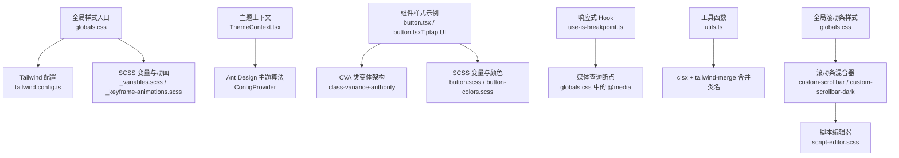
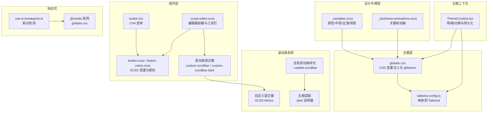
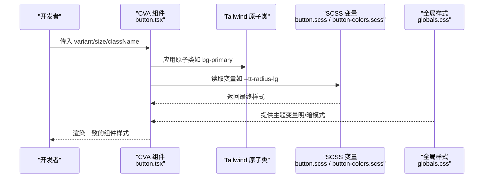
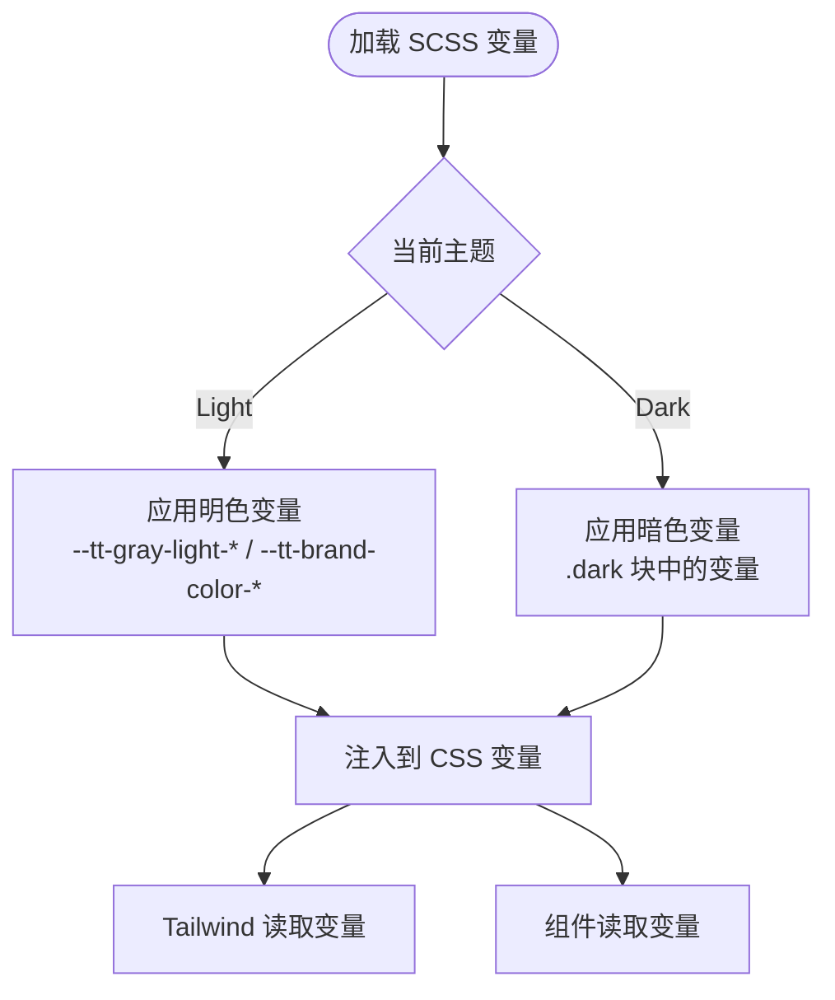
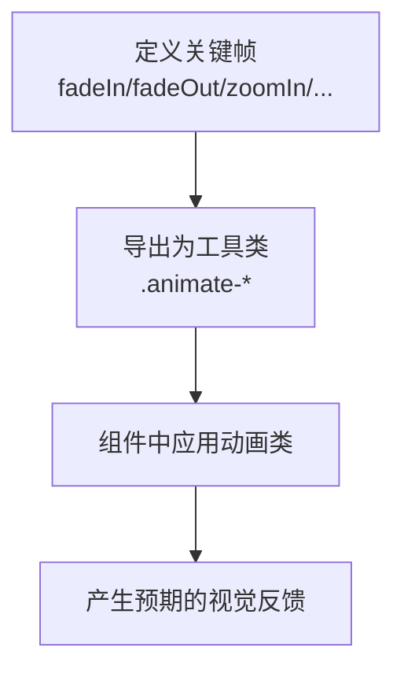
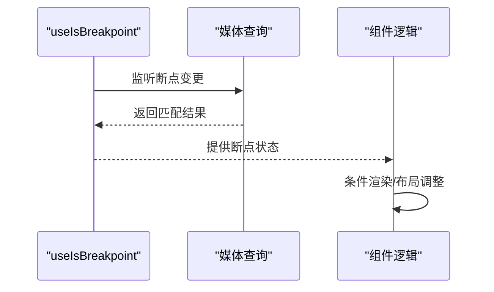
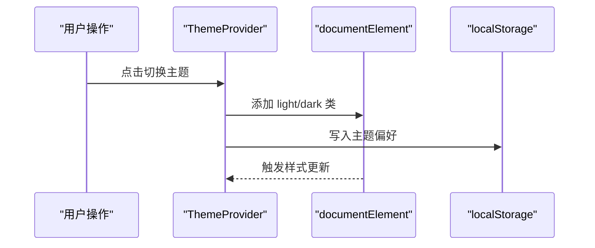
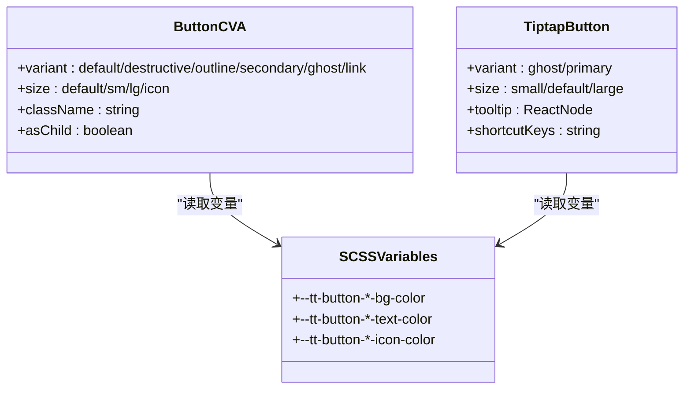
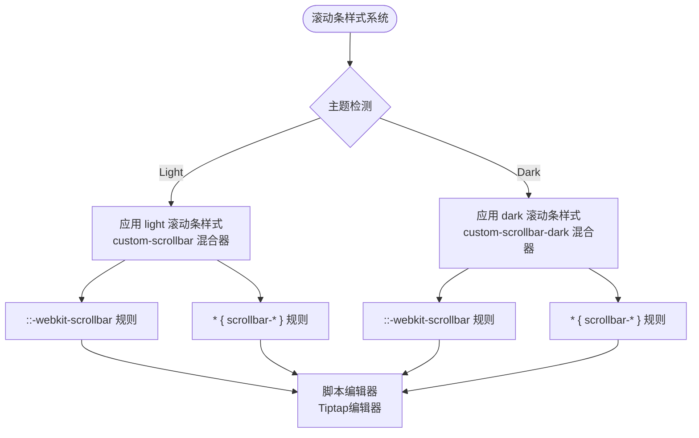
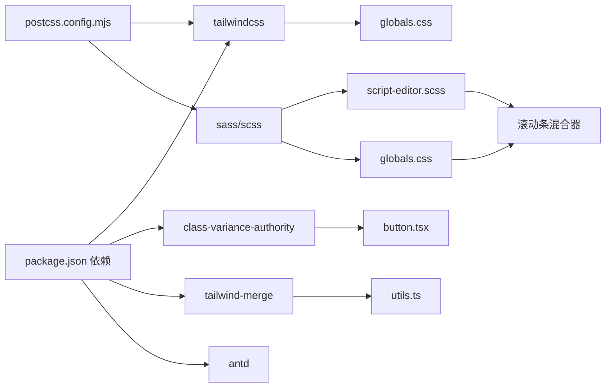

# 主题与样式系统

<cite>
**本文档引用的文件**
- [tailwind.config.ts](file://frontend/tailwind.config.ts)
- [postcss.config.mjs](file://frontend/postcss.config.mjs)
- [_variables.scss](file://frontend/src/styles/_variables.scss)
- [_keyframe-animations.scss](file://frontend/src/styles/_keyframe-animations.scss)
- [globals.css](file://frontend/src/app/globals.css)
- [package.json](file://frontend/package.json)
- [ThemeContext.tsx](file://frontend/src/context/ThemeContext.tsx)
- [button.tsx](file://frontend/src/components/ui/button.tsx)
- [button.tsx（Tiptap UI）](file://frontend/src/components/tiptap-ui-primitive/button/button.tsx)
- [button.scss](file://frontend/src/components/tiptap-ui-primitive/button/button.scss)
- [button-colors.scss](file://frontend/src/components/tiptap-ui-primitive/button/button-colors.scss)
- [script-editor.scss](file://frontend/src/components/canvas/script-editor.scss)
- [simple-editor.scss](file://frontend/src/components/tiptap-templates/simple/simple-editor.scss)
- [toolbar.scss](file://frontend/src/components/tiptap-ui-primitive/toolbar/toolbar.scss)
- [use-is-breakpoint.ts](file://frontend/src/hooks/use-is-breakpoint.ts)
- [utils.ts](file://frontend/src/lib/utils.ts)
- [tsconfig.json](file://frontend/tsconfig.json)
</cite>

## 更新摘要
**变更内容**
- 新增自定义滚动条样式混合器系统，支持light和dark主题变体
- 改进脚本编辑器的滚动条外观和交互体验
- 扩展全局滚动条样式支持，增强整体界面的一致性
- 优化Tiptap编辑器的滚动条适配和主题兼容性

## 目录
1. [简介](#简介)
2. [项目结构](#项目结构)
3. [核心组件](#核心组件)
4. [架构总览](#架构总览)
5. [详细组件分析](#详细组件分析)
6. [依赖关系分析](#依赖关系分析)
7. [性能考量](#性能考量)
8. [故障排查指南](#故障排查指南)
9. [结论](#结论)
10. [附录](#附录)

## 简介
本文件面向 Infinite Game 的前端主题与样式系统，系统化梳理了 CSS-in-JS 与 Tailwind CSS 的混合使用策略、SCSS 变量体系（颜色、字体、间距）、动画系统、响应式设计与断点策略、主题定制方法以及性能优化与兼容性最佳实践。目标是帮助开发者快速理解并高效扩展样式体系。

**更新** 新增自定义滚动条样式混合器系统，提供统一的主题适配和视觉一致性。

## 项目结构
样式系统由以下层次构成：
- 全局样式入口：通过全局 CSS 导入 Tailwind、SCSS 变量与关键帧动画，统一注入设计令牌与主题变量。
- Tailwind 配置：将 CSS 变量映射到 Tailwind 主题，使原子类与设计令牌联动。
- SCSS 变量与动画：集中管理颜色、半径、过渡、阴影等设计令牌，并定义关键帧动画。
- 组件样式：采用"类变体架构（CVA）+ Tailwind 原子类 + SCSS 变量"的混合策略，确保一致性与灵活性。
- 主题上下文：提供明暗主题切换、本地存储持久化与 Ant Design 主题算法集成。
- 响应式与断点：基于媒体查询与自定义 Hook 实现断点检测与移动端优化。
- **滚动条系统**：新增自定义滚动条样式混合器，支持light和dark主题变体，统一编辑器和界面的滚动条外观。

**图表来源**
- [globals.css:181-206](file://frontend/src/app/globals.css#L181-L206)
- [script-editor.scss:87-128](file://frontend/src/components/canvas/script-editor.scss#L87-L128)
- [simple-editor.scss:35-51](file://frontend/src/components/tiptap-templates/simple/simple-editor.scss#L35-L51)
- [toolbar.scss:45-50](file://frontend/src/components/tiptap-ui-primitive/toolbar/toolbar.scss#L45-L50)

**章节来源**
- [globals.css:181-206](file://frontend/src/app/globals.css#L181-L206)
- [script-editor.scss:87-128](file://frontend/src/components/canvas/script-editor.scss#L87-L128)
- [simple-editor.scss:35-51](file://frontend/src/components/tiptap-templates/simple/simple-editor.scss#L35-L51)
- [toolbar.scss:45-50](file://frontend/src/components/tiptap-ui-primitive/toolbar/toolbar.scss#L45-L50)

## 核心组件
- 设计令牌与主题变量
  - 使用 CSS 自定义属性集中管理颜色、半径、过渡、阴影等设计令牌，并在明/暗模式下切换。
  - 全局样式入口将变量注入到根节点，并通过 Tailwind 配置映射到设计系统。
- 动画系统
  - 定义通用关键帧动画（淡入淡出、缩放、滑动、旋转、脉冲等），并通过工具类或组件内部应用。
- 组件样式策略
  - 使用 CVA 构建按钮等基础组件的变体与尺寸，结合 Tailwind 原子类与 SCSS 变量实现一致的视觉与交互。
- 主题上下文
  - 提供明/暗主题切换、系统偏好检测、本地存储持久化，并与 Ant Design 主题算法联动。
- 响应式与断点
  - 基于媒体查询与自定义 Hook 实现断点检测，配合移动端优化规则。
- **滚动条系统**
  - **自定义滚动条混合器**：提供统一的滚动条样式定义，支持light和dark主题变体。
  - **全局滚动条样式**：通过CSS变量实现主题感知的滚动条外观。
  - **编辑器适配**：为脚本编辑器和Tiptap编辑器提供专门的滚动条样式。

**章节来源**
- [_variables.scss:179-200](file://frontend/src/styles/_variables.scss#L179-L200)
- [globals.css:181-206](file://frontend/src/app/globals.css#L181-L206)
- [script-editor.scss:87-128](file://frontend/src/components/canvas/script-editor.scss#L87-L128)

## 架构总览
样式系统采用"设计令牌驱动 + 混合样式策略 + 自定义滚动条系统"的架构：
- 设计令牌层：SCSS 变量集中定义颜色、半径、过渡、阴影等。
- 主题层：CSS 变量在明/暗模式下切换，Tailwind 读取这些变量作为主题色板。
- 组件层：CVA + Tailwind 原子类 + SCSS 变量，保证组件风格一致且易于扩展。
- 动画层：关键帧动画与工具类组合，支持复杂交互反馈。
- 响应式层：媒体查询与断点 Hook 协同，实现自适应布局。
- **滚动条层**：自定义混合器提供主题感知的滚动条样式，统一界面视觉体验。

**图表来源**
- [_variables.scss:179-200](file://frontend/src/styles/_variables.scss#L179-L200)
- [globals.css:181-206](file://frontend/src/app/globals.css#L181-L206)
- [tailwind.config.ts:1-64](file://frontend/tailwind.config.ts#L1-L64)
- [button.tsx:1-57](file://frontend/src/components/ui/button.tsx#L1-L57)
- [button.scss:1-315](file://frontend/src/components/tiptap-ui-primitive/button/button.scss#L1-L315)
- [button-colors.scss:1-430](file://frontend/src/components/tiptap-ui-primitive/button/button-colors.scss#L1-L430)
- [script-editor.scss:87-128](file://frontend/src/components/canvas/script-editor.scss#L87-L128)
- [ThemeContext.tsx:1-74](file://frontend/src/context/ThemeContext.tsx#L1-L74)
- [use-is-breakpoint.ts:1-38](file://frontend/src/hooks/use-is-breakpoint.ts#L1-L38)

## 详细组件分析

### CSS-in-JS 与 Tailwind 混合策略
- 设计令牌注入：全局 CSS 将 CSS 变量注入根节点，并通过 @theme 将变量映射为 Tailwind 主题令牌。
- 组件样式：基础组件使用 CVA 定义变体与尺寸，再结合 Tailwind 原子类与 SCSS 变量，形成"类变体 + 设计令牌"的混合策略。
- 工具函数：使用 clsx 与 tailwind-merge 合并类名，避免冲突并保持原子类的简洁性。

**图表来源**
- [button.tsx:1-57](file://frontend/src/components/ui/button.tsx#L1-L57)
- [button.tsx（Tiptap UI）:1-104](file://frontend/src/components/tiptap-ui-primitive/button/button.tsx#L1-L104)
- [button.scss:1-315](file://frontend/src/components/tiptap-ui-primitive/button/button.scss#L1-L315)
- [button-colors.scss:1-430](file://frontend/src/components/tiptap-ui-primitive/button/button-colors.scss#L1-L430)
- [globals.css:1-407](file://frontend/src/app/globals.css#L1-L407)

**章节来源**
- [button.tsx:1-57](file://frontend/src/components/ui/button.tsx#L1-L57)
- [button.tsx（Tiptap UI）:1-104](file://frontend/src/components/tiptap-ui-primitive/button/button.tsx#L1-L104)
- [button.scss:1-315](file://frontend/src/components/tiptap-ui-primitive/button/button.scss#L1-L315)
- [button-colors.scss:1-430](file://frontend/src/components/tiptap-ui-primitive/button/button-colors.scss#L1-L430)
- [utils.ts:1-7](file://frontend/src/lib/utils.ts#L1-L7)

### SCSS 变量系统（颜色、字体、间距）
- 颜色体系：定义灰阶、品牌色、状态色与文本高亮色，分别提供明/暗两套值；支持对比度与强调色。
- 字体与间距：通过 CSS 变量统一管理字号、行高、字重与间距，便于跨组件复用。
- 半径与过渡：统一圆角与过渡时长/缓动曲线，保证交互一致性。
- 阴影：提供层级化阴影变量，适配明/暗模式差异。

**图表来源**
- [_variables.scss:179-200](file://frontend/src/styles/_variables.scss#L179-L200)
- [globals.css:1-407](file://frontend/src/app/globals.css#L1-L407)
- [tailwind.config.ts:1-64](file://frontend/tailwind.config.ts#L1-L64)

**章节来源**
- [_variables.scss:179-200](file://frontend/src/styles/_variables.scss#L179-L200)
- [globals.css:1-407](file://frontend/src/app/globals.css#L1-L407)

### 动画系统（关键帧与工具类）
- 关键帧定义：涵盖淡入淡出、缩放、滑动、旋转、脉冲、打字机光标等，满足不同交互场景。
- 工具类：将关键帧封装为可复用的动画类，简化组件使用。
- 组件应用：在 AI 助手、输入提示、加载指示等组件中按需启用相应动画。

**图表来源**
- [_keyframe-animations.scss:1-176](file://frontend/src/styles/_keyframe-animations.scss#L1-L176)
- [globals.css:1-407](file://frontend/src/app/globals.css#L1-L407)

**章节来源**
- [_keyframe-animations.scss:1-176](file://frontend/src/styles/_keyframe-animations.scss#L1-L176)
- [globals.css:1-407](file://frontend/src/app/globals.css#L1-L407)

### 响应式设计与断点策略
- 断点检测：通过自定义 Hook useIsBreakpoint 基于媒体查询监听断点变化，返回布尔值用于条件渲染。
- 媒体查询：在全局样式中针对移动端进行字体与排版优化，减少动画偏好场景下的过度动画。
- 编辑器适配：脚本编辑器在视图/编辑模式下对工具栏、内容区与占位符进行差异化布局与交互。

**图表来源**
- [use-is-breakpoint.ts:1-38](file://frontend/src/hooks/use-is-breakpoint.ts#L1-L38)
- [globals.css:375-397](file://frontend/src/app/globals.css#L375-L397)
- [script-editor.scss:129-152](file://frontend/src/components/canvas/script-editor.scss#L129-L152)

**章节来源**
- [use-is-breakpoint.ts:1-38](file://frontend/src/hooks/use-is-breakpoint.ts#L1-L38)
- [globals.css:375-397](file://frontend/src/app/globals.css#L375-L397)
- [script-editor.scss:129-152](file://frontend/src/components/canvas/script-editor.scss#L129-L152)

### 主题定制指南
- 切换机制：通过主题上下文在明/暗之间切换，自动写入 DOM 类并持久化到本地存储。
- Ant Design 集成：根据当前主题选择算法与主色、背景色、文字色等 Token，确保第三方组件风格一致。
- 自定义变量：可在全局样式中新增或覆盖 CSS 变量，以实现品牌色或业务色的定制。

**图表来源**
- [ThemeContext.tsx:16-64](file://frontend/src/context/ThemeContext.tsx#L16-L64)
- [globals.css:34-90](file://frontend/src/app/globals.css#L34-L90)

**章节来源**
- [ThemeContext.tsx:1-74](file://frontend/src/context/ThemeContext.tsx#L1-L74)
- [globals.css:34-90](file://frontend/src/app/globals.css#L34-L90)

### 组件样式组织方式
- 基础组件：使用 CVA 定义变体与尺寸，结合 Tailwind 原子类与 SCSS 变量，保证一致的视觉与交互。
- Tiptap UI 组件：通过数据属性（如 data-style、data-size）控制外观与尺寸，颜色与状态由 SCSS 变量驱动。
- 编辑器容器：脚本编辑器的工具栏、内容区与占位符在明/暗模式下分别应用不同的样式规则。

**图表来源**
- [button.tsx:1-57](file://frontend/src/components/ui/button.tsx#L1-L57)
- [button.tsx（Tiptap UI）:1-104](file://frontend/src/components/tiptap-ui-primitive/button/button.tsx#L1-L104)
- [button.scss:1-315](file://frontend/src/components/tiptap-ui-primitive/button/button.scss#L1-L315)
- [button-colors.scss:1-430](file://frontend/src/components/tiptap-ui-primitive/button/button-colors.scss#L1-L430)

**章节来源**
- [button.tsx:1-57](file://frontend/src/components/ui/button.tsx#L1-L57)
- [button.tsx（Tiptap UI）:1-104](file://frontend/src/components/tiptap-ui-primitive/button/button.tsx#L1-L104)
- [button.scss:1-315](file://frontend/src/components/tiptap-ui-primitive/button/button.scss#L1-L315)
- [button-colors.scss:1-430](file://frontend/src/components/tiptap-ui-primitive/button/button-colors.scss#L1-L430)

### 自定义滚动条系统
**更新** 新增完整的自定义滚动条样式系统，提供统一的主题适配和视觉一致性。

- **滚动条混合器**：通过SCSS混合器定义统一的滚动条样式，支持light和dark主题变体。
- **全局滚动条样式**：使用CSS变量实现主题感知的滚动条外观，确保全局一致性。
- **编辑器适配**：为脚本编辑器和Tiptap编辑器提供专门的滚动条样式，优化用户体验。
- **浏览器兼容性**：同时支持Webkit内核浏览器和Firefox的滚动条样式。

**图表来源**
- [script-editor.scss:87-128](file://frontend/src/components/canvas/script-editor.scss#L87-L128)
- [globals.css:181-206](file://frontend/src/app/globals.css#L181-L206)
- [simple-editor.scss:35-51](file://frontend/src/components/tiptap-templates/simple/simple-editor.scss#L35-L51)

**章节来源**
- [script-editor.scss:87-128](file://frontend/src/components/canvas/script-editor.scss#L87-L128)
- [globals.css:181-206](file://frontend/src/app/globals.css#L181-L206)
- [simple-editor.scss:35-51](file://frontend/src/components/tiptap-templates/simple/simple-editor.scss#L35-L51)
- [toolbar.scss:45-50](file://frontend/src/components/tiptap-ui-primitive/toolbar/toolbar.scss#L45-L50)

## 依赖关系分析
- 核心依赖
  - Tailwind CSS：提供原子类与主题系统。
  - class-variance-authority：构建组件变体与尺寸。
  - tailwind-merge：合并类名，避免冲突。
  - Ant Design：提供 UI 组件与主题算法。
- 构建链路
  - PostCSS 负责处理 Tailwind 与 SCSS 的导入与编译。
  - Next.js 在运行时注入全局样式与主题变量。
- **滚动条系统依赖**
  - SCSS混合器：提供可复用的滚动条样式定义。
  - CSS变量：支持主题感知的颜色和尺寸。
  - 浏览器前缀：确保Webkit和Firefox的兼容性。

**图表来源**
- [package.json:13-67](file://frontend/package.json#L13-L67)
- [postcss.config.mjs:1-8](file://frontend/postcss.config.mjs#L1-L8)
- [globals.css:181-206](file://frontend/src/app/globals.css#L181-L206)
- [script-editor.scss:87-128](file://frontend/src/components/canvas/script-editor.scss#L87-L128)
- [button.tsx:1-57](file://frontend/src/components/ui/button.tsx#L1-L57)
- [utils.ts:1-7](file://frontend/src/lib/utils.ts#L1-L7)

**章节来源**
- [package.json:13-67](file://frontend/package.json#L13-L67)
- [postcss.config.mjs:1-8](file://frontend/postcss.config.mjs#L1-L8)
- [globals.css:181-206](file://frontend/src/app/globals.css#L181-L206)
- [script-editor.scss:87-128](file://frontend/src/components/canvas/script-editor.scss#L87-L128)
- [button.tsx:1-57](file://frontend/src/components/ui/button.tsx#L1-L57)
- [utils.ts:1-7](file://frontend/src/lib/utils.ts#L1-L7)

## 性能考量
- 样式体积控制
  - 仅导入必要的 Tailwind 内容路径，避免无用类进入产物。
  - 合理拆分 SCSS 文件，按需引入，减少全局变量污染。
- 运行时性能
  - 使用 clsx 与 tailwind-merge 合并类名，降低样式冲突与重绘成本。
  - 在组件中优先使用原子类，减少内联样式的使用。
- 动画与过渡
  - 对于高频动画，尽量使用 transform 与 opacity，避免触发布局与重绘。
  - 减少动画时长与复杂度，必要时为"减少动态"用户提供降级选项。
- 响应式与断点
  - 使用媒体查询与断点 Hook 结合，避免在小屏设备上执行昂贵的布局计算。
  - 在移动端优化字体大小与行高，减少文本渲染压力。
- **滚动条性能优化**
  - 使用CSS变量而非JavaScript动态计算，提高渲染性能。
  - 滚动条样式使用简单的颜色和尺寸，避免复杂的渐变和阴影。
  - 通过混合器复用样式，减少重复的CSS规则。

## 故障排查指南
- 主题切换无效
  - 检查主题上下文是否正确包裹应用根节点。
  - 确认 DOM 上存在 light/dark 类，且与期望一致。
  - 查看本地存储中是否存在主题偏好键值。
- Tailwind 类未生效
  - 确认 Tailwind 内容扫描路径包含对应组件目录。
  - 检查是否正确导入全局样式与变量。
- 动画异常
  - 检查关键帧是否被正确导入与命名。
  - 确认组件中使用的动画类名称与定义一致。
- 响应式问题
  - 使用断点 Hook 验证断点判断逻辑。
  - 检查媒体查询断点与组件样式是否匹配。
- **滚动条问题**
  - 检查浏览器是否支持自定义滚动条样式。
  - 确认CSS变量是否正确注入到根元素。
  - 验证滚动条混合器是否正确应用到目标元素。
  - 检查主题切换时滚动条样式是否同步更新。

**章节来源**
- [ThemeContext.tsx:16-64](file://frontend/src/context/ThemeContext.tsx#L16-L64)
- [tailwind.config.ts:5-9](file://frontend/tailwind.config.ts#L5-L9)
- [globals.css:181-206](file://frontend/src/app/globals.css#L181-L206)
- [script-editor.scss:87-128](file://frontend/src/components/canvas/script-editor.scss#L87-L128)
- [use-is-breakpoint.ts:19-34](file://frontend/src/hooks/use-is-breakpoint.ts#L19-L34)

## 结论
Infinite Game 的样式系统通过"设计令牌 + Tailwind + SCSS + CVA + 自定义滚动条系统"的混合策略，实现了主题一致性、组件可扩展性、开发效率与用户体验的平衡。借助明/暗主题上下文、关键帧动画、响应式断点机制和全新的自定义滚动条系统，系统在视觉体验与性能表现上均具备良好的可维护性与可扩展性。新的滚动条系统提供了统一的主题适配和视觉一致性，显著改善了编辑器和界面的滚动体验。建议在后续迭代中持续沉淀设计令牌、收敛组件变体、完善滚动条测试用例，并探索更多主题化的UI元素。

## 附录
- TypeScript 路径别名：通过 tsconfig.json 的路径映射简化导入路径，提升开发体验。
- 浏览器兼容性：Tailwind 与 PostCSS 生态已覆盖主流现代浏览器；如需支持旧版 IE，需额外引入 polyfill 与降级策略。
- **滚动条兼容性**：系统同时支持Webkit内核浏览器（Chrome、Safari、Edge）和Firefox的滚动条样式，确保跨浏览器的一致体验。

**章节来源**
- [tsconfig.json:21-23](file://frontend/tsconfig.json#L21-L23)
- [script-editor.scss:87-128](file://frontend/src/components/canvas/script-editor.scss#L87-L128)
- [globals.css:181-206](file://frontend/src/app/globals.css#L181-L206)