# 主题与样式系统

<cite>
**本文档引用的文件**
- [globals.css](file://frontend/src/app/globals.css)
- [_variables.scss](file://frontend/src/styles/_variables.scss)
- [AIAssistantPanel.tsx](file://frontend/src/components/ai-assistant/AIAssistantPanel.tsx)
- [ChatMessage.tsx](file://frontend/src/components/ai-assistant/ChatMessage.tsx)
- [PanelHeader.tsx](file://frontend/src/components/ai-assistant/PanelHeader.tsx)
- [MessageInput.tsx](file://frontend/src/components/ai-assistant/MessageInput.tsx)
- [useAIAssistantStore.ts](file://frontend/src/store/useAIAssistantStore.ts)
- [useSessionManager.ts](file://frontend/src/components/ai-assistant/hooks/useSessionManager.ts)
- [tailwind.config.ts](file://frontend/tailwind.config.ts)
- [postcss.config.mjs](file://frontend/postcss.config.mjs)
- [_keyframe-animations.scss](file://frontend/src/styles/_keyframe-animations.scss)
- [ThemeContext.tsx](file://frontend/src/context/ThemeContext.tsx)
- [button.tsx](file://frontend/src/components/ui/button.tsx)
- [button.tsx（Tiptap UI）](file://frontend/src/components/tiptap-ui-primitive/button/button.tsx)
- [button.scss](file://frontend/src/components/tiptap-ui-primitive/button/button.scss)
- [button-colors.scss](file://frontend/src/components/tiptap-ui-primitive/button/button-colors.scss)
- [script-editor.scss](file://frontend/src/components/canvas/script-editor.scss)
- [simple-editor.scss](file://frontend/src/components/tiptap-templates/simple/simple-editor.scss)
- [toolbar.scss](file://frontend/src/components/tiptap-ui-primitive/toolbar/toolbar.scss)
- [use-is-breakpoint.ts](file://frontend/src/hooks/use-is-breakpoint.ts)
- [utils.ts](file://frontend/src/lib/utils.ts)
- [tsconfig.json](file://frontend/tsconfig.json)
- [_edge-handle.scss](file://frontend/src/components/canvas/_edge-handle.scss)
- [CustomEdge.tsx](file://frontend/src/components/canvas/CustomEdge.tsx)
- [CharacterNode.tsx](file://frontend/src/components/canvas/CharacterNode.tsx)
- [ScriptNode.tsx](file://frontend/src/components/canvas/ScriptNode.tsx)
- [VideoNode.tsx](file://frontend/src/components/canvas/VideoNode.tsx)
- [StoryboardNode.tsx](file://frontend/src/components/canvas/StoryboardNode.tsx)
</cite>

## 更新摘要
**变更内容**
- 新增统一的CSS自定义属性系统，支持AI助手界面的完整主题变量定义
- 新增状态颜色映射系统，包括成功、错误、执行中、处理中、警告、等待等状态的完整色彩体系
- 新增面板样式变量，支持AI助手面板的背景、边框、文本等统一主题控制
- 新增思维状态渐变色系统，提供思考过程的视觉反馈
- 优化主题变量的明暗模式切换机制，确保AI助手界面的完整主题一致性

## 目录
1. [简介](#简介)
2. [项目结构](#项目结构)
3. [核心组件](#核心组件)
4. [架构总览](#架构总览)
5. [详细组件分析](#详细组件分析)
6. [依赖关系分析](#依赖关系分析)
7. [性能考量](#性能考量)
8. [故障排查指南](#故障排查指南)
9. [结论](#结论)
10. [附录](#附录)

## 简介
本文件面向 Infinite Game 的前端主题与样式系统，系统化梳理了 CSS-in-JS 与 Tailwind CSS 的混合使用策略、SCSS 变量体系（颜色、字体、间距）、动画系统、响应式设计与断点策略、主题定制方法以及性能优化与兼容性最佳实践。目标是帮助开发者快速理解并高效扩展样式体系。

**更新** 新增统一的CSS自定义属性系统，支持AI助手界面的完整主题变量定义，包括状态颜色映射和面板样式变量。该系统为AI助手面板提供了完整的主题一致性保障，包括成功、错误、执行中、处理中、警告、等待等状态的完整色彩体系，以及思维状态渐变色系统。

## 项目结构
样式系统由以下层次构成：
- 全局样式入口：通过全局 CSS 导入 Tailwind、SCSS 变量与关键帧动画，统一注入设计令牌与主题变量。
- Tailwind 配置：将 CSS 变量映射到 Tailwind 主题，使原子类与设计令牌联动。
- SCSS 变量与动画：集中管理颜色、半径、过渡、阴影等设计令牌，并定义关键帧动画。
- 组件样式：采用"类变体架构（CVA）+ Tailwind 原子类 + SCSS 变量"的混合策略，确保一致性与灵活性。
- 主题上下文：提供明暗主题切换、本地存储持久化与 Ant Design 主题算法集成。
- 响应式与断点：基于媒体查询与自定义 Hook 实现断点检测与移动端优化。
- **AI助手主题系统**：新增统一的CSS自定义属性系统，支持AI助手界面的完整主题变量定义，包括状态颜色映射和面板样式变量。

```mermaid
graph TB
A["全局样式入口<br/>globals.css"] --> B["Tailwind 配置<br/>tailwind.config.ts"]
A --> C["SCSS 变量与动画<br/>_variables.scss / _keyframe-animations.scss"]
D["主题上下文<br/>ThemeContext.tsx"] --> E["Ant Design 主题算法<br/>ConfigProvider"]
F["组件样式示例<br/>button.tsx / button.tsxTiptap UI"] --> G["CVA 类变体架构<br/>class-variance-authority"]
F --> H["SCSS 变量与颜色<br/>button.scss / button-colors.scss"]
I["响应式 Hook<br/>use-is-breakpoint.ts"] --> J["媒体查询断点<br/>globals.css 中的 @media"]
K["工具函数<br/>utils.ts"] --> L["clsx + tailwind-merge 合并类名"]
M["滚动条系统<br/>custom-scrollbar / custom-scrollbar-dark"] --> N["脚本编辑器<br/>script-editor.scss"]
O["全局滚动条样式<br/>globals.css"] --> M
P["Firefox 滚动条支持<br/>scrollbar-width/scrollbar-color"] --> M
Q["设计令牌<br/>--tt-scrollbar-color"] --> M
R["Edge Handle 系统<br/>_edge-handle.scss"] --> S["画布节点<br/>CharacterNode/ScriptNode/VideoNode/StoryboardNode"]
T["React Flow Handle<br/>CustomEdge.tsx"] --> R
U["AI助手主题变量<br/>--color-* 系列"] --> V["AIAssistantPanel.tsx"]
W["状态颜色映射<br/>--color-status-* 系列"] --> X["ChatMessage.tsx / PanelHeader.tsx"]
Y["思维渐变色<br/>--color-gradient-thinking-*"] --> Z["ThinkPanel.tsx"]
```

**图表来源**
- [globals.css:90-214](file://frontend/src/app/globals.css#L90-L214)
- [AIAssistantPanel.tsx:1-600](file://frontend/src/components/ai-assistant/AIAssistantPanel.tsx#L1-L600)
- [ChatMessage.tsx:137-149](file://frontend/src/components/ai-assistant/ChatMessage.tsx#L137-L149)
- [PanelHeader.tsx:98-132](file://frontend/src/components/ai-assistant/PanelHeader.tsx#L98-L132)
- [_variables.scss:179-200](file://frontend/src/styles/_variables.scss#L179-L200)
- [_edge-handle.scss:1-118](file://frontend/src/components/canvas/_edge-handle.scss#L1-L118)
- [CustomEdge.tsx:1-100](file://frontend/src/components/canvas/CustomEdge.tsx#L1-L100)

**章节来源**
- [globals.css:90-214](file://frontend/src/app/globals.css#L90-L214)
- [AIAssistantPanel.tsx:1-600](file://frontend/src/components/ai-assistant/AIAssistantPanel.tsx#L1-L600)
- [ChatMessage.tsx:137-149](file://frontend/src/components/ai-assistant/ChatMessage.tsx#L137-L149)
- [PanelHeader.tsx:98-132](file://frontend/src/components/ai-assistant/PanelHeader.tsx#L98-L132)
- [_variables.scss:179-200](file://frontend/src/styles/_variables.scss#L179-L200)

## 核心组件
- 设计令牌与主题变量
  - 使用 CSS 自定义属性集中管理颜色、半径、过渡、阴影等设计令牌，并在明/暗模式下切换。
  - 全局样式入口将变量注入到根节点，并通过 Tailwind 配置映射到设计系统。
- 动画系统
  - 定义通用关键帧动画（淡入淡出、缩放、滑动、旋转、脉冲等），并通过工具类或组件内部应用。
- 组件样式策略
  - 使用 CVA 构建按钮等基础组件的变体与尺寸，结合 Tailwind 原子类与 SCSS 变量实现一致的视觉与交互。
- 主题上下文
  - 提供明/暗主题切换、系统偏好检测、本地存储持久化，并与 Ant Design 主题算法联动。
- 响应式与断点
  - 基于媒体查询与自定义 Hook 实现断点检测，配合移动端优化规则。
- **滚动条系统**
  - **自定义滚动条混合器**：提供统一的滚动条样式定义，支持light和dark主题变体，包含Webkit和Firefox兼容性。
  - **全局滚动条样式**：通过CSS变量实现主题感知的滚动条外观，支持渐变色和圆角设计。
  - **编辑器适配**：为脚本编辑器和Tiptap编辑器提供专门的滚动条样式，优化用户体验。
  - **浏览器兼容性**：同时支持Webkit内核浏览器（Chrome、Safari、Edge）和Firefox的滚动条样式。
- **Edge Handle 系统**
  - **统一样式管理**：通过_SCSS模块实现画布节点edge handle的统一样式，替代分散的inline CSS。
  - **响应式定位**：使用百分比区间而非固定50%实现精确的边缘定位，避免节点高度不确定时的计算错误。
  - **事件代理机制**：隐藏原生React Flow handle，将事件代理给外部包装器，提供更好的交互控制。
  - **高亮显示**：支持连接过程中的高亮显示和激活状态的视觉反馈。
- **AI助手主题系统**
  - **统一CSS变量**：新增完整的--color-*系列CSS变量，支持AI助手界面的完整主题控制。
  - **状态颜色映射**：提供成功、错误、执行中、处理中、警告、等待等状态的完整色彩体系。
  - **面板样式变量**：支持AI助手面板的背景、边框、文本等统一主题控制。
  - **思维渐变色系统**：提供思考过程的视觉反馈，包括渐变起始、中间、结束颜色和边框颜色。
  - **明暗模式适配**：完整的明暗模式切换机制，确保AI助手界面的主题一致性。

**章节来源**
- [globals.css:90-214](file://frontend/src/app/globals.css#L90-L214)
- [_variables.scss:179-200](file://frontend/src/styles/_variables.scss#L179-L200)
- [AIAssistantPanel.tsx:1-600](file://frontend/src/components/ai-assistant/AIAssistantPanel.tsx#L1-L600)
- [ChatMessage.tsx:137-149](file://frontend/src/components/ai-assistant/ChatMessage.tsx#L137-L149)
- [PanelHeader.tsx:98-132](file://frontend/src/components/ai-assistant/PanelHeader.tsx#L98-L132)
- [_edge-handle.scss:1-118](file://frontend/src/components/canvas/_edge-handle.scss#L1-L118)

## 架构总览
样式系统采用"设计令牌驱动 + 混合样式策略 + 自定义滚动条系统 + Edge Handle统一管理 + AI助手主题系统"的架构：
- 设计令牌层：SCSS 变量集中定义颜色、半径、过渡、阴影等。
- 主题层：CSS 变量在明/暗模式下切换，Tailwind 读取这些变量作为主题色板。
- 组件层：CVA + Tailwind 原子类 + SCSS 变量，保证组件风格一致且易于扩展。
- 动画层：关键帧动画与工具类组合，支持复杂交互反馈。
- 响应式层：媒体查询与断点 Hook 协同，实现自适应布局。
- **滚动条层**：自定义混合器提供主题感知的滚动条样式，统一界面视觉体验，支持多浏览器兼容。
- **Edge Handle层**：统一的edge handle样式管理，提供响应式定位、事件代理和高亮显示功能。
- **AI助手主题层**：统一的CSS自定义属性系统，提供完整的AI助手界面主题控制，包括状态颜色映射和面板样式变量。

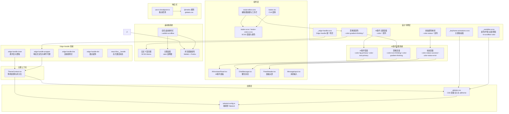

**图表来源**
- [_variables.scss:179-200](file://frontend/src/styles/_variables.scss#L179-L200)
- [globals.css:90-214](file://frontend/src/app/globals.css#L90-L214)
- [tailwind.config.ts:1-64](file://frontend/tailwind.config.ts#L1-L64)
- [AIAssistantPanel.tsx:1-600](file://frontend/src/components/ai-assistant/AIAssistantPanel.tsx#L1-L600)
- [ChatMessage.tsx:137-149](file://frontend/src/components/ai-assistant/ChatMessage.tsx#L137-L149)
- [PanelHeader.tsx:98-132](file://frontend/src/components/ai-assistant/PanelHeader.tsx#L98-L132)
- [MessageInput.tsx:1-182](file://frontend/src/components/ai-assistant/MessageInput.tsx#L1-L182)
- [ThemeContext.tsx:1-74](file://frontend/src/context/ThemeContext.tsx#L1-L74)
- [use-is-breakpoint.ts:1-38](file://frontend/src/hooks/use-is-breakpoint.ts#L1-L38)
- [simple-editor.scss:35-51](file://frontend/src/components/tiptap-templates/simple/simple-editor.scss#L35-L51)
- [_edge-handle.scss:1-118](file://frontend/src/components/canvas/_edge-handle.scss#L1-L118)

## 详细组件分析

### CSS-in-JS 与 Tailwind 混合策略
- 设计令牌注入：全局 CSS 将 CSS 变量注入根节点，并通过 @theme 将变量映射为 Tailwind 主题令牌。
- 组件样式：基础组件使用 CVA 定义变体与尺寸，再结合 Tailwind 原子类与 SCSS 变量，形成"类变体 + 设计令牌"的混合策略。
- 工具函数：使用 clsx 与 tailwind-merge 合并类名，避免冲突并保持原子类的简洁性。

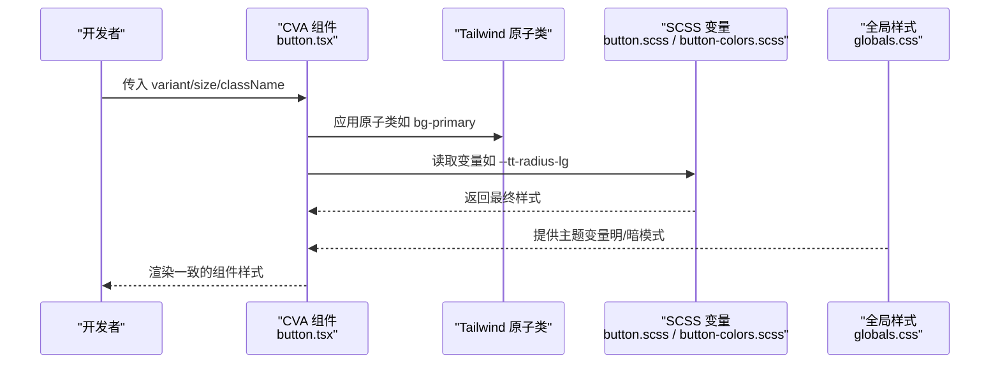

**图表来源**
- [button.tsx:1-57](file://frontend/src/components/ui/button.tsx#L1-L57)
- [button.tsx（Tiptap UI）:1-104](file://frontend/src/components/tiptap-ui-primitive/button/button.tsx#L1-L104)
- [button.scss:1-315](file://frontend/src/components/tiptap-ui-primitive/button/button.scss#L1-L315)
- [button-colors.scss:1-430](file://frontend/src/components/tiptap-ui-primitive/button/button-colors.scss#L1-L430)
- [globals.css:1-407](file://frontend/src/app/globals.css#L1-L407)

**章节来源**
- [button.tsx:1-57](file://frontend/src/components/ui/button.tsx#L1-L57)
- [button.tsx（Tiptap UI）:1-104](file://frontend/src/components/tiptap-ui-primitive/button/button.tsx#L1-L104)
- [button.scss:1-315](file://frontend/src/components/tiptap-ui-primitive/button/button.scss#L1-L315)
- [button-colors.scss:1-430](file://frontend/src/components/tiptap-ui-primitive/button/button-colors.scss#L1-L430)
- [utils.ts:1-7](file://frontend/src/lib/utils.ts#L1-L7)

### SCSS 变量系统（颜色、字体、间距）
- 颜色体系：定义灰阶、品牌色、状态色与文本高亮色，分别提供明/暗两套值；支持对比度与强调色。
- 字体与间距：通过 CSS 变量统一管理字号、行高、字重与间距，便于跨组件复用。
- 半径与过渡：统一圆角与过渡时长/缓动曲线，保证交互一致性。
- 阴影：提供层级化阴影变量，适配明/暗模式差异。
- **滚动条颜色**：通过设计令牌 `--tt-scrollbar-color` 提供统一的滚动条颜色变量，支持主题切换。
- **Edge Handle 颜色**：统一使用蓝色调(#1890FF)作为edge handle的基础颜色，确保视觉一致性。
- **AI助手主题变量**：新增完整的--color-*系列CSS变量，包括背景主色、文本主色、面板背景色等。

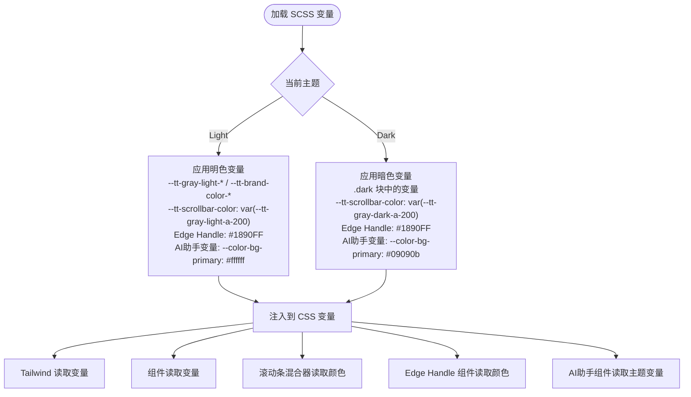

**图表来源**
- [_variables.scss:179-200](file://frontend/src/styles/_variables.scss#L179-L200)
- [globals.css:90-214](file://frontend/src/app/globals.css#L90-L214)
- [tailwind.config.ts:1-64](file://frontend/tailwind.config.ts#L1-L64)
- [_variables.scss:179-200](file://frontend/src/styles/_variables.scss#L179-L200)
- [_edge-handle.scss:53-75](file://frontend/src/components/canvas/_edge-handle.scss#L53-L75)

**章节来源**
- [_variables.scss:179-200](file://frontend/src/styles/_variables.scss#L179-L200)
- [globals.css:90-214](file://frontend/src/app/globals.css#L90-L214)

### 动画系统（关键帧与工具类）
- 关键帧定义：涵盖淡入淡出、缩放、滑动、旋转、脉冲、打字机光标等，满足不同交互场景。
- 工具类：将关键帧封装为可复用的动画类，简化组件使用。
- 组件应用：在 AI 助手、输入提示、加载指示等组件中按需启用相应动画。

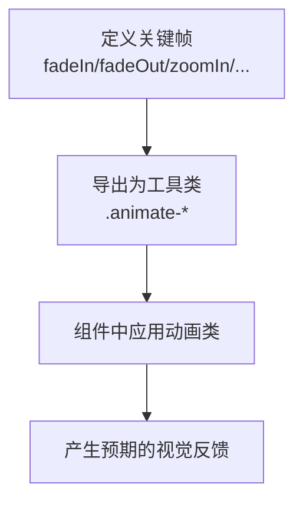

**图表来源**
- [_keyframe-animations.scss:1-176](file://frontend/src/styles/_keyframe-animations.scss#L1-L176)
- [globals.css:1-407](file://frontend/src/app/globals.css#L1-L407)

**章节来源**
- [_keyframe-animations.scss:1-176](file://frontend/src/styles/_keyframe-animations.scss#L1-L176)
- [globals.css:1-407](file://frontend/src/app/globals.css#L1-L407)

### 响应式设计与断点策略
- 断点检测：通过自定义 Hook useIsBreakpoint 基于媒体查询监听断点变化，返回布尔值用于条件渲染。
- 媒体查询：在全局样式中针对移动端进行字体与排版优化，减少动画偏好场景下的过度动画。
- 编辑器适配：脚本编辑器在视图/编辑模式下对工具栏、内容区与占位符进行差异化布局与交互。

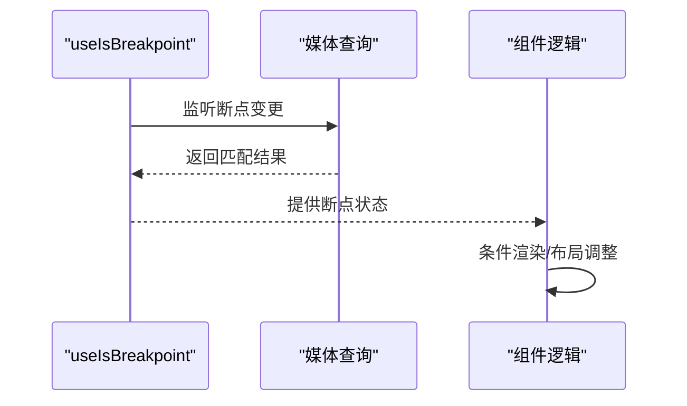

**图表来源**
- [use-is-breakpoint.ts:1-38](file://frontend/src/hooks/use-is-breakpoint.ts#L1-L38)
- [globals.css:375-397](file://frontend/src/app/globals.css#L375-L397)
- [script-editor.scss:129-152](file://frontend/src/components/canvas/script-editor.scss#L129-L152)

**章节来源**
- [use-is-breakpoint.ts:1-38](file://frontend/src/hooks/use-is-breakpoint.ts#L1-L38)
- [globals.css:375-397](file://frontend/src/app/globals.css#L375-L397)
- [script-editor.scss:129-152](file://frontend/src/components/canvas/script-editor.scss#L129-L152)

### 主题定制指南
- 切换机制：通过主题上下文在明/暗之间切换，自动写入 DOM 类并持久化到本地存储。
- Ant Design 集成：根据当前主题选择算法与主色、背景色、文字色等 Token，确保第三方组件风格一致。
- 自定义变量：可在全局样式中新增或覆盖 CSS 变量，以实现品牌色或业务色的定制。
- **滚动条定制**：通过修改设计令牌 `--tt-scrollbar-color` 或滚动条混合器中的颜色值来定制滚动条外观。
- **Edge Handle 定制**：可通过修改_SCSS变量或直接编辑样式文件来自定义edge handle的颜色、尺寸和动画效果。
- **AI助手主题定制**：通过修改--color-*系列变量来自定义AI助手界面的主题色彩，包括状态颜色、面板样式等。

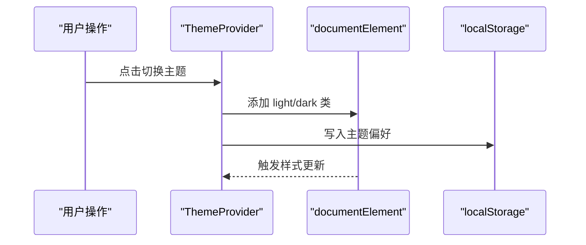

**图表来源**
- [ThemeContext.tsx:16-64](file://frontend/src/context/ThemeContext.tsx#L16-L64)
- [globals.css:34-90](file://frontend/src/app/globals.css#L34-L90)

**章节来源**
- [ThemeContext.tsx:1-74](file://frontend/src/context/ThemeContext.tsx#L1-L74)
- [globals.css:34-90](file://frontend/src/app/globals.css#L34-L90)

### 组件样式组织方式
- 基础组件：使用 CVA 定义变体与尺寸，结合 Tailwind 原子类与 SCSS 变量，保证一致的视觉与交互。
- Tiptap UI 组件：通过数据属性（如 data-style、data-size）控制外观与尺寸，颜色与状态由 SCSS 变量驱动。
- 编辑器容器：脚本编辑器的工具栏、内容区与占位符在明/暗模式下分别应用不同的样式规则。
- **Edge Handle 组件**：通过统一的_SCSS模块管理画布节点的edge handle样式，支持多种节点类型的一致视觉体验。
- **AI助手组件**：通过CSS变量--color-*系列实现主题一致性，包括ChatMessage、PanelHeader、MessageInput等组件。

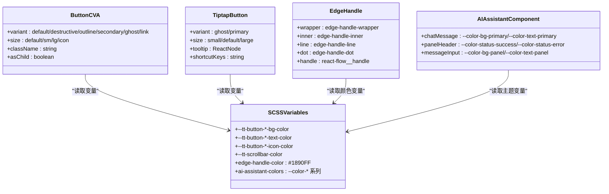

**图表来源**
- [button.tsx:1-57](file://frontend/src/components/ui/button.tsx#L1-L57)
- [button.tsx（Tiptap UI）:1-104](file://frontend/src/components/tiptap-ui-primitive/button/button.tsx#L1-L104)
- [button.scss:1-315](file://frontend/src/components/tiptap-ui-primitive/button/button.scss#L1-L315)
- [button-colors.scss:1-430](file://frontend/src/components/tiptap-ui-primitive/button/button-colors.scss#L1-L430)
- [_edge-handle.scss:1-118](file://frontend/src/components/canvas/_edge-handle.scss#L1-L118)
- [AIAssistantPanel.tsx:1-600](file://frontend/src/components/ai-assistant/AIAssistantPanel.tsx#L1-L600)

**章节来源**
- [button.tsx:1-57](file://frontend/src/components/ui/button.tsx#L1-L57)
- [button.tsx（Tiptap UI）:1-104](file://frontend/src/components/tiptap-ui-primitive/button/button.tsx#L1-L104)
- [button.scss:1-315](file://frontend/src/components/tiptap-ui-primitive/button/button.scss#L1-L315)
- [button-colors.scss:1-430](file://frontend/src/components/tiptap-ui-primitive/button/button-colors.scss#L1-L430)

### 自定义滚动条系统
**更新** 新增完整的自定义滚动条样式系统，提供统一的主题适配和视觉一致性。

- **滚动条混合器**：通过SCSS混合器定义统一的滚动条样式，支持light和dark主题变体。包含Webkit内核的 `::-webkit-scrollbar` 规则和Firefox的 `scrollbar-width/scrollbar-color` 属性。
- **全局滚动条样式**：使用CSS变量实现主题感知的滚动条外观，确保全局一致性。支持渐变色、圆角和悬停效果。
- **编辑器适配**：为脚本编辑器和Tiptap编辑器提供专门的滚动条样式，优化用户体验。包含悬浮显示、细滚动条和主题适配功能。
- **浏览器兼容性**：同时支持Webkit内核浏览器（Chrome、Safari、Edge）和Firefox的滚动条样式。Webkit使用 `::-webkit-scrollbar` 规则，Firefox使用标准的 `scrollbar-width` 和 `scrollbar-color` 属性。
- **设计令牌集成**：滚动条颜色通过 `--tt-scrollbar-color` 设计令牌控制，支持主题切换时的动态更新。

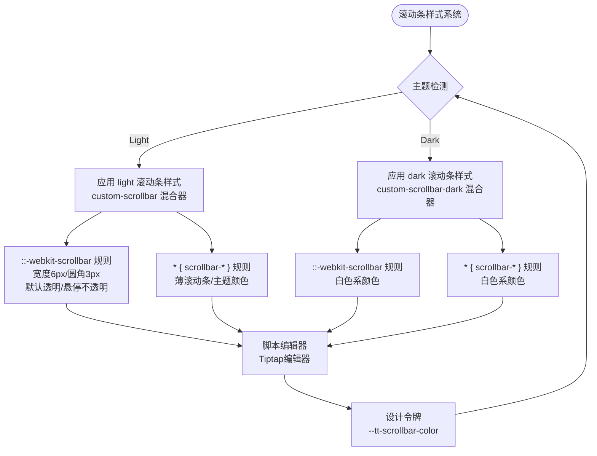

**图表来源**
- [script-editor.scss:87-128](file://frontend/src/components/canvas/script-editor.scss#L87-L128)
- [globals.css:181-206](file://frontend/src/app/globals.css#L181-L206)
- [simple-editor.scss:35-51](file://frontend/src/components/tiptap-templates/simple/simple-editor.scss#L35-L51)
- [_variables.scss:179-200](file://frontend/src/styles/_variables.scss#L179-L200)

**章节来源**
- [script-editor.scss:87-128](file://frontend/src/components/canvas/script-editor.scss#L87-L128)
- [globals.css:181-206](file://frontend/src/app/globals.css#L181-L206)
- [simple-editor.scss:35-51](file://frontend/src/components/tiptap-templates/simple/simple-editor.scss#L35-L51)
- [toolbar.scss:45-50](file://frontend/src/components/tiptap-ui-primitive/toolbar/toolbar.scss#L45-L50)
- [_variables.scss:179-200](file://frontend/src/styles/_variables.scss#L179-L200)

### Edge Handle 统一管理系统
**更新** 新增完整的Edge Handle统一管理系统，实现画布节点edge handle的统一样式管理。

- **响应式定位系统**：使用百分比区间而非固定50%实现精确的边缘定位，避免节点高度不确定时的top: 50%计算错误。左边缘使用left: -12px，右边缘使用right: -12px，确保在不同节点尺寸下的一致位置。
- **悬浮显示机制**：通过:hover伪类实现悬浮显示，支持多种节点类型的包装器类名（.script-node-wrapper、.video-node-wrapper、.character-node-wrapper、.storyboard-node-wrapper）。当鼠标悬停在任何相关包装器或edge-handle-wrapper上时，内部装饰元素(.edge-handle-inner)会显示。
- **事件代理机制**：隐藏原生React Flow handle，将其背景、边框等样式设置为透明，然后将事件代理给外部包装器。通过z-index层级控制确保事件正确传递，同时保持视觉上的统一。
- **高亮激活状态**：当连接处于激活状态时，使用.react-flow__handle-connecting类名实现高亮显示，包括蓝色背景(#1890FF)、白色边框和100%不透明度，提供清晰的视觉反馈。
- **装饰元素设计**：内部装饰元素包含连接线(.edge-handle-line)和圆点(.edge-handle-dot)，使用统一的蓝色调(#1890FF)和阴影效果(#1890FF 0 0 4px rgba(24, 144, 255, 0.25))，确保在不同背景下都有良好的对比度。

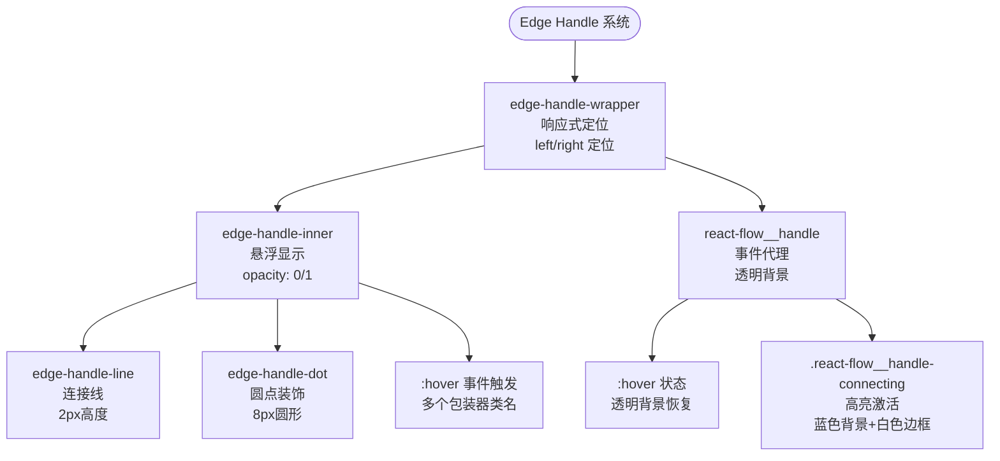

**图表来源**
- [_edge-handle.scss:7-15](file://frontend/src/components/canvas/_edge-handle.scss#L7-L15)
- [_edge-handle.scss:19-32](file://frontend/src/components/canvas/_edge-handle.scss#L19-L32)
- [_edge-handle.scss:35-44](file://frontend/src/components/canvas/_edge-handle.scss#L35-L44)
- [_edge-handle.scss:53-75](file://frontend/src/components/canvas/_edge-handle.scss#L53-L75)
- [_edge-handle.scss:78-84](file://frontend/src/components/canvas/_edge-handle.scss#L78-L84)
- [_edge-handle.scss:87-117](file://frontend/src/components/canvas/_edge-handle.scss#L87-L117)

**章节来源**
- [_edge-handle.scss:1-118](file://frontend/src/components/canvas/_edge-handle.scss#L1-L118)

### AI助手主题系统
**更新** 新增完整的AI助手主题系统，提供统一的CSS自定义属性和状态颜色映射。

- **统一CSS变量系统**：新增完整的--color-*系列CSS变量，包括背景主色(--color-bg-primary)、文本主色(--color-text-primary)、面板背景色(--color-bg-panel)、面板悬停色(--color-bg-panel-hover)等。
- **状态颜色映射**：提供完整的状态色彩体系，包括成功(--color-status-success-*)、错误(--color-status-error-*)、执行中(--color-status-executing-*)、处理中(--color-status-processing-*)、警告(--color-status-warning-*)、等待(--color-status-pending-*)等状态的背景、边框、文本、图标颜色。
- **思维渐变色系统**：提供思考过程的视觉反馈，包括渐变起始色(--color-gradient-thinking-start)、中间色(--color-gradient-thinking-mid)、结束色(--color-gradient-thinking-end)、边框色(--color-gradient-thinking-border)以及图标颜色(--color-icon-thinking、--color-icon-thinking-pulse)。
- **明暗模式适配**：完整的明暗模式切换机制，确保AI助手界面在不同主题下的视觉一致性。明暗模式下提供不同的颜色值，保证对比度和可读性。
- **组件主题集成**：AI助手组件通过CSS变量实现主题一致性，包括ChatMessage、PanelHeader、MessageInput等组件的背景、边框、文本颜色等。

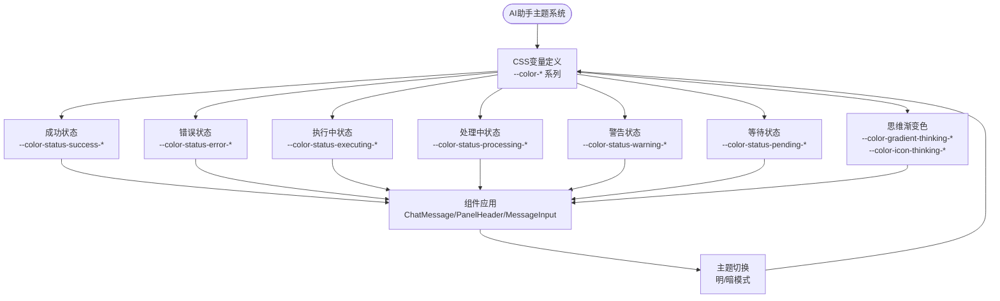

**图表来源**
- [globals.css:90-214](file://frontend/src/app/globals.css#L90-L214)
- [AIAssistantPanel.tsx:1-600](file://frontend/src/components/ai-assistant/AIAssistantPanel.tsx#L1-L600)
- [ChatMessage.tsx:137-149](file://frontend/src/components/ai-assistant/ChatMessage.tsx#L137-L149)
- [PanelHeader.tsx:98-132](file://frontend/src/components/ai-assistant/PanelHeader.tsx#L98-L132)
- [MessageInput.tsx:1-182](file://frontend/src/components/ai-assistant/MessageInput.tsx#L1-L182)

**章节来源**
- [globals.css:90-214](file://frontend/src/app/globals.css#L90-L214)
- [AIAssistantPanel.tsx:1-600](file://frontend/src/components/ai-assistant/AIAssistantPanel.tsx#L1-L600)
- [ChatMessage.tsx:137-149](file://frontend/src/components/ai-assistant/ChatMessage.tsx#L137-L149)
- [PanelHeader.tsx:98-132](file://frontend/src/components/ai-assistant/PanelHeader.tsx#L98-L132)
- [MessageInput.tsx:1-182](file://frontend/src/components/ai-assistant/MessageInput.tsx#L1-L182)

### 画布节点集成分析
**更新** Edge Handle系统已集成到所有画布节点组件中，提供统一的连接体验。

- **节点类型支持**：Edge Handle系统已集成到CharacterNode、ScriptNode、VideoNode、StoryboardNode等所有画布节点中，确保不同节点类型的连接手柄具有一致的视觉和交互体验。
- **React Flow 集成**：每个节点都包含两个Handle组件（target和source），分别位于左侧和右侧边缘，支持双向连接。Handle组件使用Position枚举指定连接位置，确保与其他节点的正确对齐。
- **包装器结构**：每个edge handle都包含一个edge-handle-wrapper包装器，内部包含Handle组件和edge-handle-inner装饰元素。包装器使用group/handle类名，便于事件管理和样式控制。
- **节点特定样式**：不同节点类型可能有特定的z-index和定位调整，如右侧边缘使用z-index: 50确保正确的层级关系。

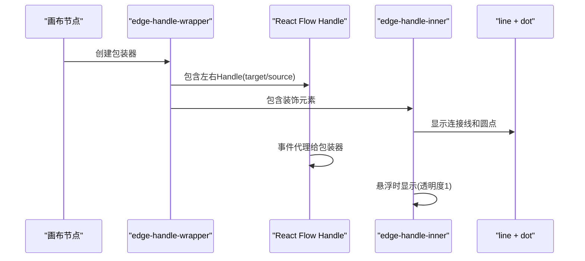

**图表来源**
- [CharacterNode.tsx:511-529](file://frontend/src/components/canvas/CharacterNode.tsx#L511-L529)
- [ScriptNode.tsx:235-253](file://frontend/src/components/canvas/ScriptNode.tsx#L235-L253)
- [VideoNode.tsx:415-433](file://frontend/src/components/canvas/VideoNode.tsx#L415-L433)
- [StoryboardNode.tsx:188-206](file://frontend/src/components/canvas/StoryboardNode.tsx#L188-L206)
- [_edge-handle.scss:7-15](file://frontend/src/components/canvas/_edge-handle.scss#L7-L15)

**章节来源**
- [CharacterNode.tsx:511-529](file://frontend/src/components/canvas/CharacterNode.tsx#L511-L529)
- [ScriptNode.tsx:235-253](file://frontend/src/components/canvas/ScriptNode.tsx#L235-L253)
- [VideoNode.tsx:415-433](file://frontend/src/components/canvas/VideoNode.tsx#L415-L433)
- [StoryboardNode.tsx:188-206](file://frontend/src/components/canvas/StoryboardNode.tsx#L188-L206)

## 依赖关系分析
- 核心依赖
  - Tailwind CSS：提供原子类与主题系统。
  - class-variance-authority：构建组件变体与尺寸。
  - tailwind-merge：合并类名，避免冲突。
  - Ant Design：提供 UI 组件与主题算法。
- 构建链路
  - PostCSS 负责处理 Tailwind 与 SCSS 的导入与编译。
  - Next.js 在运行时注入全局样式与主题变量。
- **滚动条系统依赖**
  - SCSS混合器：提供可复用的滚动条样式定义，包含light和dark两种变体。
  - CSS变量：支持主题感知的颜色和尺寸，通过设计令牌 `--tt-scrollbar-color` 控制。
  - 浏览器前缀：确保Webkit和Firefox的兼容性，使用标准属性和厂商前缀。
  - 主题上下文：通过DOM类名切换实现主题状态，影响滚动条样式应用。
- **Edge Handle 系统依赖**
  - SCSS模块：提供统一的edge handle样式定义，包含定位、装饰和事件处理逻辑。
  - React Flow：依赖Handle组件实现节点间的连接功能。
  - CSS变量：使用统一的颜色变量(#1890FF)确保视觉一致性。
  - 主题上下文：通过:hover和.active状态实现主题感知的视觉反馈。
- **AI助手主题系统依赖**
  - CSS变量：提供完整的--color-*系列变量，支持AI助手界面的主题控制。
  - 组件集成：AI助手组件通过CSS变量实现主题一致性。
  - 明暗模式：完整的明暗模式切换机制，确保主题变量在不同模式下的正确应用。

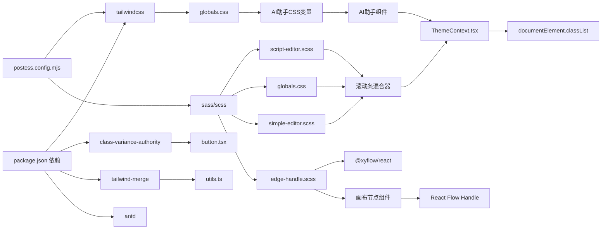

**图表来源**
- [package.json:13-67](file://frontend/package.json#L13-L67)
- [postcss.config.mjs:1-8](file://frontend/postcss.config.mjs#L1-L8)
- [globals.css:90-214](file://frontend/src/app/globals.css#L90-L214)
- [script-editor.scss:87-128](file://frontend/src/components/canvas/script-editor.scss#L87-L128)
- [button.tsx:1-57](file://frontend/src/components/ui/button.tsx#L1-L57)
- [utils.ts:1-7](file://frontend/src/lib/utils.ts#L1-L7)
- [ThemeContext.tsx:1-74](file://frontend/src/context/ThemeContext.tsx#L1-L74)
- [_edge-handle.scss:1-118](file://frontend/src/components/canvas/_edge-handle.scss#L1-L118)

**章节来源**
- [package.json:13-67](file://frontend/package.json#L13-L67)
- [postcss.config.mjs:1-8](file://frontend/postcss.config.mjs#L1-L8)
- [globals.css:90-214](file://frontend/src/app/globals.css#L90-L214)
- [script-editor.scss:87-128](file://frontend/src/components/canvas/script-editor.scss#L87-L128)
- [button.tsx:1-57](file://frontend/src/components/ui/button.tsx#L1-L57)
- [utils.ts:1-7](file://frontend/src/lib/utils.ts#L1-L7)
- [ThemeContext.tsx:1-74](file://frontend/src/context/ThemeContext.tsx#L1-L74)

## 性能考量
- 样式体积控制
  - 仅导入必要的 Tailwind 内容路径，避免无用类进入产物。
  - 合理拆分 SCSS 文件，按需引入，减少全局变量污染。
  - **Edge Handle 优化**：通过统一的_SCSS模块减少重复样式定义，避免在多个节点组件中重复编写相同的样式代码。
  - **AI助手主题优化**：通过CSS变量实现主题控制，避免在组件中硬编码颜色值，减少样式重复。
- 运行时性能
  - 使用 clsx 与 tailwind-merge 合并类名，降低样式冲突与重绘成本。
  - 在组件中优先使用原子类，减少内联样式的使用。
  - **事件代理优化**：通过隐藏原生React Flow handle并将事件代理给包装器，减少不必要的DOM操作和事件监听器数量。
  - **主题变量优化**：CSS变量的使用避免了JavaScript动态计算，提升渲染性能。
- 动画与过渡
  - 对于高频动画，尽量使用 transform 与 opacity，避免触发布局与重绘。
  - 减少动画时长与复杂度，必要时为"减少动态"用户提供降级选项。
  - **Edge Handle 动画**：使用0.2秒的过渡时间平衡响应速度和视觉效果，避免过长的动画延迟。
  - **AI助手动画**：状态颜色的切换使用CSS变量，避免JavaScript动画开销。
- 响应式与断点
  - 使用媒体查询与断点 Hook 结合，避免在小屏设备上执行昂贵的布局计算。
  - 在移动端优化字体大小与行高，减少文本渲染压力。
- **滚动条性能优化**
  - 使用CSS变量而非JavaScript动态计算，提高渲染性能。
  - 滚动条样式使用简单的颜色和尺寸，避免复杂的渐变和阴影。
  - 通过混合器复用样式，减少重复的CSS规则。
  - Webkit滚动条使用硬件加速的transform属性，提升滚动流畅度。
  - Firefox滚动条使用标准属性，避免JavaScript监听滚动事件的开销。
- **Edge Handle 性能优化**
  - 使用CSS定位而非JavaScript计算，确保edge handle的精确定位。
  - 通过:hover伪类实现条件显示，避免JavaScript状态管理的开销。
  - 事件代理机制减少DOM事件监听器的数量，提升交互性能。
- **AI助手性能优化**
  - CSS变量的使用避免了JavaScript状态管理的开销。
  - 状态颜色的切换使用CSS过渡，避免复杂的JavaScript动画。
  - 主题变量的缓存机制确保重复使用时的性能。

## 故障排查指南
- 主题切换无效
  - 检查主题上下文是否正确包裹应用根节点。
  - 确认 DOM 上存在 light/dark 类，且与期望一致。
  - 查看本地存储中是否存在主题偏好键值。
- Tailwind 类未生效
  - 确认 Tailwind 内容扫描路径包含对应组件目录。
  - 检查是否正确导入全局样式与变量。
- 动画异常
  - 检查关键帧是否被正确导入与命名。
  - 确认组件中使用的动画类名称与定义一致。
- 响应式问题
  - 使用断点 Hook 验证断点判断逻辑。
  - 检查媒体查询断点与组件样式是否匹配。
- **滚动条问题**
  - 检查浏览器是否支持自定义滚动条样式。
  - 确认CSS变量是否正确注入到根元素。
  - 验证滚动条混合器是否正确应用到目标元素。
  - 检查主题切换时滚动条样式是否同步更新。
  - 确认Webkit和Firefox的滚动条规则都已正确应用。
  - 检查设计令牌 `--tt-scrollbar-color` 是否在对应主题下正确设置。
  - 验证 `.dark` 选择器是否正确触发暗色滚动条样式。
- **Edge Handle 问题**
  - 检查_SCSS文件是否正确导入到全局样式中。
  - 确认节点组件中是否正确包含edge handle包装器结构。
  - 验证:hover事件是否正确触发，检查CSS选择器的正确性。
  - 检查React Flow handle的事件代理是否正常工作。
  - 确认.z-index层级设置是否正确，避免遮挡或不可点击的问题。
  - 验证颜色变量(#1890FF)是否在所有主题下正确显示。
- **AI助手主题问题**
  - 检查CSS变量--color-*系列是否正确注入到根元素。
  - 确认AI助手组件是否正确使用CSS变量进行主题控制。
  - 验证明暗模式切换时主题变量是否正确更新。
  - 检查状态颜色映射是否在对应状态下正确显示。
  - 确认思维渐变色是否在思考状态下正确应用。

**章节来源**
- [ThemeContext.tsx:16-64](file://frontend/src/context/ThemeContext.tsx#L16-L64)
- [tailwind.config.ts:5-9](file://frontend/tailwind.config.ts#L5-L9)
- [globals.css:90-214](file://frontend/src/app/globals.css#L90-L214)
- [script-editor.scss:87-128](file://frontend/src/components/canvas/script-editor.scss#L87-L128)
- [use-is-breakpoint.ts:19-34](file://frontend/src/hooks/use-is-breakpoint.ts#L19-L34)
- [_variables.scss:179-200](file://frontend/src/styles/_variables.scss#L179-L200)
- [_edge-handle.scss:1-118](file://frontend/src/components/canvas/_edge-handle.scss#L1-L118)

## 结论
Infinite Game 的样式系统通过"设计令牌 + Tailwind + SCSS + CVA + 自定义滚动条系统 + Edge Handle统一管理 + AI助手主题系统"的混合策略，实现了主题一致性、组件可扩展性、开发效率与用户体验的平衡。借助明/暗主题上下文、关键帧动画、响应式断点机制、全新的自定义滚动条系统、统一的edge handle管理以及完整的AI助手主题系统，系统在视觉体验与性能表现上均具备良好的可维护性与可扩展性。

**更新** 新的AI助手主题系统显著提升了AI助手界面的主题一致性与视觉体验。通过统一的CSS自定义属性系统、状态颜色映射和面板样式变量，系统为AI助手面板提供了完整的主题控制能力。该系统支持成功、错误、执行中、处理中、警告、等待等状态的完整色彩体系，以及思维状态渐变色系统，确保不同状态下的视觉反馈一致且具有良好的可读性。建议在后续迭代中持续优化AI助手主题的色彩方案，完善状态颜色的对比度测试，并探索更多主题定制的可能性。

## 附录
- TypeScript 路径别名：通过 tsconfig.json 的路径映射简化导入路径，提升开发体验。
- 浏览器兼容性：Tailwind 与 PostCSS 生态已覆盖主流现代浏览器；如需支持旧版 IE，需额外引入 polyfill 与降级策略。
- **滚动条兼容性**：系统同时支持Webkit内核浏览器（Chrome、Safari、Edge）和Firefox的滚动条样式，确保跨浏览器的一致体验。Webkit使用 `::-webkit-scrollbar` 规则，Firefox使用标准的 `scrollbar-width` 和 `scrollbar-color` 属性。
- **Edge Handle 兼容性**：通过事件代理机制确保在不同浏览器中的一致行为，React Flow handle的隐藏和代理确保了跨平台的兼容性。
- **AI助手主题兼容性**：通过CSS变量实现主题控制，支持所有现代浏览器的CSS变量特性。明暗模式切换机制确保在不同浏览器中的主题一致性。

**章节来源**
- [tsconfig.json:21-23](file://frontend/tsconfig.json#L21-L23)
- [script-editor.scss:87-128](file://frontend/src/components/canvas/script-editor.scss#L87-L128)
- [globals.css:90-214](file://frontend/src/app/globals.css#L90-L214)
- [ThemeContext.tsx:1-74](file://frontend/src/context/ThemeContext.tsx#L1-L74)
- [_edge-handle.scss:1-118](file://frontend/src/components/canvas/_edge-handle.scss#L1-L118)