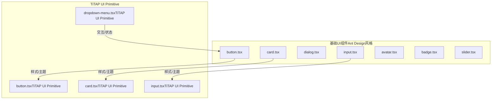
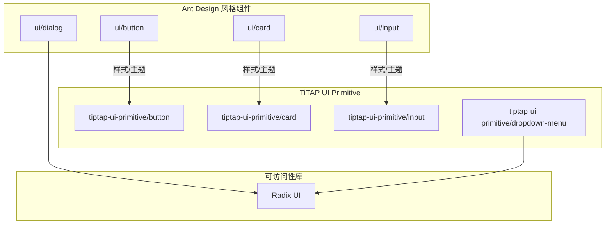
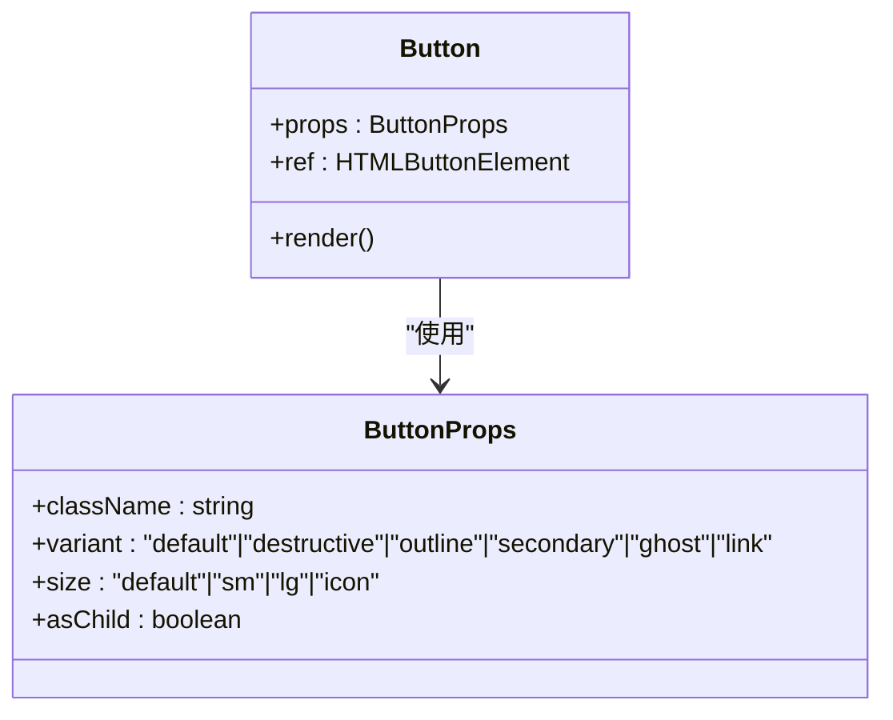
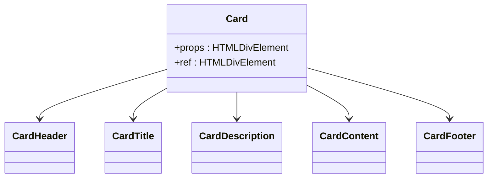
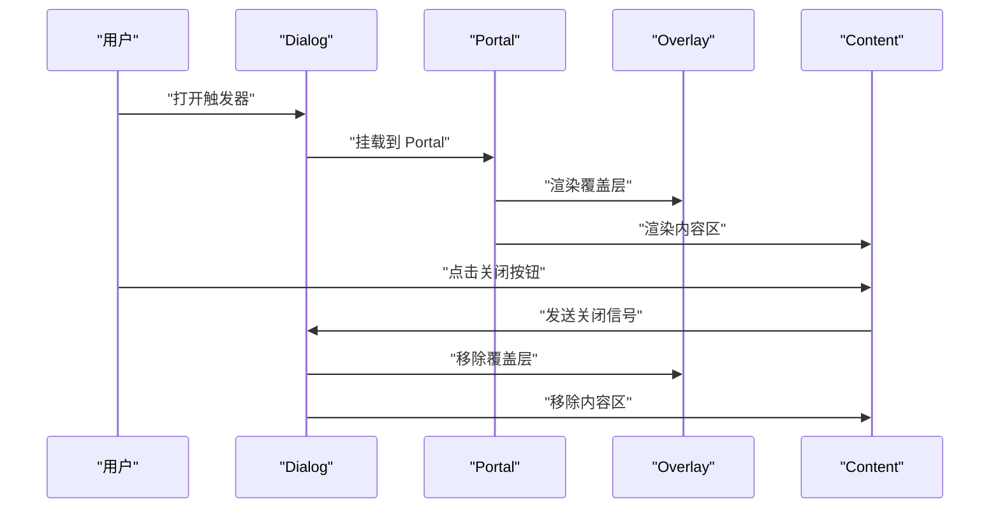
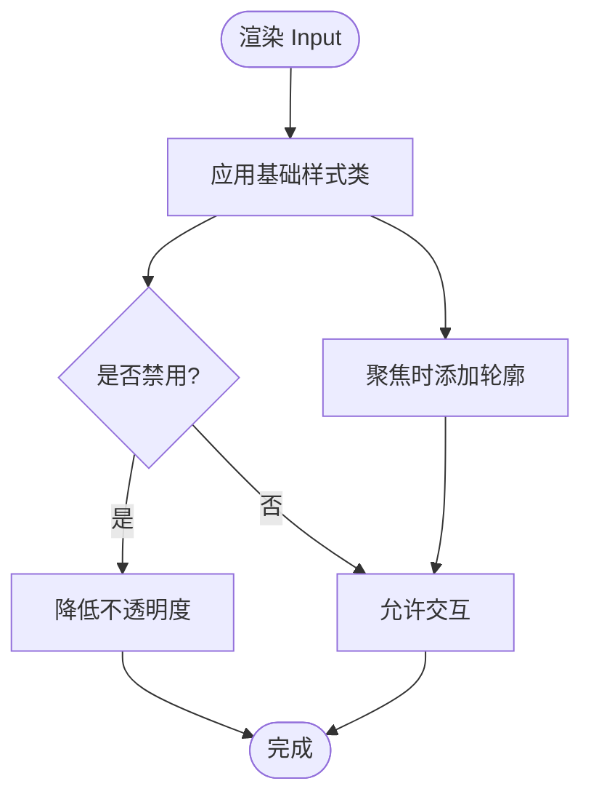
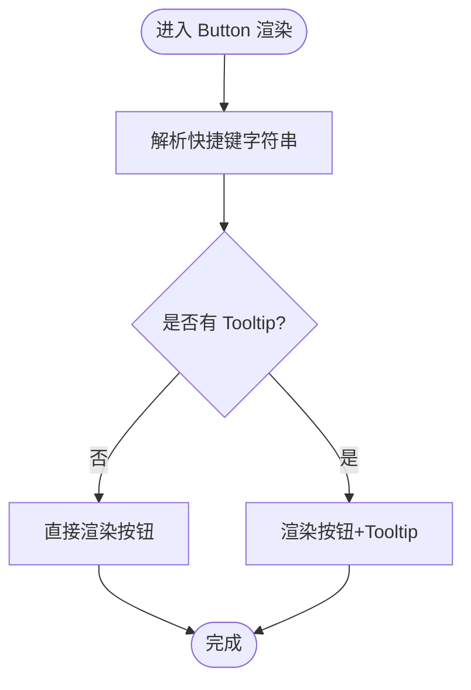
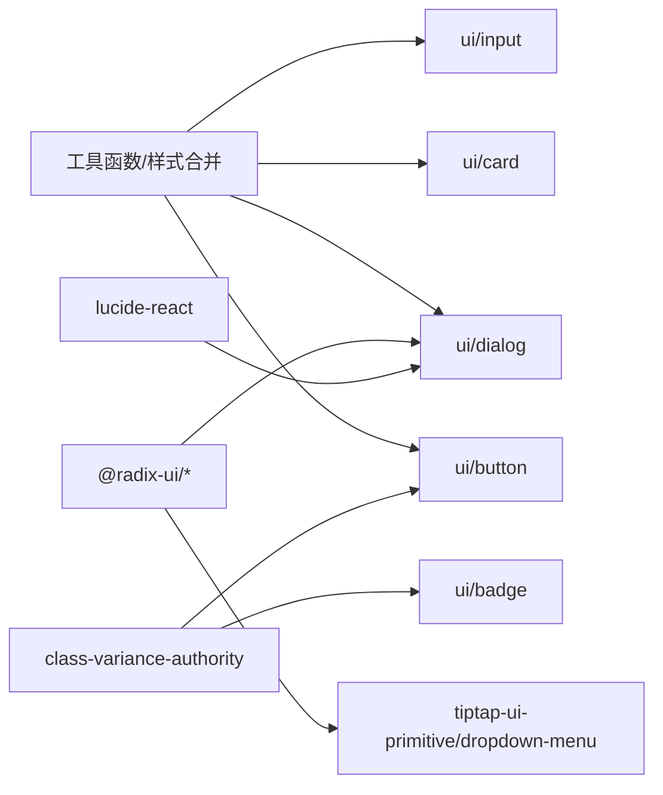

# 基础UI组件

<cite>
**本文引用的文件**
- [button.tsx](file://frontend/src/components/ui/button.tsx)
- [card.tsx](file://frontend/src/components/ui/card.tsx)
- [dialog.tsx](file://frontend/src/components/ui/dialog.tsx)
- [input.tsx](file://frontend/src/components/ui/input.tsx)
- [button.tsx（TiTAP UI Primitive）](file://frontend/src/components/tiptap-ui-primitive/button/button.tsx)
- [card.tsx（TiTAP UI Primitive）](file://frontend/src/components/tiptap-ui-primitive/card/card.tsx)
- [input.tsx（TiTAP UI Primitive）](file://frontend/src/components/tiptap-ui-primitive/input/input.tsx)
- [dropdown-menu.tsx（TiTAP UI Primitive）](file://frontend/src/components/tiptap-ui-primitive/dropdown-menu/dropdown-menu.tsx)
- [avatar.tsx](file://frontend/src/components/ui/avatar.tsx)
- [badge.tsx](file://frontend/src/components/ui/badge.tsx)
- [slider.tsx](file://frontend/src/components/ui/slider.tsx)
</cite>

## 目录
1. [简介](#简介)
2. [项目结构](#项目结构)
3. [核心组件](#核心组件)
4. [架构总览](#架构总览)
5. [详细组件分析](#详细组件分析)
6. [依赖关系分析](#依赖关系分析)
7. [性能考量](#性能考量)
8. [故障排查指南](#故障排查指南)
9. [结论](#结论)
10. [附录](#附录)

## 简介
本文件系统化梳理 Infinite Game 前端基础 UI 组件，重点覆盖按钮、卡片、对话框、输入框等核心组件的设计规范与使用方法，并补充 TiTAP UI Primitive 的同名组件以呈现统一的编辑器工具栏风格。文档从架构、数据流、处理逻辑、集成点、错误处理与性能特性等方面进行深入解析，同时给出主题配置、样式覆盖、无障碍与浏览器兼容建议，以及组件组合的最佳实践与常见问题解决方案。

## 项目结构
前端基础 UI 组件主要位于以下路径：
- 基础 Ant Design 风格组件：frontend/src/components/ui
- 编辑器工具栏风格组件（TiTAP UI Primitive）：frontend/src/components/tiptap-ui-primitive

图表来源
- [button.tsx:1-57](file://frontend/src/components/ui/button.tsx#L1-L57)
- [card.tsx:1-80](file://frontend/src/components/ui/card.tsx#L1-L80)
- [dialog.tsx:1-121](file://frontend/src/components/ui/dialog.tsx#L1-L121)
- [input.tsx:1-23](file://frontend/src/components/ui/input.tsx#L1-L23)
- [button.tsx（TiTAP UI Primitive）:1-104](file://frontend/src/components/tiptap-ui-primitive/button/button.tsx#L1-L104)
- [card.tsx（TiTAP UI Primitive）:1-80](file://frontend/src/components/tiptap-ui-primitive/card/card.tsx#L1-L80)
- [input.tsx（TiTAP UI Primitive）:1-18](file://frontend/src/components/tiptap-ui-primitive/input/input.tsx#L1-L18)
- [dropdown-menu.tsx（TiTAP UI Primitive）:1-265](file://frontend/src/components/tiptap-ui-primitive/dropdown-menu/dropdown-menu.tsx#L1-L265)

章节来源
- [button.tsx:1-57](file://frontend/src/components/ui/button.tsx#L1-L57)
- [card.tsx:1-80](file://frontend/src/components/ui/card.tsx#L1-L80)
- [dialog.tsx:1-121](file://frontend/src/components/ui/dialog.tsx#L1-L121)
- [input.tsx:1-23](file://frontend/src/components/ui/input.tsx#L1-L23)
- [button.tsx（TiTAP UI Primitive）:1-104](file://frontend/src/components/tiptap-ui-primitive/button/button.tsx#L1-L104)
- [card.tsx（TiTAP UI Primitive）:1-80](file://frontend/src/components/tiptap-ui-primitive/card/card.tsx#L1-L80)
- [input.tsx（TiTAP UI Primitive）:1-18](file://frontend/src/components/tiptap-ui-primitive/input/input.tsx#L1-L18)
- [dropdown-menu.tsx（TiTAP UI Primitive）:1-265](file://frontend/src/components/tiptap-ui-primitive/dropdown-menu/dropdown-menu.tsx#L1-L265)

## 核心组件
本节对按钮、卡片、对话框、输入框等关键组件进行要点归纳，涵盖 Props 接口、事件处理、样式定制与可访问性。

- 按钮（Ant Design 风格）
  - 支持变体与尺寸的变体系统，具备聚焦可见轮廓、禁用态、SVG 内嵌图标等通用行为。
  - Props 关键项：className、variant、size、asChild、原生 button 属性。
  - 事件处理：透传 onClick 等原生事件；支持 asChild 将渲染委托给 Slot 以实现语义标签包裹。
  - 样式定制：通过变体与尺寸类名组合实现；可叠加自定义类名。
  - 参考路径：[button.tsx:36-54](file://frontend/src/components/ui/button.tsx#L36-L54)

- 卡片（Ant Design 风格）
  - 提供容器、头部、标题、描述、内容、底部等子组件，便于布局组合。
  - Props 关键项：HTMLDivElement 原生属性，均可透传。
  - 样式定制：通过 className 覆盖默认内边距、字体、阴影等。
  - 参考路径：[card.tsx:5-79](file://frontend/src/components/ui/card.tsx#L5-L79)

- 对话框（Ant Design 风格）
  - 基于 Radix UI 的可访问性对话框，内置覆盖层、内容区、标题、描述、页脚等。
  - Props 关键项：Overlay/Content/Title/Description/Portal/Trigger/Close 等。
  - 事件处理：支持关闭按钮、键盘交互（如 Escape）、焦点管理。
  - 样式定制：通过 className 覆盖动画、定位、背景、阴影等。
  - 参考路径：[dialog.tsx:15-107](file://frontend/src/components/ui/dialog.tsx#L15-L107)

- 输入框（Ant Design 风格）
  - 支持类型、禁用、占位符、聚焦轮廓等通用行为。
  - Props 关键项：HTMLInputElement 原生属性，可透传。
  - 样式定制：通过 className 覆盖边框、背景、圆角、字体大小等。
  - 参考路径：[input.tsx:5-20](file://frontend/src/components/ui/input.tsx#L5-L20)

- TiTAP UI Primitive 按钮
  - 支持变体（ghost、primary）、尺寸（small、default、large），并可选显示 Tooltip 与快捷键提示。
  - Props 关键项：className、children、tooltip、showTooltip、shortcutKeys、variant、size。
  - 事件处理：透传原生 button 事件；内部解析快捷键字符串并渲染 kbd 显示。
  - 样式定制：通过 data-style 与 data-size 属性配合 SCSS 实现。
  - 参考路径：[button.tsx（TiTAP UI Primitive）:18-99](file://frontend/src/components/tiptap-ui-primitive/button/button.tsx#L18-L99)

- TiTAP UI Primitive 卡片
  - 提供头部、主体、分组、标签、页脚等子组件，支持横向/纵向分组布局。
  - Props 关键项：HTMLDivElement 原生属性，CardItemGroup 支持 orientation。
  - 样式定制：通过 data-orientation 属性控制布局方向。
  - 参考路径：[card.tsx（TiTAP UI Primitive）:36-51](file://frontend/src/components/tiptap-ui-primitive/card/card.tsx#L36-L51)

- TiTAP UI Primitive 输入框
  - 数据槽标记 data-slot="tiptap-input"，便于样式隔离与主题覆盖。
  - Props 关键项：HTMLInputElement 原生属性。
  - 参考路径：[input.tsx（TiTAP UI Primitive）:6-15](file://frontend/src/components/tiptap-ui-primitive/input/input.tsx#L6-L15)

- 下拉菜单（TiTAP UI Primitive）
  - 包含 Root、Portal、Trigger、Content、Group、Label、Item、CheckboxItem、RadioGroup、RadioItem、Separator、Shortcut、Sub、SubTrigger、SubContent 等完整子组件。
  - Props 关键项：Content 支持 align、sideOffset；Item 支持 inset、variant；Checkbox/Radio Item 支持 checked。
  - 事件处理：自动阻止关闭时的焦点回退，保证可访问性。
  - 参考路径：[dropdown-menu.tsx（TiTAP UI Primitive）:9-264](file://frontend/src/components/tiptap-ui-primitive/dropdown-menu/dropdown-menu.tsx#L9-L264)

章节来源
- [button.tsx:36-54](file://frontend/src/components/ui/button.tsx#L36-L54)
- [card.tsx:5-79](file://frontend/src/components/ui/card.tsx#L5-L79)
- [dialog.tsx:15-107](file://frontend/src/components/ui/dialog.tsx#L15-L107)
- [input.tsx:5-20](file://frontend/src/components/ui/input.tsx#L5-L20)
- [button.tsx（TiTAP UI Primitive）:18-99](file://frontend/src/components/tiptap-ui-primitive/button/button.tsx#L18-L99)
- [card.tsx（TiTAP UI Primitive）:36-51](file://frontend/src/components/tiptap-ui-primitive/card/card.tsx#L36-L51)
- [input.tsx（TiTAP UI Primitive）:6-15](file://frontend/src/components/tiptap-ui-primitive/input/input.tsx#L6-L15)
- [dropdown-menu.tsx（TiTAP UI Primitive）:9-264](file://frontend/src/components/tiptap-ui-primitive/dropdown-menu/dropdown-menu.tsx#L9-L264)

## 架构总览
下图展示了基础 UI 组件与 TiTAP UI Primitive 的关系与职责边界，以及与 Radix UI 的协作方式。

图表来源
- [button.tsx:1-57](file://frontend/src/components/ui/button.tsx#L1-L57)
- [card.tsx:1-80](file://frontend/src/components/ui/card.tsx#L1-L80)
- [dialog.tsx:1-121](file://frontend/src/components/ui/dialog.tsx#L1-L121)
- [input.tsx:1-23](file://frontend/src/components/ui/input.tsx#L1-L23)
- [button.tsx（TiTAP UI Primitive）:1-104](file://frontend/src/components/tiptap-ui-primitive/button/button.tsx#L1-L104)
- [card.tsx（TiTAP UI Primitive）:1-80](file://frontend/src/components/tiptap-ui-primitive/card/card.tsx#L1-L80)
- [input.tsx（TiTAP UI Primitive）:1-18](file://frontend/src/components/tiptap-ui-primitive/input/input.tsx#L1-L18)
- [dropdown-menu.tsx（TiTAP UI Primitive）:1-265](file://frontend/src/components/tiptap-ui-primitive/dropdown-menu/dropdown-menu.tsx#L1-L265)

## 详细组件分析

### 按钮组件（Ant Design 风格）
- 设计要点
  - 使用变体系统定义外观（如 default、destructive、outline、secondary、ghost、link）。
  - 使用尺寸系统定义高宽与内边距（default、sm、lg、icon）。
  - 支持 asChild 将渲染委托给 Slot，便于语义化包裹（如链接按钮）。
- Props 接口
  - 继承原生 button 属性，新增 variant、size、asChild。
- 事件处理
  - 透传 onClick、onMouseDown 等原生事件；禁用态自动屏蔽交互。
- 样式定制
  - 通过 className 叠加自定义类名；变体与尺寸类名由变体系统生成。
- 无障碍与兼容性
  - 自动包含聚焦可见轮廓与键盘可用性；禁用态符合 WCAG 对比度要求。
- 使用示例（路径）
  - 基础按钮：[button.tsx:42-53](file://frontend/src/components/ui/button.tsx#L42-L53)
  - 图标按钮：[button.tsx:22-27](file://frontend/src/components/ui/button.tsx#L22-L27)
  - 链接风格按钮：[button.tsx:20-21](file://frontend/src/components/ui/button.tsx#L20-L21)

图表来源
- [button.tsx:36-54](file://frontend/src/components/ui/button.tsx#L36-L54)

章节来源
- [button.tsx:7-34](file://frontend/src/components/ui/button.tsx#L7-L34)
- [button.tsx:36-54](file://frontend/src/components/ui/button.tsx#L36-L54)

### 卡片组件（Ant Design 风格）
- 设计要点
  - 容器 Card + 头部 CardHeader + 标题 CardTitle + 描述 CardDescription + 内容 CardContent + 底部 CardFooter。
  - 默认提供内边距、字体、阴影与前景色。
- Props 接口
  - 所有子组件均继承原生 HTMLDivElement 属性。
- 样式定制
  - 通过 className 覆盖默认间距与排版。
- 使用示例（路径）
  - 卡片容器：[card.tsx:5-18](file://frontend/src/components/ui/card.tsx#L5-L18)
  - 标题与描述：[card.tsx:32-57](file://frontend/src/components/ui/card.tsx#L32-L57)

图表来源
- [card.tsx:5-79](file://frontend/src/components/ui/card.tsx#L5-L79)

章节来源
- [card.tsx:5-79](file://frontend/src/components/ui/card.tsx#L5-L79)

### 对话框组件（Ant Design 风格）
- 设计要点
  - 基于 Radix UI，提供 Overlay、Portal、Content、Header、Footer、Title、Description、Close。
  - 内置开合动画与居中定位，支持键盘关闭与焦点管理。
- Props 接口
  - Content/Overlay/Title/Description 支持 className 透传。
- 事件处理
  - Close 触发后自动隐藏覆盖层与内容区；支持键盘 Esc 关闭。
- 样式定制
  - 通过 className 覆盖动画、定位、背景、阴影与边框。
- 使用示例（路径）
  - 内容区与关闭按钮：[dialog.tsx:30-52](file://frontend/src/components/ui/dialog.tsx#L30-L52)
  - 标题与描述：[dialog.tsx:82-107](file://frontend/src/components/ui/dialog.tsx#L82-L107)

图表来源
- [dialog.tsx:7-52](file://frontend/src/components/ui/dialog.tsx#L7-L52)

章节来源
- [dialog.tsx:7-107](file://frontend/src/components/ui/dialog.tsx#L7-L107)

### 输入框组件（Ant Design 风格）
- 设计要点
  - 默认圆角、边框、背景与聚焦轮廓，支持禁用态与占位符。
- Props 接口
  - 继承原生 input 属性，新增 className。
- 样式定制
  - 通过 className 覆盖尺寸、字体、内边距与边框。
- 使用示例（路径）
  - 基础输入框：[input.tsx:5-20](file://frontend/src/components/ui/input.tsx#L5-L20)

图表来源
- [input.tsx:5-20](file://frontend/src/components/ui/input.tsx#L5-L20)

章节来源
- [input.tsx:5-20](file://frontend/src/components/ui/input.tsx#L5-L20)

### TiTAP UI Primitive 按钮
- 设计要点
  - 支持 ghost 与 primary 两种风格，small/default/large 三种尺寸。
  - 可选 Tooltip 与快捷键显示，快捷键字符串经解析后渲染为 kbd 元素序列。
- Props 接口
  - className、children、tooltip、showTooltip、shortcutKeys、variant、size。
- 事件处理
  - 透传原生 button 事件；当无 tooltip 或 showTooltip=false 时直接渲染按钮。
- 样式定制
  - 通过 data-style 与 data-size 属性配合 SCSS 控制外观与尺寸。
- 使用示例（路径）
  - 带 Tooltip 的按钮：[button.tsx（TiTAP UI Primitive）:80-97](file://frontend/src/components/tiptap-ui-primitive/button/button.tsx#L80-L97)
  - 快捷键显示：[button.tsx（TiTAP UI Primitive）:29-44](file://frontend/src/components/tiptap-ui-primitive/button/button.tsx#L29-L44)

图表来源
- [button.tsx（TiTAP UI Primitive）:60-97](file://frontend/src/components/tiptap-ui-primitive/button/button.tsx#L60-L97)

章节来源
- [button.tsx（TiTAP UI Primitive）:18-99](file://frontend/src/components/tiptap-ui-primitive/button/button.tsx#L18-L99)

### TiTAP UI Primitive 卡片
- 设计要点
  - 提供头部、主体、分组、标签、页脚等子组件，支持 orientation 控制横向/纵向分组。
- Props 接口
  - CardItemGroup 支持 orientation，默认 vertical。
- 样式定制
  - 通过 data-orientation 属性切换布局方向。
- 使用示例（路径）
  - 分组容器：[card.tsx（TiTAP UI Primitive）:36-51](file://frontend/src/components/tiptap-ui-primitive/card/card.tsx#L36-L51)

章节来源
- [card.tsx（TiTAP UI Primitive）:36-51](file://frontend/src/components/tiptap-ui-primitive/card/card.tsx#L36-L51)

### TiTAP UI Primitive 输入框
- 设计要点
  - 数据槽标记 data-slot="tiptap-input"，便于主题与样式隔离。
- Props 接口
  - 继承原生 input 属性。
- 使用示例（路径）
  - 输入框：[input.tsx（TiTAP UI Primitive）:6-15](file://frontend/src/components/tiptap-ui-primitive/input/input.tsx#L6-L15)

章节来源
- [input.tsx（TiTAP UI Primitive）:6-15](file://frontend/src/components/tiptap-ui-primitive/input/input.tsx#L6-L15)

### 下拉菜单（TiTAP UI Primitive）
- 设计要点
  - 完整实现 Radix UI 下拉菜单生态，包含 Sub、Item、CheckboxItem、RadioItem、Separator、Shortcut 等。
  - Content 支持 align、sideOffset；Item 支持 inset、variant；Checkbox/Radio Item 支持 checked。
- 事件处理
  - 自动阻止关闭时的焦点回退，提升可访问性。
- 使用示例（路径）
  - 内容区与触发器：[dropdown-menu.tsx（TiTAP UI Primitive）:39-57](file://frontend/src/components/tiptap-ui-primitive/dropdown-menu/dropdown-menu.tsx#L39-L57)
  - 复选框项：[dropdown-menu.tsx（TiTAP UI Primitive）:92-120](file://frontend/src/components/tiptap-ui-primitive/dropdown-menu/dropdown-menu.tsx#L92-L120)

章节来源
- [dropdown-menu.tsx（TiTAP UI Primitive）:9-264](file://frontend/src/components/tiptap-ui-primitive/dropdown-menu/dropdown-menu.tsx#L9-L264)

## 依赖关系分析
- 组件耦合
  - Ant Design 风格组件之间低耦合，通过通用工具函数与变体系统实现一致的外观与行为。
  - TiTAP UI Primitive 组件与 Ant Design 风格组件在样式层面形成互补，前者更偏向编辑器工具栏风格。
- 外部依赖
  - Radix UI：用于可访问性与状态管理（如对话框、下拉菜单）。
  - class-variance-authority：用于变体系统（按钮、徽章）。
  - lucide-react：用于图标（如对话框关闭按钮）。
- 潜在循环依赖
  - 当前结构未见循环导入；各组件独立导出自身子组件或变体系统。

图表来源
- [button.tsx:1-57](file://frontend/src/components/ui/button.tsx#L1-L57)
- [card.tsx:1-80](file://frontend/src/components/ui/card.tsx#L1-L80)
- [dialog.tsx:1-121](file://frontend/src/components/ui/dialog.tsx#L1-L121)
- [input.tsx:1-23](file://frontend/src/components/ui/input.tsx#L1-L23)
- [badge.tsx:1-38](file://frontend/src/components/ui/badge.tsx#L1-L38)
- [dropdown-menu.tsx（TiTAP UI Primitive）:1-265](file://frontend/src/components/tiptap-ui-primitive/dropdown-menu/dropdown-menu.tsx#L1-L265)

章节来源
- [button.tsx:1-57](file://frontend/src/components/ui/button.tsx#L1-L57)
- [card.tsx:1-80](file://frontend/src/components/ui/card.tsx#L1-L80)
- [dialog.tsx:1-121](file://frontend/src/components/ui/dialog.tsx#L1-L121)
- [input.tsx:1-23](file://frontend/src/components/ui/input.tsx#L1-L23)
- [badge.tsx:1-38](file://frontend/src/components/ui/badge.tsx#L1-L38)
- [dropdown-menu.tsx（TiTAP UI Primitive）:1-265](file://frontend/src/components/tiptap-ui-primitive/dropdown-menu/dropdown-menu.tsx#L1-L265)

## 性能考量
- 渲染优化
  - 使用 forwardRef 与 memo 化策略减少重渲染（如 TiTAP UI Primitive 中的 useMemo）。
  - 变体系统按需生成类名，避免运行时复杂计算。
- 动画与交互
  - 对话框与下拉菜单的动画基于 CSS 过渡，尽量避免 JS 动画带来的掉帧。
- 样式体积
  - 通过按需引入 SCSS 与最小化类名，降低打包体积。
- 可访问性
  - 优先使用语义化标签与键盘导航；禁用态与焦点轮廓确保低视力用户可用。

## 故障排查指南
- 对话框无法关闭或焦点异常
  - 检查是否正确使用 Portal 与 Overlay；确认关闭按钮与 Close 组件绑定。
  - 参考：[dialog.tsx:11-52](file://frontend/src/components/ui/dialog.tsx#L11-L52)
- 按钮点击无效
  - 确认按钮处于启用状态；检查事件是否被上层容器拦截。
  - 参考：[button.tsx:42-53](file://frontend/src/components/ui/button.tsx#L42-L53)
- 输入框样式错乱
  - 检查是否覆盖了关键类名；确认字体与尺寸设置是否冲突。
  - 参考：[input.tsx:5-20](file://frontend/src/components/ui/input.tsx#L5-L20)
- TiTAP UI Primitive 按钮 Tooltip 不显示
  - 确认 showTooltip 为 true 且提供了 tooltip 文本；检查快捷键字符串格式。
  - 参考：[button.tsx（TiTAP UI Primitive）:65-97](file://frontend/src/components/tiptap-ui-primitive/button/button.tsx#L65-L97)
- 下拉菜单项不可选
  - 确认 Item 的 inset 与 variant 设置；复选/单选项需正确设置 checked。
  - 参考：[dropdown-menu.tsx（TiTAP UI Primitive）:72-90](file://frontend/src/components/tiptap-ui-primitive/dropdown-menu/dropdown-menu.tsx#L72-L90)

章节来源
- [dialog.tsx:11-52](file://frontend/src/components/ui/dialog.tsx#L11-L52)
- [button.tsx:42-53](file://frontend/src/components/ui/button.tsx#L42-L53)
- [input.tsx:5-20](file://frontend/src/components/ui/input.tsx#L5-L20)
- [button.tsx（TiTAP UI Primitive）:65-97](file://frontend/src/components/tiptap-ui-primitive/button/button.tsx#L65-L97)
- [dropdown-menu.tsx（TiTAP UI Primitive）:72-90](file://frontend/src/components/tiptap-ui-primitive/dropdown-menu/dropdown-menu.tsx#L72-L90)

## 结论
Infinite Game 的基础 UI 组件体系以 Ant Design 风格为主，辅以 TiTAP UI Primitive 的编辑器工具栏风格，既保证了通用性与一致性，又满足了特定场景的定制需求。通过变体系统、可访问性库与清晰的子组件划分，组件具备良好的扩展性与可维护性。建议在实际项目中遵循本文档的 Props 接口、事件处理与样式定制建议，结合无障碍与浏览器兼容性要求，实现高质量的界面交互。

## 附录
- 主题配置与样式覆盖
  - Ant Design 风格：通过变体与尺寸类名组合实现；可叠加自定义类名。
  - TiTAP UI Primitive：通过 data-style、data-size、data-orientation 等属性配合 SCSS 控制外观与布局。
- 无障碍特性
  - 对话框与下拉菜单均基于 Radix UI，具备键盘导航、焦点管理与屏幕阅读器支持。
- 浏览器兼容性
  - 建议使用现代浏览器；对旧版浏览器可通过 polyfill 与 CSS 前缀适配。
- 组件组合最佳实践
  - 使用卡片容器承载表单与列表；按钮采用语义化标签（如链接按钮使用 asChild）；输入框与按钮搭配时注意尺寸一致性；下拉菜单与按钮组合时保持一致的 Tooltip 与快捷键风格。