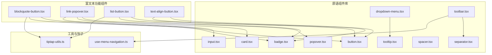
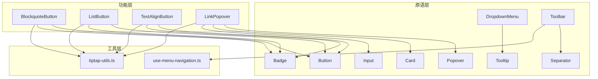
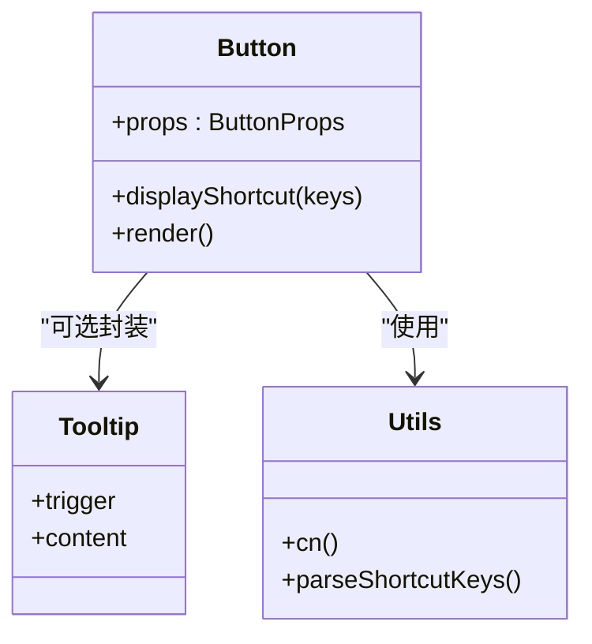
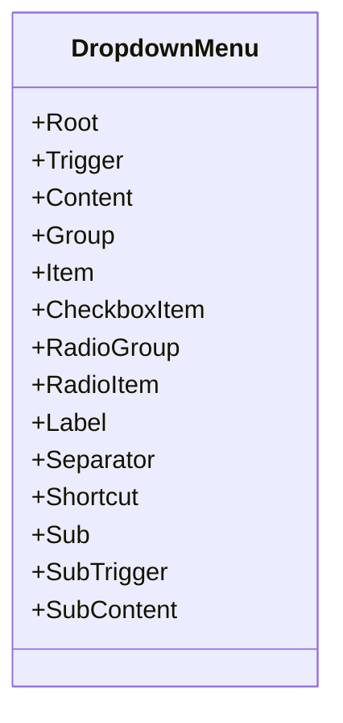
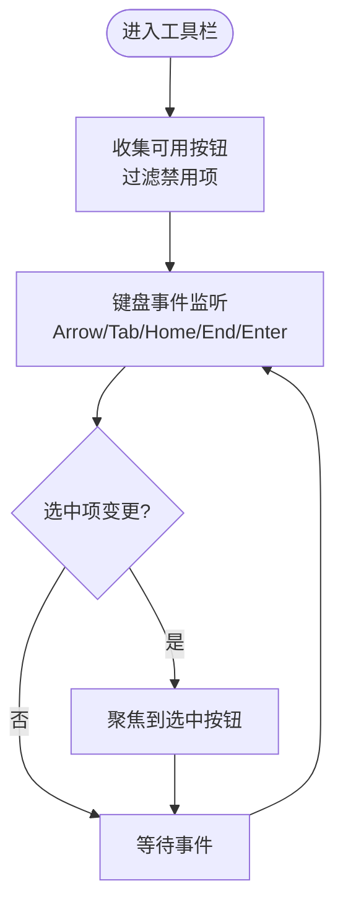
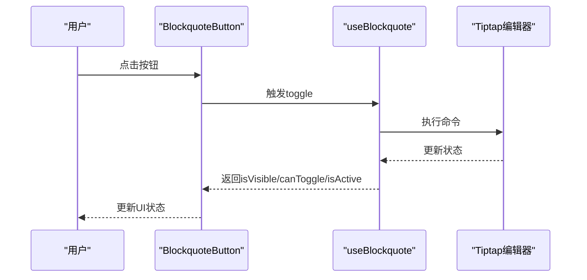
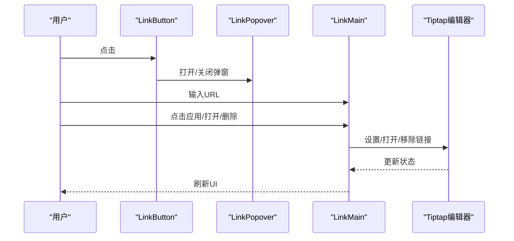
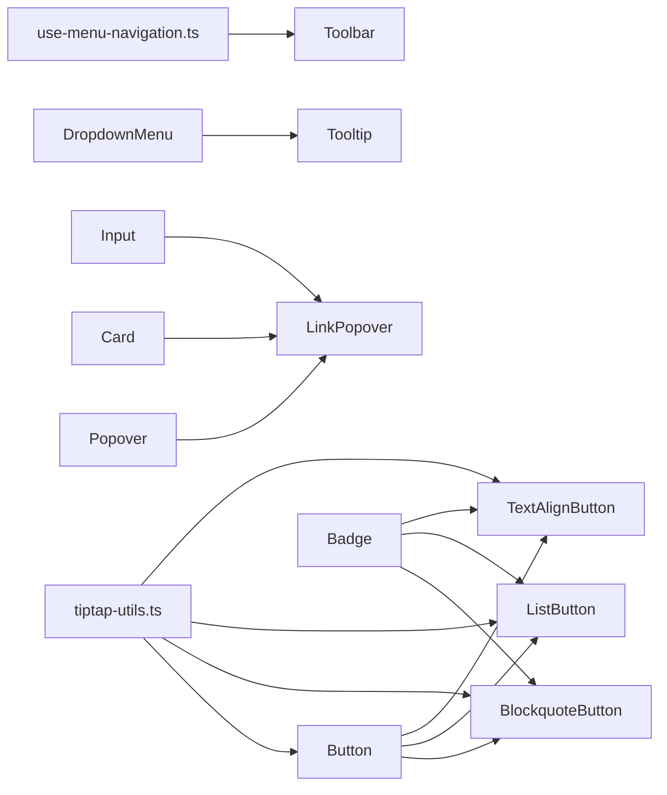

# UI组件

<cite>
**本文引用的文件**
- [button.tsx](file://frontend/src/components/tiptap-ui-primitive/button/button.tsx)
- [dropdown-menu.tsx](file://frontend/src/components/tiptap-ui-primitive/dropdown-menu/dropdown-menu.tsx)
- [input.tsx](file://frontend/src/components/tiptap-ui-primitive/input/input.tsx)
- [toolbar.tsx](file://frontend/src/components/tiptap-ui-primitive/toolbar/toolbar.tsx)
- [card.tsx](file://frontend/src/components/tiptap-ui-primitive/card/card.tsx)
- [popover.tsx](file://frontend/src/components/tiptap-ui-primitive/popover/popover.tsx)
- [separator.tsx](file://frontend/src/components/tiptap-ui-primitive/separator/separator.tsx)
- [badge.tsx](file://frontend/src/components/tiptap-ui-primitive/badge/badge.tsx)
- [spacer.tsx](file://frontend/src/components/tiptap-ui-primitive/spacer/spacer.tsx)
- [tooltip.tsx](file://frontend/src/components/tiptap-ui-primitive/tooltip/tooltip.tsx)
- [blockquote-button.tsx](file://frontend/src/components/tiptap-ui/blockquote-button/blockquote-button.tsx)
- [link-popover.tsx](file://frontend/src/components/tiptap-ui/link-popover/link-popover.tsx)
- [list-button.tsx](file://frontend/src/components/tiptap-ui/list-button/list-button.tsx)
- [text-align-button.tsx](file://frontend/src/components/tiptap-ui/text-align-button/text-align-button.tsx)
- [tiptap-utils.ts](file://frontend/src/lib/tiptap-utils.ts)
- [use-menu-navigation.ts](file://frontend/src/hooks/use-menu-navigation.ts)
</cite>

## 目录
1. [简介](#简介)
2. [项目结构](#项目结构)
3. [核心组件](#核心组件)
4. [架构总览](#架构总览)
5. [组件详解](#组件详解)
6. [依赖关系分析](#依赖关系分析)
7. [性能与可访问性](#性能与可访问性)
8. [故障排查指南](#故障排查指南)
9. [结论](#结论)
10. [附录：使用示例与配置](#附录使用示例与配置)

## 简介
本文件面向Infinite Game富文本编辑器的UI组件体系，系统化梳理“UI原语”（primitive）与“富文本功能按钮/面板”两类组件的设计与实现，覆盖按钮、输入框、卡片、对话框、下拉菜单、弹出框、工具栏、分隔符、徽章、间距、提示等基础能力，并说明它们在富文本编辑场景中的组合方式与交互行为。文档同时给出架构图、流程图与类图，帮助开发者快速理解并扩展组件库。

## 项目结构
前端UI相关代码主要位于以下路径：
- 原语组件库：frontend/src/components/tiptap-ui-primitive/*
- 富文本功能按钮/面板：frontend/src/components/tiptap-ui/*
- 工具函数与钩子：frontend/src/lib/tiptap-utils.ts、frontend/src/hooks/use-menu-navigation.ts

图表来源
- [button.tsx:1-104](file://frontend/src/components/tiptap-ui-primitive/button/button.tsx#L1-L104)
- [dropdown-menu.tsx:1-265](file://frontend/src/components/tiptap-ui-primitive/dropdown-menu/dropdown-menu.tsx#L1-L265)
- [input.tsx:1-18](file://frontend/src/components/tiptap-ui-primitive/input/input.tsx#L1-L18)
- [toolbar.tsx:1-124](file://frontend/src/components/tiptap-ui-primitive/toolbar/toolbar.tsx#L1-L124)
- [card.tsx:1-80](file://frontend/src/components/tiptap-ui-primitive/card/card.tsx#L1-L80)
- [popover.tsx:1-38](file://frontend/src/components/tiptap-ui-primitive/popover/popover.tsx#L1-L38)
- [separator.tsx:1-31](file://frontend/src/components/tiptap-ui-primitive/separator/separator.tsx#L1-L31)
- [badge.tsx:1-47](file://frontend/src/components/tiptap-ui-primitive/badge/badge.tsx#L1-L47)
- [spacer.tsx:1-25](file://frontend/src/components/tiptap-ui-primitive/spacer/spacer.tsx#L1-L25)
- [tooltip.tsx:1-238](file://frontend/src/components/tiptap-ui-primitive/tooltip/tooltip.tsx#L1-L238)
- [blockquote-button.tsx:1-125](file://frontend/src/components/tiptap-ui/blockquote-button/blockquote-button.tsx#L1-L125)
- [link-popover.tsx:1-313](file://frontend/src/components/tiptap-ui/link-popover/link-popover.tsx#L1-L313)
- [list-button.tsx:1-123](file://frontend/src/components/tiptap-ui/list-button/list-button.tsx#L1-L123)
- [text-align-button.tsx:1-145](file://frontend/src/components/tiptap-ui/text-align-button/text-align-button.tsx#L1-L145)
- [tiptap-utils.ts:1-641](file://frontend/src/lib/tiptap-utils.ts#L1-L641)
- [use-menu-navigation.ts:1-197](file://frontend/src/hooks/use-menu-navigation.ts#L1-L197)

章节来源
- [button.tsx:1-104](file://frontend/src/components/tiptap-ui-primitive/button/button.tsx#L1-L104)
- [dropdown-menu.tsx:1-265](file://frontend/src/components/tiptap-ui-primitive/dropdown-menu/dropdown-menu.tsx#L1-L265)
- [input.tsx:1-18](file://frontend/src/components/tiptap-ui-primitive/input/input.tsx#L1-L18)
- [toolbar.tsx:1-124](file://frontend/src/components/tiptap-ui-primitive/toolbar/toolbar.tsx#L1-L124)
- [card.tsx:1-80](file://frontend/src/components/tiptap-ui-primitive/card/card.tsx#L1-L80)
- [popover.tsx:1-38](file://frontend/src/components/tiptap-ui-primitive/popover/popover.tsx#L1-L38)
- [separator.tsx:1-31](file://frontend/src/components/tiptap-ui-primitive/separator/separator.tsx#L1-L31)
- [badge.tsx:1-47](file://frontend/src/components/tiptap-ui-primitive/badge/badge.tsx#L1-L47)
- [spacer.tsx:1-25](file://frontend/src/components/tiptap-ui-primitive/spacer/spacer.tsx#L1-L25)
- [tooltip.tsx:1-238](file://frontend/src/components/tiptap-ui-primitive/tooltip/tooltip.tsx#L1-L238)
- [blockquote-button.tsx:1-125](file://frontend/src/components/tiptap-ui/blockquote-button/blockquote-button.tsx#L1-L125)
- [link-popover.tsx:1-313](file://frontend/src/components/tiptap-ui/link-popover/link-popover.tsx#L1-L313)
- [list-button.tsx:1-123](file://frontend/src/components/tiptap-ui/list-button/list-button.tsx#L1-L123)
- [text-align-button.tsx:1-145](file://frontend/src/components/tiptap-ui/text-align-button/text-align-button.tsx#L1-L145)
- [tiptap-utils.ts:1-641](file://frontend/src/lib/tiptap-utils.ts#L1-L641)
- [use-menu-navigation.ts:1-197](file://frontend/src/hooks/use-menu-navigation.ts#L1-L197)

## 核心组件
- 按钮 Button：支持变体、尺寸、快捷键显示、可选Tooltip封装；通过数据属性传递样式状态。
- 输入框 Input：轻量包裹原生input，统一slot与样式类名。
- 下拉菜单 DropdownMenu：基于Radix UI，提供触发器、内容区、分组、项、复选/单选、标签、分隔符、子菜单等。
- 工具栏 Toolbar：提供水平导航、焦点可见态标记、浮动/固定两种变体。
- 卡片 Card：头部/主体/底部/分组/分组标签等容器组合。
- 弹出框 Popover：基于Radix UI，支持对齐与偏移。
- 分隔符 Separator：语义化role与方向控制。
- 徽章 Badge：多风格/尺寸/强调度/文本裁剪。
- 间距 Spacer：按方向与尺寸自动计算宽高或弹性填充。
- 提示 Tooltip：基于Floating UI，支持延迟、翻转、位移、Portal挂载等。

章节来源
- [button.tsx:18-27](file://frontend/src/components/tiptap-ui-primitive/button/button.tsx#L18-L27)
- [input.tsx:6-15](file://frontend/src/components/tiptap-ui-primitive/input/input.tsx#L6-L15)
- [dropdown-menu.tsx:9-264](file://frontend/src/components/tiptap-ui-primitive/dropdown-menu/dropdown-menu.tsx#L9-L264)
- [toolbar.tsx:12-101](file://frontend/src/components/tiptap-ui-primitive/toolbar/toolbar.tsx#L12-L101)
- [card.tsx:7-79](file://frontend/src/components/tiptap-ui-primitive/card/card.tsx#L7-L79)
- [popover.tsx:7-35](file://frontend/src/components/tiptap-ui-primitive/popover/popover.tsx#L7-L35)
- [separator.tsx:8-30](file://frontend/src/components/tiptap-ui-primitive/separator/separator.tsx#L8-L30)
- [badge.tsx:8-46](file://frontend/src/components/tiptap-ui-primitive/badge/badge.tsx#L8-L46)
- [spacer.tsx:5-24](file://frontend/src/components/tiptap-ui-primitive/spacer/spacer.tsx#L5-L24)
- [tooltip.tsx:33-161](file://frontend/src/components/tiptap-ui-primitive/tooltip/tooltip.tsx#L33-L161)

## 架构总览
富文本功能组件以“原语组件”为基础，通过Hook与工具函数对接Tiptap编辑器上下文，形成“功能按钮/面板 → 原语 → 工具函数”的层次化架构。

图表来源
- [blockquote-button.tsx:49-121](file://frontend/src/components/tiptap-ui/blockquote-button/blockquote-button.tsx#L49-L121)
- [list-button.tsx:48-119](file://frontend/src/components/tiptap-ui/list-button/list-button.tsx#L48-L119)
- [text-align-button.tsx:61-140](file://frontend/src/components/tiptap-ui/text-align-button/text-align-button.tsx#L61-L140)
- [link-popover.tsx:212-307](file://frontend/src/components/tiptap-ui/link-popover/link-popover.tsx#L212-L307)
- [button.tsx:46-98](file://frontend/src/components/tiptap-ui-primitive/button/button.tsx#L46-L98)
- [badge.tsx:15-41](file://frontend/src/components/tiptap-ui-primitive/badge/badge.tsx#L15-L41)
- [popover.tsx:7-35](file://frontend/src/components/tiptap-ui-primitive/popover/popover.tsx#L7-L35)
- [card.tsx:7-79](file://frontend/src/components/tiptap-ui-primitive/card/card.tsx#L7-L79)
- [input.tsx:6-15](file://frontend/src/components/tiptap-ui-primitive/input/input.tsx#L6-L15)
- [toolbar.tsx:82-101](file://frontend/src/components/tiptap-ui-primitive/toolbar/toolbar.tsx#L82-L101)
- [separator.tsx:8-30](file://frontend/src/components/tiptap-ui-primitive/separator/separator.tsx#L8-L30)
- [tooltip.tsx:140-161](file://frontend/src/components/tiptap-ui-primitive/tooltip/tooltip.tsx#L140-L161)
- [tiptap-utils.ts:46-103](file://frontend/src/lib/tiptap-utils.ts#L46-L103)
- [use-menu-navigation.ts:54-63](file://frontend/src/hooks/use-menu-navigation.ts#L54-L63)

## 组件详解

### 按钮 Button
- 设计要点
  - 支持变体与尺寸的数据属性标注，便于样式系统映射。
  - 可选Tooltip封装，自动注入快捷键显示。
  - 使用工具函数进行类名拼接与快捷键解析。
- 关键接口
  - ButtonProps：继承原生button属性，新增showTooltip、tooltip、shortcutKeys、variant、size。
  - ShortcutDisplay：渲染平台适配的快捷键序列。
- 适用场景
  - 工具栏按钮、功能面板操作入口、下拉菜单项等。

图表来源
- [button.tsx:46-98](file://frontend/src/components/tiptap-ui-primitive/button/button.tsx#L46-L98)
- [tooltip.tsx:163-201](file://frontend/src/components/tiptap-ui-primitive/tooltip/tooltip.tsx#L163-L201)
- [tiptap-utils.ts:46-103](file://frontend/src/lib/tiptap-utils.ts#L46-L103)

章节来源
- [button.tsx:18-27](file://frontend/src/components/tiptap-ui-primitive/button/button.tsx#L18-L27)
- [button.tsx:46-98](file://frontend/src/components/tiptap-ui-primitive/button/button.tsx#L46-L98)
- [tiptap-utils.ts:46-103](file://frontend/src/lib/tiptap-utils.ts#L46-L103)

### 下拉菜单 DropdownMenu
- 设计要点
  - 对Radix UI组件进行统一封装，暴露Root、Trigger、Content、Group、Item、CheckboxItem、RadioGroup、RadioItem、Label、Separator、Shortcut、Sub/SubTrigger/SubContent等。
  - 内容区默认Portal挂载，支持align与sideOffset。
  - 通过数据属性标注inset、variant等状态。
- 适用场景
  - 工具栏菜单、列表类型切换、文本对齐选择等。

图表来源
- [dropdown-menu.tsx:9-264](file://frontend/src/components/tiptap-ui-primitive/dropdown-menu/dropdown-menu.tsx#L9-L264)

章节来源
- [dropdown-menu.tsx:9-264](file://frontend/src/components/tiptap-ui-primitive/dropdown-menu/dropdown-menu.tsx#L9-L264)

### 工具栏 Toolbar
- 设计要点
  - 提供Toolbar、ToolbarGroup、ToolbarSeparator三件套，语义化role与aria-label。
  - 内置键盘导航：水平方向循环遍历可用按钮，自动聚焦当前选中项。
  - 支持“浮动/固定”两种变体，配合焦点可见态标记。
- 适用场景
  - 富文本编辑器顶部工具条、节点属性面板工具条等。

图表来源
- [toolbar.tsx:16-80](file://frontend/src/components/tiptap-ui-primitive/toolbar/toolbar.tsx#L16-L80)
- [use-menu-navigation.ts:54-63](file://frontend/src/hooks/use-menu-navigation.ts#L54-L63)

章节来源
- [toolbar.tsx:12-101](file://frontend/src/components/tiptap-ui-primitive/toolbar/toolbar.tsx#L12-L101)
- [use-menu-navigation.ts:54-63](file://frontend/src/hooks/use-menu-navigation.ts#L54-L63)

### 卡片 Card
- 设计要点
  - 提供Header、Body、Footer、ItemGroup、GroupLabel等组合部件。
  - ItemGroup支持水平/垂直布局，通过数据属性标注。
- 适用场景
  - 链接弹窗、设置面板、信息展示块等。

章节来源
- [card.tsx:7-79](file://frontend/src/components/tiptap-ui-primitive/card/card.tsx#L7-L79)

### 弹出框 Popover
- 设计要点
  - 基于Radix UI，支持Portal挂载、对齐与偏移。
- 适用场景
  - 链接输入、颜色选择、更多操作入口等。

章节来源
- [popover.tsx:7-35](file://frontend/src/components/tiptap-ui-primitive/popover/popover.tsx#L7-L35)

### 分隔符 Separator
- 设计要点
  - 根据方向设置aria-orientation，支持装饰性与语义性两种角色。
- 适用场景
  - 工具栏分隔、面板内元素分组。

章节来源
- [separator.tsx:8-30](file://frontend/src/components/tiptap-ui-primitive/separator/separator.tsx#L8-L30)

### 徽章 Badge
- 设计要点
  - 支持多种风格、尺寸与强调度，可通过数据属性控制文本裁剪。
- 适用场景
  - 快捷键提示、状态标签、计数徽标。

章节来源
- [badge.tsx:8-46](file://frontend/src/components/tiptap-ui-primitive/badge/badge.tsx#L8-L46)

### 间距 Spacer
- 设计要点
  - 按方向与尺寸自动计算宽高，或在水平方向时提供flex:1弹性填充。
- 适用场景
  - 工具栏内自动留白、面板左右分布。

章节来源
- [spacer.tsx:5-24](file://frontend/src/components/tiptap-ui-primitive/spacer/spacer.tsx#L5-L24)

### 提示 Tooltip
- 设计要点
  - 基于Floating UI，支持延迟、翻转、位移、Portal挂载、延迟组等。
  - 提供Tooltip、TooltipTrigger、TooltipContent三件套。
- 适用场景
  - 按钮/菜单项的简要说明与快捷键提示。

章节来源
- [tooltip.tsx:33-161](file://frontend/src/components/tiptap-ui-primitive/tooltip/tooltip.tsx#L33-L161)

### 富文本功能组件

#### BlockquoteButton
- 功能概述
  - 切换区块引用（Blockquote），支持可见性、可用性、激活态、快捷键与无障碍属性。
  - 可选显示快捷键徽章。
- 关键点
  - 通过useBlockquote获取编辑器上下文与状态。
  - 渲染时设置aria-pressed与data-active-state。

图表来源
- [blockquote-button.tsx:66-88](file://frontend/src/components/tiptap-ui/blockquote-button/blockquote-button.tsx#L66-L88)
- [tiptap-utils.ts:90-103](file://frontend/src/lib/tiptap-utils.ts#L90-L103)

章节来源
- [blockquote-button.tsx:23-121](file://frontend/src/components/tiptap-ui/blockquote-button/blockquote-button.tsx#L23-L121)

#### LinkPopover
- 功能概述
  - 链接设置弹窗：输入URL、应用、打开、删除。
  - 自动聚焦、移动端样式适配、可选自动打开。
- 关键点
  - 使用Popover包裹触发按钮与内容区。
  - 输入框支持回车应用，禁用条件与isActive联动。

图表来源
- [link-popover.tsx:212-307](file://frontend/src/components/tiptap-ui/link-popover/link-popover.tsx#L212-L307)
- [link-popover.tsx:107-192](file://frontend/src/components/tiptap-ui/link-popover/link-popover.tsx#L107-L192)

章节来源
- [link-popover.tsx:66-307](file://frontend/src/components/tiptap-ui/link-popover/link-popover.tsx#L66-L307)

#### ListButton
- 功能概述
  - 切换列表（有序/无序/任务），支持可见性、可用性、激活态与快捷键徽章。
- 关键点
  - 通过useList获取编辑器上下文与状态。
  - 支持自定义显示文本与快捷键徽章。

章节来源
- [list-button.tsx:20-119](file://frontend/src/components/tiptap-ui/list-button/list-button.tsx#L20-L119)

#### TextAlignButton
- 功能概述
  - 设置文本对齐（左/居中/右/两端），支持可见性、可用性、激活态与快捷键徽章。
  - 支持自定义图标组件。
- 关键点
  - 通过useTextAlign获取编辑器上下文与状态。
  - 支持传入自定义icon覆盖默认图标。

章节来源
- [text-align-button.tsx:29-140](file://frontend/src/components/tiptap-ui/text-align-button/text-align-button.tsx#L29-L140)

## 依赖关系分析
- 组件间耦合
  - 功能组件强依赖原语组件（Button、Badge、Popover、Card、Input等）。
  - 工具函数与钩子被广泛复用于解析快捷键、键盘导航、DOM查询等。
- 外部依赖
  - Radix UI用于下拉菜单与弹出框。
  - Floating UI用于Tooltip定位与交互。
  - Tiptap React用于编辑器上下文与命令执行。
- 潜在风险
  - 原语组件的slot与数据属性需保持一致，避免样式系统失效。
  - Tooltip与Popover的Portal挂载需确保挂载目标存在。

图表来源
- [tiptap-utils.ts:46-103](file://frontend/src/lib/tiptap-utils.ts#L46-L103)
- [use-menu-navigation.ts:54-63](file://frontend/src/hooks/use-menu-navigation.ts#L54-L63)
- [dropdown-menu.tsx:3-7](file://frontend/src/components/tiptap-ui-primitive/dropdown-menu/dropdown-menu.tsx#L3-L7)
- [tooltip.tsx:3-31](file://frontend/src/components/tiptap-ui-primitive/tooltip/tooltip.tsx#L3-L31)
- [popover.tsx:3-5](file://frontend/src/components/tiptap-ui-primitive/popover/popover.tsx#L3-L5)
- [blockquote-button.tsx:6-21](file://frontend/src/components/tiptap-ui/blockquote-button/blockquote-button.tsx#L6-L21)
- [list-button.tsx:6-18](file://frontend/src/components/tiptap-ui/list-button/list-button.tsx#L6-L18)
- [text-align-button.tsx:12-19](file://frontend/src/components/tiptap-ui/text-align-button/text-align-button.tsx#L12-L19)
- [link-popover.tsx:20-37](file://frontend/src/components/tiptap-ui/link-popover/link-popover.tsx#L20-L37)

章节来源
- [tiptap-utils.ts:46-103](file://frontend/src/lib/tiptap-utils.ts#L46-L103)
- [use-menu-navigation.ts:54-63](file://frontend/src/hooks/use-menu-navigation.ts#L54-L63)
- [dropdown-menu.tsx:3-7](file://frontend/src/components/tiptap-ui-primitive/dropdown-menu/dropdown-menu.tsx#L3-L7)
- [tooltip.tsx:3-31](file://frontend/src/components/tiptap-ui-primitive/tooltip/tooltip.tsx#L3-L31)
- [popover.tsx:3-5](file://frontend/src/components/tiptap-ui-primitive/popover/popover.tsx#L3-L5)
- [blockquote-button.tsx:6-21](file://frontend/src/components/tiptap-ui/blockquote-button/blockquote-button.tsx#L6-L21)
- [list-button.tsx:6-18](file://frontend/src/components/tiptap-ui/list-button/list-button.tsx#L6-L18)
- [text-align-button.tsx:12-19](file://frontend/src/components/tiptap-ui/text-align-button/text-align-button.tsx#L12-L19)
- [link-popover.tsx:20-37](file://frontend/src/components/tiptap-ui/link-popover/link-popover.tsx#L20-L37)

## 性能与可访问性
- 性能
  - Button与Tooltip内部使用useMemo缓存快捷键解析结果，降低重复计算。
  - Toolbar通过MutationObserver收集按钮项，避免频繁重渲染。
  - Popover/Tooltip默认Portal挂载，减少层级嵌套带来的重绘。
- 可访问性
  - Button与各功能按钮均设置aria-label与aria-pressed，指示激活状态。
  - Toolbar为容器设置role="toolbar"与aria-label，按钮设置role="button"与tabIndex=-1，提升键盘可达性。
  - Separator根据方向设置aria-orientation，区分装饰性与语义性。
  - Tooltip使用Floating UI role="tooltip"，确保屏幕阅读器识别。
- 主题与响应式
  - 原语组件通过数据属性（如data-style、data-size、data-variant）驱动CSS变量或类名映射，便于主题切换。
  - LinkPopover在移动端调整阴影与边框，改善触摸体验。

章节来源
- [button.tsx:60-63](file://frontend/src/components/tiptap-ui-primitive/button/button.tsx#L60-L63)
- [toolbar.tsx:16-80](file://frontend/src/components/tiptap-ui-primitive/toolbar/toolbar.tsx#L16-L80)
- [separator.tsx:17-20](file://frontend/src/components/tiptap-ui-primitive/separator/separator.tsx#L17-L20)
- [tooltip.tsx:203-232](file://frontend/src/components/tiptap-ui-primitive/tooltip/tooltip.tsx#L203-L232)
- [link-popover.tsx:115-128](file://frontend/src/components/tiptap-ui/link-popover/link-popover.tsx#L115-L128)

## 故障排查指南
- 快捷键不显示
  - 检查shortcutKeys格式与分隔符是否正确，确认parseShortcutKeys返回非空数组。
  - 章节来源
    - [button.tsx:60-63](file://frontend/src/components/tiptap-ui-primitive/button/button.tsx#L60-L63)
    - [tiptap-utils.ts:90-103](file://frontend/src/lib/tiptap-utils.ts#L90-L103)
- Tooltip不出现
  - 确认Tooltip包裹在TooltipProvider内，且未误用Portal导致挂载目标缺失。
  - 章节来源
    - [tooltip.tsx:140-161](file://frontend/src/components/tiptap-ui-primitive/tooltip/tooltip.tsx#L140-L161)
- 工具栏无法键盘导航
  - 确保Toolbar内的按钮满足可聚焦条件（button、role="button"或tabindex=0且非disabled）。
  - 章节来源
    - [toolbar.tsx:21-28](file://frontend/src/components/tiptap-ui-primitive/toolbar/toolbar.tsx#L21-L28)
    - [use-menu-navigation.ts:68-82](file://frontend/src/hooks/use-menu-navigation.ts#L68-L82)
- 下拉菜单内容错位
  - 调整align与sideOffset，或检查父级overflow与定位上下文。
  - 章节来源
    - [dropdown-menu.tsx:44-56](file://frontend/src/components/tiptap-ui-primitive/dropdown-menu/dropdown-menu.tsx#L44-L56)
- 链接弹窗无法应用
  - 检查canSet与isActive状态，确保URL有效或已处于链接激活状态。
  - 章节来源
    - [link-popover.tsx:229-244](file://frontend/src/components/tiptap-ui/link-popover/link-popover.tsx#L229-L244)

## 结论
该UI组件体系以“原语组件 + 功能组件 + 工具函数/钩子”的方式构建，既保证了富文本编辑器场景下的功能完备性，又通过数据属性与Portal等机制实现了良好的主题与可访问性支持。建议在扩展新功能时遵循现有命名与数据属性约定，确保样式系统与交互一致性。

## 附录：使用示例与配置
- Button
  - 属性：variant（ghost/primary）、size（small/default/large）、tooltip、shortcutKeys、showTooltip。
  - 事件：onClick等原生button事件。
  - 章节来源
    - [button.tsx:21-27](file://frontend/src/components/tiptap-ui-primitive/button/button.tsx#L21-L27)
- DropdownMenu
  - 子组件：Root、Trigger、Content、Item、CheckboxItem、RadioItem、Label、Separator、Sub*系列。
  - 配置：align、sideOffset、inset、variant等。
  - 章节来源
    - [dropdown-menu.tsx:9-264](file://frontend/src/components/tiptap-ui-primitive/dropdown-menu/dropdown-menu.tsx#L9-L264)
- Toolbar
  - 属性：variant（floating/fixed）。
  - 行为：自动聚焦当前选中按钮，支持Home/End/Tab/Enter/Escape。
  - 章节来源
    - [toolbar.tsx:12-101](file://frontend/src/components/tiptap-ui-primitive/toolbar/toolbar.tsx#L12-L101)
    - [use-menu-navigation.ts:54-63](file://frontend/src/hooks/use-menu-navigation.ts#L54-L63)
- LinkPopover
  - 属性：hideWhenUnavailable、onSetLink、onOpenChange、autoOpenOnLinkActive。
  - 行为：输入URL后回车应用，支持打开与删除。
  - 章节来源
    - [link-popover.tsx:66-77](file://frontend/src/components/tiptap-ui/link-popover/link-popover.tsx#L66-L77)
    - [link-popover.tsx:212-307](file://frontend/src/components/tiptap-ui/link-popover/link-popover.tsx#L212-L307)
- 工具函数
  - cn：类名拼接。
  - parseShortcutKeys：快捷键解析与平台符号转换。
  - 章节来源
    - [tiptap-utils.ts:46-103](file://frontend/src/lib/tiptap-utils.ts#L46-L103)