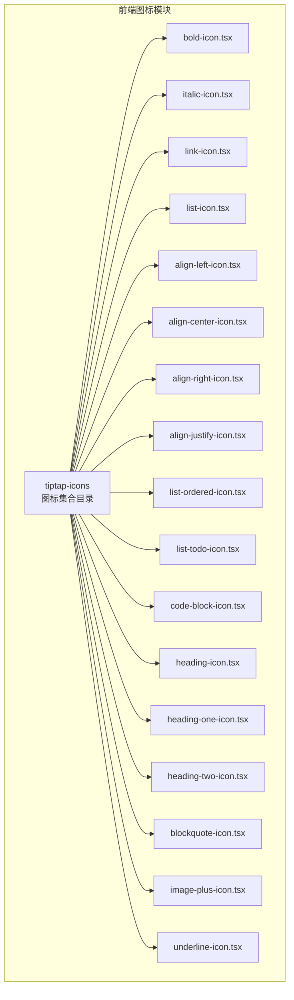
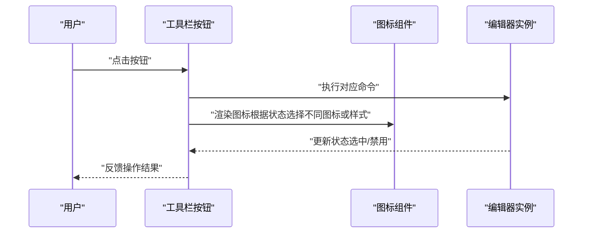
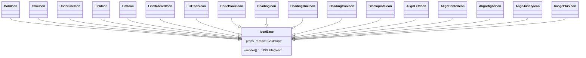

# 图标系统

<cite>
**本文引用的文件**
- [bold-icon.tsx](file://frontend/src/components/tiptap-icons/bold-icon.tsx)
- [italic-icon.tsx](file://frontend/src/components/tiptap-icons/italic-icon.tsx)
- [link-icon.tsx](file://frontend/src/components/tiptap-icons/link-icon.tsx)
- [list-icon.tsx](file://frontend/src/components/tiptap-icons/list-icon.tsx)
- [align-left-icon.tsx](file://frontend/src/components/tiptap-icons/align-left-icon.tsx)
- [align-center-icon.tsx](file://frontend/src/components/tiptap-icons/align-center-icon.tsx)
- [align-right-icon.tsx](file://frontend/src/components/tiptap-icons/align-right-icon.tsx)
- [align-justify-icon.tsx](file://frontend/src/components/tiptap-icons/align-justify-icon.tsx)
- [list-ordered-icon.tsx](file://frontend/src/components/tiptap-icons/list-ordered-icon.tsx)
- [list-todo-icon.tsx](file://frontend/src/components/tiptap-icons/list-todo-icon.tsx)
- [code-block-icon.tsx](file://frontend/src/components/tiptap-icons/code-block-icon.tsx)
- [heading-icon.tsx](file://frontend/src/components/tiptap-icons/heading-icon.tsx)
- [heading-one-icon.tsx](file://frontend/src/components/tiptap-icons/heading-one-icon.tsx)
- [heading-two-icon.tsx](file://frontend/src/components/tiptap-icons/heading-two-icon.tsx)
- [blockquote-icon.tsx](file://frontend/src/components/tiptap-icons/blockquote-icon.tsx)
- [image-plus-icon.tsx](file://frontend/src/components/tiptap-icons/image-plus-icon.tsx)
- [underline-icon.tsx](file://frontend/src/components/tiptap-icons/underline-icon.tsx)
</cite>

## 目录
1. [简介](#简介)
2. [项目结构](#项目结构)
3. [核心组件](#核心组件)
4. [架构总览](#架构总览)
5. [详细组件分析](#详细组件分析)
6. [依赖关系分析](#依赖关系分析)
7. [性能考量](#性能考量)
8. [故障排查指南](#故障排查指南)
9. [结论](#结论)
10. [附录](#附录)

## 简介
本文件面向 Infinite Game 富文本编辑器的图标系统，聚焦于 Tiptap 编辑器中使用的自定义 SVG 图标。内容涵盖图标的设计与实现方式（SVG 路径、尺寸、填充策略）、React 组件封装（memo 包装、类型约束）、样式与主题适配（通过 className 与 CSS 变量）、以及在编辑器工具栏中的使用方法与扩展实践。文档同时提供响应式与可访问性建议，并给出性能优化与常见问题排查要点。

## 项目结构
图标位于前端工程的 tiptap-icons 目录下，每个图标均为独立的 React 组件文件，采用统一的命名规范与结构风格，便于在编辑器 UI 中按需引入与复用。

图表来源
- [bold-icon.tsx:1-27](file://frontend/src/components/tiptap-icons/bold-icon.tsx#L1-L27)
- [italic-icon.tsx:1-25](file://frontend/src/components/tiptap-icons/italic-icon.tsx#L1-L25)
- [link-icon.tsx:1-29](file://frontend/src/components/tiptap-icons/link-icon.tsx#L1-L29)
- [list-icon.tsx:1-57](file://frontend/src/components/tiptap-icons/list-icon.tsx#L1-L57)
- [align-left-icon.tsx:1-39](file://frontend/src/components/tiptap-icons/align-left-icon.tsx#L1-L39)
- [align-center-icon.tsx:1-39](file://frontend/src/components/tiptap-icons/align-center-icon.tsx#L1-L39)
- [align-right-icon.tsx:1-39](file://frontend/src/components/tiptap-icons/align-right-icon.tsx#L1-L39)
- [align-justify-icon.tsx:1-39](file://frontend/src/components/tiptap-icons/align-justify-icon.tsx#L1-L39)
- [list-ordered-icon.tsx:1-57](file://frontend/src/components/tiptap-icons/list-ordered-icon.tsx#L1-L57)
- [list-todo-icon.tsx:1-51](file://frontend/src/components/tiptap-icons/list-todo-icon.tsx#L1-L51)
- [code-block-icon.tsx:1-39](file://frontend/src/components/tiptap-icons/code-block-icon.tsx#L1-L39)
- [heading-icon.tsx:1-25](file://frontend/src/components/tiptap-icons/heading-icon.tsx#L1-L25)
- [heading-one-icon.tsx:1-29](file://frontend/src/components/tiptap-icons/heading-one-icon.tsx#L1-L29)
- [heading-two-icon.tsx:1-29](file://frontend/src/components/tiptap-icons/heading-two-icon.tsx#L1-L29)
- [blockquote-icon.tsx:1-45](file://frontend/src/components/tiptap-icons/blockquote-icon.tsx#L1-L45)
- [image-plus-icon.tsx:1-27](file://frontend/src/components/tiptap-icons/image-plus-icon.tsx#L1-L27)
- [underline-icon.tsx:1-27](file://frontend/src/components/tiptap-icons/underline-icon.tsx#L1-L27)

章节来源
- [bold-icon.tsx:1-27](file://frontend/src/components/tiptap-icons/bold-icon.tsx#L1-L27)
- [italic-icon.tsx:1-25](file://frontend/src/components/tiptap-icons/italic-icon.tsx#L1-L25)
- [link-icon.tsx:1-29](file://frontend/src/components/tiptap-icons/link-icon.tsx#L1-L29)
- [list-icon.tsx:1-57](file://frontend/src/components/tiptap-icons/list-icon.tsx#L1-L57)
- [align-left-icon.tsx:1-39](file://frontend/src/components/tiptap-icons/align-left-icon.tsx#L1-L39)
- [align-center-icon.tsx:1-39](file://frontend/src/components/tiptap-icons/align-center-icon.tsx#L1-L39)
- [align-right-icon.tsx:1-39](file://frontend/src/components/tiptap-icons/align-right-icon.tsx#L1-L39)
- [align-justify-icon.tsx:1-39](file://frontend/src/components/tiptap-icons/align-justify-icon.tsx#L1-L39)
- [list-ordered-icon.tsx:1-57](file://frontend/src/components/tiptap-icons/list-ordered-icon.tsx#L1-L57)
- [list-todo-icon.tsx:1-51](file://frontend/src/components/tiptap-icons/list-todo-icon.tsx#L1-L51)
- [code-block-icon.tsx:1-39](file://frontend/src/components/tiptap-icons/code-block-icon.tsx#L1-L39)
- [heading-icon.tsx:1-25](file://frontend/src/components/tiptap-icons/heading-icon.tsx#L1-L25)
- [heading-one-icon.tsx:1-29](file://frontend/src/components/tiptap-icons/heading-one-icon.tsx#L1-L29)
- [heading-two-icon.tsx:1-29](file://frontend/src/components/tiptap-icons/heading-two-icon.tsx#L1-L29)
- [blockquote-icon.tsx:1-45](file://frontend/src/components/tiptap-icons/blockquote-icon.tsx#L1-L45)
- [image-plus-icon.tsx:1-27](file://frontend/src/components/tiptap-icons/image-plus-icon.tsx#L1-L27)
- [underline-icon.tsx:1-27](file://frontend/src/components/tiptap-icons/underline-icon.tsx#L1-L27)

## 核心组件
- 统一的组件形态：所有图标均导出一个带记忆化（memo）的函数组件，接收 className 与原生 svg 属性，内部渲染固定尺寸（24x24）与 viewBox 的 SVG 元素，填充色使用当前文本色（currentColor），确保与主题一致。
- 类型约束：通过 React.ComponentPropsWithoutRef<"svg"> 约束传入属性，保证与原生 SVG 元素兼容。
- 命名规范：以功能语义命名（如 BoldIcon、ItalicIcon、LinkIcon 等），便于在编辑器 UI 中直接引用。

章节来源
- [bold-icon.tsx:3-27](file://frontend/src/components/tiptap-icons/bold-icon.tsx#L3-L27)
- [italic-icon.tsx:3-25](file://frontend/src/components/tiptap-icons/italic-icon.tsx#L3-L25)
- [link-icon.tsx:3-29](file://frontend/src/components/tiptap-icons/link-icon.tsx#L3-L29)
- [list-icon.tsx:3-57](file://frontend/src/components/tiptap-icons/list-icon.tsx#L3-L57)
- [align-left-icon.tsx:3-39](file://frontend/src/components/tiptap-icons/align-left-icon.tsx#L3-L39)
- [align-center-icon.tsx:3-39](file://frontend/src/components/tiptap-icons/align-center-icon.tsx#L3-L39)
- [align-right-icon.tsx:3-39](file://frontend/src/components/tiptap-icons/align-right-icon.tsx#L3-L39)
- [align-justify-icon.tsx:3-39](file://frontend/src/components/tiptap-icons/align-justify-icon.tsx#L3-L39)
- [list-ordered-icon.tsx:3-57](file://frontend/src/components/tiptap-icons/list-ordered-icon.tsx#L3-L57)
- [list-todo-icon.tsx:3-51](file://frontend/src/components/tiptap-icons/list-todo-icon.tsx#L3-L51)
- [code-block-icon.tsx:3-39](file://frontend/src/components/tiptap-icons/code-block-icon.tsx#L3-L39)
- [heading-icon.tsx:3-25](file://frontend/src/components/tiptap-icons/heading-icon.tsx#L3-L25)
- [heading-one-icon.tsx:3-29](file://frontend/src/components/tiptap-icons/heading-one-icon.tsx#L3-L29)
- [heading-two-icon.tsx:3-29](file://frontend/src/components/tiptap-icons/heading-two-icon.tsx#L3-L29)
- [blockquote-icon.tsx:3-45](file://frontend/src/components/tiptap-icons/blockquote-icon.tsx#L3-L45)
- [image-plus-icon.tsx:3-27](file://frontend/src/components/tiptap-icons/image-plus-icon.tsx#L3-L27)
- [underline-icon.tsx:3-27](file://frontend/src/components/tiptap-icons/underline-icon.tsx#L3-L27)

## 架构总览
图标系统在编辑器中的职责是为工具栏按钮提供视觉符号，配合状态（启用/禁用、选中态）与交互行为（点击触发命令）共同完成富文本编辑功能。整体流程如下：

图表来源
- [bold-icon.tsx:5-24](file://frontend/src/components/tiptap-icons/bold-icon.tsx#L5-L24)
- [italic-icon.tsx:5-22](file://frontend/src/components/tiptap-icons/italic-icon.tsx#L5-L22)
- [link-icon.tsx:5-24](file://frontend/src/components/tiptap-icons/link-icon.tsx#L5-L24)

## 详细组件分析

### 字体与排版类图标
- 加粗（BoldIcon）
  - 设计要点：使用单条连续路径表达笔画粗细变化，强调“加粗”视觉特征。
  - 使用场景：富文本编辑器工具栏的加粗按钮。
  - 复杂度：常量时间绘制，路径数量中等。
- 斜体（ItalicIcon）
  - 设计要点：通过倾斜的矩形与斜边形成“斜体”识别度。
  - 使用场景：斜体切换按钮。
- 下划线（UnderlineIcon）
  - 设计要点：顶部文字区与底部横线组合，突出“下划线”语义。
  - 使用场景：下划线按钮。
- 标题（HeadingIcon、HeadingOneIcon、HeadingTwoIcon）
  - 设计要点：从“H”字母抽象出标题层级的视觉层次；One/Two 强化层级差异。
  - 使用场景：标题层级切换按钮组。
- 引用（BlockquoteIcon）
  - 设计要点：左侧竖线与多行块状元素组合，传达“引用”语义。
  - 使用场景：引用段落按钮。

章节来源
- [bold-icon.tsx:1-27](file://frontend/src/components/tiptap-icons/bold-icon.tsx#L1-L27)
- [italic-icon.tsx:1-25](file://frontend/src/components/tiptap-icons/italic-icon.tsx#L1-L25)
- [underline-icon.tsx:1-27](file://frontend/src/components/tiptap-icons/underline-icon.tsx#L1-L27)
- [heading-icon.tsx:1-25](file://frontend/src/components/tiptap-icons/heading-icon.tsx#L1-L25)
- [heading-one-icon.tsx:1-29](file://frontend/src/components/tiptap-icons/heading-one-icon.tsx#L1-L29)
- [heading-two-icon.tsx:1-29](file://frontend/src/components/tiptap-icons/heading-two-icon.tsx#L1-L29)
- [blockquote-icon.tsx:1-45](file://frontend/src/components/tiptap-icons/blockquote-icon.tsx#L1-L45)

### 对齐与列表类图标
- 左对齐（AlignLeftIcon）
  - 设计要点：三行文字，最左侧对齐，简洁明了。
- 居中对齐（AlignCenterIcon）
  - 设计要点：三行文字，中间对齐，强调水平居中。
- 右对齐（AlignRightIcon）
  - 设计要点：三行文字，最右侧对齐，突出右对齐。
- 两端对齐（AlignJustifyIcon）
  - 设计要点：三行文字，两端对齐，强调两端对齐。
- 无序列表（ListIcon）
  - 设计要点：点状标记与行文组合，突出“列表”语义。
- 有序列表（ListOrderedIcon）
  - 设计要点：行文编号与行文组合，突出“有序”语义。
- 待办列表（ListTodoIcon）
  - 设计要点：复选框与行文组合，突出“待办”语义。
- 代码块（CodeBlockIcon）
  - 设计要点：尖角与外框组合，突出“代码”语义。
- 链接（LinkIcon）
  - 设计要点：两个环形链路与连接点，强调“超链接”语义。
- 图片插入（ImagePlusIcon）
  - 设计要点：相框与加号组合，突出“插入图片”语义。

章节来源
- [align-left-icon.tsx:1-39](file://frontend/src/components/tiptap-icons/align-left-icon.tsx#L1-L39)
- [align-center-icon.tsx:1-39](file://frontend/src/components/tiptap-icons/align-center-icon.tsx#L1-L39)
- [align-right-icon.tsx:1-39](file://frontend/src/components/tiptap-icons/align-right-icon.tsx#L1-L39)
- [align-justify-icon.tsx:1-39](file://frontend/src/components/tiptap-icons/align-justify-icon.tsx#L1-L39)
- [list-icon.tsx:1-57](file://frontend/src/components/tiptap-icons/list-icon.tsx#L1-L57)
- [list-ordered-icon.tsx:1-57](file://frontend/src/components/tiptap-icons/list-ordered-icon.tsx#L1-L57)
- [list-todo-icon.tsx:1-51](file://frontend/src/components/tiptap-icons/list-todo-icon.tsx#L1-L51)
- [code-block-icon.tsx:1-39](file://frontend/src/components/tiptap-icons/code-block-icon.tsx#L1-L39)
- [link-icon.tsx:1-29](file://frontend/src/components/tiptap-icons/link-icon.tsx#L1-L29)
- [image-plus-icon.tsx:1-27](file://frontend/src/components/tiptap-icons/image-plus-icon.tsx#L1-L27)

### 组件类图（示意）

图表来源
- [bold-icon.tsx:5-24](file://frontend/src/components/tiptap-icons/bold-icon.tsx#L5-L24)
- [italic-icon.tsx:5-22](file://frontend/src/components/tiptap-icons/italic-icon.tsx#L5-L22)
- [underline-icon.tsx:5-22](file://frontend/src/components/tiptap-icons/underline-icon.tsx#L5-L22)
- [link-icon.tsx:5-22](file://frontend/src/components/tiptap-icons/link-icon.tsx#L5-L22)
- [list-icon.tsx:5-22](file://frontend/src/components/tiptap-icons/list-icon.tsx#L5-L22)
- [list-ordered-icon.tsx:5-22](file://frontend/src/components/tiptap-icons/list-ordered-icon.tsx#L5-L22)
- [list-todo-icon.tsx:5-22](file://frontend/src/components/tiptap-icons/list-todo-icon.tsx#L5-L22)
- [code-block-icon.tsx:5-22](file://frontend/src/components/tiptap-icons/code-block-icon.tsx#L5-L22)
- [heading-icon.tsx:5-22](file://frontend/src/components/tiptap-icons/heading-icon.tsx#L5-L22)
- [heading-one-icon.tsx:5-22](file://frontend/src/components/tiptap-icons/heading-one-icon.tsx#L5-L22)
- [heading-two-icon.tsx:5-22](file://frontend/src/components/tiptap-icons/heading-two-icon.tsx#L5-L22)
- [blockquote-icon.tsx:5-22](file://frontend/src/components/tiptap-icons/blockquote-icon.tsx#L5-L22)
- [align-left-icon.tsx:5-22](file://frontend/src/components/tiptap-icons/align-left-icon.tsx#L5-L22)
- [align-center-icon.tsx:5-22](file://frontend/src/components/tiptap-icons/align-center-icon.tsx#L5-L22)
- [align-right-icon.tsx:5-22](file://frontend/src/components/tiptap-icons/align-right-icon.tsx#L5-L22)
- [align-justify-icon.tsx:5-22](file://frontend/src/components/tiptap-icons/align-justify-icon.tsx#L5-L22)
- [image-plus-icon.tsx:5-22](file://frontend/src/components/tiptap-icons/image-plus-icon.tsx#L5-L22)

## 依赖关系分析
- 组件依赖：所有图标组件仅依赖 React.memo 进行渲染优化，不依赖外部库，保持轻量与可移植性。
- 属性透传：通过 React.ComponentPropsWithoutRef<"svg"> 将 className 与原生 svg 属性透传给根节点，便于样式覆盖与事件绑定。
- 主题适配：fill 使用 currentColor，使图标颜色随文本色自动适配，无需硬编码颜色值。

章节来源
- [bold-icon.tsx:3-15](file://frontend/src/components/tiptap-icons/bold-icon.tsx#L3-L15)
- [italic-icon.tsx:3-15](file://frontend/src/components/tiptap-icons/italic-icon.tsx#L3-L15)
- [link-icon.tsx:3-15](file://frontend/src/components/tiptap-icons/link-icon.tsx#L3-L15)
- [list-icon.tsx:3-15](file://frontend/src/components/tiptap-icons/list-icon.tsx#L3-L15)
- [align-left-icon.tsx:3-15](file://frontend/src/components/tiptap-icons/align-left-icon.tsx#L3-L15)
- [align-center-icon.tsx:3-15](file://frontend/src/components/tiptap-icons/align-center-icon.tsx#L3-L15)
- [align-right-icon.tsx:3-15](file://frontend/src/components/tiptap-icons/align-right-icon.tsx#L3-L15)
- [align-justify-icon.tsx:3-15](file://frontend/src/components/tiptap-icons/align-justify-icon.tsx#L3-L15)
- [list-ordered-icon.tsx:3-15](file://frontend/src/components/tiptap-icons/list-ordered-icon.tsx#L3-L15)
- [list-todo-icon.tsx:3-15](file://frontend/src/components/tiptap-icons/list-todo-icon.tsx#L3-L15)
- [code-block-icon.tsx:3-15](file://frontend/src/components/tiptap-icons/code-block-icon.tsx#L3-L15)
- [heading-icon.tsx:3-15](file://frontend/src/components/tiptap-icons/heading-icon.tsx#L3-L15)
- [heading-one-icon.tsx:3-15](file://frontend/src/components/tiptap-icons/heading-one-icon.tsx#L3-L15)
- [heading-two-icon.tsx:3-15](file://frontend/src/components/tiptap-icons/heading-two-icon.tsx#L3-L15)
- [blockquote-icon.tsx:3-15](file://frontend/src/components/tiptap-icons/blockquote-icon.tsx#L3-L15)
- [image-plus-icon.tsx:3-15](file://frontend/src/components/tiptap-icons/image-plus-icon.tsx#L3-L15)
- [underline-icon.tsx:3-15](file://frontend/src/components/tiptap-icons/underline-icon.tsx#L3-L15)

## 性能考量
- 渲染优化：使用 memo 包装，避免不必要的重渲染，提升工具栏按钮密集场景下的性能。
- 路径复杂度：多数图标路径数量较少，绘制开销低；复杂图标（如列表、标题）通过分段路径组织，保持可读性与渲染效率平衡。
- 尺寸与缩放：固定 24x24 视口与尺寸，利于在不同密度屏幕与主题下保持清晰度；通过父容器控制尺寸与缩放比，避免矢量失真。
- 动画与过渡：建议在按钮 hover/focus 状态下使用 CSS 过渡，避免在图标组件内嵌动画逻辑，降低复杂度。

## 故障排查指南
- 图标颜色异常
  - 现象：图标颜色与主题不一致。
  - 排查：确认父容器是否正确设置文本色；检查是否存在覆盖 fill 或 color 的样式；确保使用 currentColor。
- 图标尺寸不符预期
  - 现象：图标过大或过小。
  - 排查：检查父级容器的字体大小或 transform 缩放；确认未对 svg 元素设置固定宽高导致比例失真。
- 图标点击无响应
  - 现象：点击按钮无效。
  - 排查：确认按钮层事件绑定完整；检查编辑器命令是否正确注册；核对按钮状态（禁用/启用）。
- 多语言或 RTL 场景
  - 现象：对齐图标方向不符合语言习惯。
  - 排查：在 RTL 场景下，对齐图标应镜像处理；可通过容器方向属性或样式翻转实现。

## 结论
该图标系统以轻量、可复用为核心设计目标，通过统一的组件形态与属性透传，实现了与编辑器主题与样式的无缝融合。在工具栏中，这些图标承担了直观的功能标识作用，结合命令状态与交互反馈，构成完整的富文本编辑体验。建议在扩展新图标时遵循现有命名与结构规范，确保一致性与可维护性。

## 附录
- 使用示例（步骤说明）
  - 在工具栏按钮中引入对应图标组件并传入 className，用于继承主题色与尺寸。
  - 通过编辑器命令控制按钮的启用/禁用与选中态，以图标状态反映当前编辑器状态。
  - 如需自定义尺寸，可在父容器设置字体大小或使用 CSS 变量进行统一管理。
- 自定义指南
  - 尺寸调整：通过父容器字体大小或 CSS 变量控制；避免直接修改组件内宽高。
  - 颜色配置：依赖 currentColor，通过主题变量或父容器文本色统一管理。
  - 动画效果：在按钮层面添加 hover/focus 过渡，避免在图标组件内嵌复杂动画。
- 可访问性建议
  - 为按钮提供 aria-label 或 title，明确图标含义。
  - 确保键盘可达性（Tab 导航、Enter/Space 激活）。
  - 高对比度模式下验证颜色与形状的可辨识度。