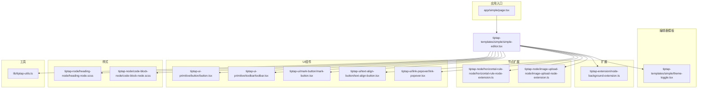
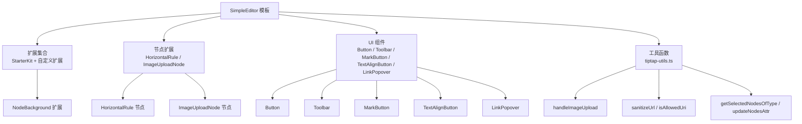
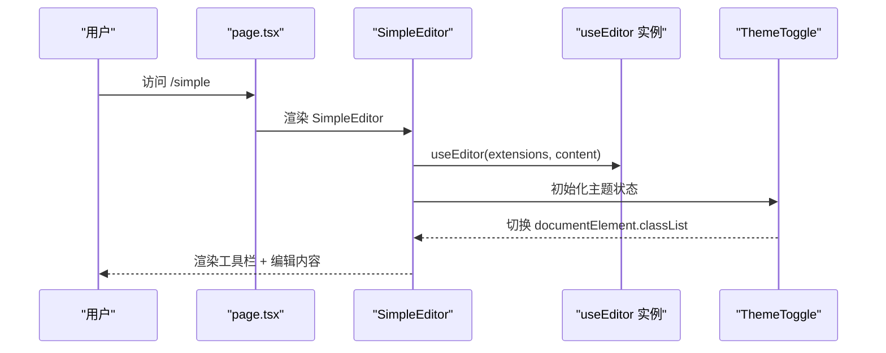
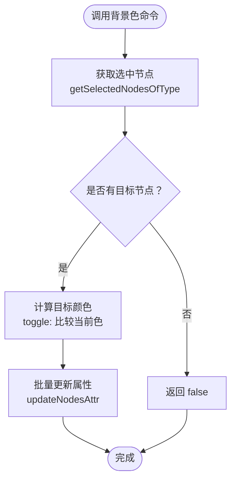
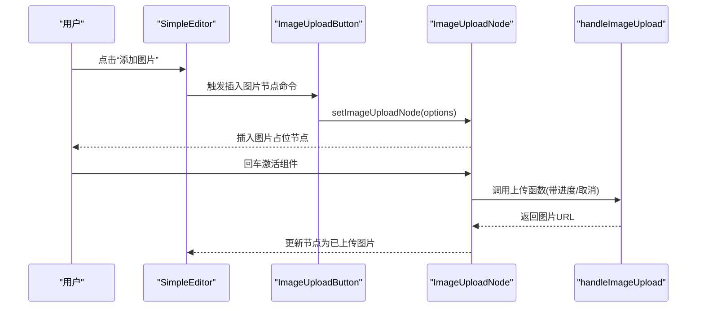
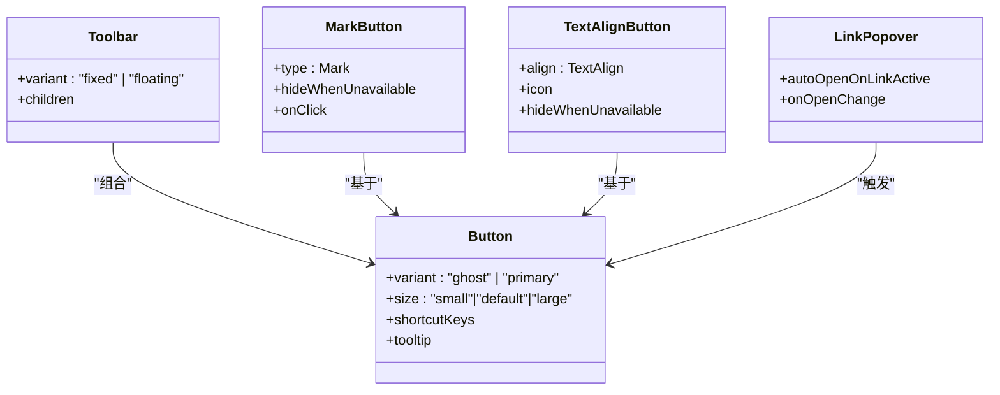
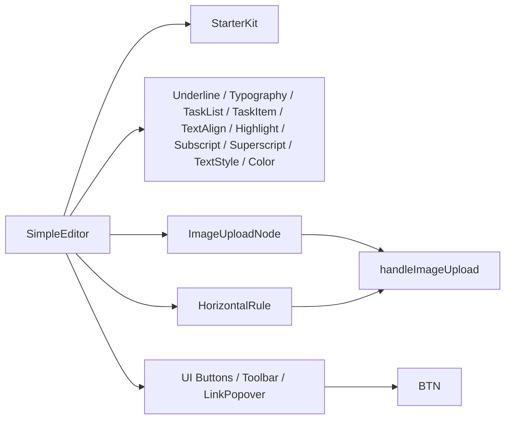

# 富文本编辑器

<cite>
**本文档引用的文件**
- [node-background-extension.ts](file://frontend/src/components/tiptap-extension/node-background-extension.ts)
- [simple-editor.tsx](file://frontend/src/components/tiptap-templates/simple/simple-editor.tsx)
- [theme-toggle.tsx](file://frontend/src/components/tiptap-templates/simple/theme-toggle.tsx)
- [tiptap-utils.ts](file://frontend/src/lib/tiptap-utils.ts)
- [horizontal-rule-node-extension.ts](file://frontend/src/components/tiptap-node/horizontal-rule-node/horizontal-rule-node-extension.ts)
- [image-upload-node-extension.ts](file://frontend/src/components/tiptap-node/image-upload-node/image-upload-node-extension.ts)
- [align-left-icon.tsx](file://frontend/src/components/tiptap-icons/align-left-icon.tsx)
- [toolbar.tsx](file://frontend/src/components/tiptap-ui-primitive/toolbar/toolbar.tsx)
- [button.tsx](file://frontend/src/components/tiptap-ui-primitive/button/button.tsx)
- [heading-node.scss](file://frontend/src/components/tiptap-node/heading-node/heading-node.scss)
- [code-block-node.scss](file://frontend/src/components/tiptap-node/code-block-node/code-block-node.scss)
- [mark-button.tsx](file://frontend/src/components/tiptap-ui/mark-button/mark-button.tsx)
- [text-align-button.tsx](file://frontend/src/components/tiptap-ui/text-align-button/text-align-button.tsx)
- [link-popover.tsx](file://frontend/src/components/tiptap-ui/link-popover/link-popover.tsx)
- [page.tsx](file://frontend/src/app/simple/page.tsx)
</cite>

## 目录
1. [简介](#简介)
2. [项目结构](#项目结构)
3. [核心组件](#核心组件)
4. [架构总览](#架构总览)
5. [详细组件分析](#详细组件分析)
6. [依赖关系分析](#依赖关系分析)
7. [性能考虑](#性能考虑)
8. [故障排查指南](#故障排查指南)
9. [结论](#结论)
10. [附录](#附录)

## 简介
本文件面向Infinite Game项目的富文本编辑器子系统，聚焦于Tiptap编辑器的集成与扩展实现，涵盖编辑器初始化、扩展开发、插件系统、节点类型（标题、段落、列表、代码块、引用、水平分隔线、图片上传）的配置与样式、图标系统的自定义与集成、编辑器模板（简单编辑器）设计与主题切换、使用示例与配置项（内容格式化、图片上传、链接处理），以及性能优化与用户体验改进建议。

## 项目结构
前端富文本编辑器相关代码主要位于frontend/src/components下，按“扩展/节点/图标/模板/UI组件”进行模块化组织；工具函数集中在frontend/src/lib/tiptap-utils.ts中，提供通用的编辑器操作、选择器、上传与安全校验能力；页面入口位于frontend/src/app/simple/page.tsx，渲染简单编辑器模板。

**图表来源**
- [simple-editor.tsx:197-245](file://frontend/src/components/tiptap-templates/simple/simple-editor.tsx#L197-L245)
- [theme-toggle.tsx:11-32](file://frontend/src/components/tiptap-templates/simple/theme-toggle.tsx#L11-L32)
- [node-background-extension.ts:49-150](file://frontend/src/components/tiptap-extension/node-background-extension.ts#L49-L150)
- [horizontal-rule-node-extension.ts:4-12](file://frontend/src/components/tiptap-node/horizontal-rule-node/horizontal-rule-node-extension.ts#L4-L12)
- [image-upload-node-extension.ts:66-160](file://frontend/src/components/tiptap-node/image-upload-node/image-upload-node-extension.ts#L66-L160)
- [button.tsx:46-99](file://frontend/src/components/tiptap-ui-primitive/button/button.tsx#L46-L99)
- [toolbar.tsx:82-101](file://frontend/src/components/tiptap-ui-primitive/toolbar/toolbar.tsx#L82-L101)
- [mark-button.tsx:48-122](file://frontend/src/components/tiptap-ui/mark-button/mark-button.tsx#L48-L122)
- [text-align-button.tsx:61-142](file://frontend/src/components/tiptap-ui/text-align-button/text-align-button.tsx#L61-L142)
- [link-popover.tsx:212-308](file://frontend/src/components/tiptap-ui/link-popover/link-popover.tsx#L212-L308)
- [tiptap-utils.ts:1-641](file://frontend/src/lib/tiptap-utils.ts#L1-L641)
- [page.tsx:1-6](file://frontend/src/app/simple/page.tsx#L1-L6)

**章节来源**
- [page.tsx:1-6](file://frontend/src/app/simple/page.tsx#L1-L6)
- [simple-editor.tsx:1-294](file://frontend/src/components/tiptap-templates/simple/simple-editor.tsx#L1-L294)

## 核心组件
- 编辑器模板：SimpleEditor负责初始化StarterKit、扩展与节点，并挂载工具栏与内容区。
- 节点扩展：HorizontalRule与ImageUploadNode分别扩展水平分割线与图片上传节点。
- 扩展：NodeBackground为多种节点类型添加背景色属性与命令。
- 图标系统：通过独立的SVG组件提供按钮图标，统一在UI组件中使用。
- UI组件：Button、Toolbar、MarkButton、TextAlignButton、LinkPopover等构成工具栏与交互层。
- 工具函数：提供上传、URL安全校验、节点属性更新、快捷键解析、选择器等通用能力。

**章节来源**
- [simple-editor.tsx:197-245](file://frontend/src/components/tiptap-templates/simple/simple-editor.tsx#L197-L245)
- [node-background-extension.ts:49-150](file://frontend/src/components/tiptap-extension/node-background-extension.ts#L49-L150)
- [horizontal-rule-node-extension.ts:4-12](file://frontend/src/components/tiptap-node/horizontal-rule-node/horizontal-rule-node-extension.ts#L4-L12)
- [image-upload-node-extension.ts:66-160](file://frontend/src/components/tiptap-node/image-upload-node/image-upload-node-extension.ts#L66-L160)
- [button.tsx:46-99](file://frontend/src/components/tiptap-ui-primitive/button/button.tsx#L46-L99)
- [toolbar.tsx:82-101](file://frontend/src/components/tiptap-ui-primitive/toolbar/toolbar.tsx#L82-L101)
- [mark-button.tsx:48-122](file://frontend/src/components/tiptap-ui/mark-button/mark-button.tsx#L48-L122)
- [text-align-button.tsx:61-142](file://frontend/src/components/tiptap-ui/text-align-button/text-align-button.tsx#L61-L142)
- [link-popover.tsx:212-308](file://frontend/src/components/tiptap-ui/link-popover/link-popover.tsx#L212-L308)
- [tiptap-utils.ts:361-388](file://frontend/src/lib/tiptap-utils.ts#L361-L388)

## 架构总览
编辑器采用“模板 + 扩展 + 节点 + UI组件 + 工具函数”的分层架构。模板层负责装配与上下文提供；扩展与节点层负责语义与行为；UI层负责交互与可访问性；工具层提供跨组件的通用能力。

**图表来源**
- [simple-editor.tsx:197-245](file://frontend/src/components/tiptap-templates/simple/simple-editor.tsx#L197-L245)
- [node-background-extension.ts:49-150](file://frontend/src/components/tiptap-extension/node-background-extension.ts#L49-L150)
- [horizontal-rule-node-extension.ts:4-12](file://frontend/src/components/tiptap-node/horizontal-rule-node/horizontal-rule-node-extension.ts#L4-L12)
- [image-upload-node-extension.ts:66-160](file://frontend/src/components/tiptap-node/image-upload-node/image-upload-node-extension.ts#L66-L160)
- [button.tsx:46-99](file://frontend/src/components/tiptap-ui-primitive/button/button.tsx#L46-L99)
- [toolbar.tsx:82-101](file://frontend/src/components/tiptap-ui-primitive/toolbar/toolbar.tsx#L82-L101)
- [mark-button.tsx:48-122](file://frontend/src/components/tiptap-ui/mark-button/mark-button.tsx#L48-L122)
- [text-align-button.tsx:61-142](file://frontend/src/components/tiptap-ui/text-align-button/text-align-button.tsx#L61-L142)
- [link-popover.tsx:212-308](file://frontend/src/components/tiptap-ui/link-popover/link-popover.tsx#L212-L308)
- [tiptap-utils.ts:361-388](file://frontend/src/lib/tiptap-utils.ts#L361-L388)

## 详细组件分析

### 编辑器初始化与模板
- 初始化：SimpleEditor通过useEditor创建编辑器实例，配置StarterKit（限制标题层级、禁用默认代码块与水平分隔线）、Typography、Underline、TaskList、TaskItem、TextAlign、Highlight、Subscript、Superscript、TextStyle、Color、HorizontalRule、ImageUploadNode等。
- 内容：从模板数据加载初始内容。
- 工具栏：桌面端固定工具栏，移动端支持主工具栏与高亮/链接两个子视图的切换。
- 主题：ThemeToggle基于系统偏好自动切换暗/亮模式。

**图表来源**
- [page.tsx:1-6](file://frontend/src/app/simple/page.tsx#L1-L6)
- [simple-editor.tsx:189-294](file://frontend/src/components/tiptap-templates/simple/simple-editor.tsx#L189-L294)
- [theme-toggle.tsx:11-32](file://frontend/src/components/tiptap-templates/simple/theme-toggle.tsx#L11-L32)

**章节来源**
- [simple-editor.tsx:197-245](file://frontend/src/components/tiptap-templates/simple/simple-editor.tsx#L197-L245)
- [simple-editor.tsx:258-294](file://frontend/src/components/tiptap-templates/simple/simple-editor.tsx#L258-L294)
- [theme-toggle.tsx:11-32](file://frontend/src/components/tiptap-templates/simple/theme-toggle.tsx#L11-L32)

### 扩展：节点背景色 NodeBackground
- 功能：为指定节点类型（段落、标题、引用、任务列表、有序/无序列表、表格单元）添加背景色属性，支持设置、移除、切换命令。
- 配置：可通过options.types控制节点类型，useStyle决定以内联样式或data属性存储颜色。
- 命令：set/unset/toggle三种命令，内部通过getSelectedNodesOfType与updateNodesAttr批量更新节点属性。

**图表来源**
- [node-background-extension.ts:104-149](file://frontend/src/components/tiptap-extension/node-background-extension.ts#L104-L149)
- [tiptap-utils.ts:567-612](file://frontend/src/lib/tiptap-utils.ts#L567-L612)
- [tiptap-utils.ts:480-518](file://frontend/src/lib/tiptap-utils.ts#L480-L518)

**章节来源**
- [node-background-extension.ts:49-150](file://frontend/src/components/tiptap-extension/node-background-extension.ts#L49-L150)
- [tiptap-utils.ts:567-612](file://frontend/src/lib/tiptap-utils.ts#L567-L612)
- [tiptap-utils.ts:480-518](file://frontend/src/lib/tiptap-utils.ts#L480-L518)

### 节点：水平分隔线 HorizontalRule
- 行为：重写renderHTML，输出div包裹hr并带data-type标识，便于样式与选择。
- 用途：在模板中禁用StarterKit默认水平分隔线，使用自定义节点扩展。

**章节来源**
- [horizontal-rule-node-extension.ts:4-12](file://frontend/src/components/tiptap-node/horizontal-rule-node/horizontal-rule-node-extension.ts#L4-L12)

### 节点：图片上传 ImageUploadNode
- 结构：原子节点，支持拖拽、选择；通过ReactNodeViewRenderer渲染组件。
- 配置：accept、limit、maxSize、upload、onError、onSuccess、HTMLAttributes等。
- 命令：setImageUploadNode用于插入节点。
- 键盘：在选中时按回车触发组件点击，便于唤起上传流程。
- 上传：handleImageUpload提供进度回调与取消信号，生产环境替换为实际上传逻辑。

**图表来源**
- [simple-editor.tsx:236-242](file://frontend/src/components/tiptap-templates/simple/simple-editor.tsx#L236-L242)
- [image-upload-node-extension.ts:119-160](file://frontend/src/components/tiptap-node/image-upload-node/image-upload-node-extension.ts#L119-L160)
- [tiptap-utils.ts:361-388](file://frontend/src/lib/tiptap-utils.ts#L361-L388)

**章节来源**
- [image-upload-node-extension.ts:66-160](file://frontend/src/components/tiptap-node/image-upload-node/image-upload-node-extension.ts#L66-L160)
- [tiptap-utils.ts:361-388](file://frontend/src/lib/tiptap-utils.ts#L361-L388)

### 图标系统
- 设计：每个图标为独立SVG组件，统一尺寸与类名，便于在按钮与菜单中复用。
- 使用：在按钮与弹出层组件中直接引入并作为children或图标属性使用。
- 示例：AlignLeftIcon展示基础SVG路径绘制方式。

**章节来源**
- [align-left-icon.tsx:5-36](file://frontend/src/components/tiptap-icons/align-left-icon.tsx#L5-L36)

### UI组件：工具栏与按钮
- Toolbar：提供分组、分隔符、键盘导航与焦点可见态管理，支持固定/浮动两种变体。
- Button：支持快捷键显示、提示气泡、不同尺寸与风格，统一样式与无障碍属性。
- MarkButton：封装常用格式化（粗体、斜体、删除线、代码、下划线、上/下标）的按钮逻辑。
- TextAlignButton：封装左对齐、居中、右对齐、两端对齐的按钮逻辑。
- LinkPopover：弹出式链接设置面板，支持输入、打开、移除链接，移动端适配。

**图表来源**
- [toolbar.tsx:82-101](file://frontend/src/components/tiptap-ui-primitive/toolbar/toolbar.tsx#L82-L101)
- [button.tsx:46-99](file://frontend/src/components/tiptap-ui-primitive/button/button.tsx#L46-L99)
- [mark-button.tsx:48-122](file://frontend/src/components/tiptap-ui/mark-button/mark-button.tsx#L48-L122)
- [text-align-button.tsx:61-142](file://frontend/src/components/tiptap-ui/text-align-button/text-align-button.tsx#L61-L142)
- [link-popover.tsx:212-308](file://frontend/src/components/tiptap-ui/link-popover/link-popover.tsx#L212-L308)

**章节来源**
- [toolbar.tsx:82-101](file://frontend/src/components/tiptap-ui-primitive/toolbar/toolbar.tsx#L82-L101)
- [button.tsx:46-99](file://frontend/src/components/tiptap-ui-primitive/button/button.tsx#L46-L99)
- [mark-button.tsx:48-122](file://frontend/src/components/tiptap-ui/mark-button/mark-button.tsx#L48-L122)
- [text-align-button.tsx:61-142](file://frontend/src/components/tiptap-ui/text-align-button/text-align-button.tsx#L61-L142)
- [link-popover.tsx:212-308](file://frontend/src/components/tiptap-ui/link-popover/link-popover.tsx#L212-L308)

### 节点样式：标题与代码块
- 标题样式：通过SCSS为h1-h4设置排版、间距与首行特殊处理，确保视觉层次清晰。
- 代码块样式：定义内联代码与代码块的配色变量，支持明/暗主题切换，保证对比度与可读性。

**章节来源**
- [heading-node.scss:1-46](file://frontend/src/components/tiptap-node/heading-node/heading-node.scss#L1-L46)
- [code-block-node.scss:1-55](file://frontend/src/components/tiptap-node/code-block-node/code-block-node.scss#L1-L55)

### 使用示例与配置项
- 内容格式化：通过MarkButton与TextAlignButton实现常用格式与对齐；NodeBackground扩展可为选定节点批量设置背景色。
- 图片上传：在SimpleEditor中配置ImageUploadNode，设置accept、maxSize、limit与upload回调；handleImageUpload提供进度与取消能力。
- 链接处理：LinkPopover提供输入、打开、移除链接的完整交互；sanitizeUrl与isAllowedUri保障URL安全性。

**章节来源**
- [simple-editor.tsx:236-242](file://frontend/src/components/tiptap-templates/simple/simple-editor.tsx#L236-L242)
- [tiptap-utils.ts:361-388](file://frontend/src/lib/tiptap-utils.ts#L361-L388)
- [link-popover.tsx:212-308](file://frontend/src/components/tiptap-ui/link-popover/link-popover.tsx#L212-L308)
- [tiptap-utils.ts:453-468](file://frontend/src/lib/tiptap-utils.ts#L453-L468)

## 依赖关系分析
- 模板依赖：SimpleEditor依赖StarterKit、Typography、Underline、TaskList、TaskItem、TextAlign、Highlight、Subscript、Superscript、TextStyle、Color、HorizontalRule、ImageUploadNode等扩展与节点。
- UI依赖：各按钮组件依赖Button与Tooltip等基础UI；LinkPopover依赖Popover、Card、Input等复合UI。
- 工具依赖：扩展与节点广泛使用tiptap-utils中的选择器、属性更新、上传与URL安全校验函数。

**图表来源**
- [simple-editor.tsx:197-245](file://frontend/src/components/tiptap-templates/simple/simple-editor.tsx#L197-L245)
- [image-upload-node-extension.ts:66-160](file://frontend/src/components/tiptap-node/image-upload-node/image-upload-node-extension.ts#L66-L160)
- [tiptap-utils.ts:361-388](file://frontend/src/lib/tiptap-utils.ts#L361-L388)

**章节来源**
- [simple-editor.tsx:197-245](file://frontend/src/components/tiptap-templates/simple/simple-editor.tsx#L197-L245)
- [tiptap-utils.ts:361-388](file://frontend/src/lib/tiptap-utils.ts#L361-L388)

## 性能考虑
- 渲染策略：SimpleEditor使用immediatelyRender=false延迟渲染，减少首屏压力。
- 选择器与更新：批量更新节点属性（updateNodesAttr）避免逐个节点操作带来的多次重绘。
- 上传优化：handleImageUpload支持AbortSignal与进度回调，便于中断与反馈；生产环境建议结合服务端上传与CDN缓存。
- 可访问性：Toolbar与Button组件内置焦点管理与无障碍属性，提升键盘导航体验。
- 主题切换：ThemeToggle仅切换根元素类名，避免全量重绘。

**章节来源**
- [simple-editor.tsx:197-207](file://frontend/src/components/tiptap-templates/simple/simple-editor.tsx#L197-L207)
- [tiptap-utils.ts:480-518](file://frontend/src/lib/tiptap-utils.ts#L480-L518)
- [tiptap-utils.ts:361-388](file://frontend/src/lib/tiptap-utils.ts#L361-L388)
- [theme-toggle.tsx:28-30](file://frontend/src/components/tiptap-templates/simple/theme-toggle.tsx#L28-L30)

## 故障排查指南
- 上传失败：检查handleImageUpload的错误回调与文件大小限制；确认accept与maxSize配置是否合理。
- 链接无效：使用sanitizeUrl与isAllowedUri校验输入协议，避免不安全或格式错误的URL。
- 节点属性未生效：确认NodeBackground的types配置与updateNodesAttr调用链；检查getSelectedNodesOfType是否正确识别目标节点。
- 快捷键显示异常：检查parseShortcutKeys与平台判断逻辑，确保在Mac与非Mac环境下符号一致。
- 移动端工具栏遮挡：根据useWindowSize与useCursorVisibility动态调整工具栏位置，避免覆盖光标。

**章节来源**
- [tiptap-utils.ts:361-388](file://frontend/src/lib/tiptap-utils.ts#L361-L388)
- [tiptap-utils.ts:453-468](file://frontend/src/lib/tiptap-utils.ts#L453-L468)
- [node-background-extension.ts:104-149](file://frontend/src/components/tiptap-extension/node-background-extension.ts#L104-L149)
- [tiptap-utils.ts:90-103](file://frontend/src/lib/tiptap-utils.ts#L90-L103)
- [simple-editor.tsx:247-250](file://frontend/src/components/tiptap-templates/simple/simple-editor.tsx#L247-L250)

## 结论
Infinite Game的富文本编辑器以Tiptap为核心，通过模板化装配、可扩展的节点与命令、完善的UI与图标体系、以及通用工具函数，实现了从基础格式化到高级交互（图片上传、链接处理、主题切换）的一体化解决方案。其模块化设计便于维护与扩展，同时在性能与可访问性方面提供了良好实践。

## 附录
- 快速开始
  - 在页面中引入SimpleEditor即可启用基础编辑器。
  - 如需自定义节点或扩展，参考HorizontalRule与ImageUploadNode的实现方式。
  - 图标系统通过独立SVG组件提供，可在任意按钮中复用。
- 最佳实践
  - 将上传逻辑与错误处理解耦，使用handleImageUpload的回调与AbortSignal。
  - 对外链URL进行协议白名单校验，防止XSS风险。
  - 使用NodeBackground扩展进行批量样式更新，避免逐节点操作。