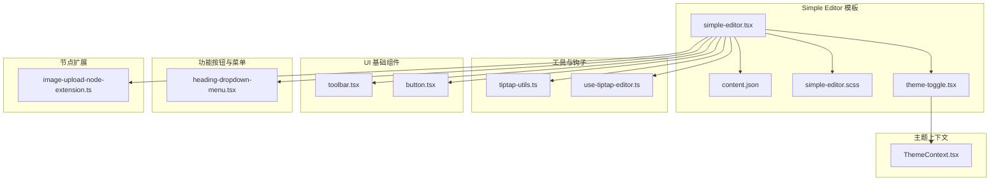
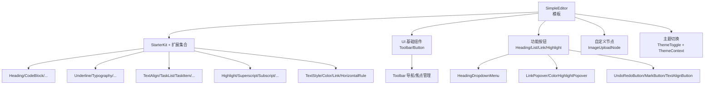
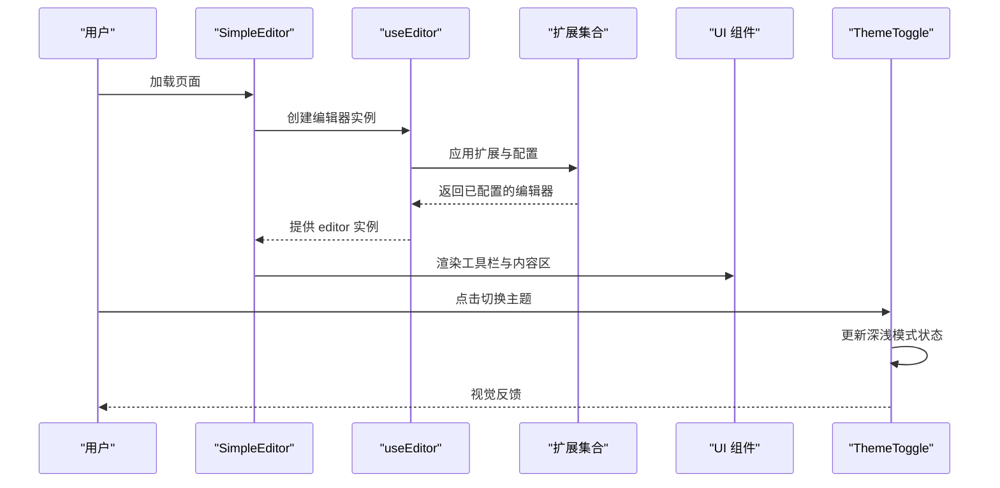
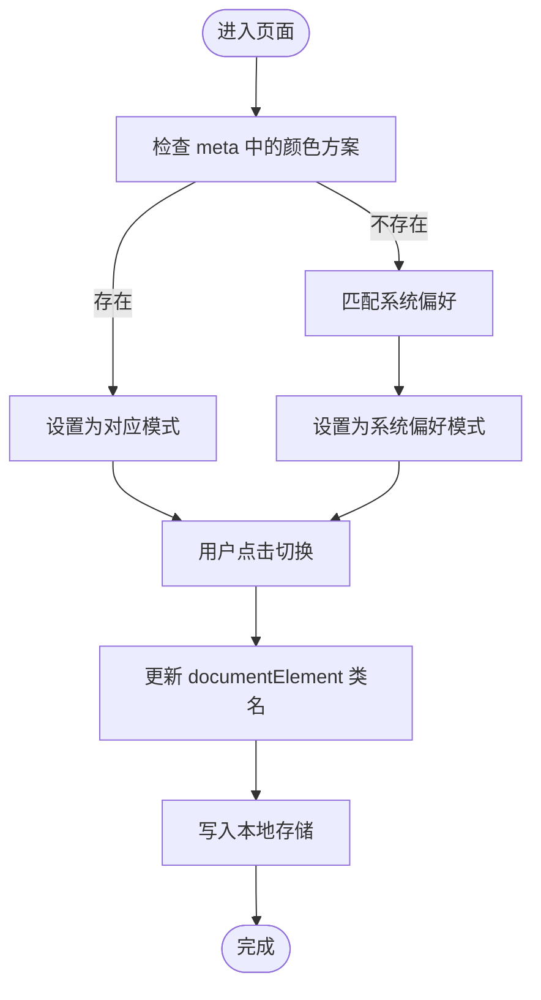
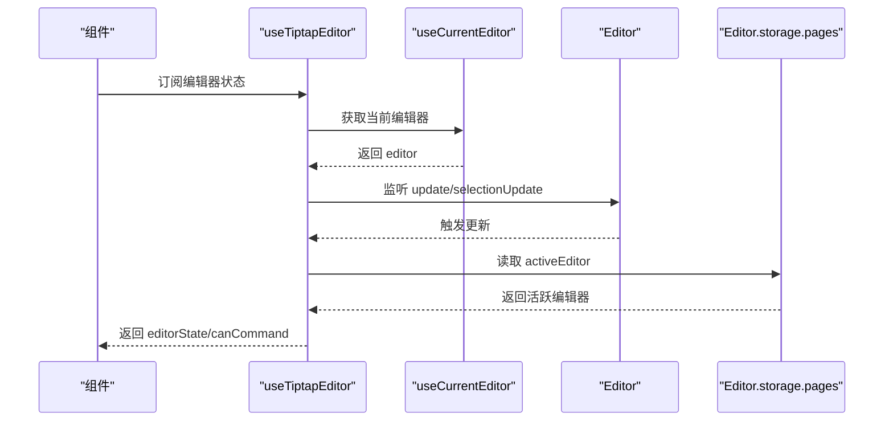
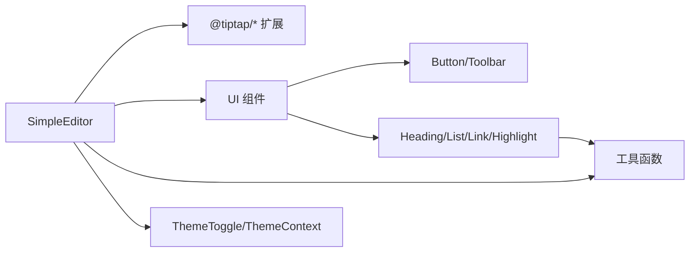

# 编辑器核心

<cite>
**本文引用的文件**
- [simple-editor.tsx](file://frontend/src/components/tiptap-templates/simple/simple-editor.tsx)
- [theme-toggle.tsx](file://frontend/src/components/tiptap-templates/simple/theme-toggle.tsx)
- [content.json](file://frontend/src/components/tiptap-templates/simple/data/content.json)
- [tiptap-utils.ts](file://frontend/src/lib/tiptap-utils.ts)
- [use-tiptap-editor.ts](file://frontend/src/hooks/use-tiptap-editor.ts)
- [simple-editor.scss](file://frontend/src/components/tiptap-templates/simple/simple-editor.scss)
- [toolbar.tsx](file://frontend/src/components/tiptap-ui-primitive/toolbar/toolbar.tsx)
- [button.tsx](file://frontend/src/components/tiptap-ui-primitive/button/button.tsx)
- [heading-dropdown-menu.tsx](file://frontend/src/components/tiptap-ui/heading-dropdown-menu/heading-dropdown-menu.tsx)
- [image-upload-node-extension.ts](file://frontend/src/components/tiptap-node/image-upload-node/image-upload-node-extension.ts)
- [ThemeContext.tsx](file://frontend/src/context/ThemeContext.tsx)
</cite>

## 目录
1. [简介](#简介)
2. [项目结构](#项目结构)
3. [核心组件](#核心组件)
4. [架构总览](#架构总览)
5. [详细组件分析](#详细组件分析)
6. [依赖关系分析](#依赖关系分析)
7. [性能考量](#性能考量)
8. [故障排查指南](#故障排查指南)
9. [结论](#结论)
10. [附录](#附录)

## 简介
本文件面向Infinite Game富文本编辑器“编辑器核心”模块，聚焦于Tiptap编辑器在前端的初始化配置、核心功能实现与主题切换机制；系统性阐述“Simple Editor”模板的设计理念、配置项与使用方式；并给出生命周期管理、状态管理与事件处理机制说明。同时提供编辑器核心API接口文档（内容获取、设置与监听）、性能优化策略与最佳实践，帮助开发者快速集成与深度定制。

## 项目结构
围绕编辑器核心的关键目录与文件如下：
- 模板层：Simple Editor模板及其数据与样式
- 工具层：通用Tiptap工具函数与钩子
- UI层：基础UI组件（工具栏、按钮等）与具体功能按钮（标题、列表、链接、高亮等）
- 节点扩展：自定义节点（如图片上传节点）
- 主题上下文：全局主题提供者

图表来源
- [simple-editor.tsx:1-294](file://frontend/src/components/tiptap-templates/simple/simple-editor.tsx#L1-L294)
- [theme-toggle.tsx:1-48](file://frontend/src/components/tiptap-templates/simple/theme-toggle.tsx#L1-L48)
- [content.json:1-478](file://frontend/src/components/tiptap-templates/simple/data/content.json#L1-L478)
- [simple-editor.scss:1-83](file://frontend/src/components/tiptap-templates/simple/simple-editor.scss#L1-L83)
- [tiptap-utils.ts:1-641](file://frontend/src/lib/tiptap-utils.ts#L1-L641)
- [use-tiptap-editor.ts:1-71](file://frontend/src/hooks/use-tiptap-editor.ts#L1-L71)
- [toolbar.tsx:1-124](file://frontend/src/components/tiptap-ui-primitive/toolbar/toolbar.tsx#L1-L124)
- [button.tsx:1-104](file://frontend/src/components/tiptap-ui-primitive/button/button.tsx#L1-L104)
- [heading-dropdown-menu.tsx:1-131](file://frontend/src/components/tiptap-ui/heading-dropdown-menu/heading-dropdown-menu.tsx#L1-L131)
- [image-upload-node-extension.ts:1-163](file://frontend/src/components/tiptap-node/image-upload-node/image-upload-node-extension.ts#L1-L163)
- [ThemeContext.tsx:1-74](file://frontend/src/context/ThemeContext.tsx#L1-L74)

章节来源
- [simple-editor.tsx:1-294](file://frontend/src/components/tiptap-templates/simple/simple-editor.tsx#L1-L294)
- [simple-editor.scss:1-83](file://frontend/src/components/tiptap-templates/simple/simple-editor.scss#L1-L83)

## 核心组件
- Simple Editor 模板：基于Tiptap的轻量级富文本编辑器，内置常用格式化、列表、任务清单、链接、高亮、上标/下标、对齐、水平分割线与图片上传节点等能力，并提供移动端适配与主题切换。
- 主题切换：通过独立的ThemeToggle组件与全局ThemeContext配合，支持系统偏好检测与手动切换。
- 工具与钩子：提供统一的Tiptap工具函数（快捷键格式化、节点查找、选择范围判断、URL安全校验、节点属性批量更新等），以及useTiptapEditor用于跨页面/多编辑器场景的状态与命令可用性管理。
- UI基础与功能按钮：封装工具栏、分隔条、按钮等基础组件，并提供标题下拉菜单、链接弹窗、高亮弹窗、撤销重做等交互按钮。
- 自定义节点：图片上传节点扩展，支持限制数量、大小、类型与上传回调。

章节来源
- [simple-editor.tsx:189-294](file://frontend/src/components/tiptap-templates/simple/simple-editor.tsx#L189-L294)
- [theme-toggle.tsx:11-48](file://frontend/src/components/tiptap-templates/simple/theme-toggle.tsx#L11-L48)
- [tiptap-utils.ts:1-641](file://frontend/src/lib/tiptap-utils.ts#L1-L641)
- [use-tiptap-editor.ts:13-71](file://frontend/src/hooks/use-tiptap-editor.ts#L13-L71)
- [toolbar.tsx:82-124](file://frontend/src/components/tiptap-ui-primitive/toolbar/toolbar.tsx#L82-L124)
- [button.tsx:46-104](file://frontend/src/components/tiptap-ui-primitive/button/button.tsx#L46-L104)
- [heading-dropdown-menu.tsx:44-131](file://frontend/src/components/tiptap-ui/heading-dropdown-menu/heading-dropdown-menu.tsx#L44-L131)
- [image-upload-node-extension.ts:66-163](file://frontend/src/components/tiptap-node/image-upload-node/image-upload-node-extension.ts#L66-L163)

## 架构总览
编辑器采用“模板 + 扩展 + 工具 + UI”的分层设计：
- 模板层负责编辑器实例初始化、扩展装配与UI布局；
- 扩展层提供节点与标记（mark）能力；
- 工具层提供通用逻辑与辅助函数；
- UI层提供可复用的基础组件与功能按钮；
- 主题层提供深浅色模式切换与全局样式变量。

图表来源
- [simple-editor.tsx:197-245](file://frontend/src/components/tiptap-templates/simple/simple-editor.tsx#L197-L245)
- [toolbar.tsx:16-80](file://frontend/src/components/tiptap-ui-primitive/toolbar/toolbar.tsx#L16-L80)
- [heading-dropdown-menu.tsx:62-75](file://frontend/src/components/tiptap-ui/heading-dropdown-menu/heading-dropdown-menu.tsx#L62-L75)
- [image-upload-node-extension.ts:66-163](file://frontend/src/components/tiptap-node/image-upload-node/image-upload-node-extension.ts#L66-L163)
- [ThemeContext.tsx:16-40](file://frontend/src/context/ThemeContext.tsx#L16-L40)

## 详细组件分析

### Simple Editor 模板
- 初始化配置
  - 使用useEditor创建编辑器实例，配置立即渲染策略、编辑器属性（自动完成、标签等）、扩展集合与初始内容。
  - 扩展集合包含StarterKit（可按需关闭某些默认块级节点）、Link、Underline、Typography、TextAlign、TaskList/TaskItem、Highlight、Superscript/Subscript、TextStyle/Color、HorizontalRule与ImageUploadNode。
  - 初始内容来自content.json，包含标题、段落、代码块、引用、列表、任务清单、水平分割线与占位图片等示例。
- 移动端适配
  - 通过断点检测与光标可见性钩子动态调整工具栏位置与显示模式，主工具栏与高亮/链接弹出面板在移动端切换。
- 主题切换
  - 集成ThemeToggle组件，支持系统偏好检测与手动切换，通过根元素类名控制深浅色模式。

图表来源
- [simple-editor.tsx:189-294](file://frontend/src/components/tiptap-templates/simple/simple-editor.tsx#L189-L294)
- [theme-toggle.tsx:11-48](file://frontend/src/components/tiptap-templates/simple/theme-toggle.tsx#L11-L48)

章节来源
- [simple-editor.tsx:197-245](file://frontend/src/components/tiptap-templates/simple/simple-editor.tsx#L197-L245)
- [content.json:1-478](file://frontend/src/components/tiptap-templates/simple/data/content.json#L1-L478)
- [simple-editor.scss:57-83](file://frontend/src/components/tiptap-templates/simple/simple-editor.scss#L57-L83)

### 主题切换机制
- ThemeToggle
  - 通过媒体查询监听系统偏好，初始化时读取meta或系统偏好决定初始模式。
  - 切换时通过给documentElement添加/移除“dark”类名驱动CSS变量与样式变化。
- 全局ThemeContext
  - 提供Ant Design主题算法与Token配置，支持本地存储持久化与SSR兼容。
  - 与ThemeToggle互补：前者专注编辑器内浅色/深色切换，后者负责应用整体主题风格。

图表来源
- [theme-toggle.tsx:14-32](file://frontend/src/components/tiptap-templates/simple/theme-toggle.tsx#L14-L32)
- [ThemeContext.tsx:16-40](file://frontend/src/context/ThemeContext.tsx#L16-L40)

章节来源
- [theme-toggle.tsx:11-48](file://frontend/src/components/tiptap-templates/simple/theme-toggle.tsx#L11-L48)
- [ThemeContext.tsx:16-74](file://frontend/src/context/ThemeContext.tsx#L16-L74)

### 编辑器模板系统：Simple Editor 设计与实现
- 设计原则
  - 可插拔扩展：通过StarterKit与自定义扩展组合，按需启用/禁用功能。
  - 响应式UI：移动端与桌面端差异化布局与交互。
  - 可定制样式：SCSS变量与暗色模式类名，便于主题定制。
- 关键配置
  - 扩展：Heading级别、CodeBlock/HorizontalRule开关、TextAlign作用域、TaskList嵌套、Highlight多色支持、TextStyle/Color、ImageUploadNode参数。
  - 编辑器属性：自动完成/大小写/首字母关闭，无障碍标签，容器类名。
  - 初始内容：content.json提供示例文档结构，覆盖常见节点类型。
- 使用方法
  - 在页面中直接引入SimpleEditor组件即可获得完整编辑器体验。
  - 如需自定义扩展或样式，可在useEditor调用处追加或覆盖配置。

章节来源
- [simple-editor.tsx:197-245](file://frontend/src/components/tiptap-templates/simple/simple-editor.tsx#L197-L245)
- [content.json:1-478](file://frontend/src/components/tiptap-templates/simple/data/content.json#L1-L478)
- [simple-editor.scss:1-83](file://frontend/src/components/tiptap-templates/simple/simple-editor.scss#L1-L83)

### 生命周期管理、状态管理与事件处理
- 生命周期
  - 初始化：useEditor在组件挂载时创建编辑器实例，应用扩展与内容。
  - 卸载：编辑器销毁事件触发清理逻辑。
- 状态管理
  - useTiptapEditor：在多编辑器/分页场景中，从主编辑器storage中提取当前活跃编辑器，订阅update与selectionUpdate事件，暴露editorState与canCommand。
  - 工具函数：提供节点查找、选择范围判断、属性批量更新等能力，便于在业务侧维护状态一致性。
- 事件处理
  - 工具栏导航：Toolbar内部通过MutationObserver收集按钮项，结合键盘导航与焦点管理提升可访问性。
  - 图片上传节点：Enter键触发NodeView内部交互，提升移动端可用性。

图表来源
- [use-tiptap-editor.ts:13-71](file://frontend/src/hooks/use-tiptap-editor.ts#L13-L71)

章节来源
- [use-tiptap-editor.ts:13-71](file://frontend/src/hooks/use-tiptap-editor.ts#L13-L71)
- [toolbar.tsx:16-80](file://frontend/src/components/tiptap-ui-primitive/toolbar/toolbar.tsx#L16-L80)
- [image-upload-node-extension.ts:135-159](file://frontend/src/components/tiptap-node/image-upload-node/image-upload-node-extension.ts#L135-L159)

### 编辑器核心API接口文档
以下为编辑器核心提供的关键API与行为说明（以路径引用代替具体代码）：
- 内容获取
  - 获取编辑器内容：通过编辑器实例的state.doc序列化为JSON结构，或使用特定序列化工具导出所需格式。
  - 获取选区信息：利用selection对象与工具函数判断当前选区类型、范围与可转换节点类型。
- 内容设置
  - 设置初始内容：在useEditor配置中传入content或通过命令插入内容。
  - 动态更新：使用事务（Transaction）与setNodeMarkup/insertContent等命令更新节点属性或插入新节点。
- 监听与事件
  - update事件：内容变更时触发，可用于同步外部状态或持久化。
  - selectionUpdate事件：选区变化时触发，可用于更新工具栏按钮状态。
  - destroy事件：编辑器销毁时清理资源。
- 工具函数
  - 节点与属性：findNodeAtPosition、findNodePosition、updateNodesAttr、getSelectedNodesOfType、getSelectedBlockNodes。
  - 选择范围：selectCurrentBlockContent、selectionWithinConvertibleTypes、isNodeTypeSelected。
  - 安全与校验：sanitizeUrl、isAllowedUri、isMarkInSchema、isNodeInSchema、isExtensionAvailable。
  - 平台与可访问性：parseShortcutKeys、formatShortcutKey、isMac、SR_ONLY。
- 图片上传
  - 上传流程：ImageUploadNode扩展提供upload回调，工具函数handleImageUpload支持进度回调与取消信号。
  - 参数：accept、limit、maxSize、onError/onSuccess等。

章节来源
- [simple-editor.tsx:197-245](file://frontend/src/components/tiptap-templates/simple/simple-editor.tsx#L197-L245)
- [tiptap-utils.ts:361-388](file://frontend/src/lib/tiptap-utils.ts#L361-L388)
- [image-upload-node-extension.ts:66-163](file://frontend/src/components/tiptap-node/image-upload-node/image-upload-node-extension.ts#L66-L163)
- [use-tiptap-editor.ts:23-52](file://frontend/src/hooks/use-tiptap-editor.ts#L23-L52)

### UI组件与交互
- 工具栏
  - Toolbar：支持固定/浮动两种变体，内置键盘导航与焦点可见性标记。
  - ToolbarGroup/ToolbarSeparator：用于分组与分隔按钮，提升可读性与可访问性。
- 按钮
  - Button：支持提示、快捷键展示、Ghost/Primary样式与尺寸。
- 功能按钮
  - HeadingDropdownMenu：根据编辑器状态显示/隐藏，支持多级标题切换。
  - LinkPopover/ColorHighlightPopover：弹窗式交互，支持快捷键与无障碍标签。
  - UndoRedoButton/MarkButton/TextAlignButton：基础格式化按钮，状态由编辑器命令可用性决定。

章节来源
- [toolbar.tsx:82-124](file://frontend/src/components/tiptap-ui-primitive/toolbar/toolbar.tsx#L82-L124)
- [button.tsx:46-104](file://frontend/src/components/tiptap-ui-primitive/button/button.tsx#L46-L104)
- [heading-dropdown-menu.tsx:44-131](file://frontend/src/components/tiptap-ui/heading-dropdown-menu/heading-dropdown-menu.tsx#L44-L131)

## 依赖关系分析
- 模块耦合
  - SimpleEditor对扩展、UI组件、工具函数与主题组件存在直接依赖；通过useEditor集中管理生命周期与状态。
  - useTiptapEditor作为横切关注点，解耦多编辑器场景下的状态同步。
- 外部依赖
  - @tiptap/react/@tiptap/pm：编辑器内核与协议模型。
  - @tiptap/starter-kit、@tiptap/extension-*：官方扩展库。
  - Ant Design：全局主题提供者（ThemeContext）。
- 潜在循环依赖
  - 当前结构以模板/工具/UI分层为主，未见明显循环导入；注意扩展与组件间避免互相引用。

图表来源
- [simple-editor.tsx:1-78](file://frontend/src/components/tiptap-templates/simple/simple-editor.tsx#L1-L78)
- [tiptap-utils.ts:1-641](file://frontend/src/lib/tiptap-utils.ts#L1-L641)
- [ThemeContext.tsx:1-74](file://frontend/src/context/ThemeContext.tsx#L1-L74)

章节来源
- [simple-editor.tsx:1-78](file://frontend/src/components/tiptap-templates/simple/simple-editor.tsx#L1-L78)
- [tiptap-utils.ts:1-641](file://frontend/src/lib/tiptap-utils.ts#L1-L641)
- [ThemeContext.tsx:1-74](file://frontend/src/context/ThemeContext.tsx#L1-L74)

## 性能考量
- 渲染策略
  - immediatelyRender设为false，延迟渲染以减少首屏压力；在需要时再渲染编辑器内容。
- 事件订阅
  - 仅在必要时订阅update/selectionUpdate事件，避免频繁重渲染；在组件卸载时及时解绑。
- 选择与遍历
  - 使用高效的节点遍历与缓存策略（如MutationObserver收集按钮项），避免在每次渲染中重复计算。
- 上传与网络
  - 图片上传建议在生产环境替换为真实后端接口，避免演示阶段的模拟上传；合理设置超时与取消信号。
- 样式与主题
  - 通过CSS变量与暗色类名切换，避免运行时大量DOM样式重排；尽量减少不必要的重绘。

## 故障排查指南
- 编辑器不渲染或空白
  - 检查useEditor配置是否正确，确认扩展加载顺序与版本兼容。
  - 确认initialContent格式符合Tiptap Schema要求。
- 工具栏不可用或按钮无响应
  - 检查useTiptapEditor返回的canCommand是否为true；确认编辑器已正确初始化。
  - 确认按钮组件绑定的命令名称与扩展一致。
- 图片上传失败
  - 检查文件大小与类型限制；确认upload回调实现与错误处理。
  - 若使用AbortSignal，请确保在取消时正确抛出异常。
- 主题切换无效
  - 检查ThemeToggle是否正确更新documentElement类名；确认ThemeContext已包裹应用根节点。
- 快捷键无效
  - 检查parseShortcutKeys与平台识别逻辑；确认按钮tooltip中快捷键显示正常。

章节来源
- [simple-editor.tsx:197-245](file://frontend/src/components/tiptap-templates/simple/simple-editor.tsx#L197-L245)
- [tiptap-utils.ts:361-388](file://frontend/src/lib/tiptap-utils.ts#L361-L388)
- [theme-toggle.tsx:28-32](file://frontend/src/components/tiptap-templates/simple/theme-toggle.tsx#L28-L32)
- [ThemeContext.tsx:31-40](file://frontend/src/context/ThemeContext.tsx#L31-L40)

## 结论
Infinite Game的编辑器核心以Simple Editor模板为核心，结合丰富的Tiptap扩展、可复用UI组件与完善的工具函数，提供了开箱即用且易于扩展的富文本编辑能力。通过useTiptapEditor实现跨编辑器状态管理，借助ThemeToggle与ThemeContext实现主题切换，配合一系列性能优化与故障排查建议，能够满足从入门到进阶的多种使用场景。

## 附录
- 最佳实践
  - 将扩展配置集中在useEditor中，便于统一管理与调试。
  - 对外暴露受控的API（如setContent/getContent），避免直接操作编辑器实例。
  - 在移动端优先保证工具栏与内容区的可触达性与可读性。
  - 对上传与网络请求进行超时与取消控制，提升用户体验。
  - 使用CSS变量与暗色类名统一主题风格，减少样式冲突。