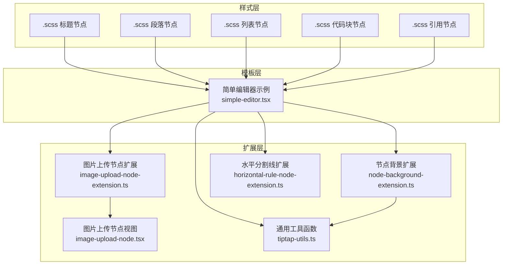
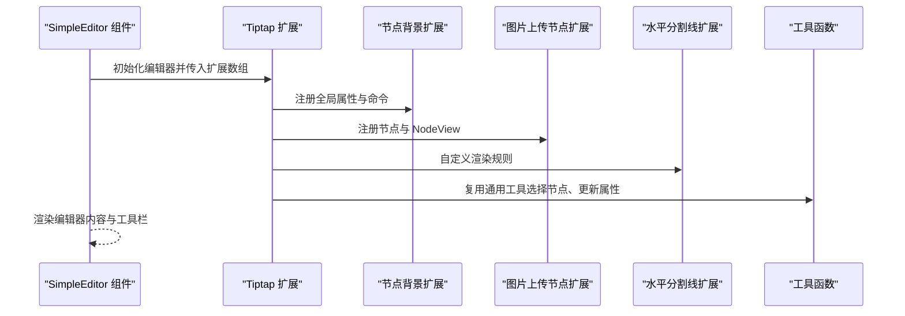
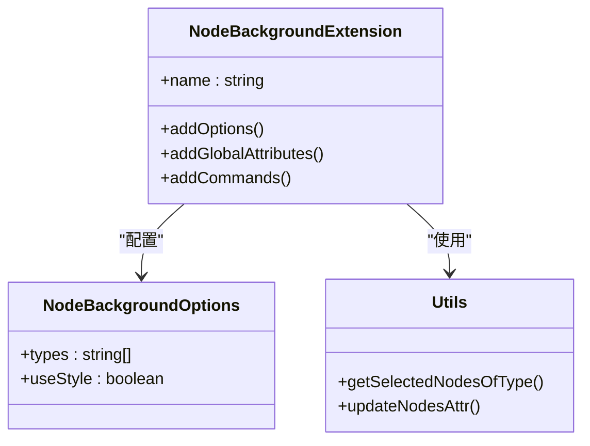
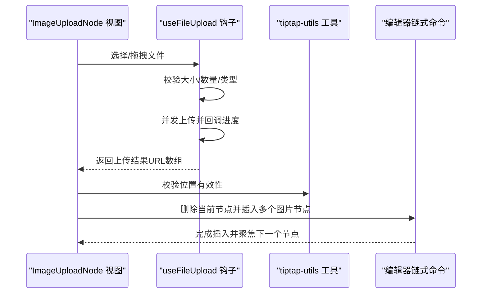
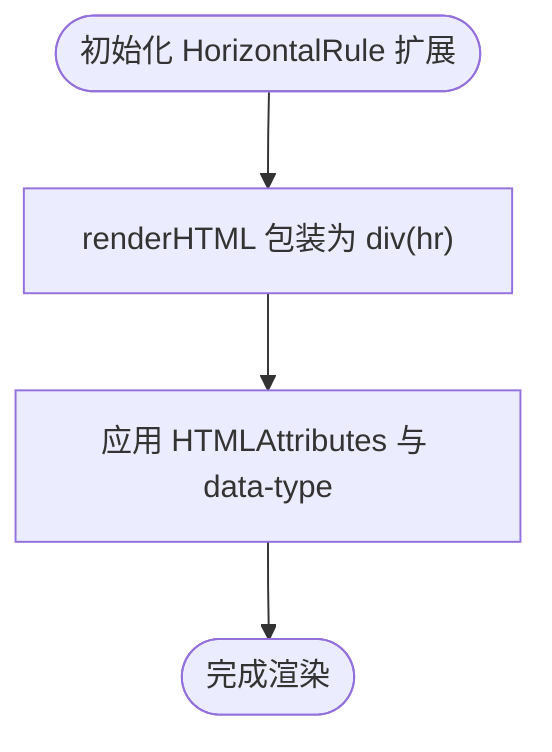
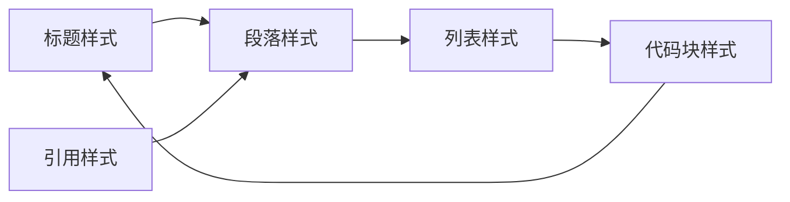
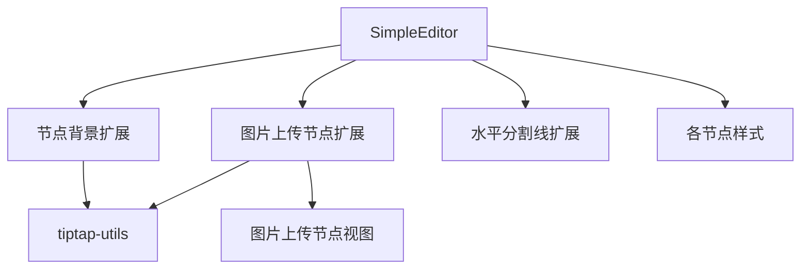

# 节点系统

<cite>
**本文档引用的文件**
- [node-background-extension.ts](file://frontend/src/components/tiptap-extension/node-background-extension.ts)
- [tiptap-utils.ts](file://frontend/src/lib/tiptap-utils.ts)
- [blockquote-node.scss](file://frontend/src/components/tiptap-node/blockquote-node/blockquote-node.scss)
- [code-block-node.scss](file://frontend/src/components/tiptap-node/code-block-node/code-block-node.scss)
- [heading-node.scss](file://frontend/src/components/tiptap-node/heading-node/heading-node.scss)
- [list-node.scss](file://frontend/src/components/tiptap-node/list-node/list-node.scss)
- [paragraph-node.scss](file://frontend/src/components/tiptap-node/paragraph-node/paragraph-node.scss)
- [horizontal-rule-node-extension.ts](file://frontend/src/components/tiptap-node/horizontal-rule-node/horizontal-rule-node-extension.ts)
- [image-upload-node-extension.ts](file://frontend/src/components/tiptap-node/image-upload-node/image-upload-node-extension.ts)
- [image-upload-node.tsx](file://frontend/src/components/tiptap-node/image-upload-node/image-upload-node.tsx)
- [simple-editor.tsx](file://frontend/src/components/tiptap-templates/simple/simple-editor.tsx)
</cite>

## 目录
1. [简介](#简介)
2. [项目结构](#项目结构)
3. [核心组件](#核心组件)
4. [架构总览](#架构总览)
5. [详细组件分析](#详细组件分析)
6. [依赖关系分析](#依赖关系分析)
7. [性能考量](#性能考量)
8. [故障排查指南](#故障排查指南)
9. [结论](#结论)
10. [附录](#附录)

## 简介
本文件面向 Infinite Game 富文本编辑器的“节点系统”，系统性梳理并说明以下内容：
- 各类编辑器节点（标题、段落、列表、代码块、引用、水平分割线、图片上传节点）的配置与样式实现
- 节点扩展机制：如何创建、注册与渲染自定义节点
- 节点背景扩展：背景色属性的解析、渲染与命令控制
- 使用示例与配置项：节点属性、样式定制与交互行为
- 扩展指南与性能优化建议

## 项目结构
节点系统主要由三部分组成：
- 样式层：各节点对应的 SCSS 文件，负责视觉表现与主题适配
- 扩展层：Tiptap 扩展与工具函数，负责节点注册、命令、属性解析与渲染
- 模板层：示例编辑器，演示如何组合扩展与节点

**图表来源**
- [simple-editor.tsx:189-245](file://frontend/src/components/tiptap-templates/simple/simple-editor.tsx#L189-L245)
- [node-background-extension.ts:49-151](file://frontend/src/components/tiptap-extension/node-background-extension.ts#L49-L151)
- [image-upload-node-extension.ts:66-163](file://frontend/src/components/tiptap-node/image-upload-node/image-upload-node-extension.ts#L66-L163)
- [image-upload-node.tsx:436-555](file://frontend/src/components/tiptap-node/image-upload-node/image-upload-node.tsx#L436-L555)
- [horizontal-rule-node-extension.ts:4-15](file://frontend/src/components/tiptap-node/horizontal-rule-node/horizontal-rule-node-extension.ts#L4-L15)
- [tiptap-utils.ts:480-518](file://frontend/src/lib/tiptap-utils.ts#L480-L518)

**章节来源**
- [simple-editor.tsx:189-245](file://frontend/src/components/tiptap-templates/simple/simple-editor.tsx#L189-L245)

## 核心组件
- 节点背景扩展：为指定节点类型添加背景色属性，支持设置、取消与切换命令，并可选择以内联样式或 data 属性方式渲染
- 图片上传节点：基于 React NodeView 的可拖拽/点击上传节点，支持多文件并发上传、进度反馈、错误处理与后续替换为标准图片节点
- 水平分割线节点：自定义渲染为 div + hr 的结构，便于样式控制
- 文本节点样式：标题、段落、列表、代码块、引用等节点的样式规范与暗色模式适配

**章节来源**
- [node-background-extension.ts:17-28](file://frontend/src/components/tiptap-extension/node-background-extension.ts#L17-L28)
- [node-background-extension.ts:49-151](file://frontend/src/components/tiptap-extension/node-background-extension.ts#L49-L151)
- [image-upload-node-extension.ts:66-163](file://frontend/src/components/tiptap-node/image-upload-node/image-upload-node-extension.ts#L66-L163)
- [image-upload-node.tsx:436-555](file://frontend/src/components/tiptap-node/image-upload-node/image-upload-node.tsx#L436-L555)
- [horizontal-rule-node-extension.ts:4-15](file://frontend/src/components/tiptap-node/horizontal-rule-node/horizontal-rule-node-extension.ts#L4-L15)
- [heading-node.scss:1-46](file://frontend/src/components/tiptap-node/heading-node/heading-node.scss#L1-L46)
- [paragraph-node.scss:1-274](file://frontend/src/components/tiptap-node/paragraph-node/paragraph-node.scss#L1-L274)
- [list-node.scss:1-209](file://frontend/src/components/tiptap-node/list-node/list-node.scss#L1-L209)
- [code-block-node.scss:1-55](file://frontend/src/components/tiptap-node/code-block-node/code-block-node.scss#L1-L55)
- [blockquote-node.scss:1-38](file://frontend/src/components/tiptap-node/blockquote-node/blockquote-node.scss#L1-L38)

## 架构总览
下图展示编辑器初始化时的扩展装配与节点渲染流程。

**图表来源**
- [simple-editor.tsx:197-245](file://frontend/src/components/tiptap-templates/simple/simple-editor.tsx#L197-L245)
- [node-background-extension.ts:68-102](file://frontend/src/components/tiptap-extension/node-background-extension.ts#L68-L102)
- [image-upload-node-extension.ts:115-130](file://frontend/src/components/tiptap-node/image-upload-node/image-upload-node-extension.ts#L115-L130)
- [horizontal-rule-node-extension.ts:4-12](file://frontend/src/components/tiptap-node/horizontal-rule-node/horizontal-rule-node-extension.ts#L4-L12)
- [tiptap-utils.ts:567-612](file://frontend/src/lib/tiptap-utils.ts#L567-L612)

## 详细组件分析

### 节点背景扩展（NodeBackground）
该扩展为一组节点类型添加背景色属性，支持通过命令进行设置、取消与切换；同时支持以内联样式或 data 属性方式渲染，便于主题与持久化。

- 配置项
  - 支持节点类型：段落、标题、引用、任务列表、有序/无序列表、表格单元格等
  - useStyle：是否以内联样式输出背景色
- 命令
  - 设置背景色：setNodeBackgroundColor(color)
  - 取消背景色：unsetNodeBackgroundColor()
  - 切换背景色：toggleNodeBackgroundColor(color)
- 解析与渲染
  - 解析顺序：优先读取内联样式，其次读取 data 属性
  - 渲染方式：根据 useStyle 决定 style 或 data 属性输出

**图表来源**
- [node-background-extension.ts:17-28](file://frontend/src/components/tiptap-extension/node-background-extension.ts#L17-L28)
- [node-background-extension.ts:49-151](file://frontend/src/components/tiptap-extension/node-background-extension.ts#L49-L151)
- [tiptap-utils.ts:567-612](file://frontend/src/lib/tiptap-utils.ts#L567-L612)
- [tiptap-utils.ts:480-518](file://frontend/src/lib/tiptap-utils.ts#L480-L518)

**章节来源**
- [node-background-extension.ts:49-151](file://frontend/src/components/tiptap-extension/node-background-extension.ts#L49-L151)
- [tiptap-utils.ts:480-518](file://frontend/src/lib/tiptap-utils.ts#L480-L518)
- [tiptap-utils.ts:567-612](file://frontend/src/lib/tiptap-utils.ts#L567-L612)

### 图片上传节点（ImageUploadNode）
这是一个基于 React NodeView 的块级节点，提供拖拽/点击选择文件、并发上传、进度反馈、错误处理与成功后自动替换为标准图片节点的能力。

- 关键能力
  - 上传限制：最大文件数、单文件大小、可接受类型
  - 上传过程：进度回调、错误回调、成功回调
  - 替换逻辑：删除当前 imageUpload 节点，插入对应数量的图片节点
- 交互细节
  - Enter 键触发选中状态下的上传组件
  - 支持清空全部上传项与逐项移除

**图表来源**
- [image-upload-node.tsx:85-213](file://frontend/src/components/tiptap-node/image-upload-node/image-upload-node.tsx#L85-L213)
- [image-upload-node.tsx:436-555](file://frontend/src/components/tiptap-node/image-upload-node/image-upload-node.tsx#L436-L555)
- [tiptap-utils.ts:138-163](file://frontend/src/lib/tiptap-utils.ts#L138-L163)

**章节来源**
- [image-upload-node-extension.ts:66-163](file://frontend/src/components/tiptap-node/image-upload-node/image-upload-node-extension.ts#L66-L163)
- [image-upload-node.tsx:436-555](file://frontend/src/components/tiptap-node/image-upload-node/image-upload-node.tsx#L436-L555)
- [tiptap-utils.ts:138-163](file://frontend/src/lib/tiptap-utils.ts#L138-L163)

### 水平分割线节点（HorizontalRule）
该节点扩展将默认的 hr 节点包装为一个带 data-type 的 div 结构，便于统一的样式控制与主题适配。

**图表来源**
- [horizontal-rule-node-extension.ts:4-12](file://frontend/src/components/tiptap-node/horizontal-rule-node/horizontal-rule-node-extension.ts#L4-L12)

**章节来源**
- [horizontal-rule-node-extension.ts:4-15](file://frontend/src/components/tiptap-node/horizontal-rule-node/horizontal-rule-node-extension.ts#L4-L15)

### 文本节点样式（标题/段落/列表/代码块/引用）
- 标题节点：控制各级标题的间距、字号与权重，避免首行外边距叠加
- 段落节点：统一段间距、选区高亮、占位符、协作光标与链接样式
- 列表节点：支持嵌套样式、任务列表勾选态与复选框交互
- 代码块节点：内联代码与代码块的背景、边框、字体与圆角
- 引用节点：左侧强调色条、暗色模式变量覆盖

**图表来源**
- [heading-node.scss:1-46](file://frontend/src/components/tiptap-node/heading-node/heading-node.scss#L1-L46)
- [paragraph-node.scss:1-274](file://frontend/src/components/tiptap-node/paragraph-node/paragraph-node.scss#L1-L274)
- [list-node.scss:1-209](file://frontend/src/components/tiptap-node/list-node/list-node.scss#L1-L209)
- [code-block-node.scss:1-55](file://frontend/src/components/tiptap-node/code-block-node/code-block-node.scss#L1-L55)
- [blockquote-node.scss:1-38](file://frontend/src/components/tiptap-node/blockquote-node/blockquote-node.scss#L1-L38)

**章节来源**
- [heading-node.scss:1-46](file://frontend/src/components/tiptap-node/heading-node/heading-node.scss#L1-L46)
- [paragraph-node.scss:1-274](file://frontend/src/components/tiptap-node/paragraph-node/paragraph-node.scss#L1-L274)
- [list-node.scss:1-209](file://frontend/src/components/tiptap-node/list-node/list-node.scss#L1-L209)
- [code-block-node.scss:1-55](file://frontend/src/components/tiptap-node/code-block-node/code-block-node.scss#L1-L55)
- [blockquote-node.scss:1-38](file://frontend/src/components/tiptap-node/blockquote-node/blockquote-node.scss#L1-L38)

## 依赖关系分析
- 扩展与工具函数
  - 节点背景扩展依赖工具函数获取选中节点与批量更新属性
  - 图片上传节点依赖工具函数进行焦点移动与位置校验
- 编辑器装配
  - 简单编辑器示例中按需启用扩展与节点，并传入配置参数

**图表来源**
- [node-background-extension.ts:4-6](file://frontend/src/components/tiptap-extension/node-background-extension.ts#L4-L6)
- [tiptap-utils.ts:480-518](file://frontend/src/lib/tiptap-utils.ts#L480-L518)
- [image-upload-node-extension.ts:115-130](file://frontend/src/components/tiptap-node/image-upload-node/image-upload-node-extension.ts#L115-L130)
- [simple-editor.tsx:197-245](file://frontend/src/components/tiptap-templates/simple/simple-editor.tsx#L197-L245)

**章节来源**
- [node-background-extension.ts:4-6](file://frontend/src/components/tiptap-extension/node-background-extension.ts#L4-L6)
- [tiptap-utils.ts:480-518](file://frontend/src/lib/tiptap-utils.ts#L480-L518)
- [image-upload-node-extension.ts:115-130](file://frontend/src/components/tiptap-node/image-upload-node/image-upload-node-extension.ts#L115-L130)
- [simple-editor.tsx:197-245](file://frontend/src/components/tiptap-templates/simple/simple-editor.tsx#L197-L245)

## 性能考量
- 上传并发与内存管理
  - 图片上传采用并发策略，但需注意在组件卸载或清空时主动中断上传并释放对象 URL
  - 建议对大文件分片上传或服务端直传以降低前端压力
- 节点属性更新
  - 批量更新节点属性时应避免重复 setNodeMarkup，尽量合并事务
- 样式与主题
  - 使用 CSS 变量统一主题色，减少重绘与布局抖动
- 选择与遍历
  - 在大量节点场景下，优先使用工具函数提供的高效查找与选择方法

[本节为通用指导，不直接分析具体文件]

## 故障排查指南
- 背景色未生效
  - 检查 useStyle 配置与渲染路径
  - 确认目标节点类型在 types 中
- 上传失败或进度异常
  - 查看 onError 回调与控制台错误
  - 确认上传函数返回值与 URL 有效性
- Enter 键无法触发上传
  - 确认当前节点为 imageUpload 且处于选中状态
- 节点样式错乱
  - 检查对应 .scss 是否正确引入
  - 确认暗色模式变量覆盖是否生效

**章节来源**
- [node-background-extension.ts:84-96](file://frontend/src/components/tiptap-extension/node-background-extension.ts#L84-L96)
- [image-upload-node.tsx:142-156](file://frontend/src/components/tiptap-node/image-upload-node/image-upload-node.tsx#L142-L156)
- [image-upload-node-extension.ts:135-159](file://frontend/src/components/tiptap-node/image-upload-node/image-upload-node-extension.ts#L135-L159)

## 结论
节点系统通过“样式层 + 扩展层 + 模板层”的清晰分层，提供了可扩展、可维护的富文本节点能力。节点背景扩展与图片上传节点是两个关键模块，前者提供统一的背景色控制，后者提供完整的上传体验。配合工具函数与示例编辑器，开发者可以快速创建、注册并渲染自定义节点，满足复杂内容创作需求。

[本节为总结，不直接分析具体文件]

## 附录

### 使用示例与配置选项（概览）
- 节点背景扩展
  - 支持节点类型：段落、标题、引用、任务列表、有序/无序列表、表格单元格/表头
  - 配置项：types、useStyle
  - 命令：设置/取消/切换背景色
- 图片上传节点
  - 配置项：accept、limit、maxSize、upload、onError、onSuccess、HTMLAttributes
  - 行为：拖拽/点击选择、并发上传、进度反馈、替换为图片节点
- 水平分割线
  - 自定义渲染为 div(hr)，便于统一样式
- 文本节点样式
  - 标题/段落/列表/代码块/引用的间距、颜色、圆角与占位符等

**章节来源**
- [node-background-extension.ts:17-28](file://frontend/src/components/tiptap-extension/node-background-extension.ts#L17-L28)
- [node-background-extension.ts:104-149](file://frontend/src/components/tiptap-extension/node-background-extension.ts#L104-L149)
- [image-upload-node-extension.ts:12-52](file://frontend/src/components/tiptap-node/image-upload-node/image-upload-node-extension.ts#L12-L52)
- [image-upload-node-extension.ts:66-163](file://frontend/src/components/tiptap-node/image-upload-node/image-upload-node-extension.ts#L66-L163)
- [horizontal-rule-node-extension.ts:4-12](file://frontend/src/components/tiptap-node/horizontal-rule-node/horizontal-rule-node-extension.ts#L4-L12)
- [heading-node.scss:1-46](file://frontend/src/components/tiptap-node/heading-node/heading-node.scss#L1-L46)
- [paragraph-node.scss:1-274](file://frontend/src/components/tiptap-node/paragraph-node/paragraph-node.scss#L1-L274)
- [list-node.scss:1-209](file://frontend/src/components/tiptap-node/list-node/list-node.scss#L1-L209)
- [code-block-node.scss:1-55](file://frontend/src/components/tiptap-node/code-block-node/code-block-node.scss#L1-L55)
- [blockquote-node.scss:1-38](file://frontend/src/components/tiptap-node/blockquote-node/blockquote-node.scss#L1-L38)