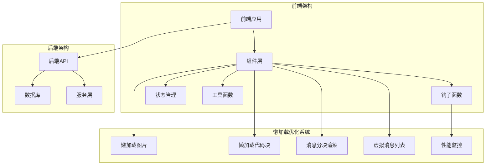
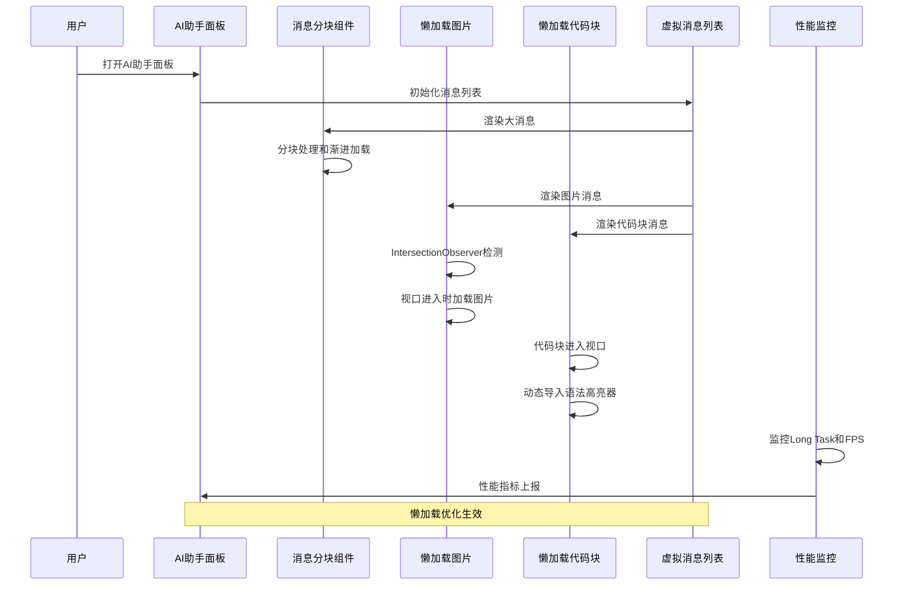
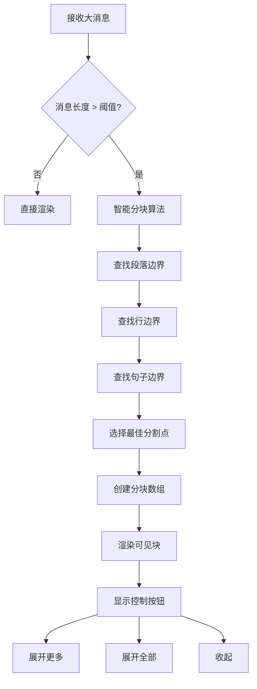
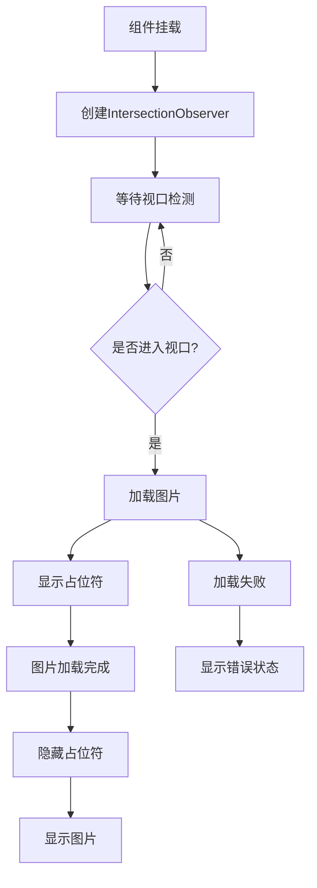
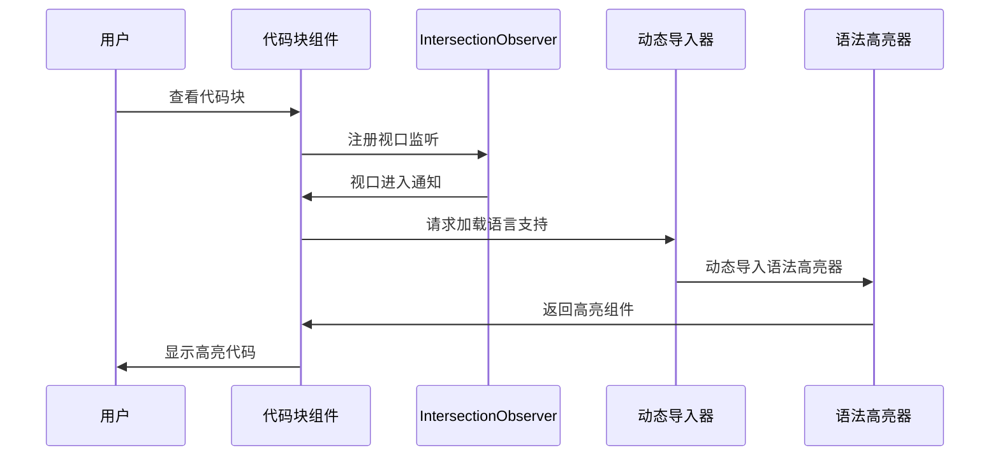
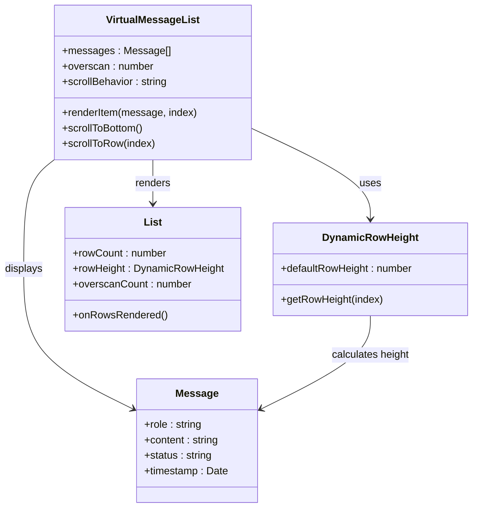
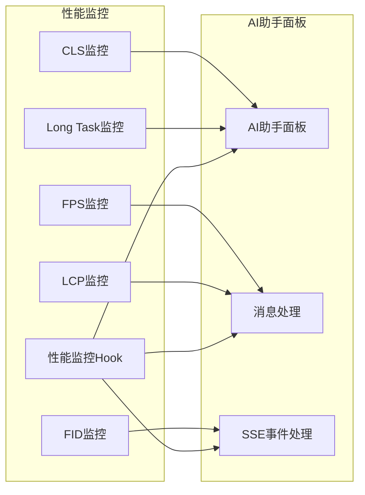
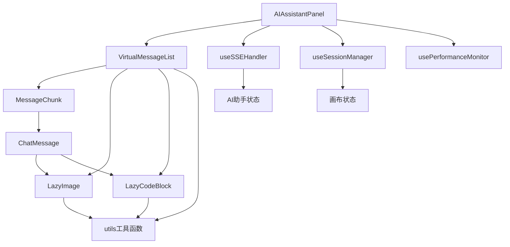

# 懒加载优化系统

<cite>
**本文档中引用的文件**
- [main.py](file://backend/main.py)
- [LazyImage.tsx](file://frontend/src/components/ai-assistant/LazyImage.tsx)
- [LazyCodeBlock.tsx](file://frontend/src/components/ai-assistant/LazyCodeBlock.tsx)
- [MessageChunk.tsx](file://frontend/src/components/ai-assistant/MessageChunk.tsx)
- [AIAssistantPanel.tsx](file://frontend/src/components/canvas/AIAssistantPanel.tsx)
- [VirtualMessageList.tsx](file://frontend/src/components/ai-assistant/VirtualMessageList.tsx)
- [ChatMessage.tsx](file://frontend/src/components/ai-assistant/ChatMessage.tsx)
- [usePerformanceMonitor.ts](file://frontend/src/components/ai-assistant/hooks/usePerformanceMonitor.ts)
- [useSSEHandler.ts](file://frontend/src/components/ai-assistant/hooks/useSSEHandler.ts)
- [useSessionManager.ts](file://frontend/src/components/ai-assistant/hooks/useSessionManager.ts)
- [utils.ts](file://frontend/src/lib/utils.ts)
- [next.config.ts](file://frontend/next.config.ts)
- [package.json](file://frontend/package.json)
</cite>

## 更新摘要
**变更内容**
- 新增 MessageChunk 组件，实现大消息分块处理和渐进式渲染
- 扩展 LazyCodeBlock 组件，增强代码块延迟渲染和语言支持
- 完善 LazyImage 组件，优化图片渐进式加载和错误处理
- 更新虚拟消息列表系统，集成新的分块渲染机制
- 增强性能监控系统，支持更全面的性能指标收集

## 目录
1. [简介](#简介)
2. [项目结构](#项目结构)
3. [核心组件](#核心组件)
4. [架构概览](#架构概览)
5. [详细组件分析](#详细组件分析)
6. [依赖关系分析](#依赖关系分析)
7. [性能考虑](#性能考虑)
8. [故障排除指南](#故障排除指南)
9. [结论](#结论)

## 简介

懒加载优化系统是本项目中一个关键的前端性能优化方案，旨在通过延迟加载、按需加载和虚拟化技术来提升用户体验和应用性能。该系统经过扩展，现已包含四个核心组件：

1. **资源懒加载** - 延迟加载图片、代码块等重型资源
2. **组件懒加载** - 动态导入大型第三方库和组件
3. **虚拟化渲染** - 使用虚拟滚动技术处理大量消息列表
4. **消息分块渲染** - 实现大消息的渐进式加载和分块显示

该系统通过 IntersectionObserver API、React.lazy、Suspense 和 react-window 等现代 Web 技术实现，显著减少了初始包体积和内存占用，同时提升了用户体验。

## 项目结构

项目采用前后端分离架构，懒加载优化系统主要集中在前端部分：

**图表来源**
- [AIAssistantPanel.tsx:1-528](file://frontend/src/components/canvas/AIAssistantPanel.tsx#L1-L528)
- [LazyImage.tsx:1-111](file://frontend/src/components/ai-assistant/LazyImage.tsx#L1-L111)
- [LazyCodeBlock.tsx:1-166](file://frontend/src/components/ai-assistant/LazyCodeBlock.tsx#L1-L166)
- [MessageChunk.tsx:1-172](file://frontend/src/components/ai-assistant/MessageChunk.tsx#L1-L172)

**章节来源**
- [AIAssistantPanel.tsx:1-528](file://frontend/src/components/canvas/AIAssistantPanel.tsx#L1-L528)
- [LazyImage.tsx:1-111](file://frontend/src/components/ai-assistant/LazyImage.tsx#L1-L111)
- [LazyCodeBlock.tsx:1-166](file://frontend/src/components/ai-assistant/LazyCodeBlock.tsx#L1-L166)
- [MessageChunk.tsx:1-172](file://frontend/src/components/ai-assistant/MessageChunk.tsx#L1-L172)

## 核心组件

### 懒加载图片组件 (LazyImage)

LazyImage 组件实现了基于 IntersectionObserver 的图片懒加载机制：

- **视口检测**：使用 50px 的提前加载阈值
- **占位符系统**：提供骨架屏占位符增强用户体验
- **错误处理**：优雅处理图片加载失败情况
- **条件渲染**：过滤无效的图片源地址

### 懒加载代码块组件 (LazyCodeBlock)

LazyCodeBlock 实现了复杂的按需加载策略：

- **动态导入**：语法高亮器按需加载
- **语言支持**：支持多种编程语言的异步加载
- **视口感知**：仅在代码块进入视口时加载
- **展开功能**：支持大代码块的分段显示
- **占位符优化**：提供代码块占位符效果

### 消息分块组件 (MessageChunk)

MessageChunk 组件专门处理大消息的分块渲染：

- **智能分块**：根据段落边界、换行符和句号进行智能分割
- **渐进式加载**：默认只显示前几个块，其余块按需加载
- **进度指示**：提供详细的加载进度显示
- **展开控制**：支持展开更多块、展开全部和收起功能
- **性能优化**：限制每次渲染的字符数，避免长时间阻塞

### 虚拟消息列表 (VirtualMessageList)

基于 react-window 的高性能虚拟滚动实现：

- **动态行高**：支持不同高度的消息项
- **智能滚动**：自动处理新消息和流式内容
- **性能优化**：仅渲染可见区域内的消息项
- **滚动同步**：与用户滚动行为完美同步
- **等待指示器**：集成流式内容的加载动画

**章节来源**
- [LazyImage.tsx:1-111](file://frontend/src/components/ai-assistant/LazyImage.tsx#L1-L111)
- [LazyCodeBlock.tsx:1-166](file://frontend/src/components/ai-assistant/LazyCodeBlock.tsx#L1-L166)
- [MessageChunk.tsx:1-172](file://frontend/src/components/ai-assistant/MessageChunk.tsx#L1-L172)
- [VirtualMessageList.tsx:1-293](file://frontend/src/components/ai-assistant/VirtualMessageList.tsx#L1-L293)

## 架构概览

懒加载优化系统采用分层架构设计，确保各个组件之间的松耦合和高内聚：

**图表来源**
- [AIAssistantPanel.tsx:121-129](file://frontend/src/components/canvas/AIAssistantPanel.tsx#L121-L129)
- [LazyImage.tsx:29-54](file://frontend/src/components/ai-assistant/LazyImage.tsx#L29-L54)
- [LazyCodeBlock.tsx:67-104](file://frontend/src/components/ai-assistant/LazyCodeBlock.tsx#L67-L104)
- [MessageChunk.tsx:27-60](file://frontend/src/components/ai-assistant/MessageChunk.tsx#L27-L60)
- [VirtualMessageList.tsx:155-196](file://frontend/src/components/ai-assistant/VirtualMessageList.tsx#L155-L196)

## 详细组件分析

### 消息分块系统

#### 智能分块算法

**图表来源**
- [MessageChunk.tsx:27-60](file://frontend/src/components/ai-assistant/MessageChunk.tsx#L27-L60)

#### 分块策略

- **默认块大小**：2000字符
- **默认显示块数**：3块
- **分割优先级**：段落边界 > 行边界 > 句子边界
- **进度指示**：实时显示加载进度百分比

#### 关键特性

- **渐进式渲染**：避免一次性渲染大量内容
- **内存优化**：限制同时渲染的块数
- **用户控制**：提供展开、收起等交互控制
- **性能监控**：集成性能指标收集

**章节来源**
- [MessageChunk.tsx:1-172](file://frontend/src/components/ai-assistant/MessageChunk.tsx#L1-L172)

### 懒加载图片系统

#### 实现原理

**图表来源**
- [LazyImage.tsx:29-64](file://frontend/src/components/ai-assistant/LazyImage.tsx#L29-L64)

#### 关键特性

- **提前加载**：视口边界设置为 50px，提供更好的用户体验
- **占位符系统**：使用骨架屏占位符减少视觉跳变
- **错误处理**：优雅降级到错误状态显示
- **内存优化**：及时断开观察器连接

**章节来源**
- [LazyImage.tsx:1-111](file://frontend/src/components/ai-assistant/LazyImage.tsx#L1-L111)

### 懒加载代码块系统

#### 动态导入流程

**图表来源**
- [LazyCodeBlock.tsx:95-104](file://frontend/src/components/ai-assistant/LazyCodeBlock.tsx#L95-L104)

#### 语言支持机制

组件支持以下编程语言的语法高亮：

| 语言 | 文件扩展名 | 动态导入模块 |
|------|------------|--------------|
| JavaScript | js, jsx | prism/javascript |
| TypeScript | ts, tsx | prism/typescript |
| Python | py | prism/python |
| Java | java | prism/java |
| Go | go | prism/go |
| Rust | rs | prism/rust |
| CSS | css | prism/css |
| HTML | html, xml | prism/markup |
| JSON | json | prism/json |
| SQL | sql | prism/sql |
| Bash | sh, bash | prism/bash |
| Shell | shell | prism/bash |
| YAML | yaml, yml | prism/yaml |
| Markdown | md | prism/markdown |

**章节来源**
- [LazyCodeBlock.tsx:1-166](file://frontend/src/components/ai-assistant/LazyCodeBlock.tsx#L1-L166)

### 虚拟消息列表系统

#### 虚拟滚动实现

**图表来源**
- [VirtualMessageList.tsx:43-52](file://frontend/src/components/ai-assistant/VirtualMessageList.tsx#L43-L52)

#### 性能优化策略

- **智能滚动**：仅在用户发送消息或AI回复时自动滚动
- **动态行高**：使用 react-window 的动态行高计算
- **视口外渲染**：通过 overscan 参数预渲染相邻元素
- **内存管理**：及时释放不再使用的 DOM 节点

**章节来源**
- [VirtualMessageList.tsx:1-293](file://frontend/src/components/ai-assistant/VirtualMessageList.tsx#L1-L293)

### 性能监控系统

#### 性能指标监控

**图表来源**
- [usePerformanceMonitor.ts:75-200](file://frontend/src/components/ai-assistant/hooks/usePerformanceMonitor.ts#L75-L200)

#### 监控指标说明

| 指标 | 描述 | 阈值 | 影响 |
|------|------|------|------|
| Long Task | 长任务检测 | > 200ms | UI卡顿 |
| LCP | 最大内容绘制 | > 2.5s | 首屏体验 |
| FID | 首次输入延迟 | > 100ms | 交互响应 |
| CLS | 累积布局偏移 | > 0.1 | ision稳定性 |
| FPS | 帧率 | < 30fps | 动画流畅度 |

**章节来源**
- [usePerformanceMonitor.ts:1-236](file://frontend/src/components/ai-assistant/hooks/usePerformanceMonitor.ts#L1-L236)

## 依赖关系分析

### 技术栈依赖

```mermaid
graph TB
subgraph "前端依赖"
React[React 19.2.3]
Next[Next.js 16.1.6]
Framer[framer-motion 12.34.3]
Window[react-window 2.2.7]
Zustand[zustand 5.0.12]
clsx[clsx 2.1.1]
Tailwind[tailwind-merge 3.5.0]
ReactMarkdown[react-markdown 9.1.0]
RemarkGFM[remark-gfm 4.0.1]
SyntaxHighlighter[react-syntax-highlighter 15.5.0]
Suspense[Suspense组件]
Lazy[lazy函数]
Dynamic[动态导入]
end
subgraph "懒加载相关"
Intersection[IntersectionObserver API]
Performance[PerformanceObserver API]
RequestAnimFrame[requestAnimationFrame]
end
subgraph "性能监控"
Observer[PerformanceObserver]
Animation[requestAnimationFrame]
Metrics[性能指标API]
end
React --> Intersection
React --> Suspense
React --> Lazy
React --> Observer
React --> Animation
Next --> Window
Framer --> Animation
Zustand --> Metrics
ReactMarkdown --> SyntaxHighlighter
```

**图表来源**
- [package.json:13-69](file://frontend/package.json#L13-L69)

### 组件间依赖关系

**图表来源**
- [AIAssistantPanel.tsx:19-23](file://frontend/src/components/canvas/AIAssistantPanel.tsx#L19-L23)
- [VirtualMessageList.tsx:1-7](file://frontend/src/components/ai-assistant/VirtualMessageList.tsx#L1-L7)
- [ChatMessage.tsx:12-16](file://frontend/src/components/ai-assistant/ChatMessage.tsx#L12-L16)

**章节来源**
- [package.json:1-94](file://frontend/package.json#L1-L94)

## 性能考虑

### 懒加载策略优势

1. **减少初始包体积**：通过动态导入减少首屏加载时间
2. **提升交互性能**：避免阻塞主线程的资源加载
3. **优化内存使用**：按需加载资源，减少内存占用
4. **改善用户体验**：更快的首屏渲染和更流畅的交互

### 性能监控最佳实践

- **阈值设置**：Long Task 阈值设置为 200ms 是合理的平衡点
- **指标收集**：定期收集和分析性能指标
- **异常处理**：及时发现和处理性能问题
- **持续优化**：基于监控数据持续改进性能

### 优化建议

1. **资源预加载**：为关键路径资源添加预加载策略
2. **缓存策略**：实现智能的缓存机制
3. **CDN优化**：使用 CDN 加速静态资源加载
4. **压缩优化**：启用 Gzip/Brotli 压缩

## 故障排除指南

### 常见问题及解决方案

#### 图片懒加载失效

**问题症状**：
- 图片无法正常显示
- 控制台出现 IntersectionObserver 错误

**解决方案**：
1. 检查浏览器兼容性
2. 验证 IntersectionObserver API 支持
3. 确认图片源地址有效性

#### 代码块加载缓慢

**问题症状**：
- 代码高亮显示延迟
- 语法高亮器加载超时

**解决方案**：
1. 检查网络连接状况
2. 验证动态导入路径正确性
3. 考虑添加加载状态指示

#### 消息分块渲染问题

**问题症状**：
- 大消息渲染卡顿
- 分块显示异常

**解决方案**：
1. 调整分块大小参数
2. 检查消息内容格式
3. 优化分块算法

#### 虚拟列表性能问题

**问题症状**：
- 消息滚动卡顿
- 内存使用过高

**解决方案**：
1. 调整 overscan 数量
2. 优化消息项渲染
3. 检查消息数据结构

**章节来源**
- [LazyImage.tsx:61-64](file://frontend/src/components/ai-assistant/LazyImage.tsx#L61-L64)
- [LazyCodeBlock.tsx:32-38](file://frontend/src/components/ai-assistant/LazyCodeBlock.tsx#L32-L38)
- [MessageChunk.tsx:27-60](file://frontend/src/components/ai-assistant/MessageChunk.tsx#L27-L60)
- [VirtualMessageList.tsx:155-196](file://frontend/src/components/ai-assistant/VirtualMessageList.tsx#L155-L196)

## 结论

懒加载优化系统通过多层次的技术手段实现了显著的性能提升：

1. **技术实现**：成功运用了现代 Web 技术的最佳实践
2. **性能收益**：显著减少了首屏加载时间和内存占用
3. **用户体验**：提供了更流畅的交互体验
4. **可维护性**：清晰的架构设计便于后续维护和扩展

该系统不仅解决了当前的性能问题，还为未来的功能扩展奠定了坚实的基础。通过持续的性能监控和优化，系统能够适应不断增长的用户需求和业务场景。

**新增功能总结**：
- **MessageChunk**：实现了大消息的渐进式渲染，显著提升了长文本的显示性能
- **增强的 LazyCodeBlock**：提供了更完善的代码块懒加载和语言支持
- **优化的 LazyImage**：增强了图片加载的稳定性和用户体验
- **集成的性能监控**：提供了更全面的性能指标收集和分析能力

这些改进使得整个系统在处理大量数据和复杂内容时更加高效和稳定。