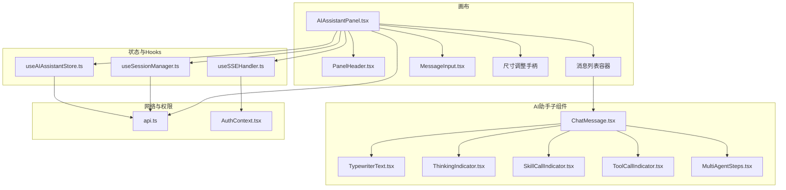
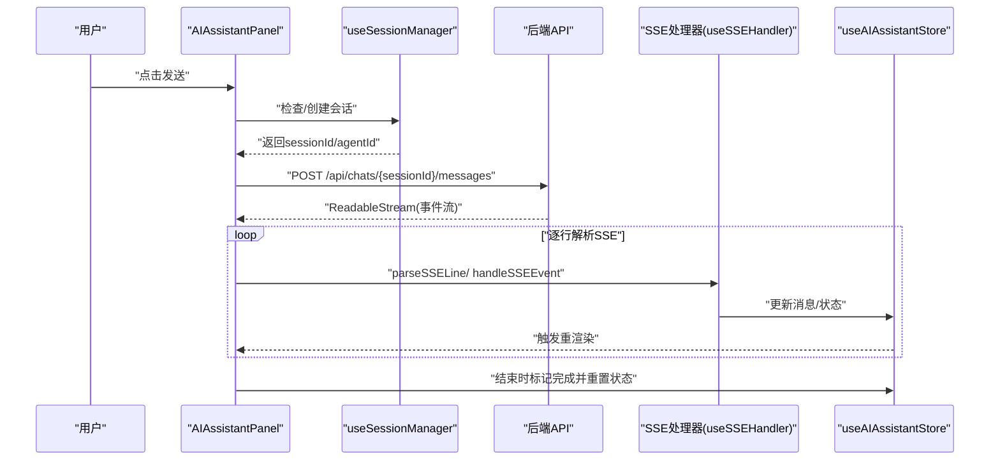
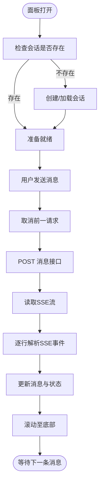
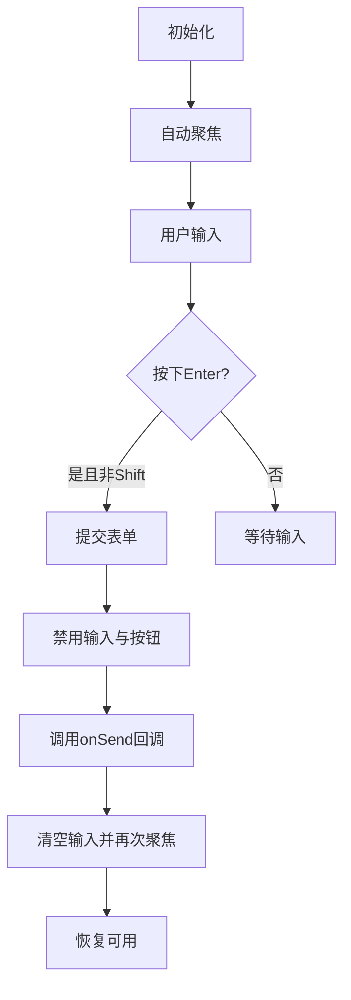
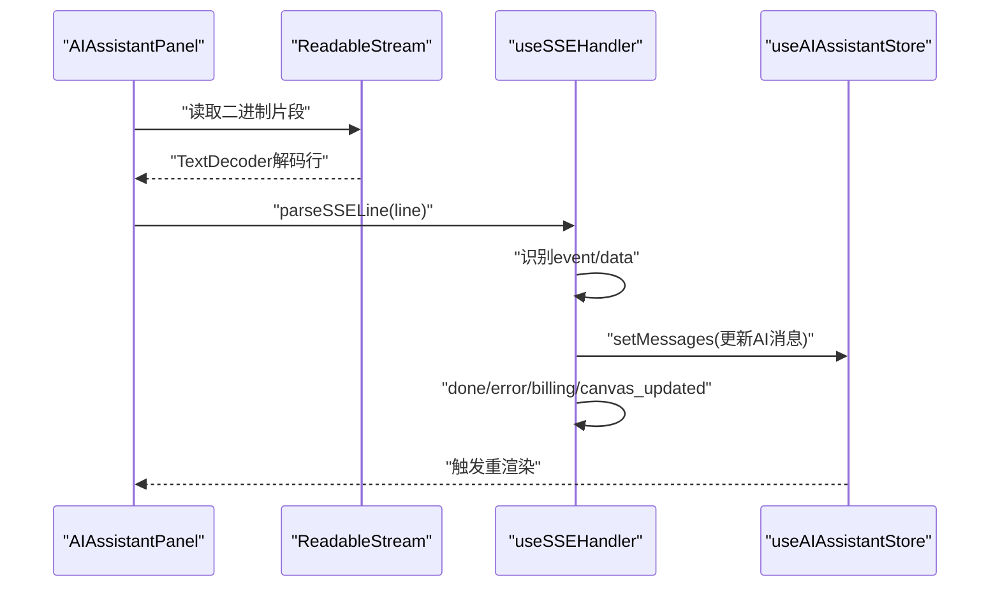
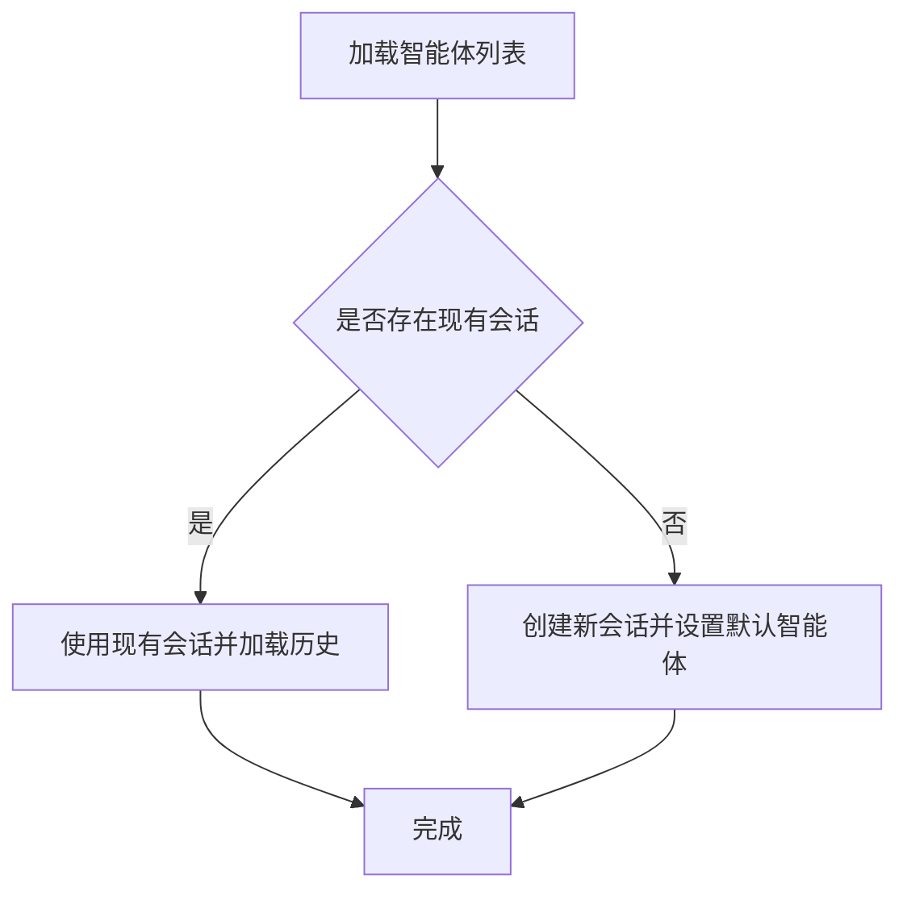
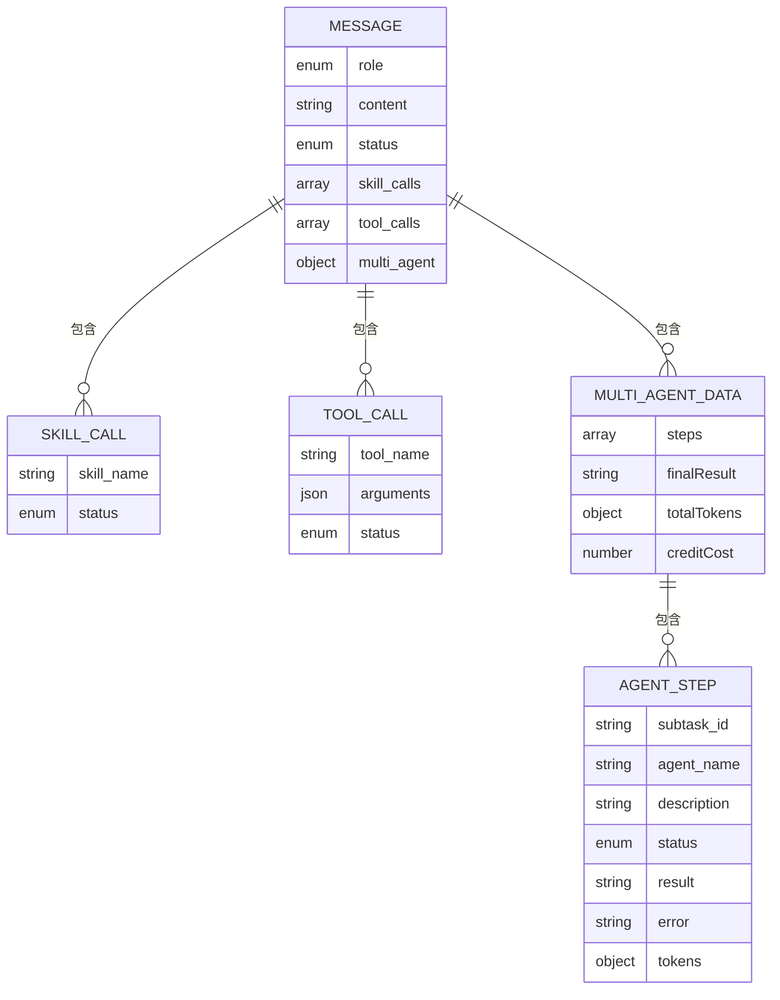
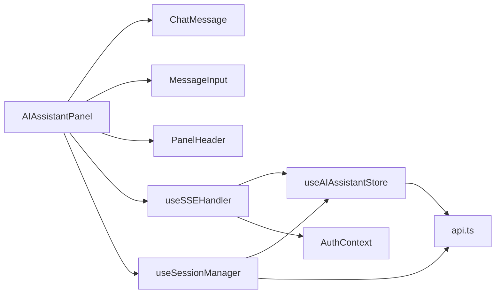

# AI助手面板

<cite>
**本文引用的文件**
- [AIAssistantPanel.tsx](file://frontend/src/components/canvas/AIAssistantPanel.tsx)
- [ChatMessage.tsx](file://frontend/src/components/ai-assistant/ChatMessage.tsx)
- [MessageInput.tsx](file://frontend/src/components/ai-assistant/MessageInput.tsx)
- [useAIAssistantStore.ts](file://frontend/src/store/useAIAssistantStore.ts)
- [useSSEHandler.ts](file://frontend/src/components/ai-assistant/hooks/useSSEHandler.ts)
- [useSessionManager.ts](file://frontend/src/components/ai-assistant/hooks/useSessionManager.ts)
- [PanelHeader.tsx](file://frontend/src/components/ai-assistant/PanelHeader.tsx)
- [TypewriterText.tsx](file://frontend/src/components/ai-assistant/TypewriterText.tsx)
- [ToolCallIndicator.tsx](file://frontend/src/components/ai-assistant/ToolCallIndicator.tsx)
- [SkillCallIndicator.tsx](file://frontend/src/components/ai-assistant/SkillCallIndicator.tsx)
- [ThinkingIndicator.tsx](file://frontend/src/components/ai-assistant/ThinkingIndicator.tsx)
- [MultiAgentSteps.tsx](file://frontend/src/components/canvas/MultiAgentSteps.tsx)
- [LoadingDots.tsx](file://frontend/src/components/ai-assistant/LoadingDots.tsx)
- [api.ts](file://frontend/src/lib/api.ts)
- [AuthContext.tsx](file://frontend/src/context/AuthContext.tsx)
</cite>

## 目录
1. [简介](#简介)
2. [项目结构](#项目结构)
3. [核心组件](#核心组件)
4. [架构总览](#架构总览)
5. [详细组件分析](#详细组件分析)
6. [依赖关系分析](#依赖关系分析)
7. [性能考量](#性能考量)
8. [故障排查指南](#故障排查指南)
9. [结论](#结论)
10. [附录](#附录)

## 简介
本文件面向前端开发者与产品设计人员，系统化梳理“AI助手面板”的实现架构与交互细节。重点覆盖以下方面：
- AIAssistantPanel 主面板的控制流与状态管理
- 消息渲染组件 ChatMessage 的渲染逻辑与样式策略
- 消息输入组件 MessageInput 的输入、发送与历史交互
- 实时通信机制：基于 SSE 的流式传输与状态同步
- 面板交互设计：消息气泡、输入框、发送按钮等 UI 行为
- 配置项与扩展指南：自定义消息类型、交互行为与多智能体协作

## 项目结构
AI助手面板位于前端工程的画布模块下，采用“主面板 + 子组件 + Hooks + Store”的分层组织方式：
- 主面板：AIAssistantPanel 负责面板生命周期、会话初始化、消息发送与滚动
- 子组件：ChatMessage、MessageInput、PanelHeader、ThinkingIndicator、SkillCallIndicator、ToolCallIndicator、TypewriterText、MultiAgentSteps、LoadingDots
- 状态管理：useAIAssistantStore 提供全局状态与持久化
- 会话与SSE：useSessionManager、useSSEHandler 负责会话生命周期与流式事件解析
- 网络层：api.ts 统一封装请求与鉴权拦截
- 权限与积分：AuthContext 提供用户与积分状态更新

图表来源
- [AIAssistantPanel.tsx:14-326](file://frontend/src/components/canvas/AIAssistantPanel.tsx#L14-L326)
- [useAIAssistantStore.ts:145-274](file://frontend/src/store/useAIAssistantStore.ts#L145-L274)
- [useSessionManager.ts:12-179](file://frontend/src/components/ai-assistant/hooks/useSessionManager.ts#L12-L179)
- [useSSEHandler.ts:24-335](file://frontend/src/components/ai-assistant/hooks/useSSEHandler.ts#L24-L335)
- [api.ts:1-84](file://frontend/src/lib/api.ts#L1-L84)
- [AuthContext.tsx:1-110](file://frontend/src/context/AuthContext.tsx#L1-L110)

章节来源
- [AIAssistantPanel.tsx:14-326](file://frontend/src/components/canvas/AIAssistantPanel.tsx#L14-L326)
- [useAIAssistantStore.ts:145-274](file://frontend/src/store/useAIAssistantStore.ts#L145-L274)

## 核心组件
- AIAssistantPanel：主面板容器，负责面板显隐、拖拽定位、尺寸调整、消息发送、SSE事件处理与会话初始化
- ChatMessage：消息渲染组件，支持 Markdown、打字机动画、思考指示器、工具/技能调用指示器、多智能体协作展示
- MessageInput：输入组件，支持 Enter 发送、Shift+Enter 换行、发送状态禁用、自动聚焦
- useAIAssistantStore：Zustand 状态存储，包含消息、会话、面板尺寸位置、图像编辑上下文、剧院切换与持久化
- useSessionManager：会话生命周期管理，加载可用智能体、创建/切换/清空会话、加载历史消息
- useSSEHandler：SSE 事件解析与状态机，将服务端事件映射为消息流与 UI 状态
- PanelHeader：面板头部，包含智能体选择、清空会话、关闭面板与拖拽句柄
- TypewriterText：打字机效果文本渲染，配合 Markdown
- ThinkingIndicator：AI 思考指示器，含计时与点阵动画
- SkillCallIndicator/ToolCallIndicator：技能与工具调用可视化
- MultiAgentSteps：多智能体协作步骤可视化
- api.ts：Axios 封装，统一鉴权头与401刷新队列
- AuthContext：用户与积分状态更新

章节来源
- [AIAssistantPanel.tsx:14-326](file://frontend/src/components/canvas/AIAssistantPanel.tsx#L14-L326)
- [ChatMessage.tsx:52-126](file://frontend/src/components/ai-assistant/ChatMessage.tsx#L52-L126)
- [MessageInput.tsx:17-110](file://frontend/src/components/ai-assistant/MessageInput.tsx#L17-L110)
- [useAIAssistantStore.ts:42-136](file://frontend/src/store/useAIAssistantStore.ts#L42-L136)
- [useSessionManager.ts:12-179](file://frontend/src/components/ai-assistant/hooks/useSessionManager.ts#L12-L179)
- [useSSEHandler.ts:24-335](file://frontend/src/components/ai-assistant/hooks/useSSEHandler.ts#L24-L335)
- [PanelHeader.tsx:26-123](file://frontend/src/components/ai-assistant/PanelHeader.tsx#L26-L123)
- [TypewriterText.tsx:46-81](file://frontend/src/components/ai-assistant/TypewriterText.tsx#L46-L81)
- [ThinkingIndicator.tsx:13-56](file://frontend/src/components/ai-assistant/ThinkingIndicator.tsx#L13-L56)
- [SkillCallIndicator.tsx:18-55](file://frontend/src/components/ai-assistant/SkillCallIndicator.tsx#L18-L55)
- [ToolCallIndicator.tsx:20-109](file://frontend/src/components/ai-assistant/ToolCallIndicator.tsx#L20-L109)
- [MultiAgentSteps.tsx:28-128](file://frontend/src/components/canvas/MultiAgentSteps.tsx#L28-L128)
- [api.ts:1-84](file://frontend/src/lib/api.ts#L1-L84)
- [AuthContext.tsx:1-110](file://frontend/src/context/AuthContext.tsx#L1-L110)

## 架构总览
AI助手面板采用“组件-状态-网络-权限”四层架构：
- 组件层：主面板与子组件负责 UI 呈现与用户交互
- 状态层：Zustand store 管理消息、会话、面板尺寸与剧院切换
- 网络层：Axios 封装统一鉴权与401刷新；SSE 通过 fetch + ReadableStream 解析
- 权限层：鉴权上下文与积分状态联动

图表来源
- [AIAssistantPanel.tsx:87-179](file://frontend/src/components/canvas/AIAssistantPanel.tsx#L87-L179)
- [useSessionManager.ts:48-108](file://frontend/src/components/ai-assistant/hooks/useSessionManager.ts#L48-L108)
- [useSSEHandler.ts:52-335](file://frontend/src/components/ai-assistant/hooks/useSSEHandler.ts#L52-L335)
- [useAIAssistantStore.ts:206-239](file://frontend/src/store/useAIAssistantStore.ts#L206-L239)

## 详细组件分析

### AIAssistantPanel 主面板
- 面板显隐与ESC关闭：监听键盘事件，Esc 关闭面板
- 会话初始化：首次打开或缺失会话时，根据剧院ID创建/加载会话并拉取消息历史
- 发送流程：校验会话，构造请求头与body，使用 AbortController 取消上一次请求，读取可读流并逐行解析SSE事件
- 滚动与焦点：消息变化时平滑滚动至底部；发送后自动聚焦输入框
- 尺寸与拖拽：支持左/底/角落三种手柄调整尺寸；支持拖拽移动面板并限制在约束容器内

图表来源
- [AIAssistantPanel.tsx:54-84](file://frontend/src/components/canvas/AIAssistantPanel.tsx#L54-L84)
- [AIAssistantPanel.tsx:72-79](file://frontend/src/components/canvas/AIAssistantPanel.tsx#L72-L79)
- [AIAssistantPanel.tsx:87-179](file://frontend/src/components/canvas/AIAssistantPanel.tsx#L87-L179)

章节来源
- [AIAssistantPanel.tsx:14-326](file://frontend/src/components/canvas/AIAssistantPanel.tsx#L14-L326)

### ChatMessage 消息渲染
- 用户消息：右对齐，圆角右侧，纯文本展示
- AI消息：左对齐，圆角左侧，支持 Markdown 渲染与代码块样式
- 流式渲染：当消息处于 streaming 状态且内容为空时显示“思考中”指示器；否则使用打字机效果渲染
- 扩展能力：支持技能调用、工具调用、多智能体协作步骤的可视化展示

图表来源
- [ChatMessage.tsx:52-126](file://frontend/src/components/ai-assistant/ChatMessage.tsx#L52-L126)
- [TypewriterText.tsx:46-81](file://frontend/src/components/ai-assistant/TypewriterText.tsx#L46-L81)
- [ThinkingIndicator.tsx:13-56](file://frontend/src/components/ai-assistant/ThinkingIndicator.tsx#L13-L56)
- [SkillCallIndicator.tsx:18-55](file://frontend/src/components/ai-assistant/SkillCallIndicator.tsx#L18-L55)
- [ToolCallIndicator.tsx:20-109](file://frontend/src/components/ai-assistant/ToolCallIndicator.tsx#L20-L109)
- [MultiAgentSteps.tsx:28-128](file://frontend/src/components/canvas/MultiAgentSteps.tsx#L28-L128)

章节来源
- [ChatMessage.tsx:52-126](file://frontend/src/components/ai-assistant/ChatMessage.tsx#L52-L126)

### MessageInput 输入组件
- 行为：Enter 发送，Shift+Enter 换行；发送后清空输入并自动聚焦
- 状态：发送中禁用输入与发送按钮；显示“AI 正在响应”提示
- 附加：预留附件按钮（当前为占位）

图表来源
- [MessageInput.tsx:17-110](file://frontend/src/components/ai-assistant/MessageInput.tsx#L17-L110)

章节来源
- [MessageInput.tsx:17-110](file://frontend/src/components/ai-assistant/MessageInput.tsx#L17-L110)

### 实时通信与状态同步（SSE）
- 事件解析：逐行解析 event/data，支持多轮次与工具/技能调用状态叠加
- 状态机：维护技能/工具/步骤/多智能体状态，按事件更新最后一条AI消息
- 结束与错误：done 事件标记消息完成并重置状态；error 事件追加错误消息
- 计费与画布同步：billing 事件更新积分余额；canvas_updated 事件触发画布同步

图表来源
- [AIAssistantPanel.tsx:143-177](file://frontend/src/components/canvas/AIAssistantPanel.tsx#L143-L177)
- [useSSEHandler.ts:52-335](file://frontend/src/components/ai-assistant/hooks/useSSEHandler.ts#L52-L335)

章节来源
- [useSSEHandler.ts:24-335](file://frontend/src/components/ai-assistant/hooks/useSSEHandler.ts#L24-L335)

### 会话管理（useSessionManager）
- 加载智能体：获取可用智能体列表，支持加载状态
- 创建会话：优先查找剧院下现有会话，否则创建新会话并绑定默认智能体
- 切换智能体：为当前剧院创建新会话并更新智能体信息
- 清空会话：删除消息历史并保留会话与智能体

图表来源
- [useSessionManager.ts:32-108](file://frontend/src/components/ai-assistant/hooks/useSessionManager.ts#L32-L108)

章节来源
- [useSessionManager.ts:12-179](file://frontend/src/components/ai-assistant/hooks/useSessionManager.ts#L12-L179)

### 面板头部与交互
- 智能体选择：下拉菜单展示可用智能体及其目标节点类型
- 清空会话：删除当前会话的消息历史
- 关闭面板：隐藏面板
- 拖拽：头部作为拖拽句柄，支持拖拽移动面板

章节来源
- [PanelHeader.tsx:26-123](file://frontend/src/components/ai-assistant/PanelHeader.tsx#L26-L123)

### 数据模型与状态
- Message：角色、内容、状态（流式/完成）、扩展字段（技能/工具/多智能体）
- SkillCall/ToolCall：名称、参数、状态
- MultiAgentData/AgentStep：步骤集合、最终结果、总Tokens、积分消耗
- Store：面板可见性、剧院ID、消息、会话、面板尺寸与位置、图像编辑上下文、剧院会话缓存

图表来源
- [useAIAssistantStore.ts:42-50](file://frontend/src/store/useAIAssistantStore.ts#L42-L50)
- [useAIAssistantStore.ts:7-18](file://frontend/src/store/useAIAssistantStore.ts#L7-L18)
- [useAIAssistantStore.ts:31-37](file://frontend/src/store/useAIAssistantStore.ts#L31-L37)
- [useAIAssistantStore.ts:20-29](file://frontend/src/store/useAIAssistantStore.ts#L20-L29)

章节来源
- [useAIAssistantStore.ts:42-136](file://frontend/src/store/useAIAssistantStore.ts#L42-L136)

## 依赖关系分析
- 组件耦合：AIAssistantPanel 依赖多个子组件与Hooks；子组件之间低耦合，通过store共享状态
- 状态依赖：所有组件通过 useAIAssistantStore 读写状态，避免跨层级传递
- 网络依赖：useSessionManager 与 useSSEHandler 依赖 api.ts；SSE事件处理依赖 AuthContext 更新积分
- 外部库：React、Framer Motion（动画）、Lucide Icons、React Markdown、Remark GFM

图表来源
- [AIAssistantPanel.tsx:11-12](file://frontend/src/components/canvas/AIAssistantPanel.tsx#L11-L12)
- [useSSEHandler.ts:24-335](file://frontend/src/components/ai-assistant/hooks/useSSEHandler.ts#L24-L335)
- [useSessionManager.ts:12-179](file://frontend/src/components/ai-assistant/hooks/useSessionManager.ts#L12-L179)
- [api.ts:1-84](file://frontend/src/lib/api.ts#L1-L84)
- [AuthContext.tsx:1-110](file://frontend/src/context/AuthContext.tsx#L1-L110)

章节来源
- [AIAssistantPanel.tsx:11-12](file://frontend/src/components/canvas/AIAssistantPanel.tsx#L11-L12)
- [useSSEHandler.ts:24-335](file://frontend/src/components/ai-assistant/hooks/useSSEHandler.ts#L24-L335)
- [useSessionManager.ts:12-179](file://frontend/src/components/ai-assistant/hooks/useSessionManager.ts#L12-L179)
- [api.ts:1-84](file://frontend/src/lib/api.ts#L1-L84)
- [AuthContext.tsx:1-110](file://frontend/src/context/AuthContext.tsx#L1-L110)

## 性能考量
- 流式渲染：仅更新最后一条AI消息，减少重渲染范围
- 状态持久化：store 使用持久化中间件，面板尺寸、位置与剧院会话缓存减少重复初始化
- 请求取消：AbortController 在发送新消息时取消旧请求，避免竞态与内存泄漏
- 滚动优化：仅在消息数量变化时滚动，避免频繁DOM操作
- 图像编辑上下文：仅在面板顶部显示横幅，不影响消息列表渲染

## 故障排查指南
- 401未授权：api.ts 已内置401刷新队列；若仍失败，检查本地存储中的令牌是否有效
- 402余额不足：主面板捕获HTTP错误并提示；SSE事件中 billing 与多智能体模式也会提示
- 请求被取消：发送新消息会中断旧请求；确认网络状况与后端SSE连接稳定性
- 会话异常：使用 useSessionManager 的 createSessionForTheater 与 clearSession 进行重建与清空
- 积分不同步：SSE 中 billing 事件会更新积分；若未更新，检查 AuthContext.updateCredits 是否被调用

章节来源
- [AIAssistantPanel.tsx:133-141](file://frontend/src/components/canvas/AIAssistantPanel.tsx#L133-L141)
- [useSSEHandler.ts:278-298](file://frontend/src/components/ai-assistant/hooks/useSSEHandler.ts#L278-L298)
- [api.ts:31-81](file://frontend/src/lib/api.ts#L31-L81)
- [useSessionManager.ts:133-148](file://frontend/src/components/ai-assistant/hooks/useSessionManager.ts#L133-L148)
- [AuthContext.tsx:96-102](file://frontend/src/context/AuthContext.tsx#L96-L102)

## 结论
AI助手面板通过清晰的分层架构与完善的Hook体系，实现了从会话管理、实时流式传输到消息渲染与多智能体协作的完整闭环。其可扩展的状态模型与事件驱动的SSE处理，为后续自定义消息类型与交互行为提供了良好基础。

## 附录

### 配置选项与扩展开发指南
- 自定义消息类型
  - 在 Message 接口中扩展字段（如多媒体内容），并在 ChatMessage 中新增渲染分支
  - 在 useSSEHandler 中增加对应事件类型，更新 store 并触发渲染
  - 参考路径：[useAIAssistantStore.ts:42-50](file://frontend/src/store/useAIAssistantStore.ts#L42-L50)，[ChatMessage.tsx:78-121](file://frontend/src/components/ai-assistant/ChatMessage.tsx#L78-L121)，[useSSEHandler.ts:66-327](file://frontend/src/components/ai-assistant/hooks/useSSEHandler.ts#L66-L327)
- 自定义交互行为
  - 在 MessageInput 中扩展快捷键或输入行为，注意与isLoading状态协同
  - 在 PanelHeader 中扩展更多操作入口（如导出、分享）
  - 参考路径：[MessageInput.tsx:32-50](file://frontend/src/components/ai-assistant/MessageInput.tsx#L32-L50)，[PanelHeader.tsx:93-120](file://frontend/src/components/ai-assistant/PanelHeader.tsx#L93-L120)
- 多智能体协作
  - 在 useSSEHandler 中完善子任务事件处理，确保步骤状态与最终结果正确合并
  - 在 MultiAgentSteps 中扩展统计与结果预览
  - 参考路径：[useSSEHandler.ts:158-276](file://frontend/src/components/ai-assistant/hooks/useSSEHandler.ts#L158-L276)，[MultiAgentSteps.tsx:28-128](file://frontend/src/components/canvas/MultiAgentSteps.tsx#L28-L128)
- 网络与鉴权
  - 如需自定义鉴权头或拦截器，修改 api.ts；如需扩展401处理策略，调整 useSSEHandler 中的错误提示
  - 参考路径：[api.ts:8-17](file://frontend/src/lib/api.ts#L8-L17)，[useSSEHandler.ts:319-324](file://frontend/src/components/ai-assistant/hooks/useSSEHandler.ts#L319-L324)