# AI助手面板

<cite>
**本文引用的文件**
- [AIAssistantPanel.tsx](file://frontend/src/components/canvas/AIAssistantPanel.tsx)
- [ChatMessage.tsx](file://frontend/src/components/ai-assistant/ChatMessage.tsx)
- [MessageInput.tsx](file://frontend/src/components/ai-assistant/MessageInput.tsx)
- [ContextUsageBar.tsx](file://frontend/src/components/ai-assistant/ContextUsageBar.tsx)
- [PanelHeader.tsx](file://frontend/src/components/ai-assistant/PanelHeader.tsx)
- [useAIAssistantStore.ts](file://frontend/src/store/useAIAssistantStore.ts)
- [useSSEHandler.ts](file://frontend/src/components/ai-assistant/hooks/useSSEHandler.ts)
- [useSessionManager.ts](file://frontend/src/components/ai-assistant/hooks/useSessionManager.ts)
- [usePerformanceMonitor.ts](file://frontend/src/components/ai-assistant/hooks/usePerformanceMonitor.ts)
- [TypewriterText.tsx](file://frontend/src/components/ai-assistant/TypewriterText.tsx)
- [ToolCallIndicator.tsx](file://frontend/src/components/ai-assistant/ToolCallIndicator.tsx)
- [SkillCallIndicator.tsx](file://frontend/src/components/ai-assistant/SkillCallIndicator.tsx)
- [ThinkingIndicator.tsx](file://frontend/src/components/ai-assistant/ThinkingIndicator.tsx)
- [MultiAgentSteps.tsx](file://frontend/src/components/canvas/MultiAgentSteps.tsx)
- [LoadingDots.tsx](file://frontend/src/components/ai-assistant/LoadingDots.tsx)
- [api.ts](file://frontend/src/lib/api.ts)
- [AuthContext.tsx](file://frontend/src/context/AuthContext.tsx)
</cite>

## 更新摘要
**变更内容**
- 新增性能监控功能：集成usePerformanceMonitor钩子，提供全面的性能指标监测
- 增强令牌刷新机制：AuthContext中新增createAuthFetch函数，提供自动令牌刷新的fetch包装器
- 优化的实时通信：通过增强的AuthContext实现更可靠的401错误处理和令牌刷新
- 改进的用户体验：性能监控帮助识别和解决性能瓶颈，提升整体应用性能

## 目录
1. [简介](#简介)
2. [项目结构](#项目结构)
3. [核心组件](#核心组件)
4. [架构总览](#架构总览)
5. [详细组件分析](#详细组件分析)
6. [性能监控系统](#性能监控系统)
7. [认证与令牌刷新机制](#认证与令牌刷新机制)
8. [依赖关系分析](#依赖关系分析)
9. [性能考量](#性能考量)
10. [故障排查指南](#故障排查指南)
11. [结论](#结论)
12. [附录](#附录)

## 简介
本文件面向前端开发者与产品设计人员，系统化梳理"AI助手面板"的实现架构与交互细节。重点覆盖以下方面：
- AIAssistantPanel 主面板的控制流与状态管理，包括新增的性能监控集成
- 消息渲染组件 ChatMessage 的渲染逻辑与样式策略，包括优化的等待动画
- 消息输入组件 MessageInput 的输入、发送与历史交互，包括改进的加载状态
- 实时通信机制：基于 SSE 的流式传输与状态同步，现已集成增强的认证处理
- 面板交互设计：消息气泡、输入框、发送按钮等 UI 行为
- 上下文使用可视化系统：ContextUsageBar 和 HeaderContextBattery 提供的上下文使用统计
- 性能监控系统：usePerformanceMonitor钩子提供的全面性能指标监测
- 认证与令牌刷新机制：AuthContext中增强的自动令牌刷新功能
- 配置项与扩展指南：自定义消息类型、交互行为与多智能体协作

## 项目结构
AI助手面板位于前端工程的画布模块下，采用"主面板 + 子组件 + Hooks + Store"的分层组织方式：
- 主面板：AIAssistantPanel 负责面板生命周期、会话初始化、消息发送与滚动，现已集成性能监控
- 子组件：ChatMessage、MessageInput、PanelHeader、ThinkingIndicator、SkillCallIndicator、ToolCallIndicator、TypewriterText、MultiAgentSteps、LoadingDots、ContextUsageBar
- 状态管理：useAIAssistantStore 提供全局状态与持久化
- 会话与SSE：useSessionManager、useSSEHandler 负责会话生命周期与流式事件解析
- 性能监控：usePerformanceMonitor 提供全面的性能指标监测
- 网络层：api.ts 统一封装请求与鉴权拦截
- 权限与积分：AuthContext 提供用户与积分状态更新，现已集成自动令牌刷新

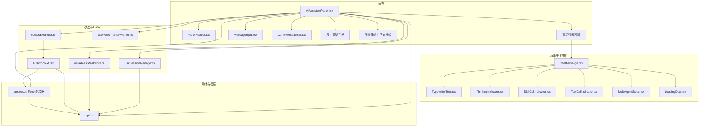

**图表来源**
- [AIAssistantPanel.tsx:14-466](file://frontend/src/components/canvas/AIAssistantPanel.tsx#L14-L466)
- [useAIAssistantStore.ts:145-294](file://frontend/src/store/useAIAssistantStore.ts#L145-L294)
- [useSessionManager.ts:12-179](file://frontend/src/components/ai-assistant/hooks/useSessionManager.ts#L12-L179)
- [useSSEHandler.ts:24-357](file://frontend/src/components/ai-assistant/hooks/useSSEHandler.ts#L24-L357)
- [usePerformanceMonitor.ts:1-236](file://frontend/src/components/ai-assistant/hooks/usePerformanceMonitor.ts#L1-L236)
- [api.ts:1-84](file://frontend/src/lib/api.ts#L1-L84)
- [AuthContext.tsx:1-207](file://frontend/src/context/AuthContext.tsx#L1-L207)

**章节来源**
- [AIAssistantPanel.tsx:14-466](file://frontend/src/components/canvas/AIAssistantPanel.tsx#L14-L466)
- [useAIAssistantStore.ts:145-294](file://frontend/src/store/useAIAssistantStore.ts#L145-L294)

## 核心组件
- AIAssistantPanel：主面板容器，负责面板显隐、拖拽定位、尺寸调整、消息发送、SSE事件处理与会话初始化，现已集成性能监控和增强的认证处理
- ChatMessage：消息渲染组件，支持 Markdown、打字机动画、思考指示器、工具/技能调用指示器、多智能体协作展示，优化了等待动画逻辑
- MessageInput：输入组件，支持 Enter 发送、Shift+Enter 换行、发送状态禁用、自动聚焦，集成了上下文使用可视化和改进的加载状态
- ContextUsageBar：上下文使用可视化组件，提供四格电池图标的上下文使用统计
- PanelHeader：面板头部，包含智能体选择、清空会话、关闭面板与拖拽句柄，新增HeaderContextBattery组件
- HeaderContextBattery：头部上下文电池组件，替代原有的ContextBatteryIcon，提供简化的上下文使用统计显示
- useAIAssistantStore：Zustand 状态存储，包含消息、会话、面板尺寸位置、图像编辑上下文、剧院切换与持久化
- useSessionManager：会话生命周期管理，加载可用智能体、创建/切换/清空会话、加载历史消息
- useSSEHandler：SSE 事件解析与状态机，将服务端事件映射为消息流与 UI 状态，包含上下文使用统计更新
- usePerformanceMonitor：性能监控钩子，提供全面的性能指标监测，包括Long Task、LCP、FID、CLS和FPS监控
- TypewriterText：打字机效果文本渲染，配合 Markdown
- ThinkingIndicator：AI 思考指示器，含计时与点阵动画
- SkillCallIndicator/ToolCallIndicator：技能与工具调用可视化
- MultiAgentSteps：多智能体协作步骤可视化
- LoadingDots：浮动加载动画组件，提供三点跳跃动画效果
- api.ts：Axios 封装，统一鉴权头与401刷新队列
- AuthContext：用户与积分状态更新，现已集成自动令牌刷新的fetch包装器

**章节来源**
- [AIAssistantPanel.tsx:14-466](file://frontend/src/components/canvas/AIAssistantPanel.tsx#L14-L466)
- [ChatMessage.tsx:52-170](file://frontend/src/components/ai-assistant/ChatMessage.tsx#L52-L170)
- [MessageInput.tsx:17-182](file://frontend/src/components/ai-assistant/MessageInput.tsx#L17-L182)
- [ContextUsageBar.tsx:23-141](file://frontend/src/components/ai-assistant/ContextUsageBar.tsx#L23-L141)
- [PanelHeader.tsx:19-246](file://frontend/src/components/ai-assistant/PanelHeader.tsx#L19-L246)
- [useAIAssistantStore.ts:42-136](file://frontend/src/store/useAIAssistantStore.ts#L42-L136)
- [useSessionManager.ts:12-179](file://frontend/src/components/ai-assistant/hooks/useSessionManager.ts#L12-L179)
- [useSSEHandler.ts:24-357](file://frontend/src/components/ai-assistant/hooks/useSSEHandler.ts#L24-L357)
- [usePerformanceMonitor.ts:1-236](file://frontend/src/components/ai-assistant/hooks/usePerformanceMonitor.ts#L1-L236)
- [TypewriterText.tsx:46-81](file://frontend/src/components/ai-assistant/TypewriterText.tsx#L46-L81)
- [ThinkingIndicator.tsx:13-56](file://frontend/src/components/ai-assistant/ThinkingIndicator.tsx#L13-L56)
- [SkillCallIndicator.tsx:18-55](file://frontend/src/components/ai-assistant/SkillCallIndicator.tsx#L18-L55)
- [ToolCallIndicator.tsx:20-109](file://frontend/src/components/ai-assistant/ToolCallIndicator.tsx#L20-L109)
- [MultiAgentSteps.tsx:28-128](file://frontend/src/components/canvas/MultiAgentSteps.tsx#L28-L128)
- [LoadingDots.tsx:1-50](file://frontend/src/components/ai-assistant/LoadingDots.tsx#L1-L50)
- [api.ts:1-84](file://frontend/src/lib/api.ts#L1-L84)
- [AuthContext.tsx:1-207](file://frontend/src/context/AuthContext.tsx#L1-L207)

## 架构总览
AI助手面板采用"组件-状态-网络-权限-性能监控"五层架构，现已增强认证集成和性能监控：
- 组件层：主面板与子组件负责 UI 呈现与用户交互
- 状态层：Zustand store 管理消息、会话、面板尺寸与剧院切换
- 网络层：Axios 封装统一鉴权与401刷新；SSE 通过 fetch + ReadableStream 解析
- 权限层：鉴权上下文与积分状态联动，现已集成自动令牌刷新
- 性能监控层：usePerformanceMonitor钩子提供全面的性能指标监测

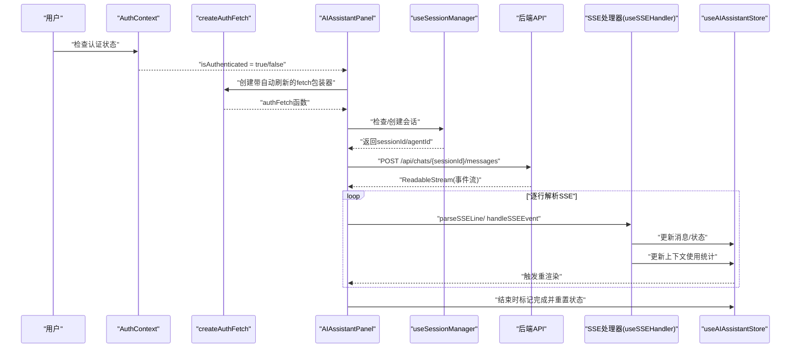

**图表来源**
- [AIAssistantPanel.tsx:85-93](file://frontend/src/components/canvas/AIAssistantPanel.tsx#L85-L93)
- [useSessionManager.ts:48-108](file://frontend/src/components/ai-assistant/hooks/useSessionManager.ts#L48-L108)
- [useSSEHandler.ts:52-357](file://frontend/src/components/ai-assistant/hooks/useSSEHandler.ts#L52-L357)
- [useAIAssistantStore.ts:206-239](file://frontend/src/store/useAIAssistantStore.ts#L206-L239)
- [AuthContext.tsx:51-114](file://frontend/src/context/AuthContext.tsx#L51-L114)

## 详细组件分析

### AIAssistantPanel 主面板
- 面板显隐与拖拽：使用 Framer Motion 的 dragControls 实现拖拽定位，拖拽开始时禁止文本选择，拖拽结束后恢复文本选择并更新面板位置
- 会话初始化：首次打开或缺失会话时，根据剧院ID创建/加载会话并拉取消息历史
- 发送流程：校验会话，构造请求头与body，使用 AbortController 取消上一次请求，读取可读流并逐行解析SSE事件
- 滚动与焦点：消息变化时平滑滚动至底部；发送后自动聚焦输入框
- 尺寸与拖拽：支持左/底/角落八种手柄调整尺寸，提供更精细的尺寸控制
- 图像编辑上下文：新增图像编辑上下文横幅，显示当前编辑的节点信息
- **新增** 性能监控集成：使用 `usePerformanceMonitor` 钩子监控面板性能，包括Long Task检测和FPS监控
- **新增** 增强的认证处理：使用 `createAuthFetch` 函数创建带自动令牌刷新的fetch包装器

**更新** 新增了性能监控集成和增强的认证处理，AI助手面板现在能够监控自身性能并提供更可靠的令牌刷新机制

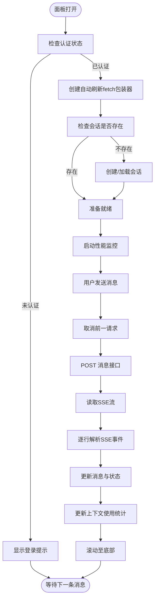

**图表来源**
- [AIAssistantPanel.tsx:85-93](file://frontend/src/components/canvas/AIAssistantPanel.tsx#L85-L93)
- [AIAssistantPanel.tsx:95-98](file://frontend/src/components/canvas/AIAssistantPanel.tsx#L95-L98)
- [AIAssistantPanel.tsx:115-211](file://frontend/src/components/canvas/AIAssistantPanel.tsx#L115-L211)

**章节来源**
- [AIAssistantPanel.tsx:14-466](file://frontend/src/components/canvas/AIAssistantPanel.tsx#L14-L466)

### PanelHeader 面板头部
- 智能体选择：下拉菜单展示可用智能体及其目标节点类型
- 清空会话：删除当前会话的消息历史
- 关闭面板：隐藏面板
- 拖拽：头部作为拖拽句柄，支持拖拽移动面板
- 上下文使用统计：新增HeaderContextBattery组件，替代原有的ContextBatteryIcon

**更新** PanelHeader组件新增了HeaderContextBattery组件，替代原有的ContextBatteryIcon，移除了复杂的Framer Motion动画和hover面板交互，简化了上下文使用统计的显示方式

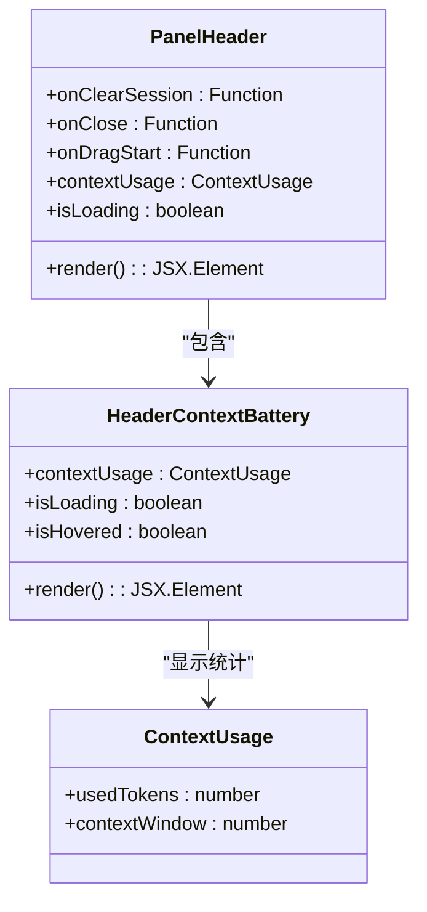

**图表来源**
- [PanelHeader.tsx:19-72](file://frontend/src/components/ai-assistant/PanelHeader.tsx#L19-L72)
- [PanelHeader.tsx:80-246](file://frontend/src/components/ai-assistant/PanelHeader.tsx#L80-L246)
- [useAIAssistantStore.ts:74-78](file://frontend/src/store/useAIAssistantStore.ts#L74-L78)

**章节来源**
- [PanelHeader.tsx:19-246](file://frontend/src/components/ai-assistant/PanelHeader.tsx#L19-L246)

### HeaderContextBattery 头部上下文电池组件
- 简化设计：移除了复杂的Framer Motion动画和hover面板交互
- 实时显示：提供当前上下文使用率的实时显示，支持10%步长的颜色变化
- 加载状态：在发送消息时显示消耗动画效果
- 简洁交互：移除了详细的hover面板，仅保留基本的电池图标和百分比显示

**新增** 专门的头部上下文电池组件，替代原有的ContextBatteryIcon，提供简化的上下文使用统计显示

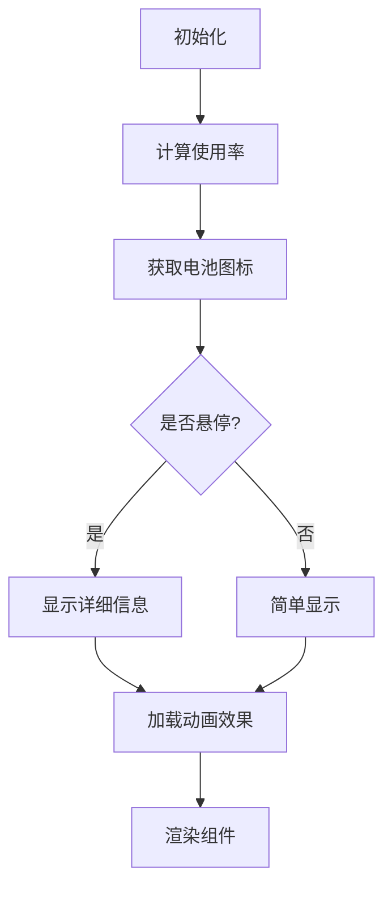

**图表来源**
- [PanelHeader.tsx:80-246](file://frontend/src/components/ai-assistant/PanelHeader.tsx#L80-L246)

**章节来源**
- [PanelHeader.tsx:80-246](file://frontend/src/components/ai-assistant/PanelHeader.tsx#L80-L246)

### ChatMessage 消息渲染
- 用户消息：右对齐，圆角右侧，纯文本展示
- AI消息：左对齐，圆角左侧，支持 Markdown 渲染与代码块样式
- 流式渲染：当消息处于 streaming 状态且内容为空时显示"思考中"指示器；否则使用打字机效果渲染
- 扩展能力：支持技能调用、工具调用、多智能体协作步骤的可视化展示
- **优化** 等待动画逻辑：移除了不必要的等待动画，仅在特定条件下显示加载指示器

**更新** 优化了消息渲染逻辑，移除了不必要的等待动画，提升了性能和用户体验

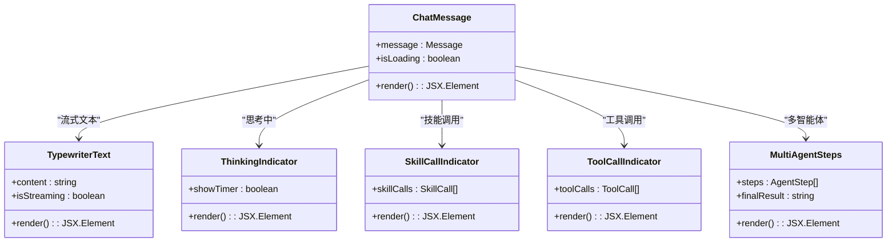

**图表来源**
- [ChatMessage.tsx:52-170](file://frontend/src/components/ai-assistant/ChatMessage.tsx#L52-L170)
- [TypewriterText.tsx:46-81](file://frontend/src/components/ai-assistant/TypewriterText.tsx#L46-L81)
- [ThinkingIndicator.tsx:13-56](file://frontend/src/components/ai-assistant/ThinkingIndicator.tsx#L13-L56)
- [SkillCallIndicator.tsx:18-55](file://frontend/src/components/ai-assistant/SkillCallIndicator.tsx#L18-L55)
- [ToolCallIndicator.tsx:20-109](file://frontend/src/components/ai-assistant/ToolCallIndicator.tsx#L20-L109)
- [MultiAgentSteps.tsx:28-128](file://frontend/src/components/canvas/MultiAgentSteps.tsx#L28-L128)

**章节来源**
- [ChatMessage.tsx:52-170](file://frontend/src/components/ai-assistant/ChatMessage.tsx#L52-L170)

### MessageInput 输入组件
- 行为：Enter 发送，Shift+Enter 换行；发送后清空输入并自动聚焦
- 状态：发送中禁用输入与发送按钮；显示"AI 正在响应"提示
- 上下文使用可视化：集成ContextUsageBar组件，提供上下文使用统计的电池图标显示
- 附加：预留附件按钮（当前为占位）
- **改进** 加载状态管理：新增`isLoadingAgents`状态，提供Agent列表加载的精确指示

**更新** 集成了ContextUsageBar组件，提供上下文使用统计的电池图标显示，改进了加载状态管理

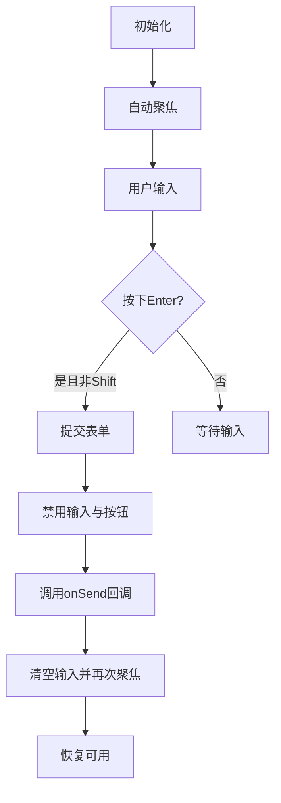

**图表来源**
- [MessageInput.tsx:17-182](file://frontend/src/components/ai-assistant/MessageInput.tsx#L17-L182)

**章节来源**
- [MessageInput.tsx:17-182](file://frontend/src/components/ai-assistant/MessageInput.tsx#L17-L182)

### ContextUsageBar 上下文使用可视化系统
- 四格电池图标：使用四个电池格子表示上下文使用情况，颜色根据使用率变化（绿色-黄色-红色）
- 鼠标悬停详情：提供详细的上下文使用统计面板，包括已使用、上限、剩余和使用率
- 实时更新：通过 Framer Motion 动画效果展示上下文使用变化
- 集成方式：在 AIAssistantPanel 和 MessageInput 中都集成了此组件

**更新** 保持原有功能不变，继续提供完整的上下文使用统计展示

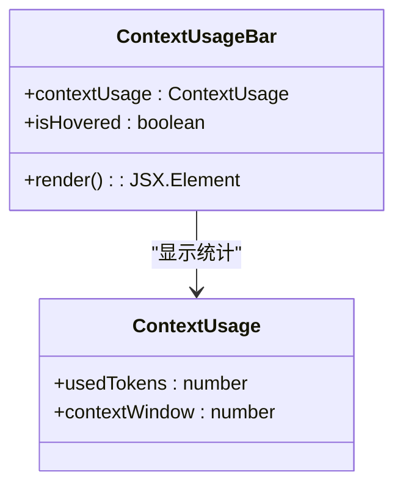

**图表来源**
- [ContextUsageBar.tsx:23-141](file://frontend/src/components/ai-assistant/ContextUsageBar.tsx#L23-L141)
- [useAIAssistantStore.ts:74-78](file://frontend/src/store/useAIAssistantStore.ts#L74-L78)

**章节来源**
- [ContextUsageBar.tsx:23-141](file://frontend/src/components/ai-assistant/ContextUsageBar.tsx#L23-L141)

### 实时通信与状态同步（SSE）
- 事件解析：逐行解析 event/data，支持多轮次与工具/技能调用状态叠加
- 状态机：维护技能/工具/步骤/多智能体状态，按事件更新最后一条AI消息
- 上下文使用统计：在 billing 和 task_completed 事件中更新上下文使用统计
- 结束与错误：done 事件标记消息完成并重置状态；error 事件追加错误消息
- 计费与画布同步：billing 事件更新积分余额；canvas_updated 事件触发画布同步

**更新** 增强了上下文使用统计的更新机制，在多个 SSE 事件中都能更新上下文使用情况

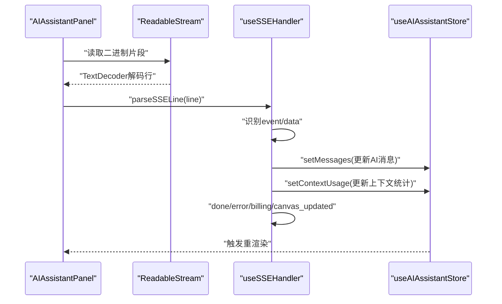

**图表来源**
- [AIAssistantPanel.tsx:173-198](file://frontend/src/components/canvas/AIAssistantPanel.tsx#L173-L198)
- [useSSEHandler.ts:52-357](file://frontend/src/components/ai-assistant/hooks/useSSEHandler.ts#L52-L357)

**章节来源**
- [useSSEHandler.ts:24-357](file://frontend/src/components/ai-assistant/hooks/useSSEHandler.ts#L24-L357)

### 会话管理（useSessionManager）
- 加载智能体：获取可用智能体列表，支持加载状态
- 创建会话：优先查找剧院下现有会话，否则创建新会话并绑定默认智能体
- 切换智能体：为当前剧院创建新会话并更新智能体信息
- 清空会话：删除消息历史并保留会话与智能体

**更新** 保持原有功能不变，继续提供完整的会话管理功能

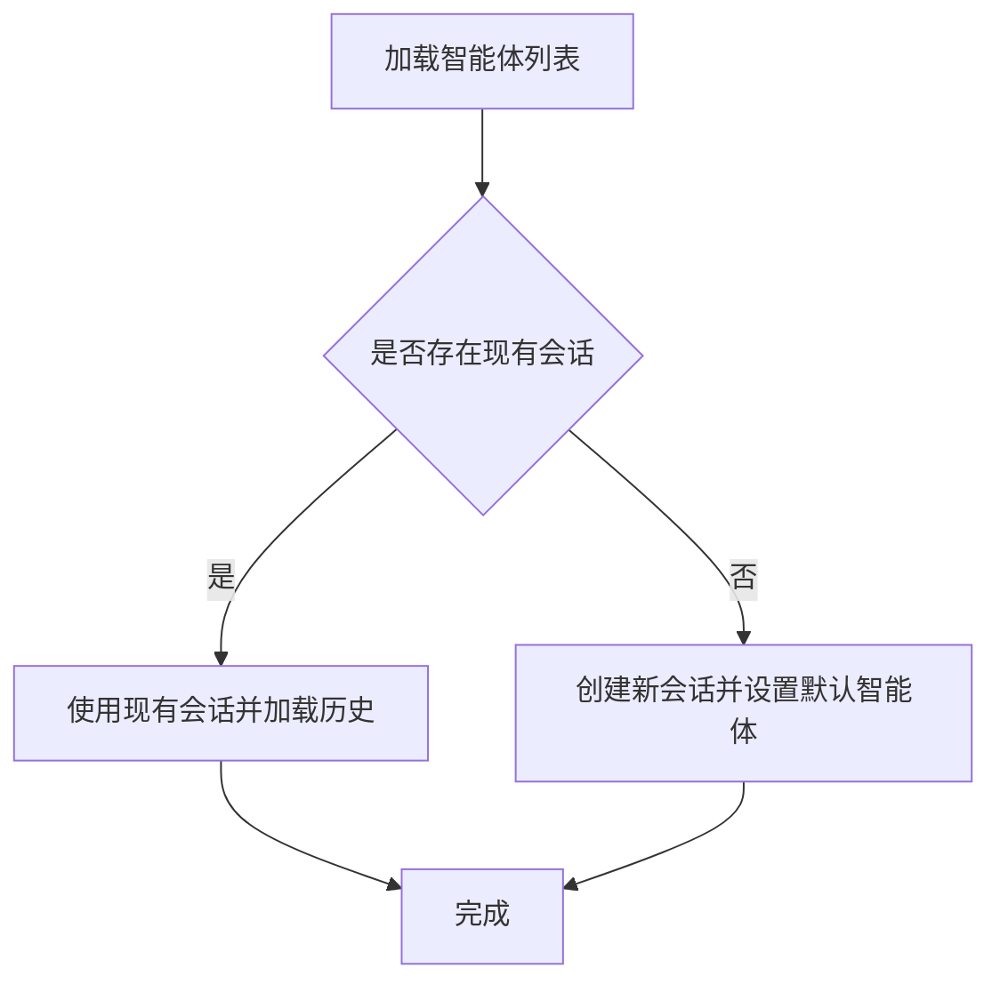

**图表来源**
- [useSessionManager.ts:32-108](file://frontend/src/components/ai-assistant/hooks/useSessionManager.ts#L32-L108)

**章节来源**
- [useSessionManager.ts:12-179](file://frontend/src/components/ai-assistant/hooks/useSessionManager.ts#L12-L179)

### 数据模型与状态
- Message：角色、内容、状态（流式/完成）、扩展字段（技能/工具/多智能体）
- SkillCall/ToolCall：名称、参数、状态
- MultiAgentData/AgentStep：步骤集合、最终结果、总Tokens、积分消耗
- ContextUsage：上下文使用统计，包含已使用Token数和上下文窗口大小
- Store：面板可见性、剧院ID、消息、会话、面板尺寸与位置、图像编辑上下文、剧院会话缓存
- **新增** LoadingDots：浮动加载动画组件，提供三点跳跃动画效果
- **新增** PerformanceMetrics：性能监控数据结构，包含Long Task、LCP、FID、CLS和FPS指标

**更新** 新增了 ContextUsage 数据模型、LoadingDots 组件和 PerformanceMetrics 数据模型，用于存储上下文使用统计信息、加载动画效果和性能监控数据

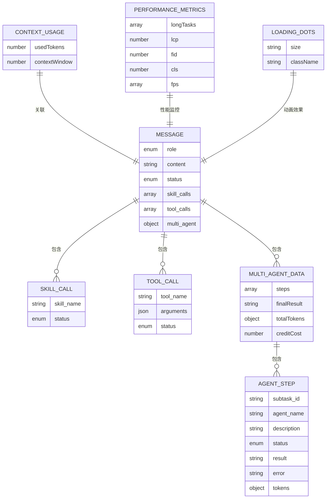

**图表来源**
- [useAIAssistantStore.ts:42-50](file://frontend/src/store/useAIAssistantStore.ts#L42-L50)
- [useAIAssistantStore.ts:7-18](file://frontend/src/store/useAIAssistantStore.ts#L7-L18)
- [useAIAssistantStore.ts:31-37](file://frontend/src/store/useAIAssistantStore.ts#L31-L37)
- [useAIAssistantStore.ts:20-29](file://frontend/src/store/useAIAssistantStore.ts#L20-L29)
- [useAIAssistantStore.ts:74-78](file://frontend/src/store/useAIAssistantStore.ts#L74-L78)
- [usePerformanceMonitor.ts:5-20](file://frontend/src/components/ai-assistant/hooks/usePerformanceMonitor.ts#L5-L20)

**章节来源**
- [useAIAssistantStore.ts:42-136](file://frontend/src/store/useAIAssistantStore.ts#L42-L136)

## 性能监控系统

### usePerformanceMonitor 钩子
usePerformanceMonitor是一个全面的性能监控系统，提供以下核心功能：

- **Long Task 监控**：检测超过阈值（默认200ms）的长任务，提供详细的性能警告
- **LCP (最大内容绘制)**：监控页面主要内容的绘制时间
- **FID (首次输入延迟)**：测量用户首次交互的响应时间
- **CLS (累积布局偏移)**：跟踪页面布局的稳定性
- **FPS 监控**：实时监控帧率，提供流畅度指标

**新增** 全面的性能监控系统，帮助识别和解决性能瓶颈

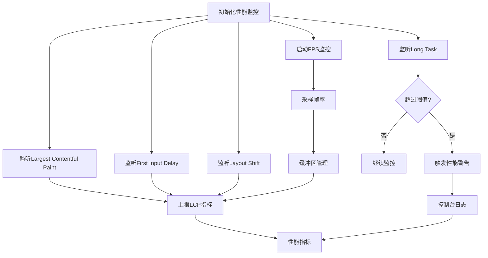

**图表来源**
- [usePerformanceMonitor.ts:75-200](file://frontend/src/components/ai-assistant/hooks/usePerformanceMonitor.ts#L75-L200)

**章节来源**
- [usePerformanceMonitor.ts:1-236](file://frontend/src/components/ai-assistant/hooks/usePerformanceMonitor.ts#L1-L236)

### useMeasurePerformance 工具
useMeasurePerformance提供精确的操作性能测量能力：

- **同步操作测量**：测量函数执行时间，输出到控制台
- **异步操作测量**：测量Promise操作的执行时间
- **可配置操作名称**：便于区分不同类型的性能测量

**新增** 精确的操作性能测量工具，帮助开发者定位性能热点

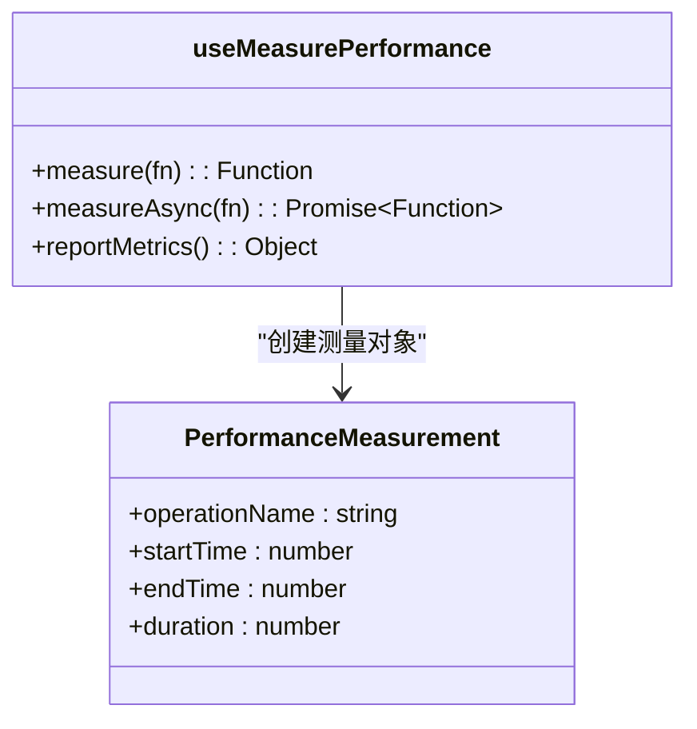

**图表来源**
- [usePerformanceMonitor.ts:209-233](file://frontend/src/components/ai-assistant/hooks/usePerformanceMonitor.ts#L209-L233)

**章节来源**
- [usePerformanceMonitor.ts:209-233](file://frontend/src/components/ai-assistant/hooks/usePerformanceMonitor.ts#L209-L233)

## 认证与令牌刷新机制

### createAuthFetch 函数
AuthContext中新增的createAuthFetch函数提供自动令牌刷新的fetch包装器：

- **自动令牌刷新**：在401错误时自动尝试刷新令牌
- **请求队列管理**：并发请求排队等待令牌刷新完成
- **透明重试**：刷新成功后自动重试原请求
- **错误处理**：刷新失败时提供清晰的错误处理

**新增** 增强的认证处理机制，提供更可靠的令牌管理和错误处理

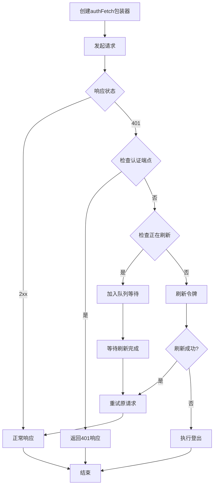

**图表来源**
- [AuthContext.tsx:51-114](file://frontend/src/context/AuthContext.tsx#L51-L114)

**章节来源**
- [AuthContext.tsx:51-114](file://frontend/src/context/AuthContext.tsx#L51-L114)

### 增强的AuthContext
AuthContext现已集成以下增强功能：

- **自动令牌刷新**：通过createAuthFetch函数提供透明的令牌刷新
- **请求队列**：处理并发请求的令牌刷新冲突
- **错误恢复**：在令牌刷新失败时提供优雅的错误恢复
- **类型安全**：完整的TypeScript类型定义

**更新** AuthContext增强了令牌刷新机制，提供更可靠的认证处理

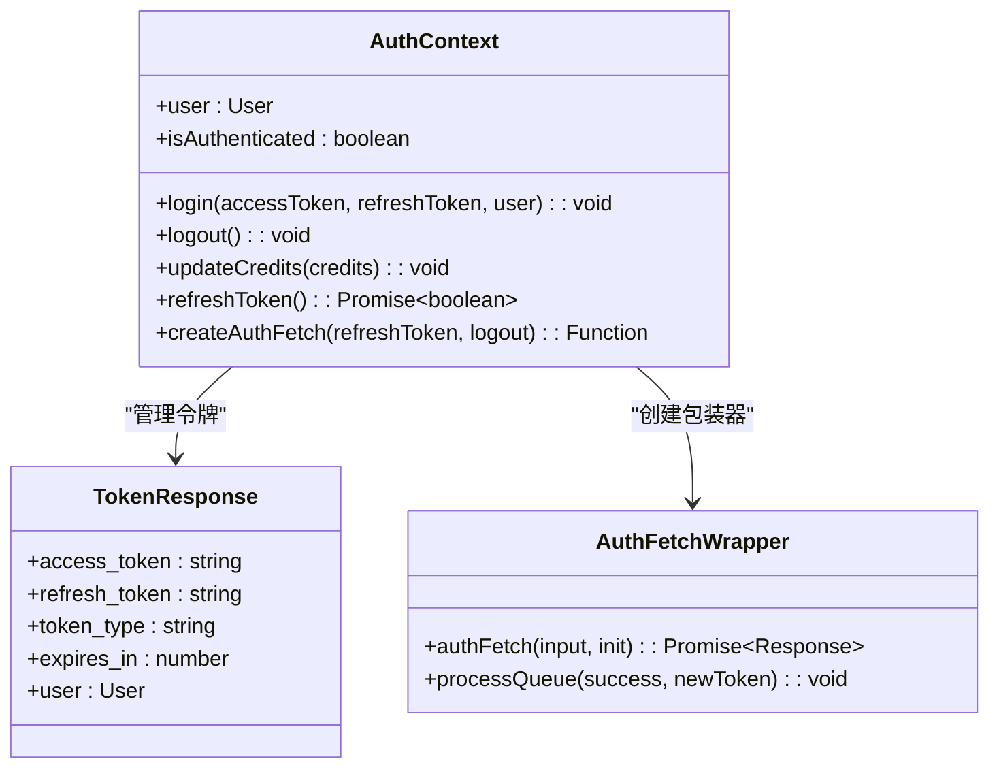

**图表来源**
- [AuthContext.tsx:31-47](file://frontend/src/context/AuthContext.tsx#L31-L47)
- [AuthContext.tsx:23-29](file://frontend/src/context/AuthContext.tsx#L23-L29)
- [AuthContext.tsx:51-114](file://frontend/src/context/AuthContext.tsx#L51-L114)

**章节来源**
- [AuthContext.tsx:1-207](file://frontend/src/context/AuthContext.tsx#L1-L207)

## 依赖关系分析
- 组件耦合：AIAssistantPanel 依赖多个子组件与Hooks；子组件之间低耦合，通过store共享状态
- 状态依赖：所有组件通过 useAIAssistantStore 读写状态，避免跨层级传递
- 网络依赖：useSessionManager 与 useSSEHandler 依赖 api.ts；SSE事件处理依赖 AuthContext 更新积分
- 外部库：React、Framer Motion（动画）、Lucide Icons、React Markdown、Remark GFM
- **新增** 性能监控依赖：usePerformanceMonitor 依赖浏览器性能API
- **新增** 认证依赖：AIAssistantPanel 依赖 AuthContext 的自动令牌刷新功能

**更新** 新增了性能监控和认证相关的依赖关系

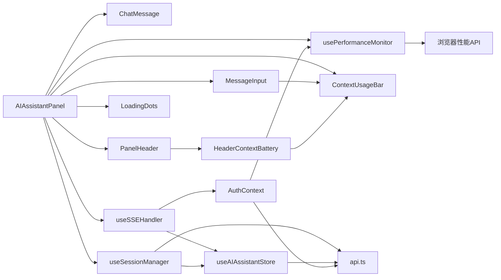

**图表来源**
- [AIAssistantPanel.tsx:11-23](file://frontend/src/components/canvas/AIAssistantPanel.tsx#L11-L23)
- [useSSEHandler.ts:24-357](file://frontend/src/components/ai-assistant/hooks/useSSEHandler.ts#L24-L357)
- [useSessionManager.ts:12-179](file://frontend/src/components/ai-assistant/hooks/useSessionManager.ts#L12-L179)
- [usePerformanceMonitor.ts:1-236](file://frontend/src/components/ai-assistant/hooks/usePerformanceMonitor.ts#L1-L236)
- [api.ts:1-84](file://frontend/src/lib/api.ts#L1-L84)
- [AuthContext.tsx:1-207](file://frontend/src/context/AuthContext.tsx#L1-L207)

**章节来源**
- [AIAssistantPanel.tsx:11-23](file://frontend/src/components/canvas/AIAssistantPanel.tsx#L11-L23)
- [useSSEHandler.ts:24-357](file://frontend/src/components/ai-assistant/hooks/useSSEHandler.ts#L24-L357)
- [useSessionManager.ts:12-179](file://frontend/src/components/ai-assistant/hooks/useSessionManager.ts#L12-L179)
- [usePerformanceMonitor.ts:1-236](file://frontend/src/components/ai-assistant/hooks/usePerformanceMonitor.ts#L1-L236)
- [api.ts:1-84](file://frontend/src/lib/api.ts#L1-L84)
- [AuthContext.tsx:1-207](file://frontend/src/context/AuthContext.tsx#L1-L207)

## 性能考量
- 流式渲染：仅更新最后一条AI消息，减少重渲染范围
- 状态持久化：store 使用持久化中间件，面板尺寸、位置与剧院会话缓存减少重复初始化
- 请求取消：AbortController 在发送新消息时取消旧请求，避免竞态与内存泄漏
- 滚动优化：仅在消息数量变化时滚动，避免频繁DOM操作
- 图像编辑上下文：仅在面板顶部显示横幅，不影响消息列表渲染
- 上下文使用统计：使用 Framer Motion 动画效果，提供流畅的视觉反馈
- **新增** 性能监控：usePerformanceMonitor提供全面的性能指标监测，帮助识别性能瓶颈
- **新增** 自动令牌刷新：createAuthFetch函数提供透明的令牌刷新，避免401错误影响用户体验
- **新增** 请求队列管理：并发请求排队等待令牌刷新，避免竞态条件
- **新增** 优化的等待动画：移除不必要的等待动画，提升渲染性能
- **新增** 改进的加载状态管理：精确的加载状态指示，避免界面闪烁

**更新** 新增了性能监控和认证相关的性能考量，包括性能指标监测、自动令牌刷新和请求队列管理

## 故障排查指南
- 401未授权：api.ts 已内置401刷新队列；若仍失败，检查本地存储中的令牌是否有效
- 402余额不足：主面板捕获HTTP错误并提示；SSE事件中 billing 与多智能体模式也会提示
- 请求被取消：发送新消息会中断旧请求；确认网络状况与后端SSE连接稳定性
- 会话异常：使用 useSessionManager 的 createSessionForTheater 与 clearSession 进行重建与清空
- 积分不同步：SSE 中 billing 事件会更新积分；若未更新，检查 AuthContext.updateCredits 是否被调用
- 上下文使用统计异常：检查 SSE 事件中的 context_usage 字段是否正确传递
- **新增** 性能监控问题：检查浏览器是否支持PerformanceObserver API；确认usePerformanceMonitor配置正确
- **新增** 令牌刷新失败：检查AuthContext中refreshToken函数的实现；确认刷新端点可用
- **新增** 请求队列阻塞：检查是否有过多并发请求导致队列堆积；优化请求频率
- **新增** 自动刷新循环：检查createAuthFetch函数是否正确处理刷新状态标志

**更新** 新增了性能监控和认证相关的故障排查指南

**章节来源**
- [AIAssistantPanel.tsx:165-171](file://frontend/src/components/canvas/AIAssistantPanel.tsx#L165-L171)
- [useSSEHandler.ts:278-298](file://frontend/src/components/ai-assistant/hooks/useSSEHandler.ts#L278-L298)
- [api.ts:31-81](file://frontend/src/lib/api.ts#L31-L81)
- [useSessionManager.ts:133-148](file://frontend/src/components/ai-assistant/hooks/useSessionManager.ts#L133-L148)
- [AuthContext.tsx:96-102](file://frontend/src/context/AuthContext.tsx#L96-L102)
- [usePerformanceMonitor.ts:79-106](file://frontend/src/components/ai-assistant/hooks/usePerformanceMonitor.ts#L79-L106)
- [AuthContext.tsx:51-114](file://frontend/src/context/AuthContext.tsx#L51-L114)

## 结论
AI助手面板通过清晰的分层架构与完善的Hook体系，实现了从会话管理、实时流式传输到消息渲染与多智能体协作的完整闭环。新增的性能监控系统通过usePerformanceMonitor钩子提供了全面的性能指标监测，包括Long Task检测、LCP、FID、CLS和FPS监控，帮助开发者识别和解决性能瓶颈。增强的认证处理机制通过createAuthFetch函数提供自动令牌刷新功能，确保用户获得无缝的认证体验。改进的加载状态管理提供了更精确的加载指示，优化的消息渲染逻辑移除了不必要的等待动画，提升了性能和用户体验。新增的HeaderContextBattery组件替代了原有的ContextBatteryIcon，移除了复杂的Framer Motion动画和hover面板交互，简化了上下文使用统计的显示方式。ContextUsageBar组件继续保持原有功能，提供完整的上下文使用统计展示。改进的拖拽定位功能和八向尺寸调整功能进一步提升了面板的易用性和灵活性。其可扩展的状态模型与事件驱动的SSE处理，为后续自定义消息类型与交互行为提供了良好基础。

## 附录

### 配置选项与扩展开发指南
- 自定义消息类型
  - 在 Message 接口中扩展字段（如多媒体内容），并在 ChatMessage 中新增渲染分支
  - 在 useSSEHandler 中增加对应事件类型，更新 store 并触发渲染
  - 参考路径：[useAIAssistantStore.ts:42-50](file://frontend/src/store/useAIAssistantStore.ts#L42-L50)，[ChatMessage.tsx:78-121](file://frontend/src/components/ai-assistant/ChatMessage.tsx#L78-L121)，[useSSEHandler.ts:66-327](file://frontend/src/components/ai-assistant/hooks/useSSEHandler.ts#L66-L327)
- 自定义交互行为
  - 在 MessageInput 中扩展快捷键或输入行为，注意与isLoading状态协同
  - 在 PanelHeader 中扩展更多操作入口（如导出、分享）
  - 参考路径：[MessageInput.tsx:32-50](file://frontend/src/components/ai-assistant/MessageInput.tsx#L32-L50)，[PanelHeader.tsx:93-120](file://frontend/src/components/ai-assistant/PanelHeader.tsx#L93-L120)
- 多智能体协作
  - 在 useSSEHandler 中完善子任务事件处理，确保步骤状态与最终结果正确合并
  - 在 MultiAgentSteps 中扩展统计与结果预览
  - 参考路径：[useSSEHandler.ts:158-276](file://frontend/src/components/ai-assistant/hooks/useSSEHandler.ts#L158-L276)，[MultiAgentSteps.tsx:28-128](file://frontend/src/components/canvas/MultiAgentSteps.tsx#L28-L128)
- 上下文使用可视化系统
  - 在 useSSEHandler 中更新 ContextUsage 状态，确保上下文使用统计的准确性
  - 在 AIAssistantPanel 和 MessageInput 中集成 ContextUsageBar 组件
  - 在 PanelHeader 中使用 HeaderContextBattery 组件替代原有的ContextBatteryIcon
  - 参考路径：[useSSEHandler.ts:260-264](file://frontend/src/components/ai-assistant/hooks/useSSEHandler.ts#L260-L264)，[AIAssistantPanel.tsx:325-327](file://frontend/src/components/canvas/AIAssistantPanel.tsx#L325-L327)，[MessageInput.tsx:185-191](file://frontend/src/components/ai-assistant/MessageInput.tsx#L185-L191)，[PanelHeader.tsx:37-41](file://frontend/src/components/ai-assistant/PanelHeader.tsx#L37-L41)
- 网络与鉴权
  - 如需自定义鉴权头或拦截器，修改 api.ts；如需扩展401处理策略，调整 useSSEHandler 中的错误提示
  - **新增** 使用createAuthFetch函数创建带自动令牌刷新的fetch包装器
  - 参考路径：[api.ts:8-17](file://frontend/src/lib/api.ts#L8-L17)，[useSSEHandler.ts:319-324](file://frontend/src/components/ai-assistant/hooks/useSSEHandler.ts#L319-L324)，[AuthContext.tsx:51-114](file://frontend/src/context/AuthContext.tsx#L51-L114)
- **新增** 性能监控集成
  - 在组件中使用 `usePerformanceMonitor` 钩子进行性能监控
  - 配置性能监控选项，如长任务阈值和FPS监控开关
  - 使用 `useMeasurePerformance` 工具测量特定操作的性能
  - 参考路径：[AIAssistantPanel.tsx:85-93](file://frontend/src/components/canvas/AIAssistantPanel.tsx#L85-L93)，[usePerformanceMonitor.ts:31-39](file://frontend/src/components/ai-assistant/hooks/usePerformanceMonitor.ts#L31-L39)，[usePerformanceMonitor.ts:209-233](file://frontend/src/components/ai-assistant/hooks/usePerformanceMonitor.ts#L209-L233)
- **新增** 增强的认证处理
  - 使用 `createAuthFetch` 函数创建带自动令牌刷新的fetch包装器
  - 在组件中使用 `useAuth` 钩子获取认证状态和令牌刷新函数
  - 处理令牌刷新失败的情况，提供优雅的错误恢复
  - 参考路径：[AIAssistantPanel.tsx:29-33](file://frontend/src/components/canvas/AIAssistantPanel.tsx#L29-L33)，[AuthContext.tsx:49](file://frontend/src/context/AuthContext.tsx#L49)，[AuthContext.tsx:171-199](file://frontend/src/context/AuthContext.tsx#L171-L199)
- **新增** 加载状态管理
  - 使用 `isLoading` 和 `isLoadingAgents` 状态提供精确的加载指示
  - 在发送消息时禁用输入，防止重复发送
  - 参考路径：[AIAssistantPanel.tsx:69](file://frontend/src/components/canvas/AIAssistantPanel.tsx#L69)，[MessageInput.tsx:84-85](file://frontend/src/components/ai-assistant/MessageInput.tsx#L84-L85)
- **新增** 浮动加载动画系统
  - 使用 `FloatingLoadingDots` 和 `LoadingDots` 组件提供丰富的动画效果
  - 在发送消息时显示加载动画，提升用户体验
  - 参考路径：[ChatMessage.tsx:62-83](file://frontend/src/components/ai-assistant/ChatMessage.tsx#L62-L83)，[LoadingDots.tsx:23-49](file://frontend/src/components/ai-assistant/LoadingDots.tsx#L23-L49)

### 新增功能详解

#### 性能监控系统
- **全面指标监测**：usePerformanceMonitor钩子提供Long Task、LCP、FID、CLS和FPS的全面性能监测
- **实时性能反馈**：通过回调函数提供实时的性能指标更新
- **阈值配置**：可配置长任务检测阈值，默认200ms
- **自动清理**：组件卸载时自动清理性能观察者和定时器
- **测量工具**：useMeasurePerformance提供精确的操作性能测量能力

#### 增强的认证处理机制
- **自动令牌刷新**：createAuthFetch函数在401错误时自动尝试刷新令牌
- **请求队列管理**：并发请求排队等待令牌刷新完成，避免竞态条件
- **透明重试**：刷新成功后自动重试原请求，对用户透明
- **错误恢复**：刷新失败时提供优雅的错误恢复机制
- **类型安全**：完整的TypeScript类型定义确保类型安全

#### 优化的消息渲染逻辑
- **等待动画移除**：移除了不必要的等待动画，仅在用户发送消息后、AI还未开始回复时显示
- **性能提升**：减少DOM操作，提升渲染性能
- **用户体验**：提供更流畅的交互体验

#### 条件性Agent列表加载
- **安全考虑**：仅在用户已登录时加载Agent列表，防止未认证用户获取敏感信息
- **性能优化**：减少不必要的网络请求，提升应用启动速度
- **用户体验**：避免未认证用户的困惑，提供更清晰的界面反馈

**章节来源**
- [AIAssistantPanel.tsx:85-93](file://frontend/src/components/canvas/AIAssistantPanel.tsx#L85-L93)
- [usePerformanceMonitor.ts:1-236](file://frontend/src/components/ai-assistant/hooks/usePerformanceMonitor.ts#L1-L236)
- [AuthContext.tsx:51-114](file://frontend/src/context/AuthContext.tsx#L51-L114)
- [AIAssistantPanel.tsx:29-33](file://frontend/src/components/canvas/AIAssistantPanel.tsx#L29-L33)
- [ChatMessage.tsx:62-83](file://frontend/src/components/ai-assistant/ChatMessage.tsx#L62-L83)
- [LoadingDots.tsx:23-49](file://frontend/src/components/ai-assistant/LoadingDots.tsx#L23-L49)
- [MessageInput.tsx:84-85](file://frontend/src/components/ai-assistant/MessageInput.tsx#L84-L85)