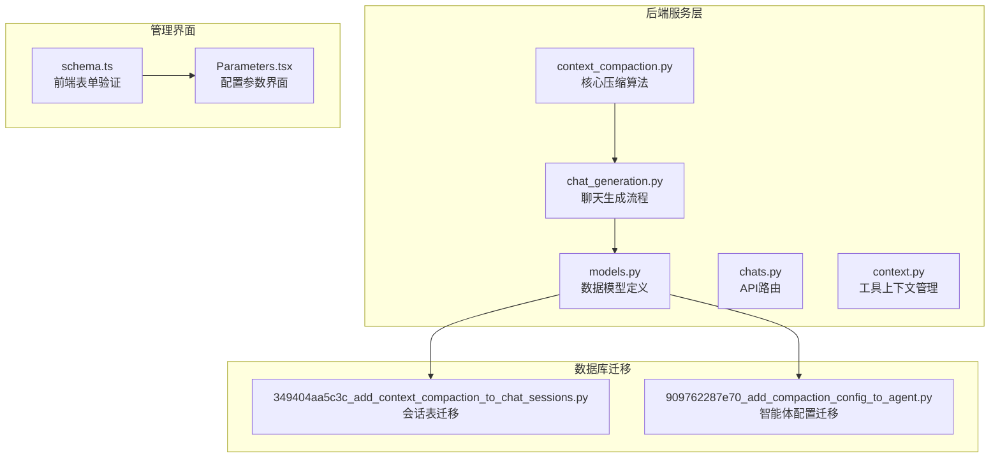
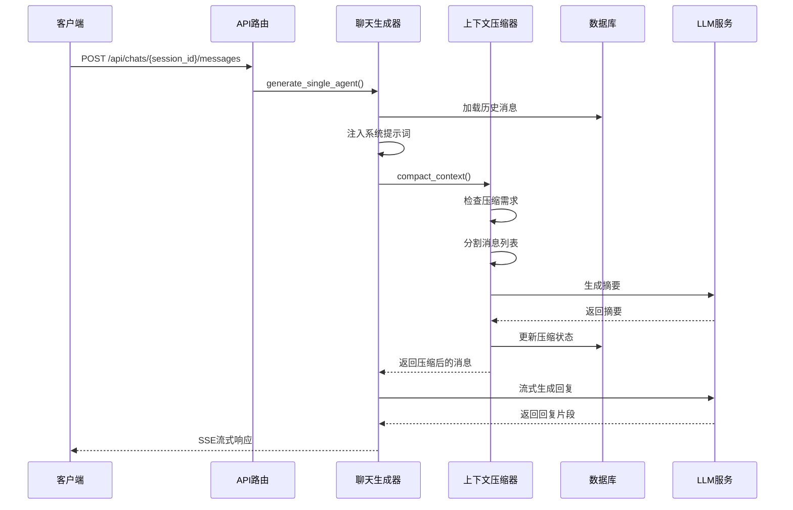
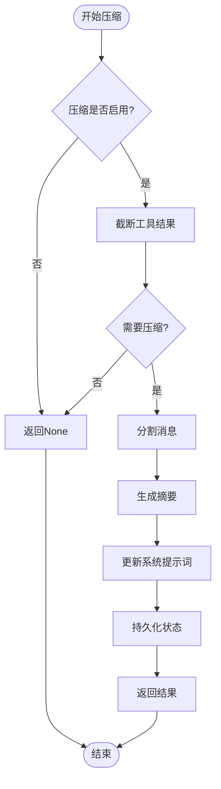
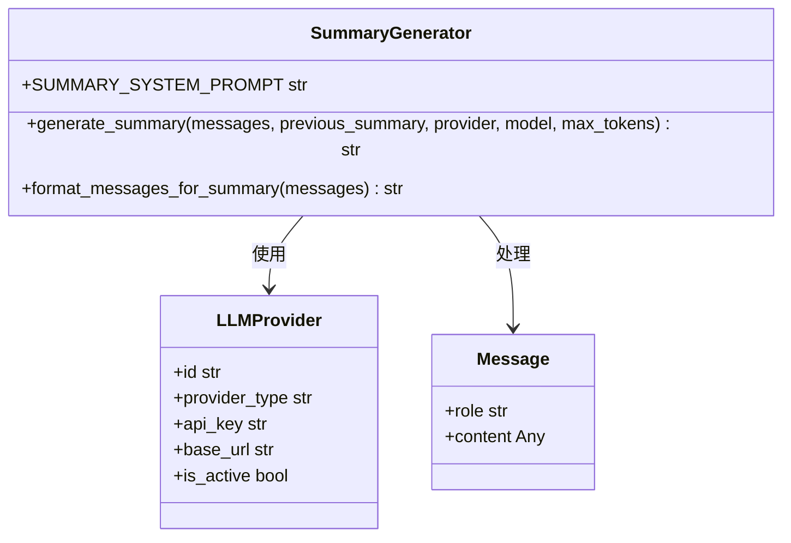
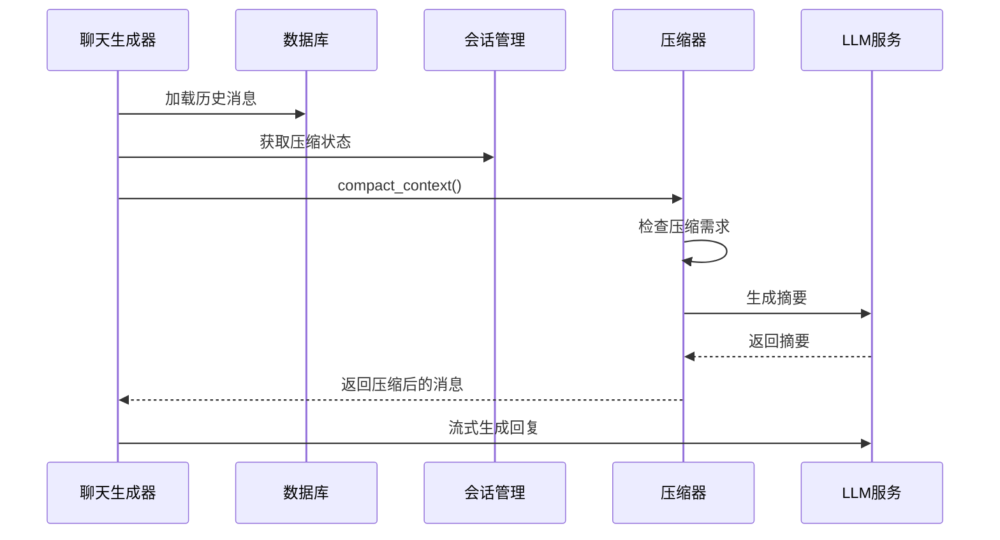
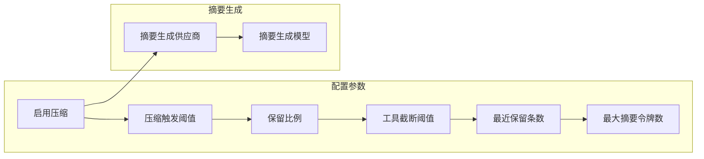
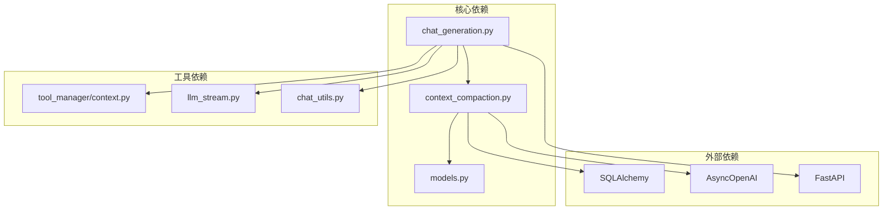

# 上下文压缩系统

<cite>
**本文档引用的文件**
- [context_compaction.py](file://backend/services/context_compaction.py)
- [chat_generation.py](file://backend/services/chat_generation.py)
- [models.py](file://backend/models.py)
- [chats.py](file://backend/routers/chats.py)
- [context.py](file://backend/services/tool_manager/context.py)
- [349404aa5c3c_add_context_compaction_to_chat_sessions.py](file://backend/migrations/versions/349404aa5c3c_add_context_compaction_to_chat_sessions.py)
- [909762287e70_add_compaction_config_to_agent.py](file://backend/migrations/versions/909762287e70_add_compaction_config_to_agent.py)
- [schema.ts](file://backend/admin/src/components/admin/agents/AgentForm/schema.ts)
- [Parameters.tsx](file://backend/admin/src/components/admin/agents/AgentForm/Parameters.tsx)
</cite>

## 目录
1. [简介](#简介)
2. [项目结构](#项目结构)
3. [核心组件](#核心组件)
4. [架构概览](#架构概览)
5. [详细组件分析](#详细组件分析)
6. [依赖关系分析](#依赖关系分析)
7. [性能考虑](#性能考虑)
8. [故障排除指南](#故障排除指南)
9. [结论](#结论)

## 简介

上下文压缩系统是 Infinite Game 项目中的一个关键功能模块，旨在解决大型语言模型对话中上下文窗口溢出的问题。该系统通过自动识别和压缩过长的历史对话，保持系统提示词和最新消息的完整性，同时利用LLM生成摘要来维护对话的连贯性。

系统采用智能的令牌估算机制，结合可配置的压缩策略，确保在有限的上下文窗口内提供最佳的用户体验。通过将旧消息压缩为简洁的摘要，系统能够在不丢失关键信息的情况下维持长时间的对话。

## 项目结构

上下文压缩系统主要分布在以下目录和文件中：

**图表来源**
- [context_compaction.py:1-305](file://backend/services/context_compaction.py#L1-L305)
- [chat_generation.py:1-429](file://backend/services/chat_generation.py#L1-L429)
- [models.py:178-196](file://backend/models.py#L178-L196)

**章节来源**
- [context_compaction.py:1-305](file://backend/services/context_compaction.py#L1-L305)
- [chat_generation.py:1-429](file://backend/services/chat_generation.py#L1-L429)
- [models.py:178-196](file://backend/models.py#L178-L196)

## 核心组件

### 上下文压缩服务

上下文压缩服务是系统的核心，负责实现完整的压缩算法和管理逻辑：

- **智能令牌估算**：基于字符长度估算令牌数量，无需外部分词器依赖
- **动态压缩决策**：根据配置的阈值和比率自动判断是否需要压缩
- **分层消息处理**：区分系统提示词、压缩消息和保留消息
- **摘要生成**：调用LLM生成高质量的对话摘要

### 聊天生成流程集成

聊天生成流程无缝集成了上下文压缩功能，在生成新回复之前自动检查和执行压缩：

- **历史消息加载**：从数据库加载历史对话，跳过已被压缩覆盖的消息
- **压缩状态检查**：读取会话的压缩状态，确保正确处理
- **实时压缩执行**：在LLM调用前执行压缩，保证上下文大小符合要求

### 数据模型支持

数据库模型提供了压缩功能所需的所有数据结构：

- **ChatSession 表**：包含压缩摘要和压缩计数字段
- **AdminDebugSession 表**：支持管理员调试会话的压缩
- **Agent 表**：存储智能体级别的压缩配置

**章节来源**
- [context_compaction.py:45-62](file://backend/services/context_compaction.py#L45-L62)
- [chat_generation.py:135-141](file://backend/services/chat_generation.py#L135-L141)
- [models.py:178-196](file://backend/models.py#L178-L196)

## 架构概览

上下文压缩系统采用分层架构设计，确保各组件职责清晰且相互解耦：

**图表来源**
- [chat_generation.py:135-141](file://backend/services/chat_generation.py#L135-L141)
- [context_compaction.py:208-305](file://backend/services/context_compaction.py#L208-L305)

系统的关键特性包括：

- **非阻塞压缩**：压缩过程异步执行，不影响主聊天流程
- **智能阈值管理**：根据配置动态调整压缩触发条件
- **错误容错**：摘要生成失败时回退到之前的摘要或保持原状
- **状态持久化**：压缩状态实时保存到数据库

## 详细组件分析

### 上下文压缩算法

压缩算法采用分阶段处理策略，确保在保持对话质量的同时最大化上下文利用率：

**图表来源**
- [context_compaction.py:208-305](file://backend/services/context_compaction.py#L208-L305)

#### 令牌估算机制

系统实现了高效的令牌估算算法，通过字符长度推导令牌数量：

- **基础估算**：每3个字符约等于1个令牌
- **消息开销**：每个消息额外增加4个令牌的开销
- **角色估算**：单独估算消息角色的令牌消耗
- **多模态支持**：支持文本和图像等多种消息类型

#### 消息分割策略

消息分割采用逆序遍历策略，确保最新的消息得到最大程度的保留：

- **系统提示词保护**：始终保留第一条消息（系统提示词）
- **保留比例计算**：根据配置的保留比例计算需要保留的消息数量
- **预算分配**：在保留预算内尽可能多地保留最新消息
- **压缩范围确定**：确定需要压缩的消息范围

**章节来源**
- [context_compaction.py:68-92](file://backend/services/context_compaction.py#L68-L92)
- [context_compaction.py:129-151](file://backend/services/context_compaction.py#L129-L151)

### 工具结果截断

为了进一步节省令牌空间，系统实现了智能的工具结果截断机制：

- **工具消息识别**：自动识别角色为"tool"的消息
- **分级截断策略**：区分新旧工具消息采用不同的截断阈值
- **最近N条保留**：确保最新的工具消息得到完整保留
- **安全截断**：在截断位置添加标记，便于后续恢复

### 摘要生成流程

摘要生成是压缩系统的核心功能，通过专门的LLM调用来生成高质量的对话摘要：

**图表来源**
- [context_compaction.py:167-203](file://backend/services/context_compaction.py#L167-L203)

摘要生成的特点包括：

- **系统提示词**：使用专门设计的摘要生成提示词
- **上下文融合**：结合之前的摘要和当前消息进行生成
- **温度控制**：使用较低的温度值确保摘要的准确性
- **令牌限制**：严格控制摘要的最大令牌数

**章节来源**
- [context_compaction.py:167-203](file://backend/services/context_compaction.py#L167-L203)

### 聊天生成器集成

聊天生成器与压缩系统深度集成，确保在生成新回复时自动应用压缩：

**图表来源**
- [chat_generation.py:135-141](file://backend/services/chat_generation.py#L135-L141)

集成的关键点：

- **延迟执行**：在LLM调用前执行压缩，避免不必要的计算
- **状态同步**：确保压缩状态与数据库保持同步
- **错误处理**：压缩失败时不影响聊天生成流程
- **性能监控**：提供压缩事件的SSE通知

**章节来源**
- [chat_generation.py:135-141](file://backend/services/chat_generation.py#L135-L141)

### 管理界面配置

管理员可以通过前端界面配置上下文压缩的各种参数：

**图表来源**
- [schema.ts:36-46](file://backend/admin/src/components/admin/agents/AgentForm/schema.ts#L36-L46)
- [Parameters.tsx:200-371](file://backend/admin/src/components/admin/agents/AgentForm/Parameters.tsx#L200-L371)

配置选项包括：

- **基本开关**：控制压缩功能的启用/禁用
- **阈值参数**：调整压缩触发的敏感度
- **摘要参数**：控制摘要生成的质量和成本
- **供应商选择**：允许为摘要生成使用独立的LLM供应商

**章节来源**
- [schema.ts:36-46](file://backend/admin/src/components/admin/agents/AgentForm/schema.ts#L36-L46)
- [Parameters.tsx:200-371](file://backend/admin/src/components/admin/agents/AgentForm/Parameters.tsx#L200-L371)

## 依赖关系分析

上下文压缩系统与其他组件的依赖关系如下：

**图表来源**
- [context_compaction.py:15-20](file://backend/services/context_compaction.py#L15-L20)
- [chat_generation.py:8-26](file://backend/services/chat_generation.py#L8-L26)

主要依赖关系：

- **数据库访问**：使用SQLAlchemy ORM进行数据操作
- **LLM集成**：通过AsyncOpenAI客户端调用外部LLM服务
- **工具管理**：依赖工具管理器提供的上下文信息
- **流式处理**：集成LLM流式生成接口

**章节来源**
- [context_compaction.py:15-20](file://backend/services/context_compaction.py#L15-L20)
- [chat_generation.py:8-26](file://backend/services/chat_generation.py#L8-L26)

## 性能考虑

上下文压缩系统在设计时充分考虑了性能优化：

### 令牌估算优化
- **字符计数法**：使用简单的字符计数估算令牌数量，避免复杂的分词开销
- **缓存机制**：对常用消息的令牌估算结果进行缓存
- **批量处理**：一次性估算整个消息列表的令牌消耗

### 压缩效率
- **增量压缩**：只压缩超出阈值的部分，避免全量重新计算
- **智能截断**：先进行工具结果截断，减少后续压缩的工作量
- **异步处理**：压缩过程异步执行，不影响聊天生成的实时性

### 内存管理
- **流式处理**：使用生成器模式处理大量消息，避免内存溢出
- **状态最小化**：只保存必要的压缩状态信息
- **及时释放**：及时清理临时数据结构

## 故障排除指南

### 常见问题及解决方案

**压缩功能未生效**
- 检查智能体的压缩配置是否启用
- 确认上下文窗口是否达到压缩阈值
- 验证LLM供应商配置是否正确

**摘要生成失败**
- 检查LLM API密钥和连接状态
- 确认摘要模型的可用性
- 查看错误日志获取详细信息

**性能问题**
- 调整压缩阈值参数
- 优化消息内容长度
- 检查数据库连接性能

**章节来源**
- [context_compaction.py:200-203](file://backend/services/context_compaction.py#L200-L203)

### 调试建议

1. **启用详细日志**：在开发环境中启用DEBUG级别的日志输出
2. **监控令牌使用**：定期检查令牌使用统计和压缩效果
3. **测试不同配置**：通过管理界面测试不同的压缩参数组合
4. **性能基准测试**：建立压缩性能的基准测试用例

## 结论

上下文压缩系统通过智能化的设计和高效的实现，成功解决了大型语言模型对话中的上下文窗口限制问题。系统采用分层架构，确保了良好的可维护性和扩展性。

关键优势包括：
- **智能压缩算法**：基于令牌估算和动态阈值的智能压缩策略
- **无缝集成**：与聊天生成流程深度集成，无需修改现有代码
- **灵活配置**：提供丰富的配置选项，适应不同的使用场景
- **性能优化**：通过多种优化技术确保系统的高效运行

未来可以考虑的改进方向：
- **更精确的令牌估算**：集成实际的分词器提高估算精度
- **机器学习优化**：使用机器学习模型优化压缩策略
- **缓存机制**：实现摘要的缓存机制减少重复计算
- **监控告警**：建立压缩效果的监控和告警机制

该系统为Infinite Game项目提供了强大的上下文管理能力，为用户提供流畅的长期对话体验。