# 多图片支持增强

<cite>
**本文档引用的文件**
- [backend/services/batch_image_gen.py](file://backend/services/batch_image_gen.py)
- [backend/routers/media.py](file://backend/routers/media.py)
- [backend/models.py](file://backend/models.py)
- [backend/routers/videos.py](file://backend/routers/videos.py)
- [backend/routers/chats.py](file://backend/routers/chats.py)
- [backend/admin/src/types/video.ts](file://backend/admin/src/types/video.ts)
- [frontend/src/components/tiptap-node/image-upload-node/image-upload-node.tsx](file://frontend/src/components/tiptap-node/image-upload-node/image-upload-node.tsx)
- [frontend/src/components/canvas/AIAssistantPanel.tsx](file://frontend/src/components/canvas/AIAssistantPanel.tsx)
- [frontend/src/app/theater/[id]/hooks/useNodeDragToAI.ts](file://frontend/src/app/theater/[id]/hooks/useNodeDragToAI.ts)
- [frontend/src/lib/nodeAttachmentUtils.ts](file://frontend/src/lib/nodeAttachmentUtils.ts)
- [frontend/src/store/useAIAssistantStore.ts](file://frontend/src/store/useAIAssistantStore.ts)
- [frontend/src/components/ai-assistant/NodePreviewCard.tsx](file://frontend/src/components/ai-assistant/NodePreviewCard.tsx)
</cite>

## 更新摘要
**变更内容**
- 新增AI助手面板多图片拖拽功能增强章节
- 更新核心组件分析以包含多图片拖拽功能
- 新增拖拽附件管理系统的详细说明
- 更新架构概览以反映新的拖拽交互流程
- 新增性能考虑章节关于拖拽操作的优化

## 目录
1. [简介](#简介)
2. [项目结构](#项目结构)
3. [核心组件](#核心组件)
4. [架构概览](#架构概览)
5. [详细组件分析](#详细组件分析)
6. [拖拽附件管理系统](#拖拽附件管理系统)
7. [依赖关系分析](#依赖关系分析)
8. [性能考虑](#性能考虑)
9. [故障排除指南](#故障排除指南)
10. [结论](#结论)

## 简介

本文档详细分析了 Infinite Game 项目中的多图片支持增强功能。该项目是一个集成了 AI 功能的创意协作平台，支持文本、图片、视频等多种媒体内容的生成和管理。

本次增强主要围绕以下核心功能：
- 批量图片生成服务
- 多图片上传和管理
- 统一的媒体资源管理
- 前后端协同的图片处理流程
- **新增：AI助手面板的多图片拖拽功能增强，支持最多5个附件的智能管理和拖拽操作**

系统采用前后端分离架构，后端使用 Python FastAPI 提供 RESTful API，前端使用 React 构建用户界面。

## 项目结构

项目采用模块化设计，主要分为以下几个核心部分：

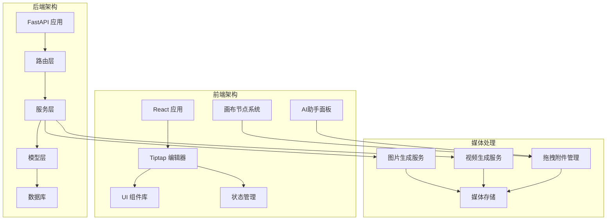

**图表来源**
- [backend/services/batch_image_gen.py:1-187](file://backend/services/batch_image_gen.py#L1-L187)
- [backend/routers/media.py:1-444](file://backend/routers/media.py#L1-L444)
- [frontend/src/components/canvas/AIAssistantPanel.tsx:1-587](file://frontend/src/components/canvas/AIAssistantPanel.tsx#L1-L587)
- [frontend/src/app/theater/[id]/hooks/useNodeDragToAI.ts:1-123](file://frontend/src/app/theater/[id]/hooks/useNodeDragToAI.ts#L1-L123)

**章节来源**
- [backend/services/batch_image_gen.py:1-187](file://backend/services/batch_image_gen.py#L1-L187)
- [backend/routers/media.py:1-444](file://backend/routers/media.py#L1-L444)
- [frontend/src/components/canvas/AIAssistantPanel.tsx:1-587](file://frontend/src/components/canvas/AIAssistantPanel.tsx#L1-L587)
- [frontend/src/app/theater/[id]/hooks/useNodeDragToAI.ts:1-123](file://frontend/src/app/theater/[id]/hooks/useNodeDragToAI.ts#L1-L123)

## 核心组件

### 批量图片生成服务

批量图片生成服务是本次增强的核心组件，支持并发处理多个图片生成请求。

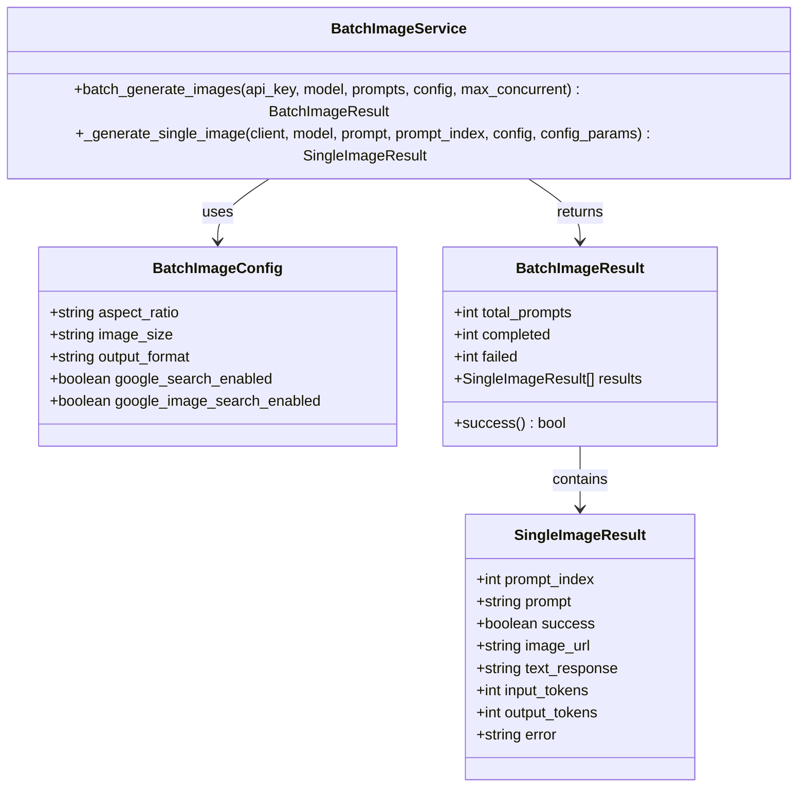

**图表来源**
- [backend/services/batch_image_gen.py:29-63](file://backend/services/batch_image_gen.py#L29-L63)
- [backend/services/batch_image_gen.py:113-187](file://backend/services/batch_image_gen.py#L113-L187)

### 媒体资源管理系统

媒体资源管理系统负责统一管理用户上传的图片、视频等媒体文件。

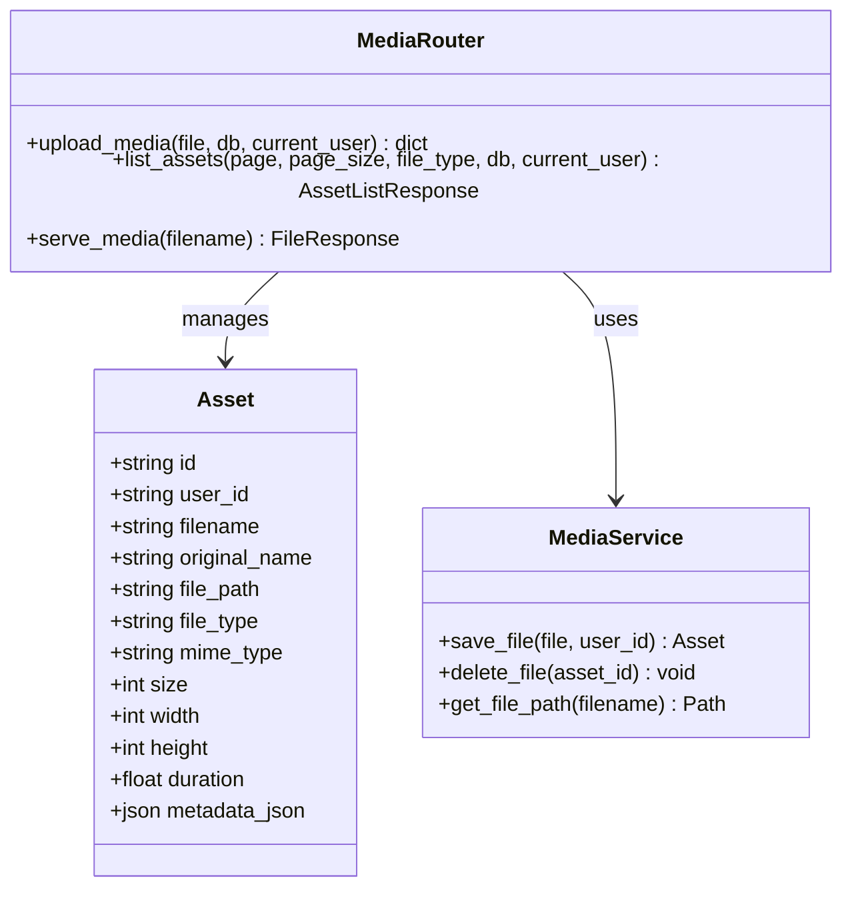

**图表来源**
- [backend/models.py:131-150](file://backend/models.py#L131-L150)
- [backend/routers/media.py:95-149](file://backend/routers/media.py#L95-L149)

### 前端图片上传组件

前端提供了强大的图片上传和预览功能，支持拖拽上传、进度显示和批量操作。

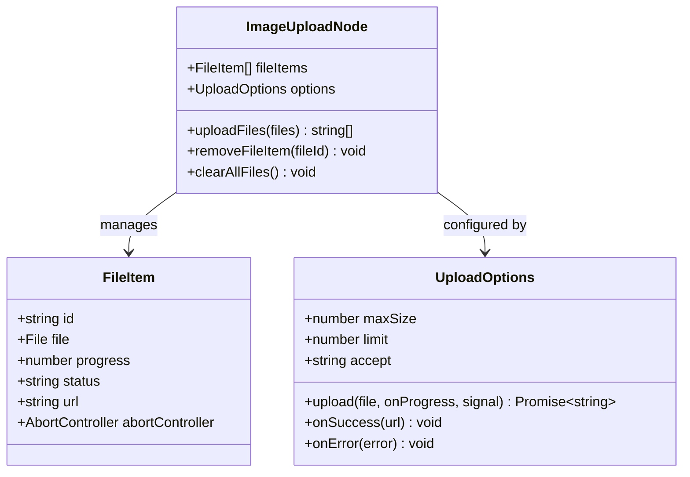

**图表来源**
- [frontend/src/components/tiptap-node/image-upload-node/image-upload-node.tsx:11-80](file://frontend/src/components/tiptap-node/image-upload-node/image-upload-node.tsx#L11-L80)
- [frontend/src/components/tiptap-node/image-upload-node/image-upload-node.tsx:436-555](file://frontend/src/components/tiptap-node/image-upload-node/image-upload-node.tsx#L436-L555)

**章节来源**
- [backend/services/batch_image_gen.py:1-187](file://backend/services/batch_image_gen.py#L1-L187)
- [backend/routers/media.py:1-444](file://backend/routers/media.py#L1-L444)
- [frontend/src/components/tiptap-node/image-upload-node/image-upload-node.tsx:1-555](file://frontend/src/components/tiptap-node/image-upload-node/image-upload-node.tsx#L1-L555)

## 架构概览

系统采用分层架构设计，确保各层职责清晰、耦合度低：

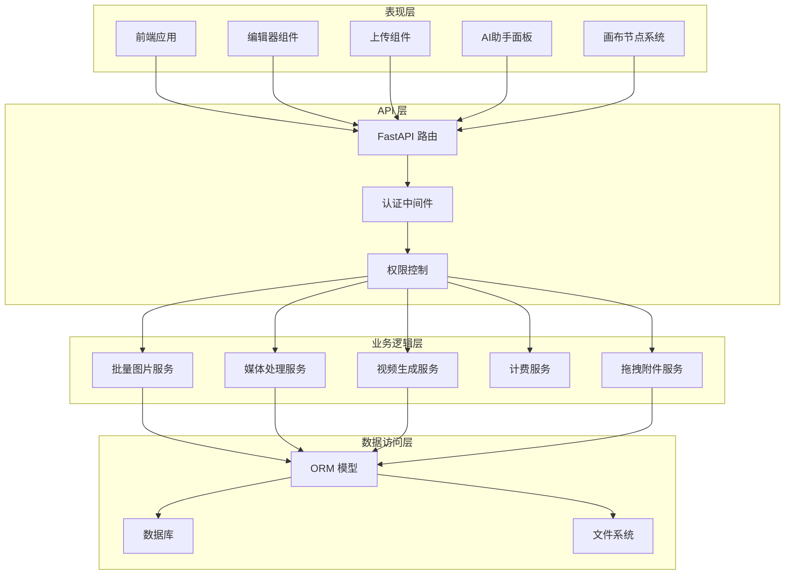

**图表来源**
- [backend/routers/media.py:30-31](file://backend/routers/media.py#L30-L31)
- [backend/routers/videos.py:23-24](file://backend/routers/videos.py#L23-L24)
- [frontend/src/components/canvas/AIAssistantPanel.tsx:40-587](file://frontend/src/components/canvas/AIAssistantPanel.tsx#L40-L587)

## 详细组件分析

### 批量图片生成流程

批量图片生成服务实现了高效的并发处理机制，支持最多 8 个并发请求：

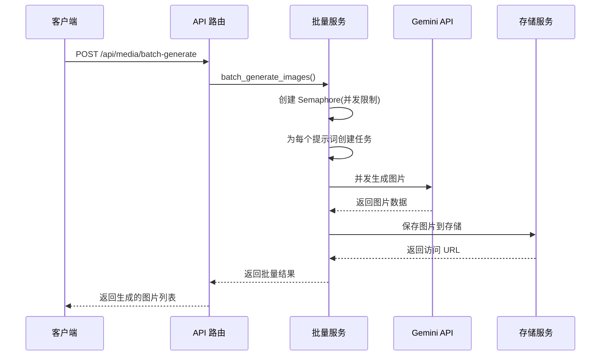

**图表来源**
- [backend/routers/media.py:301-332](file://backend/routers/media.py#L301-L332)
- [backend/services/batch_image_gen.py:113-187](file://backend/services/batch_image_gen.py#L113-L187)

### 媒体文件上传流程

媒体文件上传系统提供了完整的文件管理功能：

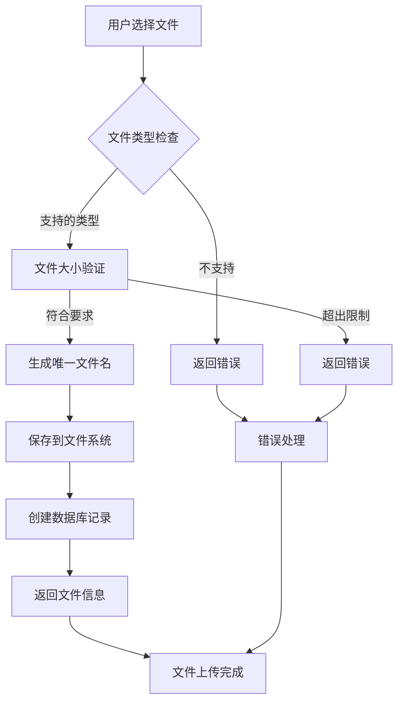

**图表来源**
- [backend/routers/media.py:95-149](file://backend/routers/media.py#L95-L149)
- [backend/models.py:131-150](file://backend/models.py#L131-L150)

### 前端图片上传组件

前端图片上传组件提供了丰富的用户交互功能：

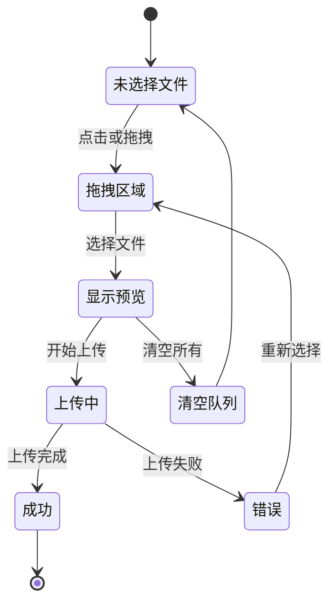

**图表来源**
- [frontend/src/components/tiptap-node/image-upload-node/image-upload-node.tsx:436-555](file://frontend/src/components/tiptap-node/image-upload-node/image-upload-node.tsx#L436-L555)

**章节来源**
- [backend/services/batch_image_gen.py:65-111](file://backend/services/batch_image_gen.py#L65-L111)
- [backend/routers/media.py:155-184](file://backend/routers/media.py#L155-L184)
- [frontend/src/components/tiptap-node/image-upload-node/image-upload-node.tsx:85-213](file://frontend/src/components/tiptap-node/image-upload-node/image-upload-node.tsx#L85-L213)

## 拖拽附件管理系统

### AI助手面板多图片拖拽功能

AI助手面板新增了强大的多图片拖拽功能，支持最多5个附件的智能管理和拖拽操作。

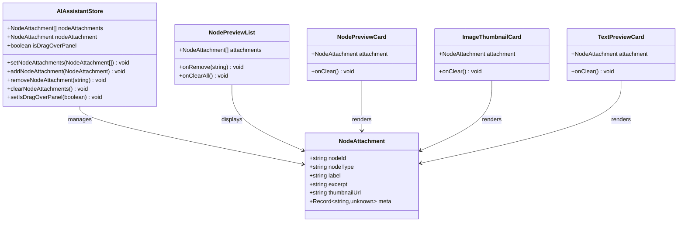

**图表来源**
- [frontend/src/store/useAIAssistantStore.ts:76-188](file://frontend/src/store/useAIAssistantStore.ts#L76-L188)
- [frontend/src/components/ai-assistant/NodePreviewCard.tsx:145-213](file://frontend/src/components/ai-assistant/NodePreviewCard.tsx#L145-L213)

### 拖拽检测和处理流程

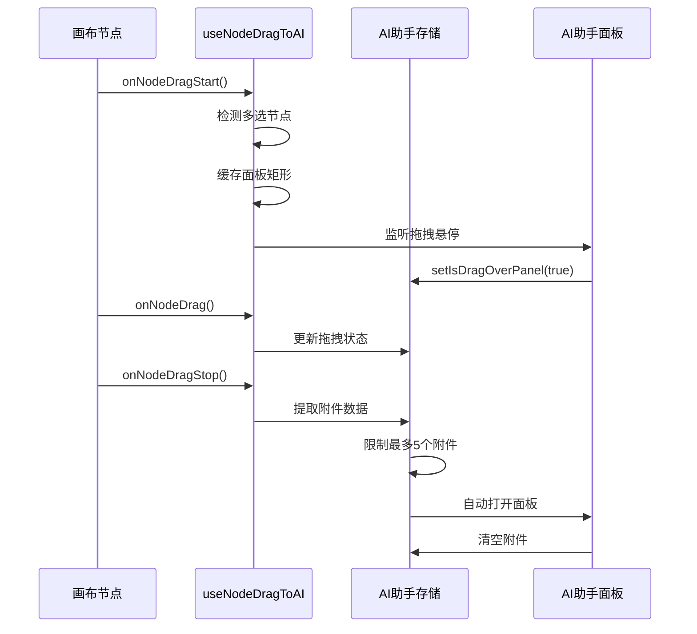

**图表来源**
- [frontend/src/app/theater/[id]/hooks/useNodeDragToAI.ts:32-122](file://frontend/src/app/theater/[id]/hooks/useNodeDragToAI.ts#L32-L122)
- [frontend/src/components/canvas/AIAssistantPanel.tsx:428-441](file://frontend/src/components/canvas/AIAssistantPanel.tsx#L428-L441)

### 节点附件提取和转换

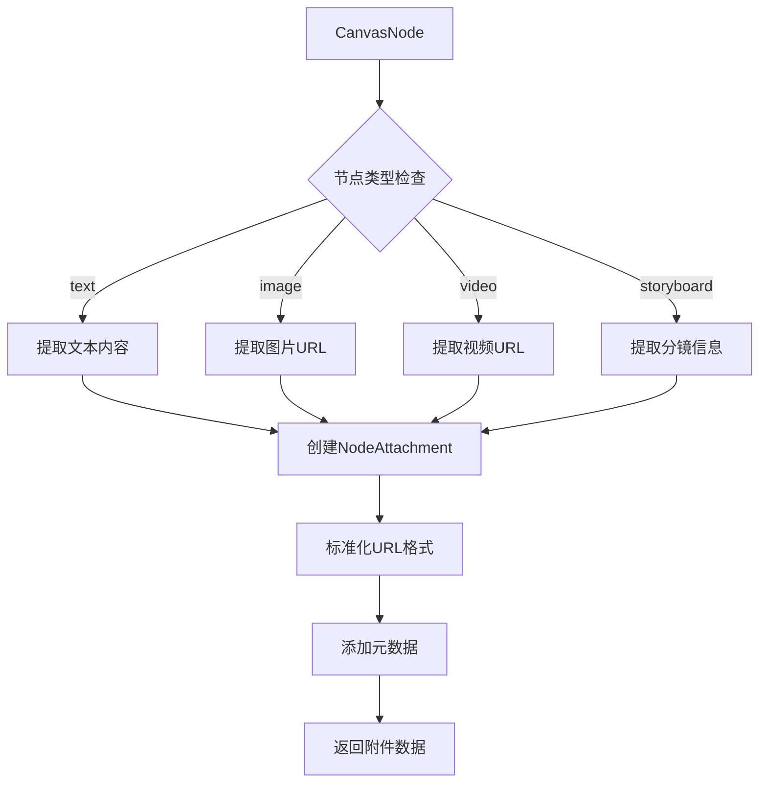

**图表来源**
- [frontend/src/lib/nodeAttachmentUtils.ts:24-97](file://frontend/src/lib/nodeAttachmentUtils.ts#L24-L97)

**章节来源**
- [frontend/src/store/useAIAssistantStore.ts:170-188](file://frontend/src/store/useAIAssistantStore.ts#L170-L188)
- [frontend/src/app/theater/[id]/hooks/useNodeDragToAI.ts:17-122](file://frontend/src/app/theater/[id]/hooks/useNodeDragToAI.ts#L17-L122)
- [frontend/src/lib/nodeAttachmentUtils.ts:83-97](file://frontend/src/lib/nodeAttachmentUtils.ts#L83-L97)

## 依赖关系分析

系统各组件之间的依赖关系清晰明确：

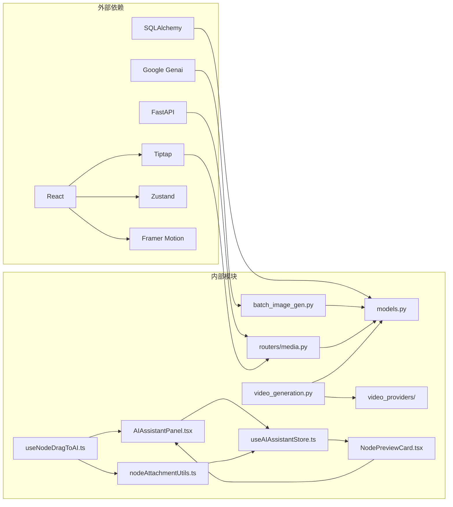

**图表来源**
- [backend/services/batch_image_gen.py:1-14](file://backend/services/batch_image_gen.py#L1-L14)
- [backend/routers/media.py:1-28](file://backend/routers/media.py#L1-L28)
- [frontend/src/app/theater/[id]/hooks/useNodeDragToAI.ts:1-5](file://frontend/src/app/theater/[id]/hooks/useNodeDragToAI.ts#L1-L5)

**章节来源**
- [backend/models.py:1-488](file://backend/models.py#L1-L488)
- [backend/routers/media.py:1-444](file://backend/routers/media.py#L1-L444)
- [frontend/src/store/useAIAssistantStore.ts:1-369](file://frontend/src/store/useAIAssistantStore.ts#L1-L369)

## 性能考虑

### 并发控制优化

系统实现了智能的并发控制机制：

- **并发限制**: 最大支持 8 个并发请求，防止资源耗尽
- **信号量管理**: 使用 asyncio.Semaphore 精确控制并发数量
- **异常处理**: 单个请求失败不影响其他请求执行

### 拖拽操作性能优化

**新增** AI助手面板的多图片拖拽功能在性能方面进行了专门优化：

- **拖拽检测优化**: 使用 `requestAnimationFrame` 优化拖拽检测频率
- **状态更新节流**: 拖拽状态变化时才更新存储状态，减少不必要的渲染
- **附件数量限制**: 最多5个附件的限制防止内存过度占用
- **图片预览优化**: 使用缩略图和懒加载技术提升预览性能
- **虚拟滚动**: 对于大量消息的场景使用虚拟滚动减少DOM节点数量

### 存储优化

- **文件命名策略**: 使用 UUID 确保文件名唯一性
- **扩展名回退**: 支持纯 UUID 文件名的自动识别
- **缓存控制**: 设置合理的缓存头避免重复下载

### 数据库优化

- **索引设计**: 关键字段建立适当索引提高查询效率
- **批量操作**: 支持批量文件操作减少数据库往返
- **连接池**: 使用异步数据库连接池提高并发性能

**章节来源**
- [frontend/src/app/theater/[id]/hooks/useNodeDragToAI.ts:54-67](file://frontend/src/app/theater/[id]/hooks/useNodeDragToAI.ts#L54-L67)
- [frontend/src/store/useAIAssistantStore.ts:318-346](file://frontend/src/store/useAIAssistantStore.ts#L318-L346)

## 故障排除指南

### 常见问题及解决方案

| 问题类型 | 症状 | 可能原因 | 解决方案 |
|---------|------|----------|----------|
| 上传失败 | 文件无法上传 | 文件大小超限 | 检查文件大小限制（图片 50MB） |
| 生成失败 | 图片生成失败 | API 密钥无效 | 验证 LLMProvider 配置 |
| 显示异常 | 图片无法显示 | 文件名格式错误 | 确认文件扩展名存在 |
| 性能问题 | 响应缓慢 | 并发过高 | 调整 max_concurrent 参数 |
| **新增** | 拖拽失败 | 附件数量超限 | 检查最多5个附件限制 |
| **新增** | 拖拽无反应 | 拖拽检测失败 | 验证拖拽区域选择器 |
| **新增** | 预览显示异常 | 附件数据格式错误 | 检查节点附件提取函数 |

### 调试建议

1. **启用日志**: 检查后端日志了解详细错误信息
2. **验证配置**: 确认 LLMProvider 和 Agent 配置正确
3. **测试网络**: 验证外部 API 连接是否正常
4. **监控资源**: 监控服务器 CPU 和内存使用情况
5. **拖拽调试**: 使用浏览器开发者工具检查拖拽事件监听
6. **状态检查**: 验证 AI助手存储状态的正确性

**章节来源**
- [backend/routers/media.py:102-131](file://backend/routers/media.py#L102-L131)
- [backend/services/batch_image_gen.py:106-109](file://backend/services/batch_image_gen.py#L106-L109)
- [frontend/src/app/theater/[id]/hooks/useNodeDragToAI.ts:7-8](file://frontend/src/app/theater/[id]/hooks/useNodeDragToAI.ts#L7-L8)

## 结论

本次多图片支持增强功能成功实现了以下目标：

1. **高效批量处理**: 通过并发控制实现了高性能的批量图片生成
2. **统一资源管理**: 建立了完整的媒体资源生命周期管理体系
3. **优秀的用户体验**: 前端提供了直观易用的图片上传和管理界面
4. **可靠的系统架构**: 采用了模块化设计确保系统的可维护性和扩展性
5. ****新增**：智能拖拽附件管理**: 实现了AI助手面板的多图片拖拽功能，支持最多5个附件的智能管理和拖拽操作

系统现已具备处理复杂多图片工作流的能力，为用户提供了完整的 AI 媒体创作解决方案。新增的拖拽功能特别提升了用户在画布和AI助手面板之间传递媒体内容的效率，配合现有的批量图片生成和媒体管理功能，形成了完整的多媒体创作生态。

未来可以进一步优化的方向包括分布式存储、CDN 加速、更精细的权限控制，以及拖拽操作的进一步性能优化。