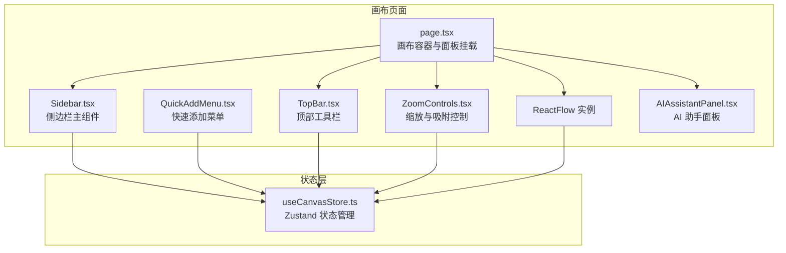
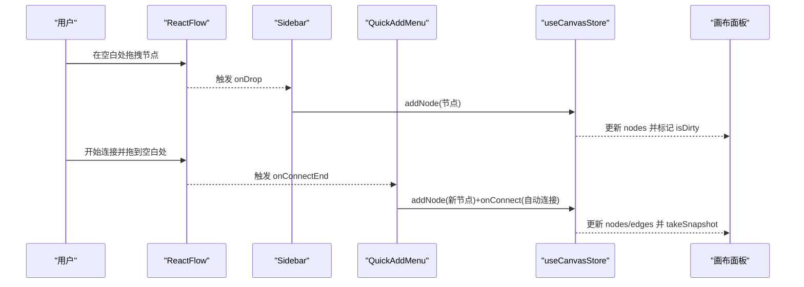
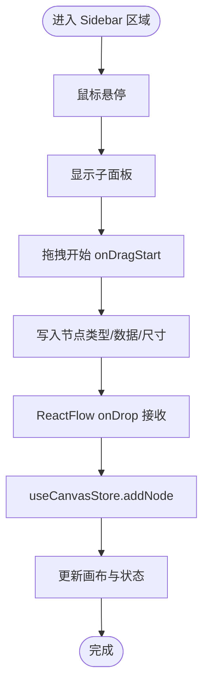
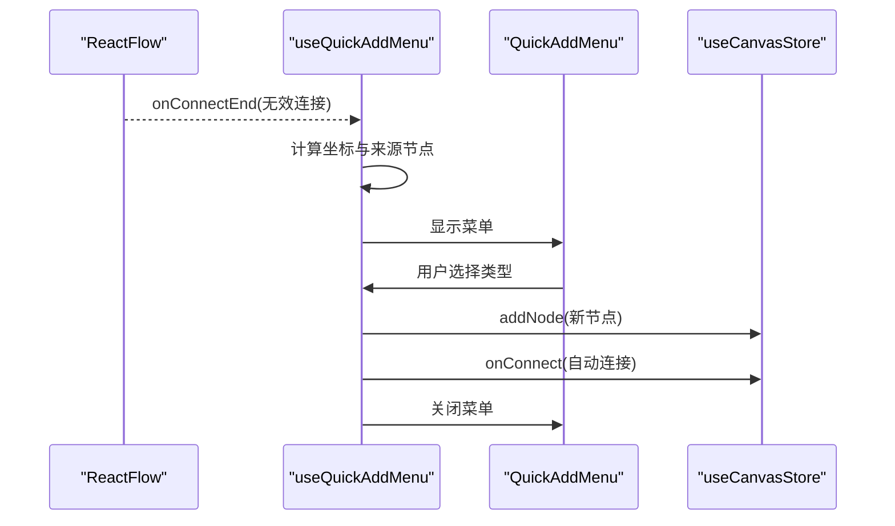
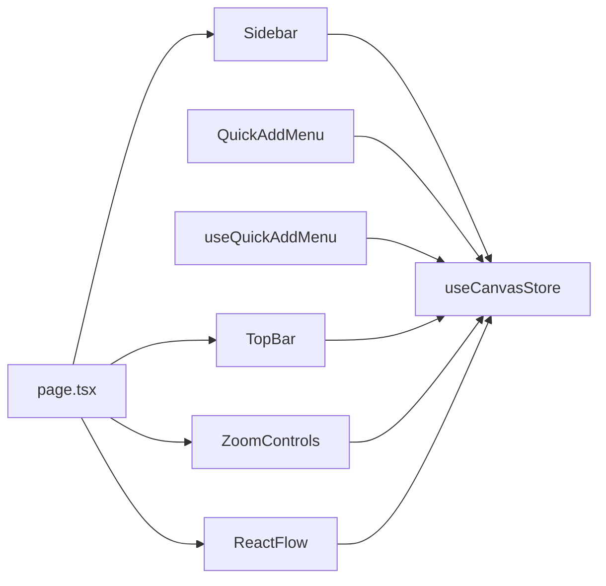

# 侧边栏系统

<cite>
**本文引用的文件**
- [Sidebar.tsx](file://frontend/src/components/canvas/Sidebar.tsx)
- [QuickAddMenu.tsx](file://frontend/src/app/theater/[id]/components/QuickAddMenu.tsx)
- [useQuickAddMenu.ts](file://frontend/src/app/theater/[id]/hooks/useQuickAddMenu.ts)
- [TopBar.tsx](file://frontend/src/app/theater/[id]/components/TopBar.tsx)
- [page.tsx](file://frontend/src/app/theater/[id]/page.tsx)
- [useCanvasStore.ts](file://frontend/src/store/useCanvasStore.ts)
- [ZoomControls.tsx](file://frontend/src/components/canvas/ZoomControls.tsx)
- [AIAssistantPanel.tsx](file://frontend/src/components/canvas/AIAssistantPanel.tsx)
</cite>

## 目录
1. [简介](#简介)
2. [项目结构](#项目结构)
3. [核心组件](#核心组件)
4. [架构总览](#架构总览)
5. [详细组件分析](#详细组件分析)
6. [依赖关系分析](#依赖关系分析)
7. [性能考量](#性能考量)
8. [故障排查指南](#故障排查指南)
9. [结论](#结论)
10. [附录：扩展开发指南](#附录扩展开发指南)

## 简介
本文件系统性解析画布侧边栏系统的实现与架构，重点覆盖：
- Sidebar 主组件的设计与布局管理
- 工具面板、快速添加菜单、属性编辑器等区域划分与交互
- QuickAddMenu 快速添加菜单的功能与使用方法（节点类型选择与添加逻辑）
- TopBar 顶部工具栏的实现（画布操作、视图控制与用户界面）
- 响应式设计与用户体验优化策略
- 扩展开发指南：如何集成自定义工具面板与功能模块

## 项目结构
侧边栏系统位于前端 canvas 子系统内，围绕 ReactFlow 画布构建，通过 Zustand 状态管理与自定义 Hook 协同工作。

图表来源
- [page.tsx:1-484](file://frontend/src/app/theater/[id]/page.tsx#L1-L484)
- [Sidebar.tsx:1-337](file://frontend/src/components/canvas/Sidebar.tsx#L1-L337)
- [QuickAddMenu.tsx:1-42](file://frontend/src/app/theater/[id]/components/QuickAddMenu.tsx#L1-L42)
- [TopBar.tsx:1-37](file://frontend/src/app/theater/[id]/components/TopBar.tsx#L1-L37)
- [ZoomControls.tsx:1-117](file://frontend/src/components/canvas/ZoomControls.tsx#L1-L117)
- [AIAssistantPanel.tsx:1-326](file://frontend/src/components/canvas/AIAssistantPanel.tsx#L1-L326)
- [useCanvasStore.ts:1-540](file://frontend/src/store/useCanvasStore.ts#L1-L540)

章节来源
- [page.tsx:1-484](file://frontend/src/app/theater/[id]/page.tsx#L1-L484)

## 核心组件
- Sidebar：左侧固定悬浮工具条，包含“节点库”和“资源库”两个子面板，支持拖拽添加节点与资源。
- QuickAddMenu：连接开始后在空白处弹出的快速添加菜单，支持一键创建指定类型的节点并自动建立连接。
- TopBar：顶部工具栏，提供返回、标题编辑、撤销/重做、保存状态提示等。
- ZoomControls：底部左下角的画布视图控制，包含缩放滑块、适应屏幕、自动布局、吸附开关与小地图切换。
- AIAssistantPanel：右上角浮动的 AI 助手面板，支持会话管理、消息流式传输与面板尺寸/位置调整。

章节来源
- [Sidebar.tsx:52-337](file://frontend/src/components/canvas/Sidebar.tsx#L52-L337)
- [QuickAddMenu.tsx:12-42](file://frontend/src/app/theater/[id]/components/QuickAddMenu.tsx#L12-L42)
- [TopBar.tsx:7-37](file://frontend/src/app/theater/[id]/components/TopBar.tsx#L7-L37)
- [ZoomControls.tsx:7-117](file://frontend/src/components/canvas/ZoomControls.tsx#L7-L117)
- [AIAssistantPanel.tsx:14-326](file://frontend/src/components/canvas/AIAssistantPanel.tsx#L14-L326)

## 架构总览
侧边栏系统采用“组件-状态-事件”的分层架构：
- 组件层：Sidebar、QuickAddMenu、TopBar、ZoomControls、AIAssistantPanel 各司其职，通过 ReactFlow 的 onConnect/onDrop 等事件驱动状态变更。
- 状态层：useCanvasStore 提供节点、边、历史、同步、吸附等全局状态，并封装持久化与快照机制。
- 事件层：拖拽、连接、键盘快捷键、点击外部关闭等事件在页面容器中统一处理，再调用状态层动作。

图表来源
- [page.tsx:261-313](file://frontend/src/app/theater/[id]/page.tsx#L261-L313)
- [Sidebar.tsx:106-135](file://frontend/src/components/canvas/Sidebar.tsx#L106-L135)
- [useQuickAddMenu.ts:24-123](file://frontend/src/app/theater/[id]/hooks/useQuickAddMenu.ts#L24-L123)
- [useCanvasStore.ts:256-288](file://frontend/src/store/useCanvasStore.ts#L256-L288)

## 详细组件分析

### Sidebar 侧边栏主组件
- 设计定位：固定在画布左侧中央，采用半透明背景与毛玻璃效果，悬停展开子面板。
- 功能区域：
  - 节点库面板：展示多种节点类型（文本卡、图片卡、视频卡、多维表格卡），支持拖拽到画布创建节点。
  - 资源库面板：按图片/视频/其他分类展示当前画布中的资产，支持拖拽直接创建对应节点。
- 交互细节：
  - 鼠标进入/离开触发面板显隐与延时收起，避免误触。
  - 拖拽时创建半透明预览，提升可感知性。
  - 资源库根据节点类型动态聚合，支持 tab 切换。
- 数据与状态：
  - 从 useCanvasStore 读取 nodes，计算资产集合。
  - 通过 onDragStart 将节点类型、默认数据与初始尺寸写入 dataTransfer，交由 ReactFlow onDrop 处理。

图表来源
- [Sidebar.tsx:95-135](file://frontend/src/components/canvas/Sidebar.tsx#L95-L135)
- [Sidebar.tsx:61-93](file://frontend/src/components/canvas/Sidebar.tsx#L61-L93)
- [page.tsx:266-313](file://frontend/src/app/theater/[id]/page.tsx#L266-L313)
- [useCanvasStore.ts:256-264](file://frontend/src/store/useCanvasStore.ts#L256-L264)

章节来源
- [Sidebar.tsx:52-337](file://frontend/src/components/canvas/Sidebar.tsx#L52-L337)
- [useCanvasStore.ts:60-114](file://frontend/src/store/useCanvasStore.ts#L60-L114)

### QuickAddMenu 快速添加菜单
- 触发时机：当连接未有效结束且在空白处释放时弹出。
- 功能：提供“文本卡/图片卡/多维表格卡”三类节点的一键创建，并自动建立连接。
- 交互流程：
  - onConnectEnd 记录来源节点与句柄方向，计算弹窗坐标。
  - 用户点击某类型按钮后，生成新节点并调用 onConnect 完成连接。
  - 点击画布外区域自动关闭菜单。

图表来源
- [useQuickAddMenu.ts:24-123](file://frontend/src/app/theater/[id]/hooks/useQuickAddMenu.ts#L24-L123)
- [QuickAddMenu.tsx:12-42](file://frontend/src/app/theater/[id]/components/QuickAddMenu.tsx#L12-L42)
- [page.tsx:118-219](file://frontend/src/app/theater/[id]/page.tsx#L118-L219)

章节来源
- [useQuickAddMenu.ts:6-140](file://frontend/src/app/theater/[id]/hooks/useQuickAddMenu.ts#L6-L140)
- [QuickAddMenu.tsx:12-42](file://frontend/src/app/theater/[id]/components/QuickAddMenu.tsx#L12-L42)
- [page.tsx:446-471](file://frontend/src/app/theater/[id]/page.tsx#L446-L471)

### TopBar 顶部工具栏
- 位置：画布顶部左上角，包含返回、剧场标题、撤销/重做、保存状态提示。
- 交互：标题输入框直接绑定到 useCanvasStore 的 theaterTitle；撤销/重做调用对应动作；保存状态根据 isSaving/isDirty/lastSavedAt 动态显示。
- 与画布联动：与页面容器中的保存节流逻辑配合，实现自动保存。

章节来源
- [TopBar.tsx:7-37](file://frontend/src/app/theater/[id]/components/TopBar.tsx#L7-L37)
- [page.tsx:411-439](file://frontend/src/app/theater/[id]/page.tsx#L411-L439)
- [useCanvasStore.ts:378-505](file://frontend/src/store/useCanvasStore.ts#L378-L505)

### ZoomControls 缩放与吸附控制
- 功能：缩放滑块、放大/缩小、适应屏幕、自动布局、网格吸附、对齐参考线、小地图。
- 与 ReactFlow 集成：通过 useReactFlow 获取 zoomIn/zoomOut/fitView/zoomTo 等能力；通过 useStore 获取当前 zoom。
- 与状态层联动：开关吸附与小地图状态通过 useCanvasStore 的 setSnapToGrid/setSnapToGuides/onToggleMap 等动作维护。

章节来源
- [ZoomControls.tsx:7-117](file://frontend/src/components/canvas/ZoomControls.tsx#L7-L117)
- [page.tsx:398-409](file://frontend/src/app/theater/[id]/page.tsx#L398-L409)
- [useCanvasStore.ts:203-207](file://frontend/src/store/useCanvasStore.ts#L203-L207)

### AIAssistantPanel AI 助手面板
- 位置：右上角浮动，支持拖拽与调整大小，ESC 关闭。
- 会话与消息：使用 useAIAssistantStore 管理面板状态、消息列表与会话；通过 SSE 流式接收消息。
- 图像编辑上下文：支持在图像编辑场景下附加目标节点信息，便于后续处理。

章节来源
- [AIAssistantPanel.tsx:14-326](file://frontend/src/components/canvas/AIAssistantPanel.tsx#L14-L326)

## 依赖关系分析
- 组件依赖：
  - Sidebar 依赖 useCanvasStore 的 nodes 与拖拽事件处理。
  - QuickAddMenu 与 useQuickAddMenu 依赖 ReactFlow 的连接状态与 screenToFlowPosition。
  - TopBar 与 ZoomControls 依赖 useCanvasStore 的剧院标题、撤销/重做、吸附与保存状态。
  - 页面容器 page.tsx 统一处理 onDrop/onConnectEnd/键盘快捷键等事件，并注入节点类型映射与默认数据。
- 状态依赖：
  - useCanvasStore 提供节点/边/历史/同步/吸附等状态，是所有交互的核心数据源。
  - 通过持久化中间件将关键状态存储于本地，保证刷新不丢失。

图表来源
- [Sidebar.tsx:1-8](file://frontend/src/components/canvas/Sidebar.tsx#L1-L8)
- [useQuickAddMenu.ts:1-5](file://frontend/src/app/theater/[id]/hooks/useQuickAddMenu.ts#L1-L5)
- [TopBar.tsx:1-6](file://frontend/src/app/theater/[id]/components/TopBar.tsx#L1-L6)
- [ZoomControls.tsx:1-6](file://frontend/src/components/canvas/ZoomControls.tsx#L1-L6)
- [page.tsx:18-87](file://frontend/src/app/theater/[id]/page.tsx#L18-L87)
- [useCanvasStore.ts:185-540](file://frontend/src/store/useCanvasStore.ts#L185-L540)

## 性能考量
- 拖拽预览与延迟收起：通过定时器与半透明预览减少不必要的 DOM 更新与视觉闪烁。
- 资源库渲染：使用虚拟滚动容器与懒加载图片/视频，限制最大高度与网格列数，避免大列表渲染开销。
- 历史快照：撤销/重做基于固定长度的历史栈，避免内存膨胀。
- 自动保存节流：2 秒去抖，降低频繁保存带来的网络与数据库压力。
- ReactFlow 优化：最小化 onNodesChange/onEdgesChange 的处理范围，仅在必要时标记 isDirty。

## 故障排查指南
- 连接循环或自环被阻止：onConnect 中检测自环与环路，若检测到则阻断并记录警告。
- 删除边后事件广播：删除边后通过自定义事件通知外部监听者，确保联动逻辑正确执行。
- 保存失败与错误提示：保存接口返回特定状态码时，前端给出友好提示（如积分不足、登录过期等）。
- 拖拽数据缺失：确认 onDragStart 正确写入节点类型、默认数据与尺寸；onDrop 读取顺序与格式一致。
- 快捷键冲突：页面监听 Ctrl+S/Ctrl+Z/Ctrl+Y，确保与浏览器默认行为协调。

章节来源
- [useCanvasStore.ts:238-254](file://frontend/src/store/useCanvasStore.ts#L238-L254)
- [useCanvasStore.ts:276-288](file://frontend/src/store/useCanvasStore.ts#L276-L288)
- [useCanvasStore.ts:478-505](file://frontend/src/store/useCanvasStore.ts#L478-L505)
- [page.tsx:261-313](file://frontend/src/app/theater/[id]/page.tsx#L261-L313)
- [page.tsx:235-259](file://frontend/src/app/theater/[id]/page.tsx#L235-L259)

## 结论
侧边栏系统通过清晰的职责划分与状态集中管理，实现了高效、直观的画布操作体验。Sidebar 提供节点与资源的即取即用入口，QuickAddMenu 优化了连接后的快速建模路径，TopBar/ZoomControls 提升了视图与操作效率，AIAssistantPanel 则拓展了创作辅助能力。整体架构具备良好的可扩展性，便于后续集成更多工具面板与功能模块。

## 附录：扩展开发指南

### 自定义工具面板集成步骤
- 新增组件：在 canvas 目录下创建新的工具面板组件，遵循现有样式与交互模式。
- 注册节点类型：在页面容器的 nodeTypes 中注册新节点类型映射。
- 默认数据与尺寸：在 nodeDefaultData 中为新类型提供默认数据与尺寸映射。
- 事件接入：在 onDrop/onConnectEnd 中处理新类型的拖拽与连接逻辑，必要时调用 addNode 与 onConnect。
- 状态联动：通过 useCanvasStore 的动作更新节点/边状态，并在需要时 takeSnapshot。

章节来源
- [page.tsx:37-46](file://frontend/src/app/theater/[id]/page.tsx#L37-L46)
- [page.tsx:157-163](file://frontend/src/app/theater/[id]/page.tsx#L157-L163)
- [page.tsx:266-313](file://frontend/src/app/theater/[id]/page.tsx#L266-L313)

### 自定义快速添加菜单
- 复用 useQuickAddMenu：在连接无效释放时复用现有逻辑，传入新类型即可。
- 自定义图标与描述：在 QuickAddMenu 中新增按钮项，保持与现有样式一致。
- 自动连接策略：根据来源句柄方向映射目标句柄，确保连接方向符合预期。

章节来源
- [useQuickAddMenu.ts:63-123](file://frontend/src/app/theater/[id]/hooks/useQuickAddMenu.ts#L63-L123)
- [QuickAddMenu.tsx:27-38](file://frontend/src/app/theater/[id]/components/QuickAddMenu.tsx#L27-L38)

### 响应式设计与用户体验优化建议
- 面板显隐：保持悬停触发与延时收起策略，避免误触。
- 拖拽反馈：为拖拽预览增加阴影与半透明效果，提升可感知性。
- 资源库：对长列表启用虚拟滚动与懒加载，限制单屏渲染数量。
- 键盘快捷键：统一 Ctrl+S/Ctrl+Z/Ctrl+Y 行为，减少鼠标依赖。
- 无障碍：为按钮与菜单提供 title 与键盘可达性，确保高对比度与可读性。