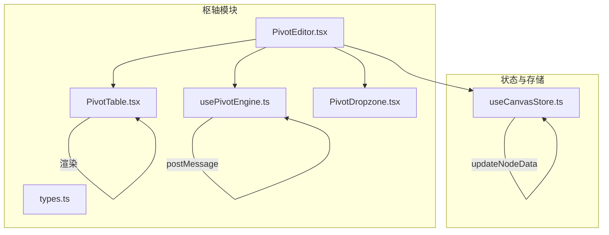
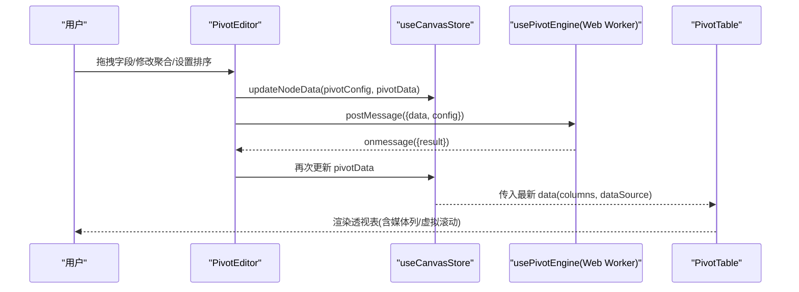
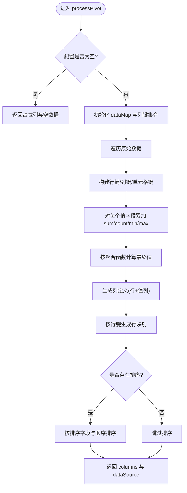
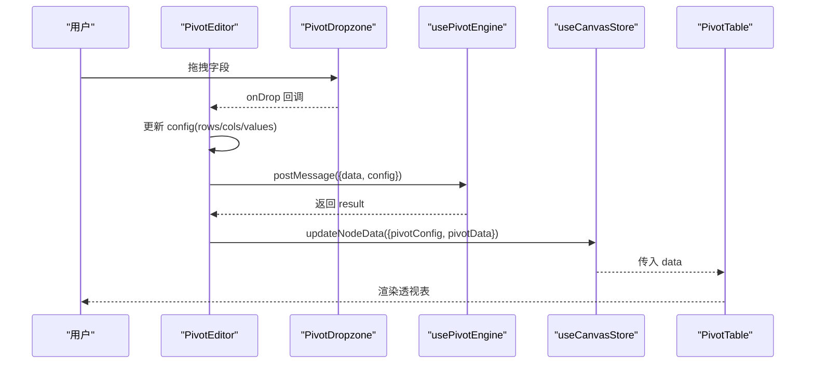
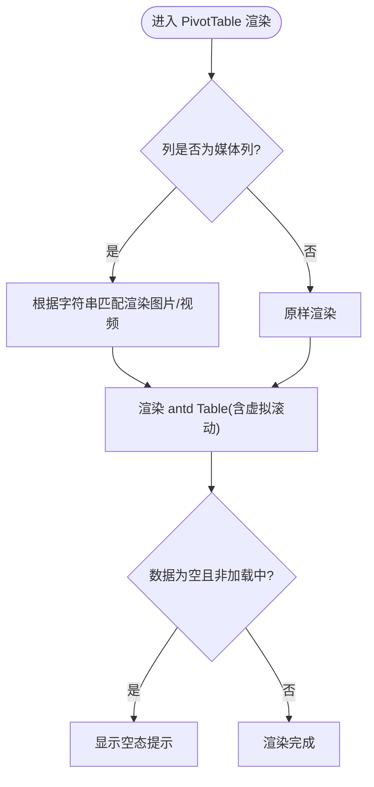
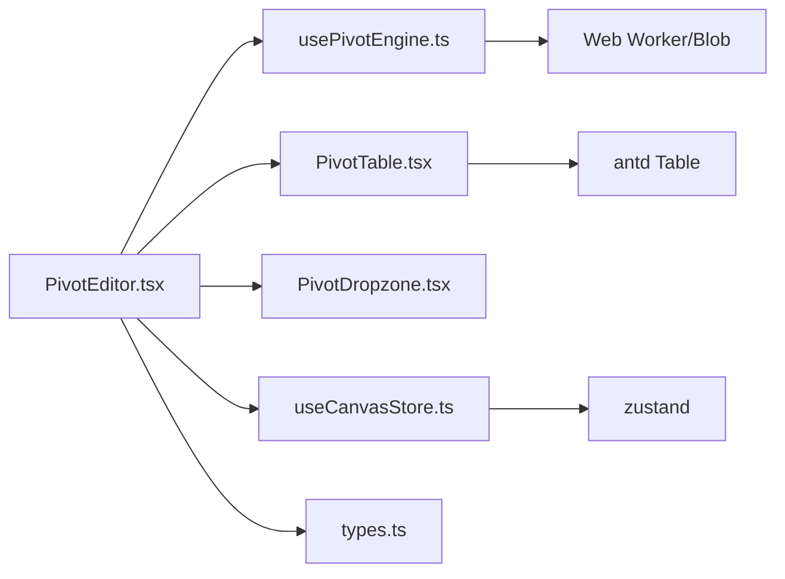

# 枢轴数据分析系统

<cite>
**本文引用的文件**
- [usePivotEngine.ts](file://frontend/src/components/canvas/pivot/usePivotEngine.ts)
- [PivotEditor.tsx](file://frontend/src/components/canvas/pivot/PivotEditor.tsx)
- [PivotTable.tsx](file://frontend/src/components/canvas/pivot/PivotTable.tsx)
- [PivotDropzone.tsx](file://frontend/src/components/canvas/pivot/PivotDropzone.tsx)
- [types.ts](file://frontend/src/components/canvas/pivot/types.ts)
- [useCanvasStore.ts](file://frontend/src/store/useCanvasStore.ts)
- [README.md](file://frontend/src/components/canvas/pivot/README.md)
- [usePivotEngine.test.ts](file://frontend/src/components/canvas/pivot/usePivotEngine.test.ts)
- [PivotEditor.stories.tsx](file://frontend/src/components/canvas/pivot/PivotEditor.stories.tsx)
- [package.json](file://frontend/package.json)
</cite>

## 目录
1. [简介](#简介)
2. [项目结构](#项目结构)
3. [核心组件](#核心组件)
4. [架构总览](#架构总览)
5. [组件详解](#组件详解)
6. [依赖关系分析](#依赖关系分析)
7. [性能考量](#性能考量)
8. [故障排查指南](#故障排查指南)
9. [结论](#结论)
10. [附录](#附录)

## 简介
本系统为前端画布中的“多维表格节点（StoryboardNode）”提供强大的多维分析能力，支持行、列、值的自由拖拽、多种聚合方式，以及基于 Web Worker 与 antd 虚拟滚动的高性能渲染。用户可通过 PivotEditor 进行交互式配置，实时预览 PivotTable 的结果；底层 usePivotEngine 在独立线程中完成交叉表聚合与重组，避免阻塞主线程。

## 项目结构
枢轴分析功能位于前端代码库的画布组件目录下，核心文件如下：
- usePivotEngine.ts：使用 Web Worker 执行透视计算的 Hook
- PivotEditor.tsx：拖拽配置与预览的主入口组件
- PivotTable.tsx：基于 antd 的高性能透视表渲染
- PivotDropzone.tsx：行/列/值区域的拖放接收区
- types.ts：配置与数据类型的定义
- useCanvasStore.ts：画布节点状态管理（含 pivotConfig 与 pivotData）
- README.md：使用说明与性能参数
- usePivotEngine.test.ts：Hook 的单元测试（含 Worker Mock）
- PivotEditor.stories.tsx：Storybook 故事文件

**图表来源**
- [usePivotEngine.ts:1-188](file://frontend/src/components/canvas/pivot/usePivotEngine.ts#L1-L188)
- [PivotEditor.tsx:1-229](file://frontend/src/components/canvas/pivot/PivotEditor.tsx#L1-L229)
- [PivotTable.tsx:1-63](file://frontend/src/components/canvas/pivot/PivotTable.tsx#L1-L63)
- [PivotDropzone.tsx:1-57](file://frontend/src/components/canvas/pivot/PivotDropzone.tsx#L1-L57)
- [types.ts:1-28](file://frontend/src/components/canvas/pivot/types.ts#L1-L28)
- [useCanvasStore.ts:1-540](file://frontend/src/store/useCanvasStore.ts#L1-L540)

**章节来源**
- [README.md:1-53](file://frontend/src/components/canvas/pivot/README.md#L1-L53)
- [package.json:1-92](file://frontend/package.json#L1-L92)

## 核心组件
- usePivotEngine：负责在 Web Worker 中执行透视聚合与列/数据源重建，并通过消息通道返回结果，同时暴露 isCalculating 状态用于 UI 加载提示。
- PivotEditor：提供字段列表、拖放区域（行/列/值）、配置抽屉（聚合方式、全局排序），并把最终配置与结果写回画布节点。
- PivotTable：基于 antd Table 的高性能渲染，内置媒体列渲染（图片/视频预览），支持虚拟滚动与分页。
- PivotDropzone：通用拖放接收区，支持移除与点击项操作回调。
- types：统一定义字段类型、值字段聚合配置、全局配置与结果数据结构。
- useCanvasStore：画布节点数据结构包含 pivotConfig 与 pivotData，用于持久化与跨组件共享。

**章节来源**
- [usePivotEngine.ts:1-188](file://frontend/src/components/canvas/pivot/usePivotEngine.ts#L1-L188)
- [PivotEditor.tsx:1-229](file://frontend/src/components/canvas/pivot/PivotEditor.tsx#L1-L229)
- [PivotTable.tsx:1-63](file://frontend/src/components/canvas/pivot/PivotTable.tsx#L1-L63)
- [PivotDropzone.tsx:1-57](file://frontend/src/components/canvas/pivot/PivotDropzone.tsx#L1-L57)
- [types.ts:1-28](file://frontend/src/components/canvas/pivot/types.ts#L1-L28)
- [useCanvasStore.ts:44-50](file://frontend/src/store/useCanvasStore.ts#L44-L50)

## 架构总览
系统采用“配置驱动 + 独立计算 + 渲染解耦”的架构设计：
- 配置层：PivotEditor 负责收集用户输入（行/列/值/排序），并写入节点数据。
- 计算层：usePivotEngine 在 Web Worker 中完成过滤、聚合、列生成与排序。
- 渲染层：PivotTable 基于 antd Table 渲染，支持虚拟滚动与媒体列渲染。
- 存储层：useCanvasStore 统一管理节点数据（pivotConfig/pivotData），并与后端同步。

**图表来源**
- [PivotEditor.tsx:48-56](file://frontend/src/components/canvas/pivot/PivotEditor.tsx#L48-L56)
- [useCanvasStore.ts:310-318](file://frontend/src/store/useCanvasStore.ts#L310-L318)
- [usePivotEngine.ts:164-171](file://frontend/src/components/canvas/pivot/usePivotEngine.ts#L164-L171)
- [PivotTable.tsx:35-46](file://frontend/src/components/canvas/pivot/PivotTable.tsx#L35-L46)

## 组件详解

### usePivotEngine：透视引擎与数据处理
- 设计要点
  - 使用 Blob + Worker 在后台线程执行计算，避免阻塞 UI。
  - 支持空配置下的占位列与空数据返回，便于编辑器渲染。
  - 聚合维度：行键与列键组合形成单元格键，对每个值字段维护 sum/count/min/max。
  - 聚合函数：sum/count/avg/max/min，分别映射到不同字段后缀。
  - 列生成：行固定左对齐，列标题根据列键拆分展示；当仅有一组列键且为空字符串时，直接输出“字段(聚合)”列名。
  - 排序：支持按任意列（含聚合列）升/降序排序。
- 数据结构
  - 输入：原始数据数组与配置对象（rows/cols/values/sort/filter）。
  - 输出：columns（含列定义与媒体标记）、dataSource（行数据）。
- 错误处理
  - Worker 消息通道捕获异常并通过 error 字段返回，便于上层日志记录。
- 性能特性
  - 使用 Map 与 Set 实现 O(n) 聚合，避免嵌套循环。
  - 列键与行键采用分隔符拼接，保证稳定排序与去重。

**图表来源**
- [usePivotEngine.ts:20-157](file://frontend/src/components/canvas/pivot/usePivotEngine.ts#L20-L157)

**章节来源**
- [usePivotEngine.ts:1-188](file://frontend/src/components/canvas/pivot/usePivotEngine.ts#L1-L188)
- [usePivotEngine.test.ts:1-41](file://frontend/src/components/canvas/pivot/usePivotEngine.test.ts#L1-L41)

### PivotEditor：枢轴编辑器
- 功能概述
  - 字段列表：默认字段或外部数据派生字段（当前示例使用默认字段）。
  - 拖放区域：行/列/值三区，支持拖拽添加与点击移除。
  - 配置抽屉：支持修改值字段的聚合方式与全局排序字段。
  - 实时预览：通过 usePivotEngine 获取结果并渲染 PivotTable。
  - 状态同步：将 pivotConfig 与 pivotData 写回节点数据，供后续使用。
- 交互流程
  - 用户拖拽字段到目标区域，配置更新。
  - 值字段点击打开抽屉，切换聚合方式。
  - 全局排序通过 Select 设置，影响最终 dataSource 排序。
  - 结果通过 updateNodeData 同步至 useCanvasStore。

**图表来源**
- [PivotEditor.tsx:58-88](file://frontend/src/components/canvas/pivot/PivotEditor.tsx#L58-L88)
- [PivotEditor.tsx:126-157](file://frontend/src/components/canvas/pivot/PivotEditor.tsx#L126-L157)
- [PivotEditor.tsx:48-56](file://frontend/src/components/canvas/pivot/PivotEditor.tsx#L48-L56)
- [useCanvasStore.ts:310-318](file://frontend/src/store/useCanvasStore.ts#L310-L318)

**章节来源**
- [PivotEditor.tsx:1-229](file://frontend/src/components/canvas/pivot/PivotEditor.tsx#L1-L229)

### PivotTable：枢轴表格渲染
- 渲染特性
  - 媒体列渲染：对行内字符串进行媒体类型识别（图片/视频），自动渲染预览。
  - 虚拟滚动：启用 antd Table 的 virtual 模式，配合固定滚动尺寸与分页提升大数据集性能。
  - 空态提示：当无数据且非加载中时显示占位提示。
- 性能参数
  - 分页 pageSize：每页 100 条，减少一次性 DOM 节点数量。
  - 滚动尺寸：y=800、x=1200，结合外层容器隐藏溢出。
  - 小尺寸与边框：提升可读性与对比度。

**图表来源**
- [PivotTable.tsx:10-62](file://frontend/src/components/canvas/pivot/PivotTable.tsx#L10-L62)

**章节来源**
- [PivotTable.tsx:1-63](file://frontend/src/components/canvas/pivot/PivotTable.tsx#L1-L63)

### PivotDropzone：拖放区域
- 职责
  - 接收拖拽字段，触发 onDrop 回调。
  - 展示已选字段，支持点击移除与点击项回调。
- 交互
  - onDragOver 阻止默认行为，onDrop 解析拖拽数据并调用回调。

**章节来源**
- [PivotDropzone.tsx:1-57](file://frontend/src/components/canvas/pivot/PivotDropzone.tsx#L1-L57)

### 类型系统：types.ts
- 关键类型
  - PivotField：字段标识、名称与类型（string/number/date/image/video）。
  - PivotValueField：值字段配置（field、agg、format、decimalPlaces）。
  - PivotConfig：透视配置（rows/cols/values/sort/filter）。
  - PivotDataResult：透视结果（columns/dataSource）。
- 作用
  - 统一配置与结果的数据契约，确保 Editor、Engine、Table 之间的类型安全。

**章节来源**
- [types.ts:1-28](file://frontend/src/components/canvas/pivot/types.ts#L1-L28)

## 依赖关系分析
- 组件依赖
  - PivotEditor 依赖 usePivotEngine、PivotTable、PivotDropzone、useCanvasStore、types。
  - PivotTable 依赖 antd Table，内部处理媒体列渲染。
  - usePivotEngine 依赖浏览器 Worker 与 Blob URL。
- 外部依赖
  - antd：提供 Table、Select、Drawer 等 UI 组件。
  - zustand：提供 useCanvasStore 状态管理。
  - lucide-react：图标库。
- 版本与生态
  - Next.js 16、React 19、Ant Design 6、Zustand 5 等版本在 package.json 中声明。

**图表来源**
- [PivotEditor.tsx:1-10](file://frontend/src/components/canvas/pivot/PivotEditor.tsx#L1-L10)
- [PivotTable.tsx:1-3](file://frontend/src/components/canvas/pivot/PivotTable.tsx#L1-L3)
- [usePivotEngine.ts:6-6](file://frontend/src/components/canvas/pivot/usePivotEngine.ts#L6-L6)
- [useCanvasStore.ts:1-18](file://frontend/src/store/useCanvasStore.ts#L1-L18)
- [types.ts:1-28](file://frontend/src/components/canvas/pivot/types.ts#L1-L28)
- [package.json:13-67](file://frontend/package.json#L13-L67)

**章节来源**
- [package.json:13-67](file://frontend/package.json#L13-L67)

## 性能考量
- Web Worker：将透视计算移至后台线程，主线程仅负责渲染与状态更新，避免大表计算阻塞 UI。
- 虚拟滚动：PivotTable 开启 virtual，scroll 提供数值尺寸，分页 pageSize 控制单页节点数量，适合 10k 单元格以上场景。
- 列宽与滚动：固定列宽与横向滚动配合外层容器隐藏溢出，减少重排与绘制成本。
- 排序与渲染：排序在 Worker 内完成，避免多次重绘；媒体列渲染仅在列标记为媒体时生效，降低不必要开销。
- 测试覆盖：usePivotEngine.test.ts 通过 Worker Mock 验证 Hook 初始化与异步返回，保障关键路径稳定性。

**章节来源**
- [README.md:36-40](file://frontend/src/components/canvas/pivot/README.md#L36-L40)
- [usePivotEngine.test.ts:1-41](file://frontend/src/components/canvas/pivot/usePivotEngine.test.ts#L1-L41)
- [PivotTable.tsx:41-46](file://frontend/src/components/canvas/pivot/PivotTable.tsx#L41-L46)

## 故障排查指南
- Worker 异常
  - 现象：控制台出现 Pivot worker error 日志。
  - 排查：检查配置是否为空、字段类型是否匹配、聚合函数是否合法。
  - 处理：在 usePivotEngine 的 onmessage 中捕获错误并记录，必要时回退到默认占位列。
- 数据为空
  - 现象：透视表显示“暂无数据”提示。
  - 排查：确认是否有外部数据接入、字段是否正确拖拽到行/列/值区域。
  - 处理：使用默认字段进行演示，或检查上游节点连接。
- 排序无效
  - 现象：全局排序未生效。
  - 排查：确认排序字段是否存在于 columns 或 dataSource；检查排序方向。
  - 处理：在配置抽屉中重新选择排序字段与方向。
- 媒体列不显示
  - 现象：图片/视频列未渲染预览。
  - 排查：确认列值为图片/视频链接或 data URI；检查列标记是否为媒体列。
  - 处理：修正列值格式或调整列定义。

**章节来源**
- [usePivotEngine.ts:164-167](file://frontend/src/components/canvas/pivot/usePivotEngine.ts#L164-L167)
- [PivotTable.tsx:47-59](file://frontend/src/components/canvas/pivot/PivotTable.tsx#L47-L59)
- [PivotEditor.tsx:205-222](file://frontend/src/components/canvas/pivot/PivotEditor.tsx#L205-L222)

## 结论
枢轴数据分析系统通过“配置驱动 + 独立计算 + 渲染解耦”的架构，实现了高可用、高性能的多维分析体验。usePivotEngine 将复杂计算迁移至 Web Worker，PivotEditor 提供直观的拖放配置，PivotTable 则以虚拟滚动与媒体列渲染保障大规模数据的流畅展示。结合 useCanvasStore 的节点状态管理，系统具备良好的扩展性与可维护性。

## 附录

### 数据流处理说明
- 原始数据转换：由上游节点提供或使用默认字段，PivotEditor 作为入口统一收集配置。
- 计算字段：在 usePivotEngine 中按聚合函数生成新的列键（如 field_agg），并写入 dataSource。
- 汇总统计：在 Worker 内完成，支持 sum/count/avg/max/min，最终返回 columns 与 dataSource。
- 排序：支持按行字段或值字段（含聚合后列）进行升/降序排序。

**章节来源**
- [usePivotEngine.ts:40-79](file://frontend/src/components/canvas/pivot/usePivotEngine.ts#L40-L79)
- [usePivotEngine.ts:145-154](file://frontend/src/components/canvas/pivot/usePivotEngine.ts#L145-L154)

### 扩展开发指南
- 自定义聚合函数
  - 在 usePivotEngine 的聚合计算分支新增 case 分支，映射到新的字段后缀。
  - 更新 PivotEditor 抽屉中的聚合选项，确保用户可选择新聚合。
  - 在 PivotTable 中根据列后缀决定渲染策略（如需要特殊格式化）。
- 自定义数据源集成
  - 在 PivotEditor 中替换默认字段与默认数据，接入真实上游节点数据。
  - 通过 useCanvasStore 的 updateNodeData 将 pivotConfig 与 pivotData 写回节点，实现跨组件共享。
- 性能优化建议
  - 大数据集：优先使用虚拟滚动与分页；合理设置列宽与滚动尺寸。
  - 复杂排序：尽量减少排序字段数量；必要时在上游节点预聚合。
  - 媒体列：仅对确有媒体内容的列启用媒体渲染，避免不必要的 DOM 操作。

**章节来源**
- [usePivotEngine.ts:70-78](file://frontend/src/components/canvas/pivot/usePivotEngine.ts#L70-L78)
- [PivotEditor.tsx:170-225](file://frontend/src/components/canvas/pivot/PivotEditor.tsx#L170-L225)
- [PivotTable.tsx:35-46](file://frontend/src/components/canvas/pivot/PivotTable.tsx#L35-L46)
- [useCanvasStore.ts:310-318](file://frontend/src/store/useCanvasStore.ts#L310-L318)