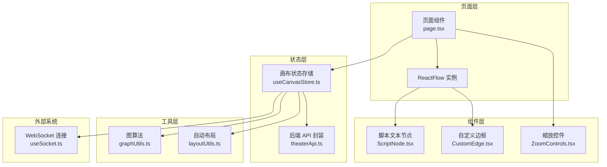
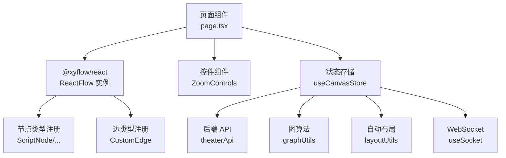
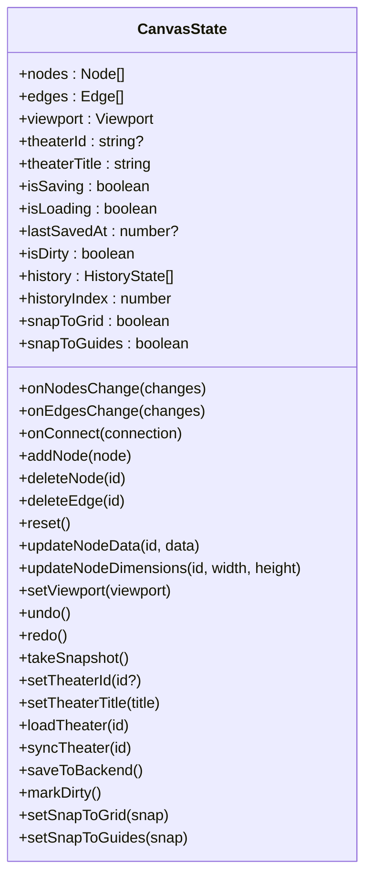
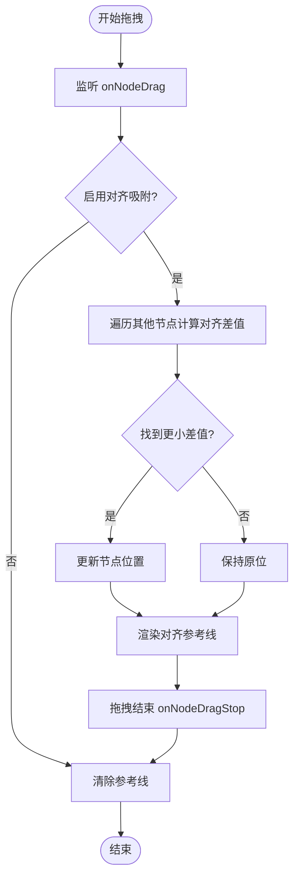
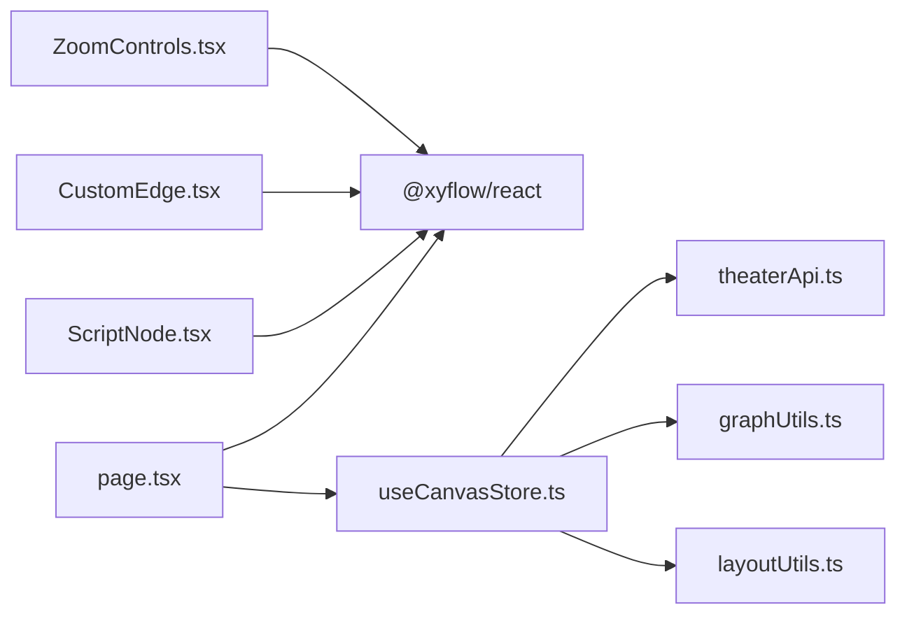

# 画布核心组件

<cite>
**本文档引用的文件**
- [TheaterCanvas.tsx](file://frontend/src/components/TheaterCanvas.tsx)
- [useCanvasStore.ts](file://frontend/src/store/useCanvasStore.ts)
- [page.tsx](file://frontend/src/app/theater/[id]/page.tsx)
- [useCanvasDragDrop.ts](file://frontend/src/app/theater/[id]/hooks/useCanvasDragDrop.ts)
- [useCanvasSnapping.ts](file://frontend/src/app/theater/[id]/hooks/useCanvasSnapping.ts)
- [useCanvasShortcuts.ts](file://frontend/src/app/theater/[id]/hooks/useCanvasShortcuts.ts)
- [useAutoLayout.ts](file://frontend/src/app/theater/[id]/hooks/useAutoLayout.ts)
- [ScriptNode.tsx](file://frontend/src/components/canvas/ScriptNode.tsx)
- [CustomEdge.tsx](file://frontend/src/components/canvas/CustomEdge.tsx)
- [ZoomControls.tsx](file://frontend/src/components/canvas/ZoomControls.tsx)
- [theaterApi.ts](file://frontend/src/lib/theaterApi.ts)
- [graphUtils.ts](file://frontend/src/lib/graphUtils.ts)
- [layoutUtils.ts](file://frontend/src/lib/layoutUtils.ts)
- [useSocket.ts](file://frontend/src/hooks/useSocket.ts)
</cite>

## 目录
1. [简介](#简介)
2. [项目结构](#项目结构)
3. [核心组件](#核心组件)
4. [架构总览](#架构总览)
5. [详细组件分析](#详细组件分析)
6. [依赖关系分析](#依赖关系分析)
7. [性能考虑](#性能考虑)
8. [故障排除指南](#故障排除指南)
9. [结论](#结论)
10. [附录](#附录)

## 简介
本文件聚焦于画布核心组件的实现与使用，系统性阐述 TheaterCanvas 主组件的架构设计、React Flow 初始化配置、画布状态管理、视口控制与事件处理机制，并深入解析拖拽、缩放、平移、对齐吸附等交互能力的实现原理。同时覆盖生命周期管理、性能优化策略、内存管理、与外部系统的集成（WebSocket 实时通信、API 数据同步、状态持久化）以及配置选项、自定义扩展与最佳实践。

## 项目结构
画布相关代码主要分布在以下位置：
- 组件层：画布节点与边框组件（ScriptNode、CustomEdge）
- 页面层：画布编辑器页面（page.tsx），负责初始化 React Flow、绑定事件与面板控件
- 状态层：画布状态管理（useCanvasStore.ts），统一管理节点、边、视口、历史、脏标记与后端同步
- 工具层：图算法（graphUtils.ts）、自动布局（layoutUtils.ts）、API 封装（theaterApi.ts）
- Hook 层：拖拽/缩放/吸附/快捷键/自动布局等可复用逻辑（useCanvasDragDrop.ts、useCanvasSnapping.ts、useCanvasShortcuts.ts、useAutoLayout.ts）
- 其他：基础画布组件（TheaterCanvas.tsx）、缩放控件（ZoomControls.tsx）

**图表来源**
- [page.tsx:54-484](file://frontend/src/app/theater/[id]/page.tsx#L54-L484)
- [useCanvasStore.ts:185-540](file://frontend/src/store/useCanvasStore.ts#L185-L540)
- [ScriptNode.tsx:11-351](file://frontend/src/components/canvas/ScriptNode.tsx#L11-L351)
- [CustomEdge.tsx:5-92](file://frontend/src/components/canvas/CustomEdge.tsx#L5-L92)
- [ZoomControls.tsx:7-117](file://frontend/src/components/canvas/ZoomControls.tsx#L7-L117)
- [theaterApi.ts:107-159](file://frontend/src/lib/theaterApi.ts#L107-L159)
- [graphUtils.ts:4-39](file://frontend/src/lib/graphUtils.ts#L4-L39)
- [layoutUtils.ts:16-127](file://frontend/src/lib/layoutUtils.ts#L16-L127)
- [useSocket.ts:3-42](file://frontend/src/hooks/useSocket.ts#L3-L42)

**章节来源**
- [page.tsx:54-484](file://frontend/src/app/theater/[id]/page.tsx#L54-L484)
- [useCanvasStore.ts:185-540](file://frontend/src/store/useCanvasStore.ts#L185-L540)

## 核心组件
- TheaterCanvas 主组件：基于 Pixi.js 的基础画布容器，负责客户端渲染初始化与销毁，当前示例包含背景色与基础文本渲染。
- React Flow 编辑器：页面组件通过 ReactFlowProvider 初始化 React Flow，注册节点类型与边类型，绑定变更回调与事件处理器。
- 画布状态存储：基于 Zustand 的全局状态，封装节点/边/视口/历史/脏标记/后端同步等能力，并持久化到本地存储。
- 交互钩子：拖拽/缩放/吸附/快捷键/自动布局等逻辑以 Hook 形式注入页面组件，提升复用性与可测试性。
- 节点与边组件：具体节点（如脚本文本）与边（贝塞尔曲线）的 UI 与行为实现。
- 控件组件：缩放控件提供缩放、适应屏幕、自动布局、网格吸附、对齐吸附与小地图切换等能力。

**章节来源**
- [TheaterCanvas.tsx:10-50](file://frontend/src/components/TheaterCanvas.tsx#L10-L50)
- [page.tsx:54-484](file://frontend/src/app/theater/[id]/page.tsx#L54-L484)
- [useCanvasStore.ts:67-114](file://frontend/src/store/useCanvasStore.ts#L67-L114)
- [ScriptNode.tsx:11-351](file://frontend/src/components/canvas/ScriptNode.tsx#L11-L351)
- [CustomEdge.tsx:5-92](file://frontend/src/components/canvas/CustomEdge.tsx#L5-L92)
- [ZoomControls.tsx:7-117](file://frontend/src/components/canvas/ZoomControls.tsx#L7-L117)

## 架构总览
画布采用“页面层 + 状态层 + 组件层 + 工具层”的分层架构：
- 页面层负责初始化 React Flow、挂载节点/边类型、绑定事件与面板控件
- 状态层集中管理画布数据、历史、脏标记与后端同步
- 组件层提供可复用的节点、边与控件
- 工具层提供图算法与自动布局等通用能力
- 外部系统通过 API 与 WebSocket 提供数据与实时通信

**图表来源**
- [page.tsx:37-47](file://frontend/src/app/theater/[id]/page.tsx#L37-L47)
- [useCanvasStore.ts:185-540](file://frontend/src/store/useCanvasStore.ts#L185-L540)
- [theaterApi.ts:107-159](file://frontend/src/lib/theaterApi.ts#L107-L159)
- [graphUtils.ts:4-39](file://frontend/src/lib/graphUtils.ts#L4-L39)
- [layoutUtils.ts:16-127](file://frontend/src/lib/layoutUtils.ts#L16-L127)
- [useSocket.ts:3-42](file://frontend/src/hooks/useSocket.ts#L3-L42)

## 详细组件分析

### React Flow 初始化与配置
- 初始化入口：页面组件通过 ReactFlowProvider 包裹，确保上下文可用
- 节点与边类型：注册脚本文本、图片、故事板、视频节点与自定义边
- 默认边选项：设置默认边类型、动画与样式
- 连接模式：宽松连接模式，连接半径适中
- 缩放与视口：设置最小/最大缩放，fitView 与 onMove 回调更新视口状态
- 快捷键与删除键：支持 Ctrl+S、Ctrl+Z、Ctrl+Y/Ctrl+Shift+Z 等快捷键；删除键支持 Backspace/Delete
- 对齐吸附：通过 onNodeDrag/onNodeDragStop 与 alignmentLines 渲染对齐参考线

**章节来源**
- [page.tsx:37-53](file://frontend/src/app/theater/[id]/page.tsx#L37-L53)
- [page.tsx:334-356](file://frontend/src/app/theater/[id]/page.tsx#L334-L356)
- [page.tsx:362-380](file://frontend/src/app/theater/[id]/page.tsx#L362-L380)

### 画布状态管理（Zustand）
- 数据模型：nodes、edges、viewport、theaterId、theaterTitle、isSaving、isLoading、lastSavedAt、isDirty、history、historyIndex
- 变更处理：onNodesChange/onEdgesChange/onConnect 统一应用变更并标记脏状态
- 历史回退：takeSnapshot、undo、redo 支持有限步数的历史记录（最多 50 步）
- 后端同步：loadTheater/syncTheater/saveToBackend 支持加载、增量同步与保存
- 本地持久化：使用 persist 中间件与 localStorage 存储节点、边、视口与剧场信息，合并时去重节点
- 映射转换：nodeToApi/apiToNode、edgeToApi/apiToEdge 实现前后端数据结构映射

**图表来源**
- [useCanvasStore.ts:67-114](file://frontend/src/store/useCanvasStore.ts#L67-L114)
- [useCanvasStore.ts:185-540](file://frontend/src/store/useCanvasStore.ts#L185-L540)

**章节来源**
- [useCanvasStore.ts:185-540](file://frontend/src/store/useCanvasStore.ts#L185-L540)

### 视口控制与事件处理
- 视口更新：onMove 回调将 React Flow 的视口状态同步到组件内部状态
- 缩放控件：ZoomControls 提供缩放滑块、放大/缩小、适应屏幕、自动布局、网格吸附、对齐吸附与小地图开关
- 小地图：MiniMap 组件按节点类型着色显示，支持切换显示
- 背景网格：Background 组件提供点状网格背景

**章节来源**
- [page.tsx:62-62](file://frontend/src/app/theater/[id]/page.tsx#L62-L62)
- [page.tsx:343-356](file://frontend/src/app/theater/[id]/page.tsx#L343-L356)
- [page.tsx:382-396](file://frontend/src/app/theater/[id]/page.tsx#L382-L396)
- [page.tsx:360-360](file://frontend/src/app/theater/[id]/page.tsx#L360-L360)
- [ZoomControls.tsx:26-117](file://frontend/src/components/canvas/ZoomControls.tsx#L26-L117)

### 交互能力：拖拽、缩放、平移、对齐吸附
- 拖拽与放置：useCanvasDragDrop 在 onDrop 中根据拖拽数据创建节点，支持网格吸附与默认尺寸
- 快捷键：useCanvasShortcuts 支持撤销/重做快捷键
- 自动布局：useAutoLayout 使用 Dagre 计算布局，触发 onNodesChange 并在完成后 fitView
- 对齐吸附：useCanvasSnapping 在拖拽过程中计算与其他节点的对齐差值，渲染垂直/水平参考线并在拖拽结束时清除

**图表来源**
- [useCanvasSnapping.ts:12-94](file://frontend/src/app/theater/[id]/hooks/useCanvasSnapping.ts#L12-L94)
- [page.tsx:341-342](file://frontend/src/app/theater/[id]/page.tsx#L341-L342)

**章节来源**
- [useCanvasDragDrop.ts:15-73](file://frontend/src/app/theater/[id]/hooks/useCanvasDragDrop.ts#L15-L73)
- [useCanvasShortcuts.ts:4-26](file://frontend/src/app/theater/[id]/hooks/useCanvasShortcuts.ts#L4-L26)
- [useAutoLayout.ts:20-49](file://frontend/src/app/theater/[id]/hooks/useAutoLayout.ts#L20-L49)
- [useCanvasSnapping.ts:12-94](file://frontend/src/app/theater/[id]/hooks/useCanvasSnapping.ts#L12-L94)

### 生命周期管理与内存管理
- 组件卸载：页面组件在卸载时清理定时器与事件监听，避免内存泄漏
- React Flow 卸载：页面组件在 ReactFlowProvider 上下文中管理实例生命周期
- Pixi 应用：TheaterCanvas 在卸载时销毁 Pixi 应用，释放纹理与子对象资源

**章节来源**
- [page.tsx:103-111](file://frontend/src/app/theater/[id]/page.tsx#L103-L111)
- [TheaterCanvas.tsx:39-44](file://frontend/src/components/TheaterCanvas.tsx#L39-L44)

### 与外部系统的集成
- WebSocket 实时通信：useSocket 提供连接、消息接收与发送能力，便于后续接入画布协作或通知
- API 数据同步：theaterApi 封装剧场创建、列表、详情、更新、保存画布等接口；useCanvasStore 负责调用并处理错误
- 状态持久化：Zustand persist 中间件将关键状态写入 localStorage，并在合并时去重节点

**章节来源**
- [useSocket.ts:3-42](file://frontend/src/hooks/useSocket.ts#L3-L42)
- [theaterApi.ts:107-159](file://frontend/src/lib/theaterApi.ts#L107-L159)
- [useCanvasStore.ts:511-538](file://frontend/src/store/useCanvasStore.ts#L511-L538)

### 配置选项、自定义扩展与最佳实践
- 配置选项
  - React Flow：连接模式、连接半径、最小/最大缩放、fitView、删除键、吸附网格
  - 节点类型：脚本文本、图片、故事板、视频
  - 边类型：自定义贝塞尔曲线边
  - 设置项：网格吸附、对齐吸附
- 自定义扩展
  - 新增节点类型：在 nodeTypes 注册并实现对应组件
  - 新增边类型：在 edgeTypes 注册并实现对应组件
  - 自定义事件：通过 onConnectEnd、onNodeDragStop 等回调扩展交互
- 最佳实践
  - 使用 onNodesChange/onEdgesChange 统一处理变更，避免分散更新
  - 对频繁变更进行防抖/节流（如自动保存）
  - 使用 hasCycle 防止循环连接
  - 使用 takeSnapshot 记录历史，限制历史步数
  - 使用 persist 仅持久化必要字段，减少存储体积

**章节来源**
- [page.tsx:37-53](file://frontend/src/app/theater/[id]/page.tsx#L37-L53)
- [page.tsx:334-356](file://frontend/src/app/theater/[id]/page.tsx#L334-L356)
- [useCanvasStore.ts:238-254](file://frontend/src/store/useCanvasStore.ts#L238-L254)
- [useCanvasStore.ts:335-348](file://frontend/src/store/useCanvasStore.ts#L335-L348)
- [useCanvasStore.ts:511-538](file://frontend/src/store/useCanvasStore.ts#L511-L538)

## 依赖关系分析
- 页面组件依赖 React Flow、Zustand 状态存储、节点/边组件与控件组件
- 状态存储依赖 API 封装、图算法与布局工具
- 节点/边组件依赖 React Flow 的 Handle、Position、NodeProps 等能力
- 工具层依赖 dagre 进行自动布局

**图表来源**
- [page.tsx:54-484](file://frontend/src/app/theater/[id]/page.tsx#L54-L484)
- [useCanvasStore.ts:185-540](file://frontend/src/store/useCanvasStore.ts#L185-L540)
- [ScriptNode.tsx:11-351](file://frontend/src/components/canvas/ScriptNode.tsx#L11-L351)
- [CustomEdge.tsx:5-92](file://frontend/src/components/canvas/CustomEdge.tsx#L5-L92)
- [ZoomControls.tsx:7-117](file://frontend/src/components/canvas/ZoomControls.tsx#L7-L117)

**章节来源**
- [page.tsx:54-484](file://frontend/src/app/theater/[id]/page.tsx#L54-L484)
- [useCanvasStore.ts:185-540](file://frontend/src/store/useCanvasStore.ts#L185-L540)

## 性能考虑
- 自动保存防抖：当 isDirty 且非保存中时，延迟 2 秒触发保存，避免频繁网络请求
- 历史步数限制：最多保留 50 步历史，防止内存膨胀
- 本地持久化：仅持久化必要字段，合并时去重节点，减少存储与恢复成本
- 自动布局：使用 Dagre 计算布局，完成后一次性触发位置变更并 fitView，避免逐帧更新
- 对齐吸附：阈值与差值比较在拖拽过程中进行，避免复杂计算导致卡顿

**章节来源**
- [page.tsx:92-101](file://frontend/src/app/theater/[id]/page.tsx#L92-L101)
- [useCanvasStore.ts:116](file://frontend/src/store/useCanvasStore.ts#L116)
- [useCanvasStore.ts:511-538](file://frontend/src/store/useCanvasStore.ts#L511-L538)
- [useAutoLayout.ts:20-49](file://frontend/src/app/theater/[id]/hooks/useAutoLayout.ts#L20-L49)
- [useCanvasSnapping.ts:18-89](file://frontend/src/app/theater/[id]/hooks/useCanvasSnapping.ts#L18-L89)

## 故障排除指南
- 无法保存画布
  - 检查 isSaving 状态是否被阻塞
  - 确认 theaterId 是否存在
  - 查看控制台错误日志，确认 API 请求是否成功
- 循环连接被阻止
  - onConnect 中会检测自环与环路，若被阻止请检查连接源/目标是否合法
- 自动保存未触发
  - 确认 isDirty 已被正确标记
  - 检查定时器是否被清理或重复创建
- 对齐吸附无效
  - 确认 snapToGuides 已启用
  - 检查节点尺寸与 measured 是否正确传入
- WebSocket 未连接
  - 检查 useSocket 的 userId 参数是否有效
  - 确认服务端 WebSocket 地址与端口

**章节来源**
- [useCanvasStore.ts:478-505](file://frontend/src/store/useCanvasStore.ts#L478-L505)
- [useCanvasStore.ts:238-254](file://frontend/src/store/useCanvasStore.ts#L238-L254)
- [page.tsx:92-101](file://frontend/src/app/theater/[id]/page.tsx#L92-L101)
- [useCanvasSnapping.ts:12-94](file://frontend/src/app/theater/[id]/hooks/useCanvasSnapping.ts#L12-L94)
- [useSocket.ts:3-42](file://frontend/src/hooks/useSocket.ts#L3-L42)

## 结论
该画布核心组件以 React Flow 为基础，结合 Zustand 状态管理与丰富的工具函数，实现了完整的可视化编辑体验。通过模块化的 Hook 设计与清晰的分层架构，既保证了功能的可扩展性，也兼顾了性能与可维护性。建议在实际项目中继续完善 WebSocket 集成、增强错误处理与监控，并持续优化自动布局与吸附算法的性能表现。

## 附录
- API 接口清单（来自 theaterApi）
  - 创建剧场、列表剧场、获取剧场详情、更新剧场、删除剧场、保存画布、复制剧场
- 关键数据结构映射
  - 节点/边前后端映射函数：nodeToApi/apiToNode、edgeToApi/apiToEdge
- 图算法与布局
  - 有向无环检测：hasCycle
  - 自动布局：Dagre 布局与隔离节点网格布局

**章节来源**
- [theaterApi.ts:107-159](file://frontend/src/lib/theaterApi.ts#L107-L159)
- [useCanvasStore.ts:120-168](file://frontend/src/store/useCanvasStore.ts#L120-L168)
- [graphUtils.ts:4-39](file://frontend/src/lib/graphUtils.ts#L4-L39)
- [layoutUtils.ts:16-127](file://frontend/src/lib/layoutUtils.ts#L16-L127)