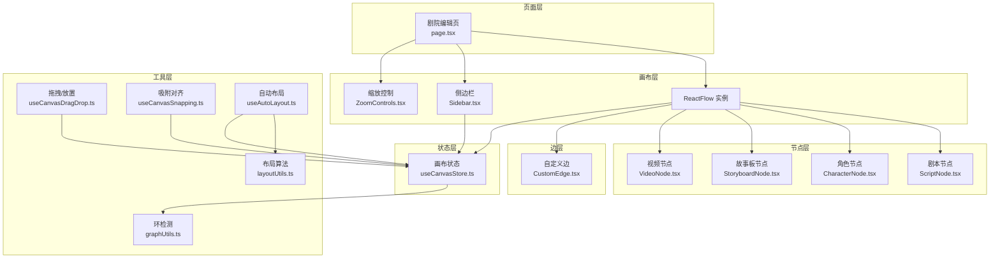
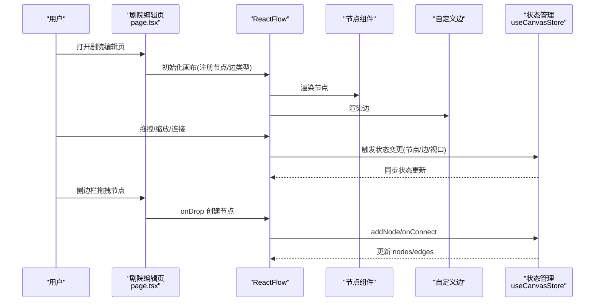
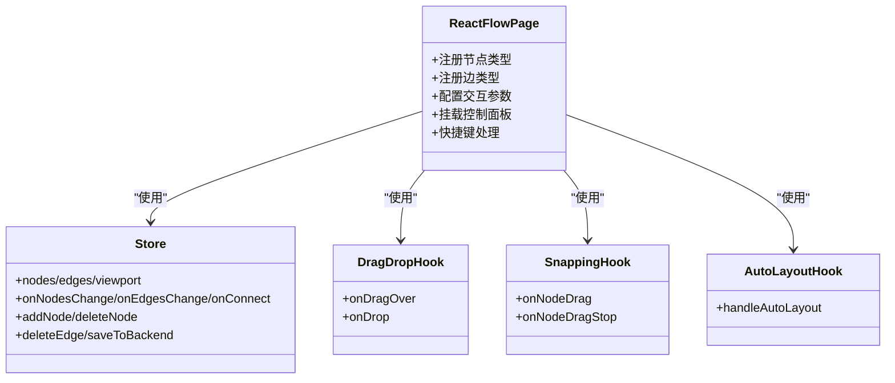
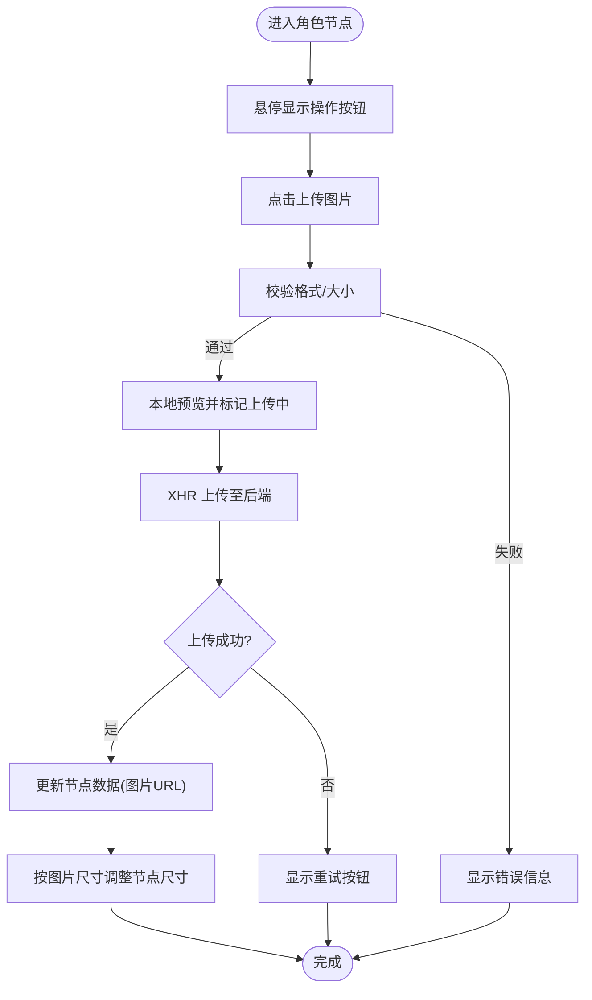
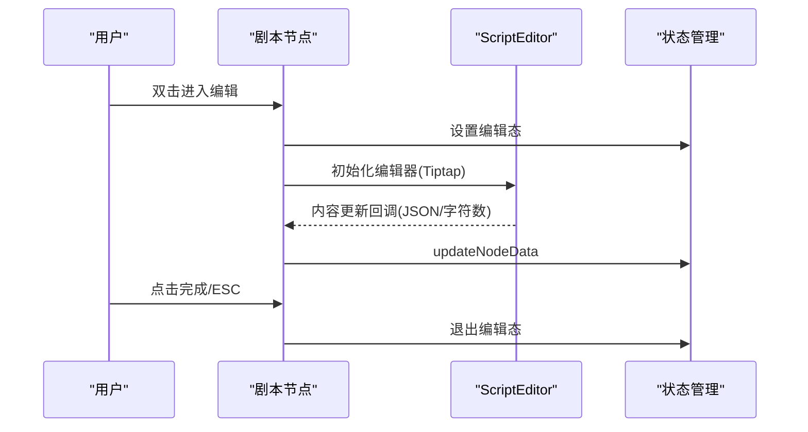
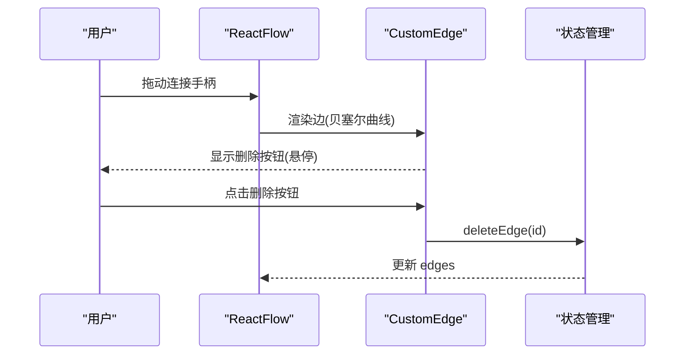
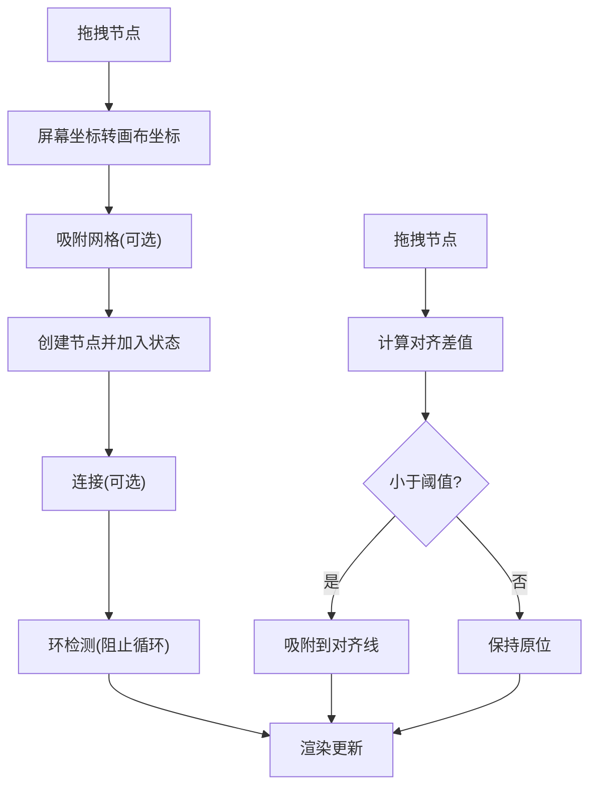
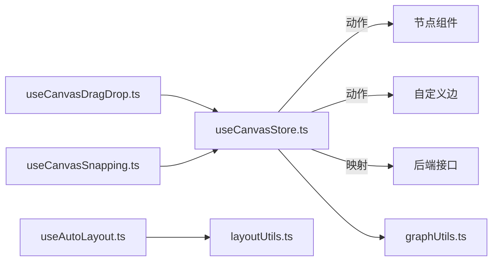

# 画布组件系统

<cite>
**本文档引用的文件**
- [TheaterCanvas.tsx](file://frontend/src/components/TheaterCanvas.tsx)
- [CharacterNode.tsx](file://frontend/src/components/canvas/CharacterNode.tsx)
- [ScriptNode.tsx](file://frontend/src/components/canvas/ScriptNode.tsx)
- [StoryboardNode.tsx](file://frontend/src/components/canvas/StoryboardNode.tsx)
- [VideoNode.tsx](file://frontend/src/components/canvas/VideoNode.tsx)
- [CustomEdge.tsx](file://frontend/src/components/canvas/CustomEdge.tsx)
- [Sidebar.tsx](file://frontend/src/components/canvas/Sidebar.tsx)
- [useCanvasStore.ts](file://frontend/src/store/useCanvasStore.ts)
- [ScriptEditor.tsx](file://frontend/src/components/canvas/ScriptEditor.tsx)
- [page.tsx](file://frontend/src/app/theater/[id]/page.tsx)
- [useCanvasDragDrop.ts](file://frontend/src/app/theater/[id]/hooks/useCanvasDragDrop.ts)
- [useCanvasSnapping.ts](file://frontend/src/app/theater/[id]/hooks/useCanvasSnapping.ts)
- [useAutoLayout.ts](file://frontend/src/app/theater/[id]/hooks/useAutoLayout.ts)
- [layoutUtils.ts](file://frontend/src/lib/layoutUtils.ts)
- [graphUtils.ts](file://frontend/src/lib/graphUtils.ts)
- [script-editor.scss](file://frontend/src/components/canvas/script-editor.scss)
</cite>

## 目录
1. [简介](#简介)
2. [项目结构](#项目结构)
3. [核心组件](#核心组件)
4. [架构总览](#架构总览)
5. [详细组件分析](#详细组件分析)
6. [依赖关系分析](#依赖关系分析)
7. [性能考虑](#性能考虑)
8. [故障排除指南](#故障排除指南)
9. [结论](#结论)
10. [附录](#附录)

## 简介
本文件系统性梳理 Infinite Game 项目中的画布组件体系，围绕基于 React Flow 的可视化画布进行深入解析。内容涵盖画布节点（角色、剧本、故事板、视频）的设计与实现、连接线系统的定制、侧边栏工具面板与属性编辑器、以及拖拽、缩放、对齐等交互功能。同时提供使用示例与扩展开发指南，帮助开发者快速理解并二次开发。

## 项目结构
画布系统主要位于前端应用的剧院编辑页面，采用模块化组织：
- 页面容器：剧院编辑页负责初始化 React Flow、注册节点与边类型、挂载侧边栏与控制面板
- 节点组件：四种节点分别承载不同媒体与内容形态
- 连接线组件：自定义贝塞尔曲线边，支持悬停高亮与删除
- 存储与状态：Zustand 状态管理，持久化本地存储，支持后端同步
- 工具与钩子：拖拽、吸附、自动布局、图算法等辅助能力

**图表来源**
- [page.tsx:37-46](file://frontend/src/app/theater/[id]/page.tsx#L37-L46)
- [Sidebar.tsx:137-336](file://frontend/src/components/canvas/Sidebar.tsx#L137-L336)
- [useCanvasStore.ts:185-540](file://frontend/src/store/useCanvasStore.ts#L185-L540)
- [useCanvasDragDrop.ts:6-74](file://frontend/src/app/theater/[id]/hooks/useCanvasDragDrop.ts#L6-L74)
- [useCanvasSnapping.ts:5-98](file://frontend/src/app/theater/[id]/hooks/useCanvasSnapping.ts#L5-L98)
- [useAutoLayout.ts:6-50](file://frontend/src/app/theater/[id]/hooks/useAutoLayout.ts#L6-L50)
- [layoutUtils.ts:16-127](file://frontend/src/lib/layoutUtils.ts#L16-L127)
- [graphUtils.ts:4-39](file://frontend/src/lib/graphUtils.ts#L4-L39)

**章节来源**
- [page.tsx:37-46](file://frontend/src/app/theater/[id]/page.tsx#L37-L46)
- [Sidebar.tsx:137-336](file://frontend/src/components/canvas/Sidebar.tsx#L137-L336)
- [useCanvasStore.ts:185-540](file://frontend/src/store/useCanvasStore.ts#L185-L540)

## 核心组件
- React Flow 画布实例：负责节点渲染、连接、拖拽、缩放、吸附、自动布局等
- 四种节点类型：文本卡（剧本）、图片卡（角色）、视频卡、多维表格卡（故事板）
- 自定义边：贝塞尔曲线边，支持悬停高亮与删除
- 侧边栏：节点库与素材库，支持拖拽创建节点与素材复用
- 状态管理：Zustand store，持久化本地存储，支持后端同步与历史快照
- 工具钩子：拖拽/放置、吸附对齐、自动布局、环检测

**章节来源**
- [page.tsx:37-46](file://frontend/src/app/theater/[id]/page.tsx#L37-L46)
- [useCanvasStore.ts:26-114](file://frontend/src/store/useCanvasStore.ts#L26-L114)
- [Sidebar.tsx:9-50](file://frontend/src/components/canvas/Sidebar.tsx#L9-L50)

## 架构总览
画布系统采用“页面容器 + React Flow + 组件层 + 状态层 + 工具层”的分层架构。页面容器负责装配与编排，React Flow 提供基础画布能力，组件层实现节点与边的具体渲染与交互，状态层统一管理节点、边、视口与后端同步，工具层提供拖拽、吸附、布局等增强能力。

**图表来源**
- [page.tsx:334-356](file://frontend/src/app/theater/[id]/page.tsx#L334-L356)
- [useCanvasStore.ts:256-288](file://frontend/src/store/useCanvasStore.ts#L256-L288)
- [useCanvasDragDrop.ts:15-70](file://frontend/src/app/theater/[id]/hooks/useCanvasDragDrop.ts#L15-L70)

**章节来源**
- [page.tsx:334-356](file://frontend/src/app/theater/[id]/page.tsx#L334-L356)
- [useCanvasStore.ts:256-288](file://frontend/src/store/useCanvasStore.ts#L256-L288)

## 详细组件分析

### React Flow 画布集成与定制
- 节点与边类型注册：在页面容器中注册四种节点与自定义边类型，并设置默认边选项（动画、样式）
- 交互配置：连接模式、连接半径、删除键、拟合视图、缩放范围、吸附网格
- 控制面板：缩放控制、小地图、撤销/重做、保存状态、自动布局、吸附开关
- 快捷键：保存(Ctrl+S)、撤销(Ctrl+Z)、重做(Ctrl+Y/Ctrl+Shift+Z)

**图表来源**
- [page.tsx:37-46](file://frontend/src/app/theater/[id]/page.tsx#L37-L46)
- [useCanvasStore.ts:185-540](file://frontend/src/store/useCanvasStore.ts#L185-L540)
- [useCanvasDragDrop.ts:6-74](file://frontend/src/app/theater/[id]/hooks/useCanvasDragDrop.ts#L6-L74)
- [useCanvasSnapping.ts:5-98](file://frontend/src/app/theater/[id]/hooks/useCanvasSnapping.ts#L5-L98)
- [useAutoLayout.ts:6-50](file://frontend/src/app/theater/[id]/hooks/useAutoLayout.ts#L6-L50)

**章节来源**
- [page.tsx:37-46](file://frontend/src/app/theater/[id]/page.tsx#L37-L46)
- [page.tsx:334-444](file://frontend/src/app/theater/[id]/page.tsx#L334-L444)

### 角色节点（CharacterNode）
- 功能特性：图片上传、预览、裁剪/适应模式切换、标题编辑、复制、删除、全屏预览、拖拽遮罩
- 交互细节：双击进入全屏预览；滚轮缩放、拖拽平移；上传进度与错误反馈
- 尺寸自适应：根据原始图片尺寸计算合理宽高，避免过小导致UI拥挤
- 边缘连接手柄：左右两侧隐藏 Handle，通过自定义热区触发连接

**图表来源**
- [CharacterNode.tsx:126-205](file://frontend/src/components/canvas/CharacterNode.tsx#L126-L205)
- [CharacterNode.tsx:209-241](file://frontend/src/components/canvas/CharacterNode.tsx#L209-L241)

**章节来源**
- [CharacterNode.tsx:13-692](file://frontend/src/components/canvas/CharacterNode.tsx#L13-L692)

### 剧本节点（ScriptNode）
- 功能特性：标题编辑、富文本编辑（Tiptap）、字数统计、复制、删除、AI 辅助占位
- 编辑模式：双击或点击编辑按钮进入编辑态；点击空白处或按 ESC 退出
- 富文本编辑器：支持标题、列表、强调、链接、高亮、对齐等常用格式
- 尺寸自适应：NodeResizer 控制最小宽高，保证编辑体验

**图表来源**
- [ScriptNode.tsx:11-110](file://frontend/src/components/canvas/ScriptNode.tsx#L11-L110)
- [ScriptEditor.tsx:117-280](file://frontend/src/components/canvas/ScriptEditor.tsx#L117-L280)
- [useCanvasStore.ts:310-318](file://frontend/src/store/useCanvasStore.ts#L310-L318)

**章节来源**
- [ScriptNode.tsx:11-351](file://frontend/src/components/canvas/ScriptNode.tsx#L11-L351)
- [ScriptEditor.tsx:117-280](file://frontend/src/components/canvas/ScriptEditor.tsx#L117-L280)

### 故事板节点（StoryboardNode）
- 功能特性：双击打开多维表格编辑器（PivotEditor），展示配置概览，支持复制与删除
- 界面设计：骨架屏引导与配置结果提示蒙层，提升初次使用体验
- 边缘连接手柄：左右两侧隐藏 Handle，通过自定义热区触发连接

**章节来源**
- [StoryboardNode.tsx:11-318](file://frontend/src/components/canvas/StoryboardNode.tsx#L11-L318)

### 视频节点（VideoNode）
- 功能特性：视频上传、预览、裁剪/适应模式切换、标题编辑、复制、删除
- 交互细节：视频标签含 controls，上方覆盖透明拖拽遮罩，保留底部控件可用
- 尺寸自适应：根据视频元数据计算合理宽高，避免过小导致UI拥挤

**章节来源**
- [VideoNode.tsx:10-534](file://frontend/src/components/canvas/VideoNode.tsx#L10-L534)

### 连接线系统（CustomEdge）
- 样式定制：贝塞尔曲线路径，悬停与选中时增粗变色
- 交互处理：隐形宽轨迹提升悬停命中率；删除按钮支持点击与触摸
- 删除机制：点击删除按钮触发状态删除，同时派发自定义事件

**图表来源**
- [CustomEdge.tsx:5-92](file://frontend/src/components/canvas/CustomEdge.tsx#L5-L92)
- [useCanvasStore.ts:276-288](file://frontend/src/store/useCanvasStore.ts#L276-L288)

**章节来源**
- [CustomEdge.tsx:5-92](file://frontend/src/components/canvas/CustomEdge.tsx#L5-L92)

### 侧边栏组件（Sidebar）
- 节点库：文本卡、图片卡、视频卡、多维表格卡，支持拖拽创建
- 素材库：从现有节点提取图片与视频素材，支持分页签浏览
- 拖拽协议：通过 dataTransfer 携带节点类型、初始数据与尺寸
- 动效与交互：菜单展开/收起、半透明拖拽预览、Tab 切换

**章节来源**
- [Sidebar.tsx:52-337](file://frontend/src/components/canvas/Sidebar.tsx#L52-L337)

### 画布交互功能
- 拖拽与放置：支持从侧边栏拖拽创建节点，自动计算位置与尺寸
- 缩放与拟合：支持最小/最大缩放、拟合视图、小地图
- 对齐与吸附：基于相邻节点边缘的对齐线，支持吸附阈值
- 自动布局：使用 Dagre 算法进行有向布局，孤立节点网格排列

**图表来源**
- [useCanvasDragDrop.ts:15-70](file://frontend/src/app/theater/[id]/hooks/useCanvasDragDrop.ts#L15-L70)
- [useCanvasSnapping.ts:12-94](file://frontend/src/app/theater/[id]/hooks/useCanvasSnapping.ts#L12-L94)
- [graphUtils.ts:4-39](file://frontend/src/lib/graphUtils.ts#L4-L39)
- [layoutUtils.ts:16-127](file://frontend/src/lib/layoutUtils.ts#L16-L127)

**章节来源**
- [useCanvasDragDrop.ts:6-74](file://frontend/src/app/theater/[id]/hooks/useCanvasDragDrop.ts#L6-L74)
- [useCanvasSnapping.ts:5-98](file://frontend/src/app/theater/[id]/hooks/useCanvasSnapping.ts#L5-L98)
- [useAutoLayout.ts:6-50](file://frontend/src/app/theater/[id]/hooks/useAutoLayout.ts#L6-L50)
- [layoutUtils.ts:16-127](file://frontend/src/lib/layoutUtils.ts#L16-L127)
- [graphUtils.ts:4-39](file://frontend/src/lib/graphUtils.ts#L4-L39)

## 依赖关系分析
- 组件耦合：节点组件与状态管理强耦合，通过 store 的动作更新节点数据与尺寸
- 外部依赖：React Flow 提供画布能力；Tiptap 提供富文本编辑；Dagre 提供自动布局
- 循环依赖：通过环检测工具避免新增连接形成循环，保证图结构为 DAG
- 持久化：Zustand 持久化仅存储关键字段，避免冗余；后端同步时映射前后端节点/边结构

**图表来源**
- [useCanvasStore.ts:185-540](file://frontend/src/store/useCanvasStore.ts#L185-L540)
- [useCanvasDragDrop.ts:6-74](file://frontend/src/app/theater/[id]/hooks/useCanvasDragDrop.ts#L6-L74)
- [useCanvasSnapping.ts:5-98](file://frontend/src/app/theater/[id]/hooks/useCanvasSnapping.ts#L5-L98)
- [useAutoLayout.ts:6-50](file://frontend/src/app/theater/[id]/hooks/useAutoLayout.ts#L6-L50)
- [layoutUtils.ts:16-127](file://frontend/src/lib/layoutUtils.ts#L16-L127)
- [graphUtils.ts:4-39](file://frontend/src/lib/graphUtils.ts#L4-L39)

**章节来源**
- [useCanvasStore.ts:185-540](file://frontend/src/store/useCanvasStore.ts#L185-L540)

## 性能考虑
- 虚拟渲染与懒加载：节点内容（如视频）在可见时才加载，减少初始渲染压力
- 状态更新批处理：批量更新节点位置与尺寸，避免频繁重渲染
- 布局算法优化：Dagre 布局仅在必要时触发，且通过过渡动画平滑位置变化
- 拖拽与吸附：吸附计算仅在拖拽过程中进行，停止拖拽后清空对齐线，降低 DOM 开销
- 缓存与去重：状态持久化合并时去重节点，避免重复渲染

## 故障排除指南
- 无法连接：检查是否自环或会形成环（环检测会阻止），确认连接手柄方向
- 上传失败：检查后端上传接口可达性、认证头、文件类型与大小限制
- 节点尺寸异常：确认图片/视频元数据获取成功，尺寸计算逻辑是否触发
- 拖拽无效：确认 dataTransfer 中携带了正确的类型、数据与尺寸信息
- 自动布局错乱：检查节点测量尺寸是否正确，Dagre 参数是否合适

**章节来源**
- [graphUtils.ts:4-39](file://frontend/src/lib/graphUtils.ts#L4-L39)
- [CharacterNode.tsx:126-205](file://frontend/src/components/canvas/CharacterNode.tsx#L126-L205)
- [VideoNode.tsx:107-186](file://frontend/src/components/canvas/VideoNode.tsx#L107-L186)
- [useCanvasDragDrop.ts:19-23](file://frontend/src/app/theater/[id]/hooks/useCanvasDragDrop.ts#L19-L23)

## 结论
该画布系统以 React Flow 为核心，结合自定义节点、边与工具钩子，构建了功能完备的可视化编辑环境。通过 Zustand 状态管理与后端同步，实现了离线可用与云端协作的平衡。节点类型覆盖文本、图片、视频与多维表格，满足叙事创作的多样化需求。交互层面提供了拖拽、缩放、吸附与自动布局等能力，显著提升了编辑效率与体验。

## 附录

### 使用示例
- 在剧院编辑页中直接使用 React Flow Provider 包裹，注册节点与边类型
- 通过侧边栏拖拽创建节点，或调用页面提供的 onDrop 逻辑
- 使用状态管理的动作更新节点数据与尺寸，触发自动保存

**章节来源**
- [page.tsx:477-484](file://frontend/src/app/theater/[id]/page.tsx#L477-L484)
- [Sidebar.tsx:106-135](file://frontend/src/components/canvas/Sidebar.tsx#L106-L135)
- [useCanvasStore.ts:256-264](file://frontend/src/store/useCanvasStore.ts#L256-L264)

### 扩展开发指南
- 新增节点类型：定义节点组件与数据结构，注册到 nodeTypes，并在状态映射中完善前后端转换
- 自定义边样式：在 CustomEdge 中调整路径、颜色、宽度与交互行为
- 自定义吸附规则：在 useCanvasSnapping 中扩展对齐逻辑（如中心对齐、网格对齐）
- 自动布局策略：在 layoutUtils 中调整 Dagre 参数或引入新的布局算法
- 后端同步：完善 nodeToApi 与 apiToNode 映射，确保数据一致性

**章节来源**
- [useCanvasStore.ts:120-168](file://frontend/src/store/useCanvasStore.ts#L120-L168)
- [CustomEdge.tsx:17-58](file://frontend/src/components/canvas/CustomEdge.tsx#L17-L58)
- [useCanvasSnapping.ts:12-94](file://frontend/src/app/theater/[id]/hooks/useCanvasSnapping.ts#L12-L94)
- [layoutUtils.ts:16-127](file://frontend/src/lib/layoutUtils.ts#L16-L127)