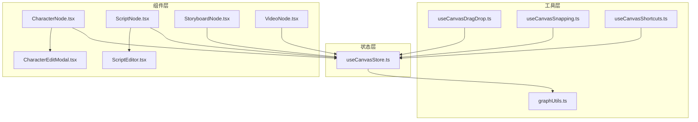
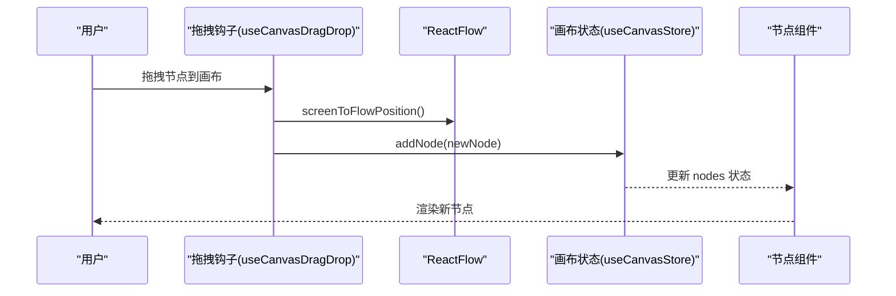
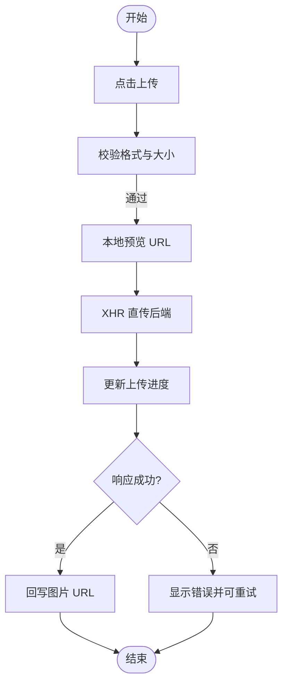
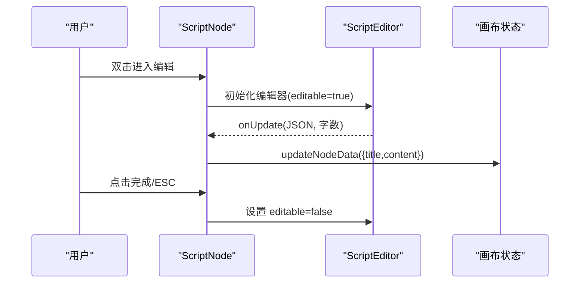
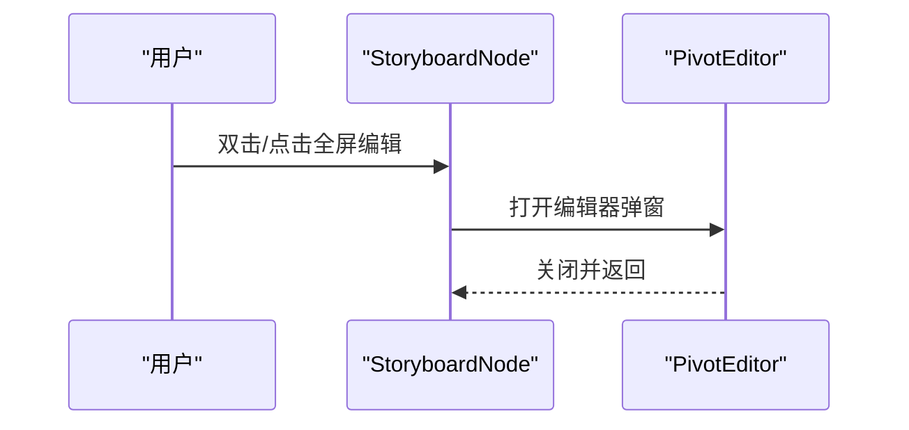
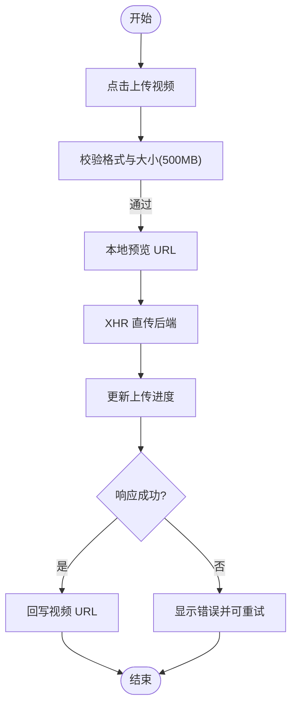
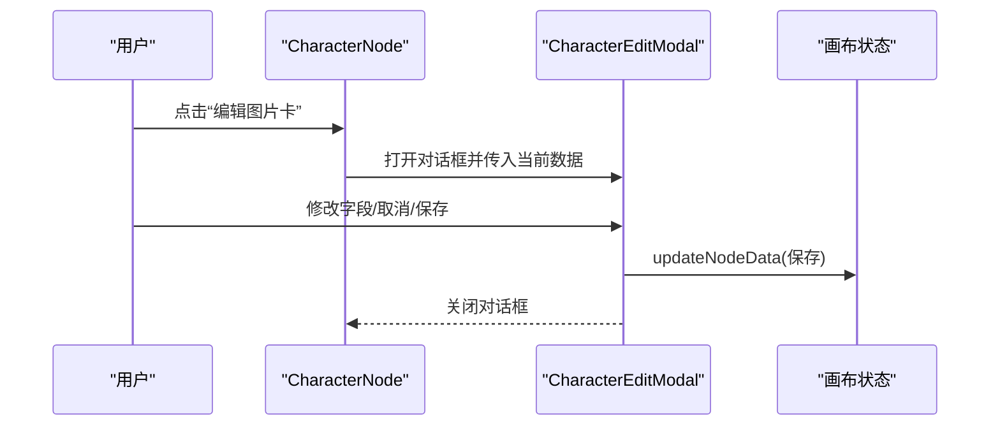
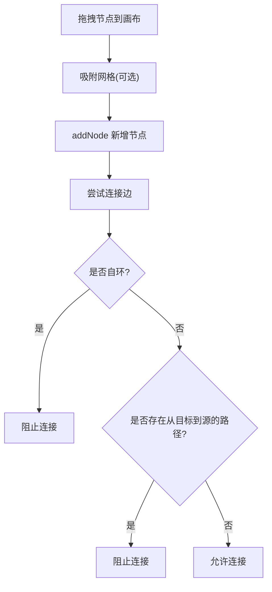
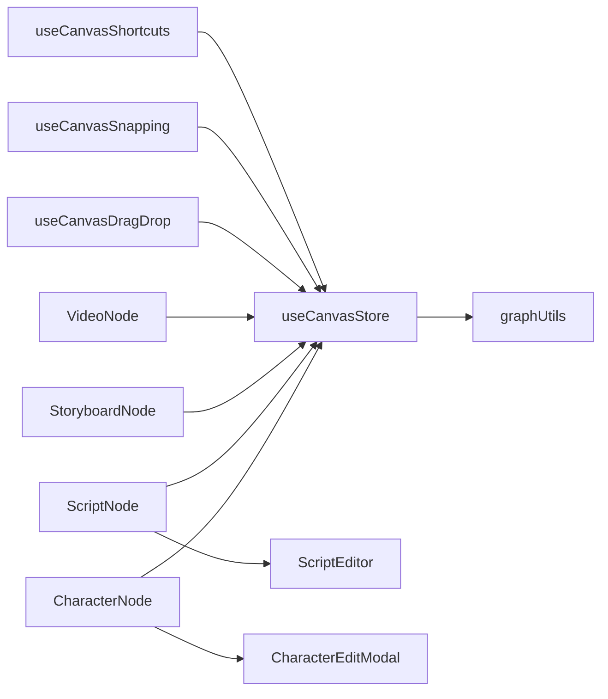

# 节点系统

<cite>
**本文引用的文件**
- [CharacterNode.tsx](file://frontend/src/components/canvas/CharacterNode.tsx)
- [ScriptNode.tsx](file://frontend/src/components/canvas/ScriptNode.tsx)
- [StoryboardNode.tsx](file://frontend/src/components/canvas/StoryboardNode.tsx)
- [VideoNode.tsx](file://frontend/src/components/canvas/VideoNode.tsx)
- [useCanvasStore.ts](file://frontend/src/store/useCanvasStore.ts)
- [CharacterEditModal.tsx](file://frontend/src/components/canvas/CharacterEditModal.tsx)
- [ScriptEditor.tsx](file://frontend/src/components/canvas/ScriptEditor.tsx)
- [useCanvasDragDrop.ts](file://frontend/src/app/theater/[id]/hooks/useCanvasDragDrop.ts)
- [useCanvasSnapping.ts](file://frontend/src/app/theater/[id]/hooks/useCanvasSnapping.ts)
- [useCanvasShortcuts.ts](file://frontend/src/app/theater/[id]/hooks/useCanvasShortcuts.ts)
- [graphUtils.ts](file://frontend/src/lib/graphUtils.ts)
- [TheaterCanvas.tsx](file://frontend/src/components/TheaterCanvas.tsx)
</cite>

## 目录
1. [简介](#简介)
2. [项目结构](#项目结构)
3. [核心组件](#核心组件)
4. [架构总览](#架构总览)
5. [详细组件分析](#详细组件分析)
6. [依赖关系分析](#依赖关系分析)
7. [性能考量](#性能考量)
8. [故障排查指南](#故障排查指南)
9. [结论](#结论)
10. [附录](#附录)

## 简介
本文件系统性梳理画布节点系统，覆盖角色节点、剧本节点、故事板节点与视频节点的设计架构、渲染逻辑、数据结构、属性配置、样式定制、交互行为（选择、编辑、删除、复制粘贴）、节点编辑器（如 CharacterEditModal）以及拖拽、对齐与碰撞检测机制。同时提供节点扩展开发指南，帮助开发者快速创建并集成自定义节点类型。

## 项目结构
节点系统位于前端工程的画布模块，采用按功能分层组织：
- 组件层：各节点组件（角色、剧本、故事板、视频）与通用编辑器、模态框
- 状态层：统一画布状态管理（节点、边、历史、同步、设置）
- 工具层：拖拽、对齐、快捷键、图算法（环检测）

**图表来源**
- [CharacterNode.tsx:1-692](file://frontend/src/components/canvas/CharacterNode.tsx#L1-L692)
- [ScriptNode.tsx:1-351](file://frontend/src/components/canvas/ScriptNode.tsx#L1-L351)
- [StoryboardNode.tsx:1-318](file://frontend/src/components/canvas/StoryboardNode.tsx#L1-L318)
- [VideoNode.tsx:1-534](file://frontend/src/components/canvas/VideoNode.tsx#L1-L534)
- [useCanvasStore.ts:1-540](file://frontend/src/store/useCanvasStore.ts#L1-L540)
- [ScriptEditor.tsx:1-280](file://frontend/src/components/canvas/ScriptEditor.tsx#L1-L280)
- [CharacterEditModal.tsx:1-119](file://frontend/src/components/canvas/CharacterEditModal.tsx#L1-L119)
- [useCanvasDragDrop.ts:1-74](file://frontend/src/app/theater/[id]/hooks/useCanvasDragDrop.ts#L1-L74)
- [useCanvasSnapping.ts:1-98](file://frontend/src/app/theater/[id]/hooks/useCanvasSnapping.ts#L1-L98)
- [useCanvasShortcuts.ts:1-26](file://frontend/src/app/theater/[id]/hooks/useCanvasShortcuts.ts#L1-L26)
- [graphUtils.ts:1-39](file://frontend/src/lib/graphUtils.ts#L1-L39)

**章节来源**
- [useCanvasStore.ts:1-540](file://frontend/src/store/useCanvasStore.ts#L1-L540)
- [useCanvasDragDrop.ts:1-74](file://frontend/src/app/theater/[id]/hooks/useCanvasDragDrop.ts#L1-L74)

## 核心组件
- 节点数据类型与统一节点类型
  - 角色节点数据：包含名称、描述、头像、图片地址、上传状态、适配模式
  - 剧本节点数据：标题、内容（Tiptap JSON）、标签、角色引用、场景引用
  - 故事板节点数据：镜头编号、描述、时长、透视配置与缓存数据
  - 视频节点数据：名称、描述、视频地址、上传状态、适配模式
  - 统一节点类型：Node<ScriptNodeData | CharacterNodeData | StoryboardNodeData | VideoNodeData>

- 状态管理要点
  - 节点增删改、边增删、连接、撤销/重做、历史快照、本地持久化、后端同步
  - 连接前进行自环与环检测，避免循环依赖
  - 支持吸附网格与对齐辅助线

**章节来源**
- [useCanvasStore.ts:26-61](file://frontend/src/store/useCanvasStore.ts#L26-L61)
- [useCanvasStore.ts:84-114](file://frontend/src/store/useCanvasStore.ts#L84-L114)
- [graphUtils.ts:4-38](file://frontend/src/lib/graphUtils.ts#L4-L38)

## 架构总览
节点系统基于 React Flow 实现画布，使用 Zustand 管理全局状态，并通过 Tiptap 提供富文本编辑能力。拖拽新增、对齐吸附、快捷键撤销重做贯穿整个交互链路。

**图表来源**
- [useCanvasDragDrop.ts:15-70](file://frontend/src/app/theater/[id]/hooks/useCanvasDragDrop.ts#L15-L70)
- [useCanvasStore.ts:256-264](file://frontend/src/store/useCanvasStore.ts#L256-L264)

## 详细组件分析

### 角色节点（CharacterNode）
- 数据结构与属性
  - 名称、描述、头像、图片 URL、上传中状态、图片适配模式（cover/contain）
- 渲染与样式
  - 卡片式布局，标题置于卡片外；根据 fitMode 控制图片显示方式
  - 上传进度条、错误提示、重试按钮
  - 全屏预览模式，支持缩放与拖拽平移
- 交互行为
  - 双击标题进入编辑；点击外部保存
  - 双击图片卡片打开全屏预览；ESC 关闭
  - 悬浮按钮：AI 编辑、切换适配模式、复制、删除
  - 拖拽遮罩：允许拖拽移动节点
- 上传流程
  - 本地预览 -> 后端直传（绕过 Next.js 代理限制）-> 成功回写 URL
- 边缘连接手柄
  - 左右两侧隐藏 Handle，配合自定义样式实现高亮与连接

**图表来源**
- [CharacterNode.tsx:126-205](file://frontend/src/components/canvas/CharacterNode.tsx#L126-L205)

**章节来源**
- [CharacterNode.tsx:13-692](file://frontend/src/components/canvas/CharacterNode.tsx#L13-L692)

### 剧本节点（ScriptNode）
- 数据结构与属性
  - 标题、内容（Tiptap JSON）、标签、角色、场景
- 渲染与样式
  - 标题置于卡片外；内容区域嵌入 ScriptEditor
  - 底部工具栏：完成编辑、AI 助手、编辑按钮
- 交互行为
  - 双击进入编辑；点击外部或 ESC 退出编辑并保存
  - 悬浮按钮：复制、删除
  - 字数统计实时更新
- 富文本编辑器
  - 使用 Tiptap 扩展集，支持标题、列表、块引用、代码块、高亮、颜色、对齐等
  - 内容规范化与同步，避免编辑态冲突

**图表来源**
- [ScriptNode.tsx:67-111](file://frontend/src/components/canvas/ScriptNode.tsx#L67-L111)
- [ScriptEditor.tsx:117-174](file://frontend/src/components/canvas/ScriptEditor.tsx#L117-L174)

**章节来源**
- [ScriptNode.tsx:11-351](file://frontend/src/components/canvas/ScriptNode.tsx#L11-L351)
- [ScriptEditor.tsx:1-280](file://frontend/src/components/canvas/ScriptEditor.tsx#L1-L280)

### 故事板节点（StoryboardNode）
- 数据结构与属性
  - 镜头编号、描述、时长、透视配置与缓存数据
- 渲染与样式
  - 简化的透视表骨架；已配置时显示“已配置”提示蒙层
  - 双击或点击“全屏编辑”打开 PivotEditor
- 交互行为
  - 双击进入编辑；悬浮按钮：全屏编辑、复制、删除
- 编辑器
  - PivotEditor 作为独立编辑器承载透视配置

**图表来源**
- [StoryboardNode.tsx:19-22](file://frontend/src/components/canvas/StoryboardNode.tsx#L19-L22)
- [StoryboardNode.tsx:290-312](file://frontend/src/components/canvas/StoryboardNode.tsx#L290-L312)

**章节来源**
- [StoryboardNode.tsx:11-318](file://frontend/src/components/canvas/StoryboardNode.tsx#L11-L318)

### 视频节点（VideoNode）
- 数据结构与属性
  - 名称、描述、视频 URL、上传中状态、视频适配模式（cover/contain）
- 渲染与样式
  - 卡片内嵌 <video> 标签；顶部/中部拖拽遮罩用于移动节点
  - 上传进度条、错误提示、重试按钮
- 交互行为
  - 双击标题进入编辑；点击外部保存
  - 悬浮按钮：切换适配模式、复制、删除
- 上传流程
  - 本地预览 URL -> 后端直传 -> 成功回写 URL
- 边缘连接手柄
  - 左右两侧隐藏 Handle，配合自定义样式实现高亮与连接

**图表来源**
- [VideoNode.tsx:107-186](file://frontend/src/components/canvas/VideoNode.tsx#L107-L186)

**章节来源**
- [VideoNode.tsx:10-534](file://frontend/src/components/canvas/VideoNode.tsx#L10-L534)

### 节点编辑器（CharacterEditModal）
- 功能概述
  - 以对话框形式编辑角色节点数据（名称、描述、头像）
  - 变更检测与离开确认，防止误关导致丢失
- 使用方法
  - 由角色节点触发，接收当前数据与保存回调
  - 校验必填字段后调用 onSave 并关闭对话框

**图表来源**
- [CharacterEditModal.tsx:15-48](file://frontend/src/components/canvas/CharacterEditModal.tsx#L15-L48)
- [useCanvasStore.ts:310-318](file://frontend/src/store/useCanvasStore.ts#L310-L318)

**章节来源**
- [CharacterEditModal.tsx:1-119](file://frontend/src/components/canvas/CharacterEditModal.tsx#L1-L119)

### 拖拽行为、约束与碰撞检测
- 拖拽新增
  - 从面板拖拽节点到画布，自动计算位置并应用吸附网格
  - 默认尺寸按节点类型映射，支持自定义尺寸传递
- 连接约束
  - 自环禁止；连接目标到源存在路径则阻止形成环
- 对齐吸附
  - 拖动节点时计算与其他节点边缘的最小差值，达到阈值时对齐并绘制辅助线
- 快捷键
  - Ctrl/Cmd + Z 撤销；Ctrl/Cmd + Y 或 Shift + Z 重做

**图表来源**
- [useCanvasDragDrop.ts:30-56](file://frontend/src/app/theater/[id]/hooks/useCanvasDragDrop.ts#L30-L56)
- [useCanvasStore.ts:238-254](file://frontend/src/store/useCanvasStore.ts#L238-L254)
- [graphUtils.ts:4-38](file://frontend/src/lib/graphUtils.ts#L4-L38)

**章节来源**
- [useCanvasDragDrop.ts:1-74](file://frontend/src/app/theater/[id]/hooks/useCanvasDragDrop.ts#L1-L74)
- [useCanvasSnapping.ts:1-98](file://frontend/src/app/theater/[id]/hooks/useCanvasSnapping.ts#L1-L98)
- [useCanvasShortcuts.ts:1-26](file://frontend/src/app/theater/[id]/hooks/useCanvasShortcuts.ts#L1-L26)
- [graphUtils.ts:1-39](file://frontend/src/lib/graphUtils.ts#L1-L39)

## 依赖关系分析
- 组件与状态
  - 各节点组件通过 useCanvasStore 读取/更新节点、边、视口与历史
  - ScriptNode 依赖 ScriptEditor；CharacterNode 可触发 CharacterEditModal
- 工具函数
  - 连接前使用 hasCycle 检测环
  - 拖拽新增使用 screenToFlowPosition 计算画布坐标
  - 对齐吸附使用节点测量尺寸参与计算

**图表来源**
- [useCanvasStore.ts:185-510](file://frontend/src/store/useCanvasStore.ts#L185-L510)
- [ScriptNode.tsx:8](file://frontend/src/components/canvas/ScriptNode.tsx#L8)
- [CharacterNode.tsx:17-18](file://frontend/src/components/canvas/CharacterNode.tsx#L17-L18)
- [useCanvasDragDrop.ts:7-8](file://frontend/src/app/theater/[id]/hooks/useCanvasDragDrop.ts#L7-L8)
- [useCanvasSnapping.ts:6](file://frontend/src/app/theater/[id]/hooks/useCanvasSnapping.ts#L6)
- [useCanvasShortcuts.ts:5](file://frontend/src/app/theater/[id]/hooks/useCanvasShortcuts.ts#L5)

**章节来源**
- [useCanvasStore.ts:1-540](file://frontend/src/store/useCanvasStore.ts#L1-L540)

## 性能考量
- 上传大文件直传后端，避免中间代理限制与内存峰值
- 图片/视频加载完成后按宽高比计算合理尺寸，避免频繁重排
- 编辑器惰性渲染与内容规范化，减少不必要的重算
- 历史快照控制频率，避免高频变更导致状态膨胀

[本节为通用建议，无需特定文件引用]

## 故障排查指南
- 无法连接边
  - 检查是否自环或会形成环：连接会被阻止
  - 参考：[useCanvasStore.ts:238-254](file://frontend/src/store/useCanvasStore.ts#L238-L254)，[graphUtils.ts:4-38](file://frontend/src/lib/graphUtils.ts#L4-L38)
- 上传失败
  - 检查文件类型与大小限制；查看错误提示与重试按钮
  - 参考：[CharacterNode.tsx:130-139](file://frontend/src/components/canvas/CharacterNode.tsx#L130-L139)，[VideoNode.tsx:111-120](file://frontend/src/components/canvas/VideoNode.tsx#L111-L120)
- 编辑器内容不同步
  - 确认编辑态与非编辑态切换；检查内容规范化与同步逻辑
  - 参考：[ScriptEditor.tsx:176-202](file://frontend/src/components/canvas/ScriptEditor.tsx#L176-L202)
- 节点无法拖动或吸附无效
  - 检查吸附开关与阈值；确认未禁用拖拽遮罩
  - 参考：[useCanvasSnapping.ts:12-90](file://frontend/src/app/theater/[id]/hooks/useCanvasSnapping.ts#L12-L90)，[useCanvasDragDrop.ts:30-34](file://frontend/src/app/theater/[id]/hooks/useCanvasDragDrop.ts#L30-L34)

**章节来源**
- [useCanvasStore.ts:238-254](file://frontend/src/store/useCanvasStore.ts#L238-L254)
- [graphUtils.ts:4-38](file://frontend/src/lib/graphUtils.ts#L4-L38)
- [CharacterNode.tsx:130-139](file://frontend/src/components/canvas/CharacterNode.tsx#L130-L139)
- [VideoNode.tsx:111-120](file://frontend/src/components/canvas/VideoNode.tsx#L111-L120)
- [ScriptEditor.tsx:176-202](file://frontend/src/components/canvas/ScriptEditor.tsx#L176-L202)
- [useCanvasSnapping.ts:12-90](file://frontend/src/app/theater/[id]/hooks/useCanvasSnapping.ts#L12-L90)
- [useCanvasDragDrop.ts:30-34](file://frontend/src/app/theater/[id]/hooks/useCanvasDragDrop.ts#L30-L34)

## 结论
该节点系统以清晰的数据模型与状态管理为核心，结合 React Flow 的强大渲染与交互能力，提供了角色、剧本、故事板与视频四类节点的完整生命周期支持。通过 Tiptap 与自定义编辑器实现富文本编辑，借助拖拽、对齐与快捷键提升创作效率。环检测与上传直传保障了稳定性与性能。扩展新节点类型时，遵循统一的数据结构与状态更新接口即可快速集成。

[本节为总结，无需特定文件引用]

## 附录

### 节点扩展开发指南
- 定义数据结构
  - 在画布状态中声明新节点的数据类型，参考现有类型定义
  - 参考：[useCanvasStore.ts:26-61](file://frontend/src/store/useCanvasStore.ts#L26-L61)
- 创建节点组件
  - 使用 Handle 定义连接手柄；实现标题编辑、上传/预览、复制/删除等交互
  - 参考：[CharacterNode.tsx:606-625](file://frontend/src/components/canvas/CharacterNode.tsx#L606-L625)，[VideoNode.tsx:510-529](file://frontend/src/components/canvas/VideoNode.tsx#L510-L529)
- 注册拖拽类型
  - 在面板侧为新类型设置默认尺寸与数据，参考默认尺寸映射
  - 参考：[useCanvasDragDrop.ts:37-43](file://frontend/src/app/theater/[id]/hooks/useCanvasDragDrop.ts#L37-L43)
- 集成编辑器
  - 若需富文本，复用 ScriptEditor 或封装专用编辑器
  - 参考：[ScriptEditor.tsx:117-174](file://frontend/src/components/canvas/ScriptEditor.tsx#L117-L174)
- 状态更新
  - 通过 useCanvasStore 的 updateNodeData/updateNodeDimensions 等方法更新节点
  - 参考：[useCanvasStore.ts:310-329](file://frontend/src/store/useCanvasStore.ts#L310-L329)
- 连接约束
  - 如需环检测，沿用 hasCycle 逻辑
  - 参考：[graphUtils.ts:4-38](file://frontend/src/lib/graphUtils.ts#L4-L38)

**章节来源**
- [useCanvasStore.ts:26-61](file://frontend/src/store/useCanvasStore.ts#L26-L61)
- [useCanvasDragDrop.ts:37-43](file://frontend/src/app/theater/[id]/hooks/useCanvasDragDrop.ts#L37-L43)
- [ScriptEditor.tsx:117-174](file://frontend/src/components/canvas/ScriptEditor.tsx#L117-L174)
- [useCanvasStore.ts:310-329](file://frontend/src/store/useCanvasStore.ts#L310-L329)
- [graphUtils.ts:4-38](file://frontend/src/lib/graphUtils.ts#L4-L38)