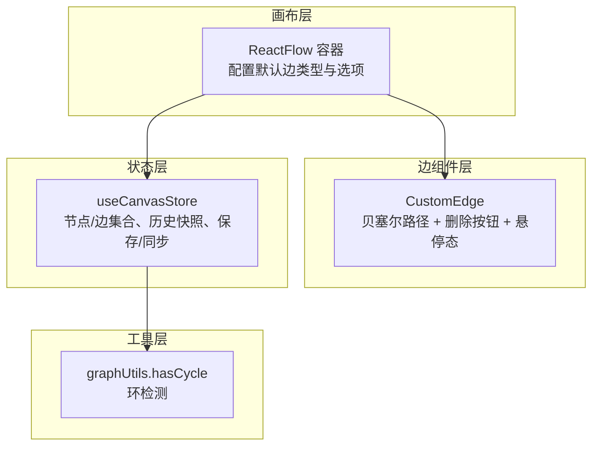
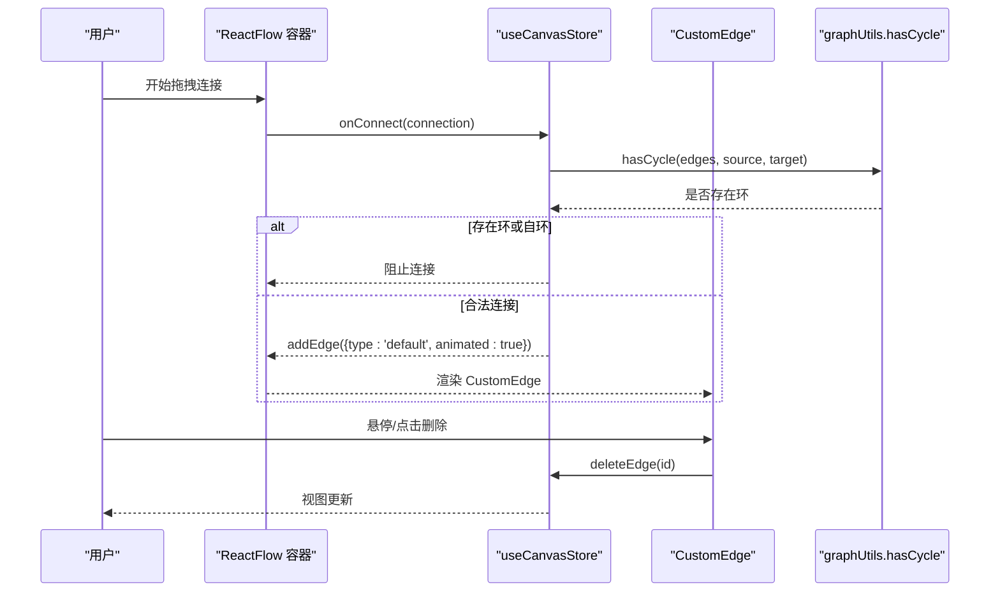
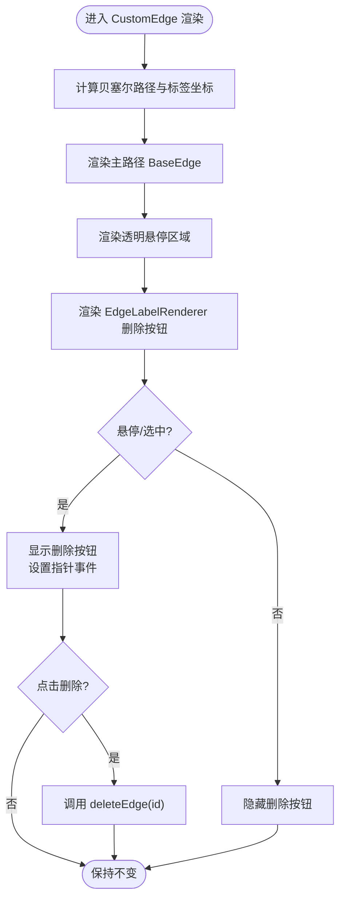
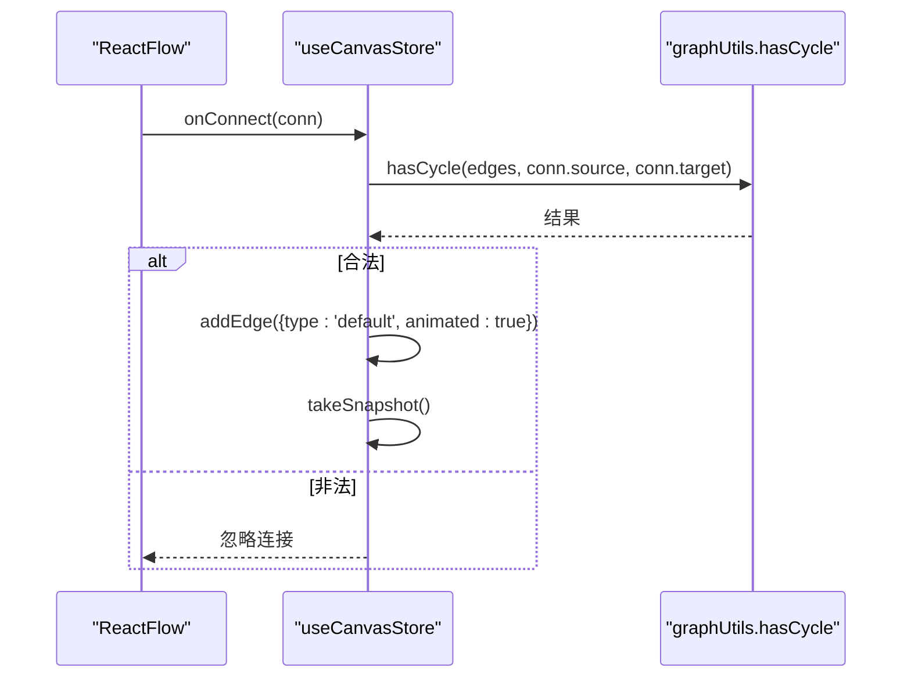
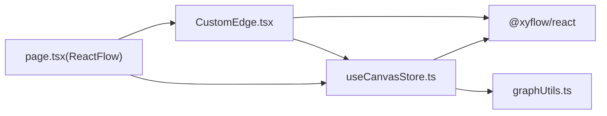

# 连接线系统

<cite>
**本文引用的文件列表**
- [CustomEdge.tsx](file://frontend/src/components/canvas/CustomEdge.tsx)
- [useCanvasStore.ts](file://frontend/src/store/useCanvasStore.ts)
- [page.tsx](file://frontend/src/app/theater/[id]/page.tsx)
- [graphUtils.ts](file://frontend/src/lib/graphUtils.ts)
- [CustomEdge.test.tsx](file://frontend/src/components/canvas/__tests__/CustomEdge.test.tsx)
- [ScriptNode.tsx](file://frontend/src/components/canvas/ScriptNode.tsx)
</cite>

## 目录
1. [简介](#简介)
2. [项目结构](#项目结构)
3. [核心组件](#核心组件)
4. [架构总览](#架构总览)
5. [详细组件分析](#详细组件分析)
6. [依赖关系分析](#依赖关系分析)
7. [性能考量](#性能考量)
8. [故障排查指南](#故障排查指南)
9. [结论](#结论)
10. [附录：扩展开发指南](#附录扩展开发指南)

## 简介
本文件面向画布连接线系统，聚焦于自定义边样式的实现与交互。内容涵盖：
- CustomEdge 组件的设计架构与渲染逻辑
- 连接线的绘制算法（贝塞尔曲线）、路径计算与标签定位
- 交互功能（连线创建、编辑、删除、样式调整）
- 状态管理（连线类型、方向性、权重等属性）
- 性能优化策略（大量连线时的渲染优化与内存管理）
- 扩展开发指南（自定义连线样式与交互行为）

## 项目结构
连接线系统主要由以下部分组成：
- ReactFlow 画布容器与默认配置
- 自定义边组件 CustomEdge
- 全局状态管理 useCanvasStore
- 图算法工具 hasCycle（环检测）
- 测试用例 CustomEdge.test.tsx

图表来源
- [page.tsx:44-52](file://frontend/src/app/theater/[id]/page.tsx#L44-L52)
- [CustomEdge.tsx:1-92](file://frontend/src/components/canvas/CustomEdge.tsx#L1-L92)
- [useCanvasStore.ts:185-539](file://frontend/src/store/useCanvasStore.ts#L185-L539)
- [graphUtils.ts:4-38](file://frontend/src/lib/graphUtils.ts#L4-L38)

章节来源
- [page.tsx:44-52](file://frontend/src/app/theater/[id]/page.tsx#L44-L52)
- [CustomEdge.tsx:1-92](file://frontend/src/components/canvas/CustomEdge.tsx#L1-L92)
- [useCanvasStore.ts:185-539](file://frontend/src/store/useCanvasStore.ts#L185-L539)
- [graphUtils.ts:4-38](file://frontend/src/lib/graphUtils.ts#L4-L38)

## 核心组件
- CustomEdge：基于 @xyflow/react 的 BaseEdge 渲染贝塞尔曲线，提供删除按钮与悬停交互。
- useCanvasStore：集中管理节点/边集合、历史快照、保存/同步、环检测与连线创建。
- graphUtils.hasCycle：在连线前进行环检测，防止循环依赖。
- ReactFlow 容器：设置默认边类型、连接半径、吸附网格等参数。

章节来源
- [CustomEdge.tsx:1-92](file://frontend/src/components/canvas/CustomEdge.tsx#L1-L92)
- [useCanvasStore.ts:185-539](file://frontend/src/store/useCanvasStore.ts#L185-L539)
- [graphUtils.ts:4-38](file://frontend/src/lib/graphUtils.ts#L4-L38)
- [page.tsx:44-52](file://frontend/src/app/theater/[id]/page.tsx#L44-L52)

## 架构总览
连接线系统采用“组件 + 状态 + 工具”的分层设计：
- 组件层：CustomEdge 负责视觉呈现与用户交互
- 状态层：useCanvasStore 统一管理数据与行为
- 工具层：graphUtils 提供图算法支持
- 容器层：ReactFlow 提供画布与事件回调

图表来源
- [page.tsx:339-340](file://frontend/src/app/theater/[id]/page.tsx#L339-L340)
- [useCanvasStore.ts:238-254](file://frontend/src/store/useCanvasStore.ts#L238-L254)
- [graphUtils.ts:4-38](file://frontend/src/lib/graphUtils.ts#L4-L38)
- [CustomEdge.tsx:29-32](file://frontend/src/components/canvas/CustomEdge.tsx#L29-L32)

## 详细组件分析

### CustomEdge 组件分析
- 设计要点
  - 使用 getBezierPath 计算贝塞尔曲线路径与标签位置
  - 通过 BaseEdge 渲染主路径，叠加一个透明的宽路径用于提升悬停命中区域
  - 删除按钮仅在悬停或选中时显示，并通过 z-index 与指针事件控制可见性
  - 支持桌面端鼠标与移动端触摸事件，触控后自动隐藏删除按钮

- 渲染逻辑
  - 主路径：BaseEdge 接收 path 与 markerEnd，动态设置 stroke 与 strokeWidth
  - 标签渲染：EdgeLabelRenderer 内部使用 transform 定位删除按钮
  - 悬停态：selected 或 isHovered 时加粗并改变颜色

- 交互流程
  - 鼠标进入/离开：切换 isHovered 状态
  - 触摸开始/结束：显示/延时隐藏删除按钮
  - 点击删除：调用 useCanvasStore.deleteEdge(id)，触发视图更新与快照

图表来源
- [CustomEdge.tsx:17-88](file://frontend/src/components/canvas/CustomEdge.tsx#L17-L88)

章节来源
- [CustomEdge.tsx:1-92](file://frontend/src/components/canvas/CustomEdge.tsx#L1-L92)
- [CustomEdge.test.tsx:53-108](file://frontend/src/components/canvas/__tests__/CustomEdge.test.tsx#L53-L108)

### 状态管理与连线生命周期
- 默认边配置
  - 在 ReactFlow 容器中设置 defaultEdgeOptions：type='custom'、animated=true、strokeWidth=2
  - edgeTypes 注册了自定义边类型 custom 对应 CustomEdge

- 连线创建
  - onConnect 回调中先执行 hasCycle 判断，阻止自环与环路
  - 成功后通过 addEdge 添加一条带 type 与 animated 的边，并标记 isDirty 与 takeSnapshot

- 连线删除
  - CustomEdge 点击删除按钮触发 deleteEdge(id)
  - useCanvasStore 删除对应边并标记 isDirty，同时派发自定义事件 canvas:edge:deleted

- 历史与快照
  - takeSnapshot 将当前 nodes/edges 入栈，限制最大历史长度
  - undo/redo 读取历史快照恢复状态

图表来源
- [page.tsx:339-340](file://frontend/src/app/theater/[id]/page.tsx#L339-L340)
- [useCanvasStore.ts:238-254](file://frontend/src/store/useCanvasStore.ts#L238-L254)
- [graphUtils.ts:4-38](file://frontend/src/lib/graphUtils.ts#L4-L38)

章节来源
- [page.tsx:44-52](file://frontend/src/app/theater/[id]/page.tsx#L44-L52)
- [useCanvasStore.ts:238-254](file://frontend/src/store/useCanvasStore.ts#L238-L254)
- [useCanvasStore.ts:276-288](file://frontend/src/store/useCanvasStore.ts#L276-L288)
- [useCanvasStore.ts:335-348](file://frontend/src/store/useCanvasStore.ts#L335-L348)

### 绘制算法与路径计算
- 贝塞尔曲线
  - getBezierPath 根据 sourceX/Y、targetX/Y 与方向（Position）计算路径字符串与标签坐标
  - CustomEdge 将该路径传递给 BaseEdge 渲染

- 标签定位
  - EdgeLabelRenderer 内部使用 transform 将删除按钮定位到路径上的 labelX/labelY 附近
  - 通过 opacity 与 pointerEvents 控制交互范围

- 动画效果
  - defaultEdgeOptions 中设置 animated=true，结合 ReactFlow 的默认动画能力实现连线过渡

章节来源
- [CustomEdge.tsx:17-24](file://frontend/src/components/canvas/CustomEdge.tsx#L17-L24)
- [CustomEdge.tsx:59-88](file://frontend/src/components/canvas/CustomEdge.tsx#L59-L88)
- [page.tsx:48-52](file://frontend/src/app/theater/[id]/page.tsx#L48-L52)

### 交互功能详解
- 连线创建
  - 松开连接点时，若目标为画布面板且连接有效，弹出快速添加菜单，支持从源节点创建不同类型节点并自动建立连接
  - handleAddNodeFromMenu 根据 handle 方向决定 source/target 与 target/source 的组合

- 编辑与删除
  - CustomEdge 提供删除按钮，点击后调用 deleteEdge，触发视图更新与历史快照
  - 支持键盘快捷键：Ctrl+S 保存、Ctrl+Z 撤销、Ctrl+Y/Shift+Z 重做

- 样式调整
  - 默认边样式在 defaultEdgeOptions 中统一配置
  - CustomEdge 可根据 selected/isHovered 动态调整 stroke 与 strokeWidth

章节来源
- [page.tsx:118-155](file://frontend/src/app/theater/[id]/page.tsx#L118-L155)
- [page.tsx:165-219](file://frontend/src/app/theater/[id]/page.tsx#L165-L219)
- [page.tsx:236-259](file://frontend/src/app/theater/[id]/page.tsx#L236-L259)
- [CustomEdge.tsx:29-32](file://frontend/src/components/canvas/CustomEdge.tsx#L29-L32)
- [CustomEdge.tsx:39-44](file://frontend/src/components/canvas/CustomEdge.tsx#L39-L44)

### 状态属性与处理
- 连线类型
  - 默认类型为 'default'，CustomEdge 类型为 'custom'；可通过 edgeTypes 与 defaultEdgeOptions 配置
- 方向性
  - 通过 sourcePosition/targetPosition 与 getBezierPath 计算路径方向
- 权重/样式
  - style 透传至 BaseEdge；可按需扩展为权重可视化（如宽度/颜色映射）
- 数据持久化
  - edgeToApi/apiToEdge 映射边数据，包含 source/target、sourceHandle/targetHandle、edge_type、animated、style 等字段

章节来源
- [useCanvasStore.ts:144-168](file://frontend/src/store/useCanvasStore.ts#L144-L168)
- [useCanvasStore.ts:487-491](file://frontend/src/store/useCanvasStore.ts#L487-L491)
- [page.tsx:44-52](file://frontend/src/app/theater/[id]/page.tsx#L44-L52)

## 依赖关系分析
- CustomEdge 依赖
  - @xyflow/react：BaseEdge、getBezierPath、EdgeLabelRenderer、EdgeProps
  - useCanvasStore：deleteEdge
- useCanvasStore 依赖
  - @xyflow/react：Connection、Edge、EdgeChange、Node、NodeChange、addEdge、applyNodeChanges、applyEdgeChanges、OnNodesChange、OnEdgesChange、OnConnect、Viewport
  - graphUtils.hasCycle：环检测
  - theaterApi：前后端数据映射与同步
- ReactFlow 容器依赖
  - defaultEdgeOptions、edgeTypes、onConnect、onConnectEnd、onDragOver、onDrop、deleteKeyCode、fitView、min/maxZoom、snapToGrid/snapGrid

图表来源
- [CustomEdge.tsx:2-3](file://frontend/src/components/canvas/CustomEdge.tsx#L2-L3)
- [useCanvasStore.ts:17-24](file://frontend/src/store/useCanvasStore.ts#L17-L24)
- [graphUtils.ts:2-3](file://frontend/src/lib/graphUtils.ts#L2-L3)
- [page.tsx:334-358](file://frontend/src/app/theater/[id]/page.tsx#L334-L358)

章节来源
- [CustomEdge.tsx:1-92](file://frontend/src/components/canvas/CustomEdge.tsx#L1-L92)
- [useCanvasStore.ts:185-539](file://frontend/src/store/useCanvasStore.ts#L185-L539)
- [graphUtils.ts:1-39](file://frontend/src/lib/graphUtils.ts#L1-L39)
- [page.tsx:334-358](file://frontend/src/app/theater/[id]/page.tsx#L334-L358)

## 性能考量
- 渲染优化
  - 使用 getBezierPath 计算路径，避免重复计算与过度 DOM 更新
  - 通过 EdgeLabelRenderer 仅渲染必要元素，减少不必要的重排
- 交互命中区
  - 透明宽路径提升悬停命中率，降低误操作
- 状态与快照
  - takeSnapshot 限制历史长度，避免内存膨胀
  - onEdgesChange 仅对 add/remove 等显著变更标记 isDirty，减少无效保存
- 大量连线场景建议
  - 合理设置 connectionRadius 与 snapGrid，减少无效连接尝试
  - 对动画与样式进行必要的节流/防抖（可在 CustomEdge 中扩展）
  - 使用 React.memo 包裹复杂子组件（如标签内容），减少重渲染

章节来源
- [CustomEdge.tsx:45-58](file://frontend/src/components/canvas/CustomEdge.tsx#L45-L58)
- [useCanvasStore.ts:335-348](file://frontend/src/store/useCanvasStore.ts#L335-L348)
- [useCanvasStore.ts:224-236](file://frontend/src/store/useCanvasStore.ts#L224-L236)
- [page.tsx:347-358](file://frontend/src/app/theater/[id]/page.tsx#L347-L358)

## 故障排查指南
- 连线无法创建
  - 检查是否触发了环检测或自环保护
  - 确认 onConnect 回调是否被调用
- 删除按钮不显示
  - 确认 isHovered 或 selected 状态是否正确
  - 检查 EdgeLabelRenderer 的 pointerEvents 与 opacity
- 删除无效
  - 确认 deleteEdge(id) 是否被调用
  - 检查 useCanvasStore 的 edges 集合是否更新
- 性能问题
  - 大量连线时检查历史快照数量与连接半径设置
  - 确保未在渲染中进行昂贵计算

章节来源
- [CustomEdge.test.tsx:53-108](file://frontend/src/components/canvas/__tests__/CustomEdge.test.tsx#L53-L108)
- [CustomEdge.tsx:29-32](file://frontend/src/components/canvas/CustomEdge.tsx#L29-L32)
- [useCanvasStore.ts:276-288](file://frontend/src/store/useCanvasStore.ts#L276-L288)
- [useCanvasStore.ts:335-348](file://frontend/src/store/useCanvasStore.ts#L335-L348)

## 结论
连接线系统通过 CustomEdge 与 useCanvasStore 的协作，实现了稳定、可交互且可扩展的连线体验。其核心优势在于：
- 清晰的职责分离：组件负责渲染与交互，状态负责数据与行为
- 强健的约束：环检测与自环保护确保图结构合法性
- 良好的扩展性：默认边配置与自定义边类型便于二次开发

## 附录：扩展开发指南

### 自定义连线样式
- 修改默认样式
  - 在 ReactFlow 容器的 defaultEdgeOptions 中调整 style、animated、type
- 动态样式
  - 在 CustomEdge 中根据 selected/isHovered 动态设置 stroke/strokeWidth
  - 可扩展为按权重/类型映射不同颜色或线宽

章节来源
- [page.tsx:48-52](file://frontend/src/app/theater/[id]/page.tsx#L48-L52)
- [CustomEdge.tsx:39-44](file://frontend/src/components/canvas/CustomEdge.tsx#L39-L44)

### 自定义交互行为
- 删除按钮
  - 可在 CustomEdge 中扩展更多操作（如复制、编辑标签、打开属性面板）
- 悬停反馈
  - 可在 CustomEdge 中加入提示框、权重显示等
- 移动端优化
  - 当前已支持触摸事件，可进一步优化长按/滑动等手势

章节来源
- [CustomEdge.tsx:59-88](file://frontend/src/components/canvas/CustomEdge.tsx#L59-L88)
- [CustomEdge.tsx:52-57](file://frontend/src/components/canvas/CustomEdge.tsx#L52-L57)

### 自定义边类型
- 新增边类型
  - 在 edgeTypes 中注册新的边组件
  - 在 defaultEdgeOptions 中设置 type 为新类型
- 与现有 CustomEdge 协同
  - 可复用 getBezierPath 与 EdgeLabelRenderer，保持一致的交互体验

章节来源
- [page.tsx:44-46](file://frontend/src/app/theater/[id]/page.tsx#L44-L46)
- [page.tsx:48-52](file://frontend/src/app/theater/[id]/page.tsx#L48-L52)

### 环检测与约束
- 环检测
  - 在 onConnect 中调用 hasCycle，阻止自环与环路
- 其他约束
  - 可扩展为方向性约束、权重上限、节点类型匹配等规则

章节来源
- [useCanvasStore.ts:238-254](file://frontend/src/store/useCanvasStore.ts#L238-L254)
- [graphUtils.ts:4-38](file://frontend/src/lib/graphUtils.ts#L4-L38)