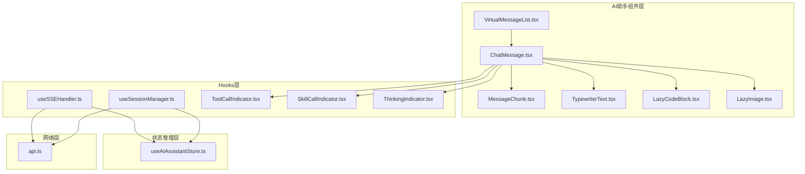
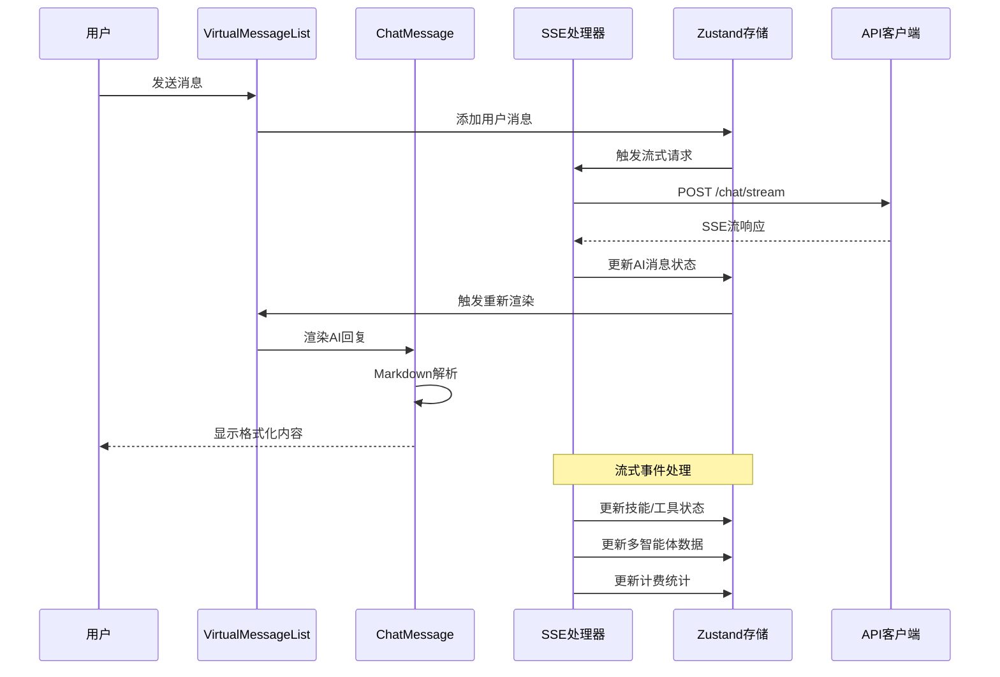
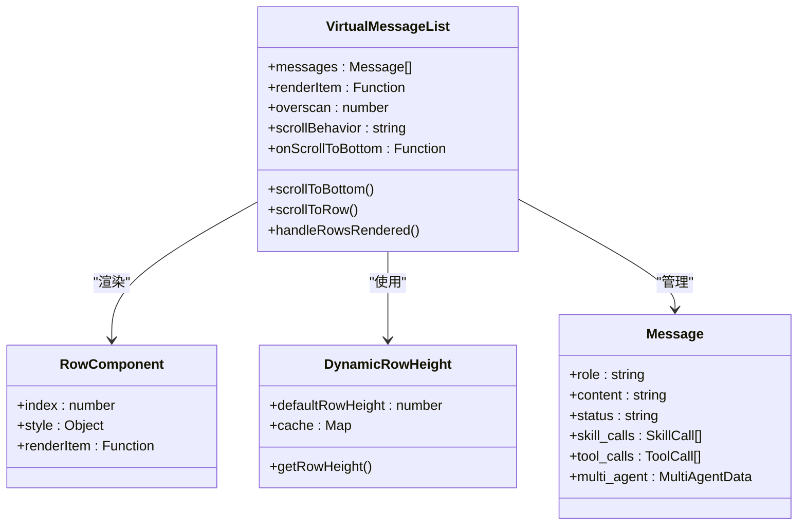
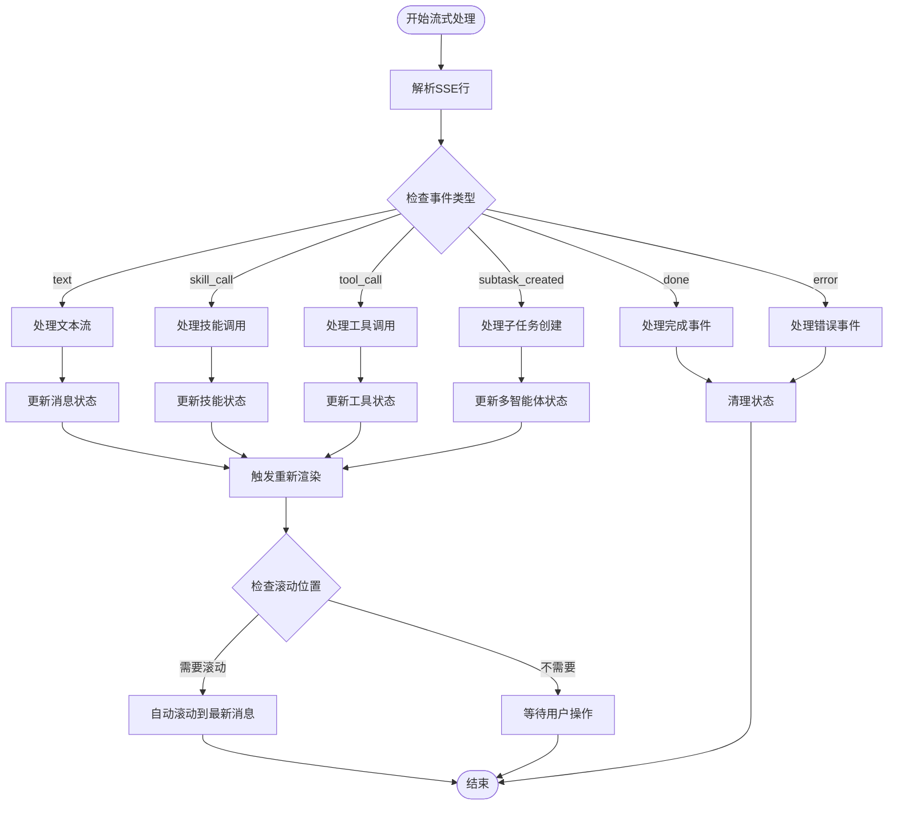
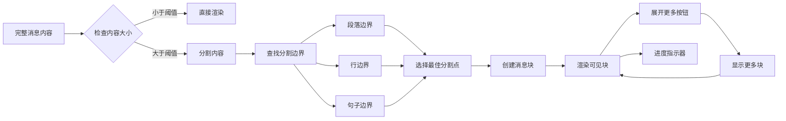
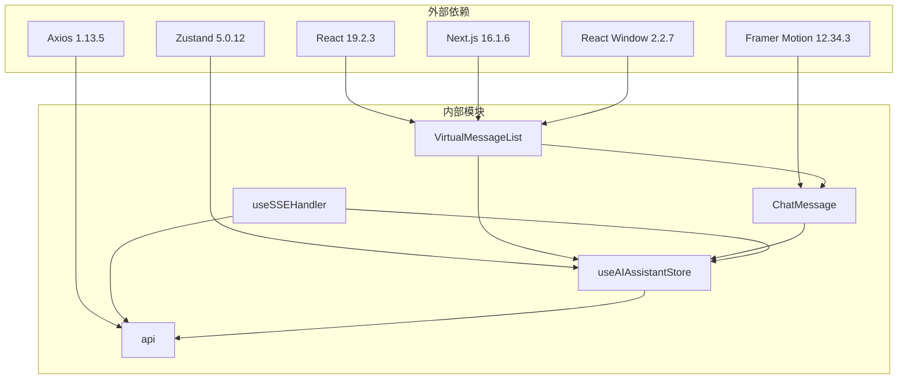

# 虚拟化聊天渲染

<cite>
**本文档引用的文件**
- [VirtualMessageList.tsx](file://frontend/src/components/ai-assistant/VirtualMessageList.tsx)
- [ChatMessage.tsx](file://frontend/src/components/ai-assistant/ChatMessage.tsx)
- [MessageChunk.tsx](file://frontend/src/components/ai-assistant/MessageChunk.tsx)
- [useSSEHandler.ts](file://frontend/src/components/ai-assistant/hooks/useSSEHandler.ts)
- [useSessionManager.ts](file://frontend/src/components/ai-assistant/hooks/useSessionManager.ts)
- [useAIAssistantStore.ts](file://frontend/src/store/useAIAssistantStore.ts)
- [TypewriterText.tsx](file://frontend/src/components/ai-assistant/TypewriterText.tsx)
- [LazyCodeBlock.tsx](file://frontend/src/components/ai-assistant/LazyCodeBlock.tsx)
- [LazyImage.tsx](file://frontend/src/components/ai-assistant/LazyImage.tsx)
- [api.ts](file://frontend/src/lib/api.ts)
- [ToolCallIndicator.tsx](file://frontend/src/components/ai-assistant/ToolCallIndicator.tsx)
- [SkillCallIndicator.tsx](file://frontend/src/components/ai-assistant/SkillCallIndicator.tsx)
- [ThinkingIndicator.tsx](file://frontend/src/components/ai-assistant/ThinkingIndicator.tsx)
- [package.json](file://frontend/package.json)
</cite>

## 目录
1. [简介](#简介)
2. [项目结构](#项目结构)
3. [核心组件](#核心组件)
4. [架构概览](#架构概览)
5. [详细组件分析](#详细组件分析)
6. [依赖关系分析](#依赖关系分析)
7. [性能考虑](#性能考虑)
8. [故障排除指南](#故障排除指南)
9. [结论](#结论)

## 简介

虚拟化聊天渲染系统是一个基于 React 和 Next.js 构建的高性能聊天界面解决方案。该系统通过虚拟化技术、流式渲染和智能缓存策略，实现了大规模消息列表的流畅渲染和交互体验。

系统的核心特性包括：
- 基于 react-window 的虚拟化消息列表
- 流式服务器推送事件(SSE)处理
- 智能消息分块渲染
- 图片和代码块的懒加载优化
- 多智能体协作支持
- 实时上下文使用统计

## 项目结构

前端项目采用模块化的组件架构，主要分为以下几个层次：

**图表来源**
- [VirtualMessageList.tsx:1-293](file://frontend/src/components/ai-assistant/VirtualMessageList.tsx#L1-L293)
- [ChatMessage.tsx:1-200](file://frontend/src/components/ai-assistant/ChatMessage.tsx#L1-L200)
- [useSSEHandler.ts:1-357](file://frontend/src/components/ai-assistant/hooks/useSSEHandler.ts#L1-L357)

**章节来源**
- [VirtualMessageList.tsx:1-293](file://frontend/src/components/ai-assistant/VirtualMessageList.tsx#L1-L293)
- [ChatMessage.tsx:1-200](file://frontend/src/components/ai-assistant/ChatMessage.tsx#L1-L200)
- [useSSEHandler.ts:1-357](file://frontend/src/components/ai-assistant/hooks/useSSEHandler.ts#L1-L357)

## 核心组件

### 虚拟化消息列表

VirtualMessageList 是整个聊天渲染系统的核心组件，它基于 react-window 实现了高性能的消息列表渲染。

**关键特性：**
- 动态行高计算，支持不同消息类型的自适应高度
- 智能滚动行为，区分用户手动滚动和程序自动滚动
- 流式内容更新支持，实时响应AI回复
- 滚动位置记忆，避免频繁重排

**章节来源**
- [VirtualMessageList.tsx:43-271](file://frontend/src/components/ai-assistant/VirtualMessageList.tsx#L43-L271)

### 聊天消息组件

ChatMessage 负责单个消息的渲染，支持多种消息类型和格式。

**支持的功能：**
- Markdown 内容渲染，包括代码块和图片
- 流式文本打字机效果
- 技能调用和工具调用指示器
- 多智能体协作步骤展示
- 大消息分块渲染优化

**章节来源**
- [ChatMessage.tsx:105-199](file://frontend/src/components/ai-assistant/ChatMessage.tsx#L105-L199)

### SSE事件处理器

useSSEHandler 处理来自服务器的流式事件，实现真正的实时聊天体验。

**处理的事件类型：**
- 文本流式传输
- 技能调用生命周期
- 工具调用执行状态
- 多智能体协作步骤
- 计费和上下文使用统计

**章节来源**
- [useSSEHandler.ts:24-356](file://frontend/src/components/ai-assistant/hooks/useSSEHandler.ts#L24-L356)

## 架构概览

系统采用分层架构设计，确保各组件职责清晰、耦合度低：

**图表来源**
- [useSSEHandler.ts:64-349](file://frontend/src/components/ai-assistant/hooks/useSSEHandler.ts#L64-L349)
- [useAIAssistantStore.ts:167-312](file://frontend/src/store/useAIAssistantStore.ts#L167-L312)

## 详细组件分析

### 虚拟化渲染机制

**图表来源**
- [VirtualMessageList.tsx:28-41](file://frontend/src/components/ai-assistant/VirtualMessageList.tsx#L28-L41)
- [VirtualMessageList.tsx:44-52](file://frontend/src/components/ai-assistant/VirtualMessageList.tsx#L44-L52)

**章节来源**
- [VirtualMessageList.tsx:33-41](file://frontend/src/components/ai-assistant/VirtualMessageList.tsx#L33-L41)
- [VirtualMessageList.tsx:64-66](file://frontend/src/components/ai-assistant/VirtualMessageList.tsx#L64-L66)

### 流式内容处理流程

**图表来源**
- [useSSEHandler.ts:53-62](file://frontend/src/components/ai-assistant/hooks/useSSEHandler.ts#L53-L62)
- [useSSEHandler.ts:67-349](file://frontend/src/components/ai-assistant/hooks/useSSEHandler.ts#L67-L349)

**章节来源**
- [useSSEHandler.ts:64-105](file://frontend/src/components/ai-assistant/hooks/useSSEHandler.ts#L64-L105)
- [useSSEHandler.ts:107-162](file://frontend/src/components/ai-assistant/hooks/useSSEHandler.ts#L107-L162)

### 消息分块渲染机制

对于大消息内容，系统采用智能分块渲染策略：

**图表来源**
- [MessageChunk.tsx:28-60](file://frontend/src/components/ai-assistant/MessageChunk.tsx#L28-L60)
- [MessageChunk.tsx:93-103](file://frontend/src/components/ai-assistant/MessageChunk.tsx#L93-L103)

**章节来源**
- [MessageChunk.tsx:18-86](file://frontend/src/components/ai-assistant/MessageChunk.tsx#L18-L86)
- [MessageChunk.tsx:161-169](file://frontend/src/components/ai-assistant/MessageChunk.tsx#L161-L169)

### 性能优化策略

系统采用了多层次的性能优化策略：

1. **虚拟化渲染**：使用 react-window 只渲染可视区域内的消息
2. **懒加载组件**：图片和代码块仅在进入视口时加载
3. **智能缓存**：动态行高和消息状态缓存
4. **流式处理**：增量更新而非全量重渲染
5. **内存管理**：及时清理事件监听器和定时器

**章节来源**
- [LazyImage.tsx:29-54](file://frontend/src/components/ai-assistant/LazyImage.tsx#L29-L54)
- [LazyCodeBlock.tsx:67-92](file://frontend/src/components/ai-assistant/LazyCodeBlock.tsx#L67-L92)

## 依赖关系分析

系统依赖关系呈现清晰的分层结构：

**图表来源**
- [package.json:13-69](file://frontend/package.json#L13-L69)
- [VirtualMessageList.tsx:3-6](file://frontend/src/components/ai-assistant/VirtualMessageList.tsx#L3-L6)

**章节来源**
- [package.json:13-69](file://frontend/package.json#L13-L69)
- [VirtualMessageList.tsx:3-6](file://frontend/src/components/ai-assistant/VirtualMessageList.tsx#L3-L6)

## 性能考虑

### 渲染性能优化

系统在多个层面实现了性能优化：

1. **虚拟化渲染**：仅渲染可视区域内的消息，消息数量增长不影响渲染性能
2. **增量更新**：使用不可变更新模式，只更新发生变化的部分
3. **防抖节流**：对 resize 和 scroll 事件进行节流处理
4. **内存泄漏防护**：及时清理事件监听器和定时器

### 网络性能优化

1. **SSE连接池**：复用单个SSE连接处理多个事件
2. **流式数据处理**：边接收边渲染，减少等待时间
3. **请求去重**：避免重复的API请求
4. **缓存策略**：合理利用浏览器缓存和应用内缓存

### 内存管理

1. **组件卸载清理**：确保组件卸载时清理所有订阅和定时器
2. **状态持久化**：使用 localStorage 持久化重要状态
3. **垃圾回收友好**：避免创建不必要的闭包和对象

## 故障排除指南

### 常见问题及解决方案

**问题1：消息不显示或显示异常**
- 检查消息数据结构是否正确
- 确认渲染函数返回有效的React节点
- 验证消息角色和状态字段

**问题2：滚动行为异常**
- 检查 overscan 配置是否合理
- 确认容器高度计算是否正确
- 验证滚动事件监听器是否正常工作

**问题3：SSE连接断开**
- 检查网络连接状态
- 验证服务器端SSE配置
- 确认客户端事件处理器是否正常

**问题4：性能问题**
- 检查消息数量是否过大
- 验证懒加载组件是否正常工作
- 确认是否有内存泄漏

**章节来源**
- [VirtualMessageList.tsx:118-141](file://frontend/src/components/ai-assistant/VirtualMessageList.tsx#L118-L141)
- [useSSEHandler.ts:341-345](file://frontend/src/components/ai-assistant/hooks/useSSEHandler.ts#L341-L345)

### 调试技巧

1. **启用开发工具**：使用 React DevTools 检查组件树
2. **监控状态变化**：通过浏览器调试器观察 Zustand 状态
3. **网络请求追踪**：检查 SSE 连接和 API 请求
4. **性能分析**：使用浏览器性能面板分析渲染性能

## 结论

虚拟化聊天渲染系统通过精心设计的架构和多项性能优化技术，成功实现了大规模消息列表的高效渲染和流畅交互。系统的主要优势包括：

1. **高性能渲染**：基于虚拟化技术的消息列表，支持数千条消息的流畅滚动
2. **实时交互**：完整的SSE流式处理，提供接近实时的聊天体验
3. **智能优化**：多层懒加载和缓存策略，确保良好的用户体验
4. **可扩展性**：模块化设计便于功能扩展和维护

该系统为构建高性能的聊天应用提供了完整的解决方案，特别适合需要处理大量消息和实时交互场景的应用。