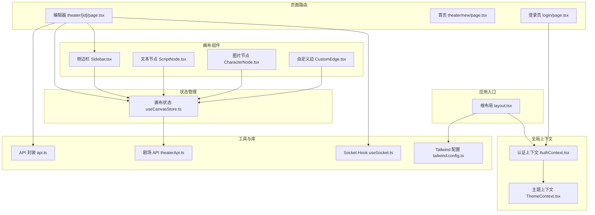
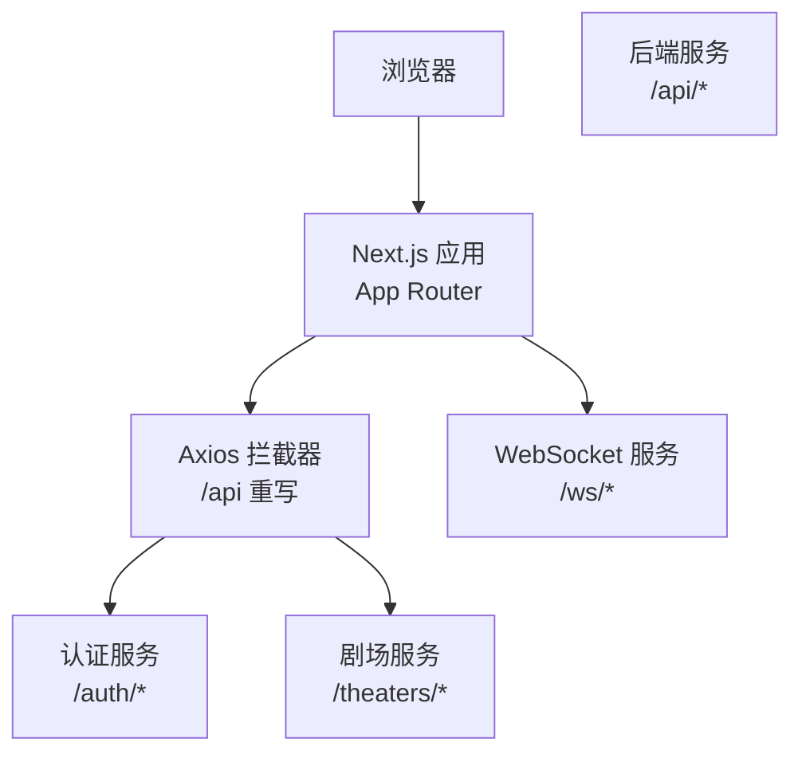
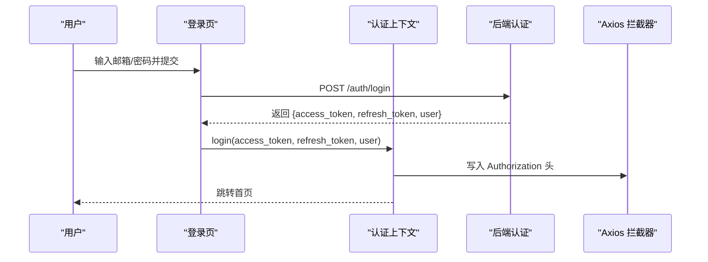
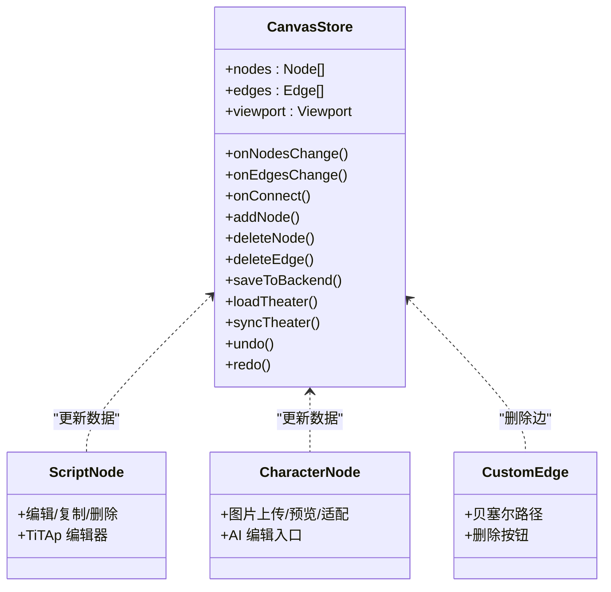
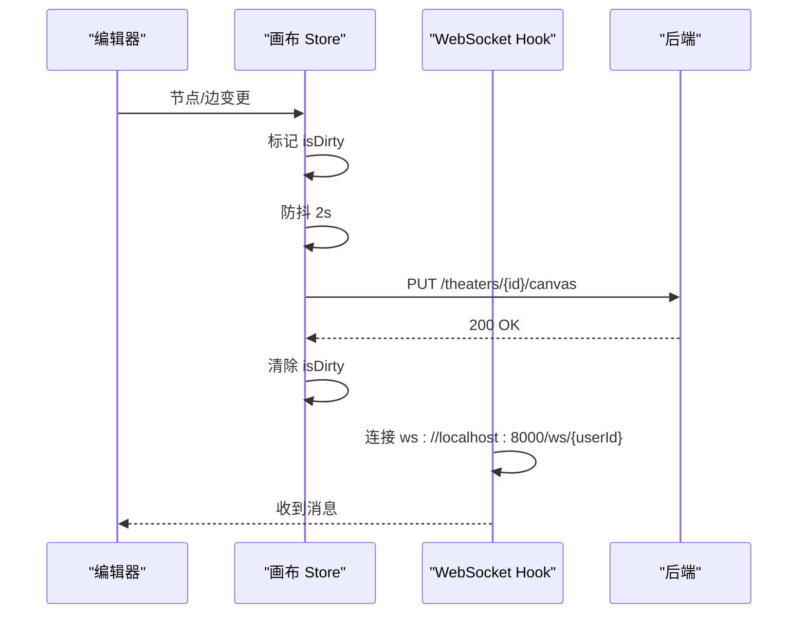
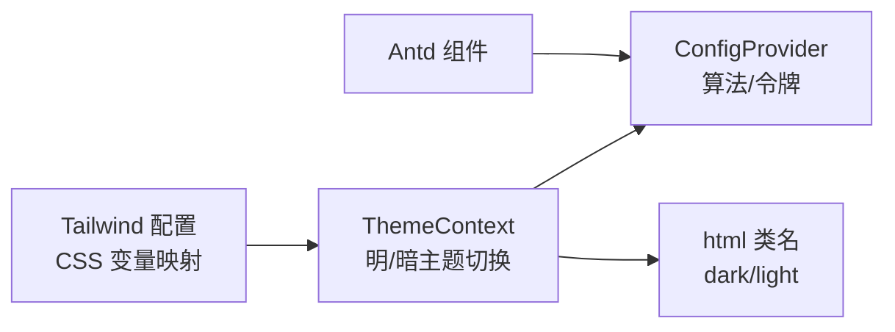
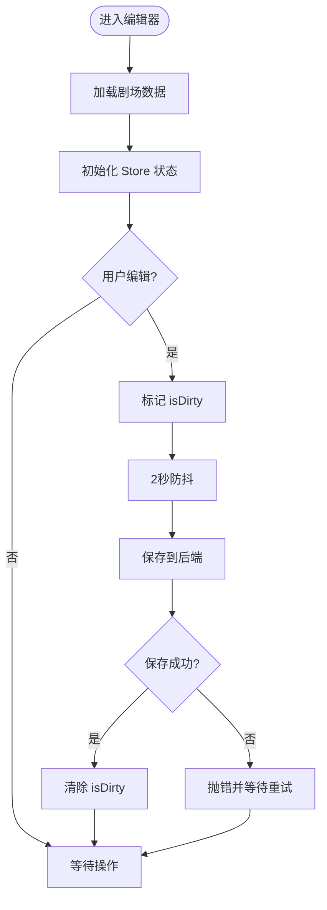
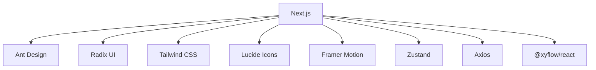

# 前端应用架构

<cite>
**本文档引用的文件**
- [frontend/package.json](file://frontend/package.json)
- [frontend/next.config.ts](file://frontend/next.config.ts)
- [frontend/src/app/layout.tsx](file://frontend/src/app/layout.tsx)
- [frontend/src/context/AuthContext.tsx](file://frontend/src/context/AuthContext.tsx)
- [frontend/src/store/useCanvasStore.ts](file://frontend/src/store/useCanvasStore.ts)
- [frontend/src/hooks/useSocket.ts](file://frontend/src/hooks/useSocket.ts)
- [frontend/src/context/ThemeContext.tsx](file://frontend/src/context/ThemeContext.tsx)
- [frontend/src/lib/theaterApi.ts](file://frontend/src/lib/theaterApi.ts)
- [frontend/src/components/canvas/CharacterNode.tsx](file://frontend/src/components/canvas/CharacterNode.tsx)
- [frontend/src/components/canvas/CustomEdge.tsx](file://frontend/src/components/canvas/CustomEdge.tsx)
- [frontend/tailwind.config.ts](file://frontend/tailwind.config.ts)
- [frontend/src/app/theater/[id]/page.tsx](file://frontend/src/app/theater/[id]/page.tsx)
- [frontend/src/components/canvas/Sidebar.tsx](file://frontend/src/components/canvas/Sidebar.tsx)
- [frontend/src/components/home/RecentTheaters.tsx](file://frontend/src/components/home/RecentTheaters.tsx)
- [frontend/src/app/login/page.tsx](file://frontend/src/app/login/page.tsx)
- [frontend/src/lib/api.ts](file://frontend/src/lib/api.ts)
- [frontend/src/components/canvas/ScriptNode.tsx](file://frontend/src/components/canvas/ScriptNode.tsx)
</cite>

## 目录
1. [引言](#引言)
2. [项目结构](#项目结构)
3. [核心组件](#核心组件)
4. [架构总览](#架构总览)
5. [详细组件分析](#详细组件分析)
6. [依赖关系分析](#依赖关系分析)
7. [性能考虑](#性能考虑)
8. [故障排除指南](#故障排除指南)
9. [结论](#结论)
10. [附录](#附录)

## 引言
本架构文档面向 Infinite Game 前端应用，基于 Next.js App Router 构建，围绕“剧场”（Theater）可视化编辑与协作展开。文档涵盖以下重点：
- Next.js 应用结构与 App Router 使用、全局布局与路由设计
- 用户认证系统：登录页面、认证状态管理、权限控制
- React Flow 画布编辑器：节点组件系统、连接线管理、画布操作
- 实时协作：WebSocket 通信、状态同步与并发控制
- UI 组件库：Ant Design 集成、自定义组件与样式系统
- 状态管理：Zustand Store 的使用与组件间数据共享
- 响应式设计与主题管理

## 项目结构
前端采用 Next.js App Router，按功能模块组织代码：
- app：页面级路由与布局
- components：可复用 UI 组件与业务组件
- context：全局上下文（认证、主题）
- hooks：自定义 Hook（Socket、窗口尺寸、TipTap 编辑器等）
- lib：API 封装、工具函数
- store：Zustand 状态管理
- styles/scss：样式变量与动画

**图表来源**
- [frontend/src/app/layout.tsx:1-42](file://frontend/src/app/layout.tsx#L1-L42)
- [frontend/src/app/theater/[id]/page.tsx](file://frontend/src/app/theater/[id]/page.tsx#L1-L484)
- [frontend/src/context/AuthContext.tsx:1-110](file://frontend/src/context/AuthContext.tsx#L1-L110)
- [frontend/src/context/ThemeContext.tsx:1-74](file://frontend/src/context/ThemeContext.tsx#L1-L74)
- [frontend/src/store/useCanvasStore.ts:1-540](file://frontend/src/store/useCanvasStore.ts#L1-L540)
- [frontend/src/components/canvas/Sidebar.tsx:1-337](file://frontend/src/components/canvas/Sidebar.tsx#L1-L337)
- [frontend/src/components/canvas/ScriptNode.tsx:1-351](file://frontend/src/components/canvas/ScriptNode.tsx#L1-L351)
- [frontend/src/components/canvas/CharacterNode.tsx:1-692](file://frontend/src/components/canvas/CharacterNode.tsx#L1-L692)
- [frontend/src/components/canvas/CustomEdge.tsx:1-92](file://frontend/src/components/canvas/CustomEdge.tsx#L1-L92)
- [frontend/src/lib/api.ts:1-84](file://frontend/src/lib/api.ts#L1-L84)
- [frontend/src/lib/theaterApi.ts:1-159](file://frontend/src/lib/theaterApi.ts#L1-L159)
- [frontend/src/hooks/useSocket.ts:1-43](file://frontend/src/hooks/useSocket.ts#L1-L43)
- [frontend/tailwind.config.ts:1-64](file://frontend/tailwind.config.ts#L1-L64)

**章节来源**
- [frontend/package.json:1-92](file://frontend/package.json#L1-L92)
- [frontend/next.config.ts:1-20](file://frontend/next.config.ts#L1-L20)
- [frontend/src/app/layout.tsx:1-42](file://frontend/src/app/layout.tsx#L1-L42)

## 核心组件
- App Router 与全局布局：根布局负责字体、Ant Design 注册、认证与主题 Provider 包裹，确保全局样式与上下文可用。
- 认证系统：基于 localStorage 的令牌持久化，自动重定向未认证用户到登录页；提供登录/注册表单与刷新令牌拦截器。
- 画布编辑器：基于 @xyflow/react，支持多种节点类型（文本、图片、视频、故事板），自定义边与交互（拖拽、缩放、吸附、自动布局）。
- 状态管理：Zustand Store 管理画布节点、边、视口、历史快照、脏标记与后端同步；支持本地存储合并与去重。
- 实时协作：WebSocket Hook 连接后端 WS 服务，接收消息并维护连接状态；编辑器侧具备自动保存与同步逻辑。
- UI 组件库：Ant Design 与 Radix UI 组件结合，Tailwind CSS 提供原子化样式与暗色模式支持。

**章节来源**
- [frontend/src/app/layout.tsx:1-42](file://frontend/src/app/layout.tsx#L1-L42)
- [frontend/src/context/AuthContext.tsx:1-110](file://frontend/src/context/AuthContext.tsx#L1-L110)
- [frontend/src/store/useCanvasStore.ts:1-540](file://frontend/src/store/useCanvasStore.ts#L1-L540)
- [frontend/src/hooks/useSocket.ts:1-43](file://frontend/src/hooks/useSocket.ts#L1-L43)
- [frontend/tailwind.config.ts:1-64](file://frontend/tailwind.config.ts#L1-L64)

## 架构总览
下图展示前端与后端的关键交互路径：Next.js 通过 /api 重写转发至后端服务；认证通过 Axios 拦截器注入 Authorization；画布状态通过 Theater API 同步至后端；WebSocket 用于实时消息。

**图表来源**
- [frontend/next.config.ts:9-16](file://frontend/next.config.ts#L9-L16)
- [frontend/src/lib/api.ts:1-84](file://frontend/src/lib/api.ts#L1-L84)
- [frontend/src/lib/theaterApi.ts:107-159](file://frontend/src/lib/theaterApi.ts#L107-L159)
- [frontend/src/hooks/useSocket.ts:1-43](file://frontend/src/hooks/useSocket.ts#L1-L43)

## 详细组件分析

### 认证系统
- 上下文职责：维护用户信息、登录/登出、更新余额；监听路由变化进行未认证跳转。
- 登录流程：登录页提交邮箱/密码，成功后写入访问令牌与用户信息，跳转首页。
- 刷新令牌：401 时排队后续请求，使用刷新令牌替换访问令牌并重试。
- 权限控制：公共路由（如登录）无需认证；受保护路由在未认证时重定向。

**图表来源**
- [frontend/src/app/login/page.tsx:12-50](file://frontend/src/app/login/page.tsx#L12-L50)
- [frontend/src/context/AuthContext.tsx:75-94](file://frontend/src/context/AuthContext.tsx#L75-L94)
- [frontend/src/lib/api.ts:9-17](file://frontend/src/lib/api.ts#L9-L17)

**章节来源**
- [frontend/src/app/login/page.tsx:1-194](file://frontend/src/app/login/page.tsx#L1-L194)
- [frontend/src/context/AuthContext.tsx:1-110](file://frontend/src/context/AuthContext.tsx#L1-L110)
- [frontend/src/lib/api.ts:1-84](file://frontend/src/lib/api.ts#L1-L84)

### 画布编辑器（React Flow）
- 节点类型：文本、图片、视频、故事板；每种节点封装独立 UI 与交互。
- 自定义边：贝塞尔曲线路径、悬停增宽、删除按钮。
- 交互能力：拖拽、缩放、吸附网格与对齐线、自动布局、键盘快捷键（保存、撤销/重做）。
- 数据流：节点/边变更触发 Store 更新；脏标记触发防抖自动保存；加载/同步剧场数据。

**图表来源**
- [frontend/src/store/useCanvasStore.ts:67-114](file://frontend/src/store/useCanvasStore.ts#L67-L114)
- [frontend/src/components/canvas/ScriptNode.tsx:11-351](file://frontend/src/components/canvas/ScriptNode.tsx#L11-L351)
- [frontend/src/components/canvas/CharacterNode.tsx:13-692](file://frontend/src/components/canvas/CharacterNode.tsx#L13-L692)
- [frontend/src/components/canvas/CustomEdge.tsx:5-92](file://frontend/src/components/canvas/CustomEdge.tsx#L5-L92)

**章节来源**
- [frontend/src/app/theater/[id]/page.tsx](file://frontend/src/app/theater/[id]/page.tsx#L37-L484)
- [frontend/src/store/useCanvasStore.ts:1-540](file://frontend/src/store/useCanvasStore.ts#L1-L540)
- [frontend/src/components/canvas/ScriptNode.tsx:1-351](file://frontend/src/components/canvas/ScriptNode.tsx#L1-L351)
- [frontend/src/components/canvas/CharacterNode.tsx:1-692](file://frontend/src/components/canvas/CharacterNode.tsx#L1-L692)
- [frontend/src/components/canvas/CustomEdge.tsx:1-92](file://frontend/src/components/canvas/CustomEdge.tsx#L1-L92)

### 实时协作与并发控制
- WebSocket 连接：根据 userId 建立连接，维护消息队列与连接状态。
- 并发控制：画布 Store 在保存时设置 isSaving 标记，避免重复提交；编辑器侧 2 秒防抖自动保存。
- 状态同步：后端剧场详情接口返回节点/边/视口，前端进行差异合并，保留用户当前视图。

**图表来源**
- [frontend/src/app/theater/[id]/page.tsx](file://frontend/src/app/theater/[id]/page.tsx#L93-L101)
- [frontend/src/store/useCanvasStore.ts:478-505](file://frontend/src/store/useCanvasStore.ts#L478-L505)
- [frontend/src/hooks/useSocket.ts:3-42](file://frontend/src/hooks/useSocket.ts#L3-L42)

**章节来源**
- [frontend/src/hooks/useSocket.ts:1-43](file://frontend/src/hooks/useSocket.ts#L1-L43)
- [frontend/src/store/useCanvasStore.ts:378-505](file://frontend/src/store/useCanvasStore.ts#L378-L505)

### UI 组件库与样式系统
- Ant Design 集成：通过 AntdRegistry 注入，全局 ConfigProvider 配置主题算法与语言。
- 主题管理：支持明/暗主题切换，持久化到 localStorage，并通过类名切换实现。
- Tailwind：CSS 变量映射到设计令牌，暗色模式通过 class 选择器生效。
- 自定义组件：ScriptNode/CharacterNode/CustomEdge 等复用 Antd/Radix 组件，结合 Tailwind 实现统一风格。

**图表来源**
- [frontend/src/context/ThemeContext.tsx:16-64](file://frontend/src/context/ThemeContext.tsx#L16-L64)
- [frontend/tailwind.config.ts:10-61](file://frontend/tailwind.config.ts#L10-L61)
- [frontend/src/app/layout.tsx:3-37](file://frontend/src/app/layout.tsx#L3-L37)

**章节来源**
- [frontend/src/context/ThemeContext.tsx:1-74](file://frontend/src/context/ThemeContext.tsx#L1-L74)
- [frontend/tailwind.config.ts:1-64](file://frontend/tailwind.config.ts#L1-L64)
- [frontend/src/app/layout.tsx:1-42](file://frontend/src/app/layout.tsx#L1-L42)

### 状态管理策略（Zustand）
- Store 设计：集中管理 nodes/edges/viewport、剧院元数据、脏标记、历史快照、吸附设置。
- 持久化：localStorage 存储节点、边、视口、剧院 ID/标题，启动时合并并去重。
- 并发与一致性：保存前更新标题，保存后同步后端返回的节点计数等字段；同步时仅在差异存在时更新。
- 历史回退：固定长度历史栈，支持撤销/重做。

**图表来源**
- [frontend/src/store/useCanvasStore.ts:388-505](file://frontend/src/store/useCanvasStore.ts#L388-L505)

**章节来源**
- [frontend/src/store/useCanvasStore.ts:1-540](file://frontend/src/store/useCanvasStore.ts#L1-L540)

### 响应式设计与主题管理
- 响应式：Sidebar 固定定位，内容区域自适应；移动端通过手势与键盘快捷键提升可用性。
- 主题：暗色模式默认，支持手动切换与系统偏好检测；Tailwind 变量与 Antd 算法联动。

**章节来源**
- [frontend/src/components/canvas/Sidebar.tsx:1-337](file://frontend/src/components/canvas/Sidebar.tsx#L1-L337)
- [frontend/src/context/ThemeContext.tsx:16-64](file://frontend/src/context/ThemeContext.tsx#L16-L64)

## 依赖关系分析
- 外部依赖：Next.js、@xyflow/react、Ant Design、Radix UI、Axios、Zustand、Tailwind、Lucide Icons、Framer Motion。
- 内部依赖：API 封装依赖 Axios 拦截器；画布 Store 依赖 Theater API；编辑器依赖 TiTAp 编辑器与自定义节点组件。
- 耦合度：上下文与 Store 解耦页面逻辑；组件通过 Hook 与 Store 交互，降低耦合。

**图表来源**
- [frontend/package.json:13-67](file://frontend/package.json#L13-L67)

**章节来源**
- [frontend/package.json:1-92](file://frontend/package.json#L1-L92)

## 性能考虑
- 防抖保存：编辑器 2 秒防抖保存，减少后端压力。
- 本地持久化：Store 仅持久化必要字段，启动时合并并去重，避免重复节点。
- 懒加载与虚拟滚动：资产面板使用懒加载与滚动条，减少初始渲染开销。
- 动画与过渡：Framer Motion 仅在必要场景使用，避免过度动画影响性能。
- 图片处理：CharacterNode 对图片尺寸进行合理限制与缩放，避免超大图片导致内存问题。

## 故障排除指南
- 登录失败：检查邮箱/密码格式与后端返回错误；查看消息提示与网络面板。
- 401 未授权：确认刷新令牌是否有效；拦截器会自动处理刷新与重试。
- 画布保存失败：检查 isSaving 标记；确保网络稳定；查看后端返回错误。
- WebSocket 断连：确认 userId 是否正确；检查后端 WS 服务状态；重连逻辑会自动尝试。
- 主题切换无效：确认 html 类名是否正确切换；Tailwind 配置是否启用暗色模式。

**章节来源**
- [frontend/src/lib/api.ts:31-81](file://frontend/src/lib/api.ts#L31-L81)
- [frontend/src/hooks/useSocket.ts:8-33](file://frontend/src/hooks/useSocket.ts#L8-L33)
- [frontend/src/context/ThemeContext.tsx:31-40](file://frontend/src/context/ThemeContext.tsx#L31-L40)

## 结论
该前端应用以 Next.js App Router 为基础，结合 Ant Design 与 Tailwind 实现一致的 UI 体验；通过 Zustand 管理复杂画布状态，借助 React Flow 提供强大的可视化编辑能力；认证与 API 拦截器保障安全与易用；WebSocket 与防抖保存实现基础的实时协作与数据一致性。整体架构清晰、模块解耦良好，便于扩展与维护。

## 附录
- 页面路由概览
  - /login：登录/注册表单
  - /theater/new：新建剧场
  - /theater/[id]：剧场编辑器
  - /：首页（最近剧场列表）

- 关键 API
  - /api/auth/login：登录
  - /api/auth/register：注册
  - /api/theaters：剧场列表/创建
  - /api/theaters/{id}：剧场详情
  - /api/theaters/{id}/canvas：画布保存
  - /api/media/upload：媒体上传
  - /ws/{userId}：WebSocket 协作

**章节来源**
- [frontend/src/app/login/page.tsx:1-194](file://frontend/src/app/login/page.tsx#L1-L194)
- [frontend/src/app/theater/[id]/page.tsx](file://frontend/src/app/theater/[id]/page.tsx#L1-L484)
- [frontend/src/lib/theaterApi.ts:107-159](file://frontend/src/lib/theaterApi.ts#L107-L159)
- [frontend/src/hooks/useSocket.ts:3-42](file://frontend/src/hooks/useSocket.ts#L3-L42)