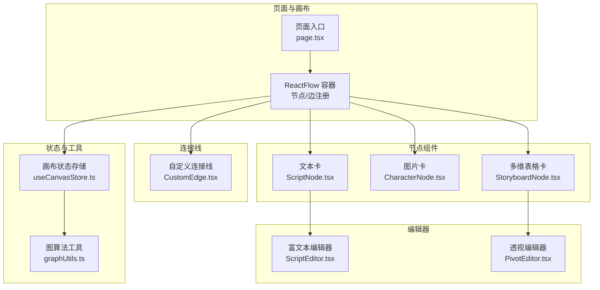
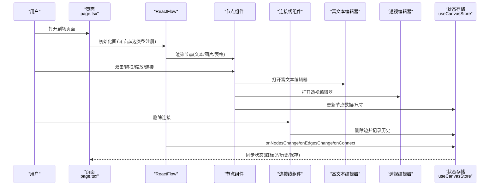
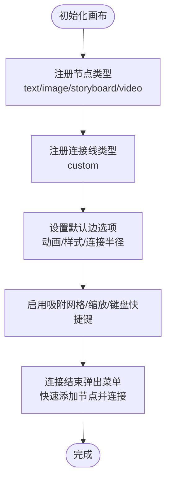
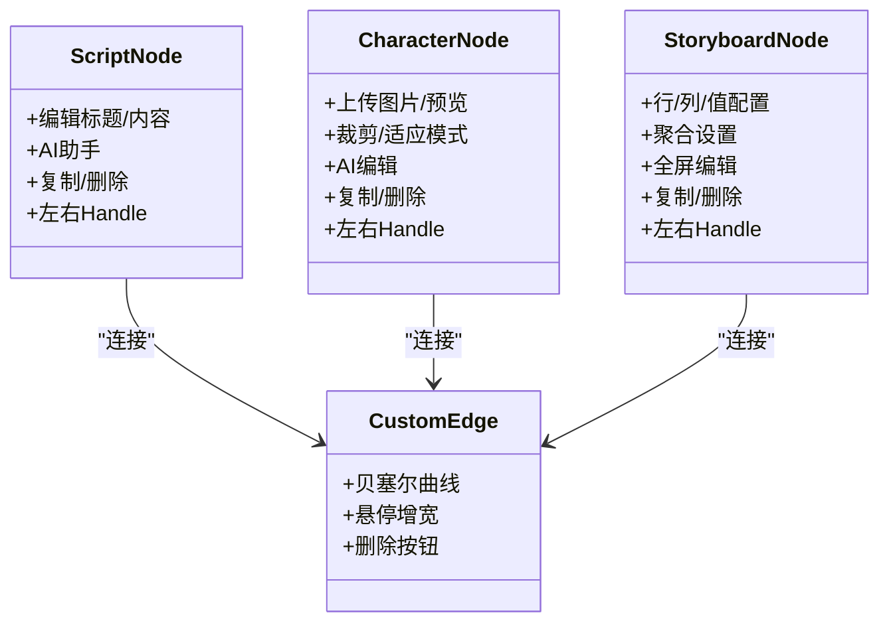
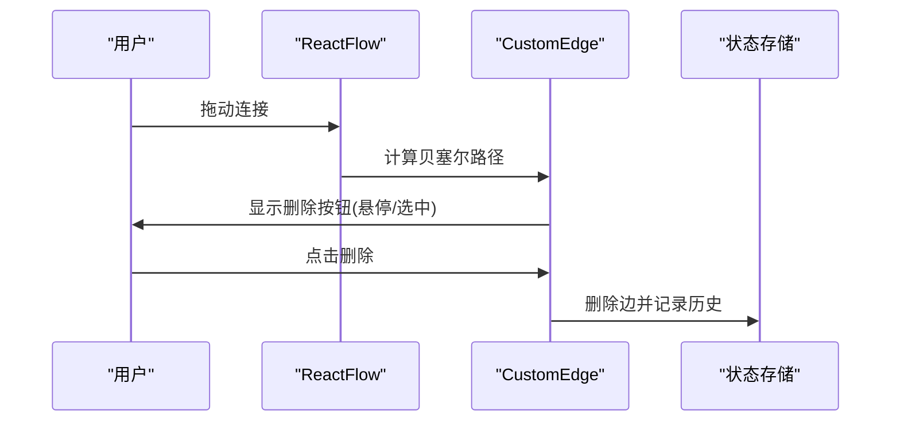
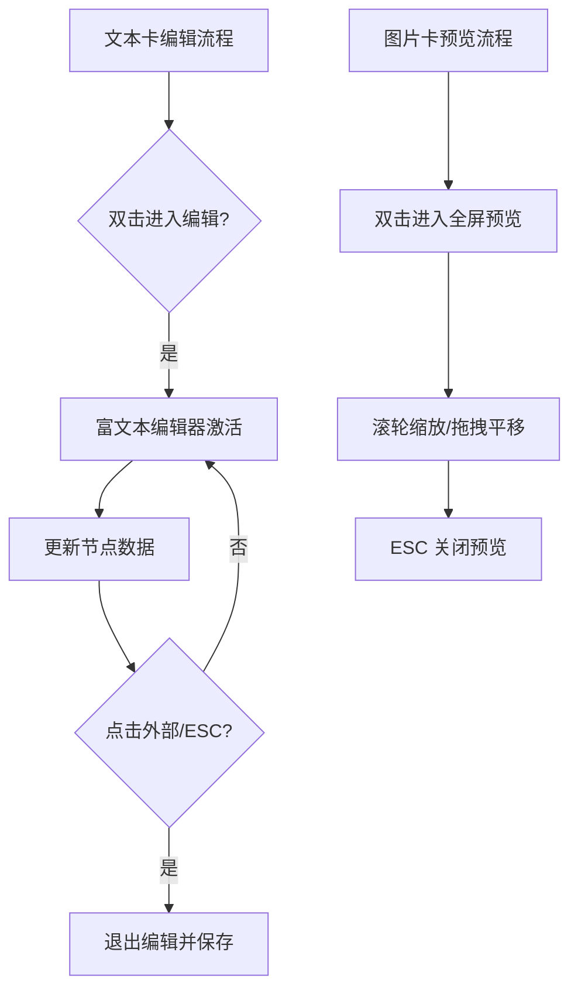
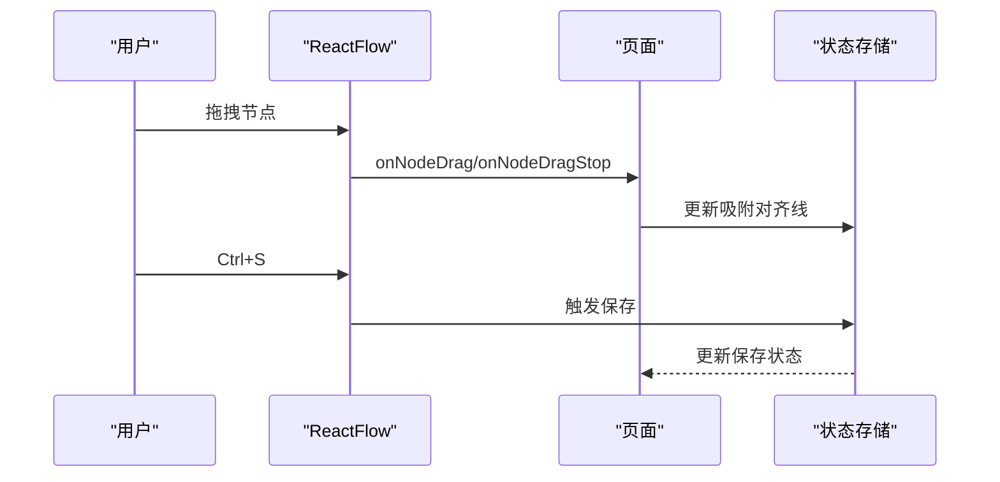
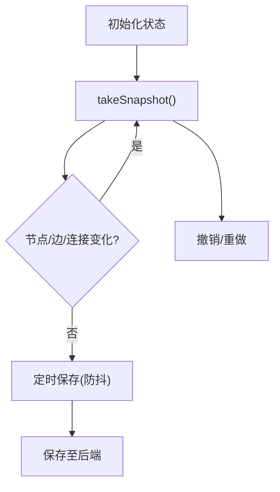
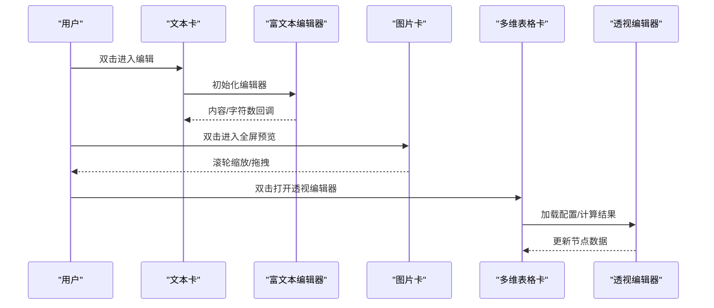
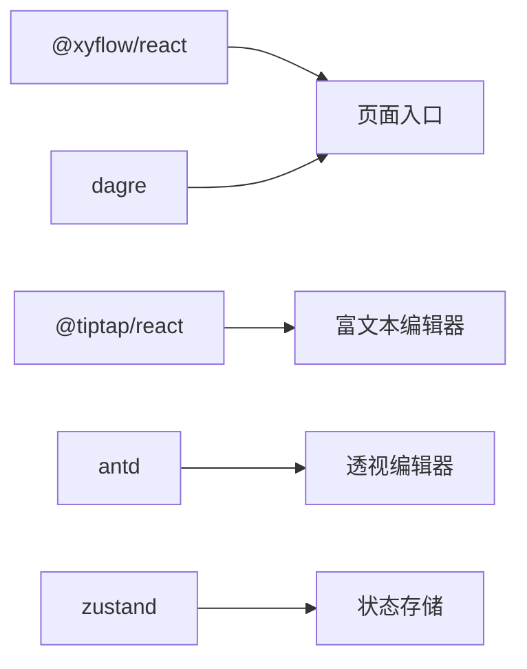

# 剧场画布编辑器

<cite>
**本文档引用的文件**
- [TheaterCanvas.tsx](file://frontend/src/components/TheaterCanvas.tsx)
- [page.tsx](file://frontend/src/app/theater/[id]/page.tsx)
- [CharacterNode.tsx](file://frontend/src/components/canvas/CharacterNode.tsx)
- [ScriptNode.tsx](file://frontend/src/components/canvas/ScriptNode.tsx)
- [StoryboardNode.tsx](file://frontend/src/components/canvas/StoryboardNode.tsx)
- [CustomEdge.tsx](file://frontend/src/components/canvas/CustomEdge.tsx)
- [ScriptEditor.tsx](file://frontend/src/components/canvas/ScriptEditor.tsx)
- [useCanvasStore.ts](file://frontend/src/store/useCanvasStore.ts)
- [graphUtils.ts](file://frontend/src/lib/graphUtils.ts)
- [PivotEditor.tsx](file://frontend/src/components/canvas/pivot/PivotEditor.tsx)
- [package.json](file://frontend/package.json)
</cite>

## 目录
1. [简介](#简介)
2. [项目结构](#项目结构)
3. [核心组件](#核心组件)
4. [架构总览](#架构总览)
5. [详细组件分析](#详细组件分析)
6. [依赖关系分析](#依赖关系分析)
7. [性能考虑](#性能考虑)
8. [故障排查指南](#故障排查指南)
9. [结论](#结论)
10. [附录](#附录)

## 简介
本项目为 Infinite Game 剧场画布编辑器，基于 React Flow 构建可视化叙事与分镜工作流。系统提供多种节点类型（文本卡、图片卡、多维表格卡等）、自定义连接线、节点内联编辑器、历史快照与撤销/重做、自动布局与吸附对齐、以及与后端的同步与持久化能力。本文档面向开发者与产品人员，系统性阐述 React Flow 集成、节点组件体系、画布操作、状态管理、节点编辑与性能优化策略。

## 项目结构
前端采用 Next.js 应用，画布相关代码集中在以下目录：
- 页面入口与画布容器：[page.tsx](file://frontend/src/app/theater/[id]/page.tsx)
- 节点组件：[CharacterNode.tsx](file://frontend/src/components/canvas/CharacterNode.tsx)、[ScriptNode.tsx](file://frontend/src/components/canvas/ScriptNode.tsx)、[StoryboardNode.tsx](file://frontend/src/components/canvas/StoryboardNode.tsx)
- 连接线组件：[CustomEdge.tsx](file://frontend/src/components/canvas/CustomEdge.tsx)
- 节点内联编辑器：[ScriptEditor.tsx](file://frontend/src/components/canvas/ScriptEditor.tsx)
- 状态管理：[useCanvasStore.ts](file://frontend/src/store/useCanvasStore.ts)
- 图算法工具：[graphUtils.ts](file://frontend/src/lib/graphUtils.ts)
- 多维表格编辑器：[PivotEditor.tsx](file://frontend/src/components/canvas/pivot/PivotEditor.tsx)
- 依赖声明：[package.json](file://frontend/package.json)

图表来源
- [page.tsx:37-46](file://frontend/src/app/theater/[id]/page.tsx#L37-L46)
- [ScriptNode.tsx:11-351](file://frontend/src/components/canvas/ScriptNode.tsx#L11-L351)
- [CharacterNode.tsx:13-692](file://frontend/src/components/canvas/CharacterNode.tsx#L13-L692)
- [StoryboardNode.tsx:11-318](file://frontend/src/components/canvas/StoryboardNode.tsx#L11-L318)
- [CustomEdge.tsx:5-92](file://frontend/src/components/canvas/CustomEdge.tsx#L5-L92)
- [ScriptEditor.tsx:117-280](file://frontend/src/components/canvas/ScriptEditor.tsx#L117-L280)
- [PivotEditor.tsx:22-229](file://frontend/src/components/canvas/pivot/PivotEditor.tsx#L22-L229)
- [useCanvasStore.ts:185-540](file://frontend/src/store/useCanvasStore.ts#L185-L540)
- [graphUtils.ts:4-39](file://frontend/src/lib/graphUtils.ts#L4-L39)

章节来源
- [page.tsx:37-46](file://frontend/src/app/theater/[id]/page.tsx#L37-L46)
- [package.json:45-45](file://frontend/package.json#L45-L45)

## 核心组件
- React Flow 容器与配置：在页面中注册节点类型与连接线类型，设置默认边选项、吸附网格、缩放范围、键盘快捷键与自动布局触发。
- 节点组件体系：文本卡、图片卡、多维表格卡，均通过 Handle 提供左右连接点，并内置编辑与预览能力。
- 自定义连接线：贝塞尔曲线路径、悬停增宽区域、可删除按钮与标签渲染。
- 状态管理：统一存储节点、边、视口、脏标记、历史快照、后端同步状态；提供撤销/重做与本地持久化。
- 图算法：检测新增边是否导致环路，保障有向无环图约束。
- 富文本编辑器：基于 Tiptap，提供标题、列表、强调、链接、高亮、对齐等工具条与字符计数。
- 多维表格编辑器：拖拽字段到行/列/值区域，配置聚合方式，实时计算透视结果。

章节来源
- [page.tsx:54-484](file://frontend/src/app/theater/[id]/page.tsx#L54-L484)
- [ScriptNode.tsx:11-351](file://frontend/src/components/canvas/ScriptNode.tsx#L11-L351)
- [CharacterNode.tsx:13-692](file://frontend/src/components/canvas/CharacterNode.tsx#L13-L692)
- [StoryboardNode.tsx:11-318](file://frontend/src/components/canvas/StoryboardNode.tsx#L11-L318)
- [CustomEdge.tsx:5-92](file://frontend/src/components/canvas/CustomEdge.tsx#L5-L92)
- [ScriptEditor.tsx:117-280](file://frontend/src/components/canvas/ScriptEditor.tsx#L117-L280)
- [PivotEditor.tsx:22-229](file://frontend/src/components/canvas/pivot/PivotEditor.tsx#L22-L229)
- [useCanvasStore.ts:185-540](file://frontend/src/store/useCanvasStore.ts#L185-L540)
- [graphUtils.ts:4-39](file://frontend/src/lib/graphUtils.ts#L4-L39)

## 架构总览
下图展示从页面到节点、连接线、编辑器与状态管理的整体交互：

图表来源
- [page.tsx:334-444](file://frontend/src/app/theater/[id]/page.tsx#L334-L444)
- [ScriptNode.tsx:11-351](file://frontend/src/components/canvas/ScriptNode.tsx#L11-L351)
- [CharacterNode.tsx:13-692](file://frontend/src/components/canvas/CharacterNode.tsx#L13-L692)
- [StoryboardNode.tsx:11-318](file://frontend/src/components/canvas/StoryboardNode.tsx#L11-L318)
- [CustomEdge.tsx:5-92](file://frontend/src/components/canvas/CustomEdge.tsx#L5-L92)
- [ScriptEditor.tsx:117-280](file://frontend/src/components/canvas/ScriptEditor.tsx#L117-L280)
- [PivotEditor.tsx:22-229](file://frontend/src/components/canvas/pivot/PivotEditor.tsx#L22-L229)
- [useCanvasStore.ts:209-254](file://frontend/src/store/useCanvasStore.ts#L209-L254)

## 详细组件分析

### React Flow 集成与配置
- 节点类型注册：文本卡、图片卡、多维表格卡、视频卡。
- 连接线类型注册：自定义贝塞尔曲线连接线。
- 默认边选项：类型为自定义、动画开启、线条宽度与颜色。
- 交互行为：拖拽、缩放、吸附网格、最小/最大缩放、键盘快捷键、自动布局触发。
- 快捷菜单：右键连接结束时弹出“创建连接的节点”菜单，支持从指定 Handle 连接并自动建立双向关系。

图表来源
- [page.tsx:37-46](file://frontend/src/app/theater/[id]/page.tsx#L37-L46)
- [page.tsx:48-52](file://frontend/src/app/theater/[id]/page.tsx#L48-L52)
- [page.tsx:118-155](file://frontend/src/app/theater/[id]/page.tsx#L118-L155)
- [page.tsx:165-219](file://frontend/src/app/theater/[id]/page.tsx#L165-L219)

章节来源
- [page.tsx:37-46](file://frontend/src/app/theater/[id]/page.tsx#L37-L46)
- [page.tsx:48-52](file://frontend/src/app/theater/[id]/page.tsx#L48-L52)
- [page.tsx:118-155](file://frontend/src/app/theater/[id]/page.tsx#L118-L155)
- [page.tsx:165-219](file://frontend/src/app/theater/[id]/page.tsx#L165-L219)

### 节点类型定义与连接点
- 文本卡：标题与富文本内容，支持编辑完成、AI 助手、复制、删除；左右 Handle 支持连接。
- 图片卡：名称、图片上传与预览、裁剪/适应模式切换、AI 编辑、复制、删除；左右 Handle 支持连接。
- 多维表格卡：行/列/值区域配置，聚合方式设置，预览与全屏编辑；左右 Handle 支持连接。

图表来源
- [ScriptNode.tsx:11-351](file://frontend/src/components/canvas/ScriptNode.tsx#L11-L351)
- [CharacterNode.tsx:13-692](file://frontend/src/components/canvas/CharacterNode.tsx#L13-L692)
- [StoryboardNode.tsx:11-318](file://frontend/src/components/canvas/StoryboardNode.tsx#L11-L318)
- [CustomEdge.tsx:5-92](file://frontend/src/components/canvas/CustomEdge.tsx#L5-L92)

章节来源
- [ScriptNode.tsx:11-351](file://frontend/src/components/canvas/ScriptNode.tsx#L11-L351)
- [CharacterNode.tsx:13-692](file://frontend/src/components/canvas/CharacterNode.tsx#L13-L692)
- [StoryboardNode.tsx:11-318](file://frontend/src/components/canvas/StoryboardNode.tsx#L11-L318)
- [CustomEdge.tsx:5-92](file://frontend/src/components/canvas/CustomEdge.tsx#L5-L92)

### 连接线渲染与交互
- 使用贝塞尔曲线绘制路径，根据 Handle 位置动态计算。
- 悬停与选中状态下调整线宽与颜色，增强视觉反馈。
- 增加不可见的宽轨道以提升鼠标命中率。
- 在连接线上方渲染可交互的删除按钮，支持点击/触摸删除。

图表来源
- [CustomEdge.tsx:17-92](file://frontend/src/components/canvas/CustomEdge.tsx#L17-L92)
- [useCanvasStore.ts:276-288](file://frontend/src/store/useCanvasStore.ts#L276-L288)

章节来源
- [CustomEdge.tsx:17-92](file://frontend/src/components/canvas/CustomEdge.tsx#L17-L92)
- [useCanvasStore.ts:276-288](file://frontend/src/store/useCanvasStore.ts#L276-L288)

### 节点组件系统与交互逻辑
- 文本卡：双击进入编辑模式，点击外部或 ESC 退出；字数统计与富文本工具条；支持复制/删除。
- 图片卡：双击图片卡进入全屏预览，滚轮缩放、拖拽平移；支持裁剪/适应模式切换；上传校验与进度反馈；AI 编辑入口。
- 多维表格卡：双击打开透视编辑器，拖拽字段到行/列/值区域，配置聚合方式；无数据时引导提示。

图表来源
- [ScriptNode.tsx:17-111](file://frontend/src/components/canvas/ScriptNode.tsx#L17-L111)
- [CharacterNode.tsx:244-310](file://frontend/src/components/canvas/CharacterNode.tsx#L244-L310)
- [StoryboardNode.tsx:17-50](file://frontend/src/components/canvas/StoryboardNode.tsx#L17-L50)

章节来源
- [ScriptNode.tsx:17-111](file://frontend/src/components/canvas/ScriptNode.tsx#L17-L111)
- [CharacterNode.tsx:244-310](file://frontend/src/components/canvas/CharacterNode.tsx#L244-L310)
- [StoryboardNode.tsx:17-50](file://frontend/src/components/canvas/StoryboardNode.tsx#L17-L50)

### 画布操作功能
- 拖拽：节点拖拽事件链路，结合吸附对齐线显示。
- 缩放：最小/最大缩放限制，缩放控制面板。
- 选择与删除：选中节点/边后按 Delete 键删除。
- 快捷键：Ctrl+S 保存、Ctrl+Z 撤销、Ctrl+Y/Shift+Z 重做。
- 自动布局：触发后执行布局算法，适配节点尺寸。

图表来源
- [page.tsx:341-342](file://frontend/src/app/theater/[id]/page.tsx#L341-L342)
- [page.tsx:235-259](file://frontend/src/app/theater/[id]/page.tsx#L235-L259)
- [page.tsx:92-101](file://frontend/src/app/theater/[id]/page.tsx#L92-L101)

章节来源
- [page.tsx:341-342](file://frontend/src/app/theater/[id]/page.tsx#L341-L342)
- [page.tsx:235-259](file://frontend/src/app/theater/[id]/page.tsx#L235-L259)
- [page.tsx:92-101](file://frontend/src/app/theater/[id]/page.tsx#L92-L101)

### 状态管理策略
- 数据模型：节点、边、视口、剧场信息、脏标记、历史快照。
- 历史机制：最大历史深度限制，撤销/重做基于索引回溯。
- 本地持久化：使用 Zustand 持久化中间件，仅持久化必要字段。
- 后端同步：加载剧场、增量同步、保存画布、标题变更。
- 连接安全：禁止自环与环路，连接前进行环检测。

图表来源
- [useCanvasStore.ts:335-348](file://frontend/src/store/useCanvasStore.ts#L335-L348)
- [useCanvasStore.ts:350-376](file://frontend/src/store/useCanvasStore.ts#L350-L376)
- [useCanvasStore.ts:378-505](file://frontend/src/store/useCanvasStore.ts#L378-L505)
- [graphUtils.ts:4-39](file://frontend/src/lib/graphUtils.ts#L4-L39)

章节来源
- [useCanvasStore.ts:335-348](file://frontend/src/store/useCanvasStore.ts#L335-L348)
- [useCanvasStore.ts:350-376](file://frontend/src/store/useCanvasStore.ts#L350-L376)
- [useCanvasStore.ts:378-505](file://frontend/src/store/useCanvasStore.ts#L378-L505)
- [graphUtils.ts:4-39](file://frontend/src/lib/graphUtils.ts#L4-L39)

### 节点编辑功能实现
- 属性面板：节点内部悬浮操作按钮（复制、删除、AI 编辑、模式切换等）。
- 实时预览：图片卡全屏预览，支持滚轮缩放与拖拽平移。
- 数据绑定：富文本编辑器与节点数据双向绑定，字符计数实时更新。
- 多维表格：透视编辑器支持字段拖拽、聚合配置与结果预览。

图表来源
- [ScriptNode.tsx:17-111](file://frontend/src/components/canvas/ScriptNode.tsx#L17-L111)
- [ScriptEditor.tsx:117-280](file://frontend/src/components/canvas/ScriptEditor.tsx#L117-L280)
- [CharacterNode.tsx:244-310](file://frontend/src/components/canvas/CharacterNode.tsx#L244-L310)
- [StoryboardNode.tsx:17-50](file://frontend/src/components/canvas/StoryboardNode.tsx#L17-L50)
- [PivotEditor.tsx:22-229](file://frontend/src/components/canvas/pivot/PivotEditor.tsx#L22-L229)

章节来源
- [ScriptNode.tsx:17-111](file://frontend/src/components/canvas/ScriptNode.tsx#L17-L111)
- [ScriptEditor.tsx:117-280](file://frontend/src/components/canvas/ScriptEditor.tsx#L117-L280)
- [CharacterNode.tsx:244-310](file://frontend/src/components/canvas/CharacterNode.tsx#L244-L310)
- [StoryboardNode.tsx:17-50](file://frontend/src/components/canvas/StoryboardNode.tsx#L17-L50)
- [PivotEditor.tsx:22-229](file://frontend/src/components/canvas/pivot/PivotEditor.tsx#L22-L229)

## 依赖关系分析
- React Flow 版本：12.10.1，提供节点/边渲染、连接、吸附、缩放等能力。
- Tiptap 生态：提供富文本编辑、扩展与工具条组件。
- Ant Design：提供抽屉、选择器等 UI 组件，用于透视编辑器配置面板。
- Zustand：轻量状态管理，支持持久化与历史快照。
- DAGre：用于自动布局（页面中存在依赖声明）。

图表来源
- [package.json:45-45](file://frontend/package.json#L45-L45)
- [package.json:21-42](file://frontend/package.json#L21-L42)
- [package.json:46-46](file://frontend/package.json#L46-L46)
- [package.json:6-67](file://frontend/package.json#L6-L67)
- [page.tsx:89-89](file://frontend/src/app/theater/[id]/page.tsx#L89-L89)

章节来源
- [package.json:45-45](file://frontend/package.json#L45-L45)
- [package.json:21-42](file://frontend/package.json#L21-L42)
- [package.json:46-46](file://frontend/package.json#L46-L46)
- [package.json:6-67](file://frontend/package.json#L6-L67)
- [page.tsx:89-89](file://frontend/src/app/theater/[id]/page.tsx#L89-L89)

## 性能考虑
- 虚拟化与懒渲染：节点组件使用 memo 包装，避免不必要的重渲染。
- 事件节流/防抖：富文本编辑器与自动布局使用节流/防抖减少频繁更新。
- 本地持久化：仅持久化必要字段，降低存储压力。
- 历史快照上限：限制最大历史深度，防止内存膨胀。
- 大型画布优化建议：
  - 启用吸附网格与对齐线，减少手动微调成本。
  - 合理使用自动布局，避免频繁大规模重排。
  - 对图片卡尺寸进行预估与缓存，减少首次渲染开销。
  - 使用连接线删除按钮替代复杂动画，降低渲染负担。

## 故障排查指南
- 连接被阻止：若出现连接无效，检查是否触发了环路检测或自环规则。
- 保存异常：确认 isSaving 标志与 isDirty 状态，查看保存防抖逻辑是否生效。
- 富文本编辑器不更新：检查内容归一化与编辑器可编辑状态同步逻辑。
- 透视编辑器无数据：确认上游节点是否提供数据源，或使用默认字段列表。

章节来源
- [useCanvasStore.ts:244-248](file://frontend/src/store/useCanvasStore.ts#L244-L248)
- [useCanvasStore.ts:478-505](file://frontend/src/store/useCanvasStore.ts#L478-L505)
- [ScriptEditor.tsx:176-202](file://frontend/src/components/canvas/ScriptEditor.tsx#L176-L202)
- [PivotEditor.tsx:27-31](file://frontend/src/components/canvas/pivot/PivotEditor.tsx#L27-L31)

## 结论
本项目以 React Flow 为核心，构建了功能完备的剧场画布编辑器。通过模块化的节点组件、自定义连接线与富文本/透视编辑器，实现了从叙事到分镜的全流程创作体验。配合状态管理的历史快照、撤销/重做与后端同步，确保创作过程的可控与安全。未来可在自动布局算法、大画布虚拟化与协作编辑方面进一步优化。

## 附录
- 画布初始化与节点类型注册示例路径：[page.tsx:37-46](file://frontend/src/app/theater/[id]/page.tsx#L37-L46)
- 节点组件交互示例路径：[ScriptNode.tsx:17-111](file://frontend/src/components/canvas/ScriptNode.tsx#L17-L111)、[CharacterNode.tsx:126-205](file://frontend/src/components/canvas/CharacterNode.tsx#L126-L205)、[StoryboardNode.tsx:17-50](file://frontend/src/components/canvas/StoryboardNode.tsx#L17-L50)
- 连接线渲染示例路径：[CustomEdge.tsx:17-92](file://frontend/src/components/canvas/CustomEdge.tsx#L17-L92)
- 状态管理与历史快照示例路径：[useCanvasStore.ts:335-348](file://frontend/src/store/useCanvasStore.ts#L335-L348)、[useCanvasStore.ts:350-376](file://frontend/src/store/useCanvasStore.ts#L350-L376)
- 富文本编辑器示例路径：[ScriptEditor.tsx:117-280](file://frontend/src/components/canvas/ScriptEditor.tsx#L117-L280)
- 多维表格编辑器示例路径：[PivotEditor.tsx:22-229](file://frontend/src/components/canvas/pivot/PivotEditor.tsx#L22-L229)