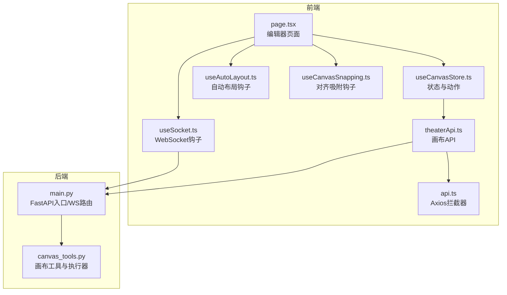
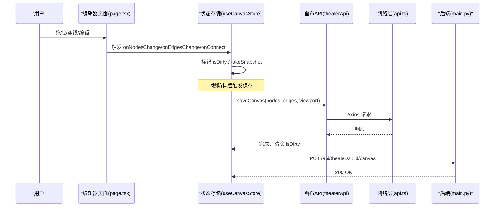
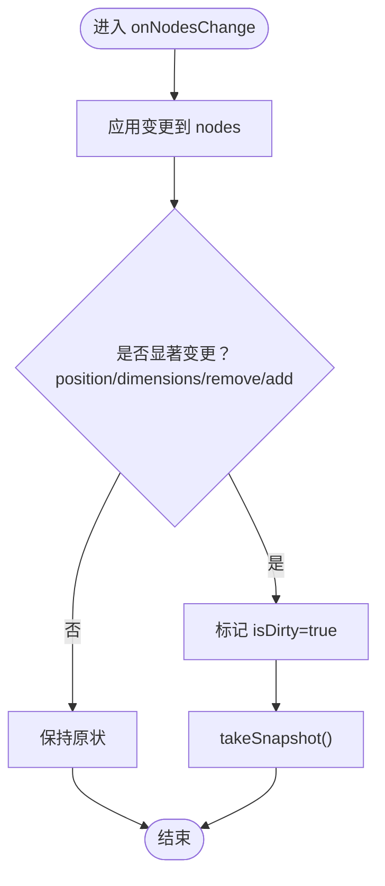
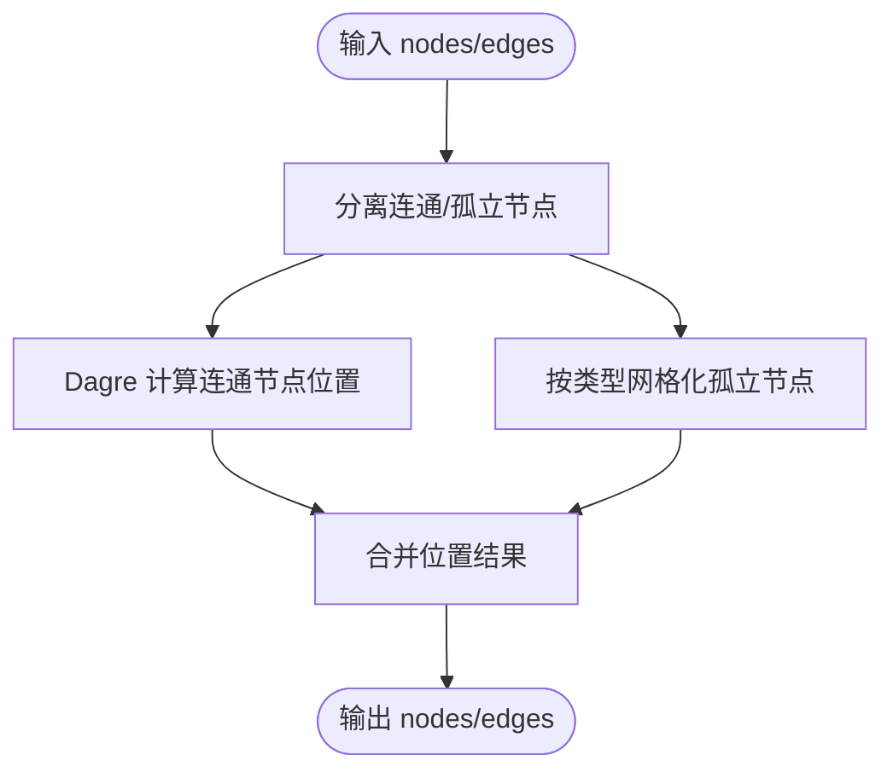
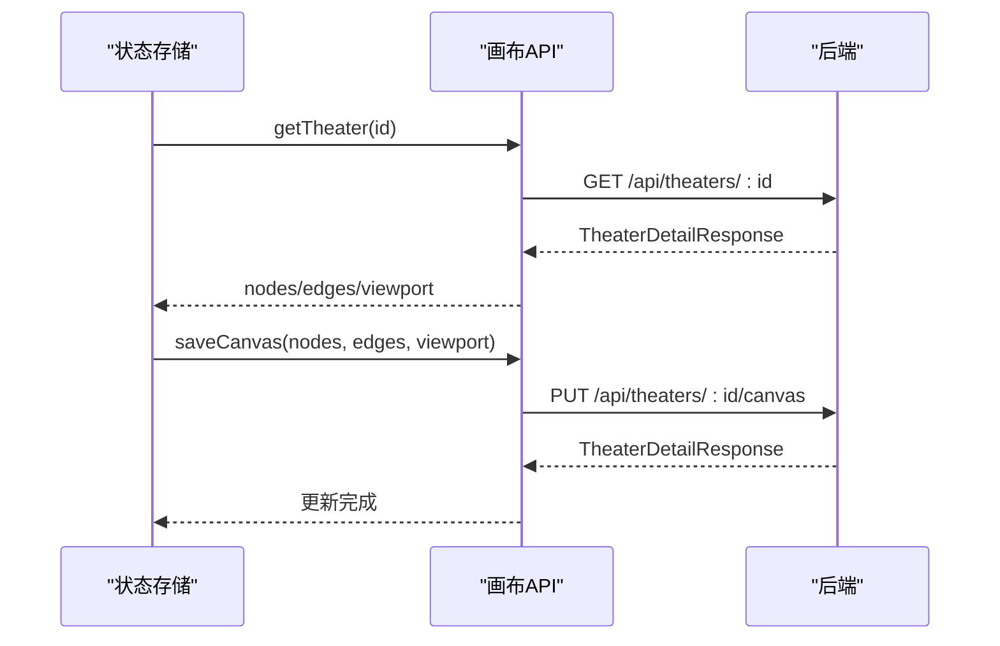
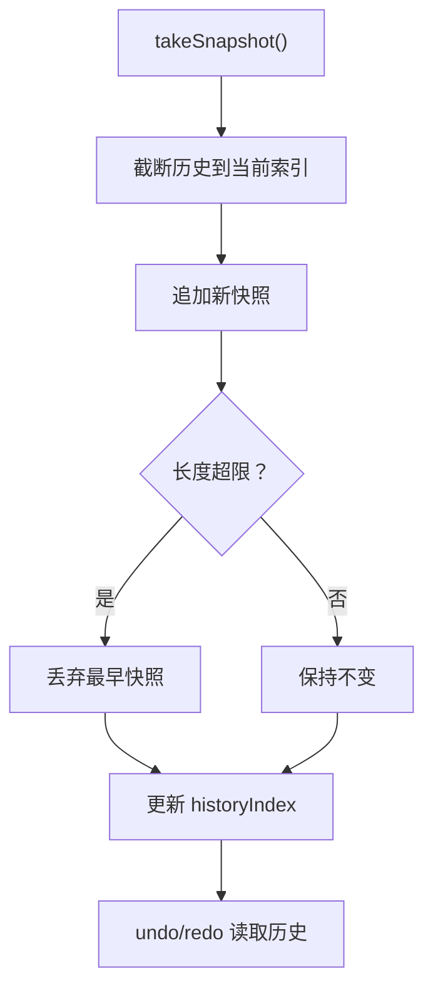
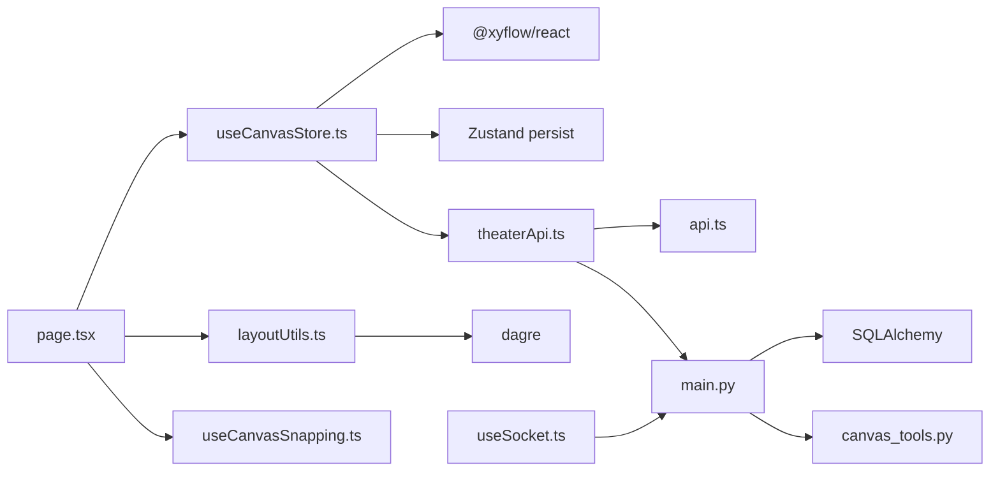

# 状态管理

<cite>
**本文引用的文件**
- [useCanvasStore.ts](file://frontend/src/store/useCanvasStore.ts)
- [layoutUtils.ts](file://frontend/src/lib/layoutUtils.ts)
- [useAutoLayout.ts](file://frontend/src/app/theater/[id]/hooks/useAutoLayout.ts)
- [useCanvasSnapping.ts](file://frontend/src/app/theater/[id]/hooks/useCanvasSnapping.ts)
- [theaterApi.ts](file://frontend/src/lib/theaterApi.ts)
- [graphUtils.ts](file://frontend/src/lib/graphUtils.ts)
- [page.tsx](file://frontend/src/app/theater/[id]/page.tsx)
- [useSocket.ts](file://frontend/src/hooks/useSocket.ts)
- [api.ts](file://frontend/src/lib/api.ts)
- [main.py](file://backend/main.py)
- [canvas_tools.py](file://backend/services/canvas_tools.py)
- [useCanvasStore.test.ts](file://frontend/src/store/__tests__/useCanvasStore.test.ts)
</cite>

## 目录
1. [简介](#简介)
2. [项目结构](#项目结构)
3. [核心组件](#核心组件)
4. [架构总览](#架构总览)
5. [详细组件分析](#详细组件分析)
6. [依赖关系分析](#依赖关系分析)
7. [性能考量](#性能考量)
8. [故障排查指南](#故障排查指南)
9. [结论](#结论)
10. [附录](#附录)

## 简介
本文件系统性梳理“画布状态管理系统”的设计与实现，覆盖以下主题：
- useCanvasStore 状态存储的设计：状态结构、动作定义、副作用与持久化
- 画布数据持久化策略：本地存储、服务器同步与冲突合并
- 自动布局算法：节点位置计算、隔离节点网格布局、避免重叠与美化
- 实时协作状态同步机制：WebSocket 通信、状态合并与并发控制
- 快照、版本管理与回滚：历史栈、撤销/重做与快照策略
- 性能优化：状态分片、懒加载与内存管理

## 项目结构
前端采用 Zustand 管理画布状态，结合 @xyflow/react 渲染画布；后端通过 FastAPI 提供画布数据接口与 WebSocket 协议入口。自动布局使用 Dagre 计算拓扑布局，辅助以网格化隔离节点排布。

图表来源
- [useCanvasStore.ts:185-540](file://frontend/src/store/useCanvasStore.ts#L185-L540)
- [page.tsx:54-484](file://frontend/src/app/theater/[id]/page.tsx#L54-L484)
- [useAutoLayout.ts:1-50](file://frontend/src/app/theater/[id]/hooks/useAutoLayout.ts#L1-L50)
- [useCanvasSnapping.ts:1-98](file://frontend/src/app/theater/[id]/hooks/useCanvasSnapping.ts#L1-L98)
- [theaterApi.ts:107-159](file://frontend/src/lib/theaterApi.ts#L107-L159)
- [api.ts:1-84](file://frontend/src/lib/api.ts#L1-L84)
- [useSocket.ts:1-43](file://frontend/src/hooks/useSocket.ts#L1-L43)
- [main.py:160-171](file://backend/main.py#L160-L171)
- [canvas_tools.py:537-590](file://backend/services/canvas_tools.py#L537-L590)

章节来源
- [useCanvasStore.ts:185-540](file://frontend/src/store/useCanvasStore.ts#L185-L540)
- [page.tsx:54-484](file://frontend/src/app/theater/[id]/page.tsx#L54-L484)

## 核心组件
- 状态存储 useCanvasStore
  - 职责：集中管理 nodes、edges、viewport、剧院元数据、脏标记、历史栈、撤销/重做、本地持久化、后端同步
  - 关键动作：节点变更、边变更、连接、增删改查、视口设置、快照、撤销/重做、加载/保存剧院
  - 持久化：localStorage + Zustand persist 中间件，支持部分序列化与合并策略
- 自动布局 getLayoutedElements
  - 基于 Dagre 的拓扑布局，将孤立节点按类型网格化排布，避免重叠并提升美观度
- 对齐吸附 useCanvasSnapping
  - 基于边缘对齐阈值的吸附线提示与位置修正
- 后端同步 theaterApi
  - 提供剧院与画布数据的读写接口，配合 store 的 save/load/sync 动作
- WebSocket useSocket
  - 提供基础 WS 连接与消息收发能力，为后续协作扩展预留

章节来源
- [useCanvasStore.ts:67-114](file://frontend/src/store/useCanvasStore.ts#L67-L114)
- [useCanvasStore.ts:185-540](file://frontend/src/store/useCanvasStore.ts#L185-L540)
- [layoutUtils.ts:16-127](file://frontend/src/lib/layoutUtils.ts#L16-L127)
- [useCanvasSnapping.ts:1-98](file://frontend/src/app/theater/[id]/hooks/useCanvasSnapping.ts#L1-L98)
- [theaterApi.ts:107-159](file://frontend/src/lib/theaterApi.ts#L107-L159)
- [useSocket.ts:1-43](file://frontend/src/hooks/useSocket.ts#L1-L43)

## 架构总览
下图展示从用户操作到状态持久化与后端同步的关键流程。

图表来源
- [page.tsx:92-101](file://frontend/src/app/theater/[id]/page.tsx#L92-L101)
- [useCanvasStore.ts:209-254](file://frontend/src/store/useCanvasStore.ts#L209-L254)
- [useCanvasStore.ts:478-505](file://frontend/src/store/useCanvasStore.ts#L478-L505)
- [theaterApi.ts:141-150](file://frontend/src/lib/theaterApi.ts#L141-L150)
- [api.ts:1-84](file://frontend/src/lib/api.ts#L1-L84)
- [main.py:160-171](file://backend/main.py#L160-L171)

## 详细组件分析

### 组件A：useCanvasStore 状态存储
- 状态结构
  - nodes/edges/viewport：React Flow 核心数据
  - theaterId/theaterTitle/isSaving/isLoading/isDirty/lastSavedAt：剧院同步与保存状态
  - history/historyIndex：历史栈与索引，支持撤销/重做
  - snapToGrid/snapToGuides：吸附与网格设置
- 动作定义
  - onNodesChange/onEdgesChange：应用变更并按类型标记脏
  - onConnect：防自环与环检测，添加边并快照
  - addNode/deleteNode/deleteEdge/reset/updateNodeData/updateNodeDimensions/setViewport：CRUD 与视口控制
  - takeSnapshot/undo/redo：历史快照与回退
  - loadTheater/syncTheater/saveToBackend/markDirty：后端同步与保存
- 副作用与持久化
  - 使用 persist 中间件将 nodes/edges/viewport/theaterId/theaterTitle 写入 localStorage
  - merge 策略去重节点 ID，避免重复
- 并发与冲突
  - 后端同步采用“差异合并”：比较现有节点/边与远端差异，仅在变化时更新，保留本地选择/拖拽状态
  - 保存时先更新标题，再提交画布数据，最后清除 isDirty

图表来源
- [useCanvasStore.ts:209-222](file://frontend/src/store/useCanvasStore.ts#L209-L222)
- [useCanvasStore.ts:335-348](file://frontend/src/store/useCanvasStore.ts#L335-L348)

章节来源
- [useCanvasStore.ts:67-114](file://frontend/src/store/useCanvasStore.ts#L67-L114)
- [useCanvasStore.ts:185-540](file://frontend/src/store/useCanvasStore.ts#L185-L540)

### 组件B：自动布局算法
- 输入：nodes、edges、方向（LR）
- 步骤
  - 分离连通节点与孤立节点
  - 连通节点：基于 Dagre 计算层级与间距，节点尺寸优先使用 measured，否则默认值
  - 孤立节点：按类型分组，网格化排列，超过宽度阈值换行，类型间加大间隔
  - 输出：重新定位后的 nodes 与原始 edges
- 交互
  - 页面通过 onNodesChange 批量应用位置变更，并在稍后 fitView 以平滑过渡

图表来源
- [layoutUtils.ts:16-127](file://frontend/src/lib/layoutUtils.ts#L16-L127)
- [useAutoLayout.ts:20-46](file://frontend/src/app/theater/[id]/hooks/useAutoLayout.ts#L20-L46)

章节来源
- [layoutUtils.ts:16-127](file://frontend/src/lib/layoutUtils.ts#L16-L127)
- [useAutoLayout.ts:1-50](file://frontend/src/app/theater/[id]/hooks/useAutoLayout.ts#L1-L50)

### 组件C：对齐吸附与网格
- 边缘对齐：在拖拽过程中计算当前节点与其它节点的四条边之间的最小差值，若小于阈值则吸附并绘制对齐参考线
- 网格吸附：受 snapToGrid 控制，与 ReactFlow 的 snapGrid 协同工作
- 交互：拖拽停止时清除对齐线

章节来源
- [useCanvasSnapping.ts:1-98](file://frontend/src/app/theater/[id]/hooks/useCanvasSnapping.ts#L1-L98)
- [page.tsx:357-358](file://frontend/src/app/theater/[id]/page.tsx#L357-L358)

### 组件D：后端同步与冲突合并
- 加载：loadTheater 获取剧院详情，映射为前端节点/边/视口
- 同步：syncTheater 拉取远端最新数据，逐项比较节点/边差异，仅在变化时更新，保留本地选择/拖拽状态
- 保存：saveToBackend 先更新标题，再提交画布数据，成功后清除 isDirty

图表来源
- [useCanvasStore.ts:388-476](file://frontend/src/store/useCanvasStore.ts#L388-L476)
- [useCanvasStore.ts:478-505](file://frontend/src/store/useCanvasStore.ts#L478-L505)
- [theaterApi.ts:124-150](file://frontend/src/lib/theaterApi.ts#L124-L150)
- [main.py:160-171](file://backend/main.py#L160-L171)

章节来源
- [useCanvasStore.ts:388-476](file://frontend/src/store/useCanvasStore.ts#L388-L476)
- [useCanvasStore.ts:478-505](file://frontend/src/store/useCanvasStore.ts#L478-L505)
- [theaterApi.ts:107-159](file://frontend/src/lib/theaterApi.ts#L107-L159)

### 组件E：实时协作与并发控制
- 当前实现
  - 前端提供 WebSocket 钩子 useSocket，后端 main.py 暴露 WS 路由
  - 画布工具 canvas_tools.py 支持节点 CRUD，但未见直接的协作合并逻辑
- 建议方案
  - 引入 CRDT 或基于向量时钟的冲突自由复制（CmRDT），或采用操作转换（OT）/操作应用（OA）
  - WS 接收来自其他用户的变更操作，按时间戳/版本号排序后应用，必要时触发冲突提示
  - 与现有 syncTheater 机制协同：WS 推送增量，定期与后端进行最终一致性校验

章节来源
- [useSocket.ts:1-43](file://frontend/src/hooks/useSocket.ts#L1-L43)
- [main.py:160-171](file://backend/main.py#L160-L171)
- [canvas_tools.py:537-590](file://backend/services/canvas_tools.py#L537-L590)

### 组件F：快照、版本管理与回滚
- 快照策略
  - takeSnapshot 在显著变更后记录历史，限制最大长度，形成线性历史栈
- 撤销/重做
  - undo/redo 移动 historyIndex，恢复 nodes/edges
- 版本管理
  - 可在 saveToBackend 成功后打上版本标签，便于回滚至特定版本

图表来源
- [useCanvasStore.ts:335-376](file://frontend/src/store/useCanvasStore.ts#L335-L376)

章节来源
- [useCanvasStore.ts:335-376](file://frontend/src/store/useCanvasStore.ts#L335-L376)

## 依赖关系分析
- 前端依赖
  - Zustand + persist：状态持久化与合并
  - @xyflow/react：节点/边渲染与变更应用
  - dagre：自动布局
  - axios：网络请求与拦截器
- 后端依赖
  - FastAPI：REST 与 WS 路由
  - SQLAlchemy：数据库访问
  - canvas_tools：画布工具集

图表来源
- [useCanvasStore.ts:185-540](file://frontend/src/store/useCanvasStore.ts#L185-L540)
- [layoutUtils.ts:16-127](file://frontend/src/lib/layoutUtils.ts#L16-L127)
- [useCanvasSnapping.ts:1-98](file://frontend/src/app/theater/[id]/hooks/useCanvasSnapping.ts#L1-L98)
- [theaterApi.ts:107-159](file://frontend/src/lib/theaterApi.ts#L107-L159)
- [api.ts:1-84](file://frontend/src/lib/api.ts#L1-L84)
- [main.py:160-171](file://backend/main.py#L160-L171)
- [canvas_tools.py:537-590](file://backend/services/canvas_tools.py#L537-L590)

章节来源
- [useCanvasStore.ts:185-540](file://frontend/src/store/useCanvasStore.ts#L185-L540)
- [layoutUtils.ts:16-127](file://frontend/src/lib/layoutUtils.ts#L16-L127)
- [useCanvasSnapping.ts:1-98](file://frontend/src/app/theater/[id]/hooks/useCanvasSnapping.ts#L1-L98)
- [theaterApi.ts:107-159](file://frontend/src/lib/theaterApi.ts#L107-L159)
- [api.ts:1-84](file://frontend/src/lib/api.ts#L1-L84)
- [main.py:160-171](file://backend/main.py#L160-L171)
- [canvas_tools.py:537-590](file://backend/services/canvas_tools.py#L537-L590)

## 性能考量
- 状态分片
  - 将 nodes/edges/viewport 独立持久化，减少无关字段写入
  - 仅在显著变更时 takeSnapshot，降低历史栈增长速度
- 懒加载
  - 节点尺寸优先使用 measured，避免重复测量
  - 自动布局仅在需要时触发，完成后延时 fitView
- 内存管理
  - 历史栈上限控制（MAX_HISTORY），超出时丢弃最早项
  - 合并策略去重节点 ID，避免重复渲染
- 网络优化
  - 保存防抖（2秒）与失败重试队列（测试覆盖）
  - Axios 拦截器统一处理鉴权与刷新

章节来源
- [useCanvasStore.ts:116-117](file://frontend/src/store/useCanvasStore.ts#L116-L117)
- [useCanvasStore.ts:335-348](file://frontend/src/store/useCanvasStore.ts#L335-L348)
- [useCanvasStore.test.ts:13-124](file://frontend/src/store/__tests__/useCanvasStore.test.ts#L13-L124)
- [api.ts:19-81](file://frontend/src/lib/api.ts#L19-L81)

## 故障排查指南
- 保存失败
  - 现象：isDirty 仍为 true，isSaving 重置为 false
  - 排查：检查网络拦截器与后端响应，确认鉴权头与刷新流程
- 自环/循环检测
  - onConnect 会阻止自连接与可能形成环的连接
  - 若出现异常，检查 hasCycle 的邻接表构建与 DFS 路径
- 同步不一致
  - syncTheater 仅在差异存在时更新，若未生效，确认节点/边字段比较逻辑
- WebSocket 不可用
  - 检查 WS 路由与连接参数，确认后端路由与跨域配置

章节来源
- [useCanvasStore.ts:238-254](file://frontend/src/store/useCanvasStore.ts#L238-L254)
- [graphUtils.ts:4-38](file://frontend/src/lib/graphUtils.ts#L4-L38)
- [useCanvasStore.ts:400-476](file://frontend/src/store/useCanvasStore.ts#L400-L476)
- [useSocket.ts:1-43](file://frontend/src/hooks/useSocket.ts#L1-L43)
- [main.py:130-136](file://backend/main.py#L130-L136)

## 结论
本系统通过 Zustand + React Flow 实现了高性能、可扩展的画布状态管理，结合本地持久化、差异合并与自动布局，满足创作与协作需求。建议在协作场景引入更完善的并发控制与冲突解决机制，并持续优化历史栈与网络层的稳定性与性能。

## 附录
- 测试要点
  - 防抖保存行为验证（useCanvasStore.test.ts）
  - 大规模节点连续编辑的正确性与脏标记
- API 一览
  - 创建/列表/获取/更新/删除剧院
  - 保存画布数据与复制剧院

章节来源
- [useCanvasStore.test.ts:13-124](file://frontend/src/store/__tests__/useCanvasStore.test.ts#L13-L124)
- [theaterApi.ts:107-159](file://frontend/src/lib/theaterApi.ts#L107-L159)