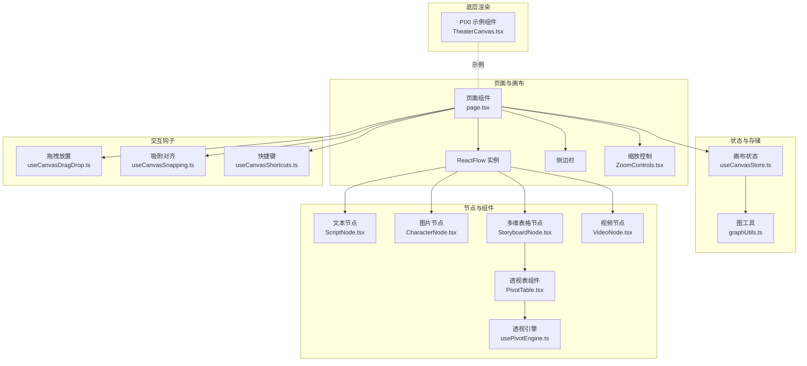
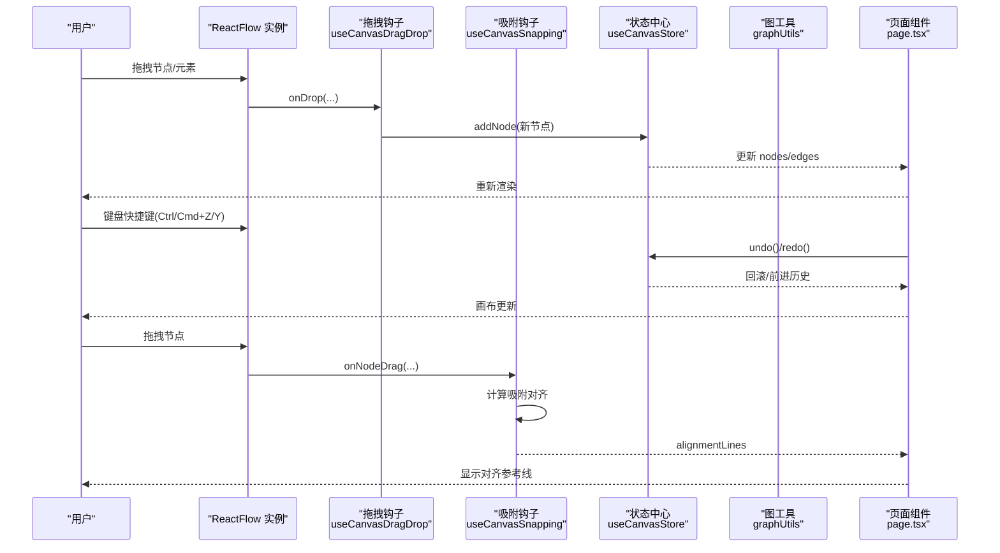
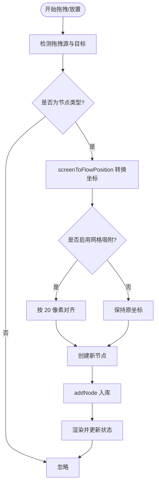
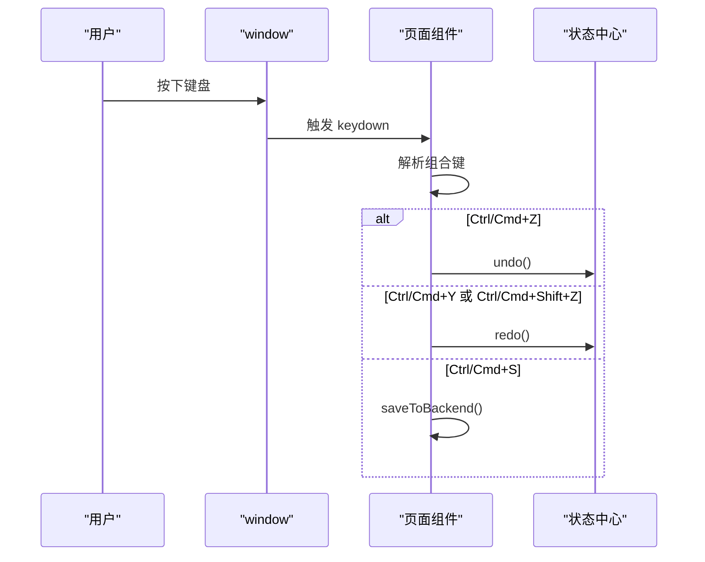
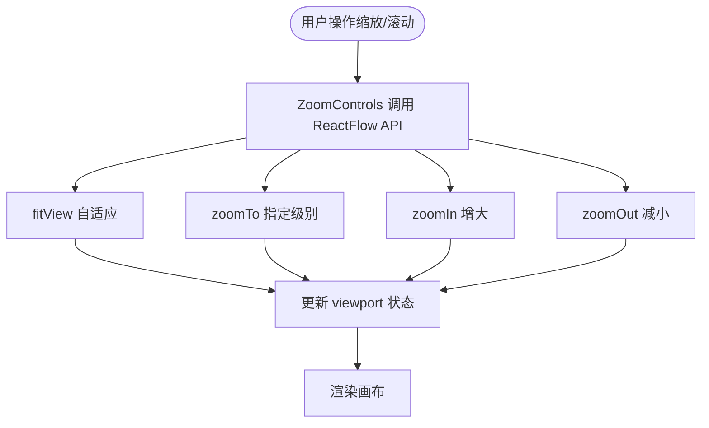
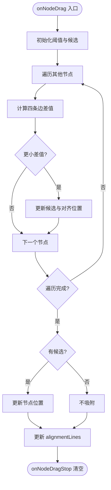
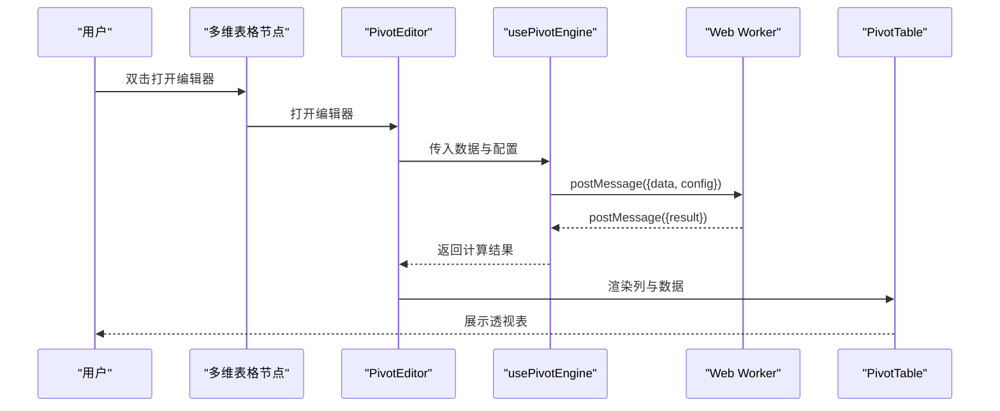
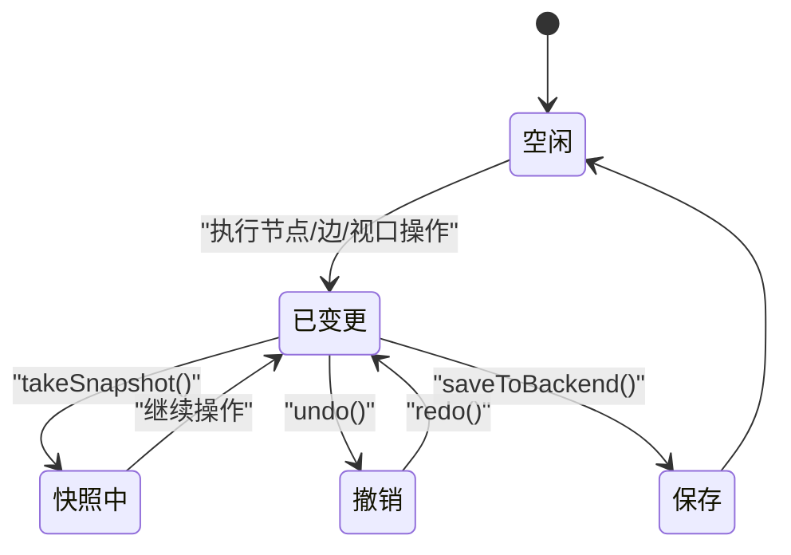
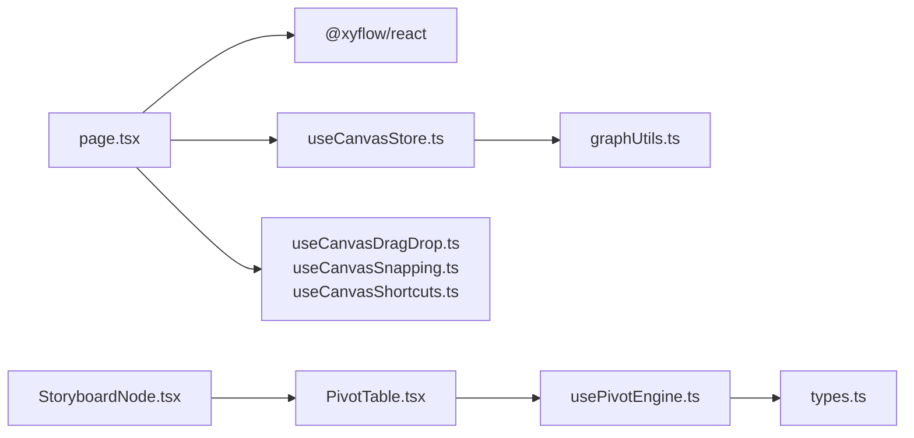

# 画布操作

<cite>
**本文引用的文件**
- [TheaterCanvas.tsx](file://frontend/src/components/TheaterCanvas.tsx)
- [page.tsx](file://frontend/src/app/theater/[id]/page.tsx)
- [useCanvasStore.ts](file://frontend/src/store/useCanvasStore.ts)
- [useCanvasDragDrop.ts](file://frontend/src/app/theater/[id]/hooks/useCanvasDragDrop.ts)
- [useCanvasSnapping.ts](file://frontend/src/app/theater/[id]/hooks/useCanvasSnapping.ts)
- [useCanvasShortcuts.ts](file://frontend/src/app/theater/[id]/hooks/useCanvasShortcuts.ts)
- [ZoomControls.tsx](file://frontend/src/components/canvas/ZoomControls.tsx)
- [PivotTable.tsx](file://frontend/src/components/canvas/pivot/PivotTable.tsx)
- [usePivotEngine.ts](file://frontend/src/components/canvas/pivot/usePivotEngine.ts)
- [types.ts](file://frontend/src/components/canvas/pivot/types.ts)
- [graphUtils.ts](file://frontend/src/lib/graphUtils.ts)
- [ScriptNode.tsx](file://frontend/src/components/canvas/ScriptNode.tsx)
- [CharacterNode.tsx](file://frontend/src/components/canvas/CharacterNode.tsx)
- [StoryboardNode.tsx](file://frontend/src/components/canvas/StoryboardNode.tsx)
- [VideoNode.tsx](file://frontend/src/components/canvas/VideoNode.tsx)
</cite>

## 目录
1. [简介](#简介)
2. [项目结构](#项目结构)
3. [核心组件](#核心组件)
4. [架构总览](#架构总览)
5. [详细组件分析](#详细组件分析)
6. [依赖关系分析](#依赖关系分析)
7. [性能考量](#性能考量)
8. [故障排查指南](#故障排查指南)
9. [结论](#结论)
10. [附录](#附录)

## 简介
本技术文档围绕“画布操作”主题，系统梳理前端画布的拖拽与放置、吸附对齐、快捷键、缩放与滚动、节点类型与交互、以及数据透视（pivot）能力，并补充撤销/重做与批量操作支持的设计要点。文档面向不同层次读者，既提供高层架构视图，也给出代码级的可视化与流程图示。

## 项目结构
本项目采用前后端分离架构，画布相关逻辑集中在前端的 Next.js 应用中，使用 @xyflow/react 构建可交互画布，配合 Zustand 状态管理与自研工具函数完成节点、边、历史快照与后端同步。

图表来源
- [page.tsx:54-484](file://frontend/src/app/theater/[id]/page.tsx#L54-L484)
- [useCanvasStore.ts:185-540](file://frontend/src/store/useCanvasStore.ts#L185-L540)
- [useCanvasDragDrop.ts:1-74](file://frontend/src/app/theater/[id]/hooks/useCanvasDragDrop.ts#L1-L74)
- [useCanvasSnapping.ts:1-98](file://frontend/src/app/theater/[id]/hooks/useCanvasSnapping.ts#L1-L98)
- [useCanvasShortcuts.ts:1-26](file://frontend/src/app/theater/[id]/hooks/useCanvasShortcuts.ts#L1-L26)
- [ZoomControls.tsx:1-117](file://frontend/src/components/canvas/ZoomControls.tsx#L1-L117)
- [PivotTable.tsx:1-63](file://frontend/src/components/canvas/pivot/PivotTable.tsx#L1-L63)
- [usePivotEngine.ts:1-188](file://frontend/src/components/canvas/pivot/usePivotEngine.ts#L1-L188)
- [TheaterCanvas.tsx:1-50](file://frontend/src/components/TheaterCanvas.tsx#L1-L50)

章节来源
- [page.tsx:54-484](file://frontend/src/app/theater/[id]/page.tsx#L54-L484)
- [useCanvasStore.ts:185-540](file://frontend/src/store/useCanvasStore.ts#L185-L540)

## 核心组件
- 画布容器与事件桥接：页面组件负责初始化 ReactFlow、注册拖拽/放置回调、键盘快捷键、吸附对齐线渲染、最小地图与缩放控制面板。
- 状态中心：Zustand 存储 useCanvasStore 统一管理节点、边、视口、脏标记、历史快照、后端同步与设置项（网格吸附、对齐参考线）。
- 交互钩子：useCanvasDragDrop 提供拖拽放置；useCanvasSnapping 提供拖拽过程中的吸附对齐；useCanvasShortcuts 提供撤销/重做快捷键。
- 节点类型：文本、图片、视频、多维表格四种节点，均通过 Handle 提供左右边缘连接点，支持拖拽连接与尺寸调整。
- 数据透视：Storyboard 节点内嵌 Pivot 编辑器，使用 Web Worker 的 usePivotEngine 进行聚合计算，PivotTable 渲染结果。
- 图校验：graphUtils 提供环检测，避免循环连接。

章节来源
- [page.tsx:54-484](file://frontend/src/app/theater/[id]/page.tsx#L54-L484)
- [useCanvasStore.ts:67-114](file://frontend/src/store/useCanvasStore.ts#L67-L114)
- [useCanvasDragDrop.ts:1-74](file://frontend/src/app/theater/[id]/hooks/useCanvasDragDrop.ts#L1-L74)
- [useCanvasSnapping.ts:1-98](file://frontend/src/app/theater/[id]/hooks/useCanvasSnapping.ts#L1-L98)
- [useCanvasShortcuts.ts:1-26](file://frontend/src/app/theater/[id]/hooks/useCanvasShortcuts.ts#L1-L26)
- [graphUtils.ts:1-39](file://frontend/src/lib/graphUtils.ts#L1-L39)

## 架构总览
下图展示画布操作的关键交互路径：从用户输入（拖拽、放置、键盘、缩放）到状态更新与渲染，再到后端同步与历史快照。

图表来源
- [page.tsx:235-259](file://frontend/src/app/theater/[id]/page.tsx#L235-L259)
- [useCanvasDragDrop.ts:15-70](file://frontend/src/app/theater/[id]/hooks/useCanvasDragDrop.ts#L15-L70)
- [useCanvasSnapping.ts:12-94](file://frontend/src/app/theater/[id]/hooks/useCanvasSnapping.ts#L12-L94)
- [useCanvasStore.ts:256-376](file://frontend/src/store/useCanvasStore.ts#L256-L376)

## 详细组件分析

### 拖拽与放置（节点拖拽、画布平移与吸附对齐）
- 拖拽放置
  - 页面监听 onDrop，解析 dataTransfer 中的类型、数据与尺寸，调用 screenToFlowPosition 转换坐标，生成 CanvasNode 并通过 addNode 入库。
  - 支持 snapToGrid 开关，启用时按 20 像素网格对齐。
- 画布平移
  - 页面通过 onMove 获取 viewport，实时更新状态并在 UI 上显示。
- 对齐参考线
  - 启用 snapToGuides 时，拖拽过程中计算与其他节点的边缘对齐差值，当小于阈值时显示垂直/水平参考线，拖拽结束清空。

图表来源
- [page.tsx:266-313](file://frontend/src/app/theater/[id]/page.tsx#L266-L313)
- [useCanvasDragDrop.ts:15-70](file://frontend/src/app/theater/[id]/hooks/useCanvasDragDrop.ts#L15-L70)
- [useCanvasSnapping.ts:12-94](file://frontend/src/app/theater/[id]/hooks/useCanvasSnapping.ts#L12-L94)

章节来源
- [page.tsx:261-313](file://frontend/src/app/theater/[id]/page.tsx#L261-L313)
- [useCanvasDragDrop.ts:1-74](file://frontend/src/app/theater/[id]/hooks/useCanvasDragDrop.ts#L1-L74)
- [useCanvasSnapping.ts:1-98](file://frontend/src/app/theater/[id]/hooks/useCanvasSnapping.ts#L1-L98)

### 快捷键系统（键盘事件监听、命令绑定与触发）
- 页面监听 window 的 keydown 事件，识别组合键：
  - Ctrl/Cmd+S：保存至后端
  - Ctrl/Cmd+Z：撤销
  - Ctrl/Cmd+Y 或 Ctrl/Cmd+Shift+Z：重做
- 通过 useCanvasShortcuts 抽离快捷键逻辑，便于复用与测试。

图表来源
- [page.tsx:235-259](file://frontend/src/app/theater/[id]/page.tsx#L235-L259)
- [useCanvasShortcuts.ts:7-24](file://frontend/src/app/theater/[id]/hooks/useCanvasShortcuts.ts#L7-L24)

章节来源
- [page.tsx:235-259](file://frontend/src/app/theater/[id]/page.tsx#L235-L259)
- [useCanvasShortcuts.ts:1-26](file://frontend/src/app/theater/[id]/hooks/useCanvasShortcuts.ts#L1-L26)

### 缩放与滚动（鼠标滚轮、触摸手势与缩放限制）
- 缩放控制
  - ZoomControls 使用 ReactFlow 的 zoomIn/zoomOut/zoomTo/fitView 控制画布缩放与自适应。
  - 最小/最大缩放与滑条步进在组件内硬编码，与 ReactFlow 的 minZoom/maxZoom 保持一致。
- 滚动与平移
  - 页面 onMove 获取 viewport，结合吸附参考线进行视觉反馈。
- 触摸手势
  - 当前实现主要基于鼠标事件与 ReactFlow 内置交互；如需增强触摸手势，可在 ReactFlow 属性中扩展 touch 支持（当前未见显式配置）。

图表来源
- [ZoomControls.tsx:26-64](file://frontend/src/components/canvas/ZoomControls.tsx#L26-L64)
- [page.tsx:343-356](file://frontend/src/app/theater/[id]/page.tsx#L343-L356)

章节来源
- [ZoomControls.tsx:1-117](file://frontend/src/components/canvas/ZoomControls.tsx#L1-L117)
- [page.tsx:343-356](file://frontend/src/app/theater/[id]/page.tsx#L343-L356)

### 节点吸附对齐算法（网格对齐、边缘对齐与智能吸附）
- 算法概览
  - 在 onNodeDrag 中遍历其他节点，计算当前节点四条边与目标节点四条边的差值，取最小差值作为对齐候选。
  - 当差值小于阈值（像素级）时，将当前节点位置对齐到目标边。
  - 拖拽停止时清空对齐参考线。
- 关键点
  - 使用 measured 宽高参与计算，保证拖拽过程中的实时尺寸。
  - 支持左右边缘与上下边缘的对齐，形成“垂直/水平”两条参考线。

图表来源
- [useCanvasSnapping.ts:12-94](file://frontend/src/app/theater/[id]/hooks/useCanvasSnapping.ts#L12-L94)

章节来源
- [useCanvasSnapping.ts:1-98](file://frontend/src/app/theater/[id]/hooks/useCanvasSnapping.ts#L1-L98)

### pivot 透视表（数据透视、动态列与交互式分析）
- 数据流
  - PivotEditor 在 Storyboard 节点中打开，接收节点 ID 与配置。
  - usePivotEngine 使用 Web Worker 执行透视计算，支持行/列/值聚合与排序。
  - PivotTable 渲染结果，支持媒体列（图片/视频）的预览。
- 配置与类型
  - PivotConfig 包含 rows、cols、values、sort、filter 等字段。
  - PivotDataResult 返回 columns 与 dataSource，用于表格渲染。

图表来源
- [StoryboardNode.tsx:290-312](file://frontend/src/components/canvas/StoryboardNode.tsx#L290-L312)
- [usePivotEngine.ts:8-187](file://frontend/src/components/canvas/pivot/usePivotEngine.ts#L8-L187)
- [PivotTable.tsx:10-62](file://frontend/src/components/canvas/pivot/PivotTable.tsx#L10-L62)
- [types.ts:1-28](file://frontend/src/components/canvas/pivot/types.ts#L1-L28)

章节来源
- [StoryboardNode.tsx:1-318](file://frontend/src/components/canvas/StoryboardNode.tsx#L1-L318)
- [usePivotEngine.ts:1-188](file://frontend/src/components/canvas/pivot/usePivotEngine.ts#L1-L188)
- [PivotTable.tsx:1-63](file://frontend/src/components/canvas/pivot/PivotTable.tsx#L1-L63)
- [types.ts:1-28](file://frontend/src/components/canvas/pivot/types.ts#L1-L28)

### 撤销/重做与批量操作支持
- 历史快照
  - takeSnapshot 将当前 nodes/edges 保存到 history，维护 historyIndex。
  - undo 将状态回退到上一个快照；redo 前进到下一个快照。
- 批量操作
  - addNode/deleteNode/deleteEdge/updateNodeData/updateNodeDimensions 等操作均会标记 isDirty 并触发 takeSnapshot，形成批量变更的原子化记录。
- 循环检测
  - onConnect 前调用 hasCycle 防止新增边导致环路。

图表来源
- [useCanvasStore.ts:335-376](file://frontend/src/store/useCanvasStore.ts#L335-L376)
- [graphUtils.ts:4-38](file://frontend/src/lib/graphUtils.ts#L4-L38)

章节来源
- [useCanvasStore.ts:67-114](file://frontend/src/store/useCanvasStore.ts#L67-L114)
- [useCanvasStore.ts:256-376](file://frontend/src/store/useCanvasStore.ts#L256-L376)
- [graphUtils.ts:1-39](file://frontend/src/lib/graphUtils.ts#L1-L39)

### 节点类型与交互要点
- ScriptNode：支持标题编辑、内容编辑、复制、删除、尺寸调整与左右边缘 Handle。
- CharacterNode：支持图片上传、预览、缩放/填充模式切换、复制/删除、尺寸自适应。
- VideoNode：支持视频上传、预览、缩放/填充模式切换、复制/删除、尺寸自适应。
- StoryboardNode：内置 Pivot 编辑器入口，支持双击打开全屏编辑。

章节来源
- [ScriptNode.tsx:1-351](file://frontend/src/components/canvas/ScriptNode.tsx#L1-L351)
- [CharacterNode.tsx:1-692](file://frontend/src/components/canvas/CharacterNode.tsx#L1-L692)
- [VideoNode.tsx:1-534](file://frontend/src/components/canvas/VideoNode.tsx#L1-L534)
- [StoryboardNode.tsx:1-318](file://frontend/src/components/canvas/StoryboardNode.tsx#L1-L318)

## 依赖关系分析
- 组件耦合
  - 页面组件高度依赖 ReactFlow 与 Zustand；吸附与拖拽钩子解耦于页面，便于复用。
  - 节点组件通过 Handle 与 ReactFlow 交互，内部状态通过 useCanvasStore 更新。
- 外部依赖
  - @xyflow/react：画布框架、节点/边渲染、连接与拖拽。
  - antd：透视表渲染。
  - zustand：全局状态与持久化。
- 潜在风险
  - Web Worker 与主线程通信异常时，透视表可能无结果或报错。
  - 网格吸附与对齐参考线在大量节点时可能影响性能，建议节流或降采样。

图表来源
- [page.tsx:54-484](file://frontend/src/app/theater/[id]/page.tsx#L54-L484)
- [useCanvasStore.ts:185-540](file://frontend/src/store/useCanvasStore.ts#L185-L540)
- [useCanvasDragDrop.ts:1-74](file://frontend/src/app/theater/[id]/hooks/useCanvasDragDrop.ts#L1-L74)
- [useCanvasSnapping.ts:1-98](file://frontend/src/app/theater/[id]/hooks/useCanvasSnapping.ts#L1-L98)
- [useCanvasShortcuts.ts:1-26](file://frontend/src/app/theater/[id]/hooks/useCanvasShortcuts.ts#L1-L26)
- [StoryboardNode.tsx:1-318](file://frontend/src/components/canvas/StoryboardNode.tsx#L1-L318)
- [PivotTable.tsx:1-63](file://frontend/src/components/canvas/pivot/PivotTable.tsx#L1-L63)
- [usePivotEngine.ts:1-188](file://frontend/src/components/canvas/pivot/usePivotEngine.ts#L1-L188)
- [types.ts:1-28](file://frontend/src/components/canvas/pivot/types.ts#L1-L28)

章节来源
- [page.tsx:54-484](file://frontend/src/app/theater/[id]/page.tsx#L54-L484)
- [useCanvasStore.ts:185-540](file://frontend/src/store/useCanvasStore.ts#L185-L540)

## 性能考量
- Web Worker：透视计算在 Worker 中执行，避免阻塞主线程，但需注意消息序列化与错误上报。
- 吸附对齐：对齐计算复杂度与节点数量近似 O(N^2)，建议在节点较多时降低刷新频率或限制对齐范围。
- 渲染优化：React.memo 用于节点组件，减少不必要的重渲染；NodeResizer 仅在选中时显示，降低 DOM 数量。
- 缩放与滚动：ReactFlow 内置虚拟化与动画参数（如 zoomIn/zoomOut 的 duration），合理设置可提升体验。

## 故障排查指南
- 无法保存
  - 检查 isSaving 标记与 saveToBackend 调用链，确认后端接口可用。
  - 章节来源
    - [useCanvasStore.ts:478-505](file://frontend/src/store/useCanvasStore.ts#L478-L505)
- 无法撤销/重做
  - 确认 history 与 historyIndex 是否正确推进与回退。
  - 章节来源
    - [useCanvasStore.ts:350-376](file://frontend/src/store/useCanvasStore.ts#L350-L376)
- 连接导致循环
  - onConnect 前后检查 hasCycle，必要时提示用户或阻止连接。
  - 章节来源
    - [useCanvasStore.ts:238-254](file://frontend/src/store/useCanvasStore.ts#L238-L254)
    - [graphUtils.ts:4-38](file://frontend/src/lib/graphUtils.ts#L4-L38)
- 透视表无数据
  - 检查 usePivotEngine 的配置与数据输入，确认 Worker 是否成功返回结果。
  - 章节来源
    - [usePivotEngine.ts:179-187](file://frontend/src/components/canvas/pivot/usePivotEngine.ts#L179-L187)
    - [PivotTable.tsx:33-62](file://frontend/src/components/canvas/pivot/PivotTable.tsx#L33-L62)

## 结论
本画布系统以 ReactFlow 为核心，结合自研钩子与状态管理，实现了完整的节点拖拽、吸附对齐、快捷键、缩放滚动与后端同步能力；Storyboard 节点内嵌 pivot 透视表，支持动态列与交互式分析。通过历史快照与循环检测，保障了操作的可控性与稳定性。后续可在大量节点场景下进一步优化吸附算法与渲染性能，并考虑增强触摸手势支持。

## 附录
- 示例：PIXI 示例组件（客户端渲染）
  - 章节来源
    - [TheaterCanvas.tsx:1-50](file://frontend/src/components/TheaterCanvas.tsx#L1-L50)