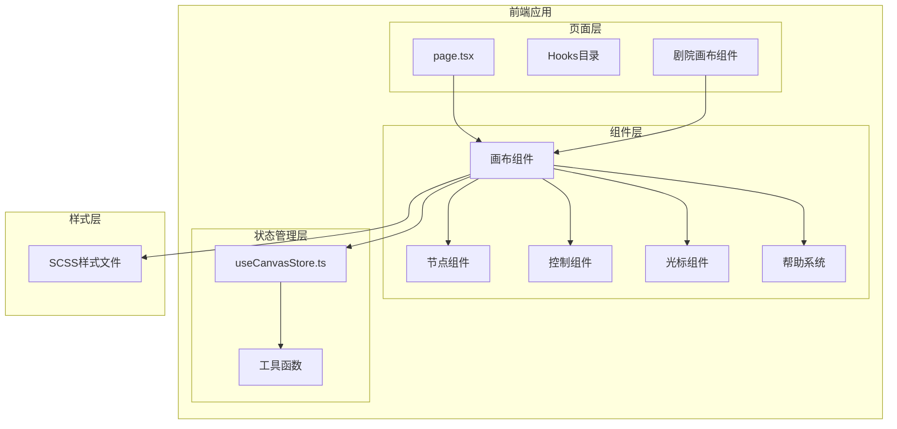
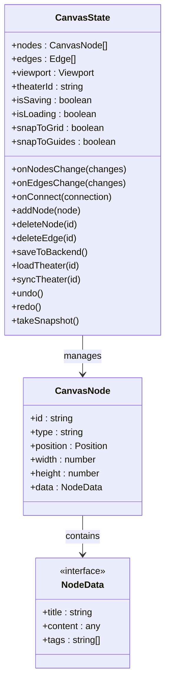
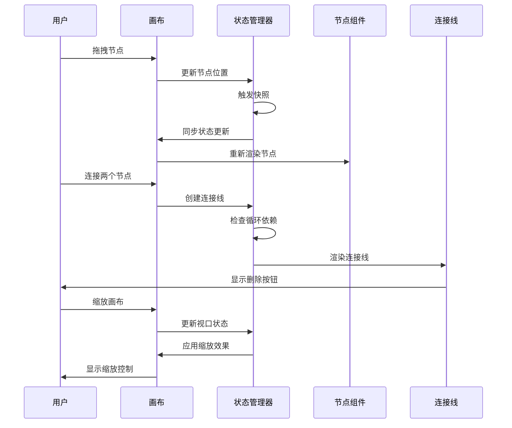
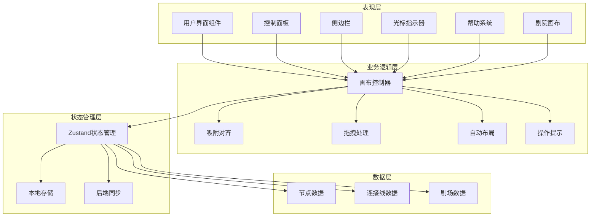
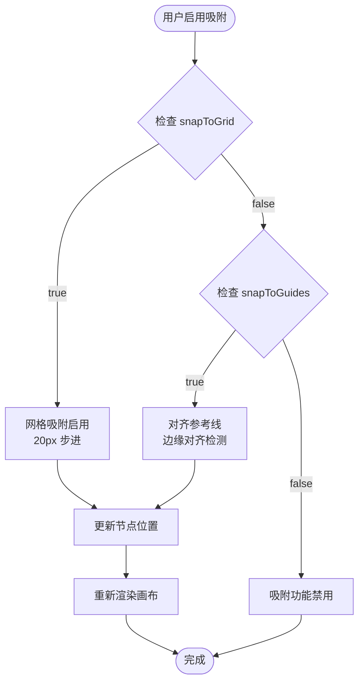
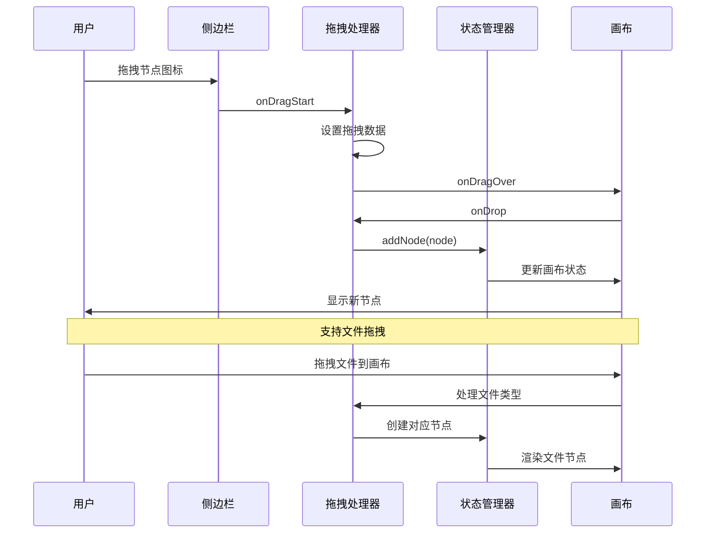
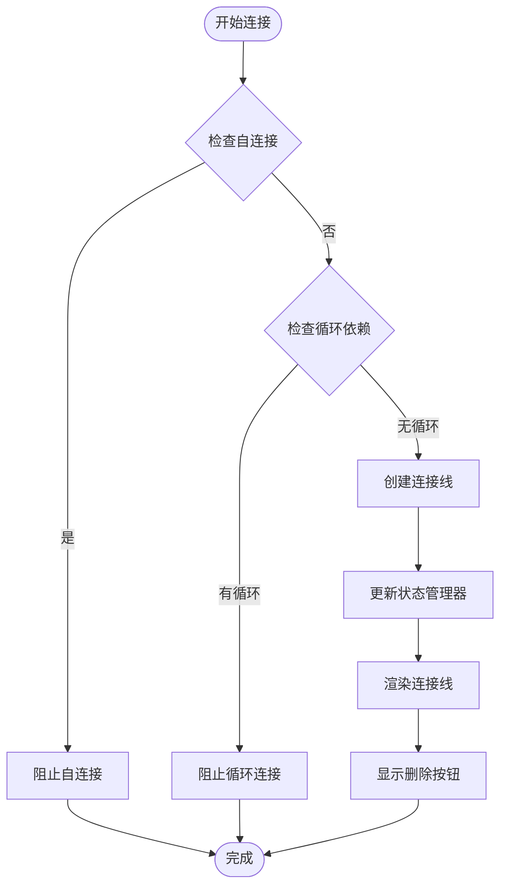
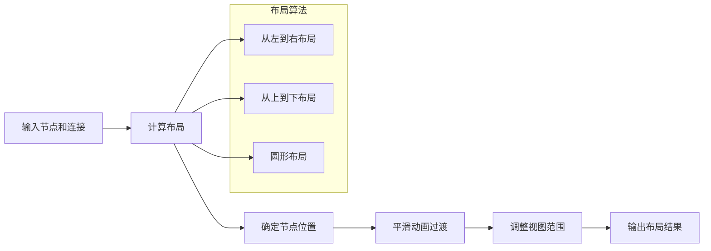
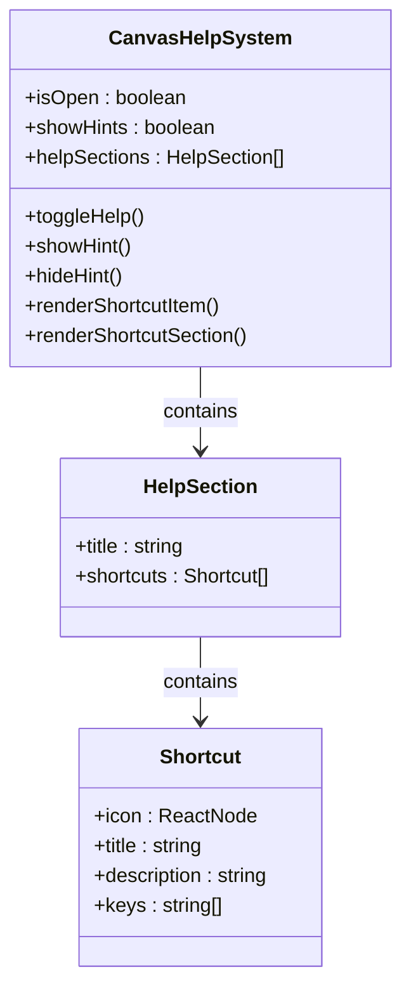
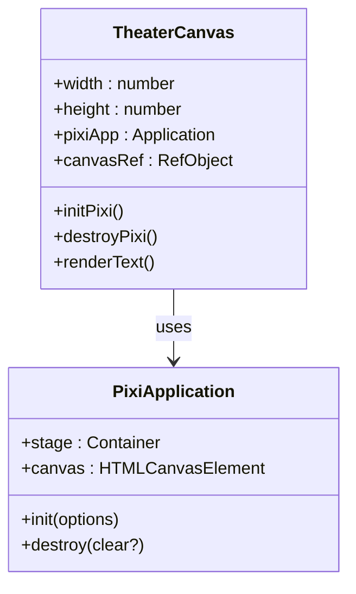

# 画布交互设置

<cite>
**本文档引用的文件**
- [useCanvasStore.ts](file://frontend/src/store/useCanvasStore.ts)
- [TheaterCanvas.tsx](file://frontend/src/components/TheaterCanvas.tsx)
- [CanvasCursor.tsx](file://frontend/src/components/canvas/CanvasCursor.tsx)
- [CanvasHelp.tsx](file://frontend/src/components/canvas/CanvasHelp.tsx)
- [useCanvasSnapping.ts](file://frontend/src/app/theater/[id]/hooks/useCanvasSnapping.ts)
- [useCanvasDragDrop.ts](file://frontend/src/app/theater/[id]/hooks/useCanvasDragDrop.ts)
- [useAutoLayout.ts](file://frontend/src/app/theater/[id]/hooks/useAutoLayout.ts)
- [ZoomControls.tsx](file://frontend/src/components/canvas/ZoomControls.tsx)
- [Sidebar.tsx](file://frontend/src/components/canvas/Sidebar.tsx)
- [CustomEdge.tsx](file://frontend/src/components/canvas/CustomEdge.tsx)
- [ScriptNode.tsx](file://frontend/src/components/canvas/ScriptNode.tsx)
- [CharacterNode.tsx](file://frontend/src/components/canvas/CharacterNode.tsx)
- [VideoNode.tsx](file://frontend/src/components/canvas/VideoNode.tsx)
- [graphUtils.ts](file://frontend/src/lib/graphUtils.ts)
</cite>

## 更新摘要
**所做更改**
- 新增画布光标增强功能模块
- 新增画布帮助系统和快捷键管理
- 新增剧院画布组件架构
- 更新画布交互组件模块结构
- 增强画布操作提示和用户体验

## 目录
1. [简介](#简介)
2. [项目结构](#项目结构)
3. [核心组件](#核心组件)
4. [架构概览](#架构概览)
5. [详细组件分析](#详细组件分析)
6. [依赖关系分析](#依赖关系分析)
7. [性能考虑](#性能考虑)
8. [故障排除指南](#故障排除指南)
9. [结论](#结论)

## 简介

本文档深入分析了 Infinite Game 项目中的画布交互设置系统。该系统基于 React Flow 构建，提供了丰富的可视化编辑体验，包括节点拖拽、连接、缩放控制、吸附对齐等功能。系统采用 Zustand 状态管理，实现了本地持久化存储和云端同步机制。

**更新** 新增了画布光标增强功能、帮助系统和剧院画布组件，进一步提升了用户体验和交互效率。

## 项目结构

画布交互系统主要分布在以下目录结构中：



**图表来源**
- [TheaterCanvas.tsx:1-50](file://frontend/src/components/TheaterCanvas.tsx#L1-L50)
- [CanvasCursor.tsx:1-160](file://frontend/src/components/canvas/CanvasCursor.tsx#L1-L160)
- [CanvasHelp.tsx:1-200](file://frontend/src/components/canvas/CanvasHelp.tsx#L1-L200)

**章节来源**
- [TheaterCanvas.tsx:1-50](file://frontend/src/components/TheaterCanvas.tsx#L1-L50)
- [CanvasCursor.tsx:1-160](file://frontend/src/components/canvas/CanvasCursor.tsx#L1-L160)
- [CanvasHelp.tsx:1-200](file://frontend/src/components/canvas/CanvasHelp.tsx#L1-L200)

## 核心组件

### 画布状态管理器

画布状态管理器是整个系统的中枢，负责管理所有画布相关的状态和操作：



**图表来源**
- [useCanvasStore.ts:67-114](file://frontend/src/store/useCanvasStore.ts#L67-L114)

### 画布交互控制器

画布交互控制器提供了丰富的用户交互功能：



**图表来源**
- [useCanvasStore.ts:209-254](file://frontend/src/store/useCanvasStore.ts#L209-L254)

**章节来源**
- [useCanvasStore.ts:185-540](file://frontend/src/store/useCanvasStore.ts#L185-L540)

## 架构概览

画布交互系统采用分层架构设计，各层职责清晰分离：



**图表来源**
- [TheaterCanvas.tsx:1-50](file://frontend/src/components/TheaterCanvas.tsx#L1-L50)
- [CanvasCursor.tsx:1-160](file://frontend/src/components/canvas/CanvasCursor.tsx#L1-L160)
- [CanvasHelp.tsx:1-200](file://frontend/src/components/canvas/CanvasHelp.tsx#L1-L200)

## 详细组件分析

### 画布设置系统

画布设置系统提供了多种交互配置选项：

#### 网格吸附设置

网格吸附功能通过 `snapToGrid` 和 `snapToGuides` 两个布尔值控制：



**图表来源**
- [useCanvasSnapping.ts:12-90](file://frontend/src/app/theater/[id]/hooks/useCanvasSnapping.ts#L12-L90)

#### 缩放控制系统

缩放控制系统提供了多种缩放方式：

```mermaid
classDiagram
class ZoomControls {
+showMap : boolean
+snapToGrid : boolean
+snapToGuides : boolean
+zoom : number
+onToggleMap()
+onToggleSnapToGrid()
+onToggleSnapToGuides()
+handleSliderChange(value)
+zoomIn()
+zoomOut()
+fitView()
}
class ReactFlowZoom {
+zoomIn(options)
+zoomOut(options)
+fitView(options)
+zoomTo(zoomLevel)
}
ZoomControls --> ReactFlowZoom : uses
note for ZoomControls : "提供用户友好的缩放界面"
note for ReactFlowZoom : "基于 React Flow 的缩放功能"
```

**图表来源**
- [ZoomControls.tsx:7-25](file://frontend/src/components/canvas/ZoomControls.tsx#L7-L25)

**章节来源**
- [ZoomControls.tsx:1-117](file://frontend/src/components/canvas/ZoomControls.tsx#L1-L117)
- [useCanvasSnapping.ts:1-98](file://frontend/src/app/theater/[id]/hooks/useCanvasSnapping.ts#L1-L98)

### 节点交互系统

节点交互系统支持多种节点类型和交互方式：

#### 节点拖拽处理

节点拖拽处理系统提供了智能的拖拽体验：



**图表来源**
- [Sidebar.tsx:88-118](file://frontend/src/components/canvas/Sidebar.tsx#L88-L118)
- [useCanvasDragDrop.ts:15-70](file://frontend/src/app/theater/[id]/hooks/useCanvasDragDrop.ts#L15-L70)

#### 节点连接系统

节点连接系统提供了安全的连接机制：



**图表来源**
- [graphUtils.ts:4-38](file://frontend/src/lib/graphUtils.ts#L4-L38)

**章节来源**
- [Sidebar.tsx:1-341](file://frontend/src/components/canvas/Sidebar.tsx#L1-L341)
- [useCanvasDragDrop.ts:1-74](file://frontend/src/app/theater/[id]/hooks/useCanvasDragDrop.ts#L1-L74)
- [CustomEdge.tsx:1-100](file://frontend/src/components/canvas/CustomEdge.tsx#L1-L100)

### 自动布局系统

自动布局系统提供了智能的节点排列功能：

#### 自动布局算法



**图表来源**
- [useAutoLayout.ts:20-46](file://frontend/src/app/theater/[id]/hooks/useAutoLayout.ts#L20-L46)

**章节来源**
- [useAutoLayout.ts:1-50](file://frontend/src/app/theater/[id]/hooks/useAutoLayout.ts#L1-L50)

### 画布辅助功能

#### 光标指示系统

光标指示系统提供了实时的交互反馈：

```mermaid
stateDiagram-v2
[*] --> Default
Default --> Pan : 按住空格键
Default --> Select : 按住Shift键
Pan --> Default : 松开按键
Select --> Default : 松开按键
state Default {
[*] --> Crosshair
Crosshair --> Info : 鼠标移动
}
state Pan {
[*] --> Hand
Hand --> Scale : 鼠标移动
}
state Select {
[*] --> BoxSelect
BoxSelect --> MultiSelect : 继续按住
}
```

**图表来源**
- [CanvasCursor.tsx:10-58](file://frontend/src/components/canvas/CanvasCursor.tsx#L10-L58)

**章节来源**
- [CanvasCursor.tsx:1-160](file://frontend/src/components/canvas/CanvasCursor.tsx#L1-L160)

#### 画布帮助系统

画布帮助系统提供了完整的操作指导：



**图表来源**
- [CanvasHelp.tsx:14-61](file://frontend/src/components/canvas/CanvasHelp.tsx#L14-L61)

**章节来源**
- [CanvasHelp.tsx:1-200](file://frontend/src/components/canvas/CanvasHelp.tsx#L1-L200)

### 剧院画布架构

剧院画布组件提供了基于 PixiJS 的增强画布功能：



**图表来源**
- [TheaterCanvas.tsx:5-44](file://frontend/src/components/TheaterCanvas.tsx#L5-L44)

**章节来源**
- [TheaterCanvas.tsx:1-50](file://frontend/src/components/TheaterCanvas.tsx#L1-L50)

## 依赖关系分析

画布交互系统的依赖关系如下：

```mermaid
graph TB
subgraph "外部依赖"
ReactFlow[@xyflow/react]
Zustand[zustand]
UUID[uuid]
Lucide[lucide-react]
FramerMotion[framer-motion]
PixiJS[pixi.js]
end
subgraph "内部模块"
Store[useCanvasStore]
Utils[graphUtils]
Hooks[自定义Hook]
Components[UI组件]
TheaterCanvas[剧院画布]
Cursor[光标组件]
Help[帮助系统]
end
subgraph "工具函数"
GraphUtils[图算法]
LayoutUtils[布局算法]
NodeUtils[节点工具]
End
Store --> ReactFlow
Store --> Zustand
Store --> UUID
Hooks --> Store
Hooks --> ReactFlow
Components --> Lucide
Components --> Store
TheaterCanvas --> PixiJS
Cursor --> Store
Help --> FramerMotion
Utils --> GraphUtils
Utils --> LayoutUtils
Utils --> NodeUtils
```

**图表来源**
- [TheaterCanvas.tsx:17](file://frontend/src/components/TheaterCanvas.tsx#L17)
- [CanvasCursor.tsx:4](file://frontend/src/components/canvas/CanvasCursor.tsx#L4)
- [CanvasHelp.tsx:4](file://frontend/src/components/canvas/CanvasHelp.tsx#L4)

**章节来源**
- [useCanvasStore.ts:1-540](file://frontend/src/store/useCanvasStore.ts#L1-L540)

## 性能考虑

画布交互系统在性能方面采用了多项优化措施：

### 状态管理优化

- **局部状态更新**：使用 Zustand 的细粒度状态更新，避免不必要的重渲染
- **持久化存储**：本地存储只保存必要的状态，减少存储开销
- **历史记录限制**：最大历史记录数限制为 50，防止内存泄漏

### 渲染性能优化

- **虚拟滚动**：大量节点时使用虚拟滚动技术
- **批量更新**：合并多次状态更新为单次渲染
- **懒加载**：组件按需加载，减少初始包大小
- **光标优化**：光标组件使用固定定位和CSS过渡，避免频繁重排

### 网络性能优化

- **防抖机制**：自动保存使用 2 秒防抖，减少网络请求频率
- **增量同步**：只同步变化的数据，而不是整个画布
- **缓存策略**：合理使用浏览器缓存和 CDN

### 新增性能优化

- **PixiJS 异步加载**：剧院画布组件动态导入 PixiJS，减少初始包大小
- **光标事件优化**：光标组件仅监听画布区域事件，避免全局事件监听
- **帮助系统动画**：使用 Framer Motion 进行流畅的动画过渡

## 故障排除指南

### 常见问题及解决方案

#### 画布无法缩放

**问题描述**：用户无法使用鼠标滚轮缩放画布

**可能原因**：
1. 缩放控制组件未正确初始化
2. React Flow 的缩放功能被禁用
3. 浏览器兼容性问题

**解决方案**：
1. 检查 `ReactFlow` 组件的 `minZoom` 和 `maxZoom` 属性
2. 确认缩放控制按钮的事件绑定
3. 测试不同浏览器的兼容性

#### 节点无法拖拽

**问题描述**：节点无法从侧边栏拖拽到画布

**可能原因**：
1. 拖拽数据格式不正确
2. 画布的 `onDrop` 事件未正确处理
3. 权限验证失败

**解决方案**：
1. 检查 `onDragStart` 中的数据设置
2. 验证 `onDrop` 事件的处理逻辑
3. 确认用户权限状态

#### 连接线显示异常

**问题描述**：连接线无法正确显示或删除

**可能原因**：
1. SVG 路径计算错误
2. 事件冒泡问题
3. 状态同步延迟

**解决方案**：
1. 检查 `getBezierPath` 函数的参数
2. 确认鼠标事件的正确处理
3. 添加适当的异步等待

#### 光标显示问题

**问题描述**：自定义光标无法正常显示或响应

**可能原因**：
1. 光标组件未正确挂载到画布区域
2. 事件监听器未正确绑定
3. CSS 样式冲突

**解决方案**：
1. 检查 `.react-flow__pane` 选择器是否正确
2. 验证事件监听器的绑定和解绑逻辑
3. 检查 z-index 和定位样式的冲突

#### 帮助系统不显示

**问题描述**：画布帮助弹窗无法打开或显示内容

**可能原因**：
1. Dialog 组件状态管理问题
2. 动画库依赖缺失
3. 图标组件导入错误

**解决方案**：
1. 检查 `isOpen` 状态的切换逻辑
2. 确认 Framer Motion 库的正确安装
3. 验证 lucide-react 图标的导入路径

#### 剧院画布渲染失败

**问题描述**：剧院画布无法正确渲染 PixiJS 应用

**可能原因**：
1. PixiJS 库加载失败
2. DOM 元素引用为空
3. 初始化参数错误

**解决方案**：
1. 检查动态导入语句的语法
2. 验证 canvasRef.current 是否存在
3. 确认 PixiJS Application 的初始化参数

**章节来源**
- [CanvasCursor.tsx:40-58](file://frontend/src/components/canvas/CanvasCursor.tsx#L40-L58)
- [CanvasHelp.tsx:80-87](file://frontend/src/components/canvas/CanvasHelp.tsx#L80-L87)
- [TheaterCanvas.tsx:14-44](file://frontend/src/components/TheaterCanvas.tsx#L14-L44)

## 结论

画布交互设置系统是一个功能完整、架构清晰的可视化编辑平台。系统通过合理的分层设计和优化策略，提供了流畅的用户体验和良好的扩展性。

**更新** 新增的画布光标增强功能、帮助系统和剧院画布组件进一步提升了系统的专业性和易用性。

### 主要优势

1. **模块化设计**：各组件职责明确，便于维护和扩展
2. **性能优化**：采用多种优化技术，确保大画布的流畅运行
3. **用户体验**：提供丰富的交互反馈和直观的操作界面
4. **数据安全**：完善的撤销重做机制和数据备份
5. **专业增强**：新增的专业光标指示和帮助系统提升了专业度

### 技术亮点

- 基于 React Flow 的高性能画布引擎
- Zustand 提供的轻量级状态管理
- 智能的吸附对齐算法
- 完善的文件拖拽上传功能
- 实时的云端同步机制
- 自定义光标指示系统
- 交互式帮助和快捷键系统
- 基于 PixiJS 的增强画布功能

该系统为 Infinite Game 项目提供了强大的可视化创作能力，为用户创造沉浸式的叙事体验奠定了坚实的技术基础。新增的功能模块进一步增强了系统的专业性和用户体验，使其成为了一个更加完善和专业的画布交互平台。