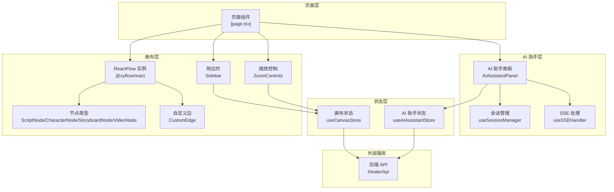
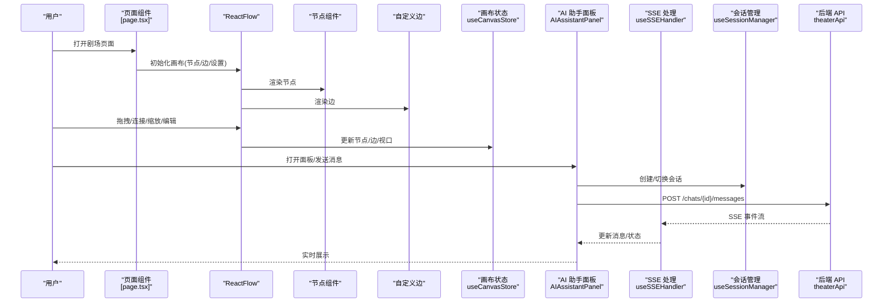
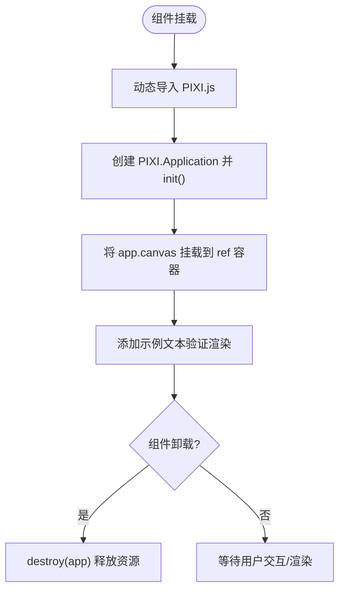
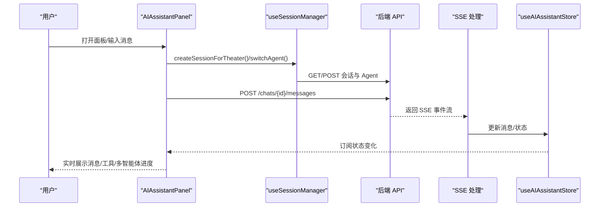
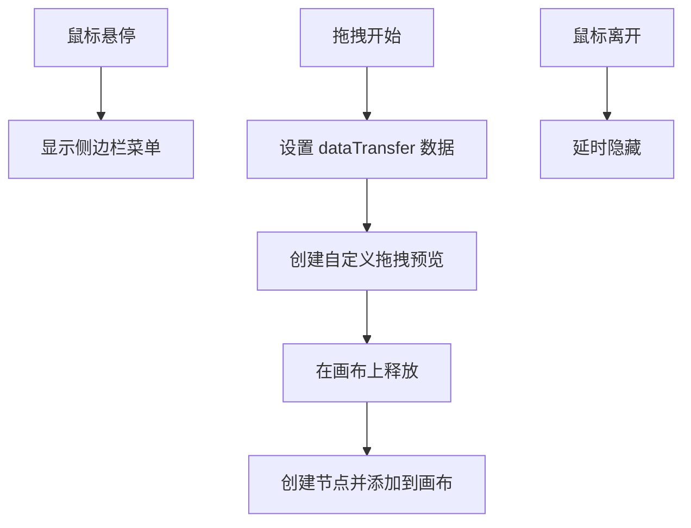
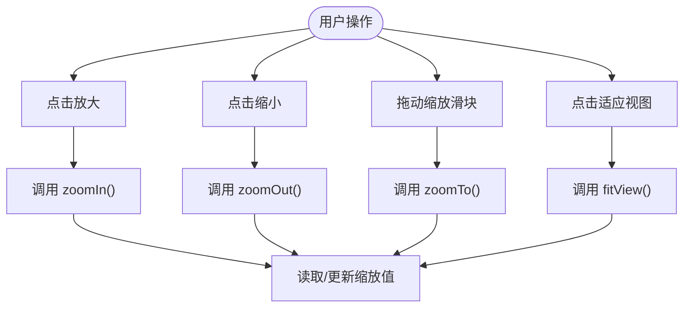
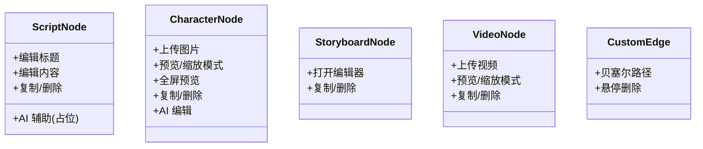
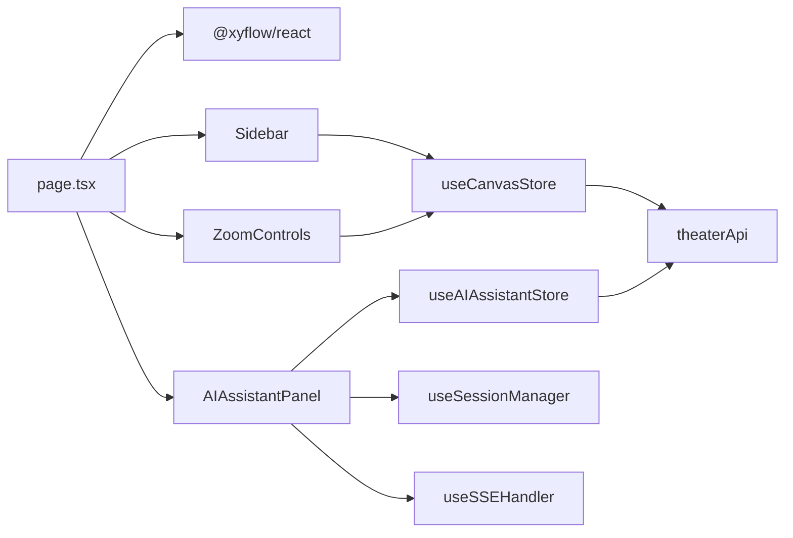

# 画布核心组件

<cite>
**本文档引用的文件**
- [TheaterCanvas.tsx](file://frontend/src/components/TheaterCanvas.tsx)
- [AIAssistantPanel.tsx](file://frontend/src/components/canvas/AIAssistantPanel.tsx)
- [Sidebar.tsx](file://frontend/src/components/canvas/Sidebar.tsx)
- [ZoomControls.tsx](file://frontend/src/components/canvas/ZoomControls.tsx)
- [useCanvasStore.ts](file://frontend/src/store/useCanvasStore.ts)
- [useAIAssistantStore.ts](file://frontend/src/store/useAIAssistantStore.ts)
- [page.tsx](file://frontend/src/app/theater/[id]/page.tsx)
- [useSSEHandler.ts](file://frontend/src/components/ai-assistant/hooks/useSSEHandler.ts)
- [useSessionManager.ts](file://frontend/src/components/ai-assistant/hooks/useSessionManager.ts)
- [ScriptNode.tsx](file://frontend/src/components/canvas/ScriptNode.tsx)
- [CharacterNode.tsx](file://frontend/src/components/canvas/CharacterNode.tsx)
- [StoryboardNode.tsx](file://frontend/src/components/canvas/StoryboardNode.tsx)
- [VideoNode.tsx](file://frontend/src/components/canvas/VideoNode.tsx)
- [CustomEdge.tsx](file://frontend/src/components/canvas/CustomEdge.tsx)
- [theaterApi.ts](file://frontend/src/lib/theaterApi.ts)
</cite>

## 目录
1. [简介](#简介)
2. [项目结构](#项目结构)
3. [核心组件](#核心组件)
4. [架构总览](#架构总览)
5. [详细组件分析](#详细组件分析)
6. [依赖关系分析](#依赖关系分析)
7. [性能考量](#性能考量)
8. [故障排查指南](#故障排查指南)
9. [结论](#结论)
10. [附录](#附录)

## 简介
本文件面向画布核心组件的技术文档，重点围绕以下主题展开：
- TheaterCanvas 主组件与 PIXI.js 集成、画布初始化与生命周期管理
- AI 助手面板的消息展示、输入处理与实时交互（含 SSE）
- 侧边栏组件的节点库、素材库与工具栏设计
- 缩放控制组件的缩放级别管理、手势支持与边界限制
- 组件间通信机制与数据传递方式
- 可定制性、样式系统与响应式设计实现

## 项目结构
前端采用 Next.js 客户端组件与 Zustand 状态管理，React Flow 提供画布渲染与交互，AI 助手通过 SSE 流式接收后端事件。

**图表来源**
- [page.tsx:334-444](file://frontend/src/app/theater/[id]/page.tsx#L334-L444)
- [Sidebar.tsx:138-336](file://frontend/src/components/canvas/Sidebar.tsx#L138-L336)
- [ZoomControls.tsx:7-25](file://frontend/src/components/canvas/ZoomControls.tsx#L7-L25)
- [AIAssistantPanel.tsx:14-84](file://frontend/src/components/canvas/AIAssistantPanel.tsx#L14-L84)
- [useCanvasStore.ts:185-540](file://frontend/src/store/useCanvasStore.ts#L185-L540)
- [useAIAssistantStore.ts:145-274](file://frontend/src/store/useAIAssistantStore.ts#L145-L274)
- [theaterApi.ts:107-159](file://frontend/src/lib/theaterApi.ts#L107-L159)

**章节来源**
- [page.tsx:334-444](file://frontend/src/app/theater/[id]/page.tsx#L334-L444)

## 核心组件
- TheaterCanvas：基于 PIXI.js 的 2D 画布容器，负责初始化、挂载与销毁
- AIAssistantPanel：AI 助手面板，支持消息流式展示、会话管理、SSE 事件处理与面板尺寸/位置持久化
- Sidebar：节点库与素材库，支持拖拽添加节点与素材
- ZoomControls：缩放控制、适应视图、网格吸附与对齐参考线开关
- 节点组件：ScriptNode、CharacterNode、StoryboardNode、VideoNode
- 自定义边：CustomEdge

**章节来源**
- [TheaterCanvas.tsx:10-47](file://frontend/src/components/TheaterCanvas.tsx#L10-L47)
- [AIAssistantPanel.tsx:14-84](file://frontend/src/components/canvas/AIAssistantPanel.tsx#L14-L84)
- [Sidebar.tsx:52-136](file://frontend/src/components/canvas/Sidebar.tsx#L52-L136)
- [ZoomControls.tsx:7-25](file://frontend/src/components/canvas/ZoomControls.tsx#L7-L25)
- [ScriptNode.tsx:11-112](file://frontend/src/components/canvas/ScriptNode.tsx#L11-L112)
- [CharacterNode.tsx:13-120](file://frontend/src/components/canvas/CharacterNode.tsx#L13-L120)
- [StoryboardNode.tsx:11-50](file://frontend/src/components/canvas/StoryboardNode.tsx#L11-L50)
- [VideoNode.tsx:10-101](file://frontend/src/components/canvas/VideoNode.tsx#L10-L101)
- [CustomEdge.tsx:5-33](file://frontend/src/components/canvas/CustomEdge.tsx#L5-L33)

## 架构总览
画布采用“页面容器 + React Flow + 节点/边 + 状态管理 + AI 助手”的分层架构。页面容器负责装配与生命周期，React Flow 负责渲染与交互，Zustand 管理画布与 AI 助手状态，AI 助手通过 SSE 与后端流式通信。

**图表来源**
- [page.tsx:334-444](file://frontend/src/app/theater/[id]/page.tsx#L334-L444)
- [AIAssistantPanel.tsx:87-179](file://frontend/src/components/canvas/AIAssistantPanel.tsx#L87-L179)
- [useSSEHandler.ts:63-327](file://frontend/src/components/ai-assistant/hooks/useSSEHandler.ts#L63-L327)
- [useSessionManager.ts:49-108](file://frontend/src/components/ai-assistant/hooks/useSessionManager.ts#L49-L108)
- [theaterApi.ts:141-150](file://frontend/src/lib/theaterApi.ts#L141-L150)

## 详细组件分析

### TheaterCanvas：PIXI.js 集成与生命周期
- 客户端动态导入 PIXI.js，避免 SSR 问题
- 初始化 PIXI.Application，设置画布尺寸与背景色
- 将 PIXI.canvas 挂载到 DOM，并在组件卸载时销毁应用释放资源
- 示例文本用于验证渲染

**图表来源**
- [TheaterCanvas.tsx:14-44](file://frontend/src/components/TheaterCanvas.tsx#L14-L44)

**章节来源**
- [TheaterCanvas.tsx:10-47](file://frontend/src/components/TheaterCanvas.tsx#L10-L47)

### AI 助手面板：消息展示、输入处理与实时交互
- 面板状态：打开/关闭、消息列表、面板尺寸与位置、图像编辑上下文
- 会话管理：加载可用 Agent、为剧场创建/切换会话、清空会话
- SSE 处理：解析事件行、按事件类型更新消息与状态（文本流、工具/技能调用、多智能体协作、计费信息、画布更新）
- 输入处理：发送消息至后端，支持取消请求；根据 HTTP 状态码显示友好提示
- 面板交互：拖拽、调整大小、ESC 关闭、图像编辑上下文横幅

**图表来源**
- [AIAssistantPanel.tsx:87-179](file://frontend/src/components/canvas/AIAssistantPanel.tsx#L87-L179)
- [useSessionManager.ts:49-108](file://frontend/src/components/ai-assistant/hooks/useSessionManager.ts#L49-L108)
- [useSSEHandler.ts:63-327](file://frontend/src/components/ai-assistant/hooks/useSSEHandler.ts#L63-L327)
- [useAIAssistantStore.ts:145-274](file://frontend/src/store/useAIAssistantStore.ts#L145-L274)

**章节来源**
- [AIAssistantPanel.tsx:14-326](file://frontend/src/components/canvas/AIAssistantPanel.tsx#L14-L326)
- [useSSEHandler.ts:24-335](file://frontend/src/components/ai-assistant/hooks/useSSEHandler.ts#L24-L335)
- [useSessionManager.ts:12-179](file://frontend/src/components/ai-assistant/hooks/useSessionManager.ts#L12-L179)
- [useAIAssistantStore.ts:74-274](file://frontend/src/store/useAIAssistantStore.ts#L74-L274)

### 侧边栏组件：节点库、素材库与工具栏
- 节点库：内置节点类型（文本、图片、视频、多维表格），支持拖拽添加
- 素材库：从画布节点提取图片/视频/其他资源，分页签展示
- 拖拽逻辑：设置 dataTransfer 内容与自定义半透明拖拽预览
- 动态菜单：悬停显示/隐藏，过渡动画与指针事件控制

**图表来源**
- [Sidebar.tsx:95-136](file://frontend/src/components/canvas/Sidebar.tsx#L95-L136)

**章节来源**
- [Sidebar.tsx:52-337](file://frontend/src/components/canvas/Sidebar.tsx#L52-L337)

### 缩放控制组件：缩放级别、手势与边界
- 缩放操作：zoomIn/zoomOut、zoomTo、fitView
- 滑块同步：从 ReactFlow store 获取当前缩放值，双向绑定滑块
- 边界限制：最小/最大缩放值与 ReactFlow props 对齐
- 附加功能：自动布局、网格吸附、对齐参考线、小地图开关

**图表来源**
- [ZoomControls.tsx:26-64](file://frontend/src/components/canvas/ZoomControls.tsx#L26-L64)

**章节来源**
- [ZoomControls.tsx:7-117](file://frontend/src/components/canvas/ZoomControls.tsx#L7-L117)
- [page.tsx:354-356](file://frontend/src/app/theater/[id]/page.tsx#L354-L356)

### 节点组件：交互与数据更新
- ScriptNode：标题编辑、内容编辑、复制/删除、AI 辅助占位
- CharacterNode：图片上传/预览/缩放模式切换、全屏预览、复制/删除、AI 编辑触发
- StoryboardNode：多维表格编辑器入口、复制/删除
- VideoNode：视频上传/预览/缩放模式切换、复制/删除
- 公共特性：节点尺寸调整、边缘拖拽热区、Handle 连接点

**图表来源**
- [ScriptNode.tsx:11-112](file://frontend/src/components/canvas/ScriptNode.tsx#L11-L112)
- [CharacterNode.tsx:13-120](file://frontend/src/components/canvas/CharacterNode.tsx#L13-L120)
- [StoryboardNode.tsx:11-50](file://frontend/src/components/canvas/StoryboardNode.tsx#L11-L50)
- [VideoNode.tsx:10-101](file://frontend/src/components/canvas/VideoNode.tsx#L10-L101)
- [CustomEdge.tsx:5-33](file://frontend/src/components/canvas/CustomEdge.tsx#L5-L33)

**章节来源**
- [ScriptNode.tsx:11-351](file://frontend/src/components/canvas/ScriptNode.tsx#L11-L351)
- [CharacterNode.tsx:13-692](file://frontend/src/components/canvas/CharacterNode.tsx#L13-L692)
- [StoryboardNode.tsx:11-318](file://frontend/src/components/canvas/StoryboardNode.tsx#L11-L318)
- [VideoNode.tsx:10-534](file://frontend/src/components/canvas/VideoNode.tsx#L10-L534)
- [CustomEdge.tsx:5-92](file://frontend/src/components/canvas/CustomEdge.tsx#L5-L92)

## 依赖关系分析
- 页面容器依赖 React Flow Provider、节点/边类型注册、侧边栏与缩放控制
- 画布状态管理节点/边/视口、历史快照、脏标记、自动保存
- AI 助手状态管理面板可见性、消息、会话、面板尺寸位置、图像编辑上下文
- SSE 处理与会话管理解耦，便于扩展多智能体与工具调用
- 后端 API 提供剧场、画布、聊天与媒体上传接口

**图表来源**
- [page.tsx:334-444](file://frontend/src/app/theater/[id]/page.tsx#L334-L444)
- [useCanvasStore.ts:185-540](file://frontend/src/store/useCanvasStore.ts#L185-L540)
- [useAIAssistantStore.ts:145-274](file://frontend/src/store/useAIAssistantStore.ts#L145-L274)
- [theaterApi.ts:107-159](file://frontend/src/lib/theaterApi.ts#L107-L159)

**章节来源**
- [page.tsx:334-444](file://frontend/src/app/theater/[id]/page.tsx#L334-L444)
- [useCanvasStore.ts:185-540](file://frontend/src/store/useCanvasStore.ts#L185-L540)
- [useAIAssistantStore.ts:145-274](file://frontend/src/store/useAIAssistantStore.ts#L145-L274)
- [theaterApi.ts:107-159](file://frontend/src/lib/theaterApi.ts#L107-L159)

## 性能考量
- React.memo 包裹节点组件，减少不必要的重渲染
- Zustand 状态分区与持久化，避免全局抖动
- React Flow 默认启用高性能渲染，配合 Handle 与连接半径优化
- SSE 事件流按类型增量更新，避免全量重绘
- 图片/视频上传使用对象 URL 与进度反馈，避免阻塞主线程
- 自动保存去抖（2 秒）降低后端压力

[本节为通用指导，无需特定文件引用]

## 故障排查指南
- SSE 事件解析失败：检查事件行格式与 JSON 解析
- HTTP 错误码提示：针对 402、401、403、429 提示友好信息
- 画布保存异常：确认 isSaving 标志与自动保存定时器
- 会话初始化失败：检查后端 /agents 与 /chats 接口可用性
- 节点尺寸异常：确认 Handle 连接方向与默认尺寸映射
- 缩放边界无效：核对 ReactFlow min/maxZoom 与滑块步进

**章节来源**
- [AIAssistantPanel.tsx:133-141](file://frontend/src/components/canvas/AIAssistantPanel.tsx#L133-L141)
- [useSSEHandler.ts:319-323](file://frontend/src/components/ai-assistant/hooks/useSSEHandler.ts#L319-L323)
- [page.tsx:92-101](file://frontend/src/app/theater/[id]/page.tsx#L92-L101)
- [useSessionManager.ts:32-46](file://frontend/src/components/ai-assistant/hooks/useSessionManager.ts#L32-L46)
- [page.tsx:354-356](file://frontend/src/app/theater/[id]/page.tsx#L354-L356)

## 结论
本画布核心组件体系以 React Flow 为基础，结合 Zustand 状态管理与 SSE 实时通信，实现了高交互性的可视化编辑体验。组件职责清晰、状态持久化完善、扩展性强，适合在复杂叙事与多媒体创作场景中进一步演进。

[本节为总结，无需特定文件引用]

## 附录
- 可定制性：节点/边类型注册、Handle 自定义、样式覆盖
- 样式系统：Tailwind 类名组织、颜色变量、动画与过渡
- 响应式设计：侧边栏固定定位、面板绝对定位、缩放与适配视图

[本节为概览，无需特定文件引用]