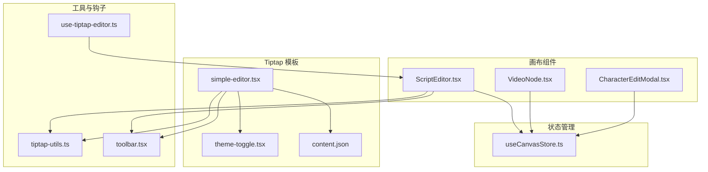
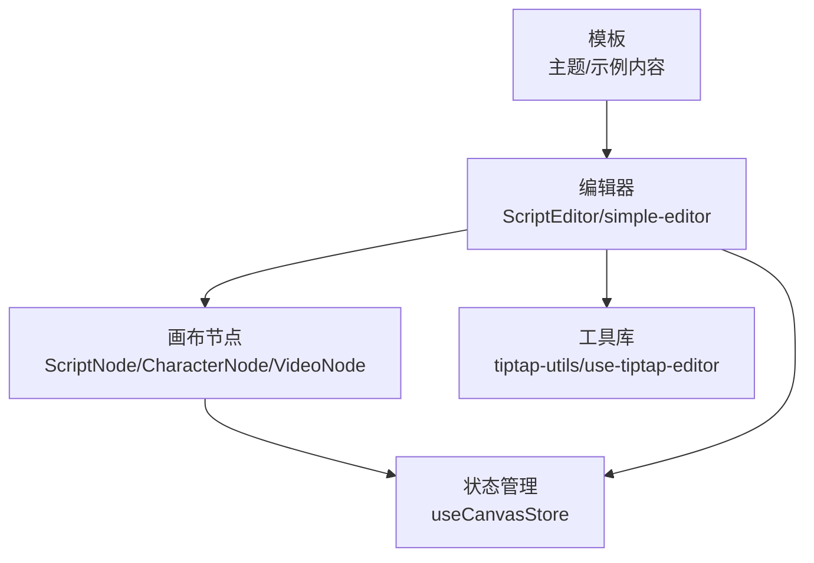
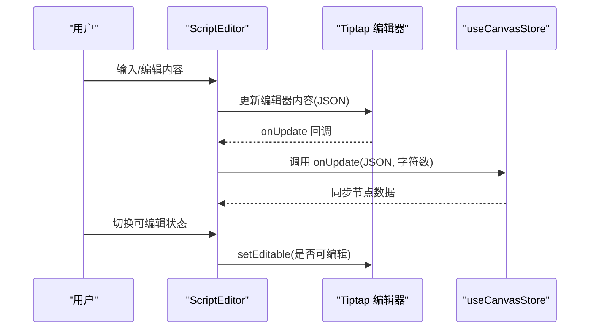
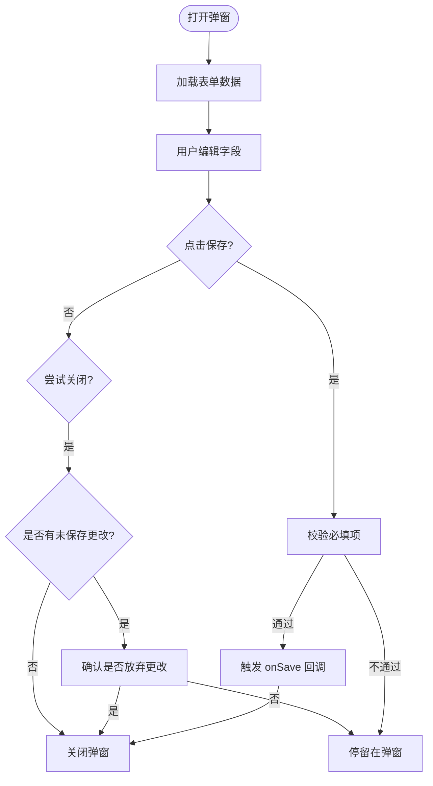
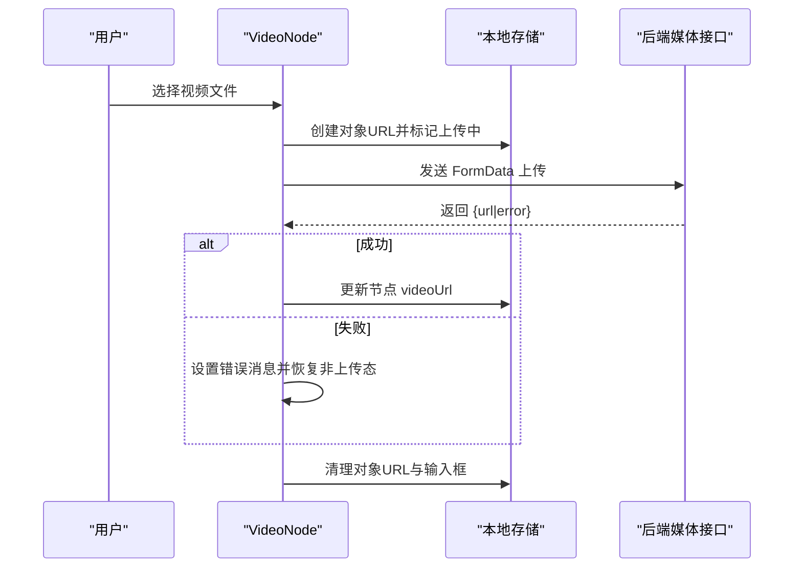
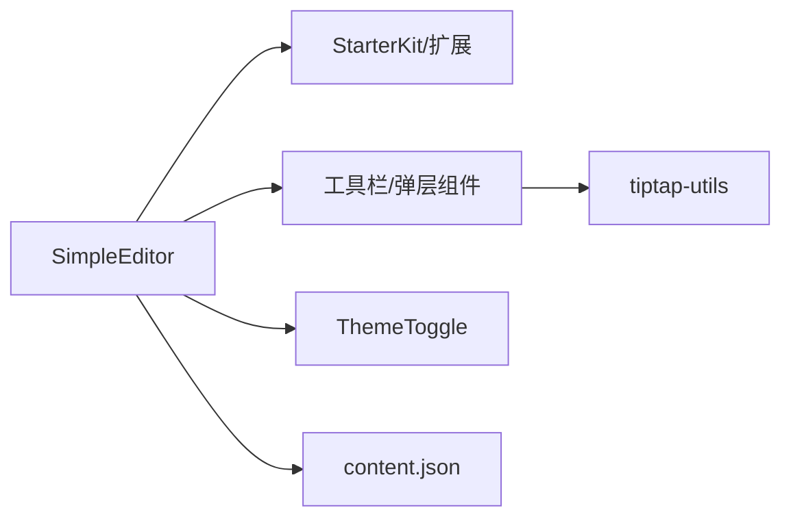
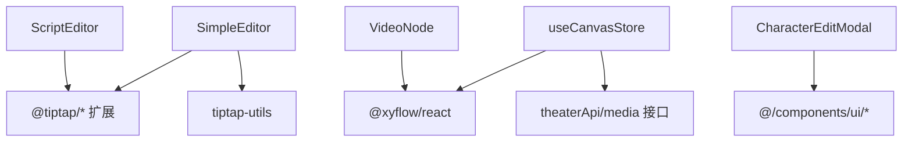

# 编辑工具

<cite>
**本文引用的文件**
- [ScriptEditor.tsx](file://frontend/src/components/canvas/ScriptEditor.tsx)
- [CharacterEditModal.tsx](file://frontend/src/components/canvas/CharacterEditModal.tsx)
- [VideoNode.tsx](file://frontend/src/components/canvas/VideoNode.tsx)
- [simple-editor.tsx](file://frontend/src/components/tiptap-templates/simple/simple-editor.tsx)
- [theme-toggle.tsx](file://frontend/src/components/tiptap-templates/simple/theme-toggle.tsx)
- [content.json](file://frontend/src/components/tiptap-templates/simple/data/content.json)
- [use-tiptap-editor.ts](file://frontend/src/hooks/use-tiptap-editor.ts)
- [tiptap-utils.ts](file://frontend/src/lib/tiptap-utils.ts)
- [useCanvasStore.ts](file://frontend/src/store/useCanvasStore.ts)
- [toolbar.tsx](file://frontend/src/components/tiptap-ui-primitive/toolbar/toolbar.tsx)
</cite>

## 目录
1. [简介](#简介)
2. [项目结构](#项目结构)
3. [核心组件](#核心组件)
4. [架构总览](#架构总览)
5. [详细组件分析](#详细组件分析)
6. [依赖关系分析](#依赖关系分析)
7. [性能考量](#性能考量)
8. [故障排查指南](#故障排查指南)
9. [结论](#结论)
10. [附录](#附录)

## 简介
本文件面向“编辑工具集”的技术文档，聚焦以下能力：
- ScriptEditor 剧本编辑器：富文本编辑、格式化工具、内容校验与同步
- CharacterEditModal 角色编辑弹窗：属性配置、图片上传与实时预览
- VideoNode 视频节点：视频选择、本地预览、参数调整与尺寸自适应
- Tiptap 模板系统：简单编辑器、主题切换、内容导入导出
- 扩展机制：自定义工具、插件系统与第三方集成建议
- 无障碍与跨浏览器兼容：键盘导航、ARIA 属性与平台差异处理

## 项目结构
编辑工具主要分布在前端工程的画布组件、Tiptap 模板与通用工具库中，采用按功能域分层组织：
- 画布节点与编辑器：ScriptEditor、CharacterEditModal、VideoNode
- Tiptap 模板：simple-editor 及其主题切换、示例内容
- 工具与钩子：use-tiptap-editor、tiptap-utils
- 状态管理：useCanvasStore（统一画布节点数据与历史快照）

**图表来源**
- [ScriptEditor.tsx:117-278](file://frontend/src/components/canvas/ScriptEditor.tsx#L117-L278)
- [CharacterEditModal.tsx:15-118](file://frontend/src/components/canvas/CharacterEditModal.tsx#L15-L118)
- [VideoNode.tsx:10-531](file://frontend/src/components/canvas/VideoNode.tsx#L10-L531)
- [simple-editor.tsx:189-293](file://frontend/src/components/tiptap-templates/simple/simple-editor.tsx#L189-L293)
- [theme-toggle.tsx:11-47](file://frontend/src/components/tiptap-templates/simple/theme-toggle.tsx#L11-L47)
- [content.json:1-478](file://frontend/src/components/tiptap-templates/simple/data/content.json#L1-L478)
- [use-tiptap-editor.ts:13-70](file://frontend/src/hooks/use-tiptap-editor.ts#L13-L70)
- [tiptap-utils.ts:1-641](file://frontend/src/lib/tiptap-utils.ts#L1-L641)
- [toolbar.tsx:82-101](file://frontend/src/components/tiptap-ui-primitive/toolbar/toolbar.tsx#L82-L101)
- [useCanvasStore.ts:185-539](file://frontend/src/store/useCanvasStore.ts#L185-L539)

**章节来源**
- [ScriptEditor.tsx:1-280](file://frontend/src/components/canvas/ScriptEditor.tsx#L1-L280)
- [simple-editor.tsx:1-294](file://frontend/src/components/tiptap-templates/simple/simple-editor.tsx#L1-L294)

## 核心组件
- ScriptEditor：基于 Tiptap 的富文本编辑器，提供标题、列表、引用块、代码块、高亮、对齐、任务清单、链接、图片等能力，并内置字符计数与占位提示；支持从外部传入初始内容并进行规范化与同步。
- CharacterEditModal：角色信息编辑弹窗，支持名称、设定描述与头像链接的编辑，具备变更检测与离开确认。
- VideoNode：视频节点，支持本地文件选择、进度上传、错误提示、自动尺寸计算与适配模式切换，提供复制、删除、连接端点等操作。
- Tiptap 模板：simple-editor 提供移动端/桌面端工具栏布局、主题切换、示例内容导入与展示。

**章节来源**
- [ScriptEditor.tsx:117-278](file://frontend/src/components/canvas/ScriptEditor.tsx#L117-L278)
- [CharacterEditModal.tsx:15-118](file://frontend/src/components/canvas/CharacterEditModal.tsx#L15-L118)
- [VideoNode.tsx:10-531](file://frontend/src/components/canvas/VideoNode.tsx#L10-L531)
- [simple-editor.tsx:189-293](file://frontend/src/components/tiptap-templates/simple/simple-editor.tsx#L189-L293)

## 架构总览
编辑工具以“节点 + 编辑器 + 模板 + 工具库 + 状态”五层协同：
- 节点层：ScriptNode、CharacterNode、VideoNode 等，承载业务数据与交互
- 编辑器层：ScriptEditor、simple-editor，封装 Tiptap 扩展与 UI 组件
- 模板层：主题切换、示例内容、移动端工具栏
- 工具层：快捷键格式化、节点查找、URL 安全校验、上传辅助
- 状态层：useCanvasStore 统一管理节点、边、视口、历史与后端同步

**图表来源**
- [useCanvasStore.ts:185-539](file://frontend/src/store/useCanvasStore.ts#L185-L539)
- [ScriptEditor.tsx:117-278](file://frontend/src/components/canvas/ScriptEditor.tsx#L117-L278)
- [simple-editor.tsx:189-293](file://frontend/src/components/tiptap-templates/simple/simple-editor.tsx#L189-L293)
- [tiptap-utils.ts:1-641](file://frontend/src/lib/tiptap-utils.ts#L1-L641)
- [use-tiptap-editor.ts:13-70](file://frontend/src/hooks/use-tiptap-editor.ts#L13-L70)

## 详细组件分析

### ScriptEditor 剧本编辑器
- 富文本与扩展
  - 使用 StarterKit 并配置标题层级、列表行为、代码块语言类前缀、引用块等
  - 支持下划线、链接（禁用点击打开）、图片、文本对齐、任务清单、高亮、TextStyle、Color、占位符、字符计数
- 内容规范化与校验
  - 支持字符串 Markdown 到 Tiptap JSON 的转换
  - 提供 JSON 结构校验与默认空文档兜底
- 同步与交互
  - 对外暴露编辑态与字符数回调
  - 可动态切换可编辑状态
  - 非编辑态下避免干扰用户输入，必要时进行内容同步
- 工具栏
  - 浮动工具栏组合：撤销/重做、标题/列表/引用/代码块、粗体/斜体/删除线/下划线/代码、高亮/链接、对齐、图片上传
  - 工具栏具备键盘导航与焦点可见态管理

**图表来源**
- [ScriptEditor.tsx:130-174](file://frontend/src/components/canvas/ScriptEditor.tsx#L130-L174)
- [ScriptEditor.tsx:176-202](file://frontend/src/components/canvas/ScriptEditor.tsx#L176-L202)
- [useCanvasStore.ts:310-318](file://frontend/src/store/useCanvasStore.ts#L310-L318)

**章节来源**
- [ScriptEditor.tsx:17-92](file://frontend/src/components/canvas/ScriptEditor.tsx#L17-L92)
- [ScriptEditor.tsx:117-278](file://frontend/src/components/canvas/ScriptEditor.tsx#L117-L278)
- [toolbar.tsx:82-101](file://frontend/src/components/tiptap-ui-primitive/toolbar/toolbar.tsx#L82-L101)

### CharacterEditModal 角色编辑弹窗
- 数据绑定与变更检测
  - 打开时复制当前数据，关闭时检测变更并提示
  - 保存前进行必填校验（名称非空）
- 交互细节
  - 支持点击外部与按 ESC 关闭时的二次确认
  - 表单字段：名称、描述、头像链接
- 与画布的协作
  - 通过 onSave 回调更新节点数据，随后关闭弹窗

**图表来源**
- [CharacterEditModal.tsx:19-57](file://frontend/src/components/canvas/CharacterEditModal.tsx#L19-L57)

**章节来源**
- [CharacterEditModal.tsx:15-118](file://frontend/src/components/canvas/CharacterEditModal.tsx#L15-L118)

### VideoNode 视频节点
- 视频选择与上传
  - 文件类型限制（mp4/webm/ogg）与大小限制（500MB）
  - 使用原生 XHR 进行上传，支持进度条与错误提示
  - 上传成功后回写服务端返回的 URL，并清理临时对象 URL
- 本地预览与尺寸自适应
  - 上传时生成本地 URL 用于即时预览
  - 加载元数据后根据宽高比与最大尺寸计算新尺寸，避免循环更新
- 参数与交互
  - 标题双击编辑、回车/ESC 保存
  - 适配模式切换（cover/contain）
  - 复制、删除、连接端点（左右两侧 Handle）
  - 选中态显示尺寸调整手柄

**图表来源**
- [VideoNode.tsx:107-186](file://frontend/src/components/canvas/VideoNode.tsx#L107-L186)
- [VideoNode.tsx:190-222](file://frontend/src/components/canvas/VideoNode.tsx#L190-L222)

**章节来源**
- [VideoNode.tsx:10-531](file://frontend/src/components/canvas/VideoNode.tsx#L10-L531)
- [useCanvasStore.ts:310-329](file://frontend/src/store/useCanvasStore.ts#L310-L329)

### Tiptap 模板系统（Simple Editor）
- 组合 UI 组件
  - 工具栏：标题/列表/引用/代码块、强调/高亮/链接、上标/下标、对齐、图片上传
  - 主题切换：根据系统偏好自动初始化深色/浅色模式
  - 示例内容：content.json 提供完整示例文档
- 移动端适配
  - 主工具栏与高亮/链接二级面板切换
  - 光标可见性与工具栏位置联动
- 上传与安全
  - 图片上传工具封装，支持进度与错误回调
  - URL 协议白名单与 URL 规范化

**图表来源**
- [simple-editor.tsx:189-293](file://frontend/src/components/tiptap-templates/simple/simple-editor.tsx#L189-L293)
- [theme-toggle.tsx:11-47](file://frontend/src/components/tiptap-templates/simple/theme-toggle.tsx#L11-L47)
- [content.json:1-478](file://frontend/src/components/tiptap-templates/simple/data/content.json#L1-L478)
- [tiptap-utils.ts:361-388](file://frontend/src/lib/tiptap-utils.ts#L361-L388)

**章节来源**
- [simple-editor.tsx:189-293](file://frontend/src/components/tiptap-templates/simple/simple-editor.tsx#L189-L293)
- [theme-toggle.tsx:11-47](file://frontend/src/components/tiptap-templates/simple/theme-toggle.tsx#L11-L47)
- [content.json:1-478](file://frontend/src/components/tiptap-templates/simple/data/content.json#L1-L478)
- [tiptap-utils.ts:361-388](file://frontend/src/lib/tiptap-utils.ts#L361-L388)

## 依赖关系分析
- 组件耦合
  - ScriptEditor 与 VideoNode/CharacterEditModal 通过 useCanvasStore 间接耦合，降低直接依赖
  - Tiptap 模板与工具库解耦，便于复用
- 外部依赖
  - Tiptap 生态（StarterKit、扩展、UI 组件）
  - Zustand 状态持久化
  - React Flow 画布与节点交互
- 循环依赖
  - 未见直接循环依赖；若新增自定义扩展需避免在编辑器初始化时互相引用

**图表来源**
- [ScriptEditor.tsx:1-15](file://frontend/src/components/canvas/ScriptEditor.tsx#L1-L15)
- [VideoNode.tsx:1-8](file://frontend/src/components/canvas/VideoNode.tsx#L1-L8)
- [simple-editor.tsx:1-28](file://frontend/src/components/tiptap-templates/simple/simple-editor.tsx#L1-L28)
- [useCanvasStore.ts:19-24](file://frontend/src/store/useCanvasStore.ts#L19-L24)

**章节来源**
- [useCanvasStore.ts:185-539](file://frontend/src/store/useCanvasStore.ts#L185-L539)

## 性能考量
- 渲染与更新
  - ScriptEditor 使用立即渲染开关与内容规范化缓存，减少不必要的重渲染
  - 非编辑态下的内容同步仅在实际变化时触发，避免循环更新
- 上传与预览
  - 上传进度与错误提示分离，避免阻塞 UI
  - 本地预览 URL 在完成后及时释放，防止内存泄漏
- 尺寸计算
  - 视频尺寸计算仅在宽高显著变化时更新，避免频繁尺寸变更导致的抖动

[本节为通用指导，无需特定文件引用]

## 故障排查指南
- 编辑器无法编辑
  - 检查可编辑状态切换逻辑与事件冒泡拦截
  - 参考：[ScriptEditor.tsx:176-181](file://frontend/src/components/canvas/ScriptEditor.tsx#L176-L181)
- 内容不同步
  - 确认非编辑态下内容比较与同步条件
  - 参考：[ScriptEditor.tsx:183-202](file://frontend/src/components/canvas/ScriptEditor.tsx#L183-L202)
- 上传失败或跨域
  - 检查后端直连地址与鉴权头设置
  - 参考：[VideoNode.tsx:132-138](file://frontend/src/components/canvas/VideoNode.tsx#L132-L138)
- 上传进度异常
  - 确认 XHR 进度事件与百分比计算
  - 参考：[VideoNode.tsx:140-145](file://frontend/src/components/canvas/VideoNode.tsx#L140-L145)
- 主题切换无效
  - 检查深色模式类名切换与系统偏好监听
  - 参考：[theme-toggle.tsx:28-30](file://frontend/src/components/tiptap-templates/simple/theme-toggle.tsx#L28-L30)
- 链接/URL 安全问题
  - 使用 URL 规范化与协议白名单
  - 参考：[tiptap-utils.ts:453-468](file://frontend/src/lib/tiptap-utils.ts#L453-L468)

**章节来源**
- [ScriptEditor.tsx:176-202](file://frontend/src/components/canvas/ScriptEditor.tsx#L176-L202)
- [VideoNode.tsx:132-145](file://frontend/src/components/canvas/VideoNode.tsx#L132-L145)
- [theme-toggle.tsx:28-30](file://frontend/src/components/tiptap-templates/simple/theme-toggle.tsx#L28-L30)
- [tiptap-utils.ts:453-468](file://frontend/src/lib/tiptap-utils.ts#L453-L468)

## 结论
编辑工具集以 Tiptap 为核心，结合 React Flow 画布与 Zustand 状态管理，实现了剧本、角色与视频节点的富文本编辑与可视化编排。通过模板化与工具库抽象，提供了良好的可扩展性与跨平台兼容性。后续可在现有基础上引入自定义扩展、插件系统与第三方集成，进一步提升编辑体验与协作效率。

[本节为总结性内容，无需特定文件引用]

## 附录

### 扩展机制与最佳实践
- 自定义工具
  - 基于 Tiptap 扩展与 UI 组件封装，复用工具栏容器与键盘导航
  - 参考：[toolbar.tsx:82-101](file://frontend/src/components/tiptap-ui-primitive/toolbar/toolbar.tsx#L82-L101)
- 插件系统
  - 在编辑器初始化阶段注入自定义扩展，注意避免循环依赖
  - 参考：[ScriptEditor.tsx:130-155](file://frontend/src/components/canvas/ScriptEditor.tsx#L130-L155)
- 第三方集成
  - 上传：参考图片上传工具与 XHR 实现，接入后端媒体服务
  - 链接/URL：使用工具库提供的 URL 规范化与协议白名单
  - 参考：[tiptap-utils.ts:361-388](file://frontend/src/lib/tiptap-utils.ts#L361-L388), [VideoNode.tsx:132-138](file://frontend/src/components/canvas/VideoNode.tsx#L132-L138)

**章节来源**
- [toolbar.tsx:82-101](file://frontend/src/components/tiptap-ui-primitive/toolbar/toolbar.tsx#L82-L101)
- [ScriptEditor.tsx:130-155](file://frontend/src/components/canvas/ScriptEditor.tsx#L130-L155)
- [tiptap-utils.ts:361-388](file://frontend/src/lib/tiptap-utils.ts#L361-L388)
- [VideoNode.tsx:132-138](file://frontend/src/components/canvas/VideoNode.tsx#L132-L138)

### 无障碍与跨浏览器兼容
- 键盘导航
  - 工具栏具备水平方向菜单导航与焦点可见态管理
  - 参考：[toolbar.tsx:16-80](file://frontend/src/components/tiptap-ui-primitive/toolbar/toolbar.tsx#L16-L80)
- ARIA 属性
  - 编辑器内容区与工具栏设置语义化标签
  - 参考：[simple-editor.tsx:199-207](file://frontend/src/components/tiptap-templates/simple/simple-editor.tsx#L199-L207)
- 平台差异
  - 快捷键符号根据平台动态格式化
  - 参考：[tiptap-utils.ts:70-81](file://frontend/src/lib/tiptap-utils.ts#L70-L81)

**章节来源**
- [toolbar.tsx:16-80](file://frontend/src/components/tiptap-ui-primitive/toolbar/toolbar.tsx#L16-L80)
- [simple-editor.tsx:199-207](file://frontend/src/components/tiptap-templates/simple/simple-editor.tsx#L199-L207)
- [tiptap-utils.ts:70-81](file://frontend/src/lib/tiptap-utils.ts#L70-L81)