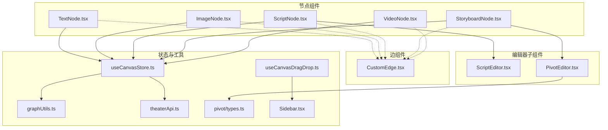
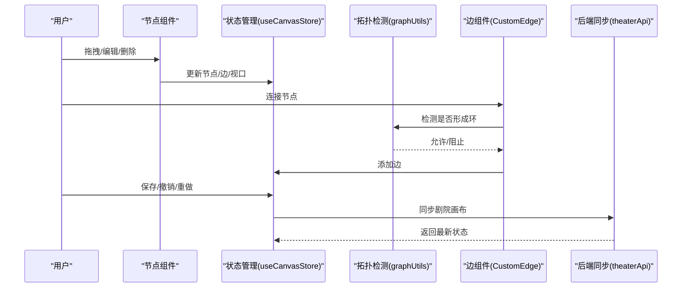
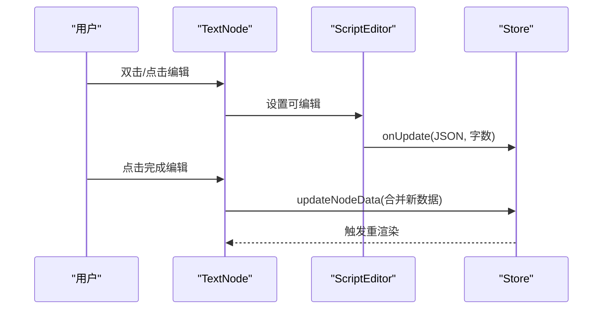
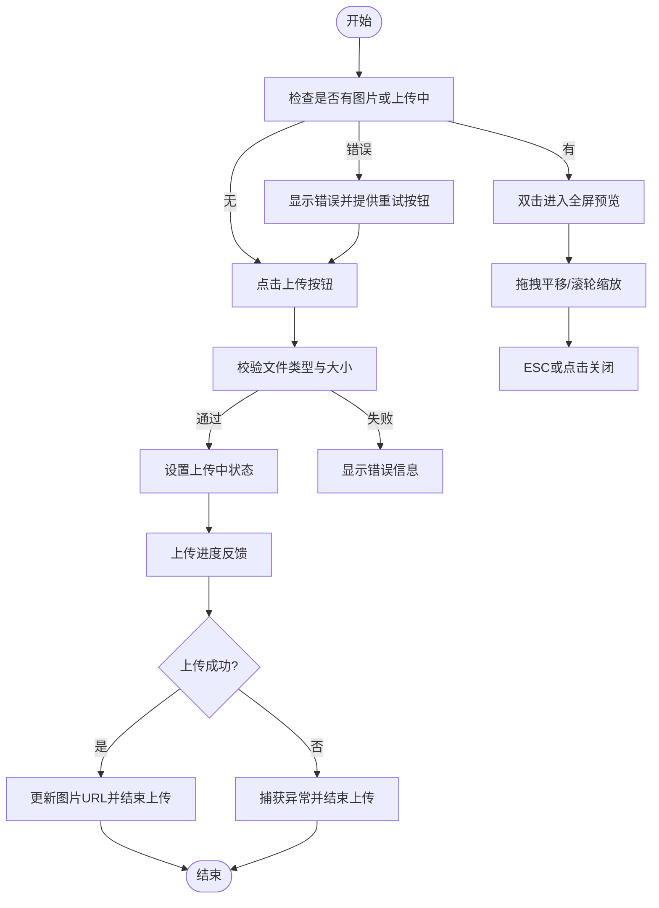
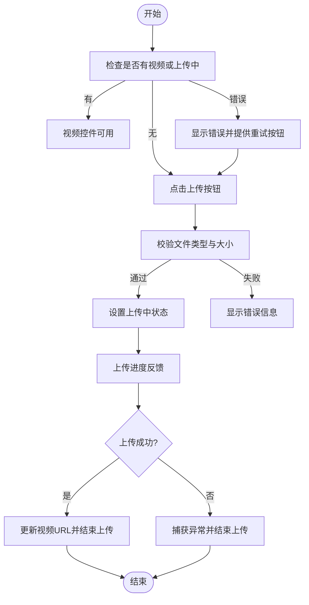
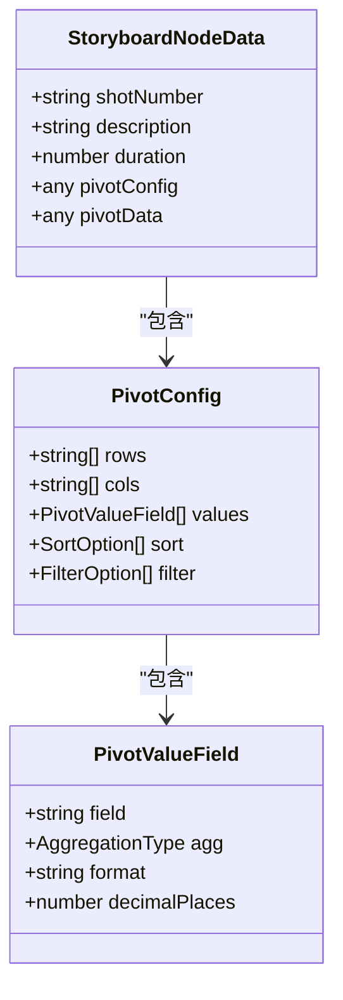
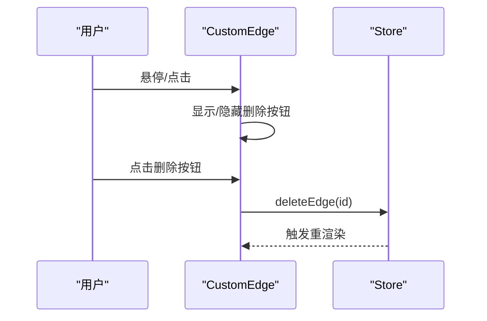
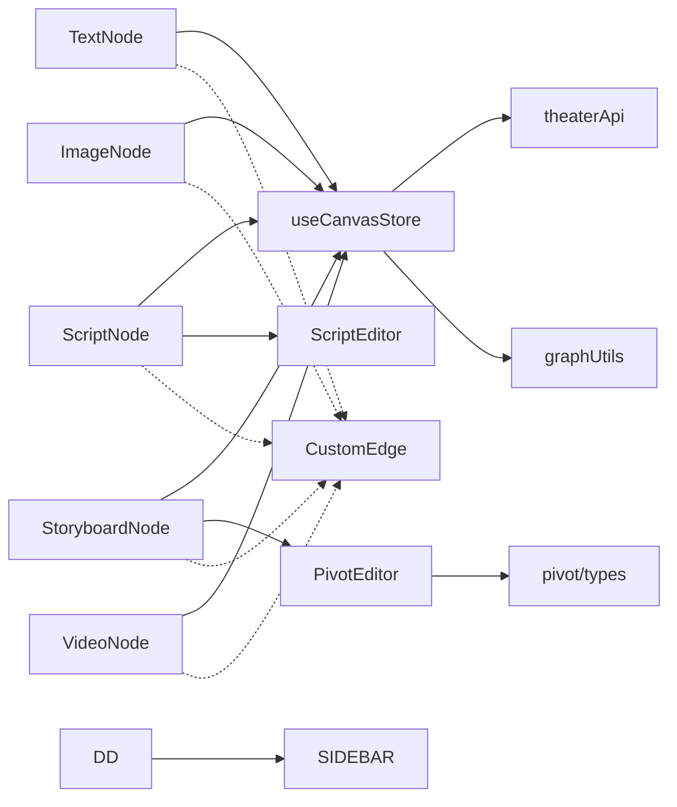

# 节点系统

<cite>
**本文档引用的文件**
- [CharacterNode.tsx](file://frontend/src/components/canvas/CharacterNode.tsx)
- [ScriptNode.tsx](file://frontend/src/components/canvas/ScriptNode.tsx)
- [StoryboardNode.tsx](file://frontend/src/components/canvas/StoryboardNode.tsx)
- [VideoNode.tsx](file://frontend/src/components/canvas/VideoNode.tsx)
- [CustomEdge.tsx](file://frontend/src/components/canvas/CustomEdge.tsx)
- [ScriptEditor.tsx](file://frontend/src/components/canvas/ScriptEditor.tsx)
- [PivotEditor.tsx](file://frontend/src/components/canvas/pivot/PivotEditor.tsx)
- [useCanvasDragDrop.ts](file://frontend/src/app/theater/[id]/hooks/useCanvasDragDrop.ts)
- [Sidebar.tsx](file://frontend/src/components/canvas/Sidebar.tsx)
- [useCanvasStore.ts](file://frontend/src/store/useCanvasStore.ts)
- [graphUtils.ts](file://frontend/src/lib/graphUtils.ts)
- [theaterApi.ts](file://frontend/src/lib/theaterApi.ts)
- [types.ts](file://frontend/src/components/canvas/pivot/types.ts)
- [script-editor.scss](file://frontend/src/components/canvas/script-editor.scss)
- [CharacterNode.test.tsx](file://frontend/src/components/canvas/__tests__/CharacterNode.test.tsx)
- [ScriptNode.test.tsx](file://frontend/src/components/canvas/__tests__/ScriptNode.test.tsx)
</cite>

## 更新摘要
**变更内容**
- 节点类型扩展：从原来的script/character/video扩展到text/image/video/storyboard四种节点类型
- 新增StoryboardNode组件，支持多维表格数据透视功能
- 更新节点类型枚举和默认尺寸配置
- 新增StoryboardNode数据结构和透视表类型定义
- 扩展侧边栏节点库，支持四种节点类型的快速添加

## 目录
1. [简介](#简介)
2. [项目结构](#项目结构)
3. [核心组件](#核心组件)
4. [架构总览](#架构总览)
5. [详细组件分析](#详细组件分析)
6. [依赖关系分析](#依赖关系分析)
7. [性能考量](#性能考量)
8. [故障排查指南](#故障排查指南)
9. [结论](#结论)
10. [附录](#附录)

## 简介
本文件面向节点系统的技术文档，聚焦于四种节点类型：文本节点（TextNode）、图片节点（ImageNode）、视频节点（VideoNode）与故事板节点（StoryboardNode）。文档从数据结构、属性定义、状态管理、渲染逻辑、样式定制、交互行为、组件组合与继承关系，以及序列化、持久化与版本控制机制等方面进行全面阐述，并辅以可视化图表帮助理解。

**更新** 节点系统现已扩展支持四种节点类型，包括新增的故事板节点，提供更丰富的创作工具和数据管理能力。

## 项目结构
节点系统位于前端工程的画布组件目录中，采用"按功能模块组织"的方式：
- 节点组件：CharacterNode、ScriptNode、StoryboardNode、VideoNode
- 边组件：CustomEdge
- 编辑器子组件：ScriptEditor、PivotEditor
- 状态管理：useCanvasStore（Zustand + 持久化）
- 工具与接口：graphUtils（拓扑检测）、theaterApi（后端同步）
- 类型定义：各节点数据类型与透视表类型

**图表来源**
- [useCanvasDragDrop.ts:36-72](file://frontend/src/app/theater/[id]/hooks/useCanvasDragDrop.ts#L36-L72)
- [Sidebar.tsx:9-50](file://frontend/src/components/canvas/Sidebar.tsx#L9-L50)
- [useCanvasStore.ts:44-58](file://frontend/src/store/useCanvasStore.ts#L44-L58)

## 核心组件
本节概述四种节点的核心职责与共同特性：
- 文本节点（TextNode）：承载富文本内容，集成 Tiptap 编辑器，支持标题编辑、字数统计、标签管理与复制删除。
- 图片节点（ImageNode）：承载图片资源与元数据，支持上传、缩放模式切换、预览、复制与删除。
- 视频节点（VideoNode）：承载视频资源与元数据，支持上传、缩放模式切换、复制与删除。
- 故事板节点（StoryboardNode）：承载多维透视表配置与展示，支持全屏编辑、复制与删除，提供数据透视分析能力。

这些节点共享统一的边连接热区设计、尺寸调整器与选中态高亮，通过统一的状态管理与边组件实现连接与删除。

**更新** 新增的四种节点类型扩展了系统的创作能力和数据管理范围，从纯媒体内容扩展到结构化数据和复杂分析场景。

## 架构总览
节点系统采用"组件-状态-工具-后端"分层架构：
- 组件层：节点与边组件负责渲染与交互。
- 状态层：Zustand Store 管理节点、边、视口、脏标记与历史快照。
- 工具层：拓扑检测防止循环依赖；编辑器工具链（Tiptap）提供富文本能力；透视表工具提供数据分析能力。
- 后端层：剧院（Theater）模型与画布数据的读写与同步。

**图表来源**
- [useCanvasStore.ts:120-142](file://frontend/src/store/useCanvasStore.ts#L120-L142)
- [graphUtils.ts:4-38](file://frontend/src/lib/graphUtils.ts#L4-L38)
- [CustomEdge.tsx:29-32](file://frontend/src/components/canvas/CustomEdge.tsx#L29-L32)
- [theaterApi.ts:141-150](file://frontend/src/lib/theaterApi.ts#L141-L150)

## 详细组件分析

### 文本节点（TextNode）
- 数据结构与属性
  - 标题、内容（Tiptap JSON）、标签、角色、场景等
- 渲染逻辑
  - 集成 ScriptEditor，支持富文本编辑与预览
  - 字数统计实时更新
- 交互行为
  - 双击或点击编辑按钮进入编辑模式
  - 完成编辑保存并退出，支持 ESC 快捷键
  - 悬浮操作：编辑、复制、删除
- 状态管理
  - 通过 Store 更新节点数据，触发快照与脏标记

**图表来源**
- [ScriptNode.tsx:67-111](file://frontend/src/components/canvas/ScriptNode.tsx#L67-L111)
- [ScriptNode.tsx:179-188](file://frontend/src/components/canvas/ScriptNode.tsx#L179-L188)
- [ScriptEditor.tsx:159-168](file://frontend/src/components/canvas/ScriptEditor.tsx#L159-L168)

**章节来源**
- [ScriptNode.tsx:11-351](file://frontend/src/components/canvas/ScriptNode.tsx#L11-L351)
- [ScriptEditor.tsx:117-280](file://frontend/src/components/canvas/ScriptEditor.tsx#L117-L280)

### 图片节点（ImageNode）
- 数据结构与属性
  - 名称、描述、图片地址、上传状态、适配模式（cover/contain）
- 渲染逻辑
  - 支持空态上传、上传进度、错误提示与成功回显
  - 图片加载完成后自动计算并设置节点尺寸
  - 双击进入全屏预览，支持拖拽平移与滚轮缩放
- 交互行为
  - 标题双击进入编辑，失焦或回车保存
  - 悬浮操作：AI 编辑、切换适配模式、复制、删除
  - 边连接热区：左右两侧隐藏 Handle 包裹器，提升拖拽体验
- 状态管理
  - 通过 Store 更新节点数据与尺寸，触发快照与脏标记
- 序列化与持久化
  - Store 使用 localStorage 持久化，合并去重，支持撤销/重做与剧院同步

**图表来源**
- [CharacterNode.tsx:126-205](file://frontend/src/components/canvas/CharacterNode.tsx#L126-L205)
- [CharacterNode.tsx:209-241](file://frontend/src/components/canvas/CharacterNode.tsx#L209-L241)
- [CharacterNode.tsx:244-310](file://frontend/src/components/canvas/CharacterNode.tsx#L244-L310)

**章节来源**
- [CharacterNode.tsx:13-692](file://frontend/src/components/canvas/CharacterNode.tsx#L13-L692)
- [useCanvasStore.ts:310-329](file://frontend/src/store/useCanvasStore.ts#L310-L329)

### 视频节点（VideoNode）
- 数据结构与属性
  - 名称、描述、视频地址、上传状态、适配模式（cover/contain）
- 渲染逻辑
  - 支持空态上传、上传进度、错误提示与成功回显
  - 视频元数据加载后自动计算并设置节点尺寸
- 交互行为
  - 标题双击进入编辑，失焦或回车保存
  - 悬浮操作：切换适配模式、复制、删除
  - 边连接热区：左右两侧隐藏 Handle 包裹器
- 状态管理
  - 通过 Store 更新节点数据与尺寸，触发快照与脏标记

**图表来源**
- [VideoNode.tsx:107-186](file://frontend/src/components/canvas/VideoNode.tsx#L107-L186)
- [VideoNode.tsx:190-222](file://frontend/src/components/canvas/VideoNode.tsx#L190-L222)

**章节来源**
- [VideoNode.tsx:10-534](file://frontend/src/components/canvas/VideoNode.tsx#L10-L534)
- [useCanvasStore.ts:310-329](file://frontend/src/store/useCanvasStore.ts#L310-L329)

### 故事板节点（StoryboardNode）
- 数据结构与属性
  - 镜头编号、描述、时长、透视配置与缓存数据
- 渲染逻辑
  - 未配置时显示引导骨架；已配置时显示数据透视结果提示蒙层
  - 双击进入全屏透视编辑器
- 交互行为
  - 悬浮操作：全屏编辑、复制、删除
  - 边连接热区：左右两侧隐藏 Handle 包裹器
- 编辑器子组件
  - PivotEditor：字段拖拽配置 Rows/Cols/Values，支持聚合方式与排序配置

**图表来源**
- [StoryboardNode.tsx:44-50](file://frontend/src/components/canvas/StoryboardNode.tsx#L44-L50)
- [types.ts:16-22](file://frontend/src/components/canvas/pivot/types.ts#L16-L22)
- [types.ts:9-14](file://frontend/src/components/canvas/pivot/types.ts#L9-L14)

**章节来源**
- [StoryboardNode.tsx:11-318](file://frontend/src/components/canvas/StoryboardNode.tsx#L11-L318)
- [PivotEditor.tsx:22-56](file://frontend/src/components/canvas/pivot/PivotEditor.tsx#L22-L56)
- [types.ts:1-28](file://frontend/src/components/canvas/pivot/types.ts#L1-L28)

### 边组件（CustomEdge）
- 渲染逻辑
  - 使用贝塞尔曲线绘制路径，支持选中态高亮
  - 隐形宽轨道提升 hover 感应面积
  - 边标签渲染器提供删除按钮
- 交互行为
  - 鼠标悬停显示删除按钮，点击删除对应边
- 状态管理
  - 通过 Store 删除边并触发快照与脏标记

**图表来源**
- [CustomEdge.tsx:29-32](file://frontend/src/components/canvas/CustomEdge.tsx#L29-L32)
- [useCanvasStore.ts:276-288](file://frontend/src/store/useCanvasStore.ts#L276-L288)

**章节来源**
- [CustomEdge.tsx:1-92](file://frontend/src/components/canvas/CustomEdge.tsx#L1-L92)
- [useCanvasStore.ts:276-288](file://frontend/src/store/useCanvasStore.ts#L276-L288)

## 依赖关系分析
- 组件耦合
  - 节点组件均依赖统一的 Store 与 React Flow 的 Handle/NodeResizer
  - ScriptNode 依赖 ScriptEditor，StoryboardNode 依赖 PivotEditor
- 外部依赖
  - Zustand（状态管理）、@xyflow/react（画布框架）、Tiptap（富文本）、Ant Design（透视编辑器 UI）
- 循环依赖规避
  - 通过拓扑检测在连接前阻止形成环路

**图表来源**
- [useCanvasStore.ts:185-540](file://frontend/src/store/useCanvasStore.ts#L185-L540)
- [theaterApi.ts:107-159](file://frontend/src/lib/theaterApi.ts#L107-L159)
- [graphUtils.ts:4-38](file://frontend/src/lib/graphUtils.ts#L4-L38)
- [ScriptEditor.tsx:117-280](file://frontend/src/components/canvas/ScriptEditor.tsx#L117-L280)
- [PivotEditor.tsx:22-56](file://frontend/src/components/canvas/pivot/PivotEditor.tsx#L22-L56)
- [types.ts:1-28](file://frontend/src/components/canvas/pivot/types.ts#L1-L28)

**章节来源**
- [useCanvasStore.ts:185-540](file://frontend/src/store/useCanvasStore.ts#L185-L540)

## 性能考量
- 上传与媒体处理
  - 使用对象 URL 本地预览，避免大文件阻塞 UI
  - 上传进度与错误提示减少用户等待焦虑
- 尺寸自适应
  - 图片/视频加载完成后根据自然尺寸与最大约束计算节点尺寸，避免频繁重排
- 编辑器性能
  - Tiptap 延迟渲染与内容规范化，减少不必要的重算
- 状态与历史
  - 历史快照上限控制，避免内存膨胀
  - 仅对显著变更（位置、尺寸、删除）标记脏状态，降低同步频率
- 节点类型扩展
  - 新增节点类型采用统一的默认尺寸配置，避免条件判断开销
  - 透视表编辑器按需加载，减少初始渲染压力

## 故障排查指南
- 上传失败
  - 检查文件类型与大小限制，确认后端上传接口可达
  - 查看 Store 中的上传状态与错误信息
- 无法连接节点
  - 检查是否形成环路（拓扑检测会阻止），确认源/目标节点不同
- 编辑器内容未更新
  - 确认编辑器可编辑状态与内容规范化流程
- 节点尺寸异常
  - 检查媒体加载回调与尺寸计算逻辑
- 新增节点类型问题
  - 检查节点类型枚举与默认尺寸配置是否正确
  - 确认透视表配置数据结构完整性

**章节来源**
- [useCanvasDragDrop.ts:36-72](file://frontend/src/app/theater/[id]/hooks/useCanvasDragDrop.ts#L36-L72)
- [Sidebar.tsx:9-50](file://frontend/src/components/canvas/Sidebar.tsx#L9-L50)
- [CharacterNode.tsx:126-205](file://frontend/src/components/canvas/CharacterNode.tsx#L126-L205)
- [VideoNode.tsx:107-186](file://frontend/src/components/canvas/VideoNode.tsx#L107-L186)
- [graphUtils.ts:4-38](file://frontend/src/lib/graphUtils.ts#L4-L38)
- [ScriptEditor.tsx:176-202](file://frontend/src/components/canvas/ScriptEditor.tsx#L176-L202)

## 结论
节点系统通过统一的状态管理与组件化设计，实现了文本、图片、视频与故事板四类节点的一致交互体验与强大的扩展性。结合富文本编辑器、透视表编辑器与边组件，系统在创作流程中提供了高效的内容组织与可视化编排能力。新增的故事板节点进一步增强了系统的数据分析和内容管理能力，支持复杂的多维数据透视需求。持久化与剧院同步机制保障了数据安全与协作一致性。

**更新** 四种节点类型的扩展显著提升了系统的创作灵活性和专业性，从基础的媒体内容管理扩展到结构化数据处理和分析，满足了更复杂的创作和协作需求。

## 附录

### 数据结构与类型定义
- 节点数据类型
  - 文本节点：标题、内容（Tiptap JSON）、标签、角色、场景
  - 图片节点：名称、描述、图片地址、上传状态、适配模式
  - 视频节点：名称、描述、视频地址、上传状态、适配模式
  - 故事板节点：镜头编号、描述、时长、透视配置、透视数据
- 透视表类型
  - 字段类型、聚合类型、配置结构与结果结构

**章节来源**
- [useCanvasStore.ts:27-58](file://frontend/src/store/useCanvasStore.ts#L27-L58)
- [types.ts:1-28](file://frontend/src/components/canvas/pivot/types.ts#L1-L28)

### 序列化、持久化与版本控制
- 持久化
  - Store 使用 localStorage 存储节点、边、视口与剧院信息
  - 合并策略去重节点，保证数据一致性
- 版本控制
  - 历史快照记录节点与边状态，支持撤销/重做
- 后端同步
  - 将节点与边映射为剧院 API 请求体，支持保存与拉取

**章节来源**
- [useCanvasStore.ts:511-538](file://frontend/src/store/useCanvasStore.ts#L511-L538)
- [useCanvasStore.ts:335-376](file://frontend/src/store/useCanvasStore.ts#L335-L376)
- [useCanvasStore.ts:120-168](file://frontend/src/store/useCanvasStore.ts#L120-L168)
- [theaterApi.ts:141-150](file://frontend/src/lib/theaterApi.ts#L141-L150)

### 节点类型扩展与配置
- 节点类型枚举
  - text：文本节点，用于剧本、广告等文案内容
  - image：图片节点，用于角色、场景、海报等图片资源
  - video：视频节点，用于动画、短片等媒体内容
  - storyboard：故事板节点，用于分镜、脚本等数据管理
- 默认尺寸配置
  - 文本节点：420×320像素
  - 图片节点：512×384像素
  - 视频节点：512×384像素
  - 故事板节点：768×512像素（较大尺寸以容纳透视表）

**章节来源**
- [useCanvasDragDrop.ts:36-72](file://frontend/src/app/theater/[id]/hooks/useCanvasDragDrop.ts#L36-L72)
- [Sidebar.tsx:9-50](file://frontend/src/components/canvas/Sidebar.tsx#L9-L50)

### 测试要点
- 文本节点
  - 进入/退出编辑模式、保存、取消、删除、边连接热区渲染
- 图片节点
  - 上传成功/失败、删除、复制、边连接热区渲染
- 新增故事板节点
  - 透视表配置编辑、数据预览、全屏编辑模式、复制删除功能

**章节来源**
- [CharacterNode.test.tsx:79-136](file://frontend/src/components/canvas/__tests__/CharacterNode.test.tsx#L79-L136)
- [CharacterNode.test.tsx:138-161](file://frontend/src/components/canvas/__tests__/CharacterNode.test.tsx#L138-L161)
- [ScriptNode.test.tsx:84-130](file://frontend/src/components/canvas/__tests__/ScriptNode.test.tsx#L84-L130)
- [ScriptNode.test.tsx:132-140](file://frontend/src/components/canvas/__tests__/ScriptNode.test.tsx#L132-L140)