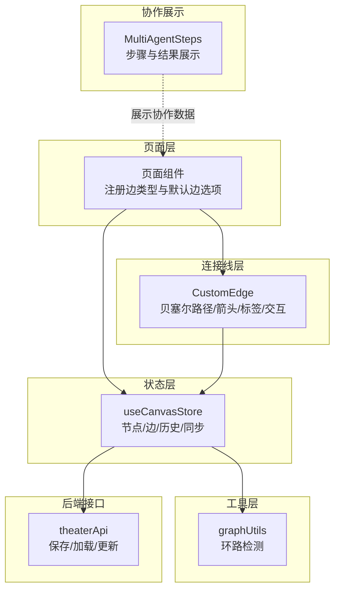
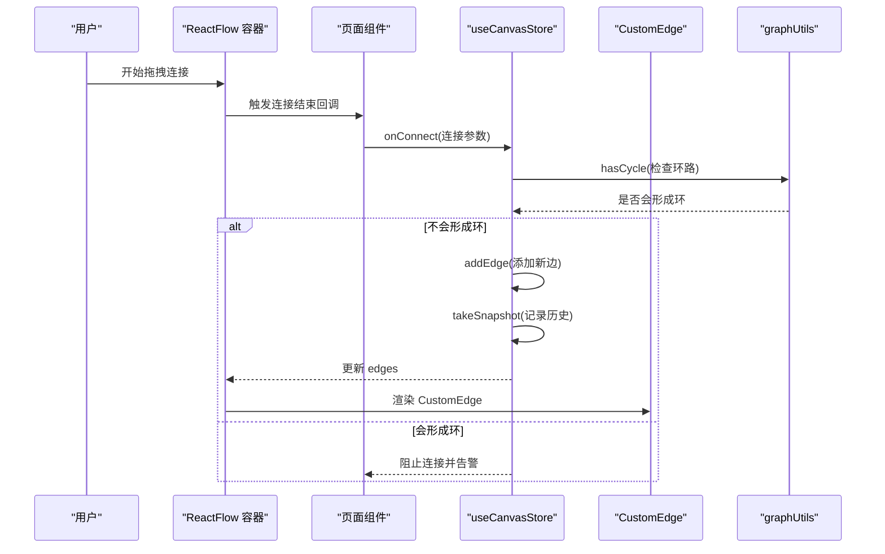
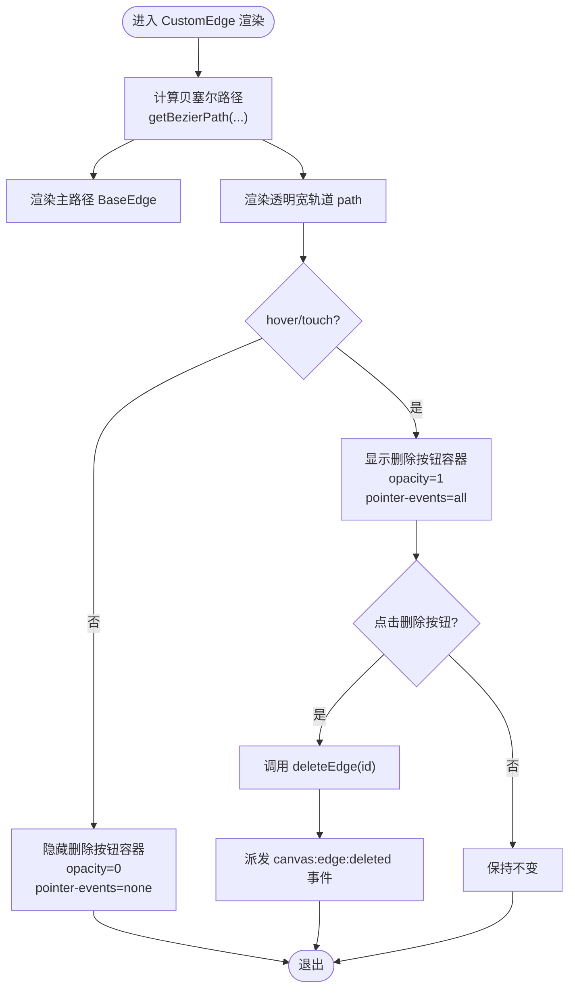
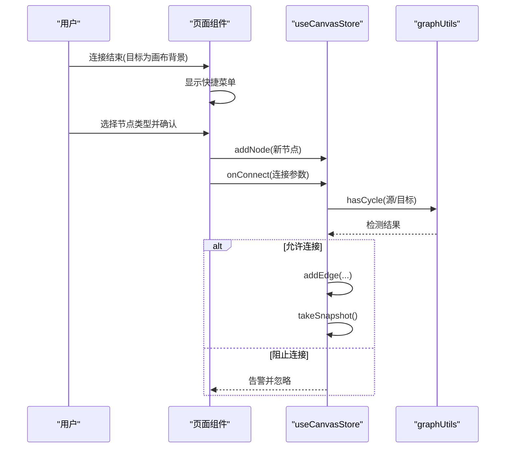
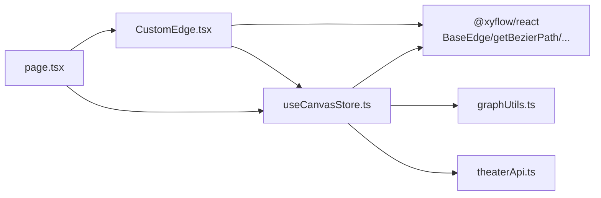

# 连接线管理

<cite>
**本文引用的文件**   
- [CustomEdge.tsx](file://frontend/src/components/canvas/CustomEdge.tsx)
- [useCanvasStore.ts](file://frontend/src/store/useCanvasStore.ts)
- [graphUtils.ts](file://frontend/src/lib/graphUtils.ts)
- [page.tsx](file://frontend/src/app/theater/[id]/page.tsx)
- [CustomEdge.test.tsx](file://frontend/src/components/canvas/__tests__/CustomEdge.test.tsx)
- [MultiAgentSteps.tsx](file://frontend/src/components/canvas/MultiAgentSteps.tsx)
- [theaterApi.ts](file://frontend/src/lib/theaterApi.ts)
</cite>

## 目录
1. [简介](#简介)
2. [项目结构](#项目结构)
3. [核心组件](#核心组件)
4. [架构总览](#架构总览)
5. [详细组件分析](#详细组件分析)
6. [依赖关系分析](#依赖关系分析)
7. [性能考量](#性能考量)
8. [故障排查指南](#故障排查指南)
9. [结论](#结论)
10. [附录](#附录)

## 简介
本文件面向“连接线管理系统”的技术文档，聚焦于 CustomEdge 自定义连接线组件的实现与使用。内容涵盖：
- 贝塞尔曲线绘制、箭头渲染与标签显示
- 连接线的创建、修改与删除逻辑，含起点终点验证与冲突检测
- 连接线状态管理：选中、hover、动画等
- 多智能体协作中的连接线表示与交互
- 样式定制、交互反馈与性能优化策略

## 项目结构
连接线系统主要由以下部分组成：
- ReactFlow 页面容器与默认边配置：在页面组件中注册自定义边类型与默认边选项
- CustomEdge 自定义边组件：负责路径计算、渲染、交互与标签显示
- useCanvasStore 状态管理：统一维护节点与边集合、历史快照、后端同步与变更处理
- 冲突检测工具：基于图算法判断是否会产生环路
- 多智能体协作展示组件：用于在画布上呈现协作步骤与结果
- 后端接口：负责剧场数据的持久化与同步

图表来源
- [page.tsx:44-52](file://frontend/src/app/theater/[id]/page.tsx#L44-L52)
- [CustomEdge.tsx:17-24](file://frontend/src/components/canvas/CustomEdge.tsx#L17-L24)
- [useCanvasStore.ts:238-254](file://frontend/src/store/useCanvasStore.ts#L238-L254)
- [graphUtils.ts:4-38](file://frontend/src/lib/graphUtils.ts#L4-L38)
- [MultiAgentSteps.tsx:28-127](file://frontend/src/components/canvas/MultiAgentSteps.tsx#L28-L127)
- [theaterApi.ts:141-150](file://frontend/src/lib/theaterApi.ts#L141-L150)

章节来源
- [page.tsx:44-52](file://frontend/src/app/theater/[id]/page.tsx#L44-L52)
- [CustomEdge.tsx:17-24](file://frontend/src/components/canvas/CustomEdge.tsx#L17-L24)
- [useCanvasStore.ts:238-254](file://frontend/src/store/useCanvasStore.ts#L238-L254)
- [graphUtils.ts:4-38](file://frontend/src/lib/graphUtils.ts#L4-L38)
- [MultiAgentSteps.tsx:28-127](file://frontend/src/components/canvas/MultiAgentSteps.tsx#L28-L127)
- [theaterApi.ts:141-150](file://frontend/src/lib/theaterApi.ts#L141-L150)

## 核心组件
- CustomEdge：基于 @xyflow/react 的 BaseEdge 与 getBezierPath 实现贝塞尔曲线路径；通过一个透明的“宽轨道”路径扩大 hover 区域；渲染可交互的删除按钮标签；根据选中/悬停状态动态调整描边宽度与颜色。
- useCanvasStore：集中管理 nodes、edges、历史快照、脏标记、后端同步；提供 onConnect、deleteEdge、takeSnapshot 等动作；在连接前进行自环与环路检测。
- graphUtils：hasCycle 使用邻接表 + DFS 检测新增边是否会导致环路。
- 页面组件：注册 edgeTypes.custom 并设置默认边样式；在连接结束时触发菜单以支持从连接点快速创建节点并建立连接。
- MultiAgentSteps：展示多智能体协作的步骤、状态与结果摘要，便于在画布中可视化协作流程。

章节来源
- [CustomEdge.tsx:5-91](file://frontend/src/components/canvas/CustomEdge.tsx#L5-L91)
- [useCanvasStore.ts:67-114](file://frontend/src/store/useCanvasStore.ts#L67-L114)
- [graphUtils.ts:4-38](file://frontend/src/lib/graphUtils.ts#L4-L38)
- [page.tsx:44-52](file://frontend/src/app/theater/[id]/page.tsx#L44-L52)
- [MultiAgentSteps.tsx:28-127](file://frontend/src/components/canvas/MultiAgentSteps.tsx#L28-L127)

## 架构总览
连接线系统围绕 ReactFlow 与 Zustand Store 构建，CustomEdge 作为边渲染器参与渲染与交互；useCanvasStore 统一处理连接、删除、历史与后端同步；graphUtils 提供图算法保障数据一致性。

图表来源
- [page.tsx:118-155](file://frontend/src/app/theater/[id]/page.tsx#L118-L155)
- [useCanvasStore.ts:238-254](file://frontend/src/store/useCanvasStore.ts#L238-L254)
- [graphUtils.ts:4-38](file://frontend/src/lib/graphUtils.ts#L4-L38)
- [CustomEdge.tsx:17-24](file://frontend/src/components/canvas/CustomEdge.tsx#L17-L24)

## 详细组件分析

### CustomEdge 组件
- 贝塞尔曲线绘制：调用 getBezierPath 计算路径与标签位置，传给 BaseEdge 渲染主路径。
- 箭头渲染：通过 markerEnd 属性传递给 BaseEdge，保持与默认边一致的箭头表现。
- 标签显示：使用 EdgeLabelRenderer 渲染绝对定位的删除按钮容器，仅在 hover 或 selected 时显示，支持鼠标与触摸事件。
- 交互反馈：通过透明宽轨道路径扩大 hover 区域；移动端触碰结束后延时隐藏按钮，避免误触。
- 删除逻辑：点击删除按钮后，调用 store.deleteEdge(id)，并派发自定义事件通知其他模块。

图表来源
- [CustomEdge.tsx:17-24](file://frontend/src/components/canvas/CustomEdge.tsx#L17-L24)
- [CustomEdge.tsx:34-88](file://frontend/src/components/canvas/CustomEdge.tsx#L34-L88)
- [useCanvasStore.ts:276-288](file://frontend/src/store/useCanvasStore.ts#L276-L288)

章节来源
- [CustomEdge.tsx:5-91](file://frontend/src/components/canvas/CustomEdge.tsx#L5-L91)
- [CustomEdge.test.tsx:22-109](file://frontend/src/components/canvas/__tests__/CustomEdge.test.tsx#L22-L109)
- [useCanvasStore.ts:276-288](file://frontend/src/store/useCanvasStore.ts#L276-L288)

### 连接线创建、修改与删除逻辑
- 创建：页面组件在连接结束时，若目标为画布背景区域则弹出快捷菜单；选择节点类型后，构造新节点与连接参数，调用 onConnect 完成连接。store.onConnect 在添加前执行自环与环路检测，阻止无效连接。
- 修改：当前实现未提供直接编辑边属性的入口；如需修改样式或动画，可通过更新边对象的 style/animated 字段并触发状态变更。
- 删除：CustomEdge 删除按钮调用 store.deleteEdge(id)，同时移除与该边关联的入边与出边；随后 takeSnapshot 记录历史。

图表来源
- [page.tsx:118-219](file://frontend/src/app/theater/[id]/page.tsx#L118-L219)
- [useCanvasStore.ts:238-254](file://frontend/src/store/useCanvasStore.ts#L238-L254)
- [graphUtils.ts:4-38](file://frontend/src/lib/graphUtils.ts#L4-L38)

章节来源
- [page.tsx:118-219](file://frontend/src/app/theater/[id]/page.tsx#L118-L219)
- [useCanvasStore.ts:238-254](file://frontend/src/store/useCanvasStore.ts#L238-L254)
- [graphUtils.ts:4-38](file://frontend/src/lib/graphUtils.ts#L4-L38)

### 状态管理：选中、hover 与动画
- 选中状态：边 props 中的 selected 为真时，边描边加粗并切换颜色；标签容器也相应显示。
- hover 状态：通过透明宽轨道 path 的 mouseenter/mouseleave 与 touchstart/touchend 控制按钮显隐与延迟隐藏。
- 动画效果：默认边选项中启用 animated；CustomEdge 未覆盖该属性，沿用默认行为。

章节来源
- [CustomEdge.tsx:27-68](file://frontend/src/components/canvas/CustomEdge.tsx#L27-L68)
- [page.tsx:48-52](file://frontend/src/app/theater/[id]/page.tsx#L48-L52)

### 多智能体协作中的连接线表示
- 数据模型：MultiAgentSteps 接受 steps 数组与统计信息，用于展示每个子任务的代理名、描述、状态与结果。
- 与连接线的关系：在画布中，连接线可表示协作步骤之间的流转；结合 MultiAgentSteps 可以直观查看每一步的执行情况与最终结果。
- 展示要点：组件支持展开/折叠、状态图标、Token 消耗与积分消耗统计，便于在画布面板中呈现协作全貌。

章节来源
- [MultiAgentSteps.tsx:7-26](file://frontend/src/components/canvas/MultiAgentSteps.tsx#L7-L26)
- [MultiAgentSteps.tsx:28-127](file://frontend/src/components/canvas/MultiAgentSteps.tsx#L28-L127)

### 样式定制与交互反馈
- 样式定制：默认边选项中设置 stroke 与 strokeWidth；CustomEdge 在 hover/selected 时动态调整描边宽度与颜色，删除按钮采用主题色与缩放过渡。
- 交互反馈：删除按钮容器在 hover/selected 时透明度渐变；移动端触控后自动隐藏，避免遮挡后续操作。
- 标签渲染：EdgeLabelRenderer 提供绝对定位容器，支持在路径上方显示可交互元素。

章节来源
- [page.tsx:48-52](file://frontend/src/app/theater/[id]/page.tsx#L48-L52)
- [CustomEdge.tsx:36-68](file://frontend/src/components/canvas/CustomEdge.tsx#L36-L68)

## 依赖关系分析
- CustomEdge 依赖：
  - @xyflow/react：BaseEdge、getBezierPath、EdgeLabelRenderer、Position
  - useCanvasStore：deleteEdge、selected 状态
- useCanvasStore 依赖：
  - @xyflow/react：Edge、Connection、addEdge、applyEdgeChanges
  - graphUtils：hasCycle
  - theaterApi：保存/加载/更新画布数据
- 页面组件依赖：
  - ReactFlow、ReactFlowProvider、useReactFlow
  - 自定义边类型与默认边选项

图表来源
- [CustomEdge.tsx:1-3](file://frontend/src/components/canvas/CustomEdge.tsx#L1-L3)
- [useCanvasStore.ts:4-24](file://frontend/src/store/useCanvasStore.ts#L4-L24)
- [graphUtils.ts:2](file://frontend/src/lib/graphUtils.ts#L2)
- [theaterApi.ts:1](file://frontend/src/lib/theaterApi.ts#L1)
- [page.tsx:18-29](file://frontend/src/app/theater/[id]/page.tsx#L18-L29)

章节来源
- [CustomEdge.tsx:1-3](file://frontend/src/components/canvas/CustomEdge.tsx#L1-L3)
- [useCanvasStore.ts:4-24](file://frontend/src/store/useCanvasStore.ts#L4-L24)
- [graphUtils.ts:2](file://frontend/src/lib/graphUtils.ts#L2)
- [theaterApi.ts:1](file://frontend/src/lib/theaterApi.ts#L1)
- [page.tsx:18-29](file://frontend/src/app/theater/[id]/page.tsx#L18-L29)

## 性能考量
- 路径计算：getBezierPath 为纯函数，按需调用；避免在高频重渲染场景下重复计算，可在上层缓存必要参数。
- 事件绑定：透明宽轨道 path 仅用于扩大 hover 区域，不引入复杂逻辑；注意移动端触控事件的节流与定时器清理。
- 边数量增长：当边数较多时，建议：
  - 合理设置连接半径与连接模式，减少无效连接尝试
  - 对标签容器使用条件渲染（仅在 hover/selected 时挂载）
  - 将动画关闭或按需开启，降低 SVG 重绘开销
- 历史快照：takeSnapshot 会复制 nodes/edges，频繁变更时应控制快照频率或合并变更批次

## 故障排查指南
- 连接被阻止
  - 现象：连接结束但无新边生成
  - 排查：检查是否自环或环路检测触发；查看控制台是否有环路告警
  - 参考
    - [useCanvasStore.ts:244-248](file://frontend/src/store/useCanvasStore.ts#L244-L248)
    - [graphUtils.ts:4-38](file://frontend/src/lib/graphUtils.ts#L4-L38)
- 删除按钮不显示
  - 现象：hover/selected 时删除按钮仍不可见
  - 排查：确认 EdgeLabelRenderer 容器的 opacity/pointer-events 条件；检查 isHovered 状态切换逻辑
  - 参考
    - [CustomEdge.tsx:27-68](file://frontend/src/components/canvas/CustomEdge.tsx#L27-L68)
    - [CustomEdge.test.tsx:53-75](file://frontend/src/components/canvas/__tests__/CustomEdge.test.tsx#L53-L75)
- 删除后无响应
  - 现象：点击删除按钮无变化
  - 排查：确认 store.deleteEdge 是否被调用；检查自定义事件是否被监听
  - 参考
    - [CustomEdge.tsx:29-32](file://frontend/src/components/canvas/CustomEdge.tsx#L29-L32)
    - [useCanvasStore.ts:276-288](file://frontend/src/store/useCanvasStore.ts#L276-L288)
- 后端保存失败
  - 现象：保存状态长时间处于“保存中”
  - 排查：检查 saveToBackend 的异常处理与 isSaving 标志；确认网络请求与权限
  - 参考
    - [useCanvasStore.ts:478-505](file://frontend/src/store/useCanvasStore.ts#L478-L505)
    - [theaterApi.ts:141-150](file://frontend/src/lib/theaterApi.ts#L141-L150)

## 结论
本系统通过 CustomEdge 与 useCanvasStore 的协同，实现了高性能、可交互的连接线管理能力。其关键特性包括：
- 基于贝塞尔曲线的流畅路径与箭头渲染
- 增强的 hover/selected 交互体验与删除反馈
- 强约束的连接规则（自环与环路检测）确保数据一致性
- 与多智能体协作展示组件的无缝衔接
建议在大规模场景中进一步优化路径计算与标签渲染策略，以获得更佳的性能与用户体验。

## 附录
- 默认边选项
  - 类型：custom
  - 动画：开启
  - 样式：主色调描边，宽度 2
  - 参考
    - [page.tsx:48-52](file://frontend/src/app/theater/[id]/page.tsx#L48-L52)
- 边到后端映射
  - 字段包含：id、source/target、handle、edge_type、animated、style
  - 参考
    - [useCanvasStore.ts:144-168](file://frontend/src/store/useCanvasStore.ts#L144-L168)
    - [theaterApi.ts:71-86](file://frontend/src/lib/theaterApi.ts#L71-L86)