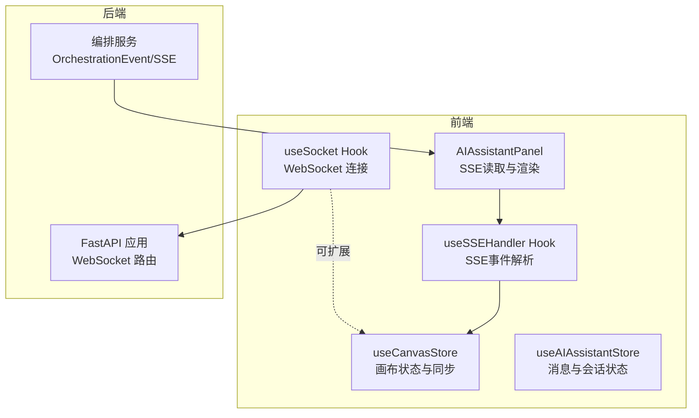
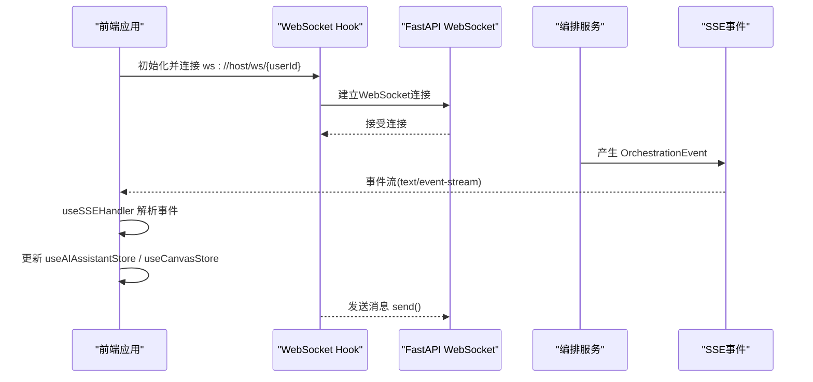
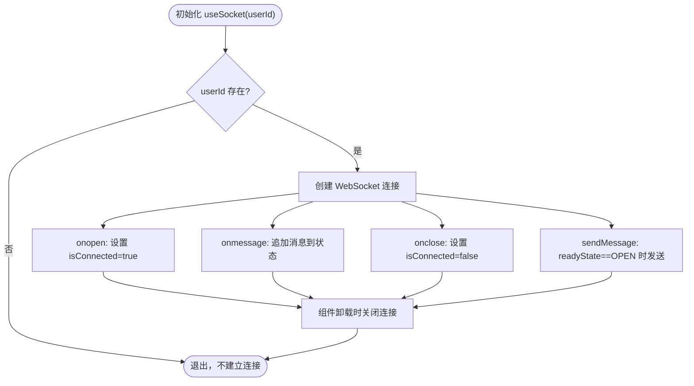
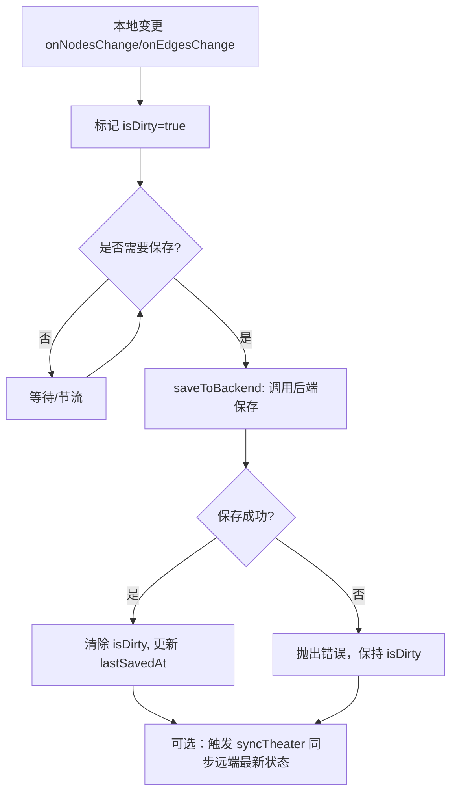
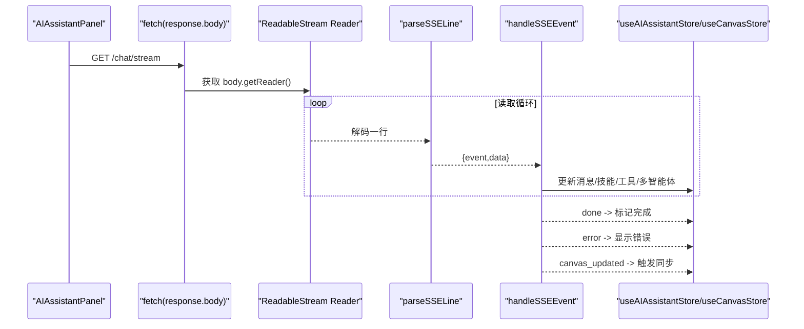
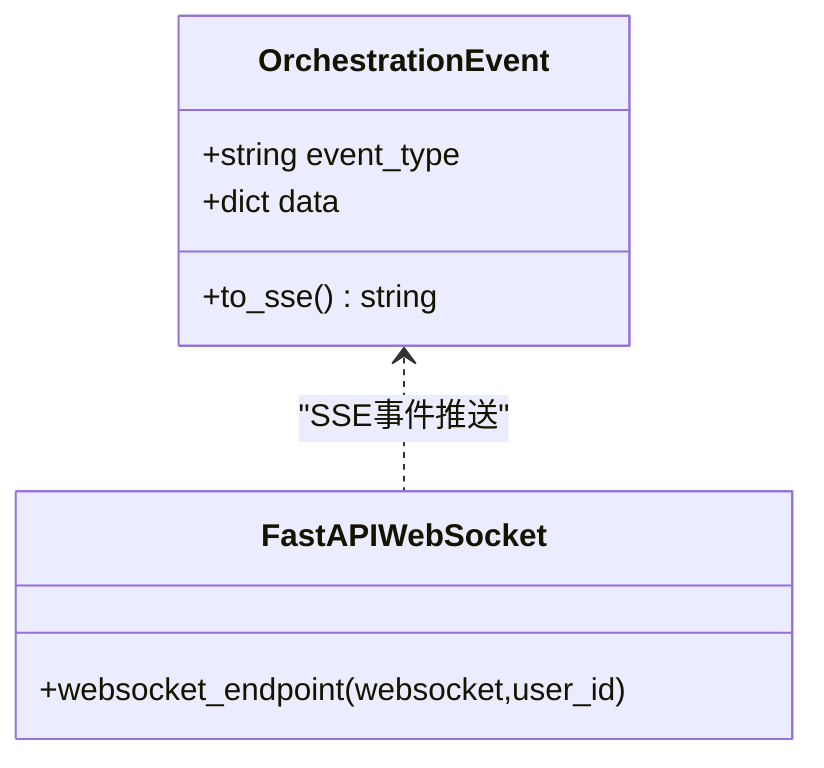
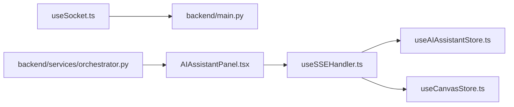

# 实时协作功能

<cite>
**本文档引用的文件**
- [frontend/src/hooks/useSocket.ts](file://frontend/src/hooks/useSocket.ts)
- [frontend/src/store/useCanvasStore.ts](file://frontend/src/store/useCanvasStore.ts)
- [frontend/src/components/ai-assistant/hooks/useSSEHandler.ts](file://frontend/src/components/ai-assistant/hooks/useSSEHandler.ts)
- [frontend/src/store/useAIAssistantStore.ts](file://frontend/src/store/useAIAssistantStore.ts)
- [backend/main.py](file://backend/main.py)
- [backend/services/orchestrator.py](file://backend/services/orchestrator.py)
- [frontend/src/components/canvas/AIAssistantPanel.tsx](file://frontend/src/components/canvas/AIAssistantPanel.tsx)
- [frontend/src/store/__tests__/useCanvasStore.test.ts](file://frontend/src/store/__tests__/useCanvasStore.test.ts)
</cite>

## 目录
1. [简介](#简介)
2. [项目结构](#项目结构)
3. [核心组件](#核心组件)
4. [架构总览](#架构总览)
5. [详细组件分析](#详细组件分析)
6. [依赖关系分析](#依赖关系分析)
7. [性能考虑](#性能考虑)
8. [故障排查指南](#故障排查指南)
9. [结论](#结论)
10. [附录](#附录)

## 简介
本文件面向Infinite Game实时协作系统，聚焦以下目标：
- WebSocket连接的建立与管理：连接状态监控、断线重连机制与错误处理
- 实时数据同步策略：画布状态同步、用户光标共享、冲突解决
- 并发控制与一致性：乐观锁、版本管理与数据一致性保障
- AI助手的实时交互：流式响应处理、消息队列与用户反馈
- 性能优化：消息压缩、批量更新、延迟处理
- 调试与监控：工具与指标配置

## 项目结构
前端采用React + Zustand状态管理，后端基于FastAPI提供WebSocket与REST服务。实时协作涉及：
- 前端WebSocket Hook与画布状态存储
- SSE事件解析与AI助手面板
- 后端WebSocket路由与编排服务

**图表来源**
- [frontend/src/hooks/useSocket.ts:1-42](file://frontend/src/hooks/useSocket.ts#L1-L42)
- [frontend/src/store/useCanvasStore.ts:67-539](file://frontend/src/store/useCanvasStore.ts#L67-L539)
- [frontend/src/components/ai-assistant/hooks/useSSEHandler.ts:1-335](file://frontend/src/components/ai-assistant/hooks/useSSEHandler.ts#L1-L335)
- [frontend/src/store/useAIAssistantStore.ts:1-274](file://frontend/src/store/useAIAssistantStore.ts#L1-L274)
- [backend/main.py:160-170](file://backend/main.py#L160-L170)
- [backend/services/orchestrator.py:47-118](file://backend/services/orchestrator.py#L47-L118)

**章节来源**
- [frontend/src/hooks/useSocket.ts:1-42](file://frontend/src/hooks/useSocket.ts#L1-L42)
- [frontend/src/store/useCanvasStore.ts:67-539](file://frontend/src/store/useCanvasStore.ts#L67-L539)
- [frontend/src/components/ai-assistant/hooks/useSSEHandler.ts:1-335](file://frontend/src/components/ai-assistant/hooks/useSSEHandler.ts#L1-L335)
- [frontend/src/store/useAIAssistantStore.ts:1-274](file://frontend/src/store/useAIAssistantStore.ts#L1-L274)
- [backend/main.py:160-170](file://backend/main.py#L160-L170)
- [backend/services/orchestrator.py:47-118](file://backend/services/orchestrator.py#L47-L118)

## 核心组件
- WebSocket连接与消息收发：前端通过自定义Hook封装WebSocket生命周期与发送接口
- 画布状态存储与同步：Zustand状态管理，支持本地快照、撤销/重做与后端保存
- SSE事件解析：统一解析text/event-stream，驱动AI消息、工具/技能调用、多智能体步骤等
- AI助手会话：持久化消息、面板状态与多画布会话切换
- 后端WebSocket与编排：提供WebSocket路由与SSE事件格式化输出

**章节来源**
- [frontend/src/hooks/useSocket.ts:1-42](file://frontend/src/hooks/useSocket.ts#L1-L42)
- [frontend/src/store/useCanvasStore.ts:67-539](file://frontend/src/store/useCanvasStore.ts#L67-L539)
- [frontend/src/components/ai-assistant/hooks/useSSEHandler.ts:1-335](file://frontend/src/components/ai-assistant/hooks/useSSEHandler.ts#L1-L335)
- [frontend/src/store/useAIAssistantStore.ts:1-274](file://frontend/src/store/useAIAssistantStore.ts#L1-L274)
- [backend/main.py:160-170](file://backend/main.py#L160-L170)
- [backend/services/orchestrator.py:47-118](file://backend/services/orchestrator.py#L47-L118)

## 架构总览
下图展示了从前端WebSocket到后端编排服务的完整链路，以及SSE事件如何驱动前端UI更新。

**图表来源**
- [frontend/src/hooks/useSocket.ts:1-42](file://frontend/src/hooks/useSocket.ts#L1-L42)
- [backend/main.py:160-170](file://backend/main.py#L160-L170)
- [backend/services/orchestrator.py:47-118](file://backend/services/orchestrator.py#L47-L118)
- [frontend/src/components/ai-assistant/hooks/useSSEHandler.ts:1-335](file://frontend/src/components/ai-assistant/hooks/useSSEHandler.ts#L1-L335)

## 详细组件分析

### WebSocket连接与管理
- 连接建立：在有userId时创建WebSocket，监听onopen/onmessage/onclose
- 状态管理：维护isConnected与消息数组，提供sendMessage接口
- 断开处理：关闭时重置连接状态；可在此基础上扩展指数退避重连
- 错误处理：捕获异常并关闭连接，避免资源泄漏

**图表来源**
- [frontend/src/hooks/useSocket.ts:1-42](file://frontend/src/hooks/useSocket.ts#L1-L42)

**章节来源**
- [frontend/src/hooks/useSocket.ts:1-42](file://frontend/src/hooks/useSocket.ts#L1-L42)

### 画布状态同步与并发控制
- 状态模型：节点、边、视口、脏标记、历史快照、撤销/重做索引
- 同步流程：loadTheater获取后端详情，syncTheater进行差异合并，saveToBackend批量保存
- 冲突解决：对节点/边逐项比较，相同则保留本地选中/拖拽状态，不同则覆盖数据
- 版本与一致性：isDirty标记与lastSavedAt时间戳，结合后端保存成功后清除脏标记
- 乐观锁思路：当前实现未显式版本号，可通过在saveToBackend返回版本号并在下次sync时携带版本参数实现

**图表来源**
- [frontend/src/store/useCanvasStore.ts:67-539](file://frontend/src/store/useCanvasStore.ts#L67-L539)

**章节来源**
- [frontend/src/store/useCanvasStore.ts:67-539](file://frontend/src/store/useCanvasStore.ts#L67-L539)
- [frontend/src/store/__tests__/useCanvasStore.test.ts:52-123](file://frontend/src/store/__tests__/useCanvasStore.test.ts#L52-L123)

### AI助手实时交互与SSE处理
- SSE读取：AIAssistantPanel通过fetch读取SSE流，逐行解析event/data
- 事件解析：useSSEHandler根据事件类型更新消息、技能/工具调用、多智能体步骤
- 用户反馈：完成事件将流式消息标记为complete，错误事件显示错误提示
- 画布联动：接收canvas_updated事件后触发画布同步

**图表来源**
- [frontend/src/components/canvas/AIAssistantPanel.tsx:138-177](file://frontend/src/components/canvas/AIAssistantPanel.tsx#L138-L177)
- [frontend/src/components/ai-assistant/hooks/useSSEHandler.ts:1-335](file://frontend/src/components/ai-assistant/hooks/useSSEHandler.ts#L1-L335)
- [frontend/src/store/useAIAssistantStore.ts:1-274](file://frontend/src/store/useAIAssistantStore.ts#L1-L274)

**章节来源**
- [frontend/src/components/canvas/AIAssistantPanel.tsx:138-177](file://frontend/src/components/canvas/AIAssistantPanel.tsx#L138-L177)
- [frontend/src/components/ai-assistant/hooks/useSSEHandler.ts:1-335](file://frontend/src/components/ai-assistant/hooks/useSSEHandler.ts#L1-L335)
- [frontend/src/store/useAIAssistantStore.ts:1-274](file://frontend/src/store/useAIAssistantStore.ts#L1-L274)

### 后端WebSocket与编排
- WebSocket路由：/ws/{user_id}接受连接并回显消息
- 编排事件：OrchestrationEvent提供SSE格式化方法，便于后端向前端推送事件流
- 可扩展性：可在WebSocket会话中维护用户会话映射，结合SSE事件实现多用户协作

**图表来源**
- [backend/services/orchestrator.py:47-118](file://backend/services/orchestrator.py#L47-L118)
- [backend/main.py:160-170](file://backend/main.py#L160-L170)

**章节来源**
- [backend/main.py:160-170](file://backend/main.py#L160-L170)
- [backend/services/orchestrator.py:47-118](file://backend/services/orchestrator.py#L47-L118)

## 依赖关系分析
- 前端依赖关系
  - useSocket依赖浏览器WebSocket API
  - useCanvasStore依赖Zustand与后端API模块
  - useSSEHandler依赖AI助手状态与画布状态
  - AIAssistantPanel依赖SSE读取与事件解析
- 后端依赖关系
  - FastAPI提供WebSocket路由
  - 编排服务提供SSE事件格式化能力

**图表来源**
- [frontend/src/hooks/useSocket.ts:1-42](file://frontend/src/hooks/useSocket.ts#L1-L42)
- [frontend/src/store/useCanvasStore.ts:67-539](file://frontend/src/store/useCanvasStore.ts#L67-L539)
- [frontend/src/components/ai-assistant/hooks/useSSEHandler.ts:1-335](file://frontend/src/components/ai-assistant/hooks/useSSEHandler.ts#L1-L335)
- [frontend/src/store/useAIAssistantStore.ts:1-274](file://frontend/src/store/useAIAssistantStore.ts#L1-L274)
- [frontend/src/components/canvas/AIAssistantPanel.tsx:138-177](file://frontend/src/components/canvas/AIAssistantPanel.tsx#L138-L177)
- [backend/main.py:160-170](file://backend/main.py#L160-L170)
- [backend/services/orchestrator.py:47-118](file://backend/services/orchestrator.py#L47-L118)

**章节来源**
- [frontend/src/hooks/useSocket.ts:1-42](file://frontend/src/hooks/useSocket.ts#L1-L42)
- [frontend/src/store/useCanvasStore.ts:67-539](file://frontend/src/store/useCanvasStore.ts#L67-L539)
- [frontend/src/components/ai-assistant/hooks/useSSEHandler.ts:1-335](file://frontend/src/components/ai-assistant/hooks/useSSEHandler.ts#L1-L335)
- [frontend/src/store/useAIAssistantStore.ts:1-274](file://frontend/src/store/useAIAssistantStore.ts#L1-L274)
- [frontend/src/components/canvas/AIAssistantPanel.tsx:138-177](file://frontend/src/components/canvas/AIAssistantPanel.tsx#L138-L177)
- [backend/main.py:160-170](file://backend/main.py#L160-L170)
- [backend/services/orchestrator.py:47-118](file://backend/services/orchestrator.py#L47-L118)

## 性能考虑
- 消息压缩：SSE传输建议启用gzip/deflate压缩（后端可配置），减少带宽占用
- 批量更新：画布保存采用批量提交，避免频繁网络往返；可引入差量更新策略
- 延迟处理：对高频变更（如拖拽、缩放）采用节流/防抖，降低保存频率
- 连接复用：同一用户的多个功能共享WebSocket连接，减少握手开销
- 历史快照：限制最大历史长度，避免内存膨胀；必要时持久化到IndexedDB

[本节为通用指导，无需具体文件引用]

## 故障排查指南
- WebSocket连接问题
  - 检查userId是否为空，确认URL路径正确
  - 查看onclose回调与异常捕获，定位断开原因
  - 在生产环境增加指数退避重连与心跳保活
- SSE解析异常
  - 确认后端SSE事件格式符合“event: …”与“data: …”规范
  - 检查流中断与解码错误，确保缓冲区正确拼接
- 画布同步失败
  - 核对saveToBackend返回值与isDirty状态
  - 使用测试用例验证离线重试与连续编辑场景
- 权限与CORS
  - 后端已配置CORS白名单，确保前端Origin匹配

**章节来源**
- [frontend/src/hooks/useSocket.ts:1-42](file://frontend/src/hooks/useSocket.ts#L1-L42)
- [frontend/src/components/ai-assistant/hooks/useSSEHandler.ts:1-335](file://frontend/src/components/ai-assistant/hooks/useSSEHandler.ts#L1-L335)
- [frontend/src/store/__tests__/useCanvasStore.test.ts:52-123](file://frontend/src/store/__tests__/useCanvasStore.test.ts#L52-L123)
- [backend/main.py:130-136](file://backend/main.py#L130-L136)

## 结论
本系统通过WebSocket与SSE实现了前后端的低延迟实时通信，结合Zustand状态管理与后端编排服务，提供了画布协作与AI助手的流畅体验。后续可在以下方面进一步完善：
- WebSocket断线重连与心跳保活
- 画布版本号与乐观锁机制
- SSE事件的幂等与去重策略
- 性能监控与埋点上报

[本节为总结性内容，无需具体文件引用]

## 附录
- 开发与调试建议
  - 使用浏览器开发者工具Network面板观察WebSocket与SSE流量
  - 在后端开启详细日志，定位异常与性能瓶颈
  - 对关键路径添加单元测试与集成测试，覆盖边界条件

[本节为通用建议，无需具体文件引用]